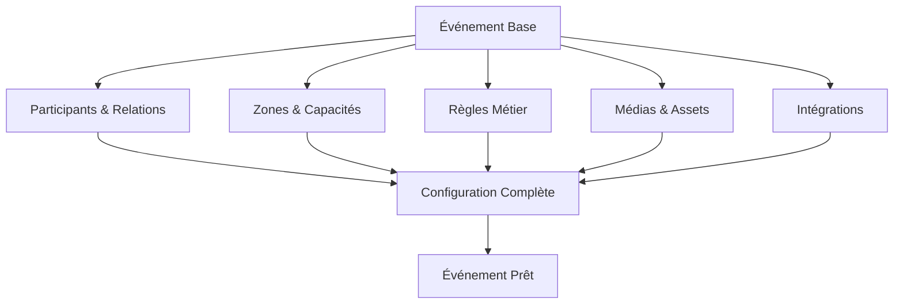

# Documentation Configuration Avancée des Événements - Entrix V2.1
## Guide Complet avec Exemples Détaillés

---

## 📋 Table des Matières

1. [Vue d'ensemble de la configuration avancée](#vue-ensemble)
2. [Gestion des participants et relations](#gestion-participants)
3. [Configuration des zones et mappings](#configuration-zones)
4. [Règles métier et restrictions](#regles-restrictions)
5. [Médias et contenu riche](#medias-contenu)
6. [Intégrations externes](#integrations-externes)
7. [Automatisations et workflows](#automatisations-workflows)
8. [Templates et réutilisabilité](#templates-reutilisabilite)

---

## 🔍 Vue d'ensemble de la configuration avancée {#vue-ensemble}

### Architecture de configuration



### Niveaux de configuration

| Niveau | Complexité | Cas d'usage | Exemples |
|--------|------------|-------------|----------|
| **Basique** | Simple | Événements standards | Match régulier, Concert simple |
| **Intermédiaire** | Modérée | Événements spéciaux | Derby, Festival 1 jour |
| **Avancé** | Complexe | Multi-jours, Multi-zones | Festival 3 jours, Tournoi |
| **Expert** | Très complexe | Événements hybrides | Conférence + Streaming + Workshops |

---

## 👥 Gestion des participants et relations {#gestion-participants}

### Configuration multi-participants

**Exemple : Tournoi de Basketball à 4 équipes**
```sql
-- Création événement tournoi
INSERT INTO events (
    id, code, name, organizer_id, category_id, venue_id,
    scheduled_start, scheduled_end, max_capacity, status, metadata
) VALUES (
    'evt_tournoi_001',
    'EVT_2025_TOURNOI_BASKET',
    'Tournoi International Basketball Tunis 2025',
    'd7e6f5g4-c3b2-1a0f-9e8d-7c6b5a4c3d2e',
    'cat_basketball_pro',
    'venue_salle_el_menzah',
    '2025-03-20T14:00:00+01:00',
    '2025-03-20T22:00:00+01:00',
    8000,
    'DRAFT',
    jsonb_build_object(
        'tournament_format', 'single_elimination',
        'matches', ARRAY[
            jsonb_build_object('type', 'semi_final_1', 'time', '14:00'),
            jsonb_build_object('type', 'semi_final_2', 'time', '16:00'),
            jsonb_build_object('type', 'third_place', 'time', '18:00'),
            jsonb_build_object('type', 'final', 'time', '20:00')
        ]
    )
);

-- Configuration des équipes participantes
INSERT INTO event_participants (
    id, event_id, participant_id, role, display_order, metadata
) VALUES 
    -- Équipe 1 : Club Africain
    (
        gen_random_uuid(),
        'evt_tournoi_001',
        'part_ca_basket',
        'COMPETITOR',
        1,
        jsonb_build_object(
            'seed', 1,
            'pool', 'A',
            'jersey_color', 'red_white',
            'previous_titles', 3,
            'coach', 'Mourad Ben Salem',
            'star_players', ARRAY['Ahmed Addami', 'Salah Mejri']
        )
    ),
    -- Équipe 2 : EST
    (
        gen_random_uuid(),
        'evt_tournoi_001',
        'part_est_basket',
        'COMPETITOR',
        2,
        jsonb_build_object(
            'seed', 2,
            'pool', 'A',
            'jersey_color', 'yellow_red',
            'previous_titles', 2
        )
    ),
    -- Équipe 3 : Étoile du Sahel
    (
        gen_random_uuid(),
        'evt_tournoi_001',
        'part_ess_basket',
        'COMPETITOR',
        3,
        jsonb_build_object(
            'seed', 3,
            'pool', 'B',
            'jersey_color', 'red_white_stripes'
        )
    ),
    -- Équipe 4 : US Monastir
    (
        gen_random_uuid(),
        'evt_tournoi_001',
        'part_usm_basket',
        'COMPETITOR',
        4,
        jsonb_build_object(
            'seed', 4,
            'pool', 'B',
            'jersey_color', 'blue_white'
        )
    ),
    -- Arbitres internationaux
    (
        gen_random_uuid(),
        'evt_tournoi_001',
        'part_referee_team_fiba',
        'REFEREE',
        5,
        jsonb_build_object(
            'referee_grade', 'FIBA_INTERNATIONAL',
            'team_size', 6,
            'head_referee', 'Mohamed Lahmar',
            'assignments', jsonb_build_object(
                'semi_final_1', ARRAY['Lahmar', 'Ben Salah', 'Trabelsi'],
                'semi_final_2', ARRAY['Gharbi', 'Mejri', 'Kacem'],
                'final', ARRAY['Lahmar', 'Gharbi', 'Ben Salah']
            )
        )
    ),
    -- Animateur/Speaker
    (
        gen_random_uuid(),
        'evt_tournoi_001',
        'part_speaker_001',
        'PRESENTER',
        6,
        jsonb_build_object(
            'name', 'Hatem Ben Arfa',
            'role', 'MC/Commentateur',
            'experience', '15 ans',
            'languages', ARRAY['ar', 'fr', 'en']
        )
    );
```

### Relations complexes entre participants

```sql
-- Définir rivalités et historiques
INSERT INTO participant_relationships (
    participant_a_id, participant_b_id, relationship_type, 
    intensity, description, metadata
) VALUES 
    -- Rivalité CA vs EST
    (
        'part_ca_basket',
        'part_est_basket',
        'RIVALRY',
        10,
        'Derby historique du basketball tunisien',
        jsonb_build_object(
            'matches_played', 156,
            'ca_wins', 78,
            'est_wins', 78,
            'last_encounter', '2024-12-20',
            'biggest_win_ca', '98-72 (2019)',
            'biggest_win_est', '95-68 (2021)'
        )
    ),
    -- Partenariat technique
    (
        'part_ca_basket',
        'part_equipment_nike',
        'SPONSOR',
        8,
        'Équipementier officiel',
        jsonb_build_object(
            'contract_until', '2026-06-30',
            'jersey_supplier', true,
            'training_gear', true,
            'exclusive_colorways', true
        )
    );
```

### Configuration rôles spéciaux

```sql
-- Participants avec rôles multiples
INSERT INTO event_participants (
    event_id, participant_id, role, metadata
) VALUES 
    -- DJ pour animations temps-morts
    (
        'evt_tournoi_001',
        'part_dj_moe',
        'ENTERTAINMENT',
        jsonb_build_object(
            'performance_slots', ARRAY['pre_game', 'halftime', 'timeouts'],
            'equipment_needs', ARRAY['mixer', 'speakers_arena'],
            'music_genres', ARRAY['hip_hop', 'electronic', 'tunisian_rap'],
            'special_effects', true
        )
    ),
    -- Mascottes des équipes
    (
        'evt_tournoi_001',
        'part_mascot_ca',
        'MASCOT',
        jsonb_build_object(
            'character_name', 'Hannibal le Lion',
            'team', 'club_africain',
            'performance_times', ARRAY['14:00', '16:00', '20:00'],
            'kids_interaction', true,
            'photo_sessions', jsonb_build_object(
                'location', 'Hall principal',
                'times', ARRAY['13:30-14:00', '15:30-16:00']
            )
        )
    );
```

---

## 🏟️ Configuration des zones et mappings {#configuration-zones}

### Mapping complexe multi-usage

**Exemple : Stade modulable pour différents sports**
```sql
-- Configuration football (60,000 places)
INSERT INTO venue_mappings (
    id, venue_id, code, name, configuration_type, 
    total_capacity, layout_data, metadata
) VALUES (
    'mapping_rades_football_60k',
    'venue_stade_rades',
    'RADES_FOOTBALL_FULL',
    'Configuration Football Complète',
    'FOOTBALL',
    60000,
    jsonb_build_object(
        'field_dimensions', jsonb_build_object(
            'length', 105,
            'width', 68,
            'unit', 'meters'
        ),
        'zones', jsonb_build_object(
            'tribune_presidentielle', jsonb_build_object(
                'capacity', 5000,
                'sections', ARRAY['VIP_A', 'VIP_B', 'PRESSE', 'HONNEUR']
            ),
            'tribune_est', jsonb_build_object(
                'capacity', 15000,
                'sections', ARRAY['E1', 'E2', 'E3', 'E4', 'E5']
            ),
            'tribune_ouest', jsonb_build_object(
                'capacity', 15000,
                'sections', ARRAY['O1', 'O2', 'O3', 'O4', 'O5']
            ),
            'virage_nord', jsonb_build_object(
                'capacity', 12500,
                'sections', ARRAY['N1', 'N2', 'N3'],
                'standing_allowed', true
            ),
            'virage_sud', jsonb_build_object(
                'capacity', 12500,
                'sections', ARRAY['S1', 'S2', 'S3'],
                'standing_allowed', true
            )
        )
    ),
    jsonb_build_object(
        'security_zones', 5,
        'emergency_exits', 24,
        'medical_posts', 8,
        'camera_coverage', '100%',
        'floodlights', true,
        'var_system', true
    )
);

-- Configuration concert (45,000 places)
INSERT INTO venue_mappings (
    id, venue_id, code, name, configuration_type,
    total_capacity, layout_data, metadata
) VALUES (
    'mapping_rades_concert_45k',
    'venue_stade_rades',
    'RADES_CONCERT_STAGE_NORD',
    'Configuration Concert - Scène Nord',
    'CONCERT',
    45000,
    jsonb_build_object(
        'stage_position', 'NORTH',
        'stage_dimensions', jsonb_build_object(
            'width', 60,
            'depth', 20,
            'height', 15,
            'unit', 'meters'
        ),
        'zones', jsonb_build_object(
            'fosse', jsonb_build_object(
                'capacity', 5000,
                'type', 'standing',
                'distance_from_stage', '0-20m'
            ),
            'carre_or', jsonb_build_object(
                'capacity', 3000,
                'type', 'standing_premium',
                'distance_from_stage', '20-40m',
                'amenities', ARRAY['bar_prive', 'toilettes_vip']
            ),
            'pelouse_assise': jsonb_build_object(
                'capacity': 10000,
                'type': 'seated_temporary',
                'distance_from_stage': '40-80m'
            ),
            'tribunes': jsonb_build_object(
                'capacity': 27000,
                'type': 'seated_permanent',
                'sections_open': ARRAY['EST', 'OUEST', 'SUD']
            )
        )
    ),
    jsonb_build_object(
        'sound_system', 'L-Acoustics K1/K2',
        'video_screens', jsonb_build_object(
            'main': '200m²',
            'delay_towers': 4,
            'size_each': '50m²'
        ),
        'artist_facilities', jsonb_build_object(
            'backstage': '500m²',
            'dressing_rooms': 10,
            'catering_area': true,
            'parking_artists': 50
        )
    )
);
```

### Surcharges dynamiques par événement

```sql
-- Réduction capacité pour sécurité renforcée (derby)
UPDATE zone_mapping_overrides
SET 
    capacity_override = capacity_override * 0.9, -- -10% capacité
    metadata = jsonb_set(
        metadata,
        '{security_measures}',
        jsonb_build_object(
            'buffer_zones', true,
            'family_sections_only', ARRAY['E2', 'E3', 'O2', 'O3'],
            'alcohol_ban', true,
            'enhanced_search', true,
            'police_presence', 'HIGH'
        )
    )
WHERE event_id = '890ab123-k45l-89m0-n123-456789012345'
  AND zone_id IN ('zone_virage_nord', 'zone_virage_sud');

-- Configuration spéciale zone mixte
INSERT INTO zone_special_config (
    event_id, zone_id, config_type, configuration
) VALUES (
    'evt_festival_001',
    'zone_pelouse',
    'MIXED_USAGE',
    jsonb_build_object(
        'morning_session', jsonb_build_object(
            'type', 'workshop',
            'capacity', 500,
            'setup', 'classroom',
            'equipment', ARRAY['projectors', 'sound_system', 'chairs']
        ),
        'afternoon_session', jsonb_build_object(
            'type', 'concert',
            'capacity', 5000,
            'setup', 'standing',
            'equipment', ARRAY['stage', 'barriers', 'lights']
        ),
        'transition_time', '12:00-14:00',
        'crew_needed', 20
    )
);
```

---

## 📜 Règles métier et restrictions {#regles-restrictions}

### Règles d'achat complexes

```sql
-- Règle : Limite par supporter pour derby sensible
INSERT INTO event_purchase_rules (
    id, event_id, rule_name, rule_type, conditions, actions, priority
) VALUES (
    gen_random_uuid(),
    '890ab123-k45l-89m0-n123-456789012345',
    'DERBY_LIMIT_PER_USER',
    'QUANTITY_RESTRICTION',
    jsonb_build_object(
        'applies_to', 'all_zones',
        'user_conditions', jsonb_build_object(
            'verified_account', true,
            'account_age_days', 30
        )
    ),
    jsonb_build_object(
        'max_tickets_per_user', 4,
        'max_tickets_per_zone', 2,
        'cooldown_minutes', 60,
        'ip_limit', 6
    ),
    100
);

-- Règle : Séparation supporters adverses
INSERT INTO event_purchase_rules (
    id, event_id, rule_name, rule_type, conditions, actions
) VALUES (
    gen_random_uuid(),
    '890ab123-k45l-89m0-n123-456789012345',
    'SUPPORTER_SEGREGATION',
    'ZONE_RESTRICTION',
    jsonb_build_object(
        'user_has_purchased_in_zones', ARRAY['zone_virage_nord']
    ),
    jsonb_build_object(
        'blocked_zones', ARRAY['zone_virage_sud'],
        'error_message', 'Pour des raisons de sécurité, vous ne pouvez pas acheter dans les deux virages'
    )
);

-- Règle : Tarif famille zone spécifique
INSERT INTO event_purchase_rules (
    id, event_id, rule_name, rule_type, conditions, actions
) VALUES (
    gen_random_uuid(),
    '890ab123-k45l-89m0-n123-456789012345',
    'FAMILY_ZONE_ENFORCEMENT',
    'COMPOSITION_RULE',
    jsonb_build_object(
        'zones', ARRAY['zone_famille_e3'],
        'ticket_types', ARRAY['type_famille']
    ),
    jsonb_build_object(
        'require_child_tickets', true,
        'min_children', 1,
        'max_children', 3,
        'child_age_max', 16,
        'validation_required', 'DATE_OF_BIRTH'
    )
);

-- Règle : Accès VIP vérifié
INSERT INTO event_purchase_rules (
    id, event_id, rule_name, rule_type, conditions, actions
) VALUES (
    gen_random_uuid(),
    '890ab123-k45l-89m0-n123-456789012345',
    'VIP_VERIFICATION',
    'ELIGIBILITY_RULE',
    jsonb_build_object(
        'ticket_types', ARRAY['type_vip_presidentielle'],
        'zones', ARRAY['zone_tribune_presidentielle']
    ),
    jsonb_build_object(
        'require_approval', true,
        'verification_fields', ARRAY['company_name', 'position', 'invitation_code'],
        'auto_approve_if', jsonb_build_object(
            'previous_vip_purchases', 5,
            'account_type', 'CORPORATE',
            'loyalty_tier', 'PLATINUM'
        )
    )
);
```

### Restrictions temporelles avancées

```sql
-- Fenêtres de vente progressives
INSERT INTO sales_windows (
    event_id, window_name, start_time, end_time, 
    eligible_segments, zones_available, metadata
) VALUES 
    -- Phase 1 : Abonnés uniquement
    (
        '890ab123-k45l-89m0-n123-456789012345',
        'PRESALE_SUBSCRIBERS',
        '2025-02-01T10:00:00+01:00',
        '2025-02-03T23:59:59+01:00',
        ARRAY['season_pass_holders', 'vip_members'],
        ARRAY['ALL'],
        jsonb_build_object(
            'discount_percentage', 20,
            'max_tickets_per_user', 6,
            'show_countdown', true
        )
    ),
    -- Phase 2 : Membres club
    (
        '890ab123-k45l-89m0-n123-456789012345',
        'PRESALE_MEMBERS',
        '2025-02-04T10:00:00+01:00',
        '2025-02-06T23:59:59+01:00',
        ARRAY['club_members', 'newsletter_subscribers'],
        ARRAY['ALL_EXCEPT_VIP'],
        jsonb_build_object(
            'discount_percentage', 10,
            'max_tickets_per_user', 4
        )
    ),
    -- Phase 3 : Grand public
    (
        '890ab123-k45l-89m0-n123-456789012345',
        'GENERAL_SALE',
        '2025-02-07T10:00:00+01:00',
        '2025-02-15T17:00:00+01:00',
        ARRAY['PUBLIC'],
        ARRAY['ALL_AVAILABLE'],
        jsonb_build_object(
            'dynamic_pricing', true,
            'surge_pricing_threshold', 0.8
        )
    );
```

---

## 🎨 Médias et contenu riche {#medias-contenu}

### Configuration multimédia complète

```sql
-- Galerie média événement
INSERT INTO event_media (
    id, event_id, media_type, media_url, title, description,
    display_order, is_primary, metadata, tags
) VALUES 
    -- Affiche principale
    (
        gen_random_uuid(),
        '890ab123-k45l-89m0-n123-456789012345',
        'IMAGE',
        'https://cdn.entrix.tn/events/2025/derby/poster_main_4k.jpg',
        'Affiche Officielle Derby 2025',
        'Design officiel du derby CA vs EST saison 2024-2025',
        1,
        TRUE,
        jsonb_build_object(
            'dimensions', jsonb_build_object('width', 3840, 'height', 2160),
            'format', 'jpg',
            'size_mb', 2.4,
            'color_profile', 'sRGB',
            'usage_rights', 'all_platforms',
            'photographer', 'Studio Créatif Tunis'
        ),
        ARRAY['official', 'poster', 'hero']
    ),
    -- Teaser vidéo
    (
        gen_random_uuid(),
        '890ab123-k45l-89m0-n123-456789012345',
        'VIDEO',
        'https://cdn.entrix.tn/events/2025/derby/teaser_60s.mp4',
        'Teaser Derby - 60 secondes',
        'Montage des meilleurs moments des derbies précédents',
        2,
        FALSE,
        jsonb_build_object(
            'duration_seconds', 60,
            'resolution', '1920x1080',
            'fps', 30,
            'codec', 'h264',
            'bitrate', '5000kbps',
            'subtitles', jsonb_build_object(
                'ar', 'https://cdn.entrix.tn/events/2025/derby/subs_ar.vtt',
                'fr', 'https://cdn.entrix.tn/events/2025/derby/subs_fr.vtt'
            ),
            'thumbnail', 'https://cdn.entrix.tn/events/2025/derby/teaser_thumb.jpg'
        ),
        ARRAY['teaser', 'promotional', 'social_media']
    ),
    -- Plan interactif stade
    (
        gen_random_uuid(),
        '890ab123-k45l-89m0-n123-456789012345',
        'INTERACTIVE',
        'https://maps.entrix.tn/venues/stade_rades/interactive_v2',
        'Plan Interactif du Stade',
        'Explorez le stade en 3D et choisissez vos places',
        3,
        FALSE,
        jsonb_build_object(
            'type', 'venue_map_3d',
            'features', ARRAY[
                'seat_preview',
                'real_photos',
                'accessibility_info',
                'facilities_location'
            ],
            'loading_time_avg', 3.2,
            'mobile_compatible', true,
            'vr_enabled', false
        ),
        ARRAY['interactive', 'venue_map', 'user_tool']
    ),
    -- Bande-annonce longue
    (
        gen_random_uuid(),
        '890ab123-k45l-89m0-n123-456789012345',
        'VIDEO',
        'https://cdn.entrix.tn/events/2025/derby/documentary_15min.mp4',
        'Mini-documentaire : Histoire du Derby',
        '15 minutes sur la rivalité CA-EST',
        4,
        FALSE,
        jsonb_build_object(
            'duration_seconds', 900,
            'resolution', '4K',
            'chapters', ARRAY[
                jsonb_build_object('time', 0, 'title', 'Introduction'),
                jsonb_build_object('time', 120, 'title', 'Les années 80-90'),
                jsonb_build_object('time', 400, 'title', 'L''ère moderne'),
                jsonb_build_object('time', 700, 'title', 'Les légendes parlent'),
                jsonb_build_object('time', 850, 'title', 'Derby 2025')
            ]
        ),
        ARRAY['documentary', 'historical', 'premium_content']
    ),
    -- Galerie photos historiques
    (
        gen_random_uuid(),
        '890ab123-k45l-89m0-n123-456789012345',
        'GALLERY',
        'https://gallery.entrix.tn/events/derby_historical_moments',
        'Moments Historiques du Derby',
        '50 photos légendaires des derbies passés',
        5,
        FALSE,
        jsonb_build_object(
            'photo_count', 50,
            'categories', jsonb_build_object(
                'celebrations', 15,
                'goals', 20,
                'fans', 10,
                'ceremonies', 5
            ),
            'downloadable', false,
            'watermarked', true
        ),
        ARRAY['gallery', 'historical', 'nostalgia']
    );

-- Assets pour réseaux sociaux
INSERT INTO event_social_assets (
    event_id, platform, asset_type, asset_url, metadata
) VALUES 
    -- Facebook Cover
    (
        '890ab123-k45l-89m0-n123-456789012345',
        'FACEBOOK',
        'COVER_PHOTO',
        'https://cdn.entrix.tn/events/2025/derby/fb_cover_2048x781.jpg',
        jsonb_build_object(
            'dimensions', '2048x781',
            'text_overlay', 'Derby CA vs EST - 15 Février 20h',
            'cta_button', 'Réserver maintenant'
        )
    ),
    -- Instagram Stories
    (
        '890ab123-k45l-89m0-n123-456789012345',
        'INSTAGRAM',
        'STORY_SEQUENCE',
        'https://cdn.entrix.tn/events/2025/derby/ig_stories/',
        jsonb_build_object(
            'story_count', 5,
            'duration_each', 15,
            'music_track', 'derby_anthem_remix.mp3',
            'interactive_elements', ARRAY['countdown', 'poll', 'swipe_up']
        )
    ),
    -- TikTok Challenge
    (
        '890ab123-k45l-89m0-n123-456789012345',
        'TIKTOK',
        'CHALLENGE_VIDEO',
        'https://cdn.entrix.tn/events/2025/derby/tiktok_challenge.mp4',
        jsonb_build_object(
            'hashtags', ARRAY['#DerbyTunis2025', '#CAEST', '#EntrixDerby'],
            'music_id', 'derby_beat_2025',
            'effects', ARRAY['team_colors_filter', 'stadium_bg'],
            'prize', 'Billets VIP pour les 10 meilleures vidéos'
        )
    );
```

---

## 🔌 Intégrations externes {#integrations-externes}

### Broadcasting et streaming

```sql
-- Configuration diffusion TV/Streaming
INSERT INTO event_integrations (
    id, event_id, integration_type, provider, configuration, status
) VALUES (
    gen_random_uuid(),
    '890ab123-k45l-89m0-n123-456789012345',
    'BROADCAST',
    'WATANIA_SPORT',
    jsonb_build_object(
        'channels', ARRAY['Watania 1', 'Watania Sport'],
        'broadcast_rights', jsonb_build_object(
            'territory', 'Tunisia',
            'exclusive', true,
            'replay_rights', '48 hours'
        ),
        'technical_requirements', jsonb_build_object(
            'cameras', 16,
            'ob_van_slots', 2,
            'commentary_positions', 4,
            'var_feed', true
        ),
        'commercial', jsonb_build_object(
            'ad_breaks', ARRAY['half_time'],
            'sponsor_visibility', 'perimeter_boards',
            'revenue_share', 0.3
        )
    ),
    'ACTIVE'
);

-- Streaming digital
INSERT INTO event_integrations (
    id, event_id, integration_type, provider, configuration
) VALUES (
    gen_random_uuid(),
    '890ab123-k45l-89m0-n123-456789012345',
    'STREAMING',
    'ENTRIX_LIVE',
    jsonb_build_object(
        'stream_quality', ARRAY['480p', '720p', '1080p', '4K'],
        'platforms', jsonb_build_object(
            'web', true,
            'mobile_app', true,
            'smart_tv', true,
            'chromecast', true
        ),
        'features', jsonb_build_object(
            'multi_camera', true,
            'instant_replay', true,
            'stats_overlay', true,
            'chat', false
        ),
        'geo_restrictions', jsonb_build_object(
            'allowed_countries', ARRAY['TN', 'DZ', 'MA', 'LY', 'EG'],
            'vpn_detection', true
        ),
        'pricing', jsonb_build_object(
            'model', 'PPV',
            'price_tnd', 5.00,
            'bundle_with_ticket', true,
            'discount_for_ticket_holders', 100
        )
    )
);
```

### Partenaires et sponsors

```sql
-- Configuration sponsors événement
INSERT INTO event_sponsors (
    id, event_id, sponsor_id, tier, visibility_package, investment
) VALUES 
    -- Sponsor Principal
    (
        gen_random_uuid(),
        '890ab123-k45l-89m0-n123-456789012345',
        'sponsor_tunisie_telecom',
        'TITLE_SPONSOR',
        jsonb_build_object(
            'naming_rights', 'Derby Tunisie Telecom',
            'logo_placement', ARRAY[
                'tickets',
                'posters',
                'digital_boards',
                'center_circle',
                'interview_backdrop'
            ],
            'activation_zones', jsonb_build_object(
                'fan_zone_tt', '200m²',
                'product_sampling', true,
                '5g_demo_zone', true
            ),
            'digital_rights', jsonb_build_object(
                'social_media_posts', 10,
                'video_integrations', 5,
                'app_branding', true
            ),
            'hospitality', jsonb_build_object(
                'vip_tickets', 100,
                'hospitality_suite', 'Suite A - 50 places'
            )
        ),
        250000.00 -- TND
    ),
    -- Sponsors Gold
    (
        gen_random_uuid(),
        '890ab123-k45l-89m0-n123-456789012345',
        'sponsor_coca_cola',
        'GOLD_SPONSOR',
        jsonb_build_object(
            'category_exclusive', 'beverages',
            'logo_placement', ARRAY['led_boards', 'concourse'],
            'activation_rights': jsonb_build_object(
                'sampling': '5000 units',
                'contests': true,
                'halftime_show': true
            )
        ),
        75000.00
    );

-- ROI tracking sponsors
INSERT INTO sponsor_metrics_config (
    event_id, sponsor_id, kpi_tracking
) VALUES (
    '890ab123-k45l-89m0-n123-456789012345',
    'sponsor_tunisie_telecom',
    jsonb_build_object(
        'brand_visibility', ARRAY[
            'tv_exposure_minutes',
            'logo_impressions',
            'social_media_reach'
        ],
        'engagement': ARRAY[
            'fan_zone_visitors',
            'contest_participants',
            'app_interactions'
        ],
        'commercial': ARRAY[
            'leads_generated',
            'sim_cards_activated',
            'upsell_conversions'
        ]
    )
);
```

---

## 🤖 Automatisations et workflows {#automatisations-workflows}

### Workflows pré-événement

```sql
-- Workflow automatisé J-30 à J-0
INSERT INTO event_workflows (
    id, event_id, workflow_name, trigger_type, trigger_config, actions
) VALUES (
    gen_random_uuid(),
    '890ab123-k45l-89m0-n123-456789012345',
    'PRE_EVENT_COUNTDOWN',
    'SCHEDULED',
    jsonb_build_object(
        'schedules', ARRAY[
            jsonb_build_object('days_before', 30, 'time', '10:00'),
            jsonb_build_object('days_before', 14, 'time', '10:00'),
            jsonb_build_object('days_before', 7, 'time', '10:00'),
            jsonb_build_object('days_before', 3, 'time', '10:00'),
            jsonb_build_object('days_before', 1, 'time', '10:00'),
            jsonb_build_object('hours_before', 3, 'time', null)
        ]
    ),
    jsonb_build_object(
        'd_30', ARRAY[
            jsonb_build_object(
                'action', 'EMAIL_CAMPAIGN',
                'template', 'event_announcement',
                'segments', ARRAY['all_users']
            ),
            jsonb_build_object(
                'action', 'SOCIAL_POST',
                'content', 'save_the_date',
                'platforms', ARRAY['facebook', 'instagram', 'twitter']
            )
        ],
        'd_14', ARRAY[
            jsonb_build_object(
                'action', 'PRICE_ADJUSTMENT',
                'rule', 'increase_10_percent',
                'zones', ARRAY['premium', 'vip']
            ),
            jsonb_build_object(
                'action', 'SMS_BLAST',
                'message', 'reminder_2_weeks',
                'segments', ARRAY['past_buyers', 'subscribers']
            )
        ],
        'd_7', ARRAY[
            jsonb_build_object(
                'action', 'INVENTORY_CHECK',
                'alert_if_below', 1000,
                'enable_dynamic_pricing', true
            ),
            jsonb_build_object(
                'action', 'MEDIA_RELEASE',
                'content', 'press_kit_final',
                'recipients', ARRAY['media_partners', 'journalists']
            )
        ],
        'd_1': ARRAY[
            jsonb_build_object(
                'action': 'FINAL_CHECKS',
                'checklist': ARRAY[
                    'venue_confirmation',
                    'security_briefing',
                    'staff_assignments',
                    'equipment_test'
                ]
            ),
            jsonb_build_object(
                'action': 'ATTENDEE_COMMUNICATION',
                'channels': ARRAY['email', 'sms', 'push'],
                'content': 'event_day_instructions'
            )
        ]
    )
);

-- Workflow basé sur les ventes
INSERT INTO event_workflows (
    id, event_id, workflow_name, trigger_type, trigger_config, actions
) VALUES (
    gen_random_uuid(),
    '890ab123-k45l-89m0-n123-456789012345',
    'SALES_MILESTONE_ACTIONS',
    'THRESHOLD',
    jsonb_build_object(
        'metric', 'ticket_sales_percentage',
        'thresholds', ARRAY[25, 50, 75, 90, 95]
    ),
    jsonb_build_object(
        'threshold_25', ARRAY[
            jsonb_build_object(
                'action', 'SOCIAL_PROOF',
                'message', '25% des billets déjà vendus!',
                'add_urgency', false
            )
        ],
        'threshold_50', ARRAY[
            jsonb_build_object(
                'action', 'PRESS_RELEASE',
                'headline', 'Derby à moitié complet'
            ),
            jsonb_build_object(
                'action', 'ENABLE_WAITLIST',
                'for_zones', ARRAY['vip', 'premium']
            )
        ],
        'threshold_75', ARRAY[
            jsonb_build_object(
                'action', 'URGENCY_CAMPAIGN',
                'message', 'Dernières places disponibles!',
                'enable_countdown', true
            ),
            jsonb_build_object(
                'action', 'PRICE_SURGE',
                'increase_percent', 20,
                'exclude_zones', ARRAY['family', 'students']
            )
        ],
        'threshold_90', ARRAY[
            jsonb_build_object(
                'action', 'FINAL_PUSH',
                'channels', ARRAY['all'],
                'message', 'Moins de 10% de places restantes!'
            ),
            jsonb_build_object(
                'action', 'OPEN_RESTRICTED_INVENTORY',
                'release_blocks', ARRAY['press_reserved', 'sponsor_unused']
            )
        ]
    )
);
```

### Automatisations jour J

```sql
-- Workflow temps réel jour événement
INSERT INTO event_realtime_workflows (
    event_id, workflow_name, triggers, actions
) VALUES (
    '890ab123-k45l-89m0-n123-456789012345',
    'GAME_DAY_AUTOMATION',
    jsonb_build_object(
        'H-3', 'Ouverture des portes',
        'H-1', 'Animations pré-match',
        'H-0.25', 'Annonces finales',
        'H+0', 'Coup d\'envoi',
        'H+0.75', 'Mi-temps',
        'H+1.5', 'Fin du match',
        'H+2', 'Évacuation'
    ),
    jsonb_build_object(
        'gates_opening', ARRAY[
            jsonb_build_object(
                'action', 'NOTIFY_STAFF',
                'message', 'Portes ouvertes - Positions SVP',
                'channels', ARRAY['radio', 'app']
            ),
            jsonb_build_object(
                'action', 'ACTIVATE_SCANNERS',
                'zones', 'ALL',
                'mode', 'normal'
            ),
            jsonb_build_object(
                'action', 'START_MONITORING',
                'metrics', ARRAY['entry_rate', 'queue_length', 'incidents']
            )
        ],
        'pre_match': ARRAY[
            jsonb_build_object(
                'action': 'VENUE_AMBIANCE',
                'music_playlist': 'pre_match_hype',
                'lighting_scene': 'building_excitement',
                'screen_content': 'team_lineups'
            )
        ],
        'halftime': ARRAY[
            jsonb_build_object(
                'action': 'CONCESSION_BOOST',
                'enable_express_lines': true,
                'flash_promotions': true
            ),
            jsonb_build_object(
                'action': 'ENTERTAINMENT',
                'show': 'halftime_performance',
                'duration_minutes': 15
            )
        ]
    )
);
```

---

## 📋 Templates et réutilisabilité {#templates-reutilisabilite}

### Templates d'événements

```sql
-- Création template derby
INSERT INTO event_templates (
    id, code, name, category, organizer_id, 
    template_data, usage_count, is_public
) VALUES (
    gen_random_uuid(),
    'TMPL_DERBY_FOOTBALL',
    'Template Derby Football Tunisie',
    'SPORTS',
    'd7e6f5g4-c3b2-1a0f-9e8d-7c6b5a4c3d2e',
    jsonb_build_object(
        'event_defaults', jsonb_build_object(
            'duration_hours', 2,
            'doors_open_before_hours', 3,
            'importance_level', 10,
            'expected_fill_rate', 0.95
        ),
        'zones_config', jsonb_build_object(
            'supporter_separation', true,
            'family_zones', ARRAY['E3', 'O3'],
            'vip_zones', ARRAY['PRESIDENTIELLE'],
            'buffer_zones', true
        ),
        'pricing_structure', jsonb_build_object(
            'categories', ARRAY[
                jsonb_build_object('name', 'VIP', 'base_price', 150, 'zones', ARRAY['PRESIDENTIELLE']),
                jsonb_build_object('name', 'Premium', 'base_price', 60, 'zones', ARRAY['TRIBUNE_EST', 'TRIBUNE_OUEST']),
                jsonb_build_object('name', 'Standard', 'base_price', 40, 'zones', ARRAY['LATERAL']),
                jsonb_build_object('name', 'Populaire', 'base_price', 20, 'zones', ARRAY['VIRAGE_NORD', 'VIRAGE_SUD'])
            ]
        ),
        'security_config', jsonb_build_object(
            'level', 'MAXIMUM',
            'separate_entrances', true,
            'alcohol_ban', true,
            'enhanced_search', true,
            'police_ratio', '1:50'
        ),
        'marketing_kit', jsonb_build_object(
            'key_messages', ARRAY[
                'Le match de l\'année',
                'Une rivalité historique',
                'Ambiance garantie'
            ],
            'hashtags', ARRAY['#Derby', '#Football', '#Tunisie'],
            'media_requirements', ARRAY['poster', 'teaser_video', 'social_assets']
        ),
        'automation_rules', jsonb_build_object(
            'enable_dynamic_pricing', true,
            'waitlist_threshold', 0.9,
            'surge_pricing_threshold', 0.8,
            'auto_social_posts', true
        )
    ),
    0,
    FALSE
);

-- Template festival multi-jours
INSERT INTO event_templates (
    id, code, name, category, template_data
) VALUES (
    gen_random_uuid(),
    'TMPL_FESTIVAL_3DAYS',
    'Template Festival 3 Jours',
    'FESTIVAL',
    jsonb_build_object(
        'structure', jsonb_build_object(
            'days', 3,
            'sessions_per_day', ARRAY[
                jsonb_build_object('name', 'Morning', 'start', '10:00', 'end', '13:00'),
                jsonb_build_object('name', 'Afternoon', 'start', '15:00', 'end', '19:00'),
                jsonb_build_object('name', 'Evening', 'start', '20:00', 'end', '23:00')
            ]
        ),
        'ticket_types', ARRAY[
            jsonb_build_object('name', 'Pass 3 Jours', 'access', 'full', 'price_multiplier', 2.5),
            jsonb_build_object('name', 'Pass Journée', 'access', 'daily', 'price_multiplier', 1),
            jsonb_build_object('name', 'Pass Soirée', 'access', 'evening_only', 'price_multiplier', 0.6)
        ],
        'zones_evolution', jsonb_build_object(
            'day_1', jsonb_build_object('expected_attendance', 0.7, 'zones_open', ARRAY['MAIN', 'SECONDARY']),
            'day_2', jsonb_build_object('expected_attendance', 0.9, 'zones_open', ARRAY['ALL']),
            'day_3', jsonb_build_object('expected_attendance', 1.0, 'zones_open', ARRAY['ALL', 'OVERFLOW'])
        ),
        'logistics', jsonb_build_object(
            'camping', true,
            'parking_spaces', 5000,
            'food_vendors', 20,
            'security_staff', 100,
            'medical_posts', 5
        )
    )
);
```

### Application template à nouvel événement

```sql
-- Fonction pour créer événement depuis template
CREATE OR REPLACE FUNCTION create_event_from_template(
    p_template_id UUID,
    p_event_name TEXT,
    p_event_date TIMESTAMPTZ,
    p_venue_id UUID,
    p_customizations JSONB DEFAULT '{}'
) RETURNS UUID AS $$
DECLARE
    v_template RECORD;
    v_event_id UUID;
    v_config JSONB;
BEGIN
    -- Charger template
    SELECT * INTO v_template
    FROM event_templates
    WHERE id = p_template_id;
    
    -- Merger configurations
    v_config := v_template.template_data || p_customizations;
    
    -- Créer événement
    INSERT INTO events (
        id, name, organizer_id, venue_id, scheduled_start,
        scheduled_end, metadata
    ) VALUES (
        gen_random_uuid(),
        p_event_name,
        v_template.organizer_id,
        p_venue_id,
        p_event_date,
        p_event_date + ((v_config->>'duration_hours')::int || ' hours')::interval,
        v_config
    ) RETURNING id INTO v_event_id;
    
    -- Appliquer configuration zones
    PERFORM apply_zone_config_from_template(v_event_id, v_config->'zones_config');
    
    -- Appliquer structure tarifaire
    PERFORM apply_pricing_from_template(v_event_id, v_config->'pricing_structure');
    
    -- Configurer automatisations
    PERFORM setup_automations_from_template(v_event_id, v_config->'automation_rules');
    
    -- Incrémenter usage
    UPDATE event_templates 
    SET usage_count = usage_count + 1
    WHERE id = p_template_id;
    
    RETURN v_event_id;
END;
$$ LANGUAGE plpgsql;

-- Utilisation
SELECT create_event_from_template(
    'template_derby_id',
    'Derby CA vs CSS - Coupe de Tunisie',
    '2025-03-10T17:00:00+01:00',
    'venue_stade_rades',
    jsonb_build_object(
        'custom_pricing', jsonb_build_object(
            'discount_cup', 10
        ),
        'expected_attendance', 45000
    )
);
```

---

Cette documentation couvre de manière exhaustive toutes les options de configuration avancée disponibles pour les événements dans Entrix, avec des exemples concrets et des valeurs réelles adaptées au contexte tunisien.