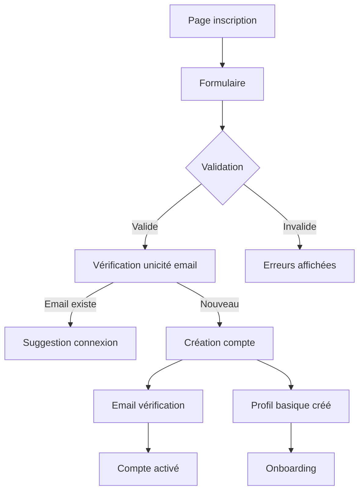
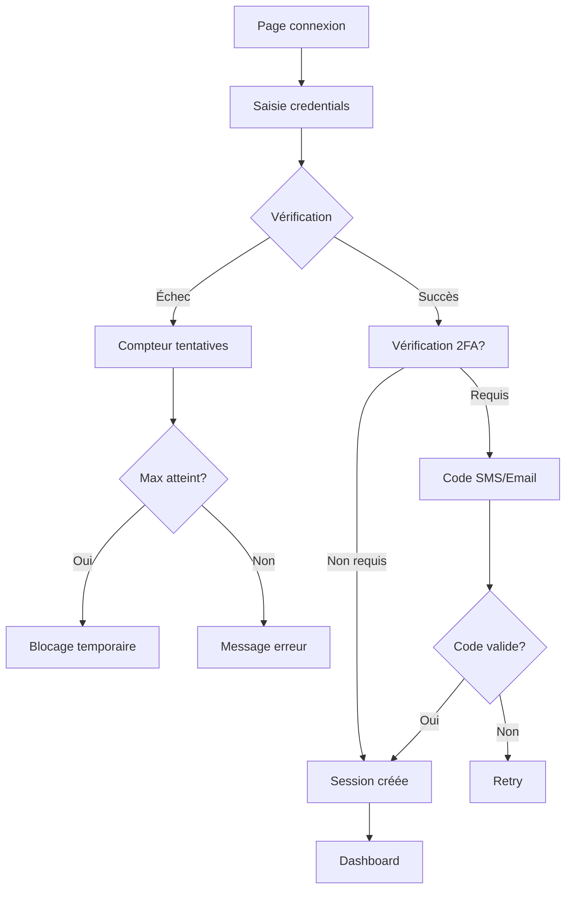

# Documentation Exhaustive des Processus Métiers Entrix V2.1
## Partie 1 : Vue d'ensemble et Processus d'inscription/authentification

---

## 📋 Table des Matières Générale

### Partie 1 : Vue d'ensemble et Authentification
1. [Vue d'ensemble des processus](#vue-ensemble)
2. [Processus d'inscription utilisateur](#inscription-utilisateur)
3. [Processus de connexion et authentification](#connexion-auth)
4. [Processus de gestion du profil](#gestion-profil)
5. [Processus de vérification d'identité](#verification-identite)

### Partie 2 : Gestion des Organisateurs et Événements
6. [Processus d'inscription organisateur](#inscription-organisateur)
7. [Processus de validation organisateur](#validation-organisateur)
8. [Processus de création d'événement](#creation-evenement)
9. [Processus de configuration billetterie](#config-billetterie)
10. [Processus de publication événement](#publication-evenement)

### Partie 3 : Parcours d'achat
11. [Processus de recherche et sélection](#recherche-selection)
12. [Processus de réservation temporaire](#reservation-temporaire)
13. [Processus de paiement](#processus-paiement)
14. [Processus de génération des billets](#generation-billets)
15. [Processus de transfert de billet](#transfert-billet)

### Partie 4 : Contrôle d'accès et jour J
16. [Processus de contrôle d'accès](#controle-acces)
17. [Processus de gestion des flux](#gestion-flux)
18. [Processus de gestion des incidents](#gestion-incidents)
19. [Processus de monitoring temps réel](#monitoring-realtime)

### Partie 5 : Gestion financière et reporting
20. [Processus de calcul des commissions](#calcul-commissions)
21. [Processus de remboursement](#processus-remboursement)
22. [Processus de virements organisateurs](#virements-organisateurs)
23. [Processus de reporting et analytics](#reporting-analytics)

---

## 🔍 Vue d'ensemble des processus {#vue-ensemble}

### Architecture des processus métiers

Les processus métiers Entrix sont organisés en domaines fonctionnels interconnectés :

1. **Gestion des utilisateurs** : Inscription, authentification, profils
2. **Gestion des organisateurs** : Validation, configuration, relations
3. **Gestion des événements** : Création, publication, configuration billetterie
4. **Processus d'achat** : Sélection, paiement, émission billets
5. **Contrôle d'accès** : Validation, scanning, gestion temps réel
6. **Gestion financière** : Commissions, remboursements, reporting

### Environnement et contexte métier

- **Zone géographique principale** : Tunisie et Maghreb
- **Devises supportées** : TND (principal), EUR, USD
- **Langues** : Français, Arabe, Anglais
- **Types d'événements** : Sports (football notamment), Culture, Business, Communautaire

### Acteurs principaux avec exemples concrets

| Acteur | Exemples réels | Rôle principal |
|--------|----------------|----------------|
| **Organisateurs** | Club Africain, EST, Ennejma Ezzahra, JCC | Créent et gèrent les événements |
| **Participants** | Équipes sportives, Artistes (Latifa, Saber Rebai) | Participent aux événements |
| **Lieux** | Stade Radès (60k places), El Menzah (45k), Théâtre Carthage | Accueillent les événements |
| **Spectateurs** | Supporters, Mélomanes, Professionnels | Achètent billets/abonnements |

---

## 👤 Processus d'inscription utilisateur {#inscription-utilisateur}

### Flux complet avec données réelles



### Étape 1 : Collecte des données initiales

**Interface utilisateur** : Formulaire d'inscription responsive
**URL** : `https://entrix.tn/signup`

**Données collectées avec validation** :
```javascript
{
  // Données obligatoires
  "email": "mohamed.supporter@gmail.com",    // Regex: /^[^\s@]+@[^\s@]+\.[^\s@]+$/
  "password": "ClubAfricain2025!",          // Min 8 chars, 1 maj, 1 chiffre, 1 special
  "password_confirm": "ClubAfricain2025!",   // Doit matcher password
  "first_name": "Mohamed",                   // Min 2 chars, lettres + accents
  "last_name": "Ben Ali",                    // Min 2 chars, lettres + accents
  
  // Données optionnelles
  "phone": "+21698123456",                  // Format: +216XXXXXXXX
  "date_of_birth": "1990-05-15",           // Age minimum 13 ans
  
  // Consentements obligatoires
  "accept_terms": true,                     // Checkbox obligatoire
  "accept_privacy": true,                   // Checkbox obligatoire
  
  // Marketing optionnel
  "newsletter": true,                       // Recevoir offres et actus
  "sms_notifications": true                 // Notifications SMS événements
}
```

**Validation côté serveur** :
```sql
-- Vérifier unicité email
SELECT COUNT(*) FROM users WHERE LOWER(email) = LOWER('mohamed.supporter@gmail.com');

-- Vérifier format téléphone tunisien si fourni
SELECT '+21698123456' ~ '^\\+216[2-9][0-9]{7}$';
```

### Étape 2 : Création du compte utilisateur

**Transaction de création** :
```sql
BEGIN;

-- Insertion dans users
INSERT INTO users (
    id,
    email,
    phone,
    first_name,
    last_name,
    password,
    is_active,
    created_at,
    updated_at
) VALUES (
    gen_random_uuid(),                              -- '550e8400-e29b-41d4-a716-446655440000'
    LOWER('mohamed.supporter@gmail.com'),
    '+21698123456',
    'Mohamed',
    'Ben Ali',
    crypt('ClubAfricain2025!', gen_salt('bf')),   -- Hash BCrypt
    TRUE,
    NOW(),
    NOW()
) RETURNING id;

-- Insertion dans user_profiles avec l'ID retourné
INSERT INTO user_profiles (
    id,
    user_id,
    date_of_birth,
    language,
    country,
    newsletter,
    sms_notifications,
    created_at,
    updated_at
) VALUES (
    gen_random_uuid(),
    '550e8400-e29b-41d4-a716-446655440000',
    '1990-05-15',
    'fr',
    'TN',
    TRUE,
    TRUE,
    NOW(),
    NOW()
);

-- Log d'audit
INSERT INTO audit_logs (
    id,
    table_name,
    record_id,
    action,
    actor_id,
    ip_address,
    user_agent,
    changed_data,
    created_at
) VALUES (
    gen_random_uuid(),
    'users',
    '550e8400-e29b-41d4-a716-446655440000',
    'INSERT',
    '550e8400-e29b-41d4-a716-446655440000',
    '197.14.56.123',
    'Mozilla/5.0 (Windows NT 10.0; Win64; x64)',
    jsonb_build_object(
        'action', 'user_registration',
        'source', 'web',
        'referrer', 'google_ads_campaign_derby_2025'
    ),
    NOW()
);

COMMIT;
```

### Étape 3 : Envoi email de vérification

**Génération token de vérification** :
```sql
-- Insertion token avec expiration 24h
INSERT INTO password_reset_tokens (
    id,
    user_id,
    token,
    expires_at,
    created_at
) VALUES (
    gen_random_uuid(),
    '550e8400-e29b-41d4-a716-446655440000',
    encode(gen_random_bytes(32), 'hex'),  -- Token sécurisé 64 chars
    NOW() + INTERVAL '24 hours',
    NOW()
) RETURNING token;
```

**Contenu email de vérification** :
```html
Objet: Bienvenue sur Entrix - Confirmez votre email

Bonjour Mohamed,

Bienvenue sur Entrix, la plateforme de billetterie n°1 en Tunisie !

Pour activer votre compte, veuillez cliquer sur le lien ci-dessous :
https://entrix.tn/verify-email?token=a1b2c3d4e5f6...

Ce lien expire dans 24 heures.

Prochains événements qui pourraient vous intéresser :
- Derby CA vs EST - 15 février 2025
- Concert Saber Rebai - 22 mars 2025
- Festival Jazz Carthage - Juillet 2025

L'équipe Entrix
```

### Étape 4 : Activation du compte

**Vérification du token** :
```sql
-- Recherche et validation du token
SELECT u.id, u.email, prt.expires_at
FROM password_reset_tokens prt
JOIN users u ON prt.user_id = u.id
WHERE prt.token = 'a1b2c3d4e5f6...'
  AND prt.expires_at > NOW()
  AND prt.used = FALSE;

-- Mise à jour statut vérification
UPDATE users 
SET email_verified = NOW()
WHERE id = '550e8400-e29b-41d4-a716-446655440000';

-- Marquer token comme utilisé
UPDATE password_reset_tokens 
SET used = TRUE, used_at = NOW()
WHERE token = 'a1b2c3d4e5f6...';
```

### Étape 5 : Onboarding personnalisé

**Collecte préférences utilisateur** :
```sql
-- Mise à jour profil avec préférences
UPDATE user_profiles
SET preferences = jsonb_build_object(
    'favorite_teams', ARRAY['club_africain', 'equipe_nationale_tunisie'],
    'event_categories', ARRAY['football', 'concerts', 'theatre'],
    'preferred_venues', ARRAY['stade_rades', 'theatre_carthage'],
    'notification_preferences', jsonb_build_object(
        'match_reminders', true,
        'price_alerts', true,
        'new_events', true,
        'team_news', true
    )
)
WHERE user_id = '550e8400-e29b-41d4-a716-446655440000';

-- Création automatique de groupes marketing
INSERT INTO user_groups (user_id, group_id, metadata)
VALUES 
    ('550e8400-e29b-41d4-a716-446655440000', 'group_supporters_ca', 
     '{"source": "onboarding", "engagement_level": "new"}'::jsonb),
    ('550e8400-e29b-41d4-a716-446655440000', 'group_football_fans',
     '{"categories": ["ligue1", "coupe_tunisie"]}'::jsonb);
```

---

## 🔐 Processus de connexion et authentification {#connexion-auth}

### Flux d'authentification sécurisé



### Étape 1 : Tentative de connexion

**Données soumises** :
```json
{
  "email": "mohamed.supporter@gmail.com",
  "password": "ClubAfricain2025!",
  "remember_me": true,
  "device_info": {
    "user_agent": "Mozilla/5.0...",
    "ip": "197.14.56.123",
    "fingerprint": "abc123def456..."
  }
}
```

**Vérification credentials** :
```sql
-- Log tentative de connexion
INSERT INTO login_attempts (
    id,
    email,
    ip_address,
    user_agent,
    attempt_time,
    metadata
) VALUES (
    gen_random_uuid(),
    'mohamed.supporter@gmail.com',
    '197.14.56.123',
    'Mozilla/5.0...',
    NOW(),
    '{"device_fingerprint": "abc123def456..."}'::jsonb
) RETURNING id;

-- Vérifier compte et mot de passe
SELECT 
    u.id,
    u.email,
    u.password,
    u.is_active,
    u.email_verified,
    u.last_login,
    up.language,
    up.requires_2fa,
    (SELECT COUNT(*) 
     FROM login_attempts la 
     WHERE la.email = u.email 
       AND la.success = FALSE 
       AND la.attempt_time > NOW() - INTERVAL '15 minutes'
    ) as recent_failures
FROM users u
LEFT JOIN user_profiles up ON u.id = up.user_id
WHERE LOWER(u.email) = LOWER('mohamed.supporter@gmail.com');

-- Si mot de passe correct
UPDATE login_attempts 
SET 
    success = TRUE,
    user_id = '550e8400-e29b-41d4-a716-446655440000'
WHERE id = 'attempt_id';

-- Mise à jour dernière connexion
UPDATE users 
SET 
    last_login = NOW(),
    updated_at = NOW()
WHERE id = '550e8400-e29b-41d4-a716-446655440000';
```

### Étape 2 : Gestion des échecs et sécurité

**Détection activité suspecte** :
```sql
-- Fonction de détection patterns suspects
CREATE OR REPLACE FUNCTION detect_suspicious_activity(p_email TEXT, p_ip INET)
RETURNS TABLE(
    is_suspicious BOOLEAN,
    reason TEXT,
    severity suspicious_activity_severity
) AS $$
BEGIN
    -- Trop de tentatives échouées
    IF (SELECT COUNT(*) FROM login_attempts 
        WHERE email = p_email 
        AND success = FALSE 
        AND attempt_time > NOW() - INTERVAL '15 minutes') >= 5 THEN
        RETURN QUERY SELECT TRUE, 'Too many failed attempts', 'HIGH'::suspicious_activity_severity;
    END IF;
    
    -- Connexion depuis nouvelle localisation
    IF NOT EXISTS (
        SELECT 1 FROM login_attempts 
        WHERE email = p_email 
        AND ip_address = p_ip 
        AND success = TRUE
        AND attempt_time > NOW() - INTERVAL '30 days'
    ) THEN
        RETURN QUERY SELECT TRUE, 'New location detected', 'MEDIUM'::suspicious_activity_severity;
    END IF;
    
    -- Pattern de force brute
    IF (SELECT COUNT(DISTINCT email) FROM login_attempts 
        WHERE ip_address = p_ip 
        AND attempt_time > NOW() - INTERVAL '5 minutes') > 10 THEN
        RETURN QUERY SELECT TRUE, 'Brute force pattern detected', 'CRITICAL'::suspicious_activity_severity;
    END IF;
    
    RETURN QUERY SELECT FALSE, NULL, NULL;
END;
$$ LANGUAGE plpgsql;
```

### Étape 3 : Authentification à deux facteurs (2FA)

**Génération code 2FA** :
```sql
-- Si 2FA activé, générer code
INSERT INTO mfa_tokens (
    id,
    user_id,
    method,
    token_hash,
    secret,
    expires_at,
    created_at
) VALUES (
    gen_random_uuid(),
    '550e8400-e29b-41d4-a716-446655440000',
    'SMS',
    encode(digest('123456', 'sha256'), 'hex'),  -- Code 6 chiffres hashé
    '123456',  -- Stocké temporairement pour envoi
    NOW() + INTERVAL '5 minutes',
    NOW()
);

-- Log envoi SMS
INSERT INTO notification_log (
    type,
    recipient,
    channel,
    content,
    status,
    sent_at
) VALUES (
    'MFA_CODE',
    '+21698123456',
    'SMS',
    'Votre code Entrix : 123456. Valide 5 minutes.',
    'SENT',
    NOW()
);
```

### Étape 4 : Création de session

**Génération token JWT** :
```javascript
// Payload JWT
const payload = {
  user_id: "550e8400-e29b-41d4-a716-446655440000",
  email: "mohamed.supporter@gmail.com",
  roles: ["SPECTATOR"],
  groups: ["supporters_ca", "football_fans"],
  session_id: "session_123456",
  iat: Math.floor(Date.now() / 1000),
  exp: Math.floor(Date.now() / 1000) + (rememberMe ? 30 * 24 * 60 * 60 : 24 * 60 * 60)
};

// Token signé avec secret
const token = jwt.sign(payload, process.env.JWT_SECRET);
```

**Enregistrement session** :
```sql
INSERT INTO user_sessions (
    id,
    user_id,
    session_token,
    ip_address,
    user_agent,
    device_info,
    expires_at,
    created_at,
    last_activity
) VALUES (
    'session_123456',
    '550e8400-e29b-41d4-a716-446655440000',
    'jwt_token_hash...',
    '197.14.56.123',
    'Mozilla/5.0...',
    jsonb_build_object(
        'fingerprint', 'abc123def456',
        'platform', 'web',
        'browser', 'chrome',
        'os', 'windows'
    ),
    NOW() + INTERVAL '30 days',
    NOW(),
    NOW()
);
```

---

## 📝 Processus de gestion du profil {#gestion-profil}

### Vue complète du profil utilisateur

```sql
-- Vue consolidée profil utilisateur
CREATE OR REPLACE VIEW v_user_complete_profile AS
SELECT 
    -- Informations de base
    u.id,
    u.email,
    u.phone,
    u.first_name,
    u.last_name,
    u.avatar,
    u.email_verified,
    u.phone_verified,
    u.created_at as member_since,
    
    -- Profil étendu
    up.date_of_birth,
    EXTRACT(YEAR FROM AGE(up.date_of_birth)) as age,
    up.gender,
    up.city,
    up.country,
    up.language,
    up.bio,
    
    -- Statistiques
    (SELECT COUNT(*) FROM tickets WHERE user_id = u.id) as total_tickets,
    (SELECT COUNT(*) FROM subscriptions WHERE user_id = u.id AND status = 'ACTIVE') as active_subscriptions,
    (SELECT COUNT(DISTINCT event_id) FROM tickets WHERE user_id = u.id) as events_attended,
    (SELECT SUM(total_amount) FROM orders WHERE user_id = u.id AND status = 'CONFIRMED') as total_spent,
    
    -- Préférences
    up.preferences,
    up.notification_settings,
    
    -- Fidélité
    CASE 
        WHEN (SELECT COUNT(*) FROM tickets WHERE user_id = u.id) >= 50 THEN 'PLATINUM'
        WHEN (SELECT COUNT(*) FROM tickets WHERE user_id = u.id) >= 20 THEN 'GOLD'
        WHEN (SELECT COUNT(*) FROM tickets WHERE user_id = u.id) >= 10 THEN 'SILVER'
        ELSE 'BRONZE'
    END as loyalty_tier,
    
    -- Dernière activité
    GREATEST(
        u.last_login,
        (SELECT MAX(created_at) FROM tickets WHERE user_id = u.id),
        (SELECT MAX(created_at) FROM orders WHERE user_id = u.id)
    ) as last_activity

FROM users u
LEFT JOIN user_profiles up ON u.id = up.user_id;
```

### Mise à jour du profil

**Données modifiables** :
```json
{
  "personal_info": {
    "first_name": "Mohamed",
    "last_name": "Ben Ali",
    "phone": "+21698123456",
    "date_of_birth": "1990-05-15",
    "gender": "MALE",
    "city": "Tunis",
    "bio": "Supporter du Club Africain depuis 2005"
  },
  "preferences": {
    "favorite_teams": ["club_africain", "equipe_tunisie"],
    "event_categories": ["football", "basketball", "concerts"],
    "preferred_venues": ["stade_rades", "salle_el_menzah"],
    "preferred_zones": ["virages", "tribunes_laterales"]
  },
  "notifications": {
    "email": {
      "match_reminders": true,
      "price_drops": true,
      "new_events": true,
      "newsletter": true
    },
    "sms": {
      "match_day": true,
      "urgent_only": false
    },
    "push": {
      "enabled": true,
      "sound": true
    }
  },
  "privacy": {
    "profile_public": false,
    "show_attendance": true,
    "allow_transfers_from": "FRIENDS_ONLY"
  }
}
```

**Transaction de mise à jour** :
```sql
BEGIN;

-- Mise à jour users
UPDATE users SET
    first_name = 'Mohamed',
    last_name = 'Ben Ali',
    phone = '+21698123456',
    updated_at = NOW()
WHERE id = '550e8400-e29b-41d4-a716-446655440000';

-- Mise à jour user_profiles
UPDATE user_profiles SET
    date_of_birth = '1990-05-15',
    gender = 'MALE',
    city = 'Tunis',
    bio = 'Supporter du Club Africain depuis 2005',
    preferences = jsonb_build_object(
        'favorite_teams', ARRAY['club_africain', 'equipe_tunisie'],
        'event_categories', ARRAY['football', 'basketball', 'concerts'],
        'preferred_venues', ARRAY['stade_rades', 'salle_el_menzah'],
        'preferred_zones', ARRAY['virages', 'tribunes_laterales']
    ),
    notification_settings = jsonb_build_object(
        'email', jsonb_build_object(
            'match_reminders', true,
            'price_drops', true,
            'new_events', true,
            'newsletter', true
        ),
        'sms', jsonb_build_object(
            'match_day', true,
            'urgent_only', false
        ),
        'push', jsonb_build_object(
            'enabled', true,
            'sound', true
        )
    ),
    privacy_settings = jsonb_build_object(
        'profile_public', false,
        'show_attendance', true,
        'allow_transfers_from', 'FRIENDS_ONLY'
    ),
    updated_at = NOW()
WHERE user_id = '550e8400-e29b-41d4-a716-446655440000';

-- Log modification
INSERT INTO audit_logs (
    table_name,
    record_id,
    action,
    actor_id,
    changed_data,
    created_at
) VALUES (
    'user_profiles',
    '550e8400-e29b-41d4-a716-446655440000',
    'UPDATE',
    '550e8400-e29b-41d4-a716-446655440000',
    jsonb_build_object(
        'fields_updated', ARRAY['preferences', 'notifications', 'privacy'],
        'source', 'user_settings_page'
    ),
    NOW()
);

COMMIT;
```

---

## ✅ Processus de vérification d'identité {#verification-identite}

### Vérification du numéro de téléphone

**Étape 1 : Demande de vérification**
```sql
-- Génération code SMS
INSERT INTO mfa_tokens (
    id,
    user_id,
    method,
    token_hash,
    secret,
    expires_at,
    metadata
) VALUES (
    gen_random_uuid(),
    '550e8400-e29b-41d4-a716-446655440000',
    'SMS',
    encode(digest('854736', 'sha256'), 'hex'),
    '854736',
    NOW() + INTERVAL '10 minutes',
    jsonb_build_object(
        'purpose', 'phone_verification',
        'phone', '+21698123456',
        'attempt', 1
    )
) RETURNING id, secret;
```

**Étape 2 : Envoi SMS via provider**
```javascript
// Intégration avec provider SMS tunisien
const smsData = {
  to: "+21698123456",
  message: "Code Entrix: 854736. Ne partagez ce code avec personne.",
  sender: "ENTRIX",
  priority: "high"
};

// Log envoi
await db.query(`
  INSERT INTO notification_log (
    type, channel, recipient, content, provider, status, sent_at
  ) VALUES ($1, $2, $3, $4, $5, $6, NOW())
`, ['VERIFICATION', 'SMS', smsData.to, smsData.message, 'TUNISIE_TELECOM', 'SENT']);
```

**Étape 3 : Validation du code**
```sql
-- Vérification code
WITH token_check AS (
    SELECT 
        user_id,
        metadata->>'phone' as phone_number,
        expires_at > NOW() as is_valid,
        is_used
    FROM mfa_tokens
    WHERE token_hash = encode(digest('854736', 'sha256'), 'hex')
      AND method = 'SMS'
      AND metadata->>'purpose' = 'phone_verification'
)
UPDATE users u
SET 
    phone_verified = NOW(),
    phone = tc.phone_number,
    updated_at = NOW()
FROM token_check tc
WHERE u.id = tc.user_id 
  AND tc.is_valid = true 
  AND tc.is_used = false
RETURNING u.id;

-- Marquer token utilisé
UPDATE mfa_tokens 
SET is_used = true, used_at = NOW()
WHERE token_hash = encode(digest('854736', 'sha256'), 'hex');
```

### Vérification documents identité (KYC)

**Pour achats importants ou abonnements**
```sql
-- Stockage document vérifié
INSERT INTO user_documents (
    id,
    user_id,
    document_type,
    document_number,
    issue_date,
    expiry_date,
    issuing_authority,
    verification_status,
    verified_at,
    verified_by,
    metadata
) VALUES (
    gen_random_uuid(),
    '550e8400-e29b-41d4-a716-446655440000',
    'NATIONAL_ID',
    '12345678',  -- CIN tunisienne
    '2018-06-15',
    '2028-06-14',
    'République Tunisienne',
    'VERIFIED',
    NOW(),
    'kyc_system_auto',
    jsonb_build_object(
        'verification_method', 'automated_ocr',
        'confidence_score', 0.98,
        'match_score', 0.95,
        'document_front', 'https://secure.entrix.tn/docs/cin_front_12345.jpg',
        'document_back', 'https://secure.entrix.tn/docs/cin_back_12345.jpg'
    )
);

-- Mise à jour statut KYC utilisateur
UPDATE user_profiles
SET 
    kyc_status = 'VERIFIED',
    kyc_verified_at = NOW(),
    kyc_level = 2,  -- Niveau 2 = ID vérifié
    updated_at = NOW()
WHERE user_id = '550e8400-e29b-41d4-a716-446655440000';
```

### Dashboard utilisateur après inscription complète

**Requête données dashboard**
```sql
-- Vue dashboard personnalisé
SELECT 
    -- Infos utilisateur
    u.first_name,
    u.last_name,
    u.avatar,
    up.loyalty_tier,
    
    -- Événements à venir
    (SELECT json_agg(json_build_object(
        'event_id', e.id,
        'event_name', e.name,
        'event_date', e.scheduled_start,
        'venue', v.name,
        'tickets_count', COUNT(t.id)
    ))
    FROM tickets t
    JOIN events e ON t.event_id = e.id
    JOIN venues v ON e.venue_id = v.id
    WHERE t.user_id = u.id
      AND e.scheduled_start > NOW()
      AND t.is_active = true
    GROUP BY e.id, e.name, e.scheduled_start, v.name
    ORDER BY e.scheduled_start
    LIMIT 5) as upcoming_events,
    
    -- Abonnements actifs
    (SELECT json_agg(json_build_object(
        'subscription_id', s.id,
        'plan_name', sp.name,
        'organizer', o.name,
        'valid_until', s.valid_until,
        'benefits', sp.benefits
    ))
    FROM subscriptions s
    JOIN subscription_plans sp ON s.subscription_plan_id = sp.id
    JOIN organizers o ON sp.organizer_id = o.id
    WHERE s.user_id = u.id
      AND s.status = 'ACTIVE') as active_subscriptions,
    
    -- Recommandations personnalisées
    (SELECT json_agg(json_build_object(
        'event_id', e.id,
        'event_name', e.name,
        'event_date', e.scheduled_start,
        'reason', CASE 
            WHEN p.code IN (SELECT unnest(up.preferences->'favorite_teams')::text) 
            THEN 'Votre équipe favorite'
            WHEN ec.code IN (SELECT unnest(up.preferences->'event_categories')::text)
            THEN 'Catégorie que vous aimez'
            ELSE 'Populaire dans votre région'
        END
    ))
    FROM events e
    JOIN event_participants ep ON e.id = ep.event_id
    JOIN participants p ON ep.participant_id = p.id
    JOIN event_categories ec ON e.category_id = ec.id
    WHERE e.status = 'PUBLISHED'
      AND e.scheduled_start > NOW()
      AND e.scheduled_start < NOW() + INTERVAL '30 days'
      AND NOT EXISTS (
          SELECT 1 FROM tickets t 
          WHERE t.event_id = e.id AND t.user_id = u.id
      )
    ORDER BY e.scheduled_start
    LIMIT 6) as recommendations,
    
    -- Statistiques personnelles
    jsonb_build_object(
        'total_events', (SELECT COUNT(DISTINCT event_id) FROM tickets WHERE user_id = u.id),
        'total_spent', (SELECT COALESCE(SUM(total_amount), 0) FROM orders WHERE user_id = u.id AND status = 'CONFIRMED'),
        'favorite_venue', (
            SELECT v.name 
            FROM venues v 
            JOIN events e ON v.id = e.venue_id 
            JOIN tickets t ON e.id = t.event_id 
            WHERE t.user_id = u.id 
            GROUP BY v.id, v.name 
            ORDER BY COUNT(*) DESC 
            LIMIT 1
        ),
        'member_for_days', EXTRACT(DAY FROM NOW() - u.created_at)
    ) as stats

FROM users u
JOIN user_profiles up ON u.id = up.user_id
WHERE u.id = '550e8400-e29b-41d4-a716-446655440000';
```

---

Cette première partie couvre les processus d'inscription et d'authentification de manière exhaustive. Les parties suivantes détailleront les autres processus métiers avec le même niveau de détail.