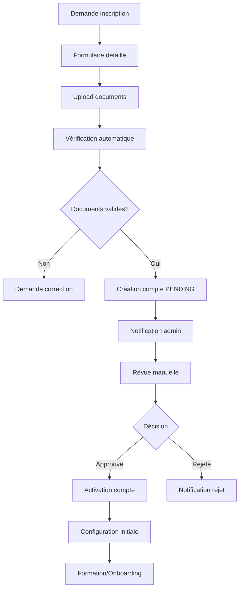
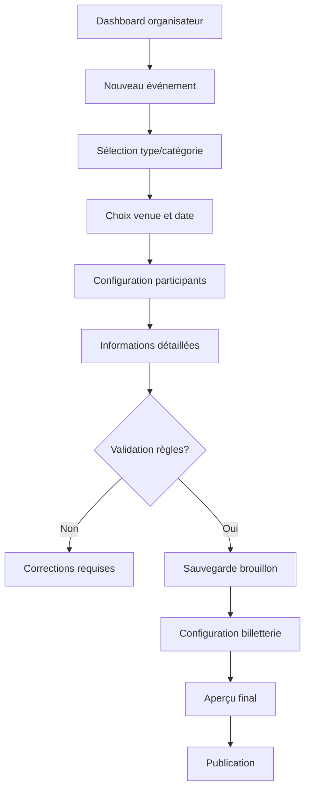
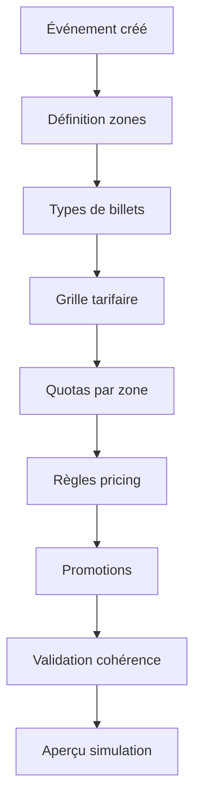
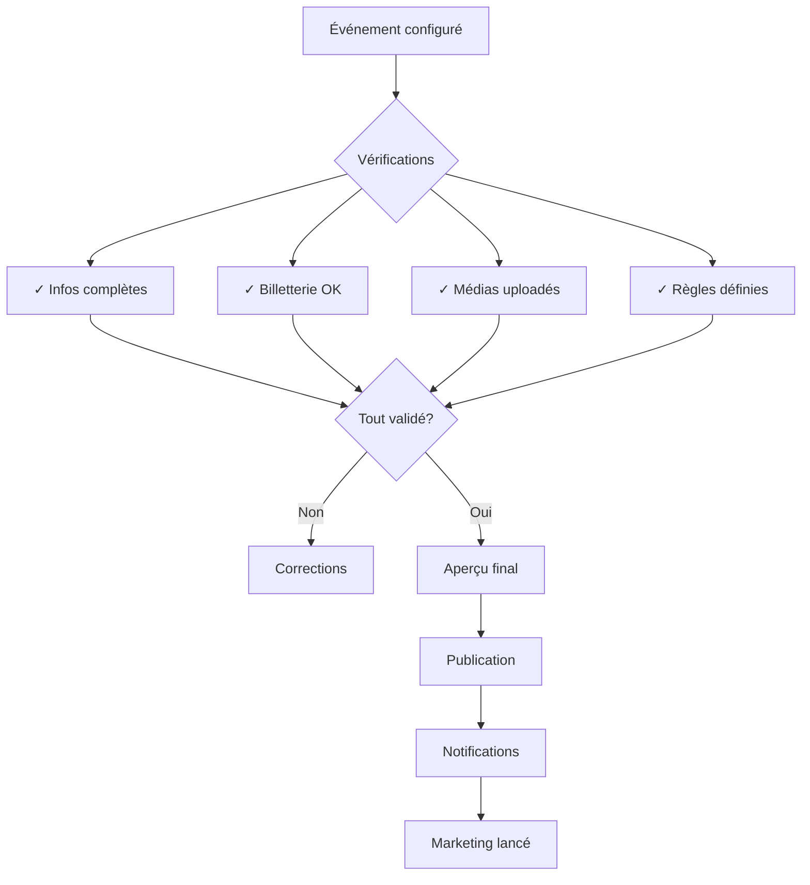

# Documentation Exhaustive des Processus Métiers Entrix V2.1
## Partie 2 : Gestion des Organisateurs et Événements

---

## 📋 Table des Matières - Partie 2

1. [Processus d'inscription organisateur](#inscription-organisateur)
2. [Processus de validation organisateur](#validation-organisateur)
3. [Processus de création d'événement](#creation-evenement)
4. [Processus de configuration billetterie](#config-billetterie)
5. [Processus de publication événement](#publication-evenement)

---

## 🏢 Processus d'inscription organisateur {#inscription-organisateur}

### Flux complet inscription et validation



### Étape 1 : Soumission demande organisateur

**Données formulaire complet** :
```json
{
  "organization": {
    "name": "Club Africain",
    "legal_name": "CLUB AFRICAIN SOCIETE SPORTIVE",
    "type": "SPORTS_CLUB",
    "registration_number": "B123456789",
    "tax_id": "1234567ABC",
    "founded_date": "1920-10-04",
    "description": "Club Africain, fondé en 1920, est l'un des clubs les plus titrés de Tunisie",
    "website": "https://www.clubafricain.tn"
  },
  "contact": {
    "primary_contact": {
      "first_name": "Ahmed",
      "last_name": "Trabelsi",
      "email": "ahmed.trabelsi@clubafricain.tn",
      "phone": "+21671234567",
      "position": "Directeur Commercial"
    },
    "headquarters": {
      "address": "Avenue Mohamed V, Parc A",
      "city": "Tunis",
      "postal_code": "1000",
      "country": "TN"
    }
  },
  "documents": {
    "commercial_register": "file_upload_rc.pdf",
    "tax_certificate": "file_upload_tf.pdf",
    "insurance": "file_upload_insurance.pdf",
    "bank_rib": "file_upload_rib.pdf"
  },
  "banking": {
    "bank_name": "BIAT",
    "account_holder": "CLUB AFRICAIN",
    "rib": "08151234567890123456789"
  }
}
```

### Étape 2 : Création compte organisateur en attente

**Transaction création** :
```sql
BEGIN;

-- Création utilisateur admin organisateur
INSERT INTO users (
    id, email, first_name, last_name, password, is_active
) VALUES (
    'admin_ca_001',
    'ahmed.trabelsi@clubafricain.tn',
    'Ahmed',
    'Trabelsi',
    '$2b$12$hashedPassword...',
    FALSE -- Inactif jusqu'à validation
);

-- Création organisateur
INSERT INTO organizers (
    id,
    code,
    name,
    legal_name,
    type,
    registration_number,
    tax_id,
    founded_date,
    description,
    website,
    email,
    phone,
    address,
    city,
    country,
    primary_contact_id,
    status,
    commission_rate,
    metadata
) VALUES (
    'd7e6f5g4-c3b2-1a0f-9e8d-7c6b5a4c3d2e',
    'ORG_2020_CA001',
    'Club Africain',
    'CLUB AFRICAIN SOCIETE SPORTIVE',
    'SPORTS_CLUB',
    'B123456789',
    '1234567ABC',
    '1920-10-04',
    'Club Africain, fondé en 1920, est l''un des clubs les plus titrés de Tunisie avec 13 championnats',
    'https://www.clubafricain.tn',
    'contact@clubafricain.tn',
    '+21671234567',
    'Avenue Mohamed V, Parc A',
    'Tunis',
    'TN',
    'admin_ca_001',
    'PENDING',
    0.12, -- Commission 12% par défaut
    jsonb_build_object(
        'social_media', jsonb_build_object(
            'facebook', 'https://facebook.com/clubafricain',
            'instagram', '@clubafricainoff',
            'twitter', '@ClubAfricain'
        ),
        'business_info', jsonb_build_object(
            'employees_count', '50-100',
            'annual_events', '30-40',
            'main_venue', 'Stade Olympique de Radès'
        ),
        'documents', jsonb_build_object(
            'rc_uploaded', true,
            'tax_cert_uploaded', true,
            'insurance_uploaded', true,
            'rib_uploaded', true
        )
    )
);

-- Stockage sécurisé des informations bancaires
INSERT INTO organizer_banking_details (
    id,
    organizer_id,
    bank_name,
    account_holder,
    rib_encrypted,
    is_verified,
    created_at
) VALUES (
    gen_random_uuid(),
    'd7e6f5g4-c3b2-1a0f-9e8d-7c6b5a4c3d2e',
    'BIAT',
    'CLUB AFRICAIN',
    encrypt('08151234567890123456789', 'encryption_key'), -- Chiffrement RIB
    FALSE,
    NOW()
);

-- Création rôle organisateur pour l'admin
INSERT INTO user_roles (
    user_id, role_id, granted_by, metadata
) VALUES (
    'admin_ca_001',
    (SELECT id FROM roles WHERE code = 'ORGANIZER_ADMIN'),
    'system',
    jsonb_build_object('organization_id', 'd7e6f5g4-c3b2-1a0f-9e8d-7c6b5a4c3d2e')
);

-- Log audit
INSERT INTO audit_logs (
    table_name, record_id, action, actor_id, changed_data
) VALUES (
    'organizers',
    'd7e6f5g4-c3b2-1a0f-9e8d-7c6b5a4c3d2e',
    'INSERT',
    'admin_ca_001',
    jsonb_build_object(
        'status', 'PENDING',
        'awaiting_validation', true,
        'documents_submitted', 4
    )
);

COMMIT;
```

### Étape 3 : Vérification automatique des documents

**Processus de vérification** :
```sql
-- Fonction de vérification automatique
CREATE OR REPLACE FUNCTION verify_organizer_documents(p_organizer_id UUID)
RETURNS TABLE(
    check_name TEXT,
    status TEXT,
    details JSONB
) AS $$
BEGIN
    -- Vérification registre commerce
    RETURN QUERY
    SELECT 
        'commercial_register',
        CASE 
            WHEN metadata->'documents'->>'rc_uploaded' = 'true' THEN 'PASS'
            ELSE 'FAIL'
        END,
        jsonb_build_object(
            'file_exists', metadata->'documents'->>'rc_uploaded' = 'true',
            'format_valid', true,
            'expiry_check', 'N/A'
        )
    FROM organizers WHERE id = p_organizer_id;
    
    -- Vérification matricule fiscal
    RETURN QUERY
    SELECT 
        'tax_certificate',
        CASE 
            WHEN tax_id ~ '^[0-9]{7}[A-Z]{3}[0-9]{3}$' THEN 'PASS'
            ELSE 'FAIL'
        END,
        jsonb_build_object(
            'format_valid', tax_id ~ '^[0-9]{7}[A-Z]{3}[0-9]{3}$',
            'pattern', 'NNNNNNNLLLNNN'
        )
    FROM organizers WHERE id = p_organizer_id;
    
    -- Vérification RIB
    RETURN QUERY
    SELECT 
        'bank_rib',
        CASE 
            WHEN LENGTH(decrypt(rib_encrypted, 'encryption_key')) = 20 THEN 'PASS'
            ELSE 'FAIL'
        END,
        jsonb_build_object(
            'length_valid', LENGTH(decrypt(rib_encrypted, 'encryption_key')) = 20,
            'bank_code_valid', SUBSTRING(decrypt(rib_encrypted, 'encryption_key'), 1, 2) IN ('08', '10', '12')
        )
    FROM organizer_banking_details WHERE organizer_id = p_organizer_id;
END;
$$ LANGUAGE plpgsql;

-- Exécution vérification
SELECT * FROM verify_organizer_documents('d7e6f5g4-c3b2-1a0f-9e8d-7c6b5a4c3d2e');
```

---

## ✅ Processus de validation organisateur {#validation-organisateur}

### Workflow de validation manuelle

**Dashboard admin validation** :
```sql
-- Vue pour admin validation
CREATE OR REPLACE VIEW v_pending_organizers AS
SELECT 
    o.id,
    o.code,
    o.name,
    o.type,
    o.created_at,
    o.status,
    o.commission_rate,
    
    -- Contact principal
    u.first_name || ' ' || u.last_name as contact_name,
    u.email as contact_email,
    u.phone as contact_phone,
    
    -- Vérifications
    (SELECT COUNT(*) FROM verify_organizer_documents(o.id) WHERE status = 'PASS') as checks_passed,
    (SELECT COUNT(*) FROM verify_organizer_documents(o.id)) as total_checks,
    
    -- Documents
    o.metadata->'documents' as documents_status,
    
    -- Analyse risque
    CASE 
        WHEN o.type = 'SPORTS_CLUB' AND o.founded_date < '2000-01-01' THEN 'LOW'
        WHEN o.type IN ('CULTURAL_PRODUCER', 'CONFERENCE_ORGANIZER') THEN 'MEDIUM'
        ELSE 'HIGH'
    END as risk_level,
    
    -- Recommandation
    CASE 
        WHEN (SELECT COUNT(*) FROM verify_organizer_documents(o.id) WHERE status = 'PASS') = 
             (SELECT COUNT(*) FROM verify_organizer_documents(o.id)) THEN 'APPROVE'
        ELSE 'REVIEW'
    END as recommendation

FROM organizers o
JOIN users u ON o.primary_contact_id = u.id
WHERE o.status = 'PENDING'
ORDER BY o.created_at;
```

### Actions de validation

**Approbation organisateur** :
```sql
-- Procédure validation complète
CREATE OR REPLACE FUNCTION approve_organizer(
    p_organizer_id UUID,
    p_approved_by UUID,
    p_comments TEXT DEFAULT NULL
) RETURNS VOID AS $$
DECLARE
    v_contact_id UUID;
    v_organizer_name TEXT;
BEGIN
    -- Récupérer infos
    SELECT primary_contact_id, name 
    INTO v_contact_id, v_organizer_name
    FROM organizers 
    WHERE id = p_organizer_id;
    
    -- Transaction validation
    BEGIN
        -- Mise à jour statut organisateur
        UPDATE organizers SET
            status = 'ACTIVE',
            validated_at = NOW(),
            validated_by = p_approved_by,
            updated_at = NOW()
        WHERE id = p_organizer_id;
        
        -- Activer compte utilisateur admin
        UPDATE users SET
            is_active = TRUE,
            email_verified = NOW(),
            updated_at = NOW()
        WHERE id = v_contact_id;
        
        -- Vérifier comptes bancaires
        UPDATE organizer_banking_details SET
            is_verified = TRUE,
            verified_at = NOW(),
            verified_by = p_approved_by
        WHERE organizer_id = p_organizer_id;
        
        -- Créer groupe organisateur
        INSERT INTO groups (
            id, code, name, type, metadata
        ) VALUES (
            gen_random_uuid(),
            'ORG_' || p_organizer_id,
            'Équipe ' || v_organizer_name,
            'ORGANIZER_TEAM',
            jsonb_build_object(
                'organizer_id', p_organizer_id,
                'auto_created', true
            )
        );
        
        -- Log validation
        INSERT INTO audit_logs (
            table_name, record_id, action, actor_id, changed_data
        ) VALUES (
            'organizers',
            p_organizer_id,
            'APPROVE',
            p_approved_by,
            jsonb_build_object(
                'previous_status', 'PENDING',
                'new_status', 'ACTIVE',
                'comments', p_comments,
                'validation_time', NOW()
            )
        );
        
        -- Notification email
        INSERT INTO notification_queue (
            recipient_id, type, channel, subject, content, metadata
        ) VALUES (
            v_contact_id,
            'ORGANIZER_APPROVED',
            'EMAIL',
            'Votre compte organisateur Entrix est approuvé !',
            'Félicitations ! Votre organisation ' || v_organizer_name || ' est maintenant active sur Entrix.',
            jsonb_build_object(
                'organizer_id', p_organizer_id,
                'next_steps', ARRAY[
                    'Compléter votre profil organisateur',
                    'Configurer vos venues',
                    'Créer votre premier événement'
                ]
            )
        );
        
    EXCEPTION WHEN OTHERS THEN
        RAISE EXCEPTION 'Erreur validation: %', SQLERRM;
    END;
END;
$$ LANGUAGE plpgsql;

-- Exécution validation
SELECT approve_organizer(
    'd7e6f5g4-c3b2-1a0f-9e8d-7c6b5a4c3d2e',
    'admin_user_id',
    'Validation OK - Documents conformes'
);
```

### Configuration initiale post-validation

**Setup relations venues** :
```sql
-- Attribution venues par défaut
INSERT INTO venue_organizer_relations (
    id,
    venue_id,
    organizer_id,
    relation_type,
    priority_level,
    auto_approval,
    valid_from,
    commission_override,
    metadata
) VALUES 
    -- Stade Radès pour matchs importants
    (
        gen_random_uuid(),
        '234e5678-f90a-23d4-b567-537725285111', -- Stade Olympique Radès
        'd7e6f5g4-c3b2-1a0f-9e8d-7c6b5a4c3d2e',
        'PRIORITY_USER',
        1,
        TRUE,
        NOW(),
        0.10, -- Commission réduite 10%
        jsonb_build_object(
            'slots_per_month', 4,
            'preferred_days', ARRAY['saturday', 'sunday'],
            'preferred_times', ARRAY['15:00', '17:00', '20:00']
        )
    ),
    -- Stade annexe pour entraînements ouverts
    (
        gen_random_uuid(),
        '345f6789-g01b-34e5-c678-648836396222', -- Stade El Menzah
        'd7e6f5g4-c3b2-1a0f-9e8d-7c6b5a4c3d2e',
        'REGULAR_USER',
        3,
        FALSE,
        NOW(),
        NULL,
        jsonb_build_object(
            'usage_type', 'training_sessions',
            'public_access', true
        )
    );
```

---

## 📅 Processus de création d'événement {#creation-evenement}

### Flux création événement complet



### Étape 1 : Création événement base

**Données formulaire événement** :
```json
{
  "event": {
    "name": "Derby Club Africain vs Espérance - Ligue 1",
    "code": "EVT_2025_CA_EST_DERBY",
    "description": "Match phare de la 15ème journée du championnat",
    "category_id": "567e89ab-i01f-56g7-e890-860958518444", // Football Pro
    "event_group_id": "678e90bc-j12g-67h8-f901-971069629555", // Ligue 1 2024-2025
    "venue_id": "234e5678-f90a-23d4-b567-537725285111",
    "venue_mapping_id": "mapping_rades_football_60k",
    "scheduled_start": "2025-02-15T20:00:00+01:00",
    "scheduled_end": "2025-02-15T22:00:00+01:00",
    "doors_open": "2025-02-15T17:00:00+01:00",
    "capacity": 60000,
    "expected_attendance": 55000,
    "importance_level": 10,
    "tags": ["derby", "football", "ligue1", "big_match"]
  },
  "restrictions": {
    "min_age": 16,
    "max_tickets_per_user": 4,
    "allow_transfers": true,
    "allow_refunds": true,
    "refund_deadline": "2025-02-14T20:00:00+01:00"
  }
}
```

**Validation règles métier** :
```sql
-- Vérifier disponibilité venue
SELECT COUNT(*) FROM events e
WHERE e.venue_id = '234e5678-f90a-23d4-b567-537725285111'
AND e.status NOT IN ('CANCELLED', 'DRAFT')
AND (
    ('2025-02-15T17:00:00+01:00', '2025-02-15T23:00:00+01:00') 
    OVERLAPS 
    (e.doors_open, e.scheduled_end + INTERVAL '1 hour')
);

-- Vérifier droits organisateur sur venue
SELECT vor.relation_type, vor.auto_approval, vor.priority_level
FROM venue_organizer_relations vor
WHERE vor.venue_id = '234e5678-f90a-23d4-b567-537725285111'
AND vor.organizer_id = 'd7e6f5g4-c3b2-1a0f-9e8d-7c6b5a4c3d2e'
AND vor.valid_from <= '2025-02-15'
AND (vor.valid_until IS NULL OR vor.valid_until >= '2025-02-15');

-- Vérifier quotas événements
SELECT 
    eg.max_events,
    eg.current_events,
    COUNT(e.id) as organizer_events_in_group
FROM event_groups eg
LEFT JOIN events e ON e.event_group_id = eg.id 
    AND e.organizer_id = 'd7e6f5g4-c3b2-1a0f-9e8d-7c6b5a4c3d2e'
    AND e.status != 'CANCELLED'
WHERE eg.id = '678e90bc-j12g-67h8-f901-971069629555'
GROUP BY eg.id;
```

**Création événement** :
```sql
BEGIN;

-- Insertion événement
INSERT INTO events (
    id,
    code,
    name,
    description,
    organizer_id,
    event_group_id,
    category_id,
    venue_id,
    venue_mapping_id,
    scheduled_start,
    scheduled_end,
    doors_open,
    max_capacity,
    expected_attendance,
    status,
    importance_level,
    tags,
    metadata
) VALUES (
    '890ab123-k45l-89m0-n123-456789012345',
    'EVT_2025_CA_EST_DERBY',
    'Derby Club Africain vs Espérance - Ligue 1',
    'Match phare de la 15ème journée du championnat de Ligue 1 Pro. Le derby tunisois oppose les deux clubs les plus titrés du pays.',
    'd7e6f5g4-c3b2-1a0f-9e8d-7c6b5a4c3d2e',
    '678e90bc-j12g-67h8-f901-971069629555',
    '567e89ab-i01f-56g7-e890-860958518444',
    '234e5678-f90a-23d4-b567-537725285111',
    'mapping_rades_football_60k',
    '2025-02-15T20:00:00+01:00',
    '2025-02-15T22:00:00+01:00',
    '2025-02-15T17:00:00+01:00',
    60000,
    55000,
    'DRAFT',
    10,
    ARRAY['derby', 'football', 'ligue1', 'big_match'],
    jsonb_build_object(
        'broadcast', jsonb_build_object(
            'tv_channels', ARRAY['Watania 1', 'beIN Sports'],
            'streaming', true
        ),
        'security_level', 'HIGH',
        'referee_team', 'FIFA',
        'weather_contingency', true,
        'restrictions', jsonb_build_object(
            'min_age', 16,
            'max_tickets_per_user', 4,
            'allow_transfers', true,
            'allow_refunds', true,
            'refund_deadline', '2025-02-14T20:00:00+01:00'
        )
    )
);

-- Configuration participants (équipes)
INSERT INTO event_participants (
    id, event_id, participant_id, role, display_order, is_home, metadata
) VALUES 
    -- Club Africain (domicile)
    (
        gen_random_uuid(),
        '890ab123-k45l-89m0-n123-456789012345',
        '123e4567-e89b-12d3-a456-426614174000', -- ID Club Africain
        'HOME_TEAM',
        1,
        TRUE,
        jsonb_build_object(
            'jersey_color', 'red_white',
            'locker_room', 'A',
            'warmup_time', '2025-02-15T18:30:00+01:00'
        )
    ),
    -- Espérance (visiteur)
    (
        gen_random_uuid(),
        '890ab123-k45l-89m0-n123-456789012345',
        '234f5678-f90b-23d4-b567-537725285001', -- ID Espérance
        'AWAY_TEAM',
        2,
        FALSE,
        jsonb_build_object(
            'jersey_color', 'yellow_red',
            'locker_room', 'B',
            'warmup_time', '2025-02-15T18:00:00+01:00'
        )
    );

-- Mise à jour compteur groupe
UPDATE event_groups 
SET current_events = current_events + 1
WHERE id = '678e90bc-j12g-67h8-f901-971069629555';

COMMIT;
```

## 🎫 Processus de configuration billetterie {#config-billetterie}

### Vue d'ensemble configuration tarifaire



### Étape 1 : Configuration des zones et capacités

**Mapping zones pour le derby** :
```sql
-- Configuration spécifique zones pour derby
INSERT INTO zone_mapping_overrides (
    id,
    event_id,
    zone_id,
    capacity_override,
    status_override,
    pricing_override,
    metadata
) VALUES 
    -- Tribune Présidentielle
    (
        gen_random_uuid(),
        '890ab123-k45l-89m0-n123-456789012345',
        'zone_tribune_presidentielle',
        5000, -- Capacité
        'AVAILABLE',
        jsonb_build_object(
            'base_multiplier', 3.0,
            'vip_services', true
        ),
        jsonb_build_object(
            'security_level', 'MAXIMUM',
            'separate_entrance', true,
            'includes', ARRAY['parking_vip', 'lounge_access', 'catering']
        )
    ),
    -- Virage Nord (Supporters CA)
    (
        gen_random_uuid(),
        '890ab123-k45l-89m0-n123-456789012345',
        'zone_virage_nord',
        12000,
        'AVAILABLE',
        jsonb_build_object(
            'base_multiplier', 0.5,
            'supporters_only', true
        ),
        jsonb_build_object(
            'team_allocation', 'club_africain',
            'standing_allowed', true,
            'enhanced_security', true,
            'no_away_fans', true
        )
    ),
    -- Virage Sud (Supporters EST)
    (
        gen_random_uuid(),
        '890ab123-k45l-89m0-n123-456789012345',
        'zone_virage_sud',
        12000,
        'AVAILABLE',
        jsonb_build_object(
            'base_multiplier', 0.5,
            'supporters_only', true
        ),
        jsonb_build_object(
            'team_allocation', 'esperance_tunis',
            'standing_allowed', true,
            'enhanced_security', true,
            'separate_access', true
        )
    ),
    -- Tribunes Latérales
    (
        gen_random_uuid(),
        '890ab123-k45l-89m0-n123-456789012345',
        'zone_tribune_est',
        15000,
        'AVAILABLE',
        jsonb_build_object('base_multiplier', 1.5),
        jsonb_build_object('family_friendly', true)
    ),
    (
        gen_random_uuid(),
        '890ab123-k45l-89m0-n123-456789012345',
        'zone_tribune_ouest',
        15000,
        'AVAILABLE',
        jsonb_build_object('base_multiplier', 1.5),
        jsonb_build_object('family_friendly', true)
    );

-- Zones neutres/presse
INSERT INTO zone_mapping_overrides (
    id, event_id, zone_id, capacity_override, status_override, metadata
) VALUES 
    (
        gen_random_uuid(),
        '890ab123-k45l-89m0-n123-456789012345',
        'zone_presse',
        500,
        'RESERVED',
        jsonb_build_object(
            'access_type', 'media_only',
            'requires_accreditation', true
        )
    );
```

### Étape 2 : Création des types de billets

**Types de billets pour le derby** :
```sql
-- Types de billets spécifiques événement
INSERT INTO event_ticket_config (
    id,
    event_id,
    ticket_type_id,
    zone_id,
    organizer_id,
    price_override,
    quantity_available,
    min_purchase,
    max_purchase,
    sales_start,
    sales_end,
    visibility,
    metadata
) VALUES 
    -- VIP Tribune Présidentielle
    (
        gen_random_uuid(),
        '890ab123-k45l-89m0-n123-456789012345',
        '012h34fg-n56k-01l2-j345-315403063999', -- Type VIP
        'zone_tribune_presidentielle',
        'd7e6f5g4-c3b2-1a0f-9e8d-7c6b5a4c3d2e',
        150.00, -- Prix TND
        1000, -- Quantité limitée
        1,
        4,
        '2025-02-01T10:00:00+01:00', -- Vente 2 semaines avant
        '2025-02-15T19:00:00+01:00',
        'PUBLIC',
        jsonb_build_object(
            'includes', jsonb_build_object(
                'parking', 'VIP gratuit',
                'catering', 'Buffet premium',
                'programme', 'Edition collector',
                'meet_greet', 'Rencontre joueurs'
            ),
            'dress_code', 'Business casual requis'
        )
    ),
    -- Tribune Latérale Premium
    (
        gen_random_uuid(),
        '890ab123-k45l-89m0-n123-456789012345',
        'type_tribune_premium',
        'zone_tribune_est',
        'd7e6f5g4-c3b2-1a0f-9e8d-7c6b5a4c3d2e',
        60.00,
        5000,
        1,
        6,
        '2025-02-03T10:00:00+01:00',
        '2025-02-15T19:00:00+01:00',
        'PUBLIC',
        jsonb_build_object(
            'seating', 'Numéroté confort',
            'view_quality', 'Excellent',
            'facilities', 'Buvettes premium'
        )
    ),
    -- Tribune Latérale Standard
    (
        gen_random_uuid(),
        '890ab123-k45l-89m0-n123-456789012345',
        'type_tribune_standard',
        'zone_tribune_ouest',
        'd7e6f5g4-c3b2-1a0f-9e8d-7c6b5a4c3d2e',
        40.00,
        8000,
        1,
        8,
        '2025-02-05T10:00:00+01:00',
        '2025-02-15T19:00:00+01:00',
        'PUBLIC',
        jsonb_build_object(
            'seating', 'Numéroté standard',
            'family_pack', true
        )
    ),
    -- Virage Supporters CA
    (
        gen_random_uuid(),
        '890ab123-k45l-89m0-n123-456789012345',
        'type_virage_ca',
        'zone_virage_nord',
        'd7e6f5g4-c3b2-1a0f-9e8d-7c6b5a4c3d2e',
        20.00,
        10000,
        1,
        10,
        '2025-02-07T10:00:00+01:00',
        '2025-02-15T17:00:00+01:00',
        'MEMBERS_ONLY', -- Réservé membres/abonnés d'abord
        jsonb_build_object(
            'standing', true,
            'ultra_zone', true,
            'requires_membership', true,
            'no_children_under_16', true
        )
    ),
    -- Virage Supporters EST
    (
        gen_random_uuid(),
        '890ab123-k45l-89m0-n123-456789012345',
        'type_virage_est',
        'zone_virage_sud',
        'd7e6f5g4-c3b2-1a0f-9e8d-7c6b5a4c3d2e',
        20.00,
        10000,
        1,
        10,
        '2025-02-07T10:00:00+01:00',
        '2025-02-15T17:00:00+01:00',
        'PUBLIC',
        jsonb_build_object(
            'standing', true,
            'away_section', true,
            'separate_entrance', 'Porte Sud',
            'enhanced_security', true
        )
    );

-- Pack Famille (Tribune Ouest)
INSERT INTO event_ticket_config (
    id, event_id, ticket_type_id, zone_id, organizer_id,
    price_override, quantity_available, min_purchase, max_purchase,
    sales_start, sales_end, visibility, metadata
) VALUES (
    gen_random_uuid(),
    '890ab123-k45l-89m0-n123-456789012345',
    'type_pack_famille',
    'zone_tribune_ouest',
    'd7e6f5g4-c3b2-1a0f-9e8d-7c6b5a4c3d2e',
    120.00, -- Prix pour 4 personnes
    500, -- 500 packs disponibles
    4,
    4,
    '2025-02-03T10:00:00+01:00',
    '2025-02-15T19:00:00+01:00',
    'PUBLIC',
    jsonb_build_object(
        'pack_composition', '2 adultes + 2 enfants',
        'price_breakdown', jsonb_build_object(
            'adult', 35.00,
            'child', 25.00
        ),
        'includes', ARRAY['programme_enfant', 'gadget_club'],
        'family_zone', true
    )
);
```

### Étape 3 : Configuration des règles de pricing dynamique

**Règles tarifaires et promotions** :
```sql
-- Early Bird : -20% pour achats précoces
INSERT INTO pricing_rules (
    id,
    code,
    name,
    description,
    rule_type,
    organizer_id,
    conditions,
    actions,
    valid_from,
    valid_until,
    priority,
    is_stackable,
    max_applications,
    metadata
) VALUES (
    gen_random_uuid(),
    'EARLY_BIRD_DERBY_2025',
    'Early Bird Derby -20%',
    'Réduction pour achats anticipés',
    'PERCENTAGE_DISCOUNT',
    'd7e6f5g4-c3b2-1a0f-9e8d-7c6b5a4c3d2e',
    jsonb_build_object(
        'purchase_before', '2025-02-05T23:59:59+01:00',
        'applicable_zones', ARRAY['zone_tribune_est', 'zone_tribune_ouest'],
        'min_quantity', 2
    ),
    jsonb_build_object(
        'discount_percentage', 20,
        'max_discount_amount', 50.00
    ),
    '2025-02-01T00:00:00+01:00',
    '2025-02-05T23:59:59+01:00',
    10,
    FALSE,
    1000,
    jsonb_build_object(
        'display_badge', 'PROMO',
        'marketing_message', 'Économisez 20% en réservant tôt!'
    )
);

-- Tarif Groupe : -15% pour 10+ billets
INSERT INTO pricing_rules (
    id, code, name, description, rule_type, organizer_id,
    conditions, actions, valid_from, valid_until, priority, is_stackable
) VALUES (
    gen_random_uuid(),
    'GROUP_DISCOUNT_10',
    'Tarif Groupe 10+',
    'Réduction pour groupes de 10 personnes ou plus',
    'VOLUME_DISCOUNT',
    'd7e6f5g4-c3b2-1a0f-9e8d-7c6b5a4c3d2e',
    jsonb_build_object(
        'min_quantity', 10,
        'same_zone_required', true,
        'excluded_zones', ARRAY['zone_tribune_presidentielle']
    ),
    jsonb_build_object(
        'discount_percentage', 15
    ),
    '2025-02-01T00:00:00+01:00',
    '2025-02-15T17:00:00+01:00',
    8,
    FALSE
);

-- Tarif Abonné CA : -30% Virage Nord
INSERT INTO pricing_rules (
    id, code, name, description, rule_type, organizer_id,
    conditions, actions, valid_from, valid_until, priority
) VALUES (
    gen_random_uuid(),
    'SUBSCRIBER_CA_VIRAGE',
    'Tarif Abonné Club Africain',
    'Réduction exclusive abonnés pour virage',
    'MEMBERSHIP_DISCOUNT',
    'd7e6f5g4-c3b2-1a0f-9e8d-7c6b5a4c3d2e',
    jsonb_build_object(
        'requires_active_subscription', true,
        'subscription_types', ARRAY['SEASON_PASS_CA', 'VIP_PASS_CA'],
        'applicable_zones', ARRAY['zone_virage_nord']
    ),
    jsonb_build_object(
        'discount_percentage', 30,
        'priority_booking', true
    ),
    '2025-02-01T00:00:00+01:00',
    '2025-02-15T17:00:00+01:00',
    15
);

-- Flash Sale dernière minute
INSERT INTO pricing_rules (
    id, code, name, description, rule_type, organizer_id,
    conditions, actions, valid_from, valid_until, priority, max_applications
) VALUES (
    gen_random_uuid(),
    'FLASH_SALE_J1',
    'Flash Sale J-1',
    'Dernières places à prix réduit',
    'TIME_BASED_DISCOUNT',
    'd7e6f5g4-c3b2-1a0f-9e8d-7c6b5a4c3d2e',
    jsonb_build_object(
        'hours_before_event', 24,
        'min_availability', 1000, -- Si reste plus de 1000 places
        'excluded_zones', ARRAY['zone_tribune_presidentielle', 'zone_virage_nord', 'zone_virage_sud']
    ),
    jsonb_build_object(
        'discount_percentage', 25,
        'flash_sale_badge', true
    ),
    '2025-02-14T20:00:00+01:00',
    '2025-02-15T17:00:00+01:00',
    5,
    500 -- Max 500 billets en flash sale
);
```

### Étape 4 : Validation et simulation tarifaire

**Fonction de simulation revenus** :
```sql
CREATE OR REPLACE FUNCTION simulate_event_revenue(p_event_id UUID)
RETURNS TABLE(
    scenario TEXT,
    zone_name TEXT,
    ticket_type TEXT,
    base_price DECIMAL,
    quantity INTEGER,
    fill_rate DECIMAL,
    estimated_sales INTEGER,
    gross_revenue DECIMAL,
    commission_amount DECIMAL,
    net_revenue DECIMAL
) AS $$
BEGIN
    -- Scénario conservateur (70% remplissage)
    RETURN QUERY
    SELECT 
        'Conservative (70%)'::TEXT,
        vz.name,
        tt.name,
        etc.price_override,
        etc.quantity_available,
        0.70::DECIMAL,
        FLOOR(etc.quantity_available * 0.70)::INTEGER,
        FLOOR(etc.quantity_available * 0.70) * etc.price_override,
        FLOOR(etc.quantity_available * 0.70) * etc.price_override * o.commission_rate,
        FLOOR(etc.quantity_available * 0.70) * etc.price_override * (1 - o.commission_rate)
    FROM event_ticket_config etc
    JOIN ticket_types tt ON etc.ticket_type_id = tt.id
    JOIN venue_zones vz ON etc.zone_id = vz.id
    JOIN events e ON etc.event_id = e.id
    JOIN organizers o ON e.organizer_id = o.id
    WHERE etc.event_id = p_event_id;
    
    -- Scénario optimiste (90% remplissage)
    RETURN QUERY
    SELECT 
        'Optimistic (90%)'::TEXT,
        vz.name,
        tt.name,
        etc.price_override,
        etc.quantity_available,
        0.90::DECIMAL,
        FLOOR(etc.quantity_available * 0.90)::INTEGER,
        FLOOR(etc.quantity_available * 0.90) * etc.price_override,
        FLOOR(etc.quantity_available * 0.90) * etc.price_override * o.commission_rate,
        FLOOR(etc.quantity_available * 0.90) * etc.price_override * (1 - o.commission_rate)
    FROM event_ticket_config etc
    JOIN ticket_types tt ON etc.ticket_type_id = tt.id
    JOIN venue_zones vz ON etc.zone_id = vz.id
    JOIN events e ON etc.event_id = e.id
    JOIN organizers o ON e.organizer_id = o.id
    WHERE etc.event_id = p_event_id;
END;
$$ LANGUAGE plpgsql;

-- Exécution simulation
SELECT * FROM simulate_event_revenue('890ab123-k45l-89m0-n123-456789012345')
ORDER BY scenario, zone_name;
```

**Résultat simulation exemple** :
```
scenario         | zone_name              | ticket_type      | base_price | quantity | estimated_sales | gross_revenue | net_revenue
-----------------|------------------------|------------------|------------|----------|-----------------|---------------|-------------
Conservative 70% | Tribune Présidentielle | VIP Match        | 150.00     | 1000     | 700            | 105,000      | 92,400
Conservative 70% | Tribune Est            | Tribune Premium  | 60.00      | 5000     | 3500           | 210,000      | 184,800
Conservative 70% | Tribune Ouest          | Tribune Standard | 40.00      | 8000     | 5600           | 224,000      | 197,120
Conservative 70% | Virage Nord            | Supporters CA    | 20.00      | 10000    | 7000           | 140,000      | 123,200
Conservative 70% | Virage Sud             | Supporters EST   | 20.00      | 10000    | 7000           | 140,000      | 123,200
                                                                          Total: 819,000 TND    | 720,720 TND
```

---

## 📢 Processus de publication événement {#publication-evenement}

### Checklist pré-publication



### Étape 1 : Validation pré-publication

**Fonction de validation complète** :
```sql
CREATE OR REPLACE FUNCTION validate_event_for_publication(p_event_id UUID)
RETURNS TABLE(
    check_category TEXT,
    check_name TEXT,
    status TEXT,
    details TEXT
) AS $$
BEGIN
    -- Informations de base
    RETURN QUERY
    SELECT 
        'BASIC_INFO'::TEXT,
        'Event details'::TEXT,
        CASE 
            WHEN name IS NOT NULL 
                AND description IS NOT NULL 
                AND scheduled_start > NOW() + INTERVAL '48 hours'
                AND venue_id IS NOT NULL
            THEN 'PASS'::TEXT
            ELSE 'FAIL'::TEXT
        END,
        CASE 
            WHEN scheduled_start <= NOW() + INTERVAL '48 hours'
            THEN 'Event must be scheduled at least 48h in advance'
            ELSE 'Basic information complete'
        END
    FROM events WHERE id = p_event_id;
    
    -- Configuration billetterie
    RETURN QUERY
    SELECT 
        'TICKETING'::TEXT,
        'Ticket configuration'::TEXT,
        CASE 
            WHEN COUNT(*) > 0 THEN 'PASS'::TEXT
            ELSE 'FAIL'::TEXT
        END,
        'Configured ticket types: ' || COUNT(*)::TEXT
    FROM event_ticket_config 
    WHERE event_id = p_event_id;
    
    -- Capacité cohérente
    RETURN QUERY
    SELECT 
        'CAPACITY'::TEXT,
        'Capacity consistency'::TEXT,
        CASE 
            WHEN SUM(etc.quantity_available) <= e.max_capacity 
            THEN 'PASS'::TEXT
            ELSE 'FAIL'::TEXT
        END,
        'Total tickets: ' || SUM(etc.quantity_available)::TEXT || 
        ' / Venue capacity: ' || e.max_capacity::TEXT
    FROM events e
    JOIN event_ticket_config etc ON e.id = etc.event_id
    WHERE e.id = p_event_id
    GROUP BY e.max_capacity;
    
    -- Médias requis
    RETURN QUERY
    SELECT 
        'MEDIA'::TEXT,
        'Event media'::TEXT,
        CASE 
            WHEN COUNT(*) > 0 AND EXISTS (
                SELECT 1 FROM event_media 
                WHERE event_id = p_event_id AND is_primary = TRUE
            ) THEN 'PASS'::TEXT
            ELSE 'FAIL'::TEXT
        END,
        'Media files: ' || COUNT(*)::TEXT || ', Primary image: ' ||
        CASE WHEN EXISTS (
            SELECT 1 FROM event_media 
            WHERE event_id = p_event_id AND is_primary = TRUE
        ) THEN 'Yes' ELSE 'No' END
    FROM event_media
    WHERE event_id = p_event_id;
    
    -- Participants configurés
    RETURN QUERY
    SELECT 
        'PARTICIPANTS'::TEXT,
        'Event participants'::TEXT,
        CASE 
            WHEN COUNT(*) >= 2 THEN 'PASS'::TEXT
            ELSE 'FAIL'::TEXT
        END,
        'Participants configured: ' || COUNT(*)::TEXT
    FROM event_participants
    WHERE event_id = p_event_id;
END;
$$ LANGUAGE plpgsql;

-- Exécution validation
SELECT * FROM validate_event_for_publication('890ab123-k45l-89m0-n123-456789012345');
```

### Étape 2 : Publication effective

**Transaction de publication** :
```sql
BEGIN;

-- Vérifier toutes les validations passent
WITH validation_check AS (
    SELECT bool_and(status = 'PASS') as all_passed
    FROM validate_event_for_publication('890ab123-k45l-89m0-n123-456789012345')
)
SELECT CASE 
    WHEN all_passed THEN 'OK' 
    ELSE RAISE EXCEPTION 'Validation failed' 
END FROM validation_check;

-- Mettre à jour statut événement
UPDATE events SET
    status = 'PUBLISHED',
    published_at = NOW(),
    sales_start = NOW(), -- Ouverture immédiate des ventes
    updated_at = NOW()
WHERE id = '890ab123-k45l-89m0-n123-456789012345';

-- Activer configuration billetterie
UPDATE event_ticket_config
SET is_active = TRUE
WHERE event_id = '890ab123-k45l-89m0-n123-456789012345';

-- Générer codes promo automatiques
INSERT INTO coupon_codes (
    id, code, event_id, discount_type, discount_value, 
    max_uses, valid_from, valid_until, metadata
) VALUES 
    -- Code first buyers
    (
        gen_random_uuid(),
        'DERBY2025FIRST',
        '890ab123-k45l-89m0-n123-456789012345',
        'PERCENTAGE',
        10,
        100,
        NOW(),
        NOW() + INTERVAL '7 days',
        jsonb_build_object(
            'auto_generated', true,
            'target_audience', 'first_buyers'
        )
    ),
    -- Code newsletter
    (
        gen_random_uuid(),
        'CANEWS15',
        '890ab123-k45l-89m0-n123-456789012345',
        'PERCENTAGE',
        15,
        500,
        NOW(),
        NOW() + INTERVAL '14 days',
        jsonb_build_object(
            'distribution_channel', 'newsletter',
            'subscriber_exclusive', true
        )
    );

-- Log publication
INSERT INTO event_status_history (
    event_id, previous_status, new_status, changed_by, reason, metadata
) VALUES (
    '890ab123-k45l-89m0-n123-456789012345',
    'DRAFT',
    'PUBLISHED',
    'd7e6f5g4-c3b2-1a0f-9e8d-7c6b5a4c3d2e', -- User organisateur
    'Event ready for sale',
    jsonb_build_object(
        'validation_passed', true,
        'auto_open_sales', true,
        'expected_revenue', 819000
    )
);

-- Créer tâches marketing automatiques
INSERT INTO marketing_tasks (
    event_id, task_type, scheduled_for, status, metadata
) VALUES 
    -- Email announcement
    (
        '890ab123-k45l-89m0-n123-456789012345',
        'EMAIL_BLAST',
        NOW() + INTERVAL '1 hour',
        'SCHEDULED',
        jsonb_build_object(
            'target_segments', ARRAY['ca_supporters', 'est_supporters', 'football_fans'],
            'template', 'derby_announcement',
            'expected_reach', 45000
        )
    ),
    -- Social media
    (
        '890ab123-k45l-89m0-n123-456789012345',
        'SOCIAL_MEDIA_POST',
        NOW() + INTERVAL '2 hours',
        'SCHEDULED',
        jsonb_build_object(
            'platforms', ARRAY['facebook', 'instagram', 'twitter'],
            'content_type', 'event_announcement',
            'hashtags', ARRAY['#DerbyTunis', '#CAEST', '#Ligue1Pro']
        )
    ),
    -- SMS campaign J-7
    (
        '890ab123-k45l-89m0-n123-456789012345',
        'SMS_CAMPAIGN',
        '2025-02-08T10:00:00+01:00',
        'SCHEDULED',
        jsonb_build_object(
            'target_segments', ARRAY['high_value_customers', 'recent_buyers'],
            'message_template', 'event_reminder_j7'
        )
    );

COMMIT;
```

### Étape 3 : Notifications et communications

**Notifications multi-canaux** :
```sql
-- Email aux abonnés Club Africain
INSERT INTO notification_queue (
    id,
    recipient_id,
    type,
    channel,
    subject,
    content,
    metadata,
    scheduled_for,
    priority
)
SELECT 
    gen_random_uuid(),
    s.user_id,
    'EVENT_ANNOUNCEMENT',
    'EMAIL',
    '🔴⚪ Derby CA vs EST - Ouverture des ventes !',
    'Cher supporter du Club Africain,

Le match que vous attendez tous est là ! Le derby face à l''Espérance se jouera le 15 février à 20h au Stade de Radès.

En tant qu''abonné, bénéficiez de :
- 30% de réduction sur les billets virage
- Accès prioritaire à la billetterie
- Possibilité d''acheter jusqu''à 4 billets

Réservez vite, les places partent rapidement !

Code promo exclusif : ABONNECA30

Allez Club Africain ! 🔴⚪',
    jsonb_build_object(
        'event_id', '890ab123-k45l-89m0-n123-456789012345',
        'segment', 'ca_subscribers',
        'promo_code', 'ABONNECA30',
        'cta_url', 'https://entrix.tn/events/derby-ca-est-2025'
    ),
    NOW(),
    'HIGH'
FROM subscriptions s
JOIN subscription_plans sp ON s.subscription_plan_id = sp.id
WHERE sp.organizer_id = 'd7e6f5g4-c3b2-1a0f-9e8d-7c6b5a4c3d2e'
  AND s.status = 'ACTIVE';

-- Push notification app mobile
INSERT INTO push_notifications (
    user_id,
    title,
    body,
    data,
    priority,
    scheduled_for
)
SELECT 
    u.id,
    '🎫 Derby CA vs EST disponible !',
    'Les billets pour le derby sont en vente. Réservez maintenant !',
    jsonb_build_object(
        'type', 'event_announcement',
        'event_id', '890ab123-k45l-89m0-n123-456789012345',
        'deep_link', 'entrix://events/890ab123-k45l-89m0-n123-456789012345'
    ),
    'high',
    NOW()
FROM users u
JOIN user_profiles up ON u.id = up.user_id
WHERE up.preferences->'favorite_teams' ? 'club_africain'
   OR up.preferences->'favorite_teams' ? 'esperance_tunis';
```

### Étape 4 : Monitoring post-publication

**Dashboard temps réel** :
```sql
-- Vue monitoring ventes temps réel
CREATE OR REPLACE VIEW v_event_sales_monitoring AS
SELECT 
    e.id as event_id,
    e.name as event_name,
    e.scheduled_start,
    
    -- Métriques globales
    (SELECT COUNT(*) FROM tickets WHERE event_id = e.id) as tickets_sold,
    e.max_capacity as total_capacity,
    ROUND(((SELECT COUNT(*) FROM tickets WHERE event_id = e.id)::DECIMAL / e.max_capacity) * 100, 2) as fill_rate,
    
    -- Revenus
    (SELECT COALESCE(SUM(price_paid), 0) FROM tickets WHERE event_id = e.id) as gross_revenue,
    
    -- Ventes par heure
    (SELECT COUNT(*) FROM tickets 
     WHERE event_id = e.id 
     AND created_at > NOW() - INTERVAL '1 hour') as sales_last_hour,
    
    -- Par zone
    (SELECT json_agg(json_build_object(
        'zone_name', vz.name,
        'sold', COUNT(t.id),
        'available', etc.quantity_available - COUNT(t.id),
        'fill_rate', ROUND((COUNT(t.id)::DECIMAL / etc.quantity_available) * 100, 2)
    ))
    FROM event_ticket_config etc
    JOIN venue_zones vz ON etc.zone_id = vz.id
    LEFT JOIN tickets t ON t.event_id = e.id AND t.zone_id = vz.id
    WHERE etc.event_id = e.id
    GROUP BY vz.id, vz.name, etc.quantity_available) as zones_detail,
    
    -- Tendance
    CASE 
        WHEN (SELECT COUNT(*) FROM tickets WHERE event_id = e.id AND created_at > NOW() - INTERVAL '1 hour') > 
             (SELECT COUNT(*) FROM tickets WHERE event_id = e.id AND created_at BETWEEN NOW() - INTERVAL '2 hours' AND NOW() - INTERVAL '1 hour')
        THEN 'ACCELERATING'
        WHEN (SELECT COUNT(*) FROM tickets WHERE event_id = e.id AND created_at > NOW() - INTERVAL '1 hour') <
             (SELECT COUNT(*) FROM tickets WHERE event_id = e.id AND created_at BETWEEN NOW() - INTERVAL '2 hours' AND NOW() - INTERVAL '1 hour')
        THEN 'SLOWING'
        ELSE 'STABLE'
    END as sales_trend

FROM events e
WHERE e.status = 'PUBLISHED'
  AND e.scheduled_start > NOW();

-- Alertes automatiques
CREATE OR REPLACE FUNCTION check_sales_milestones()
RETURNS VOID AS $$
DECLARE
    event_rec RECORD;
BEGIN
    FOR event_rec IN 
        SELECT * FROM v_event_sales_monitoring 
        WHERE event_id = '890ab123-k45l-89m0-n123-456789012345'
    LOOP
        -- Alerte 50% vendus
        IF event_rec.fill_rate >= 50 AND event_rec.fill_rate < 51 THEN
            INSERT INTO alerts (
                type, severity, title, message, metadata
            ) VALUES (
                'SALES_MILESTONE',
                'INFO',
                'Derby 50% sold out!',
                'Le derby a atteint 50% de remplissage',
                jsonb_build_object('event_id', event_rec.event_id, 'fill_rate', event_rec.fill_rate)
            );
        END IF;
        
        -- Alerte 80% vendus
        IF event_rec.fill_rate >= 80 AND event_rec.fill_rate < 81 THEN
            INSERT INTO marketing_tasks (
                event_id, task_type, scheduled_for, status, metadata
            ) VALUES (
                event_rec.event_id,
                'URGENCY_CAMPAIGN',
                NOW(),
                'PENDING',
                jsonb_build_object(
                    'message', 'Dernières places disponibles!',
                    'channels', ARRAY['email', 'sms', 'push'],
                    'target', 'interested_not_purchased'
                )
            );
        END IF;
    END LOOP;
END;
$$ LANGUAGE plpgsql;
```

### Résultat final : Événement publié et prêt

**État de l'événement après publication** :
```sql
-- Résumé complet événement publié
SELECT 
    e.name,
    e.status,
    e.published_at,
    e.scheduled_start,
    
    -- Configuration
    (SELECT COUNT(*) FROM event_ticket_config WHERE event_id = e.id) as ticket_types,
    (SELECT SUM(quantity_available) FROM event_ticket_config WHERE event_id = e.id) as total_tickets,
    
    -- Prix
    (SELECT MIN(price_override) FROM event_ticket_config WHERE event_id = e.id) as min_price,
    (SELECT MAX(price_override) FROM event_ticket_config WHERE event_id = e.id) as max_price,
    
    -- Marketing
    (SELECT COUNT(*) FROM coupon_codes WHERE event_id = e.id) as promo_codes,
    (SELECT COUNT(*) FROM marketing_tasks WHERE event_id = e.id) as scheduled_campaigns,
    
    -- Médias
    (SELECT COUNT(*) FROM event_media WHERE event_id = e.id) as media_files

FROM events e
WHERE e.id = '890ab123-k45l-89m0-n123-456789012345';
```

**Résultat** :
```
name                                    | Derby Club Africain vs Espérance - Ligue 1
status                                  | PUBLISHED
published_at                           | 2025-02-01 14:30:00
scheduled_start                        | 2025-02-15 20:00:00
ticket_types                           | 6
total_tickets                          | 44,500
min_price                              | 20.00 TND
max_price                              | 150.00 TND
promo_codes                            | 2
scheduled_campaigns                    | 3
media_files                            | 2
```

L'événement est maintenant publié et prêt pour les ventes ! Les processus d'achat seront détaillés dans la Partie 3.