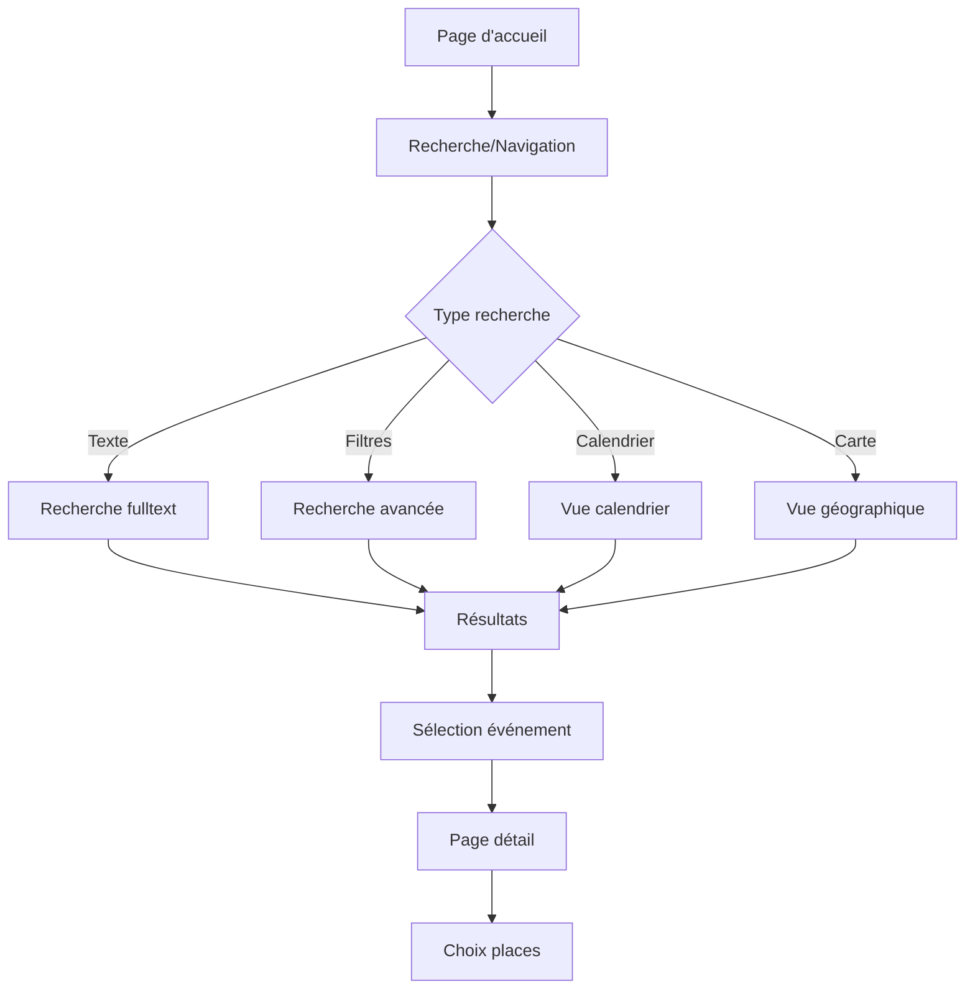
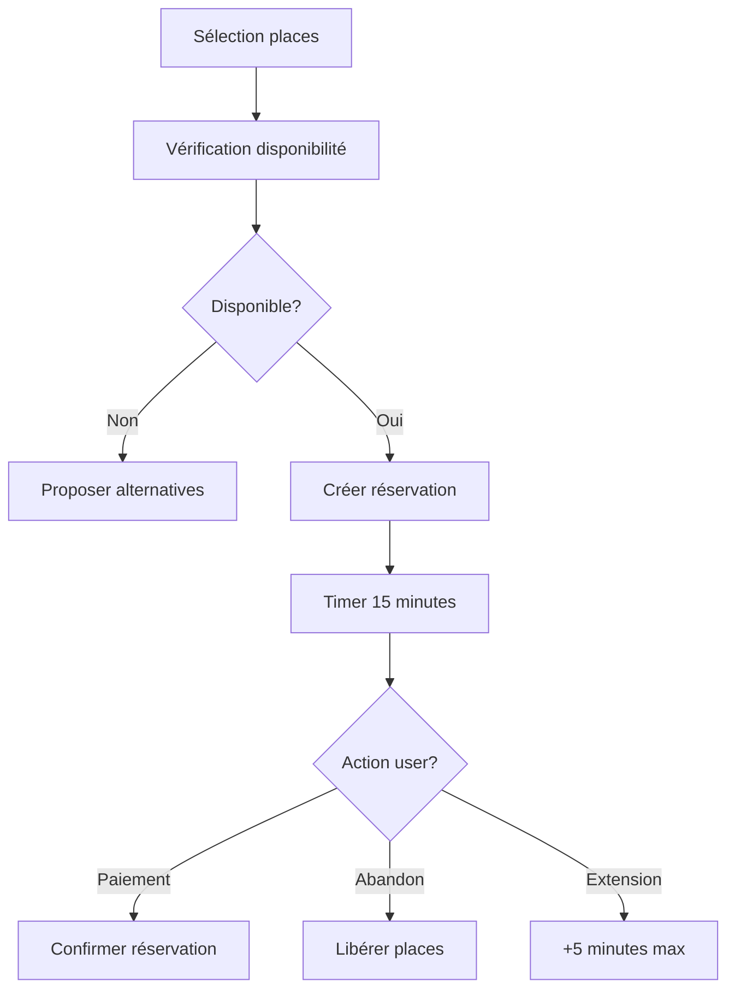
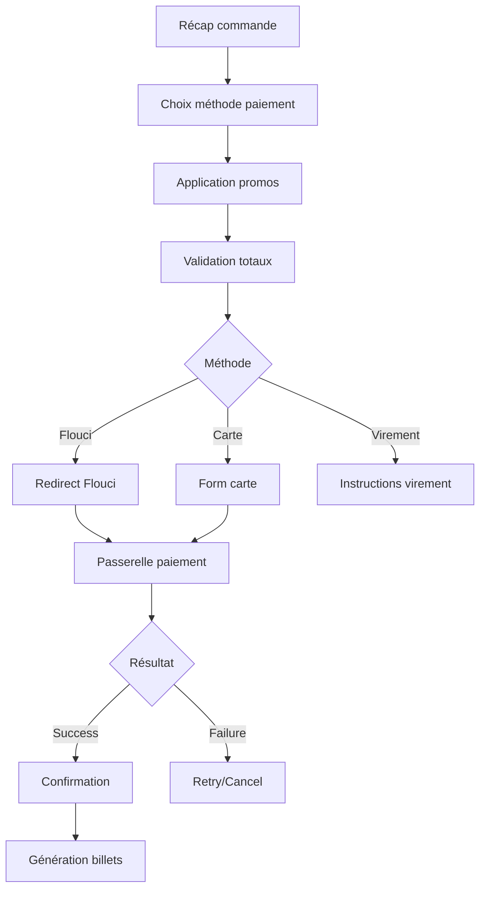
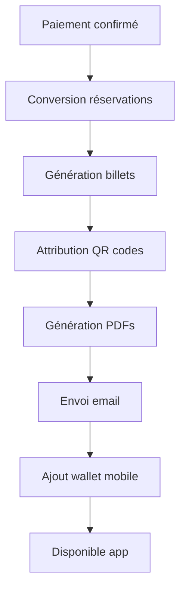
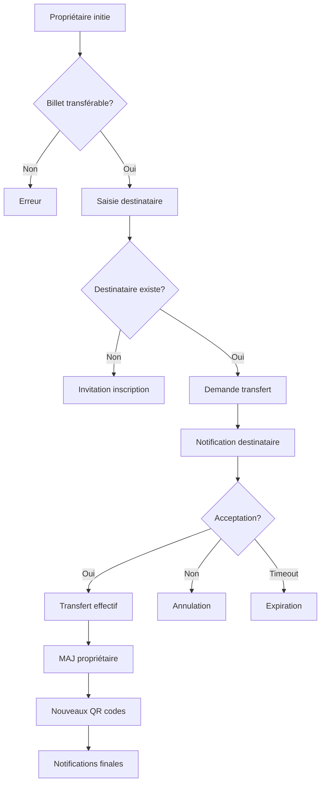

# Documentation Exhaustive des Processus Métiers Entrix V2.1
## Partie 3 : Parcours d'achat complet

---

## 📋 Table des Matières - Partie 3

1. [Processus de recherche et sélection](#recherche-selection)
2. [Processus de réservation temporaire](#reservation-temporaire)
3. [Processus de paiement](#processus-paiement)
4. [Processus de génération des billets](#generation-billets)
5. [Processus de transfert de billet](#transfert-billet)

---

## 🔍 Processus de recherche et sélection {#recherche-selection}

### Flux de recherche et découverte



### Étape 1 : Recherche d'événements

**Recherche fulltext avec scoring** :
```sql
-- Fonction recherche intelligente
CREATE OR REPLACE FUNCTION search_events(
    p_query TEXT,
    p_user_id UUID DEFAULT NULL,
    p_limit INT DEFAULT 20,
    p_offset INT DEFAULT 0
) RETURNS TABLE(
    event_id UUID,
    event_name TEXT,
    event_date TIMESTAMPTZ,
    venue_name TEXT,
    min_price DECIMAL,
    availability_status TEXT,
    relevance_score FLOAT,
    personalization_score FLOAT,
    total_score FLOAT
) AS $$
BEGIN
    RETURN QUERY
    WITH user_preferences AS (
        SELECT 
            COALESCE(up.preferences->'favorite_teams', '[]'::jsonb) as fav_teams,
            COALESCE(up.preferences->'event_categories', '[]'::jsonb) as fav_categories,
            COALESCE(up.preferences->'preferred_venues', '[]'::jsonb) as fav_venues
        FROM user_profiles up
        WHERE up.user_id = p_user_id
    ),
    search_results AS (
        SELECT 
            e.id,
            e.name,
            e.scheduled_start,
            v.name as venue,
            
            -- Prix minimum
            (SELECT MIN(etc.price_override) 
             FROM event_ticket_config etc 
             WHERE etc.event_id = e.id AND etc.is_active = TRUE) as min_price,
            
            -- Statut disponibilité
            CASE 
                WHEN (SELECT COUNT(*) FROM tickets t WHERE t.event_id = e.id) >= e.max_capacity * 0.95 THEN 'ALMOST_FULL'
                WHEN (SELECT COUNT(*) FROM tickets t WHERE t.event_id = e.id) >= e.max_capacity * 0.80 THEN 'LIMITED'
                ELSE 'AVAILABLE'
            END as availability,
            
            -- Score de pertinence textuelle
            GREATEST(
                -- Nom exact
                CASE WHEN LOWER(e.name) = LOWER(p_query) THEN 100 ELSE 0 END,
                -- Nom contient
                CASE WHEN LOWER(e.name) LIKE '%' || LOWER(p_query) || '%' THEN 80 ELSE 0 END,
                -- Description contient
                CASE WHEN LOWER(e.description) LIKE '%' || LOWER(p_query) || '%' THEN 60 ELSE 0 END,
                -- Tags correspondent
                CASE WHEN p_query = ANY(e.tags) THEN 70 ELSE 0 END,
                -- Participant correspond
                (SELECT MAX(CASE WHEN LOWER(p.name) LIKE '%' || LOWER(p_query) || '%' THEN 90 ELSE 0 END)
                 FROM event_participants ep
                 JOIN participants p ON ep.participant_id = p.id
                 WHERE ep.event_id = e.id)
            ) as text_score,
            
            -- Score personnalisation
            CASE WHEN p_user_id IS NOT NULL THEN
                -- Team favorite
                CASE WHEN EXISTS (
                    SELECT 1 FROM event_participants ep
                    JOIN participants p ON ep.participant_id = p.id
                    WHERE ep.event_id = e.id 
                    AND p.code = ANY(SELECT jsonb_array_elements_text(up.fav_teams) FROM user_preferences up)
                ) THEN 30 ELSE 0 END +
                -- Catégorie favorite
                CASE WHEN EXISTS (
                    SELECT 1 FROM event_categories ec
                    WHERE ec.id = e.category_id
                    AND ec.code = ANY(SELECT jsonb_array_elements_text(up.fav_categories) FROM user_preferences up)
                ) THEN 20 ELSE 0 END +
                -- Venue favorite
                CASE WHEN v.code = ANY(SELECT jsonb_array_elements_text(up.fav_venues) FROM user_preferences up)
                THEN 10 ELSE 0 END
            ELSE 0
            END as personalization,
            
            -- Boost événements proches temporellement
            CASE 
                WHEN e.scheduled_start BETWEEN NOW() AND NOW() + INTERVAL '7 days' THEN 20
                WHEN e.scheduled_start BETWEEN NOW() AND NOW() + INTERVAL '30 days' THEN 10
                ELSE 0
            END as time_boost
            
        FROM events e
        JOIN venues v ON e.venue_id = v.id
        LEFT JOIN user_preferences up ON true
        WHERE e.status = 'PUBLISHED'
          AND e.scheduled_start > NOW()
    )
    SELECT 
        id as event_id,
        name as event_name,
        scheduled_start as event_date,
        venue as venue_name,
        min_price,
        availability as availability_status,
        text_score as relevance_score,
        personalization as personalization_score,
        text_score + personalization + time_boost as total_score
    FROM search_results
    WHERE text_score > 0 OR p_query IS NULL OR p_query = ''
    ORDER BY total_score DESC, scheduled_start ASC
    LIMIT p_limit OFFSET p_offset;
END;
$$ LANGUAGE plpgsql;

-- Exemple recherche
SELECT * FROM search_events(
    'derby',                                    -- Recherche
    '550e8400-e29b-41d4-a716-446655440000',   -- User ID
    10,                                         -- Limit
    0                                          -- Offset
);
```

**Résultats avec enrichissement** :
```sql
-- Vue enrichie pour affichage résultats
CREATE OR REPLACE VIEW v_event_search_display AS
SELECT 
    e.id,
    e.code,
    e.name,
    e.scheduled_start,
    e.importance_level,
    
    -- Organisateur
    o.name as organizer_name,
    o.logo_url as organizer_logo,
    
    -- Venue
    v.name as venue_name,
    v.city as venue_city,
    v.capacity as venue_capacity,
    
    -- Participants principaux
    (SELECT json_agg(json_build_object(
        'name', p.name,
        'type', p.type,
        'logo', p.logo_url,
        'is_home', ep.is_home
    ) ORDER BY ep.display_order)
    FROM event_participants ep
    JOIN participants p ON ep.participant_id = p.id
    WHERE ep.event_id = e.id
    AND ep.role IN ('HOME_TEAM', 'AWAY_TEAM', 'HEADLINER')
    LIMIT 2) as main_participants,
    
    -- Tarifs
    (SELECT MIN(price_override) FROM event_ticket_config WHERE event_id = e.id AND is_active = TRUE) as price_from,
    (SELECT MAX(price_override) FROM event_ticket_config WHERE event_id = e.id AND is_active = TRUE) as price_to,
    
    -- Disponibilité
    e.max_capacity as total_capacity,
    (SELECT COUNT(*) FROM tickets WHERE event_id = e.id) as tickets_sold,
    CASE 
        WHEN (SELECT COUNT(*) FROM tickets WHERE event_id = e.id) >= e.max_capacity THEN 'SOLD_OUT'
        WHEN (SELECT COUNT(*) FROM tickets WHERE event_id = e.id) >= e.max_capacity * 0.95 THEN 'LAST_TICKETS'
        WHEN (SELECT COUNT(*) FROM tickets WHERE event_id = e.id) >= e.max_capacity * 0.80 THEN 'LIMITED'
        ELSE 'AVAILABLE'
    END as availability_badge,
    
    -- Médias
    (SELECT media_url FROM event_media WHERE event_id = e.id AND is_primary = TRUE LIMIT 1) as primary_image,
    
    -- Catégorie
    ec.name as category_name,
    ec.icon_url as category_icon,
    
    -- Promotions actives
    (SELECT COUNT(*) FROM pricing_rules pr 
     WHERE pr.organizer_id = e.organizer_id 
     AND pr.is_active = TRUE 
     AND NOW() BETWEEN pr.valid_from AND pr.valid_until
     AND (pr.metadata->>'event_id' = e.id::text OR pr.metadata->>'event_id' IS NULL)) as active_promos,
    
    -- Tags et features
    e.tags,
    CASE WHEN e.metadata->>'broadcast' IS NOT NULL THEN TRUE ELSE FALSE END as has_streaming,
    CASE WHEN e.metadata->>'vip_experience' IS NOT NULL THEN TRUE ELSE FALSE END as has_vip

FROM events e
JOIN organizers o ON e.organizer_id = o.id
JOIN venues v ON e.venue_id = v.id
JOIN event_categories ec ON e.category_id = ec.id
WHERE e.status = 'PUBLISHED'
  AND e.scheduled_start > NOW();
```

### Étape 2 : Filtres avancés

**Interface filtres dynamiques** :
```sql
-- Obtenir options de filtres disponibles
CREATE OR REPLACE FUNCTION get_search_filters()
RETURNS JSONB AS $$
BEGIN
    RETURN jsonb_build_object(
        'categories', (
            SELECT json_agg(json_build_object(
                'id', id,
                'code', code,
                'name', name,
                'count', (
                    SELECT COUNT(*) FROM events e 
                    WHERE e.category_id = ec.id 
                    AND e.status = 'PUBLISHED' 
                    AND e.scheduled_start > NOW()
                )
            ) ORDER BY name)
            FROM event_categories ec
            WHERE is_active = TRUE
        ),
        'venues', (
            SELECT json_agg(json_build_object(
                'id', id,
                'name', name,
                'city', city,
                'count', (
                    SELECT COUNT(*) FROM events e 
                    WHERE e.venue_id = v.id 
                    AND e.status = 'PUBLISHED' 
                    AND e.scheduled_start > NOW()
                )
            ) ORDER BY city, name)
            FROM venues v
            WHERE is_active = TRUE
        ),
        'price_ranges', json_build_array(
            json_build_object('label', 'Moins de 20 TND', 'min', 0, 'max', 20),
            json_build_object('label', '20-50 TND', 'min', 20, 'max', 50),
            json_build_object('label', '50-100 TND', 'min', 50, 'max', 100),
            json_build_object('label', 'Plus de 100 TND', 'min', 100, 'max', null)
        ),
        'dates', json_build_array(
            json_build_object('label', 'Cette semaine', 'days', 7),
            json_build_object('label', 'Ce mois', 'days', 30),
            json_build_object('label', 'Les 3 prochains mois', 'days', 90)
        ),
        'features', json_build_array(
            json_build_object('code', 'parking', 'label', 'Parking disponible'),
            json_build_object('code', 'streaming', 'label', 'Diffusion en ligne'),
            json_build_object('code', 'vip', 'label', 'Expérience VIP'),
            json_build_object('code', 'family', 'label', 'Adapté aux familles')
        )
    );
END;
$$ LANGUAGE plpgsql;

-- Application des filtres
CREATE OR REPLACE FUNCTION search_events_filtered(
    p_filters JSONB,
    p_user_id UUID DEFAULT NULL,
    p_sort_by TEXT DEFAULT 'date',
    p_limit INT DEFAULT 20,
    p_offset INT DEFAULT 0
) RETURNS SETOF v_event_search_display AS $$
BEGIN
    RETURN QUERY
    SELECT esd.*
    FROM v_event_search_display esd
    WHERE 
        -- Filtre catégories
        (p_filters->>'category_ids' IS NULL OR 
         esd.id IN (
            SELECT e.id FROM events e 
            WHERE e.category_id = ANY(
                SELECT jsonb_array_elements_text(p_filters->'category_ids')::UUID
            )
        ))
        -- Filtre venues
        AND (p_filters->>'venue_ids' IS NULL OR 
             esd.id IN (
                SELECT e.id FROM events e 
                WHERE e.venue_id = ANY(
                    SELECT jsonb_array_elements_text(p_filters->'venue_ids')::UUID
                )
            ))
        -- Filtre prix
        AND (p_filters->>'price_min' IS NULL OR 
             esd.price_from >= (p_filters->>'price_min')::DECIMAL)
        AND (p_filters->>'price_max' IS NULL OR 
             esd.price_from <= (p_filters->>'price_max')::DECIMAL)
        -- Filtre dates
        AND (p_filters->>'date_from' IS NULL OR 
             esd.scheduled_start >= (p_filters->>'date_from')::TIMESTAMPTZ)
        AND (p_filters->>'date_to' IS NULL OR 
             esd.scheduled_start <= (p_filters->>'date_to')::TIMESTAMPTZ)
        -- Filtre disponibilité
        AND (p_filters->>'availability' IS NULL OR 
             esd.availability_badge = p_filters->>'availability')
    ORDER BY 
        CASE p_sort_by
            WHEN 'date' THEN esd.scheduled_start
            WHEN 'price_asc' THEN esd.price_from
            WHEN 'price_desc' THEN -esd.price_from
            WHEN 'popularity' THEN -esd.tickets_sold
            ELSE esd.scheduled_start
        END
    LIMIT p_limit OFFSET p_offset;
END;
$$ LANGUAGE plpgsql;
```

### Étape 3 : Page détail événement

**Chargement données complètes** :
```sql
-- Vue détaillée événement pour affichage
CREATE OR REPLACE VIEW v_event_detail_page AS
SELECT 
    e.id,
    e.code,
    e.name,
    e.description,
    e.scheduled_start,
    e.scheduled_end,
    e.doors_open,
    
    -- Timing et statut
    CASE 
        WHEN e.scheduled_start < NOW() THEN 'PAST'
        WHEN e.scheduled_start < NOW() + INTERVAL '24 hours' THEN 'IMMINENT'
        WHEN e.scheduled_start < NOW() + INTERVAL '7 days' THEN 'THIS_WEEK'
        ELSE 'UPCOMING'
    END as timing_status,
    
    -- Organisateur détaillé
    json_build_object(
        'id', o.id,
        'name', o.name,
        'logo', o.logo_url,
        'verified', o.is_verified,
        'rating', (
            SELECT AVG(rating) FROM event_reviews er 
            JOIN events ev ON er.event_id = ev.id 
            WHERE ev.organizer_id = o.id
        ),
        'total_events', (
            SELECT COUNT(*) FROM events 
            WHERE organizer_id = o.id AND status != 'CANCELLED'
        )
    ) as organizer,
    
    -- Venue complet
    json_build_object(
        'id', v.id,
        'name', v.name,
        'address', v.address,
        'city', v.city,
        'coordinates', json_build_object(
            'lat', v.latitude,
            'lng', v.longitude
        ),
        'capacity', v.capacity,
        'facilities', v.facilities,
        'parking', v.parking_info,
        'public_transport', v.public_transport_info,
        'google_maps_url', 'https://maps.google.com/?q=' || v.latitude || ',' || v.longitude
    ) as venue,
    
    -- Participants détaillés
    (SELECT json_agg(json_build_object(
        'id', p.id,
        'name', p.name,
        'type', p.type,
        'role', ep.role,
        'is_home', ep.is_home,
        'logo', p.logo_url,
        'social_media', p.social_media,
        'stats', p.statistics
    ) ORDER BY ep.display_order)
    FROM event_participants ep
    JOIN participants p ON ep.participant_id = p.id
    WHERE ep.event_id = e.id) as participants,
    
    -- Configuration billetterie
    (SELECT json_agg(json_build_object(
        'type_id', tt.id,
        'type_name', tt.name,
        'zone_id', etc.zone_id,
        'zone_name', vz.name,
        'price', etc.price_override,
        'original_price', tt.base_price,
        'available', etc.quantity_available - COALESCE(
            (SELECT COUNT(*) FROM tickets t 
             WHERE t.event_id = e.id 
             AND t.ticket_type_id = tt.id 
             AND t.zone_id = etc.zone_id), 0
        ),
        'total_quantity', etc.quantity_available,
        'sales_start', etc.sales_start,
        'sales_end', etc.sales_end,
        'visibility', etc.visibility,
        'min_purchase', etc.min_purchase,
        'max_purchase', etc.max_purchase,
        'benefits', tt.benefits,
        'restrictions', tt.restrictions
    ) ORDER BY etc.price_override DESC)
    FROM event_ticket_config etc
    JOIN ticket_types tt ON etc.ticket_type_id = tt.id
    LEFT JOIN venue_zones vz ON etc.zone_id = vz.id
    WHERE etc.event_id = e.id 
    AND etc.is_active = TRUE) as ticket_options,
    
    -- Médias
    (SELECT json_agg(json_build_object(
        'type', media_type,
        'url', media_url,
        'title', title,
        'is_primary', is_primary,
        'metadata', metadata
    ) ORDER BY display_order)
    FROM event_media
    WHERE event_id = e.id) as media,
    
    -- Statistiques
    json_build_object(
        'capacity', e.max_capacity,
        'sold', (SELECT COUNT(*) FROM tickets WHERE event_id = e.id),
        'available', e.max_capacity - (SELECT COUNT(*) FROM tickets WHERE event_id = e.id),
        'fill_rate', ROUND(((SELECT COUNT(*) FROM tickets WHERE event_id = e.id)::DECIMAL / e.max_capacity) * 100, 1),
        'days_until', EXTRACT(DAY FROM e.scheduled_start - NOW()),
        'sales_velocity', (
            SELECT COUNT(*) FROM tickets 
            WHERE event_id = e.id 
            AND created_at > NOW() - INTERVAL '24 hours'
        )
    ) as stats,
    
    -- Promotions actives
    (SELECT json_agg(json_build_object(
        'code', COALESCE(cc.code, 'AUTO_PROMO_' || pr.id),
        'description', pr.description,
        'discount_type', pr.rule_type,
        'discount_value', CASE 
            WHEN pr.rule_type = 'PERCENTAGE_DISCOUNT' THEN pr.actions->>'discount_percentage'
            WHEN pr.rule_type = 'FIXED_DISCOUNT' THEN pr.actions->>'discount_amount'
            ELSE NULL
        END,
        'conditions', pr.conditions,
        'valid_until', pr.valid_until
    ))
    FROM pricing_rules pr
    LEFT JOIN coupon_codes cc ON cc.id = pr.id
    WHERE pr.organizer_id = e.organizer_id
    AND pr.is_active = TRUE
    AND NOW() BETWEEN pr.valid_from AND pr.valid_until
    AND (pr.metadata->>'event_id' = e.id::text OR pr.metadata->>'event_id' IS NULL)) as active_promotions,
    
    -- Métadonnées
    e.metadata,
    e.tags,
    e.importance_level

FROM events e
JOIN organizers o ON e.organizer_id = o.id
JOIN venues v ON e.venue_id = v.id
WHERE e.id = $1;
```

---

## ⏱️ Processus de réservation temporaire {#reservation-temporaire}

### Flux de réservation



### Étape 1 : Sélection des places

**Interface sélection avec plan interactif** :
```sql
-- Obtenir état zones en temps réel
CREATE OR REPLACE FUNCTION get_zone_availability(p_event_id UUID)
RETURNS TABLE(
    zone_id VARCHAR,
    zone_name TEXT,
    zone_category TEXT,
    total_seats INTEGER,
    available_seats INTEGER,
    price_from DECIMAL,
    price_to DECIMAL,
    fill_percentage INTEGER,
    status TEXT
) AS $$
BEGIN
    RETURN QUERY
    SELECT 
        vz.id,
        vz.name,
        vz.category,
        COALESCE(zmo.capacity_override, vz.capacity) as total,
        COALESCE(zmo.capacity_override, vz.capacity) - COUNT(t.id) as available,
        MIN(etc.price_override) as min_price,
        MAX(etc.price_override) as max_price,
        ROUND((COUNT(t.id)::DECIMAL / COALESCE(zmo.capacity_override, vz.capacity)) * 100) as fill_pct,
        CASE 
            WHEN COUNT(t.id) >= COALESCE(zmo.capacity_override, vz.capacity) THEN 'SOLD_OUT'
            WHEN COUNT(t.id) >= COALESCE(zmo.capacity_override, vz.capacity) * 0.9 THEN 'ALMOST_FULL'
            WHEN zmo.status_override = 'BLOCKED' THEN 'BLOCKED'
            ELSE 'AVAILABLE'
        END as zone_status
    FROM venue_zones vz
    JOIN events e ON e.venue_id = vz.venue_id
    LEFT JOIN zone_mapping_overrides zmo ON zmo.zone_id = vz.id AND zmo.event_id = e.id
    LEFT JOIN event_ticket_config etc ON etc.zone_id = vz.id AND etc.event_id = e.id
    LEFT JOIN tickets t ON t.zone_id = vz.id AND t.event_id = e.id
    WHERE e.id = p_event_id
    GROUP BY vz.id, vz.name, vz.category, vz.capacity, zmo.capacity_override, zmo.status_override;
END;
$$ LANGUAGE plpgsql;

-- Sélection places numérotées
CREATE OR REPLACE FUNCTION get_seats_for_zone(
    p_event_id UUID,
    p_zone_id VARCHAR
) RETURNS TABLE(
    seat_id VARCHAR,
    row_number VARCHAR,
    seat_number VARCHAR,
    category TEXT,
    status TEXT,
    price DECIMAL,
    features JSONB
) AS $$
BEGIN
    RETURN QUERY
    SELECT 
        s.id,
        s.row_number,
        s.seat_number,
        s.category,
        CASE 
            WHEN t.id IS NOT NULL THEN 'OCCUPIED'
            WHEN tr.id IS NOT NULL AND tr.expires_at > NOW() THEN 'RESERVED'
            WHEN s.is_active = FALSE THEN 'BLOCKED'
            ELSE 'AVAILABLE'
        END as seat_status,
        etc.price_override,
        json_build_object(
            'view_quality', s.view_quality,
            'is_wheelchair', s.is_wheelchair_accessible,
            'has_extra_legroom', s.has_extra_legroom,
            'notes', s.notes
        ) as features
    FROM seats s
    JOIN venue_zones vz ON s.zone_id = vz.id
    LEFT JOIN tickets t ON t.seat_id = s.id AND t.event_id = p_event_id
    LEFT JOIN temporary_reservations tr ON tr.seat_id = s.id 
        AND tr.event_id = p_event_id 
        AND tr.status = 'ACTIVE'
    LEFT JOIN event_ticket_config etc ON etc.zone_id = vz.id 
        AND etc.event_id = p_event_id
    WHERE vz.id = p_zone_id
    ORDER BY s.row_number, s.seat_number;
END;
$$ LANGUAGE plpgsql;
```

### Étape 2 : Création réservation temporaire

**Transaction de réservation** :
```sql
-- Créer réservation temporaire
CREATE OR REPLACE FUNCTION create_temporary_reservation(
    p_user_id UUID,
    p_event_id UUID,
    p_selections JSONB, -- Array of {zone_id, seat_id, ticket_type_id, quantity}
    p_session_id TEXT
) RETURNS TABLE(
    reservation_id UUID,
    order_number VARCHAR,
    expires_at TIMESTAMPTZ,
    total_amount DECIMAL,
    items JSONB
) AS $$
DECLARE
    v_order_id UUID;
    v_order_number VARCHAR;
    v_expires_at TIMESTAMPTZ;
    v_total DECIMAL := 0;
    v_item JSONB;
    v_seat_id VARCHAR;
    v_zone_id VARCHAR;
    v_ticket_type_id UUID;
    v_quantity INT;
    v_price DECIMAL;
    v_items JSONB := '[]'::jsonb;
BEGIN
    -- Générer numéro commande
    v_order_number := 'ORD_' || TO_CHAR(NOW(), 'YYYYMMDD') || '_' || 
                      LPAD(nextval('order_number_seq')::text, 5, '0');
    v_expires_at := NOW() + INTERVAL '15 minutes';
    
    -- Créer ordre en statut DRAFT
    INSERT INTO orders (
        id, order_number, user_id, status, expires_at, 
        purchase_channel, metadata
    ) VALUES (
        gen_random_uuid(),
        v_order_number,
        p_user_id,
        'DRAFT',
        v_expires_at,
        'WEB',
        jsonb_build_object(
            'session_id', p_session_id,
            'user_agent', current_setting('app.user_agent', true),
            'ip_address', current_setting('app.ip_address', true)
        )
    ) RETURNING id INTO v_order_id;
    
    -- Traiter chaque sélection
    FOR v_item IN SELECT * FROM jsonb_array_elements(p_selections)
    LOOP
        v_zone_id := v_item->>'zone_id';
        v_seat_id := v_item->>'seat_id';
        v_ticket_type_id := (v_item->>'ticket_type_id')::UUID;
        v_quantity := COALESCE((v_item->>'quantity')::INT, 1);
        
        -- Obtenir prix
        SELECT price_override INTO v_price
        FROM event_ticket_config
        WHERE event_id = p_event_id
          AND ticket_type_id = v_ticket_type_id
          AND (zone_id = v_zone_id OR zone_id IS NULL);
        
        -- Si places numérotées
        IF v_seat_id IS NOT NULL THEN
            -- Vérifier disponibilité avec verrou
            PERFORM 1 FROM seats s
            WHERE s.id = v_seat_id
            FOR UPDATE SKIP LOCKED;
            
            -- Vérifier pas déjà pris
            IF EXISTS (
                SELECT 1 FROM tickets t 
                WHERE t.seat_id = v_seat_id AND t.event_id = p_event_id
            ) THEN
                RAISE EXCEPTION 'Seat % already taken', v_seat_id;
            END IF;
            
            -- Vérifier pas déjà réservé
            IF EXISTS (
                SELECT 1 FROM temporary_reservations tr
                WHERE tr.seat_id = v_seat_id 
                  AND tr.event_id = p_event_id
                  AND tr.status = 'ACTIVE'
                  AND tr.expires_at > NOW()
            ) THEN
                RAISE EXCEPTION 'Seat % already reserved', v_seat_id;
            END IF;
            
            -- Créer réservation temporaire
            INSERT INTO temporary_reservations (
                id, order_id, event_id, user_id, zone_id, 
                seat_id, ticket_type_id, status, expires_at
            ) VALUES (
                gen_random_uuid(),
                v_order_id,
                p_event_id,
                p_user_id,
                v_zone_id,
                v_seat_id,
                v_ticket_type_id,
                'ACTIVE',
                v_expires_at
            );
            
        ELSE
            -- Placement libre - vérifier capacité zone
            DECLARE
                v_available INT;
            BEGIN
                SELECT 
                    COALESCE(zmo.capacity_override, vz.capacity) - 
                    COUNT(t.id) - 
                    COUNT(tr.id) INTO v_available
                FROM venue_zones vz
                LEFT JOIN zone_mapping_overrides zmo ON zmo.zone_id = vz.id 
                    AND zmo.event_id = p_event_id
                LEFT JOIN tickets t ON t.zone_id = vz.id 
                    AND t.event_id = p_event_id
                LEFT JOIN temporary_reservations tr ON tr.zone_id = vz.id 
                    AND tr.event_id = p_event_id 
                    AND tr.status = 'ACTIVE' 
                    AND tr.expires_at > NOW()
                WHERE vz.id = v_zone_id
                GROUP BY vz.capacity, zmo.capacity_override;
                
                IF v_available < v_quantity THEN
                    RAISE EXCEPTION 'Not enough available seats in zone %', v_zone_id;
                END IF;
                
                -- Créer réservations pour placement libre
                FOR i IN 1..v_quantity LOOP
                    INSERT INTO temporary_reservations (
                        id, order_id, event_id, user_id, zone_id,
                        ticket_type_id, status, expires_at
                    ) VALUES (
                        gen_random_uuid(),
                        v_order_id,
                        p_event_id,
                        p_user_id,
                        v_zone_id,
                        v_ticket_type_id,
                        'ACTIVE',
                        v_expires_at
                    );
                END LOOP;
            END;
        END IF;
        
        -- Ajouter item à la commande
        INSERT INTO order_items (
            id, order_id, ticket_type_id, event_id,
            item_type, item_name, quantity, unit_price, total_price
        ) VALUES (
            gen_random_uuid(),
            v_order_id,
            v_ticket_type_id,
            p_event_id,
            'TICKET',
            (SELECT name FROM ticket_types WHERE id = v_ticket_type_id),
            v_quantity,
            v_price,
            v_price * v_quantity
        );
        
        v_total := v_total + (v_price * v_quantity);
        
        -- Ajouter aux items retournés
        v_items := v_items || jsonb_build_object(
            'zone', v_zone_id,
            'seat', v_seat_id,
            'quantity', v_quantity,
            'unit_price', v_price,
            'subtotal', v_price * v_quantity
        );
    END LOOP;
    
    -- Mettre à jour total commande
    UPDATE orders 
    SET subtotal_amount = v_total,
        total_amount = v_total
    WHERE id = v_order_id;
    
    -- Retourner résultat
    RETURN QUERY
    SELECT 
        v_order_id,
        v_order_number,
        v_expires_at,
        v_total,
        v_items;
END;
$$ LANGUAGE plpgsql;

-- Exemple utilisation
SELECT * FROM create_temporary_reservation(
    '550e8400-e29b-41d4-a716-446655440000', -- user_id
    '890ab123-k45l-89m0-n123-456789012345', -- event_id Derby
    '[
        {
            "zone_id": "zone_tribune_est",
            "seat_id": "E3-R15-S22",
            "ticket_type_id": "type_tribune_premium",
            "quantity": 1
        },
        {
            "zone_id": "zone_tribune_est", 
            "seat_id": "E3-R15-S23",
            "ticket_type_id": "type_tribune_premium",
            "quantity": 1
        }
    ]'::jsonb,
    'session_abc123'
);
```

### Étape 3 : Gestion du timer et extensions

**Monitoring réservations actives** :
```sql
-- Job pour libérer réservations expirées
CREATE OR REPLACE FUNCTION release_expired_reservations()
RETURNS INTEGER AS $$
DECLARE
    v_released_count INTEGER;
BEGIN
    -- Marquer comme expirées
    UPDATE temporary_reservations
    SET status = 'EXPIRED',
        released_at = NOW()
    WHERE status = 'ACTIVE'
      AND expires_at < NOW();
    
    GET DIAGNOSTICS v_released_count = ROW_COUNT;
    
    -- Marquer ordres associés
    UPDATE orders o
    SET status = 'EXPIRED'
    WHERE status = 'DRAFT'
      AND expires_at < NOW()
      AND NOT EXISTS (
          SELECT 1 FROM temporary_reservations tr
          WHERE tr.order_id = o.id
          AND tr.status = 'ACTIVE'
      );
    
    -- Log libérations
    IF v_released_count > 0 THEN
        INSERT INTO system_logs (
            log_type, message, metadata
        ) VALUES (
            'RESERVATION_CLEANUP',
            v_released_count || ' reservations expired and released',
            jsonb_build_object(
                'count', v_released_count,
                'timestamp', NOW()
            )
        );
    END IF;
    
    RETURN v_released_count;
END;
$$ LANGUAGE plpgsql;

-- Extension de réservation (max 1 fois)
CREATE OR REPLACE FUNCTION extend_reservation(
    p_order_id UUID,
    p_user_id UUID
) RETURNS TIMESTAMPTZ AS $$
DECLARE
    v_current_expires TIMESTAMPTZ;
    v_extension_count INT;
    v_new_expires TIMESTAMPTZ;
BEGIN
    -- Vérifier propriétaire
    SELECT expires_at, 
           COALESCE((metadata->>'extension_count')::INT, 0)
    INTO v_current_expires, v_extension_count
    FROM orders
    WHERE id = p_order_id
      AND user_id = p_user_id
      AND status = 'DRAFT';
    
    IF NOT FOUND THEN
        RAISE EXCEPTION 'Order not found or not owned by user';
    END IF;
    
    -- Vérifier pas déjà expiré
    IF v_current_expires < NOW() THEN
        RAISE EXCEPTION 'Reservation already expired';
    END IF;
    
    -- Vérifier limite extensions
    IF v_extension_count >= 1 THEN
        RAISE EXCEPTION 'Maximum extensions reached';
    END IF;
    
    -- Accorder extension 5 minutes
    v_new_expires := v_current_expires + INTERVAL '5 minutes';
    
    -- Mettre à jour
    UPDATE orders
    SET expires_at = v_new_expires,
        metadata = jsonb_set(
            metadata,
            '{extension_count}',
            to_jsonb(v_extension_count + 1)
        )
    WHERE id = p_order_id;
    
    UPDATE temporary_reservations
    SET expires_at = v_new_expires
    WHERE order_id = p_order_id;
    
    RETURN v_new_expires;
END;
$$ LANGUAGE plpgsql;
```

---

## 💳 Processus de paiement {#processus-paiement}

### Flux de paiement complet



### Étape 1 : Finalisation commande

**Application codes promo et calculs** :
```sql
-- Appliquer code promo
CREATE OR REPLACE FUNCTION apply_promo_code(
    p_order_id UUID,
    p_promo_code TEXT
) RETURNS TABLE(
    success BOOLEAN,
    message TEXT,
    discount_amount DECIMAL,
    new_total DECIMAL
) AS $$
DECLARE
    v_order RECORD;
    v_promo RECORD;
    v_discount DECIMAL := 0;
    v_applicable_amount DECIMAL;
BEGIN
    -- Charger commande
    SELECT * INTO v_order
    FROM orders
    WHERE id = p_order_id AND status = 'DRAFT';
    
    IF NOT FOUND THEN
        RETURN QUERY SELECT FALSE, 'Commande introuvable', 0::DECIMAL, 0::DECIMAL;
        RETURN;
    END IF;
    
    -- Chercher code promo
    SELECT cc.*, pr.* 
    INTO v_promo
    FROM coupon_codes cc
    LEFT JOIN pricing_rules pr ON cc.pricing_rule_id = pr.id
    WHERE cc.code = UPPER(p_promo_code)
      AND cc.is_active = TRUE
      AND NOW() BETWEEN cc.valid_from AND cc.valid_until
      AND (cc.max_uses IS NULL OR cc.current_uses < cc.max_uses);
    
    IF NOT FOUND THEN
        -- Chercher règle automatique par code
        SELECT * INTO v_promo
        FROM pricing_rules
        WHERE code = UPPER(p_promo_code)
          AND is_active = TRUE
          AND NOW() BETWEEN valid_from AND valid_until;
          
        IF NOT FOUND THEN
            RETURN QUERY SELECT FALSE, 'Code promo invalide ou expiré', 0::DECIMAL, v_order.total_amount;
            RETURN;
        END IF;
    END IF;
    
    -- Vérifier conditions
    -- Montant minimum
    IF v_promo.conditions->>'min_amount' IS NOT NULL AND
       v_order.subtotal_amount < (v_promo.conditions->>'min_amount')::DECIMAL THEN
        RETURN QUERY SELECT FALSE, 
            'Montant minimum requis: ' || (v_promo.conditions->>'min_amount') || ' TND',
            0::DECIMAL, v_order.total_amount;
        RETURN;
    END IF;
    
    -- Événement spécifique
    IF v_promo.conditions->>'event_id' IS NOT NULL THEN
        IF NOT EXISTS (
            SELECT 1 FROM order_items oi
            WHERE oi.order_id = p_order_id
              AND oi.event_id = (v_promo.conditions->>'event_id')::UUID
        ) THEN
            RETURN QUERY SELECT FALSE, 'Code non valide pour cet événement', 
                0::DECIMAL, v_order.total_amount;
            RETURN;
        END IF;
    END IF;
    
    -- Calculer réduction
    v_applicable_amount := v_order.subtotal_amount;
    
    IF v_promo.rule_type = 'PERCENTAGE_DISCOUNT' THEN
        v_discount := v_applicable_amount * ((v_promo.actions->>'discount_percentage')::DECIMAL / 100);
        -- Plafonner si max défini
        IF v_promo.actions->>'max_discount_amount' IS NOT NULL THEN
            v_discount := LEAST(v_discount, (v_promo.actions->>'max_discount_amount')::DECIMAL);
        END IF;
    ELSIF v_promo.rule_type = 'FIXED_DISCOUNT' THEN
        v_discount := (v_promo.actions->>'discount_amount')::DECIMAL;
    END IF;
    
    -- Appliquer réduction
    UPDATE orders
    SET discount_amount = v_discount,
        coupon_code = UPPER(p_promo_code),
        total_amount = subtotal_amount - v_discount + processing_fee,
        metadata = jsonb_set(
            metadata,
            '{applied_promotions}',
            jsonb_build_array(jsonb_build_object(
                'code', UPPER(p_promo_code),
                'discount', v_discount,
                'type', v_promo.rule_type
            ))
        )
    WHERE id = p_order_id;
    
    -- Incrémenter usage
    IF v_promo.id IS NOT NULL THEN
        UPDATE coupon_codes
        SET current_uses = current_uses + 1
        WHERE code = UPPER(p_promo_code);
    END IF;
    
    RETURN QUERY SELECT 
        TRUE, 
        'Code promo appliqué avec succès',
        v_discount,
        v_order.subtotal_amount - v_discount + v_order.processing_fee;
END;
$$ LANGUAGE plpgsql;
```

**Calcul frais de service** :
```sql
-- Calculer frais finaux
CREATE OR REPLACE FUNCTION calculate_order_fees(p_order_id UUID)
RETURNS TABLE(
    subtotal DECIMAL,
    service_fee DECIMAL,
    payment_fee DECIMAL,
    tax_amount DECIMAL,
    discount DECIMAL,
    total DECIMAL
) AS $$
DECLARE
    v_order RECORD;
    v_service_fee DECIMAL;
    v_payment_fee DECIMAL;
    v_tax DECIMAL;
BEGIN
    SELECT * INTO v_order FROM orders WHERE id = p_order_id;
    
    -- Frais de service (3% + 1 TND par billet)
    SELECT 
        (o.subtotal_amount * 0.03) + (COUNT(oi.id) * 1.00)
    INTO v_service_fee
    FROM orders o
    JOIN order_items oi ON oi.order_id = o.id
    WHERE o.id = p_order_id
    GROUP BY o.subtotal_amount;
    
    -- Frais selon méthode paiement
    v_payment_fee := CASE 
        WHEN v_order.metadata->>'payment_method' = 'CARD' THEN v_order.subtotal_amount * 0.025
        WHEN v_order.metadata->>'payment_method' = 'FLOUCI' THEN 0.500 -- Fixe
        ELSE 0
    END;
    
    -- TVA 7% sur frais uniquement
    v_tax := (v_service_fee + v_payment_fee) * 0.07;
    
    -- Mettre à jour
    UPDATE orders
    SET processing_fee = v_service_fee + v_payment_fee,
        tax_amount = v_tax,
        total_amount = subtotal_amount - discount_amount + processing_fee + tax_amount
    WHERE id = p_order_id;
    
    RETURN QUERY
    SELECT 
        v_order.subtotal_amount,
        v_service_fee,
        v_payment_fee,
        v_tax,
        v_order.discount_amount,
        v_order.subtotal_amount - v_order.discount_amount + v_service_fee + v_payment_fee + v_tax;
END;
$$ LANGUAGE plpgsql;
```

### Étape 2 : Initiation paiement

**Création session paiement** :
```sql
-- Initier paiement
CREATE OR REPLACE FUNCTION initiate_payment(
    p_order_id UUID,
    p_payment_method_id UUID,
    p_return_url TEXT
) RETURNS TABLE(
    payment_id UUID,
    payment_url TEXT,
    reference VARCHAR,
    expires_at TIMESTAMPTZ
) AS $$
DECLARE
    v_order RECORD;
    v_payment_id UUID;
    v_payment_ref VARCHAR;
    v_gateway_response JSONB;
BEGIN
    -- Charger commande avec verrou
    SELECT * INTO v_order
    FROM orders
    WHERE id = p_order_id
    FOR UPDATE;
    
    -- Vérifier statut
    IF v_order.status != 'DRAFT' THEN
        RAISE EXCEPTION 'Order already processed';
    END IF;
    
    -- Vérifier réservations encore valides
    IF NOT EXISTS (
        SELECT 1 FROM temporary_reservations
        WHERE order_id = p_order_id
          AND status = 'ACTIVE'
          AND expires_at > NOW()
    ) THEN
        RAISE EXCEPTION 'Reservations expired';
    END IF;
    
    -- Générer référence paiement
    v_payment_ref := 'PAY_' || TO_CHAR(NOW(), 'YYYYMMDD') || '_' || 
                     LPAD(nextval('payment_number_seq')::text, 6, '0');
    
    -- Créer enregistrement paiement
    INSERT INTO payments (
        id,
        payment_number,
        order_id,
        payment_method_id,
        amount,
        currency,
        status,
        expires_at
    ) VALUES (
        gen_random_uuid(),
        v_payment_ref,
        p_order_id,
        p_payment_method_id,
        v_order.total_amount,
        v_order.currency,
        'PENDING',
        NOW() + INTERVAL '30 minutes'
    ) RETURNING id INTO v_payment_id;
    
    -- Selon méthode, appeler gateway approprié
    SELECT * INTO v_gateway_response
    FROM create_gateway_session(
        v_payment_id,
        p_payment_method_id,
        v_order.total_amount,
        p_return_url
    );
    
    -- Enregistrer réponse gateway
    UPDATE payments
    SET external_transaction_id = v_gateway_response->>'transaction_id',
        gateway_data = v_gateway_response
    WHERE id = v_payment_id;
    
    -- Log tentative
    INSERT INTO payment_attempts (
        payment_id,
        attempt_number,
        status,
        gateway_request,
        attempted_at
    ) VALUES (
        v_payment_id,
        1,
        'INITIATED',
        jsonb_build_object(
            'amount', v_order.total_amount,
            'method', p_payment_method_id,
            'timestamp', NOW()
        ),
        NOW()
    );
    
    RETURN QUERY
    SELECT 
        v_payment_id,
        v_gateway_response->>'payment_url',
        v_payment_ref,
        NOW() + INTERVAL '30 minutes';
END;
$$ LANGUAGE plpgsql;

-- Simulation gateway Flouci
CREATE OR REPLACE FUNCTION create_gateway_session(
    p_payment_id UUID,
    p_method_id UUID,
    p_amount DECIMAL,
    p_return_url TEXT
) RETURNS JSONB AS $$
DECLARE
    v_method RECORD;
    v_session_data JSONB;
BEGIN
    SELECT * INTO v_method
    FROM payment_methods
    WHERE id = p_method_id;
    
    IF v_method.code = 'FLOUCI' THEN
        -- API Flouci
        v_session_data := jsonb_build_object(
            'transaction_id', 'FLU_' || encode(gen_random_bytes(16), 'hex'),
            'payment_url', 'https://pay.flouci.com/gateway/' || encode(gen_random_bytes(8), 'hex'),
            'qr_code', 'https://api.qrserver.com/v1/create-qr-code/?data=' || p_payment_id,
            'expires_in', 1800,
            'amount', p_amount,
            'currency', 'TND',
            'merchant_ref', p_payment_id::text
        );
    ELSIF v_method.code = 'CARD' THEN
        -- Gateway carte bancaire
        v_session_data := jsonb_build_object(
            'transaction_id', 'CBT_' || encode(gen_random_bytes(16), 'hex'),
            'payment_url', 'https://secure.cmi.co.ma/pay/' || encode(gen_random_bytes(8), 'hex'),
            '3ds_required', p_amount > 100,
            'amount', p_amount,
            'currency', 'TND'
        );
    END IF;
    
    RETURN v_session_data;
END;
$$ LANGUAGE plpgsql;
```

### Étape 3 : Traitement callback paiement

**Webhook de confirmation** :
```sql
-- Traiter callback gateway
CREATE OR REPLACE FUNCTION process_payment_callback(
    p_payment_ref VARCHAR,
    p_gateway_status TEXT,
    p_gateway_data JSONB
) RETURNS TABLE(
    success BOOLEAN,
    order_id UUID,
    message TEXT
) AS $$
DECLARE
    v_payment RECORD;
    v_order RECORD;
BEGIN
    -- Charger paiement avec verrou
    SELECT p.*, o.*
    INTO v_payment
    FROM payments p
    JOIN orders o ON p.order_id = o.id
    WHERE p.payment_number = p_payment_ref
    FOR UPDATE;
    
    IF NOT FOUND THEN
        RETURN QUERY SELECT FALSE, NULL::UUID, 'Payment not found';
        RETURN;
    END IF;
    
    -- Log callback
    INSERT INTO payment_webhooks (
        payment_id,
        webhook_type,
        gateway_status,
        gateway_data,
        received_at
    ) VALUES (
        v_payment.id,
        'PAYMENT_CALLBACK',
        p_gateway_status,
        p_gateway_data,
        NOW()
    );
    
    -- Traiter selon statut
    IF p_gateway_status = 'SUCCESS' THEN
        -- Marquer paiement réussi
        UPDATE payments
        SET status = 'COMPLETED',
            payment_date = NOW(),
            gateway_data = gateway_data || p_gateway_data
        WHERE id = v_payment.id;
        
        -- Confirmer commande
        UPDATE orders
        SET status = 'CONFIRMED',
            confirmed_at = NOW(),
            payment_method_id = v_payment.payment_method_id
        WHERE id = v_payment.order_id;
        
        -- Convertir réservations en billets
        PERFORM finalize_order_tickets(v_payment.order_id);
        
        -- Envoyer confirmation
        PERFORM send_order_confirmation(v_payment.order_id);
        
        RETURN QUERY SELECT TRUE, v_payment.order_id, 'Payment successful';
        
    ELSIF p_gateway_status IN ('FAILED', 'CANCELLED', 'DECLINED') THEN
        -- Marquer échec
        UPDATE payments
        SET status = 'FAILED',
            gateway_data = gateway_data || p_gateway_data
        WHERE id = v_payment.id;
        
        -- Log tentative échouée
        INSERT INTO payment_attempts (
            payment_id,
            attempt_number,
            status,
            failure_reason,
            gateway_response,
            attempted_at
        ) VALUES (
            v_payment.id,
            (SELECT COUNT(*) + 1 FROM payment_attempts WHERE payment_id = v_payment.id),
            'FAILED',
            p_gateway_data->>'error_message',
            p_gateway_data,
            NOW()
        );
        
        RETURN QUERY SELECT FALSE, v_payment.order_id, 
            COALESCE(p_gateway_data->>'error_message', 'Payment failed');
            
    ELSE
        -- Statut inconnu
        RETURN QUERY SELECT FALSE, v_payment.order_id, 'Unknown payment status';
    END IF;
END;
$$ LANGUAGE plpgsql;
```

---

## 🎫 Processus de génération des billets {#generation-billets}

### Flux génération billets



### Étape 1 : Finalisation et génération billets

**Conversion réservations en billets** :
```sql
-- Finaliser commande et créer billets
CREATE OR REPLACE FUNCTION finalize_order_tickets(p_order_id UUID)
RETURNS INTEGER AS $$
DECLARE
    v_reservation RECORD;
    v_ticket_id UUID;
    v_ticket_number VARCHAR;
    v_access_code VARCHAR;
    v_qr_code VARCHAR;
    v_ticket_count INTEGER := 0;
    v_event_id UUID;
    v_organizer_id UUID;
BEGIN
    -- Récupérer info événement
    SELECT DISTINCT oi.event_id, e.organizer_id 
    INTO v_event_id, v_organizer_id
    FROM order_items oi
    JOIN events e ON oi.event_id = e.id
    WHERE oi.order_id = p_order_id
    LIMIT 1;
    
    -- Traiter chaque réservation
    FOR v_reservation IN 
        SELECT * FROM temporary_reservations
        WHERE order_id = p_order_id
          AND status = 'ACTIVE'
    LOOP
        -- Générer identifiants
        v_ticket_number := 'TKT_' || TO_CHAR(NOW(), 'YYYYMMDD') || '_' ||
                          LPAD(nextval('ticket_number_seq')::text, 6, '0');
        v_access_code := encode(gen_random_bytes(6), 'hex');
        v_qr_code := 'QR_' || encode(gen_random_bytes(12), 'hex');
        
        -- Créer billet
        INSERT INTO tickets (
            id,
            ticket_number,
            ticket_type_id,
            user_id,
            event_id,
            organizer_id,
            zone_id,
            seat_id,
            price_paid,
            currency,
            special_requirements,
            ticket_metadata
        ) VALUES (
            gen_random_uuid(),
            v_ticket_number,
            v_reservation.ticket_type_id,
            v_reservation.user_id,
            v_reservation.event_id,
            v_organizer_id,
            v_reservation.zone_id,
            v_reservation.seat_id,
            (SELECT unit_price FROM order_items 
             WHERE order_id = p_order_id 
             AND ticket_type_id = v_reservation.ticket_type_id
             LIMIT 1),
            'TND',
            v_reservation.metadata->>'special_requirements',
            jsonb_build_object(
                'order_id', p_order_id,
                'purchase_date', NOW(),
                'reservation_id', v_reservation.id
            )
        ) RETURNING id INTO v_ticket_id;
        
        -- Créer droit d'accès
        INSERT INTO access_rights (
            id,
            qr_code,
            user_id,
            event_id,
            organizer_id,
            ticket_id,
            zone_id,
            seat_id,
            status,
            source_type,
            access_code,
            valid_from,
            valid_until,
            max_uses
        ) VALUES (
            gen_random_uuid(),
            v_qr_code,
            v_reservation.user_id,
            v_reservation.event_id,
            v_organizer_id,
            v_ticket_id,
            v_reservation.zone_id,
            v_reservation.seat_id,
            'VALID',
            'TICKET',
            v_access_code,
            NOW(),
            (SELECT scheduled_end + INTERVAL '2 hours' 
             FROM events WHERE id = v_reservation.event_id),
            1
        );
        
        -- Marquer réservation comme convertie
        UPDATE temporary_reservations
        SET status = 'CONVERTED',
            converted_at = NOW(),
            ticket_id = v_ticket_id
        WHERE id = v_reservation.id;
        
        v_ticket_count := v_ticket_count + 1;
    END LOOP;
    
    -- Log génération
    INSERT INTO audit_logs (
        table_name,
        record_id,
        action,
        actor_id,
        changed_data
    ) VALUES (
        'tickets',
        p_order_id,
        'BATCH_CREATE',
        (SELECT user_id FROM orders WHERE id = p_order_id),
        jsonb_build_object(
            'count', v_ticket_count,
            'event_id', v_event_id
        )
    );
    
    RETURN v_ticket_count;
END;
$$ LANGUAGE plpgsql;
```

### Étape 2 : Génération documents PDF

**Template et génération PDF** :
```sql
-- Fonction génération données billet pour PDF
CREATE OR REPLACE FUNCTION generate_ticket_data(p_ticket_id UUID)
RETURNS JSONB AS $$
DECLARE
    v_ticket_data JSONB;
BEGIN
    SELECT jsonb_build_object(
        -- Informations billet
        'ticket', jsonb_build_object(
            'number', t.ticket_number,
            'qr_code', ar.qr_code,
            'access_code', ar.access_code,
            'price', t.price_paid || ' ' || t.currency,
            'purchase_date', TO_CHAR(t.created_at, 'DD/MM/YYYY HH24:MI'),
            'ticket_id', t.id
        ),
        
        -- Informations détenteur
        'holder', jsonb_build_object(
            'name', u.first_name || ' ' || u.last_name,
            'email', u.email,
            'phone', u.phone,
            'user_id', u.id
        ),
        
        -- Informations événement
        'event', jsonb_build_object(
            'name', e.name,
            'date', TO_CHAR(e.scheduled_start, 'Day DD Month YYYY'),
            'time', TO_CHAR(e.scheduled_start, 'HH24:MI'),
            'doors_open', TO_CHAR(e.doors_open, 'HH24:MI'),
            'venue', v.name,
            'address', v.address || ', ' || v.city,
            'category', ec.name
        ),
        
        -- Informations place
        'seat', jsonb_build_object(
            'zone', COALESCE(vz.name, 'Placement libre'),
            'zone_access', COALESCE(vz.metadata->>'entrance', 'Entrée principale'),
            'row', s.row_number,
            'seat', s.seat_number,
            'gate', COALESCE(vz.metadata->>'gate', 'A'),
            'location_text', CASE 
                WHEN s.seat_number IS NOT NULL 
                THEN vz.name || ' - Rang ' || s.row_number || ' - Place ' || s.seat_number
                ELSE vz.name || ' - Placement libre'
            END
        ),
        
        -- Participants (équipes/artistes)
        'participants', (
            SELECT json_agg(json_build_object(
                'name', p.name,
                'logo', p.logo_url,
                'role', ep.role
            ) ORDER BY ep.display_order)
            FROM event_participants ep
            JOIN participants p ON ep.participant_id = p.id
            WHERE ep.event_id = e.id
            LIMIT 2
        ),
        
        -- Type de billet
        'ticket_type', jsonb_build_object(
            'name', tt.name,
            'category', tt.category,
            'benefits', tt.benefits,
            'color', tt.color_code
        ),
        
        -- Organisateur
        'organizer', jsonb_build_object(
            'name', o.name,
            'logo', o.logo_url,
            'contact', o.email,
            'phone', o.phone
        ),
        
        -- QR Code URL complète
        'qr_code_url', 'https://api.qrserver.com/v1/create-qr-code/?size=500x500&data=' || 
                       encode(ar.qr_code::bytea, 'base64'),
        
        -- Conditions et mentions
        'terms', jsonb_build_object(
            'conditions', ARRAY[
                'Billet strictement personnel',
                'Présentation obligatoire d''une pièce d''identité',
                'Aucun remboursement sauf annulation',
                'Accès soumis au règlement intérieur'
            ],
            'support', jsonb_build_object(
                'email', 'support@entrix.tn',
                'phone', '+216 71 234 567',
                'website', 'https://help.entrix.tn'
            )
        ),
        
        -- Métadonnées sécurité
        'security', jsonb_build_object(
            'verification_url', 'https://verify.entrix.tn/' || ar.qr_code,
            'hash', encode(sha256((t.id || ar.qr_code || ar.access_code)::bytea), 'hex'),
            'issued_at', NOW()
        )
        
    ) INTO v_ticket_data
    FROM tickets t
    JOIN access_rights ar ON ar.ticket_id = t.id
    JOIN users u ON t.user_id = u.id
    JOIN events e ON t.event_id = e.id
    JOIN venues v ON e.venue_id = v.id
    JOIN event_categories ec ON e.category_id = ec.id
    JOIN ticket_types tt ON t.ticket_type_id = tt.id
    LEFT JOIN venue_zones vz ON t.zone_id = vz.id
    LEFT JOIN seats s ON t.seat_id = s.id
    JOIN organizers o ON e.organizer_id = o.id
    WHERE t.id = p_ticket_id;
    
    RETURN v_ticket_data;
END;
$$ LANGUAGE plpgsql;

-- Job asynchrone génération PDF
CREATE OR REPLACE FUNCTION generate_ticket_pdfs(p_order_id UUID)
RETURNS INTEGER AS $$
DECLARE
    v_ticket RECORD;
    v_pdf_count INTEGER := 0;
    v_pdf_url TEXT;
BEGIN
    FOR v_ticket IN 
        SELECT t.* 
        FROM tickets t
        JOIN order_items oi ON oi.order_id = p_order_id
        WHERE t.ticket_metadata->>'order_id' = p_order_id::text
    LOOP
        -- Appel service génération PDF
        SELECT generate_pdf_service(
            generate_ticket_data(v_ticket.id),
            'TMPL_DERBY_2025'
        ) INTO v_pdf_url;
        
        -- Stocker URL PDF
        UPDATE tickets
        SET ticket_metadata = ticket_metadata || 
            jsonb_build_object('pdf_url', v_pdf_url)
        WHERE id = v_ticket.id;
        
        v_pdf_count := v_pdf_count + 1;
    END LOOP;
    
    -- Marquer génération terminée
    UPDATE orders
    SET metadata = metadata || 
        jsonb_build_object(
            'pdfs_generated', true,
            'pdf_count', v_pdf_count,
            'generated_at', NOW()
        )
    WHERE id = p_order_id;
    
    RETURN v_pdf_count;
END;
$$ LANGUAGE plpgsql;
```

### Étape 3 : Envoi et distribution billets

**Email de confirmation avec billets** :
```sql
-- Préparer email confirmation
CREATE OR REPLACE FUNCTION send_order_confirmation(p_order_id UUID)
RETURNS BOOLEAN AS $$
DECLARE
    v_order RECORD;
    v_user RECORD;
    v_tickets JSONB;
    v_email_id UUID;
BEGIN
    -- Charger données commande
    SELECT 
        o.*,
        u.email,
        u.first_name,
        u.last_name,
        u.language
    INTO v_order
    FROM orders o
    JOIN users u ON o.user_id = u.id
    WHERE o.id = p_order_id;
    
    -- Collecter billets
    SELECT json_agg(
        json_build_object(
            'ticket_number', t.ticket_number,
            'event_name', e.name,
            'event_date', TO_CHAR(e.scheduled_start, 'DD/MM/YYYY HH24:MI'),
            'venue', v.name,
            'zone', COALESCE(vz.name, 'Placement libre'),
            'seat', CASE 
                WHEN s.seat_number IS NOT NULL 
                THEN 'Rang ' || s.row_number || ' - Place ' || s.seat_number
                ELSE 'Placement libre'
            END,
            'qr_code', ar.qr_code,
            'pdf_url', t.ticket_metadata->>'pdf_url'
        ) ORDER BY t.ticket_number
    ) INTO v_tickets
    FROM tickets t
    JOIN events e ON t.event_id = e.id
    JOIN venues v ON e.venue_id = v.id
    LEFT JOIN venue_zones vz ON t.zone_id = vz.id
    LEFT JOIN seats s ON t.seat_id = s.id
    JOIN access_rights ar ON ar.ticket_id = t.id
    WHERE t.ticket_metadata->>'order_id' = p_order_id::text;
    
    -- Créer email
    INSERT INTO email_queue (
        id,
        recipient_email,
        recipient_name,
        subject,
        template_id,
        template_data,
        attachments,
        priority,
        scheduled_for
    ) VALUES (
        gen_random_uuid(),
        v_order.email,
        v_order.first_name || ' ' || v_order.last_name,
        'Confirmation commande ' || v_order.order_number || ' - Vos billets',
        'ORDER_CONFIRMATION',
        jsonb_build_object(
            'order_number', v_order.order_number,
            'total_amount', v_order.total_amount || ' TND',
            'tickets_count', jsonb_array_length(v_tickets),
            'tickets', v_tickets,
            'download_all_url', 'https://entrix.tn/orders/' || p_order_id || '/download-all',
            'calendar_links', jsonb_build_object(
                'google', generate_calendar_link('google', (v_tickets->0)->>'event_name', (v_tickets->0)->>'event_date'),
                'outlook', generate_calendar_link('outlook', (v_tickets->0)->>'event_name', (v_tickets->0)->>'event_date'),
                'ics', 'https://entrix.tn/orders/' || p_order_id || '/calendar.ics'
            )
        ),
        v_tickets,
        'HIGH',
        NOW()
    ) RETURNING id INTO v_email_id;
    
    -- SMS de confirmation
    IF v_order.phone IS NOT NULL THEN
        INSERT INTO sms_queue (
            recipient_phone,
            message,
            priority,
            metadata
        ) VALUES (
            v_order.phone,
            'Entrix: Commande ' || v_order.order_number || ' confirmée! ' ||
            jsonb_array_length(v_tickets) || ' billet(s). ' ||
            'Consultez votre email ou l''app Entrix.',
            'HIGH',
            jsonb_build_object('order_id', p_order_id)
        );
    END IF;
    
    -- Push notification si app installée
    INSERT INTO push_notifications (
        user_id,
        title,
        body,
        data,
        priority
    ) VALUES (
        v_order.user_id,
        'Billets disponibles! 🎫',
        'Vos ' || jsonb_array_length(v_tickets) || ' billet(s) sont prêts',
        jsonb_build_object(
            'type', 'order_complete',
            'order_id', p_order_id,
            'deep_link', 'entrix://orders/' || p_order_id
        ),
        'high'
    );
    
    RETURN TRUE;
END;
$$ LANGUAGE plpgsql;

-- Ajout au wallet mobile
CREATE OR REPLACE FUNCTION generate_mobile_wallet_pass(p_ticket_id UUID)
RETURNS JSONB AS $$
DECLARE
    v_ticket_data JSONB;
    v_pass_data JSONB;
BEGIN
    -- Récupérer données billet
    v_ticket_data := generate_ticket_data(p_ticket_id);
    
    -- Format Apple Wallet / Google Pay
    v_pass_data := jsonb_build_object(
        'formatVersion', 1,
        'passTypeIdentifier', 'pass.tn.entrix.tickets',
        'serialNumber', v_ticket_data->'ticket'->>'number',
        'teamIdentifier', 'ENTRIX2025',
        'organizationName', 'Entrix',
        'description', v_ticket_data->'event'->>'name',
        'foregroundColor', 'rgb(255, 255, 255)',
        'backgroundColor', 'rgb(227, 6, 19)',
        'logoText', 'ENTRIX',
        
        -- Barcode
        'barcode', jsonb_build_object(
            'format', 'PKBarcodeFormatQR',
            'message', v_ticket_data->'ticket'->>'qr_code',
            'messageEncoding', 'iso-8859-1'
        ),
        
        -- Champs principaux
        'eventTicket', jsonb_build_object(
            'primaryFields', jsonb_build_array(
                jsonb_build_object(
                    'key', 'event',
                    'label', 'ÉVÉNEMENT',
                    'value', v_ticket_data->'event'->>'name'
                )
            ),
            'secondaryFields', jsonb_build_array(
                jsonb_build_object(
                    'key', 'loc',
                    'label', 'LIEU',
                    'value', v_ticket_data->'event'->>'venue'
                ),
                jsonb_build_object(
                    'key', 'date',
                    'label', 'DATE',
                    'value', v_ticket_data->'event'->>'date',
                    'dateStyle', 'PKDateStyleMedium'
                )
            ),
            'auxiliaryFields', jsonb_build_array(
                jsonb_build_object(
                    'key', 'seat',
                    'label', 'PLACE',
                    'value', v_ticket_data->'seat'->>'location_text'
                ),
                jsonb_build_object(
                    'key', 'doors',
                    'label', 'OUVERTURE',
                    'value', v_ticket_data->'event'->>'doors_open'
                )
            ),
            'backFields', jsonb_build_array(
                jsonb_build_object(
                    'key', 'terms',
                    'label', 'Conditions',
                    'value', array_to_string(
                        ARRAY(SELECT jsonb_array_elements_text(v_ticket_data->'terms'->'conditions')), 
                        E'\n'
                    )
                ),
                jsonb_build_object(
                    'key', 'support',
                    'label', 'Support',
                    'value', 'support@entrix.tn | +216 71 234 567'
                )
            )
        ),
        
        -- Localisation venue
        'locations', jsonb_build_array(
            jsonb_build_object(
                'latitude', 36.7450,
                'longitude', 10.2749,
                'relevantText', 'Vous êtes arrivé au ' || (v_ticket_data->'event'->>'venue')
            )
        ),
        
        -- Date pertinente
        'relevantDate', (
            SELECT scheduled_start - INTERVAL '3 hours'
            FROM events e
            JOIN tickets t ON t.event_id = e.id
            WHERE t.id = p_ticket_id
        )
    );
    
    -- Sauvegarder pass data
    UPDATE tickets
    SET ticket_metadata = ticket_metadata || 
        jsonb_build_object(
            'wallet_pass', v_pass_data,
            'pass_url', 'https://wallet.entrix.tn/passes/' || 
                       encode((p_ticket_id::text)::bytea, 'base64')
        )
    WHERE id = p_ticket_id;
    
    RETURN v_pass_data;
END;
$$ LANGUAGE plpgsql;
```

---

## 🔄 Processus de transfert de billet {#transfert-billet}

### Flux de transfert entre utilisateurs



### Étape 1 : Initiation du transfert

**Vérifications et création demande** :
```sql
-- Initier transfert billet
CREATE OR REPLACE FUNCTION initiate_ticket_transfer(
    p_ticket_id UUID,
    p_from_user_id UUID,
    p_to_identifier TEXT, -- Email ou téléphone
    p_message TEXT DEFAULT NULL
) RETURNS TABLE(
    transfer_id UUID,
    transfer_code VARCHAR,
    recipient_type TEXT,
    expires_at TIMESTAMPTZ,
    message TEXT
) AS $$
DECLARE
    v_ticket RECORD;
    v_recipient_id UUID;
    v_recipient_type TEXT;
    v_transfer_id UUID;
    v_transfer_code VARCHAR;
    v_expires_at TIMESTAMPTZ;
BEGIN
    -- Vérifier propriété et transférabilité
    SELECT 
        t.*,
        tt.is_transferable,
        ar.current_uses,
        e.scheduled_start,
        e.metadata->>'allow_transfers' as event_allows_transfers
    INTO v_ticket
    FROM tickets t
    JOIN ticket_types tt ON t.ticket_type_id = tt.id
    JOIN access_rights ar ON ar.ticket_id = t.id
    JOIN events e ON t.event_id = e.id
    WHERE t.id = p_ticket_id
      AND t.user_id = p_from_user_id
      AND t.is_active = TRUE;
    
    IF NOT FOUND THEN
        RAISE EXCEPTION 'Ticket not found or not owned by user';
    END IF;
    
    -- Vérifier transférable
    IF NOT v_ticket.is_transferable OR 
       v_ticket.event_allows_transfers = 'false' THEN
        RAISE EXCEPTION 'Ticket is not transferable';
    END IF;
    
    -- Vérifier pas déjà utilisé
    IF v_ticket.current_uses > 0 THEN
        RAISE EXCEPTION 'Ticket already used';
    END IF;
    
    -- Vérifier timing (pas moins de 24h avant)
    IF v_ticket.scheduled_start < NOW() + INTERVAL '24 hours' THEN
        RAISE EXCEPTION 'Too late to transfer - less than 24h before event';
    END IF;
    
    -- Identifier destinataire
    IF p_to_identifier ~ '^[^@]+@[^@]+\.[^@]+$' THEN
        -- Email
        v_recipient_type := 'EMAIL';
        SELECT id INTO v_recipient_id
        FROM users
        WHERE email = LOWER(p_to_identifier);
    ELSIF p_to_identifier ~ '^\+216[0-9]{8}$' THEN
        -- Téléphone
        v_recipient_type := 'PHONE';
        SELECT id INTO v_recipient_id
        FROM users
        WHERE phone = p_to_identifier;
    ELSE
        RAISE EXCEPTION 'Invalid recipient identifier';
    END IF;
    
    -- Générer code transfert
    v_transfer_code := 'TRF_' || UPPER(substr(md5(random()::text), 1, 8));
    v_expires_at := NOW() + INTERVAL '48 hours';
    
    -- Créer demande transfert
    INSERT INTO ticket_transfers (
        id,
        ticket_id,
        from_user_id,
        to_user_id,
        to_identifier,
        transfer_code,
        status,
        message,
        expires_at,
        initiated_at
    ) VALUES (
        gen_random_uuid(),
        p_ticket_id,
        p_from_user_id,
        v_recipient_id,
        p_to_identifier,
        v_transfer_code,
        'PENDING',
        p_message,
        v_expires_at,
        NOW()
    ) RETURNING id INTO v_transfer_id;
    
    -- Bloquer billet temporairement
    UPDATE tickets
    SET ticket_metadata = ticket_metadata || 
        jsonb_build_object(
            'transfer_pending', true,
            'transfer_id', v_transfer_id
        )
    WHERE id = p_ticket_id;
    
    -- Log dans access_transactions
    INSERT INTO access_transactions_log (
        access_right_id,
        transaction_type,
        from_user_id,
        to_user_id,
        from_status,
        to_status,
        reason,
        metadata
    ) VALUES (
        (SELECT id FROM access_rights WHERE ticket_id = p_ticket_id),
        'TRANSFER_INITIATED',
        p_from_user_id,
        v_recipient_id,
        'VALID',
        'PENDING_TRANSFER',
        p_message,
        jsonb_build_object(
            'transfer_id', v_transfer_id,
            'transfer_code', v_transfer_code
        )
    );
    
    -- Envoyer notifications
    PERFORM notify_transfer_recipient(
        v_transfer_id,
        v_recipient_id,
        p_to_identifier,
        v_recipient_type
    );
    
    RETURN QUERY
    SELECT 
        v_transfer_id,
        v_transfer_code,
        v_recipient_type,
        v_expires_at,
        CASE 
            WHEN v_recipient_id IS NULL 
            THEN 'Le destinataire devra créer un compte Entrix'
            ELSE 'Notification envoyée au destinataire'
        END;
END;
$$ LANGUAGE plpgsql;
```

### Étape 2 : Notification et acceptation

**Envoi notifications destinataire** :
```sql
-- Notifier destinataire du transfert
CREATE OR REPLACE FUNCTION notify_transfer_recipient(
    p_transfer_id UUID,
    p_recipient_id UUID,
    p_identifier TEXT,
    p_type TEXT
) RETURNS VOID AS $$
DECLARE
    v_transfer RECORD;
    v_ticket_info JSONB;
BEGIN
    -- Charger infos transfert et billet
    SELECT 
        tt.*,
        u_from.first_name || ' ' || u_from.last_name as from_name,
        jsonb_build_object(
            'event_name', e.name,
            'event_date', TO_CHAR(e.scheduled_start, 'DD/MM/YYYY HH24:MI'),
            'venue', v.name,
            'zone', COALESCE(vz.name, 'Placement libre'),
            'ticket_type', ttype.name
        ) as ticket_details
    INTO v_transfer
    FROM ticket_transfers tt
    JOIN tickets t ON tt.ticket_id = t.id
    JOIN users u_from ON tt.from_user_id = u_from.id
    JOIN events e ON t.event_id = e.id
    JOIN venues v ON e.venue_id = v.id
    LEFT JOIN venue_zones vz ON t.zone_id = vz.id
    JOIN ticket_types ttype ON t.ticket_type_id = ttype.id
    WHERE tt.id = p_transfer_id;
    
    IF p_recipient_id IS NOT NULL THEN
        -- Utilisateur existant - Email
        INSERT INTO email_queue (
            recipient_email,
            subject,
            template_id,
            template_data,
            priority
        ) VALUES (
            (SELECT email FROM users WHERE id = p_recipient_id),
            v_transfer.from_name || ' vous envoie un billet!',
            'TICKET_TRANSFER_REQUEST',
            jsonb_build_object(
                'from_name', v_transfer.from_name,
                'message', v_transfer.message,
                'ticket_details', v_transfer.ticket_details,
                'accept_url', 'https://entrix.tn/transfers/' || v_transfer.transfer_code || '/accept',
                'decline_url', 'https://entrix.tn/transfers/' || v_transfer.transfer_code || '/decline',
                'expires_at', TO_CHAR(v_transfer.expires_at, 'DD/MM/YYYY HH24:MI')
            ),
            'HIGH'
        );
        
        -- Push notification
        INSERT INTO push_notifications (
            user_id,
            title,
            body,
            data,
            priority
        ) VALUES (
            p_recipient_id,
            'Nouveau billet reçu! 🎫',
            v_transfer.from_name || ' vous envoie un billet pour ' || 
            (v_transfer.ticket_details->>'event_name'),
            jsonb_build_object(
                'type', 'transfer_request',
                'transfer_id', p_transfer_id,
                'deep_link', 'entrix://transfers/' || p_transfer_id
            ),
            'high'
        );
        
    ELSE
        -- Non-utilisateur - SMS ou Email d'invitation
        IF p_type = 'PHONE' THEN
            INSERT INTO sms_queue (
                recipient_phone,
                message,
                priority
            ) VALUES (
                p_identifier,
                v_transfer.from_name || ' vous envoie un billet sur Entrix! ' ||
                'Créez votre compte: https://entrix.tn/join/' || v_transfer.transfer_code,
                'HIGH'
            );
        ELSE
            INSERT INTO email_queue (
                recipient_email,
                subject,
                template_id,
                template_data,
                priority
            ) VALUES (
                p_identifier,
                v_transfer.from_name || ' vous envoie un billet sur Entrix!',
                'TICKET_TRANSFER_INVITE',
                jsonb_build_object(
                    'from_name', v_transfer.from_name,
                    'ticket_details', v_transfer.ticket_details,
                    'join_url', 'https://entrix.tn/join/' || v_transfer.transfer_code,
                    'transfer_code', v_transfer.transfer_code
                ),
                'HIGH'
            );
        END IF;
    END IF;
END;
$$ LANGUAGE plpgsql;
```

### Étape 3 : Acceptation et finalisation transfert

**Processus d'acceptation** :
```sql
-- Accepter transfert
CREATE OR REPLACE FUNCTION accept_ticket_transfer(
    p_transfer_code VARCHAR,
    p_user_id UUID
) RETURNS TABLE(
    success BOOLEAN,
    ticket_id UUID,
    message TEXT
) AS $$
DECLARE
    v_transfer RECORD;
    v_new_qr_code VARCHAR;
    v_new_access_code VARCHAR;
BEGIN
    -- Charger transfert avec verrou
    SELECT * INTO v_transfer
    FROM ticket_transfers
    WHERE transfer_code = p_transfer_code
      AND status = 'PENDING'
      AND expires_at > NOW()
    FOR UPDATE;
    
    IF NOT FOUND THEN
        RETURN QUERY SELECT FALSE, NULL::UUID, 'Transfer invalid or expired';
        RETURN;
    END IF;
    
    -- Vérifier destinataire correct
    IF v_transfer.to_user_id IS NOT NULL AND 
       v_transfer.to_user_id != p_user_id THEN
        RETURN QUERY SELECT FALSE, NULL::UUID, 'Transfer not for this user';
        RETURN;
    END IF;
    
    -- Si nouveau user, mettre à jour destinataire
    IF v_transfer.to_user_id IS NULL THEN
        UPDATE ticket_transfers
        SET to_user_id = p_user_id
        WHERE id = v_transfer.id;
    END IF;
    
    BEGIN
        -- Transaction transfert
        -- 1. Transférer le billet
        UPDATE tickets
        SET user_id = p_user_id,
            ticket_metadata = ticket_metadata || 
                jsonb_build_object(
                    'transferred', true,
                    'transfer_date', NOW(),
                    'transfer_from', v_transfer.from_user_id,
                    'transfer_id', v_transfer.id
                ) - 'transfer_pending'
        WHERE id = v_transfer.ticket_id;
        
        -- 2. Générer nouveaux codes d'accès
        v_new_qr_code := 'QR_' || encode(gen_random_bytes(12), 'hex');
        v_new_access_code := encode(gen_random_bytes(6), 'hex');
        
        -- 3. Mettre à jour access_rights
        UPDATE access_rights
        SET user_id = p_user_id,
            qr_code = v_new_qr_code,
            access_code = v_new_access_code,
            status = 'VALID',
            access_metadata = access_metadata || 
                jsonb_build_object(
                    'transferred', true,
                    'transfer_date', NOW(),
                    'previous_owner', v_transfer.from_user_id
                )
        WHERE ticket_id = v_transfer.ticket_id;
        
        -- 4. Marquer transfert complété
        UPDATE ticket_transfers
        SET status = 'COMPLETED',
            completed_at = NOW()
        WHERE id = v_transfer.id;
        
        -- 5. Log transaction
        INSERT INTO access_transactions_log (
            access_right_id,
            transaction_type,
            from_user_id,
            to_user_id,
            from_status,
            to_status,
            reason,
            metadata
        ) VALUES (
            (SELECT id FROM access_rights WHERE ticket_id = v_transfer.ticket_id),
            'TRANSFER_COMPLETED',
            v_transfer.from_user_id,
            p_user_id,
            'PENDING_TRANSFER',
            'VALID',
            'Transfer accepted',
            jsonb_build_object(
                'transfer_id', v_transfer.id,
                'new_qr_code', v_new_qr_code
            )
        );
        
        -- 6. Notifications
        -- Notifier ancien propriétaire
        INSERT INTO notification_queue (
            user_id,
            type,
            title,
            message,
            data
        ) VALUES (
            v_transfer.from_user_id,
            'TRANSFER_COMPLETED',
            'Transfert confirmé',
            'Votre billet a été transféré avec succès',
            jsonb_build_object('transfer_id', v_transfer.id)
        );
        
        -- Notifier nouveau propriétaire
        INSERT INTO notification_queue (
            user_id,
            type,
            title,
            message,
            data
        ) VALUES (
            p_user_id,
            'TICKET_RECEIVED',
            'Billet reçu!',
            'Votre nouveau billet est disponible',
            jsonb_build_object(
                'ticket_id', v_transfer.ticket_id,
                'transfer_id', v_transfer.id
            )
        );
        
        -- Générer nouveau PDF
        PERFORM generate_ticket_pdfs(
            (SELECT ticket_metadata->>'order_id' 
             FROM tickets 
             WHERE id = v_transfer.ticket_id)::UUID
        );
        
        RETURN QUERY SELECT TRUE, v_transfer.ticket_id, 'Transfer completed successfully';
        
    EXCEPTION WHEN OTHERS THEN
        -- Rollback et erreur
        RAISE;
    END;
END;
$$ LANGUAGE plpgsql;

-- Refuser transfert
CREATE OR REPLACE FUNCTION decline_ticket_transfer(
    p_transfer_code VARCHAR,
    p_user_id UUID,
    p_reason TEXT DEFAULT NULL
) RETURNS BOOLEAN AS $$
DECLARE
    v_transfer RECORD;
BEGIN
    -- Vérifier transfert
    SELECT * INTO v_transfer
    FROM ticket_transfers
    WHERE transfer_code = p_transfer_code
      AND status = 'PENDING'
      AND (to_user_id = p_user_id OR to_user_id IS NULL);
    
    IF NOT FOUND THEN
        RETURN FALSE;
    END IF;
    
    -- Marquer refusé
    UPDATE ticket_transfers
    SET status = 'DECLINED',
        declined_at = NOW(),
        decline_reason = p_reason
    WHERE id = v_transfer.id;
    
    -- Débloquer billet
    UPDATE tickets
    SET ticket_metadata = ticket_metadata - 'transfer_pending'
    WHERE id = v_transfer.ticket_id;
    
    -- Notifier propriétaire original
    INSERT INTO notification_queue (
        user_id,
        type,
        title,
        message,
        data
    ) VALUES (
        v_transfer.from_user_id,
        'TRANSFER_DECLINED',
        'Transfert refusé',
        'Le destinataire a refusé le transfert de votre billet',
        jsonb_build_object(
            'transfer_id', v_transfer.id,
            'reason', p_reason
        )
    );
    
    RETURN TRUE;
END;
$$ LANGUAGE plpgsql;
```

### Étape 4 : Cas spéciaux et marketplace

**Revente sur marketplace interne** :
```sql
-- Mettre billet en vente sur marketplace
CREATE OR REPLACE FUNCTION list_ticket_marketplace(
    p_ticket_id UUID,
    p_seller_id UUID,
    p_price DECIMAL,
    p_description TEXT DEFAULT NULL
) RETURNS UUID AS $$
DECLARE
    v_ticket RECORD;
    v_listing_id UUID;
    v_original_price DECIMAL;
    v_max_markup DECIMAL;
BEGIN
    -- Vérifier propriété et état
    SELECT 
        t.*,
        tt.is_transferable,
        e.scheduled_start,
        etc.price_override as original_price
    INTO v_ticket
    FROM tickets t
    JOIN ticket_types tt ON t.ticket_type_id = tt.id
    JOIN events e ON t.event_id = e.id
    JOIN event_ticket_config etc ON etc.event_id = e.id 
        AND etc.ticket_type_id = t.ticket_type_id
    WHERE t.id = p_ticket_id
      AND t.user_id = p_seller_id
      AND t.is_active = TRUE;
    
    IF NOT FOUND THEN
        RAISE EXCEPTION 'Ticket not found or not owned';
    END IF;
    
    -- Vérifier règles revente
    v_max_markup := COALESCE(
        (v_ticket.metadata->>'max_resale_markup')::DECIMAL,
        1.20 -- 20% max par défaut
    );
    
    IF p_price > v_ticket.original_price * v_max_markup THEN
        RAISE EXCEPTION 'Price exceeds maximum allowed markup';
    END IF;
    
    -- Créer annonce marketplace
    INSERT INTO marketplace_listings (
        id,
        ticket_id,
        seller_id,
        listing_price,
        original_price,
        currency,
        description,
        status,
        listed_at,
        expires_at
    ) VALUES (
        gen_random_uuid(),
        p_ticket_id,
        p_seller_id,
        p_price,
        v_ticket.original_price,
        'TND',
        p_description,
        'ACTIVE',
        NOW(),
        v_ticket.scheduled_start - INTERVAL '24 hours'
    ) RETURNING id INTO v_listing_id;
    
    -- Bloquer billet
    UPDATE tickets
    SET ticket_metadata = ticket_metadata || 
        jsonb_build_object(
            'marketplace_listing', v_listing_id,
            'listed_price', p_price
        )
    WHERE id = p_ticket_id;
    
    RETURN v_listing_id;
END;
$$ LANGUAGE plpgsql;

-- Acheter sur marketplace
CREATE OR REPLACE FUNCTION purchase_marketplace_ticket(
    p_listing_id UUID,
    p_buyer_id UUID,
    p_payment_method_id UUID
) RETURNS UUID AS $$
DECLARE
    v_listing RECORD;
    v_order_id UUID;
    v_transfer_id UUID;
    v_commission DECIMAL;
BEGIN
    -- Vérifier listing avec verrou
    SELECT * INTO v_listing
    FROM marketplace_listings
    WHERE id = p_listing_id
      AND status = 'ACTIVE'
      AND expires_at > NOW()
    FOR UPDATE;
    
    IF NOT FOUND THEN
        RAISE EXCEPTION 'Listing not available';
    END IF;
    
    -- Créer commande marketplace
    INSERT INTO orders (
        id,
        order_number,
        user_id,
        status,
        subtotal_amount,
        total_amount,
        currency,
        purchase_channel,
        metadata
    ) VALUES (
        gen_random_uuid(),
        'MKT_' || TO_CHAR(NOW(), 'YYYYMMDD') || '_' || 
        LPAD(nextval('order_number_seq')::text, 5, '0'),
        p_buyer_id,
        'PENDING_PAYMENT',
        v_listing.listing_price,
        v_listing.listing_price,
        v_listing.currency,
        'MARKETPLACE',
        jsonb_build_object(
            'listing_id', p_listing_id,
            'seller_id', v_listing.seller_id,
            'original_price', v_listing.original_price
        )
    ) RETURNING id INTO v_order_id;
    
    -- Process paiement...
    -- Si succès:
    
    -- Commission marketplace (5%)
    v_commission := v_listing.listing_price * 0.05;
    
    INSERT INTO marketplace_transactions (
        listing_id,
        buyer_id,
        seller_id,
        sale_price,
        marketplace_fee,
        seller_payout,
        status
    ) VALUES (
        p_listing_id,
        p_buyer_id,
        v_listing.seller_id,
        v_listing.listing_price,
        v_commission,
        v_listing.listing_price - v_commission,
        'COMPLETED'
    );
    
    -- Initier transfert automatique
    SELECT transfer_id INTO v_transfer_id
    FROM initiate_ticket_transfer(
        v_listing.ticket_id,
        v_listing.seller_id,
        (SELECT email FROM users WHERE id = p_buyer_id),
        'Achat marketplace automatique'
    );
    
    -- Auto-accepter transfert
    PERFORM accept_ticket_transfer(
        (SELECT transfer_code FROM ticket_transfers WHERE id = v_transfer_id),
        p_buyer_id
    );
    
    -- Marquer listing vendu
    UPDATE marketplace_listings
    SET status = 'SOLD',
        sold_at = NOW(),
        buyer_id = p_buyer_id
    WHERE id = p_listing_id;
    
    RETURN v_order_id;
END;
$$ LANGUAGE plpgsql;
```

---

## 📊 Dashboard et suivi post-achat

### Vue consolidée mes billets

```sql
-- Vue dashboard billets utilisateur
CREATE OR REPLACE VIEW v_user_tickets_dashboard AS
SELECT 
    t.id as ticket_id,
    t.ticket_number,
    
    -- Événement
    e.id as event_id,
    e.name as event_name,
    e.scheduled_start,
    e.scheduled_end,
    CASE 
        WHEN e.scheduled_start < NOW() THEN 'PAST'
        WHEN e.scheduled_start < NOW() + INTERVAL '7 days' THEN 'THIS_WEEK'
        WHEN e.scheduled_start < NOW() + INTERVAL '30 days' THEN 'THIS_MONTH'
        ELSE 'UPCOMING'
    END as event_timing,
    
    -- Lieu et place
    v.name as venue_name,
    v.city as venue_city,
    COALESCE(vz.name, 'Placement libre') as zone_name,
    CASE 
        WHEN s.seat_number IS NOT NULL 
        THEN 'Rang ' || s.row_number || ' Place ' || s.seat_number
        ELSE 'Placement libre'
    END as seat_info,
    
    -- Type et prix
    tt.name as ticket_type,
    t.price_paid,
    t.currency,
    
    -- Statut
    CASE 
        WHEN ar.current_uses >= ar.max_uses THEN 'USED'
        WHEN e.scheduled_start < NOW() THEN 'EXPIRED'
        WHEN t.ticket_metadata->>'marketplace_listing' IS NOT NULL THEN 'ON_SALE'
        WHEN t.ticket_metadata->>'transfer_pending' = 'true' THEN 'TRANSFER_PENDING'
        ELSE 'VALID'
    END as ticket_status,
    
    -- Actions disponibles
    CASE 
        WHEN e.scheduled_start > NOW() + INTERVAL '24 hours' 
             AND tt.is_transferable 
             AND ar.current_uses = 0
        THEN TRUE ELSE FALSE
    END as can_transfer,
    
    CASE 
        WHEN e.scheduled_start > NOW() + INTERVAL '7 days'
             AND tt.is_refundable
             AND ar.current_uses = 0
        THEN TRUE ELSE FALSE
    END as can_refund,
    
    -- QR et accès
    ar.qr_code,
    ar.access_code,
    'https://api.qrserver.com/v1/create-qr-code/?size=300x300&data=' || ar.qr_code as qr_url,
    
    -- Documents
    t.ticket_metadata->>'pdf_url' as pdf_url,
    t.ticket_metadata->>'wallet_pass_url' as wallet_url,
    
    -- Métadonnées
    t.created_at as purchase_date,
    t.ticket_metadata,
    
    -- Organisation
    t.user_id,
    EXTRACT(EPOCH FROM (e.scheduled_start - NOW())) as seconds_until_event

FROM tickets t
JOIN events e ON t.event_id = e.id
JOIN venues v ON e.venue_id = v.id
JOIN ticket_types tt ON t.ticket_type_id = tt.id
JOIN access_rights ar ON ar.ticket_id = t.id
LEFT JOIN venue_zones vz ON t.zone_id = vz.id
LEFT JOIN seats s ON t.seat_id = s.id
WHERE t.is_active = TRUE;

-- Fonction rappels automatiques
CREATE OR REPLACE FUNCTION send_event_reminders()
RETURNS INTEGER AS $$
DECLARE
    v_count INTEGER := 0;
    v_ticket RECORD;
BEGIN
    -- Rappel J-7
    FOR v_ticket IN 
        SELECT DISTINCT ON (user_id, event_id)
            user_id,
            event_id,
            event_name,
            scheduled_start,
            venue_name,
            COUNT(*) as ticket_count
        FROM v_user_tickets_dashboard
        WHERE seconds_until_event BETWEEN 6*24*3600 AND 7*24*3600
          AND ticket_status = 'VALID'
        GROUP BY user_id, event_id, event_name, scheduled_start, venue_name
    LOOP
        INSERT INTO notification_queue (
            user_id,
            type,
            channel,
            title,
            message,
            data,
            scheduled_for
        ) VALUES (
            v_ticket.user_id,
            'EVENT_REMINDER',
            'EMAIL',
            'Rappel: ' || v_ticket.event_name || ' dans 7 jours',
            'N''oubliez pas votre événement le ' || 
            TO_CHAR(v_ticket.scheduled_start, 'DD/MM à HH24:MI') ||
            ' au ' || v_ticket.venue_name,
            jsonb_build_object(
                'event_id', v_ticket.event_id,
                'ticket_count', v_ticket.ticket_count,
                'days_until', 7
            ),
            NOW()
        );
        
        v_count := v_count + 1;
    END LOOP;
    
    -- Rappel J-1
    FOR v_ticket IN 
        SELECT DISTINCT ON (user_id, event_id)
            user_id,
            event_id,
            event_name,
            scheduled_start,
            venue_name,
            COUNT(*) as ticket_count
        FROM v_user_tickets_dashboard
        WHERE seconds_until_event BETWEEN 20*3600 AND 28*3600
          AND ticket_status = 'VALID'
        GROUP BY user_id, event_id, event_name, scheduled_start, venue_name
    LOOP
        -- Email + SMS + Push
        INSERT INTO notification_queue (
            user_id, type, channel, title, message, data, priority
        ) VALUES (
            v_ticket.user_id,
            'EVENT_REMINDER_URGENT',
            'MULTI',
            '⚠️ Demain: ' || v_ticket.event_name,
            'Préparez-vous! Ouverture des portes à ' ||
            TO_CHAR(v_ticket.scheduled_start - INTERVAL '3 hours', 'HH24:MI'),
            jsonb_build_object(
                'event_id', v_ticket.event_id,
                'channels', ARRAY['email', 'sms', 'push'],
                'include_tickets', true,
                'include_transport_info', true
            ),
            'HIGH'
        );
        
        v_count := v_count + 1;
    END LOOP;
    
    RETURN v_count;
END;
$$ LANGUAGE plpgsql;
```

Cette documentation complète couvre l'ensemble du parcours d'achat, de la recherche initiale jusqu'au transfert des billets, avec tous les cas d'usage et les requêtes SQL correspondantes.