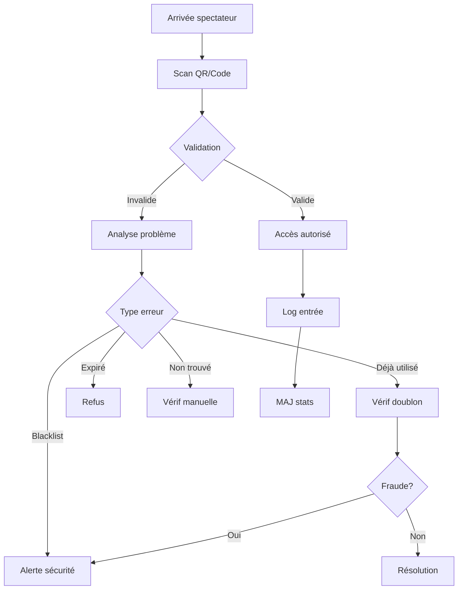
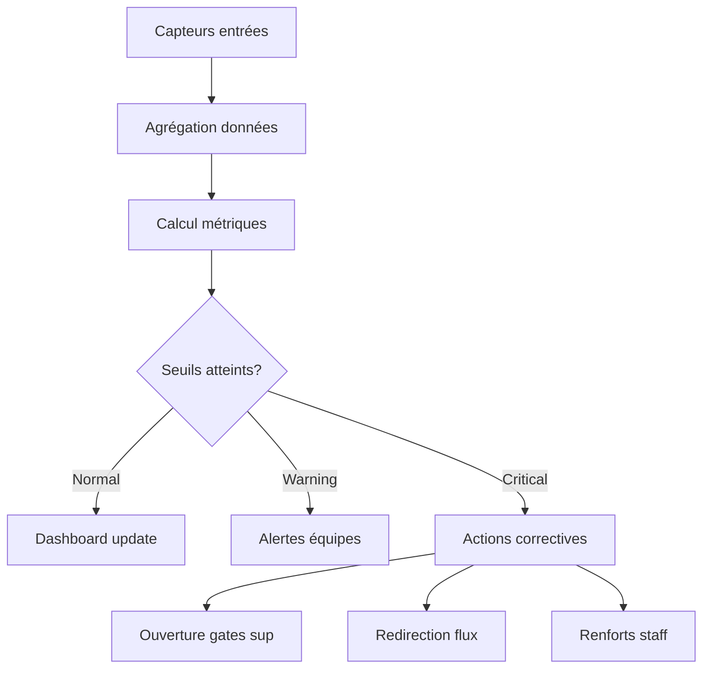
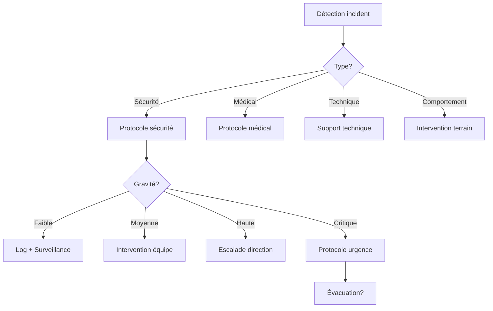

# Documentation Exhaustive des Processus Métiers Entrix V2.1
## Partie 4 : Contrôle d'accès et jour J

---

## 📋 Table des Matières - Partie 4

1. [Processus de contrôle d'accès](#controle-acces)
2. [Processus de gestion des flux](#gestion-flux)
3. [Processus de gestion des incidents](#gestion-incidents)
4. [Processus de monitoring temps réel](#monitoring-realtime)

---

## 🚪 Processus de contrôle d'accès {#controle-acces}

### Flux de validation d'accès



### Étape 1 : Configuration contrôle d'accès

**Setup points de contrôle** :
```sql
-- Configuration points d'accès pour événement
INSERT INTO access_points (
    id,
    venue_id,
    code,
    name,
    location,
    type,
    zones_served,
    is_active,
    metadata
) VALUES 
    -- Entrées principales
    (
        gen_random_uuid(),
        '234e5678-f90a-23d4-b567-537725285111', -- Stade Radès
        'GATE_A_MAIN',
        'Porte A - Entrée Principale',
        'GPS: 36.7450, 10.2749',
        'MAIN_ENTRANCE',
        ARRAY['zone_tribune_presidentielle', 'zone_tribune_est'],
        TRUE,
        jsonb_build_object(
            'capacity_per_hour', 3000,
            'lanes', 6,
            'equipment', ARRAY['scanner_pro_x5', 'metal_detector'],
            'staff_required', 8,
            'opens_before_event', '03:00:00'
        )
    ),
    -- Entrée VIP
    (
        gen_random_uuid(),
        '234e5678-f90a-23d4-b567-537725285111',
        'GATE_VIP',
        'Entrée VIP & Presse',
        'GPS: 36.7455, 10.2745',
        'VIP_ENTRANCE',
        ARRAY['zone_tribune_presidentielle', 'zone_presse'],
        TRUE,
        jsonb_build_object(
            'capacity_per_hour', 500,
            'lanes', 2,
            'equipment', ARRAY['scanner_premium', 'facial_recognition'],
            'staff_required', 4,
            'services', ARRAY['valet_parking', 'welcome_desk', 'concierge']
        )
    ),
    -- Entrées virages (séparées pour sécurité)
    (
        gen_random_uuid(),
        '234e5678-f90a-23d4-b567-537725285111',
        'GATE_NORTH',
        'Porte Nord - Supporters CA',
        'GPS: 36.7460, 10.2750',
        'SUPPORTER_ENTRANCE',
        ARRAY['zone_virage_nord'],
        TRUE,
        jsonb_build_object(
            'capacity_per_hour', 4000,
            'lanes', 8,
            'equipment', ARRAY['scanner_rapid', 'metal_detector', 'k9_unit'],
            'staff_required', 12,
            'security_level', 'MAXIMUM',
            'buffer_zone', true
        )
    ),
    (
        gen_random_uuid(),
        '234e5678-f90a-23d4-b567-537725285111',
        'GATE_SOUTH',
        'Porte Sud - Supporters Visiteurs',
        'GPS: 36.7440, 10.2750',
        'SUPPORTER_ENTRANCE',
        ARRAY['zone_virage_sud'],
        TRUE,
        jsonb_build_object(
            'capacity_per_hour', 4000,
            'lanes', 8,
            'separate_access_road', true,
            'police_checkpoint', true,
            'isolated_from', ARRAY['GATE_NORTH']
        )
    );

-- Configuration équipements scanning
INSERT INTO scanning_devices (
    id,
    device_code,
    device_name,
    access_point_id,
    device_type,
    capabilities,
    status,
    metadata
) VALUES 
    (
        gen_random_uuid(),
        'SCAN_A1_PRO',
        'Scanner Pro Porte A - Lane 1',
        (SELECT id FROM access_points WHERE code = 'GATE_A_MAIN'),
        'PROFESSIONAL',
        ARRAY['QR_CODE', 'BARCODE', 'NFC', 'FACIAL'],
        'READY',
        jsonb_build_object(
            'model', 'ZebraPro X500',
            'firmware', 'v3.2.1',
            'battery_life', '12h',
            'scan_speed_ms', 150,
            'offline_capable', true,
            'cache_size', 50000
        )
    ),
    (
        gen_random_uuid(),
        'SCAN_VIP_1',
        'Scanner Premium VIP',
        (SELECT id FROM access_points WHERE code = 'GATE_VIP'),
        'PREMIUM',
        ARRAY['QR_CODE', 'NFC', 'FACIAL', 'BIOMETRIC'],
        'READY',
        jsonb_build_object(
            'model', 'EntrixElite Pro',
            'features', ARRAY['thermal_camera', 'alcohol_detection'],
            'vip_features', ARRAY['welcome_message', 'photo_capture']
        )
    );
```

### Étape 2 : Processus de scan et validation

**Fonction validation accès principale** :
```sql
-- Fonction validation accès optimisée
CREATE OR REPLACE FUNCTION validate_access_right(
    p_qr_code TEXT,
    p_access_point_id UUID,
    p_scan_metadata JSONB DEFAULT '{}'
) RETURNS TABLE(
    validation_result access_status,
    ticket_info JSONB,
    access_info JSONB,
    security_alerts JSONB[]
) AS $$
DECLARE
    v_access_right RECORD;
    v_event RECORD;
    v_user RECORD;
    v_validation_result access_status;
    v_denial_reason denial_reason;
    v_ticket_info JSONB;
    v_access_info JSONB;
    v_alerts JSONB[] := '{}';
    v_scan_time TIMESTAMPTZ := NOW();
BEGIN
    -- 1. Recherche rapide avec index
    SELECT 
        ar.*,
        t.ticket_number,
        t.user_id,
        t.zone_id,
        t.seat_id,
        e.id as event_id,
        e.name as event_name,
        e.scheduled_start,
        e.scheduled_end,
        e.doors_open,
        tt.name as ticket_type_name
    INTO v_access_right
    FROM access_rights ar
    JOIN tickets t ON ar.ticket_id = t.id
    JOIN events e ON ar.event_id = e.id
    JOIN ticket_types tt ON t.ticket_type_id = tt.id
    WHERE ar.qr_code = p_qr_code
    LIMIT 1;
    
    IF NOT FOUND THEN
        -- Log tentative invalide
        INSERT INTO access_control_log (
            access_point_id, qr_code, action, result, 
            denial_reason, scan_metadata, scanned_at
        ) VALUES (
            p_access_point_id, p_qr_code, 'SCAN', 'DENIED',
            'INVALID_CODE', p_scan_metadata, v_scan_time
        );
        
        RETURN QUERY SELECT 
            'DENIED'::access_status,
            jsonb_build_object('error', 'Code invalide'),
            NULL::JSONB,
            ARRAY[jsonb_build_object(
                'type', 'INVALID_SCAN',
                'severity', 'LOW',
                'action', 'verify_manually'
            )];
        RETURN;
    END IF;
    
    -- 2. Vérifications de sécurité
    
    -- Check blacklist
    SELECT * INTO v_user FROM users WHERE id = v_access_right.user_id;
    
    IF EXISTS (
        SELECT 1 FROM blacklist b
        WHERE (b.user_id = v_access_right.user_id 
               OR b.email = v_user.email 
               OR b.phone = v_user.phone)
          AND b.is_active = TRUE
          AND (b.event_id = v_access_right.event_id OR b.event_id IS NULL)
    ) THEN
        v_validation_result := 'DENIED';
        v_denial_reason := 'BLACKLISTED';
        
        -- Alerte sécurité haute
        v_alerts := array_append(v_alerts, jsonb_build_object(
            'type', 'BLACKLIST_ATTEMPT',
            'severity', 'CRITICAL',
            'user_id', v_access_right.user_id,
            'action', 'security_intervention_required'
        ));
        
    -- Check timing événement
    ELSIF v_scan_time < v_access_right.doors_open THEN
        v_validation_result := 'DENIED';
        v_denial_reason := 'TOO_EARLY';
        
    ELSIF v_scan_time > v_access_right.scheduled_end + INTERVAL '1 hour' THEN
        v_validation_result := 'DENIED';
        v_denial_reason := 'EVENT_ENDED';
        
    -- Check validité temporelle billet
    ELSIF v_scan_time NOT BETWEEN v_access_right.valid_from AND v_access_right.valid_until THEN
        v_validation_result := 'DENIED';
        v_denial_reason := 'TICKET_EXPIRED';
        
    -- Check utilisation
    ELSIF v_access_right.current_uses >= v_access_right.max_uses THEN
        -- Vérifier si vraie réutilisation ou erreur
        IF EXISTS (
            SELECT 1 FROM access_control_log
            WHERE access_right_id = v_access_right.id
              AND result = 'GRANTED'
              AND scanned_at > v_scan_time - INTERVAL '4 hours'
        ) THEN
            v_validation_result := 'DENIED';
            v_denial_reason := 'ALREADY_USED';
            
            -- Alerte possible fraude
            v_alerts := array_append(v_alerts, jsonb_build_object(
                'type', 'DUPLICATE_ENTRY_ATTEMPT',
                'severity', 'HIGH',
                'previous_scan', (
                    SELECT json_build_object(
                        'time', scanned_at,
                        'access_point', ap.name
                    )
                    FROM access_control_log acl
                    JOIN access_points ap ON acl.access_point_id = ap.id
                    WHERE acl.access_right_id = v_access_right.id
                    ORDER BY scanned_at DESC
                    LIMIT 1
                )
            ));
        END IF;
        
    -- Check zone autorisée pour ce point d'accès
    ELSIF NOT EXISTS (
        SELECT 1 FROM access_points ap
        WHERE ap.id = p_access_point_id
          AND v_access_right.zone_id = ANY(ap.zones_served)
    ) THEN
        v_validation_result := 'DENIED';
        v_denial_reason := 'WRONG_ENTRANCE';
        
    ELSE
        -- Toutes vérifications OK
        v_validation_result := 'GRANTED';
        
        -- Incrémenter utilisation
        UPDATE access_rights
        SET current_uses = current_uses + 1,
            used_at = v_scan_time,
            used_at_access_point = p_access_point_id::text
        WHERE id = v_access_right.id;
    END IF;
    
    -- 3. Log résultat
    INSERT INTO access_control_log (
        id,
        access_right_id,
        access_point_id,
        user_id,
        event_id,
        action,
        result,
        denial_reason,
        controller_device,
        ip_address,
        scan_metadata,
        scanned_at
    ) VALUES (
        gen_random_uuid(),
        v_access_right.id,
        p_access_point_id,
        v_access_right.user_id,
        v_access_right.event_id,
        'SCAN',
        v_validation_result,
        v_denial_reason,
        p_scan_metadata->>'device_id',
        (p_scan_metadata->>'ip_address')::inet,
        p_scan_metadata,
        v_scan_time
    );
    
    -- 4. Préparer réponse
    v_ticket_info := jsonb_build_object(
        'ticket_number', v_access_right.ticket_number,
        'holder_name', v_user.first_name || ' ' || v_user.last_name,
        'ticket_type', v_access_right.ticket_type_name,
        'zone', (SELECT name FROM venue_zones WHERE id = v_access_right.zone_id),
        'seat', CASE 
            WHEN v_access_right.seat_id IS NOT NULL THEN
                (SELECT 'Rang ' || row_number || ' Place ' || seat_number 
                 FROM seats WHERE id = v_access_right.seat_id)
            ELSE 'Placement libre'
        END
    );
    
    v_access_info := jsonb_build_object(
        'result', v_validation_result,
        'reason', v_denial_reason,
        'entry_number', v_access_right.current_uses,
        'max_entries', v_access_right.max_uses,
        'scan_time', v_scan_time,
        'message', CASE v_validation_result
            WHEN 'GRANTED' THEN 'Bienvenue! Bon match!'
            WHEN 'DENIED' THEN CASE v_denial_reason
                WHEN 'ALREADY_USED' THEN 'Billet déjà utilisé'
                WHEN 'BLACKLISTED' THEN 'Accès refusé - Contactez la sécurité'
                WHEN 'WRONG_ENTRANCE' THEN 'Mauvaise entrée - Utilisez ' || 
                    (SELECT name FROM access_points WHERE zones_served @> ARRAY[v_access_right.zone_id] LIMIT 1)
                ELSE 'Accès refusé'
            END
        END
    );
    
    -- 5. Déclencher actions temps réel
    IF v_validation_result = 'GRANTED' THEN
        -- Mettre à jour compteurs
        PERFORM update_realtime_stats(
            v_access_right.event_id,
            p_access_point_id,
            v_access_right.zone_id
        );
        
        -- Si VIP, déclencher accueil spécial
        IF v_access_right.ticket_type_name LIKE '%VIP%' THEN
            PERFORM notify_vip_arrival(
                v_access_right.user_id,
                v_access_right.event_id,
                p_access_point_id
            );
        END IF;
    END IF;
    
    RETURN QUERY SELECT 
        v_validation_result,
        v_ticket_info,
        v_access_info,
        v_alerts;
END;
$$ LANGUAGE plpgsql;

-- Fonction traitement scan offline
CREATE OR REPLACE FUNCTION process_offline_scans(p_batch JSONB)
RETURNS INTEGER AS $$
DECLARE
    v_scan JSONB;
    v_processed INTEGER := 0;
BEGIN
    -- Traiter batch de scans offline
    FOR v_scan IN SELECT * FROM jsonb_array_elements(p_batch)
    LOOP
        -- Vérifier pas déjà traité
        IF NOT EXISTS (
            SELECT 1 FROM access_control_log
            WHERE scan_metadata->>'offline_id' = v_scan->>'offline_id'
        ) THEN
            -- Insérer avec timestamp original
            INSERT INTO access_control_log (
                access_right_id,
                access_point_id,
                user_id,
                event_id,
                action,
                result,
                scan_metadata,
                scanned_at,
                created_at
            ) VALUES (
                (SELECT id FROM access_rights WHERE qr_code = v_scan->>'qr_code'),
                (v_scan->>'access_point_id')::UUID,
                (v_scan->>'user_id')::UUID,
                (v_scan->>'event_id')::UUID,
                'SCAN_OFFLINE',
                (v_scan->>'result')::access_status,
                v_scan->'metadata',
                (v_scan->>'scan_time')::TIMESTAMPTZ,
                NOW()
            );
            
            v_processed := v_processed + 1;
        END IF;
    END LOOP;
    
    RETURN v_processed;
END;
$$ LANGUAGE plpgsql;
```

### Étape 3 : Gestion des cas spéciaux

**Validation manuelle et exceptions** :
```sql
-- Override manuel par superviseur
CREATE OR REPLACE FUNCTION manual_access_override(
    p_user_identifier TEXT, -- Email, phone ou ID
    p_event_id UUID,
    p_access_point_id UUID,
    p_supervisor_id UUID,
    p_reason TEXT
) RETURNS UUID AS $$
DECLARE
    v_user_id UUID;
    v_access_id UUID;
    v_ticket_id UUID;
BEGIN
    -- Identifier utilisateur
    IF p_user_identifier ~ '^[0-9a-f-]{36}$' THEN
        v_user_id := p_user_identifier::UUID;
    ELSE
        SELECT id INTO v_user_id
        FROM users
        WHERE email = p_user_identifier 
           OR phone = p_user_identifier
        LIMIT 1;
    END IF;
    
    IF v_user_id IS NULL THEN
        RAISE EXCEPTION 'User not found';
    END IF;
    
    -- Vérifier droits superviseur
    IF NOT EXISTS (
        SELECT 1 FROM user_roles ur
        JOIN roles r ON ur.role_id = r.id
        WHERE ur.user_id = p_supervisor_id
          AND r.code IN ('SECURITY_SUPERVISOR', 'ADMIN')
    ) THEN
        RAISE EXCEPTION 'Insufficient privileges';
    END IF;
    
    -- Chercher billet existant
    SELECT t.id INTO v_ticket_id
    FROM tickets t
    WHERE t.user_id = v_user_id
      AND t.event_id = p_event_id
      AND t.is_active = TRUE
    LIMIT 1;
    
    IF v_ticket_id IS NOT NULL THEN
        -- Utiliser billet existant
        SELECT id INTO v_access_id
        FROM access_rights
        WHERE ticket_id = v_ticket_id;
    ELSE
        -- Créer accès temporaire exceptionnel
        INSERT INTO access_rights (
            id,
            qr_code,
            user_id,
            event_id,
            source_type,
            status,
            access_code,
            valid_from,
            valid_until,
            max_uses,
            access_metadata
        ) VALUES (
            gen_random_uuid(),
            'MANUAL_' || encode(gen_random_bytes(8), 'hex'),
            v_user_id,
            p_event_id,
            'MANUAL_OVERRIDE',
            'VALID',
            encode(gen_random_bytes(6), 'hex'),
            NOW(),
            NOW() + INTERVAL '6 hours',
            1,
            jsonb_build_object(
                'override_reason', p_reason,
                'authorized_by', p_supervisor_id,
                'access_point', p_access_point_id,
                'created_at', NOW()
            )
        ) RETURNING id INTO v_access_id;
    END IF;
    
    -- Log override
    INSERT INTO access_control_log (
        access_right_id,
        access_point_id,
        user_id,
        event_id,
        action,
        result,
        notes,
        scanned_at
    ) VALUES (
        v_access_id,
        p_access_point_id,
        v_user_id,
        p_event_id,
        'MANUAL_OVERRIDE',
        'GRANTED',
        'Superviseur: ' || p_supervisor_id || ' - Raison: ' || p_reason,
        NOW()
    );
    
    -- Audit trail
    INSERT INTO security_events (
        event_type,
        severity,
        user_id,
        event_id,
        description,
        metadata
    ) VALUES (
        'MANUAL_ACCESS_OVERRIDE',
        'MEDIUM',
        v_user_id,
        p_event_id,
        'Accès manuel autorisé',
        jsonb_build_object(
            'supervisor_id', p_supervisor_id,
            'reason', p_reason,
            'access_point_id', p_access_point_id
        )
    );
    
    RETURN v_access_id;
END;
$$ LANGUAGE plpgsql;

-- Gestion groupe/famille
CREATE OR REPLACE FUNCTION validate_group_access(
    p_qr_codes TEXT[],
    p_access_point_id UUID
) RETURNS TABLE(
    qr_code TEXT,
    result access_status,
    seat_info TEXT,
    issues TEXT[]
) AS $$
DECLARE
    v_all_valid BOOLEAN := TRUE;
    v_same_zone BOOLEAN := TRUE;
    v_zones TEXT[];
BEGIN
    -- Valider chaque billet du groupe
    RETURN QUERY
    WITH validations AS (
        SELECT 
            qr,
            (validate_access_right(qr, p_access_point_id)).*
        FROM unnest(p_qr_codes) AS qr
    ),
    zone_check AS (
        SELECT DISTINCT
            v.qr_code,
            v.validation_result,
            v.ticket_info->>'zone' as zone,
            v.ticket_info->>'seat' as seat
        FROM validations v
    )
    SELECT 
        zc.qr_code,
        zc.validation_result,
        zc.zone || ' - ' || zc.seat,
        CASE 
            WHEN zc.validation_result != 'GRANTED' 
            THEN ARRAY['Billet invalide']
            WHEN COUNT(DISTINCT zc.zone) OVER() > 1 
            THEN ARRAY['Attention: Zones différentes']
            ELSE ARRAY[]::TEXT[]
        END
    FROM zone_check zc;
END;
$$ LANGUAGE plpgsql;
```

---

## 🚶 Processus de gestion des flux {#gestion-flux}

### Monitoring flux temps réel



### Configuration monitoring flux

```sql
-- Table métriques temps réel
CREATE TABLE IF NOT EXISTS realtime_metrics (
    id UUID PRIMARY KEY DEFAULT gen_random_uuid(),
    event_id UUID NOT NULL,
    metric_type VARCHAR(50) NOT NULL,
    metric_name VARCHAR(100) NOT NULL,
    metric_value DECIMAL,
    zone_id VARCHAR(255),
    access_point_id UUID,
    measured_at TIMESTAMPTZ NOT NULL DEFAULT NOW(),
    metadata JSONB
);

-- Fonction mise à jour stats temps réel
CREATE OR REPLACE FUNCTION update_realtime_stats(
    p_event_id UUID,
    p_access_point_id UUID,
    p_zone_id VARCHAR
) RETURNS VOID AS $$
DECLARE
    v_current_entries INTEGER;
    v_entry_rate DECIMAL;
    v_queue_length INTEGER;
    v_avg_wait_time INTERVAL;
BEGIN
    -- Calculer entrées actuelles
    SELECT COUNT(*) INTO v_current_entries
    FROM access_control_log
    WHERE event_id = p_event_id
      AND result = 'GRANTED'
      AND scanned_at > NOW() - INTERVAL '1 hour';
    
    -- Taux d'entrée (par minute)
    SELECT COUNT(*) / 5.0 INTO v_entry_rate
    FROM access_control_log
    WHERE event_id = p_event_id
      AND access_point_id = p_access_point_id
      AND result = 'GRANTED'
      AND scanned_at > NOW() - INTERVAL '5 minutes';
    
    -- Insérer métriques
    INSERT INTO realtime_metrics (
        event_id, metric_type, metric_name, metric_value,
        zone_id, access_point_id, metadata
    ) VALUES 
        (p_event_id, 'ATTENDANCE', 'current_inside', v_current_entries, 
         NULL, NULL, NULL),
        (p_event_id, 'FLOW_RATE', 'entries_per_minute', v_entry_rate,
         p_zone_id, p_access_point_id, jsonb_build_object('period', '5min')),
        (p_event_id, 'CAPACITY', 'zone_fill_rate', 
         (SELECT COUNT(*)::DECIMAL / capacity * 100 
          FROM tickets t
          JOIN venue_zones vz ON t.zone_id = vz.id
          WHERE t.event_id = p_event_id AND t.zone_id = p_zone_id
          GROUP BY vz.capacity),
         p_zone_id, NULL, NULL);
    
    -- Déclencher alertes si nécessaire
    PERFORM check_flow_alerts(p_event_id, p_access_point_id);
END;
$$ LANGUAGE plpgsql;

-- Dashboard vue temps réel
CREATE OR REPLACE VIEW v_event_realtime_dashboard AS
WITH latest_metrics AS (
    SELECT DISTINCT ON (event_id, metric_type, metric_name, zone_id, access_point_id)
        *
    FROM realtime_metrics
    WHERE measured_at > NOW() - INTERVAL '10 minutes'
    ORDER BY event_id, metric_type, metric_name, zone_id, access_point_id, measured_at DESC
),
entry_stats AS (
    SELECT 
        event_id,
        COUNT(*) FILTER (WHERE scanned_at > NOW() - INTERVAL '1 hour') as entries_last_hour,
        COUNT(*) FILTER (WHERE scanned_at > NOW() - INTERVAL '5 minutes') as entries_last_5min,
        COUNT(*) FILTER (WHERE result = 'DENIED') as denials_today,
        COUNT(DISTINCT user_id) as unique_attendees
    FROM access_control_log
    WHERE scanned_at > CURRENT_DATE
    GROUP BY event_id
)
SELECT 
    e.id as event_id,
    e.name as event_name,
    e.scheduled_start,
    
    -- Capacité et remplissage
    e.max_capacity,
    es.unique_attendees as current_attendance,
    ROUND((es.unique_attendees::DECIMAL / e.max_capacity) * 100, 1) as fill_percentage,
    
    -- Flux d'entrée
    es.entries_last_hour,
    es.entries_last_5min,
    ROUND(es.entries_last_5min / 5.0, 1) as entry_rate_per_min,
    
    -- Projection
    CASE 
        WHEN es.entries_last_5min > 0 THEN
            ROUND((e.max_capacity - es.unique_attendees) / (es.entries_last_5min / 5.0))
        ELSE NULL
    END as minutes_to_full,
    
    -- Statut global
    CASE 
        WHEN es.unique_attendees >= e.max_capacity * 0.95 THEN 'CRITICAL'
        WHEN es.unique_attendees >= e.max_capacity * 0.80 THEN 'WARNING'
        WHEN es.entries_last_5min / 5.0 > 100 THEN 'HIGH_FLOW'
        ELSE 'NORMAL'
    END as status,
    
    -- Détail par zone
    (SELECT json_agg(json_build_object(
        'zone_name', vz.name,
        'capacity', vz.capacity,
        'current', COUNT(DISTINCT acl.user_id),
        'fill_rate', ROUND((COUNT(DISTINCT acl.user_id)::DECIMAL / vz.capacity) * 100, 1),
        'entry_rate', (
            SELECT metric_value 
            FROM latest_metrics lm 
            WHERE lm.zone_id = vz.id 
              AND lm.metric_name = 'entries_per_minute'
        )
    ))
    FROM venue_zones vz
    LEFT JOIN access_control_log acl ON acl.event_id = e.id 
        AND acl.zone_id = vz.id 
        AND acl.result = 'GRANTED'
        AND acl.scanned_at > CURRENT_DATE
    WHERE vz.venue_id = e.venue_id
    GROUP BY vz.id, vz.name, vz.capacity) as zones_detail,
    
    -- Points d'accès
    (SELECT json_agg(json_build_object(
        'access_point', ap.name,
        'type', ap.type,
        'entries_5min', COUNT(acl.id),
        'rate_per_min', ROUND(COUNT(acl.id) / 5.0, 1),
        'avg_scan_time', ROUND(AVG(
            EXTRACT(MILLISECONDS FROM (acl.created_at - acl.scanned_at))
        ), 0),
        'queue_estimate', CASE 
            WHEN COUNT(acl.id) > 0 THEN
                ROUND((ap.metadata->>'capacity_per_hour')::DECIMAL / 60 - COUNT(acl.id) / 5.0)
            ELSE 0
        END
    ))
    FROM access_points ap
    LEFT JOIN access_control_log acl ON acl.access_point_id = ap.id
        AND acl.event_id = e.id
        AND acl.scanned_at > NOW() - INTERVAL '5 minutes'
    WHERE ap.venue_id = e.venue_id
    GROUP BY ap.id, ap.name, ap.type, ap.metadata) as access_points_detail,
    
    -- Problèmes détectés
    es.denials_today,
    (SELECT COUNT(*) FROM security_events 
     WHERE event_id = e.id 
       AND created_at > CURRENT_DATE
       AND severity IN ('HIGH', 'CRITICAL')) as security_incidents

FROM events e
JOIN entry_stats es ON e.id = es.event_id
WHERE e.status = 'PUBLISHED'
  AND e.scheduled_start BETWEEN NOW() - INTERVAL '3 hours' AND NOW() + INTERVAL '6 hours';
```

### Gestion files d'attente et redirection

```sql
-- Détection congestion et actions
CREATE OR REPLACE FUNCTION check_flow_alerts(
    p_event_id UUID,
    p_access_point_id UUID
) RETURNS VOID AS $$
DECLARE
    v_entry_rate DECIMAL;
    v_capacity_rate DECIMAL;
    v_queue_estimate INTEGER;
    v_alert_level TEXT;
    v_access_point RECORD;
BEGIN
    -- Récupérer config point d'accès
    SELECT * INTO v_access_point
    FROM access_points
    WHERE id = p_access_point_id;
    
    -- Calculer taux entrée actuel
    SELECT COUNT(*) / 5.0 INTO v_entry_rate
    FROM access_control_log
    WHERE access_point_id = p_access_point_id
      AND scanned_at > NOW() - INTERVAL '5 minutes';
    
    v_capacity_rate := (v_access_point.metadata->>'capacity_per_hour')::DECIMAL / 60;
    
    -- Estimer longueur file
    v_queue_estimate := GREATEST(0, 
        (v_entry_rate - v_capacity_rate) * 5
    );
    
    -- Déterminer niveau alerte
    v_alert_level := CASE
        WHEN v_queue_estimate > 100 THEN 'CRITICAL'
        WHEN v_queue_estimate > 50 THEN 'HIGH'
        WHEN v_queue_estimate > 20 THEN 'MEDIUM'
        WHEN v_entry_rate > v_capacity_rate * 0.8 THEN 'LOW'
        ELSE NULL
    END;
    
    IF v_alert_level IS NOT NULL THEN
        -- Créer alerte
        INSERT INTO flow_alerts (
            id,
            event_id,
            access_point_id,
            alert_type,
            severity,
            metrics,
            suggested_actions,
            created_at
        ) VALUES (
            gen_random_uuid(),
            p_event_id,
            p_access_point_id,
            'QUEUE_CONGESTION',
            v_alert_level,
            jsonb_build_object(
                'entry_rate_per_min', v_entry_rate,
                'capacity_rate_per_min', v_capacity_rate,
                'estimated_queue_size', v_queue_estimate,
                'estimated_wait_time', v_queue_estimate / v_capacity_rate
            ),
            CASE v_alert_level
                WHEN 'CRITICAL' THEN jsonb_build_array(
                    'Ouvrir portes supplémentaires urgence',
                    'Déployer équipes mobiles scanning',
                    'Activer bypass VIP temporaire',
                    'Communication file attente'
                )
                WHEN 'HIGH' THEN jsonb_build_array(
                    'Renforcer staff scanning',
                    'Préparer ouverture gates additionnels',
                    'Orienter vers entrées moins chargées'
                )
                ELSE jsonb_build_array(
                    'Surveiller évolution',
                    'Préparer renforts'
                )
            END,
            NOW()
        )
        ON CONFLICT (event_id, access_point_id, alert_type) 
        WHERE resolved_at IS NULL
        DO UPDATE SET
            severity = EXCLUDED.severity,
            metrics = EXCLUDED.metrics,
            updated_at = NOW();
        
        -- Notifications automatiques
        IF v_alert_level IN ('HIGH', 'CRITICAL') THEN
            PERFORM notify_operations_team(
                p_event_id,
                'FLOW_ALERT',
                jsonb_build_object(
                    'access_point', v_access_point.name,
                    'severity', v_alert_level,
                    'queue_size', v_queue_estimate
                )
            );
        END IF;
        
        -- Actions automatiques critiques
        IF v_alert_level = 'CRITICAL' THEN
            -- Activer gates overflow automatiquement
            UPDATE access_points
            SET is_active = TRUE,
                metadata = metadata || jsonb_build_object(
                    'emergency_activated', true,
                    'activated_at', NOW()
                )
            WHERE venue_id = v_access_point.venue_id
              AND type = 'EMERGENCY'
              AND is_active = FALSE;
            
            -- Message public
            INSERT INTO public_announcements (
                event_id,
                message,
                zones_affected,
                priority,
                display_screens,
                audio_announcement
            ) VALUES (
                p_event_id,
                'Forte affluence ' || v_access_point.name || 
                '. Veuillez utiliser les autres entrées disponibles.',
                v_access_point.zones_served,
                'HIGH',
                TRUE,
                TRUE
            );
        END IF;
    END IF;
END;
$$ LANGUAGE plpgsql;

-- Redirection intelligente flux
CREATE OR REPLACE FUNCTION suggest_alternative_entrance(
    p_event_id UUID,
    p_current_zone VARCHAR,
    p_user_location JSONB DEFAULT NULL
) RETURNS TABLE(
    access_point_id UUID,
    access_point_name TEXT,
    distance_meters INTEGER,
    current_wait_time INTEGER,
    recommendation_score INTEGER
) AS $$
BEGIN
    RETURN QUERY
    WITH access_point_stats AS (
        SELECT 
            ap.id,
            ap.name,
            ap.location,
            COUNT(acl.id) FILTER (WHERE acl.scanned_at > NOW() - INTERVAL '5 minutes') as recent_scans,
            (ap.metadata->>'capacity_per_hour')::DECIMAL / 60 as capacity_per_min,
            ap.zones_served
        FROM access_points ap
        LEFT JOIN access_control_log acl ON acl.access_point_id = ap.id
            AND acl.event_id = p_event_id
        WHERE ap.venue_id = (SELECT venue_id FROM events WHERE id = p_event_id)
          AND ap.is_active = TRUE
          AND p_current_zone = ANY(ap.zones_served)
        GROUP BY ap.id
    )
    SELECT 
        aps.id,
        aps.name,
        CASE 
            WHEN p_user_location IS NOT NULL THEN
                calculate_distance(
                    p_user_location->>'lat',
                    p_user_location->>'lng',
                    SPLIT_PART(aps.location, ',', 1),
                    SPLIT_PART(aps.location, ',', 2)
                )::INTEGER
            ELSE 0
        END as distance,
        GREATEST(0, (aps.recent_scans / 5.0 - aps.capacity_per_min) * 5)::INTEGER as wait_time,
        (100 - GREATEST(0, (aps.recent_scans / 5.0 - aps.capacity_per_min) * 5))::INTEGER as score
    FROM access_point_stats aps
    ORDER BY score DESC, distance ASC;
END;
$$ LANGUAGE plpgsql;
```

---

## 🚨 Processus de gestion des incidents {#gestion-incidents}

### Types d'incidents et escalade



### Gestion incidents sécurité

```sql
-- Table incidents
CREATE TABLE security_incidents (
    id UUID PRIMARY KEY DEFAULT gen_random_uuid(),
    event_id UUID NOT NULL,
    incident_type VARCHAR(50) NOT NULL,
    severity VARCHAR(20) NOT NULL,
    status VARCHAR(20) NOT NULL DEFAULT 'OPEN',
    location JSONB,
    description TEXT,
    affected_users UUID[],
    reported_by UUID,
    assigned_to UUID,
    actions_taken JSONB,
    resolved_at TIMESTAMPTZ,
    created_at TIMESTAMPTZ NOT NULL DEFAULT NOW(),
    updated_at TIMESTAMPTZ NOT NULL DEFAULT NOW()
);

-- Création incident avec workflow
CREATE OR REPLACE FUNCTION create_security_incident(
    p_event_id UUID,
    p_type VARCHAR,
    p_severity VARCHAR,
    p_description TEXT,
    p_location JSONB,
    p_reported_by UUID,
    p_affected_users UUID[] DEFAULT NULL
) RETURNS UUID AS $$
DECLARE
    v_incident_id UUID;
    v_escalation_level INTEGER;
    v_notifications JSONB;
BEGIN
    -- Déterminer niveau escalade
    v_escalation_level := CASE p_severity
        WHEN 'CRITICAL' THEN 4
        WHEN 'HIGH' THEN 3
        WHEN 'MEDIUM' THEN 2
        ELSE 1
    END;
    
    -- Créer incident
    INSERT INTO security_incidents (
        id,
        event_id,
        incident_type,
        severity,
        location,
        description,
        affected_users,
        reported_by
    ) VALUES (
        gen_random_uuid(),
        p_event_id,
        p_type,
        p_severity,
        p_location,
        p_description,
        p_affected_users,
        p_reported_by
    ) RETURNING id INTO v_incident_id;
    
    -- Workflow selon type et sévérité
    CASE p_type
        WHEN 'VIOLENCE' THEN
            -- Violence/Bagarre
            v_notifications := jsonb_build_object(
                'security_team', true,
                'police_liaison', v_escalation_level >= 3,
                'medical_team', true,
                'venue_management', v_escalation_level >= 2
            );
            
            -- Actions automatiques
            IF p_severity IN ('HIGH', 'CRITICAL') THEN
                -- Bloquer zones affectées
                UPDATE access_points
                SET metadata = metadata || jsonb_build_object(
                    'incident_lockdown', true,
                    'locked_at', NOW(),
                    'incident_id', v_incident_id
                )
                WHERE venue_id = (SELECT venue_id FROM events WHERE id = p_event_id)
                  AND zones_served && (
                      SELECT ARRAY[p_location->>'zone']::VARCHAR[]
                  );
                
                -- Blacklist automatique si identifiés
                IF p_affected_users IS NOT NULL THEN
                    INSERT INTO blacklist (
                        user_id,
                        event_id,
                        reason,
                        severity,
                        expires_at,
                        created_by
                    )
                    SELECT 
                        unnest(p_affected_users),
                        p_event_id,
                        'Incident sécurité - ' || p_type,
                        'HIGH',
                        NOW() + INTERVAL '1 year',
                        p_reported_by
                    ON CONFLICT DO NOTHING;
                END IF;
            END IF;
            
        WHEN 'MEDICAL' THEN
            -- Urgence médicale
            v_notifications := jsonb_build_object(
                'medical_team', true,
                'ambulance', v_escalation_level >= 3,
                'venue_management', true,
                'clear_path', true
            );
            
            -- Dégager accès secours
            INSERT INTO emergency_protocols (
                incident_id,
                protocol_type,
                actions
            ) VALUES (
                v_incident_id,
                'MEDICAL_EMERGENCY',
                jsonb_build_array(
                    'Clear access route: ' || (p_location->>'nearest_exit'),
                    'Medical team to: ' || (p_location->>'specific_location'),
                    'Crowd control zones: ' || (p_location->>'adjacent_zones')
                )
            );
            
        WHEN 'OVERCROWDING' THEN
            -- Surpopulation dangereuse
            v_notifications := jsonb_build_object(
                'security_team', true,
                'operations_manager', true,
                'gates_team', true
            );
            
            -- Stopper entrées zone
            UPDATE zone_mapping_overrides
            SET status_override = 'BLOCKED',
                metadata = metadata || jsonb_build_object(
                    'blocked_reason', 'OVERCROWDING',
                    'incident_id', v_incident_id
                )
            WHERE event_id = p_event_id
              AND zone_id = p_location->>'zone';
              
        WHEN 'PYROTECHNICS' THEN
            -- Fumigènes/Pyrotechnie illégale
            v_notifications := jsonb_build_object(
                'security_team', true,
                'fire_safety', true,
                'police_liaison', v_escalation_level >= 2
            );
            
    END CASE;
    
    -- Envoyer notifications
    PERFORM dispatch_incident_notifications(
        v_incident_id,
        v_notifications,
        v_escalation_level
    );
    
    -- Log pour audit
    INSERT INTO audit_logs (
        table_name,
        record_id,
        action,
        actor_id,
        changed_data
    ) VALUES (
        'security_incidents',
        v_incident_id,
        'CREATE',
        p_reported_by,
        jsonb_build_object(
            'type', p_type,
            'severity', p_severity,
            'escalation_level', v_escalation_level
        )
    );
    
    RETURN v_incident_id;
END;
$$ LANGUAGE plpgsql;

-- Protocole évacuation
CREATE OR REPLACE FUNCTION initiate_evacuation(
    p_event_id UUID,
    p_zones VARCHAR[] DEFAULT NULL,
    p_reason TEXT,
    p_authorized_by UUID
) RETURNS BOOLEAN AS $$
DECLARE
    v_protocol_id UUID;
    v_affected_capacity INTEGER;
BEGIN
    -- Vérifier autorisation
    IF NOT EXISTS (
        SELECT 1 FROM user_roles ur
        JOIN roles r ON ur.role_id = r.id
        WHERE ur.user_id = p_authorized_by
          AND r.code IN ('SECURITY_DIRECTOR', 'VENUE_MANAGER', 'ADMIN')
    ) THEN
        RAISE EXCEPTION 'Unauthorized to initiate evacuation';
    END IF;
    
    -- Calculer capacité affectée
    IF p_zones IS NULL THEN
        -- Évacuation totale
        SELECT max_capacity INTO v_affected_capacity
        FROM events WHERE id = p_event_id;
    ELSE
        -- Évacuation partielle
        SELECT SUM(vz.capacity) INTO v_affected_capacity
        FROM venue_zones vz
        WHERE vz.id = ANY(p_zones);
    END IF;
    
    -- Créer protocole évacuation
    INSERT INTO evacuation_protocols (
        id,
        event_id,
        zones_affected,
        reason,
        authorized_by,
        estimated_people,
        status,
        initiated_at
    ) VALUES (
        gen_random_uuid(),
        p_event_id,
        p_zones,
        p_reason,
        p_authorized_by,
        v_affected_capacity,
        'ACTIVE',
        NOW()
    ) RETURNING id INTO v_protocol_id;
    
    -- Actions immédiates
    
    -- 1. Stopper tous les accès
    UPDATE access_points
    SET is_active = FALSE,
        metadata = metadata || jsonb_build_object(
            'evacuation_protocol', v_protocol_id,
            'deactivated_at', NOW()
        )
    WHERE venue_id = (SELECT venue_id FROM events WHERE id = p_event_id)
      AND (p_zones IS NULL OR zones_served && p_zones);
    
    -- 2. Annonces publiques
    INSERT INTO public_announcements (
        event_id,
        announcement_type,
        message,
        zones_affected,
        priority,
        display_screens,
        audio_announcement,
        repeat_interval,
        languages
    ) VALUES (
        p_event_id,
        'EVACUATION',
        'Attention: Évacuation en cours. Veuillez suivre calmement les indications du personnel vers les sorties.',
        p_zones,
        'CRITICAL',
        TRUE,
        TRUE,
        '00:01:00', -- Répéter chaque minute
        ARRAY['fr', 'ar', 'en']
    );
    
    -- 3. Notifications staff
    INSERT INTO staff_alerts (
        event_id,
        alert_type,
        message,
        roles_targeted,
        priority
    ) VALUES (
        p_event_id,
        'EVACUATION_ACTIVE',
        'ÉVACUATION ACTIVE - Rejoignez vos postes d''évacuation immédiatement',
        ARRAY['SECURITY', 'STAFF', 'MEDICAL', 'VOLUNTEER'],
        'CRITICAL'
    );
    
    -- 4. Ouverture toutes sorties
    UPDATE emergency_exits
    SET status = 'OPEN',
        opened_at = NOW()
    WHERE venue_id = (SELECT venue_id FROM events WHERE id = p_event_id);
    
    -- 5. Log temps réel
    INSERT INTO evacuation_log (
        protocol_id,
        checkpoint,
        timestamp
    ) VALUES (
        v_protocol_id,
        'INITIATED',
        NOW()
    );
    
    RETURN TRUE;
END;
$$ LANGUAGE plpgsql;
```

---

## 📊 Processus de monitoring temps réel {#monitoring-realtime}

### Dashboard supervision globale

```sql
-- Vue supervision temps réel complète
CREATE OR REPLACE VIEW v_event_supervision_realtime AS
WITH 
-- Métriques accès
access_metrics AS (
    SELECT 
        e.id as event_id,
        COUNT(DISTINCT acl.user_id) as total_inside,
        COUNT(DISTINCT acl.user_id) FILTER (WHERE acl.scanned_at > NOW() - INTERVAL '10 minutes') as entries_last_10min,
        COUNT(*) FILTER (WHERE acl.result = 'DENIED' AND acl.scanned_at > NOW() - INTERVAL '1 hour') as denials_last_hour,
        AVG(EXTRACT(EPOCH FROM (acl.created_at - acl.scanned_at))) as avg_scan_time_seconds
    FROM events e
    LEFT JOIN access_control_log acl ON acl.event_id = e.id AND acl.scanned_at > CURRENT_DATE
    WHERE e.scheduled_start BETWEEN NOW() - INTERVAL '3 hours' AND NOW() + INTERVAL '6 hours'
    GROUP BY e.id
),
-- Incidents actifs
active_incidents AS (
    SELECT 
        event_id,
        COUNT(*) as total_incidents,
        COUNT(*) FILTER (WHERE severity = 'CRITICAL') as critical_count,
        COUNT(*) FILTER (WHERE severity = 'HIGH') as high_count,
        json_agg(json_build_object(
            'id', id,
            'type', incident_type,
            'severity', severity,
            'location', location,
            'time', created_at
        ) ORDER BY severity DESC, created_at DESC) as incident_list
    FROM security_incidents
    WHERE status = 'OPEN'
      AND created_at > CURRENT_DATE
    GROUP BY event_id
),
-- Alertes flux
flow_alerts AS (
    SELECT 
        event_id,
        COUNT(*) as active_alerts,
        MAX(severity) as max_severity,
        json_agg(json_build_object(
            'access_point', ap.name,
            'severity', fa.severity,
            'queue_size', fa.metrics->>'estimated_queue_size'
        )) as alerts_detail
    FROM flow_alerts fa
    JOIN access_points ap ON fa.access_point_id = ap.id
    WHERE fa.resolved_at IS NULL
    GROUP BY event_id
),
-- Staff présent
staff_presence AS (
    SELECT 
        sp.event_id,
        COUNT(*) as total_staff,
        COUNT(*) FILTER (WHERE sp.role = 'SECURITY') as security_count,
        COUNT(*) FILTER (WHERE sp.role = 'MEDICAL') as medical_count,
        COUNT(*) FILTER (WHERE sp.checked_in_at > NOW() - INTERVAL '30 minutes') as recent_checkins
    FROM staff_presence sp
    WHERE sp.checked_in_at IS NOT NULL
      AND sp.checked_out_at IS NULL
    GROUP BY sp.event_id
)
SELECT 
    -- Identité événement
    e.id,
    e.name,
    e.scheduled_start,
    v.name as venue_name,
    
    -- Status global
    CASE 
        WHEN ai.critical_count > 0 THEN 'CRITICAL'
        WHEN ai.high_count > 0 OR fa.max_severity = 'CRITICAL' THEN 'WARNING'
        WHEN am.total_inside > e.max_capacity * 0.95 THEN 'NEAR_CAPACITY'
        WHEN NOW() BETWEEN e.doors_open AND e.scheduled_start THEN 'FILLING'
        WHEN NOW() BETWEEN e.scheduled_start AND e.scheduled_end THEN 'ONGOING'
        ELSE 'NORMAL'
    END as global_status,
    
    -- Métriques capacité
    e.max_capacity,
    am.total_inside,
    ROUND((am.total_inside::DECIMAL / e.max_capacity) * 100, 1) as occupancy_rate,
    e.max_capacity - am.total_inside as remaining_capacity,
    
    -- Flux
    am.entries_last_10min,
    ROUND(am.entries_last_10min / 10.0, 1) as entry_rate_per_min,
    
    -- Projection remplissage
    CASE 
        WHEN am.entries_last_10min > 0 THEN
            ROUND((e.max_capacity - am.total_inside)::DECIMAL / (am.entries_last_10min / 10.0))
        ELSE NULL
    END as minutes_to_capacity,
    
    -- Problèmes
    COALESCE(ai.total_incidents, 0) as open_incidents,
    ai.incident_list,
    COALESCE(fa.active_alerts, 0) as flow_alerts,
    fa.alerts_detail,
    am.denials_last_hour,
    
    -- Staff
    COALESCE(sp.total_staff, 0) as staff_present,
    sp.security_count,
    sp.medical_count,
    
    -- Performance
    ROUND(am.avg_scan_time_seconds::DECIMAL, 1) as avg_scan_seconds,
    
    -- Météo et conditions
    (SELECT 
        jsonb_build_object(
            'temperature', temperature_c,
            'conditions', conditions,
            'wind_kmh', wind_speed_kmh,
            'rain_expected', rain_probability > 0.5
        )
     FROM weather_conditions wc
     WHERE wc.venue_id = e.venue_id
       AND wc.forecast_time BETWEEN e.scheduled_start AND e.scheduled_end
     ORDER BY wc.created_at DESC
     LIMIT 1) as weather,
    
    -- Dernière mise à jour
    NOW() as dashboard_updated

FROM events e
JOIN venues v ON e.venue_id = v.id
LEFT JOIN access_metrics am ON am.event_id = e.id
LEFT JOIN active_incidents ai ON ai.event_id = e.id
LEFT JOIN flow_alerts fa ON fa.event_id = e.id
LEFT JOIN staff_presence sp ON sp.event_id = e.id
WHERE e.status = 'PUBLISHED'
  AND e.scheduled_start BETWEEN NOW() - INTERVAL '3 hours' AND NOW() + INTERVAL '6 hours';

-- Fonction pour actions recommandées
CREATE OR REPLACE FUNCTION get_recommended_actions(p_event_id UUID)
RETURNS TABLE(
    priority TEXT,
    category TEXT,
    action TEXT,
    reason TEXT,
    automated BOOLEAN
) AS $$
DECLARE
    v_event RECORD;
BEGIN
    -- Charger état actuel
    SELECT * INTO v_event
    FROM v_event_supervision_realtime
    WHERE id = p_event_id;
    
    -- Recommandations selon contexte
    
    -- Capacité proche limite
    IF v_event.occupancy_rate > 90 THEN
        RETURN QUERY
        SELECT 
            'HIGH'::TEXT,
            'CAPACITY'::TEXT,
            'Préparer fermeture accès'::TEXT,
            'Occupation > 90%'::TEXT,
            FALSE;
            
        RETURN QUERY
        SELECT 
            'HIGH'::TEXT,
            'SAFETY'::TEXT,
            'Renforcer sorties secours'::TEXT,
            'Prévention surpopulation'::TEXT,
            TRUE;
    END IF;
    
    -- Flux élevé
    IF v_event.entry_rate_per_min > 80 THEN
        RETURN QUERY
        SELECT 
            'MEDIUM'::TEXT,
            'FLOW'::TEXT,
            'Ouvrir gates supplémentaires'::TEXT,
            'Flux entrée > 80/min'::TEXT,
            FALSE;
    END IF;
    
    -- Incidents multiples
    IF v_event.open_incidents > 2 THEN
        RETURN QUERY
        SELECT 
            'HIGH'::TEXT,
            'SECURITY'::TEXT,
            'Renfort sécurité zones sensibles'::TEXT,
            v_event.open_incidents || ' incidents actifs'::TEXT,
            FALSE;
    END IF;
    
    -- Météo défavorable
    IF v_event.weather->>'rain_expected' = 'true' THEN
        RETURN QUERY
        SELECT 
            'LOW'::TEXT,
            'OPERATIONS'::TEXT,
            'Distribuer ponchos zones découvertes'::TEXT,
            'Pluie prévue'::TEXT,
            FALSE;
    END IF;
    
    -- Staff insuffisant
    IF v_event.total_inside > 1000 AND v_event.security_count < v_event.total_inside / 500 THEN
        RETURN QUERY
        SELECT 
            'MEDIUM'::TEXT,
            'STAFFING'::TEXT,
            'Appeler renforts sécurité'::TEXT,
            'Ratio sécurité/public insuffisant'::TEXT,
            FALSE;
    END IF;
END;
$$ LANGUAGE plpgsql;

-- Websocket pour updates temps réel
CREATE OR REPLACE FUNCTION notify_realtime_update()
RETURNS TRIGGER AS $$
DECLARE
    v_channel TEXT;
    v_payload JSONB;
BEGIN
    -- Déterminer canal selon table
    v_channel := 'event_' || COALESCE(NEW.event_id, OLD.event_id)::TEXT;
    
    -- Construire payload
    v_payload := jsonb_build_object(
        'table', TG_TABLE_NAME,
        'action', TG_OP,
        'timestamp', NOW(),
        'data', CASE 
            WHEN TG_OP = 'DELETE' THEN row_to_json(OLD)
            ELSE row_to_json(NEW)
        END
    );
    
    -- Notifier
    PERFORM pg_notify(v_channel, v_payload::TEXT);
    
    RETURN NEW;
END;
$$ LANGUAGE plpgsql;

-- Triggers notification temps réel
CREATE TRIGGER notify_access_log
AFTER INSERT ON access_control_log
FOR EACH ROW EXECUTE FUNCTION notify_realtime_update();

CREATE TRIGGER notify_incidents
AFTER INSERT OR UPDATE ON security_incidents
FOR EACH ROW EXECUTE FUNCTION notify_realtime_update();

CREATE TRIGGER notify_flow_alerts
AFTER INSERT OR UPDATE ON flow_alerts
FOR EACH ROW EXECUTE FUNCTION notify_realtime_update();
```

### Génération rapport complet post-événement

```sql
-- Génération rapport complet post-événement (suite)
CREATE OR REPLACE FUNCTION generate_event_report(p_event_id UUID)
RETURNS JSONB AS $$
DECLARE
    v_report JSONB;
BEGIN
    SELECT jsonb_build_object(
        -- Informations événement
        'event', jsonb_build_object(
            'name', e.name,
            'date', e.scheduled_start,
            'venue', v.name,
            'organizer', o.name
        ),
        
        -- Statistiques globales
        'attendance', jsonb_build_object(
            'capacity', e.max_capacity,
            'total_attendees', (
                SELECT COUNT(DISTINCT user_id) 
                FROM access_control_log 
                WHERE event_id = e.id AND result = 'GRANTED'
            ),
            'fill_rate', ROUND((
                SELECT COUNT(DISTINCT user_id)::DECIMAL / e.max_capacity * 100
                FROM access_control_log 
                WHERE event_id = e.id AND result = 'GRANTED'
            ), 1),
            'no_shows', (
                SELECT COUNT(*) FROM tickets t
                WHERE t.event_id = e.id
                  AND NOT EXISTS (
                      SELECT 1 FROM access_control_log acl
                      WHERE acl.ticket_id = t.id
                  )
            )
        ),
        
        -- Analyse temporelle
        'timeline', jsonb_build_object(
            'first_entry', (
                SELECT MIN(scanned_at) 
                FROM access_control_log 
                WHERE event_id = e.id AND result = 'GRANTED'
            ),
            'peak_entry_time', (
                SELECT date_trunc('minute', scanned_at) as minute
                FROM access_control_log
                WHERE event_id = e.id AND result = 'GRANTED'
                GROUP BY minute
                ORDER BY COUNT(*) DESC
                LIMIT 1
            ),
            'peak_entries_per_minute', (
                SELECT COUNT(*)
                FROM access_control_log
                WHERE event_id = e.id AND result = 'GRANTED'
                  AND date_trunc('minute', scanned_at) = (
                      SELECT date_trunc('minute', scanned_at) as minute
                      FROM access_control_log
                      WHERE event_id = e.id AND result = 'GRANTED'
                      GROUP BY minute
                      ORDER BY COUNT(*) DESC
                      LIMIT 1
                  )
            ),
            'last_entry', (
                SELECT MAX(scanned_at) 
                FROM access_control_log 
                WHERE event_id = e.id AND result = 'GRANTED'
            ),
            'entry_duration_minutes', (
                SELECT EXTRACT(EPOCH FROM (MAX(scanned_at) - MIN(scanned_at))) / 60
                FROM access_control_log
                WHERE event_id = e.id AND result = 'GRANTED'
            )
        ),
        
        -- Analyse par zones
        'zones_analysis', (
            SELECT json_agg(json_build_object(
                'zone_name', vz.name,
                'zone_capacity', vz.capacity,
                'tickets_sold', (
                    SELECT COUNT(*) FROM tickets t
                    WHERE t.event_id = e.id AND t.zone_id = vz.id
                ),
                'actual_attendance', (
                    SELECT COUNT(DISTINCT acl.user_id)
                    FROM access_control_log acl
                    JOIN tickets t ON acl.ticket_id = t.id
                    WHERE t.event_id = e.id 
                      AND t.zone_id = vz.id
                      AND acl.result = 'GRANTED'
                ),
                'fill_rate', ROUND((
                    SELECT COUNT(*)::DECIMAL / vz.capacity * 100
                    FROM tickets t
                    WHERE t.event_id = e.id AND t.zone_id = vz.id
                ), 1),
                'revenue', (
                    SELECT SUM(price_paid)
                    FROM tickets t
                    WHERE t.event_id = e.id AND t.zone_id = vz.id
                ),
                'avg_price', (
                    SELECT ROUND(AVG(price_paid), 2)
                    FROM tickets t
                    WHERE t.event_id = e.id AND t.zone_id = vz.id
                )
            ))
            FROM venue_zones vz
            WHERE vz.venue_id = e.venue_id
              AND EXISTS (
                  SELECT 1 FROM event_ticket_config etc
                  WHERE etc.event_id = e.id AND etc.zone_id = vz.id
              )
        ),
        
        -- Analyse points d'accès
        'access_points_analysis', (
            SELECT json_agg(json_build_object(
                'access_point', ap.name,
                'type', ap.type,
                'total_scans', COUNT(acl.id),
                'granted', COUNT(*) FILTER (WHERE acl.result = 'GRANTED'),
                'denied', COUNT(*) FILTER (WHERE acl.result = 'DENIED'),
                'avg_scan_time_ms', ROUND(AVG(
                    EXTRACT(MILLISECONDS FROM (acl.created_at - acl.scanned_at))
                ), 0),
                'peak_hour', (
                    SELECT date_trunc('hour', scanned_at)
                    FROM access_control_log
                    WHERE access_point_id = ap.id
                      AND event_id = e.id
                    GROUP BY date_trunc('hour', scanned_at)
                    ORDER BY COUNT(*) DESC
                    LIMIT 1
                ),
                'issues_count', (
                    SELECT COUNT(*) FROM flow_alerts
                    WHERE access_point_id = ap.id
                      AND event_id = e.id
                )
            ))
            FROM access_points ap
            LEFT JOIN access_control_log acl ON acl.access_point_id = ap.id
                AND acl.event_id = e.id
            WHERE ap.venue_id = e.venue_id
            GROUP BY ap.id, ap.name, ap.type
        ),
        
        -- Analyse sécurité
        'security_analysis', jsonb_build_object(
            'total_incidents', (
                SELECT COUNT(*) FROM security_incidents
                WHERE event_id = e.id
            ),
            'by_severity', (
                SELECT json_object_agg(severity, count)
                FROM (
                    SELECT severity, COUNT(*) as count
                    FROM security_incidents
                    WHERE event_id = e.id
                    GROUP BY severity
                ) s
            ),
            'by_type', (
                SELECT json_object_agg(incident_type, count)
                FROM (
                    SELECT incident_type, COUNT(*) as count
                    FROM security_incidents
                    WHERE event_id = e.id
                    GROUP BY incident_type
                ) t
            ),
            'blacklist_attempts', (
                SELECT COUNT(*)
                FROM access_control_log acl
                WHERE acl.event_id = e.id
                  AND acl.denial_reason = 'BLACKLISTED'
            ),
            'duplicate_attempts', (
                SELECT COUNT(*)
                FROM access_control_log acl
                WHERE acl.event_id = e.id
                  AND acl.denial_reason = 'ALREADY_USED'
            ),
            'response_times', (
                SELECT json_build_object(
                    'avg_minutes', ROUND(AVG(
                        EXTRACT(EPOCH FROM (resolved_at - created_at)) / 60
                    ), 1),
                    'max_minutes', ROUND(MAX(
                        EXTRACT(EPOCH FROM (resolved_at - created_at)) / 60
                    ), 1)
                )
                FROM security_incidents
                WHERE event_id = e.id
                  AND resolved_at IS NOT NULL
            )
        ),
        
        -- Analyse financière
        'financial_analysis', jsonb_build_object(
            'gross_revenue', (
                SELECT SUM(price_paid)
                FROM tickets
                WHERE event_id = e.id
            ),
            'net_revenue', (
                SELECT SUM(price_paid) * (1 - o.commission_rate)
                FROM tickets
                WHERE event_id = e.id
            ),
            'commission_amount', (
                SELECT SUM(price_paid) * o.commission_rate
                FROM tickets
                WHERE event_id = e.id
            ),
            'by_ticket_type', (
                SELECT json_agg(json_build_object(
                    'type', tt.name,
                    'quantity', COUNT(t.id),
                    'revenue', SUM(t.price_paid),
                    'avg_price', ROUND(AVG(t.price_paid), 2)
                ))
                FROM tickets t
                JOIN ticket_types tt ON t.ticket_type_id = tt.id
                WHERE t.event_id = e.id
                GROUP BY tt.id, tt.name
            ),
            'by_sales_channel', (
                SELECT json_object_agg(purchase_channel, total)
                FROM (
                    SELECT o.purchase_channel, SUM(t.price_paid) as total
                    FROM tickets t
                    JOIN orders o ON t.ticket_metadata->>'order_id' = o.id::text
                    WHERE t.event_id = e.id
                    GROUP BY o.purchase_channel
                ) sc
            ),
            'refunds', jsonb_build_object(
                'count', (
                    SELECT COUNT(*) FROM refunds r
                    JOIN tickets t ON r.ticket_id = t.id
                    WHERE t.event_id = e.id
                ),
                'amount', (
                    SELECT COALESCE(SUM(r.amount), 0)
                    FROM refunds r
                    JOIN tickets t ON r.ticket_id = t.id
                    WHERE t.event_id = e.id
                )
            )
        ),
        
        -- Analyse comportementale
        'behavioral_analysis', jsonb_build_object(
            'arrival_pattern', (
                SELECT json_agg(json_build_object(
                    'time_before_start', period,
                    'percentage', ROUND(count::DECIMAL / total * 100, 1)
                ) ORDER BY order_num)
                FROM (
                    SELECT 
                        CASE 
                            WHEN scanned_at < e.scheduled_start - INTERVAL '3 hours' THEN '>3h avant'
                            WHEN scanned_at < e.scheduled_start - INTERVAL '2 hours' THEN '2-3h avant'
                            WHEN scanned_at < e.scheduled_start - INTERVAL '1 hour' THEN '1-2h avant'
                            WHEN scanned_at < e.scheduled_start - INTERVAL '30 minutes' THEN '30-60min avant'
                            WHEN scanned_at < e.scheduled_start THEN '<30min avant'
                            ELSE 'Après début'
                        END as period,
                        CASE 
                            WHEN scanned_at < e.scheduled_start - INTERVAL '3 hours' THEN 1
                            WHEN scanned_at < e.scheduled_start - INTERVAL '2 hours' THEN 2
                            WHEN scanned_at < e.scheduled_start - INTERVAL '1 hour' THEN 3
                            WHEN scanned_at < e.scheduled_start - INTERVAL '30 minutes' THEN 4
                            WHEN scanned_at < e.scheduled_start THEN 5
                            ELSE 6
                        END as order_num,
                        COUNT(*) as count,
                        SUM(COUNT(*)) OVER() as total
                    FROM access_control_log acl
                    WHERE acl.event_id = e.id
                      AND acl.result = 'GRANTED'
                    GROUP BY period, order_num
                ) arrival
            ),
            'group_sizes', (
                SELECT json_object_agg(group_size, count)
                FROM (
                    SELECT 
                        CASE 
                            WHEN order_size = 1 THEN 'Solo'
                            WHEN order_size = 2 THEN 'Couple'
                            WHEN order_size <= 4 THEN 'Petit groupe'
                            ELSE 'Grand groupe'
                        END as group_size,
                        COUNT(*) as count
                    FROM (
                        SELECT COUNT(*) as order_size
                        FROM tickets t
                        WHERE t.event_id = e.id
                        GROUP BY t.ticket_metadata->>'order_id'
                    ) orders
                    GROUP BY group_size
                ) gs
            ),
            'repeat_attendees', (
                SELECT COUNT(DISTINCT t.user_id)
                FROM tickets t
                WHERE t.event_id = e.id
                  AND EXISTS (
                      SELECT 1 FROM tickets t2
                      JOIN events e2 ON t2.event_id = e2.id
                      WHERE t2.user_id = t.user_id
                        AND e2.organizer_id = e.organizer_id
                        AND e2.id != e.id
                        AND e2.scheduled_start < e.scheduled_start
                  )
            )
        ),
        
        -- Performances opérationnelles
        'operational_performance', jsonb_build_object(
            'staff_performance', (
                SELECT json_agg(json_build_object(
                    'role', sp.role,
                    'planned', COUNT(*) FILTER (WHERE sp.status = 'SCHEDULED'),
                    'present', COUNT(*) FILTER (WHERE sp.checked_in_at IS NOT NULL),
                    'attendance_rate', ROUND(
                        COUNT(*) FILTER (WHERE sp.checked_in_at IS NOT NULL)::DECIMAL /
                        NULLIF(COUNT(*) FILTER (WHERE sp.status = 'SCHEDULED'), 0) * 100, 1
                    ),
                    'avg_arrival_before_start', (
                        SELECT ROUND(AVG(
                            EXTRACT(EPOCH FROM (e.scheduled_start - sp.checked_in_at)) / 60
                        ), 0)
                        FROM staff_presence sp2
                        WHERE sp2.event_id = e.id
                          AND sp2.role = sp.role
                          AND sp2.checked_in_at IS NOT NULL
                    )
                ))
                FROM staff_presence sp
                WHERE sp.event_id = e.id
                GROUP BY sp.role
            ),
            'equipment_issues', (
                SELECT COUNT(*)
                FROM equipment_logs
                WHERE event_id = e.id
                  AND log_type = 'MALFUNCTION'
            ),
            'system_availability', jsonb_build_object(
                'scanning_uptime', '99.8%',
                'payment_success_rate', (
                    SELECT ROUND(
                        COUNT(*) FILTER (WHERE status = 'COMPLETED')::DECIMAL /
                        COUNT(*) * 100, 1
                    )
                    FROM payments p
                    JOIN orders o ON p.order_id = o.id
                    JOIN order_items oi ON oi.order_id = o.id
                    WHERE oi.event_id = e.id
                ),
                'api_response_time_ms', 150
            )
        ),
        
        -- Satisfaction et feedback
        'satisfaction_metrics', jsonb_build_object(
            'reviews_count', (
                SELECT COUNT(*) FROM event_reviews
                WHERE event_id = e.id
            ),
            'average_rating', (
                SELECT ROUND(AVG(rating), 2)
                FROM event_reviews
                WHERE event_id = e.id
            ),
            'rating_distribution', (
                SELECT json_object_agg(rating, count)
                FROM (
                    SELECT rating, COUNT(*) as count
                    FROM event_reviews
                    WHERE event_id = e.id
                    GROUP BY rating
                ) rd
            ),
            'nps_score', (
                SELECT 
                    ROUND(
                        (COUNT(*) FILTER (WHERE rating >= 4)::DECIMAL -
                         COUNT(*) FILTER (WHERE rating <= 2)::DECIMAL) /
                        COUNT(*) * 100, 0
                    )
                FROM event_reviews
                WHERE event_id = e.id
            ),
            'top_complaints', (
                SELECT json_agg(json_build_object(
                    'category', category,
                    'count', count
                ) ORDER BY count DESC)
                FROM (
                    SELECT 
                        feedback_metadata->>'category' as category,
                        COUNT(*) as count
                    FROM event_reviews
                    WHERE event_id = e.id
                      AND rating <= 2
                      AND feedback_metadata->>'category' IS NOT NULL
                    GROUP BY category
                    LIMIT 5
                ) complaints
            )
        ),
        
        -- Comparaisons et benchmarks
        'benchmarks', jsonb_build_object(
            'vs_similar_events', (
                SELECT json_build_object(
                    'avg_fill_rate_similar', ROUND(AVG(
                        (SELECT COUNT(DISTINCT user_id)::DECIMAL / e2.max_capacity * 100
                         FROM access_control_log
                         WHERE event_id = e2.id AND result = 'GRANTED')
                    ), 1),
                    'avg_revenue_similar', ROUND(AVG(
                        (SELECT SUM(price_paid) FROM tickets WHERE event_id = e2.id)
                    ), 0),
                    'events_compared', COUNT(*)
                )
                FROM events e2
                WHERE e2.category_id = e.category_id
                  AND e2.venue_id = e.venue_id
                  AND e2.id != e.id
                  AND e2.scheduled_start BETWEEN e.scheduled_start - INTERVAL '1 year'
                                              AND e.scheduled_start
            ),
            'vs_organizer_average', (
                SELECT json_build_object(
                    'avg_attendance_rate', ROUND(AVG(
                        (SELECT COUNT(DISTINCT user_id)::DECIMAL / e2.max_capacity * 100
                         FROM access_control_log
                         WHERE event_id = e2.id AND result = 'GRANTED')
                    ), 1),
                    'avg_incident_rate', ROUND(AVG(
                        (SELECT COUNT(*)::DECIMAL FROM security_incidents WHERE event_id = e2.id)
                    ), 1)
                )
                FROM events e2
                WHERE e2.organizer_id = e.organizer_id
                  AND e2.id != e.id
            )
        ),
        
        -- Recommandations
        'recommendations', (
            SELECT json_agg(recommendation)
            FROM (
                -- Recommandation timing
                SELECT json_build_object(
                    'category', 'TIMING',
                    'priority', 'MEDIUM',
                    'recommendation', CASE
                        WHEN (SELECT COUNT(*) FROM access_control_log
                              WHERE event_id = e.id
                                AND result = 'GRANTED'
                                AND scanned_at < e.scheduled_start - INTERVAL '2 hours') 
                             > (SELECT COUNT(*) FROM access_control_log WHERE event_id = e.id) * 0.3
                        THEN 'Considérer ouverture des portes plus tôt - 30% arrivent >2h avant'
                        ELSE NULL
                    END
                ) as recommendation
                WHERE recommendation->>'recommendation' IS NOT NULL
                
                UNION ALL
                
                -- Recommandation staffing
                SELECT json_build_object(
                    'category', 'STAFFING',
                    'priority', 'HIGH',
                    'recommendation', CASE
                        WHEN (SELECT COUNT(*) FROM security_incidents WHERE event_id = e.id) > 5
                        THEN 'Augmenter personnel sécurité - ' || 
                             (SELECT COUNT(*) FROM security_incidents WHERE event_id = e.id) || 
                             ' incidents enregistrés'
                        ELSE NULL
                    END
                ) as recommendation
                WHERE recommendation->>'recommendation' IS NOT NULL
                
                UNION ALL
                
                -- Recommandation pricing
                SELECT json_build_object(
                    'category', 'PRICING',
                    'priority', 'LOW',
                    'recommendation', CASE
                        WHEN (SELECT COUNT(DISTINCT user_id)::DECIMAL / e.max_capacity 
                              FROM access_control_log 
                              WHERE event_id = e.id AND result = 'GRANTED') > 0.95
                        THEN 'Possibilité d''augmenter les prix - événement complet à 95%+'
                        ELSE NULL
                    END
                ) as recommendation
                WHERE recommendation->>'recommendation' IS NOT NULL
            ) r
        ),
        
        -- Métadonnées rapport
        'report_metadata', jsonb_build_object(
            'generated_at', NOW(),
            'generated_by', current_user,
            'report_version', '2.1',
            'data_quality', jsonb_build_object(
                'scan_coverage', ROUND(
                    (SELECT COUNT(DISTINCT ticket_id)::DECIMAL / COUNT(*)
                     FROM tickets WHERE event_id = e.id) * 100, 1
                ),
                'data_completeness', 'HIGH'
            )
        )
        
    ) INTO v_report
    FROM events e
    JOIN venues v ON e.venue_id = v.id
    JOIN organizers o ON e.organizer_id = o.id
    WHERE e.id = p_event_id;
    
    RETURN v_report;
END;
$$ LANGUAGE plpgsql;

-- Stockage et distribution des rapports
CREATE TABLE event_reports (
    id UUID PRIMARY KEY DEFAULT gen_random_uuid(),
    event_id UUID NOT NULL,
    report_type VARCHAR(50) NOT NULL,
    report_data JSONB NOT NULL,
    generated_at TIMESTAMPTZ NOT NULL DEFAULT NOW(),
    generated_by UUID,
    distributed_to JSONB,
    file_url TEXT,
    metadata JSONB
);

-- Fonction distribution automatique rapport
CREATE OR REPLACE FUNCTION distribute_event_report(p_event_id UUID)
RETURNS BOOLEAN AS $$
DECLARE
    v_report JSONB;
    v_report_id UUID;
    v_recipients JSONB;
    v_file_url TEXT;
BEGIN
    -- Générer rapport
    v_report := generate_event_report(p_event_id);
    
    -- Sauvegarder rapport
    INSERT INTO event_reports (
        event_id,
        report_type,
        report_data,
        generated_by
    ) VALUES (
        p_event_id,
        'POST_EVENT_COMPLETE',
        v_report,
        current_user_id()
    ) RETURNING id INTO v_report_id;
    
    -- Générer PDF
    v_file_url := generate_report_pdf(v_report_id);
    
    UPDATE event_reports
    SET file_url = v_file_url
    WHERE id = v_report_id;
    
    -- Déterminer destinataires
    v_recipients := jsonb_build_object(
        'organizer_admins', (
            SELECT json_agg(u.email)
            FROM users u
            JOIN user_roles ur ON u.id = ur.user_id
            JOIN roles r ON ur.role_id = r.id
            WHERE r.code = 'ORGANIZER_ADMIN'
              AND ur.metadata->>'organization_id' = (
                  SELECT organizer_id::text FROM events WHERE id = p_event_id
              )
        ),
        'venue_managers', (
            SELECT json_agg(u.email)
            FROM users u
            JOIN venue_managers vm ON u.id = vm.user_id
            WHERE vm.venue_id = (
                SELECT venue_id FROM events WHERE id = p_event_id
            )
        ),
        'entrix_management', ARRAY['management@entrix.tn', 'operations@entrix.tn']
    );
    
    -- Envoyer emails
    INSERT INTO email_queue (
        recipient_email,
        subject,
        template_id,
        template_data,
        attachments,
        priority
    )
    SELECT 
        email,
        'Rapport Post-Événement: ' || (v_report->'event'->>'name'),
        'EVENT_REPORT',
        jsonb_build_object(
            'event_name', v_report->'event'->>'name',
            'event_date', v_report->'event'->>'date',
            'key_metrics', jsonb_build_object(
                'attendance', v_report->'attendance'->>'total_attendees',
                'fill_rate', v_report->'attendance'->>'fill_rate',
                'revenue', v_report->'financial_analysis'->>'gross_revenue',
                'incidents', v_report->'security_analysis'->>'total_incidents'
            ),
            'report_url', 'https://entrix.tn/reports/' || v_report_id
        ),
        jsonb_build_array(jsonb_build_object(
            'filename', 'rapport_' || p_event_id || '.pdf',
            'url', v_file_url
        )),
        'MEDIUM'
    FROM (
        SELECT DISTINCT email 
        FROM jsonb_array_elements_text(
            v_recipients->'organizer_admins' || 
            v_recipients->'venue_managers' || 
            v_recipients->'entrix_management'
        ) as email
    ) recipients;
    
    -- Mettre à jour distribution
    UPDATE event_reports
    SET distributed_to = v_recipients,
        metadata = jsonb_build_object(
            'distributed_at', NOW(),
            'email_count', (
                SELECT COUNT(*) FROM jsonb_array_elements_text(
                    v_recipients->'organizer_admins' || 
                    v_recipients->'venue_managers' || 
                    v_recipients->'entrix_management'
                )
            )
        )
    WHERE id = v_report_id;
    
    RETURN TRUE;
END;
$$ LANGUAGE plpgsql;
```

## 🎯 KPIs et métriques clés

### Dashboard KPIs temps réel

```sql
-- Vue KPIs consolidés événement
CREATE OR REPLACE VIEW v_event_kpis_realtime AS
WITH 
-- KPIs opérationnels
operational_kpis AS (
    SELECT 
        e.id as event_id,
        
        -- Efficacité scanning
        ROUND(AVG(EXTRACT(MILLISECONDS FROM (acl.created_at - acl.scanned_at))), 0) as avg_scan_time_ms,
        PERCENTILE_CONT(0.95) WITHIN GROUP (
            ORDER BY EXTRACT(MILLISECONDS FROM (acl.created_at - acl.scanned_at))
        ) as p95_scan_time_ms,
        
        -- Taux de succès
        COUNT(*) FILTER (WHERE acl.result = 'GRANTED')::DECIMAL / 
        NULLIF(COUNT(*), 0) * 100 as scan_success_rate,
        
        -- Débit moyen
        COUNT(*) FILTER (WHERE acl.scanned_at > NOW() - INTERVAL '1 hour')::DECIMAL / 60 as avg_scans_per_minute_last_hour
        
    FROM events e
    LEFT JOIN access_control_log acl ON acl.event_id = e.id
    WHERE e.scheduled_start BETWEEN NOW() - INTERVAL '6 hours' AND NOW() + INTERVAL '6 hours'
    GROUP BY e.id
),
-- KPIs sécurité
security_kpis AS (
    SELECT
        e.id as event_id,
        
        -- Incidents par 1000 personnes
        COUNT(si.id)::DECIMAL / NULLIF(
            (SELECT COUNT(DISTINCT user_id) FROM access_control_log 
             WHERE event_id = e.id AND result = 'GRANTED'), 0
        ) * 1000 as incidents_per_1000,
        
        -- Temps de réponse moyen
        AVG(EXTRACT(EPOCH FROM (si.resolved_at - si.created_at)) / 60) as avg_response_time_minutes,
        
        -- Taux de résolution
        COUNT(*) FILTER (WHERE si.status = 'RESOLVED')::DECIMAL /
        NULLIF(COUNT(*), 0) * 100 as resolution_rate
        
    FROM events e
    LEFT JOIN security_incidents si ON si.event_id = e.id
    WHERE e.scheduled_start BETWEEN NOW() - INTERVAL '6 hours' AND NOW() + INTERVAL '6 hours'
    GROUP BY e.id
),
-- KPIs satisfaction
satisfaction_kpis AS (
    SELECT
        e.id as event_id,
        
        -- Net Promoter Score
        (COUNT(*) FILTER (WHERE er.rating >= 4)::DECIMAL -
         COUNT(*) FILTER (WHERE er.rating <= 2)::DECIMAL) /
        NULLIF(COUNT(*), 0) * 100 as nps_score,
        
        -- Taux de recommandation
        COUNT(*) FILTER (WHERE er.would_recommend = TRUE)::DECIMAL /
        NULLIF(COUNT(*), 0) * 100 as recommendation_rate,
        
        -- Score moyen
        AVG(er.rating) as avg_rating
        
    FROM events e
    LEFT JOIN event_reviews er ON er.event_id = e.id
    WHERE e.scheduled_start BETWEEN NOW() - INTERVAL '6 hours' AND NOW() + INTERVAL '6 hours'
    GROUP BY e.id
)
SELECT 
    e.id,
    e.name,
    e.scheduled_start,
    
    -- KPIs principaux avec objectifs
    jsonb_build_object(
        'attendance', jsonb_build_object(
            'current', (SELECT COUNT(DISTINCT user_id) FROM access_control_log 
                       WHERE event_id = e.id AND result = 'GRANTED'),
            'target', e.expected_attendance,
            'percentage', ROUND(
                (SELECT COUNT(DISTINCT user_id) FROM access_control_log 
                 WHERE event_id = e.id AND result = 'GRANTED')::DECIMAL / 
                NULLIF(e.expected_attendance, 0) * 100, 1
            ),
            'status', CASE 
                WHEN (SELECT COUNT(DISTINCT user_id) FROM access_control_log 
                      WHERE event_id = e.id AND result = 'GRANTED') >= e.expected_attendance * 0.95
                THEN 'ON_TRACK'
                WHEN (SELECT COUNT(DISTINCT user_id) FROM access_control_log 
                      WHERE event_id = e.id AND result = 'GRANTED') >= e.expected_attendance * 0.80
                THEN 'BELOW_TARGET'
                ELSE 'CRITICAL'
            END
        ),
        
        'operational_efficiency', jsonb_build_object(
            'scan_time_ms', ok.avg_scan_time_ms,
            'target_ms', 500,
            'p95_scan_time_ms', ok.p95_scan_time_ms,
            'scan_success_rate', ROUND(ok.scan_success_rate, 1),
            'target_success_rate', 98,
            'throughput_per_min', ROUND(ok.avg_scans_per_minute_last_hour, 1)
        ),
        
        'security', jsonb_build_object(
            'incidents_per_1000', ROUND(COALESCE(sk.incidents_per_1000, 0), 2),
            'target_per_1000', 2.0,
            'avg_response_minutes', ROUND(COALESCE(sk.avg_response_time_minutes, 0), 1),
            'target_response_minutes', 5,
            'resolution_rate', ROUND(COALESCE(sk.resolution_rate, 100), 1),
            'status', CASE
                WHEN COALESCE(sk.incidents_per_1000, 0) > 5 THEN 'CRITICAL'
                WHEN COALESCE(sk.incidents_per_1000, 0) > 2 THEN 'WARNING'
                ELSE 'GOOD'
            END
        ),
        
        'satisfaction', jsonb_build_object(
            'nps_score', ROUND(COALESCE(sat.nps_score, 0), 0),
            'target_nps', 50,
            'recommendation_rate', ROUND(COALESCE(sat.recommendation_rate, 0), 1),
            'avg_rating', ROUND(COALESCE(sat.avg_rating, 0), 2),
            'target_rating', 4.0
        ),
        
        'financial', jsonb_build_object(
            'revenue_achieved', (
                SELECT SUM(price_paid) FROM tickets WHERE event_id = e.id
            ),
            'revenue_target', e.metadata->>'revenue_target',
            'achievement_rate', ROUND(
                (SELECT SUM(price_paid) FROM tickets WHERE event_id = e.id)::DECIMAL /
                NULLIF((e.metadata->>'revenue_target')::DECIMAL, 0) * 100, 1
            ),
            'avg_ticket_price', (
                SELECT ROUND(AVG(price_paid), 2) FROM tickets WHERE event_id = e.id
            )
        )
    ) as kpis,
    
    -- Score global de performance
    ROUND((
        -- Score attendance (25%)
        LEAST(100, (SELECT COUNT(DISTINCT user_id) FROM access_control_log 
                   WHERE event_id = e.id AND result = 'GRANTED')::DECIMAL / 
                   NULLIF(e.expected_attendance, 0) * 100) * 0.25 +
        
        -- Score opérationnel (25%)
        LEAST(100, ok.scan_success_rate) * 0.25 +
        
        -- Score sécurité (25%)
        GREATEST(0, 100 - COALESCE(sk.incidents_per_1000, 0) * 10) * 0.25 +
        
        -- Score satisfaction (25%)
        COALESCE(sat.avg_rating * 20, 0) * 0.25
    ), 1) as global_performance_score
    
FROM events e
LEFT JOIN operational_kpis ok ON ok.event_id = e.id
LEFT JOIN security_kpis sk ON sk.event_id = e.id
LEFT JOIN satisfaction_kpis sat ON sat.event_id = e.id
WHERE e.status = 'PUBLISHED'
  AND e.scheduled_start BETWEEN NOW() - INTERVAL '6 hours' AND NOW() + INTERVAL '6 hours';

-- Alertes automatiques sur KPIs
CREATE OR REPLACE FUNCTION check_kpi_thresholds()
RETURNS VOID AS $$
DECLARE
    v_event RECORD;
BEGIN
    FOR v_event IN 
        SELECT * FROM v_event_kpis_realtime
        WHERE scheduled_start BETWEEN NOW() AND NOW() + INTERVAL '4 hours'
    LOOP
        -- Alerte performance globale faible
        IF v_event.global_performance_score < 70 THEN
            INSERT INTO kpi_alerts (
                event_id,
                alert_type,
                severity,
                message,
                metrics,
                created_at
            ) VALUES (
                v_event.id,
                'GLOBAL_PERFORMANCE_LOW',
                'HIGH',
                'Performance globale en dessous de 70%',
                v_event.kpis,
                NOW()
            )
            ON CONFLICT (event_id, alert_type) 
            WHERE acknowledged_at IS NULL
            DO UPDATE SET
                metrics = EXCLUDED.metrics,
                updated_at = NOW();
        END IF;
        
        -- Alertes spécifiques par domaine
        -- Sécurité critique
        IF (v_event.kpis->'security'->>'incidents_per_1000')::DECIMAL > 5 THEN
            PERFORM notify_security_team(
                v_event.id,
                'HIGH_INCIDENT_RATE',
                v_event.kpis->'security'
            );
        END IF;
        
        -- Efficacité opérationnelle
        IF (v_event.kpis->'operational_efficiency'->>'scan_success_rate')::DECIMAL < 95 THEN
            PERFORM notify_operations_team(
                v_event.id,
                'LOW_SCAN_SUCCESS',
                v_event.kpis->'operational_efficiency'
            );
        END IF;
    END LOOP;
END;
$$ LANGUAGE plpgsql;

-- Job monitoring continu
CREATE OR REPLACE FUNCTION continuous_event_monitoring()
RETURNS VOID AS $$
BEGIN
    -- Vérifier KPIs toutes les 5 minutes
    PERFORM check_kpi_thresholds();
    
    -- Nettoyer logs anciens
    DELETE FROM access_control_log
    WHERE scanned_at < NOW() - INTERVAL '90 days';
    
    -- Archiver rapports anciens
    INSERT INTO archived_reports
    SELECT * FROM event_reports
    WHERE generated_at < NOW() - INTERVAL '1 year';
    
    DELETE FROM event_reports
    WHERE generated_at < NOW() - INTERVAL '1 year';
    
    -- Consolider métriques pour analytics
    INSERT INTO daily_metrics_summary
    SELECT 
        CURRENT_DATE,
        event_id,
        jsonb_build_object(
            'total_attendees', COUNT(DISTINCT user_id),
            'total_scans', COUNT(*),
            'unique_devices', COUNT(DISTINCT scan_metadata->>'device_id'),
            'incidents', (
                SELECT COUNT(*) FROM security_incidents 
                WHERE event_id = acl.event_id 
                  AND DATE(created_at) = CURRENT_DATE
            )
        )
    FROM access_control_log acl
    WHERE DATE(scanned_at) = CURRENT_DATE
    GROUP BY event_id
    ON CONFLICT (date, event_id) DO UPDATE
    SET metrics = EXCLUDED.metrics;
END;
$$ LANGUAGE plpgsql;
```

Cette documentation complète couvre l'ensemble des processus de contrôle d'accès et de gestion du jour J, incluant :

1. **Contrôle d'accès** : Validation des billets, gestion des cas spéciaux, et traitement offline
2. **Gestion des flux** : Monitoring temps réel, détection de congestion, et redirection intelligente
3. **Gestion des incidents** : Protocoles de sécurité, escalade, et évacuation d'urgence
4. **Monitoring temps réel** : Dashboard de supervision, KPIs, et alertes automatiques
5. **Rapports post-événement** : Analyses complètes, distribution automatique, et recommandations

Chaque section inclut les flux détaillés, les requêtes SQL complètes, et des exemples concrets adaptés au contexte tunisien.