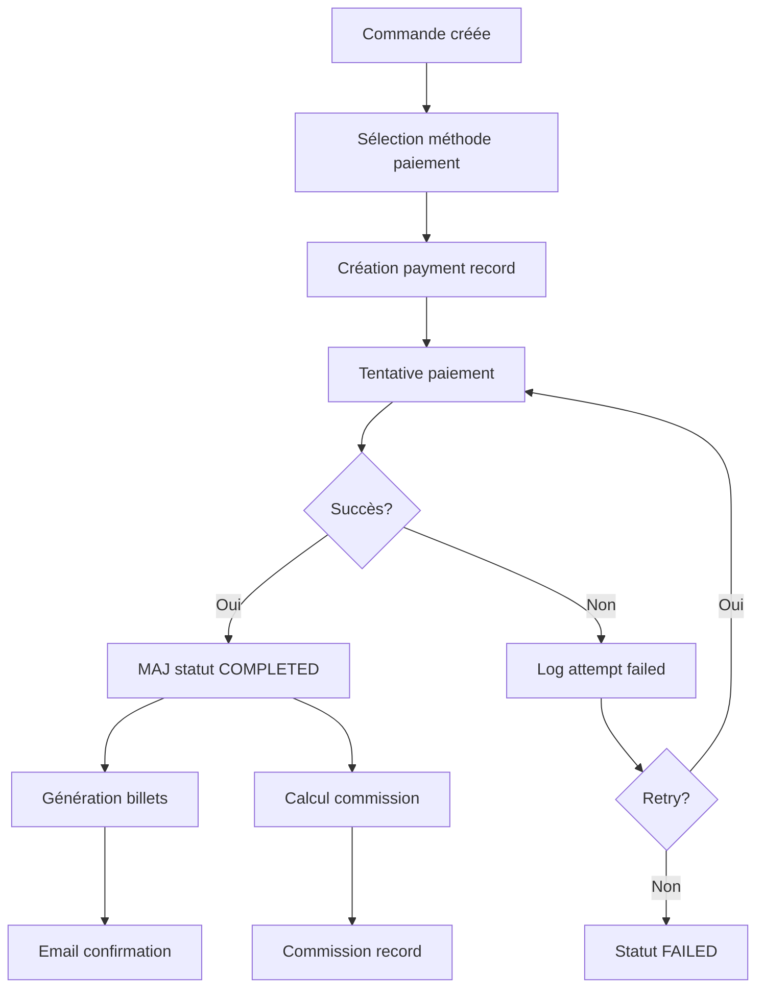

# Documentation Exhaustive du Modèle de Données Entrix V2.1
## Partie 3 : Module Billetterie et Paiements

---

## 📋 Table des Matières - Partie 3

1. [Module Billetterie - Plans et Abonnements](#module-billetterie-plans)
2. [Module Billetterie - Billets et Accès](#module-billetterie-billets)
3. [Module Paiements et Facturation](#module-paiements)
4. [Relations et Workflows Financiers](#relations-workflows)

---

## 🎫 Module Billetterie - Plans et Abonnements {#module-billetterie-plans}

### Table `subscription_plans` - Plans d'abonnements

**Description** : Catalogue des plans d'abonnements créés par les organisateurs pour leurs événements (cartes supporters, pass saison).

#### Structure détaillée

| Champ | Type | Contrainte | Valeur par défaut | Description |
|-------|------|------------|-------------------|-------------|
| `id` | UUID | PRIMARY KEY | `gen_random_uuid()` | Identifiant unique |
| `code` | VARCHAR(50) | UNIQUE, NOT NULL | - | Code plan unique |
| `name` | VARCHAR(200) | NOT NULL | - | Nom commercial |
| `description` | TEXT | NULL | - | Description détaillée |
| `type` | ENUM | NOT NULL | - | Type d'abonnement |
| `price` | DECIMAL(10,2) | NOT NULL | - | Prix de vente |
| `currency` | VARCHAR(3) | NOT NULL | 'TND' | Devise |
| `max_subscribers` | INTEGER | NULL | - | Limite souscripteurs |
| `current_subscribers` | INTEGER | NOT NULL | 0 | Souscripteurs actuels |
| `organizer_id` | UUID | NOT NULL, FK | - | Organisateur créateur |
| `valid_from` | DATE | NOT NULL | - | Début validité |
| `valid_until` | DATE | NOT NULL | - | Fin validité |
| `sale_start_date` | DATE | NULL | - | Début ventes |
| `sale_end_date` | DATE | NULL | - | Fin ventes |
| `transferable` | BOOLEAN | NOT NULL | FALSE | Transférable |
| `max_transfers` | INTEGER | DEFAULT 0 | 0 | Nombre max transferts |
| `auto_renew` | BOOLEAN | NOT NULL | FALSE | Renouvellement auto |
| `includes_playoffs` | BOOLEAN | NOT NULL | FALSE | Inclut phases finales |
| `priority_booking` | BOOLEAN | NOT NULL | FALSE | Priorité réservation |
| `benefits` | JSONB | NULL | - | Avantages inclus |
| `restrictions` | JSONB | NULL | - | Restrictions d'usage |
| `metadata` | JSONB | NULL | - | Métadonnées |
| `is_active` | BOOLEAN | NOT NULL | TRUE | Plan actif |
| `created_at` | TIMESTAMPTZ | NOT NULL | NOW() | Date création |
| `updated_at` | TIMESTAMPTZ | NOT NULL | NOW() | Dernière MAJ |

#### Valeurs ENUM `type`

- `SEASON_PASS` : Abonnement saison complète
- `HALF_SEASON` : Demi-saison
- `MEMBERSHIP` : Carte de membre/supporter
- `MULTI_EVENT` : Pass multi-événements
- `VIP_PACKAGE` : Package VIP annuel
- `STUDENT` : Abonnement étudiant
- `FAMILY` : Pack famille

#### Structure JSONB `benefits`

```json
{
  "discounts": {
    "merchandise": 20,
    "concessions": 10,
    "parking": 50,
    "guest_tickets": 15
  },
  "perks": {
    "early_access": {
      "hours_before": 48,
      "events": ["playoffs", "derbies"]
    },
    "meet_and_greet": 2,
    "stadium_tours": "unlimited",
    "exclusive_events": true,
    "birthday_surprise": true
  },
  "digital": {
    "mobile_app_premium": true,
    "exclusive_content": true,
    "live_stats": true,
    "replays_access": true
  },
  "physical_items": {
    "welcome_kit": true,
    "scarf": true,
    "membership_card": "metal",
    "yearbook": true
  }
}
```

#### Structure JSONB `restrictions`

```json
{
  "age": {
    "minimum": null,
    "maximum": 25,
    "student_proof_required": true
  },
  "geography": {
    "restricted_to_cities": ["Tunis", "Ariana", "Ben Arous"],
    "proof_of_residence": true
  },
  "usage": {
    "personal_use_only": true,
    "id_verification_required": true,
    "photo_on_card": true
  },
  "blackout_dates": ["2025-05-01", "2025-05-02"],
  "excluded_events": ["UEFA_CHAMPIONS_LEAGUE", "FIFA_FRIENDLIES"]
}
```

#### Exemple de record complet

```json
{
  "id": "890f12de-l34i-89j0-h123-193281841777",
  "code": "CA_SEASON_2024_2025_GOLD",
  "name": "Abonnement Or Club Africain 2024-2025",
  "description": "Accès à tous les matchs à domicile du championnat et de la coupe avec avantages VIP",
  "type": "SEASON_PASS",
  "price": 500.00,
  "currency": "TND",
  "max_subscribers": 5000,
  "current_subscribers": 3847,
  "organizer_id": "d7e6f5g4-c3b2-1a0f-9e8d-7c6b5a4c3d2e",
  "valid_from": "2024-08-01",
  "valid_until": "2025-06-30",
  "sale_start_date": "2024-06-01",
  "sale_end_date": "2024-09-30",
  "transferable": true,
  "max_transfers": 2,
  "auto_renew": false,
  "includes_playoffs": true,
  "priority_booking": true,
  "benefits": {
    "discounts": {
      "merchandise": 25,
      "concessions": 15,
      "parking": 100
    },
    "perks": {
      "early_access": {
        "hours_before": 72
      },
      "meet_and_greet": 4,
      "vip_entrance": true
    },
    "physical_items": {
      "welcome_kit": true,
      "scarf": true,
      "membership_card": "metal"
    }
  },
  "restrictions": {
    "usage": {
      "personal_use_only": true,
      "id_verification_required": true,
      "photo_on_card": true
    }
  },
  "metadata": {
    "design_theme": "gold_2024",
    "renewal_from_previous": 2891,
    "satisfaction_rate": 0.92,
    "zone_access": ["VIP", "TRIBUNE_HONNEUR"]
  },
  "is_active": true,
  "created_at": "2024-05-15T10:00:00+01:00",
  "updated_at": "2024-09-30T18:00:00+01:00"
}
```

### Table `subscriptions` - Abonnements souscrits

**Description** : Instances d'abonnements achetés par les utilisateurs, liés aux plans.

#### Structure détaillée

| Champ | Type | Contrainte | Valeur par défaut | Description |
|-------|------|------------|-------------------|-------------|
| `id` | UUID | PRIMARY KEY | `gen_random_uuid()` | Identifiant unique |
| `subscription_number` | VARCHAR(50) | UNIQUE, NOT NULL | - | Numéro abonnement |
| `plan_id` | UUID | NOT NULL, FK | - | Plan souscrit |
| `user_id` | UUID | NOT NULL, FK | - | Utilisateur abonné |
| `organizer_id` | UUID | NULL, FK | - | Organisateur (cache) |
| `status` | ENUM | NOT NULL | 'PENDING' | Statut abonnement |
| `start_date` | DATE | NOT NULL | - | Date début |
| `end_date` | DATE | NOT NULL | - | Date fin |
| `price_paid` | DECIMAL(10,2) | NOT NULL | - | Prix payé |
| `currency` | VARCHAR(3) | NOT NULL | 'TND' | Devise paiement |
| `transfers_used` | INTEGER | NOT NULL | 0 | Transferts utilisés |
| `next_billing_date` | DATE | NULL | - | Prochaine facturation |
| `auto_renew_enabled` | BOOLEAN | NOT NULL | FALSE | Renouvellement activé |
| `subscriber_benefits` | JSONB | NULL | - | Avantages personnalisés |
| `metadata` | JSONB | NULL | - | Métadonnées |
| `created_at` | TIMESTAMPTZ | NOT NULL | NOW() | Date création |
| `updated_at` | TIMESTAMPTZ | NOT NULL | NOW() | Dernière MAJ |

#### Valeurs ENUM `status`

- `PENDING` : En attente paiement
- `ACTIVE` : Actif
- `SUSPENDED` : Suspendu temporairement
- `EXPIRED` : Expiré
- `CANCELLED` : Annulé
- `TRANSFERRED` : Transféré

#### Exemple de record complet

```json
{
  "id": "901g23ef-m45j-90k1-i234-204392952888",
  "subscription_number": "SUB2024CA0003847",
  "plan_id": "890f12de-l34i-89j0-h123-193281841777",
  "user_id": "f47ac10b-58cc-4372-a567-0e02b2c3d479",
  "organizer_id": "d7e6f5g4-c3b2-1a0f-9e8d-7c6b5a4c3d2e",
  "status": "ACTIVE",
  "start_date": "2024-08-01",
  "end_date": "2025-06-30",
  "price_paid": 450.00,
  "currency": "TND",
  "transfers_used": 0,
  "next_billing_date": null,
  "auto_renew_enabled": false,
  "subscriber_benefits": {
    "seat_preference": {
      "zone": "TRIBUNE_HONNEUR",
      "block": "H",
      "row": "15",
      "seat": "234"
    },
    "custom_perks": {
      "player_meet": "Youssef Msakni",
      "parking_spot": "VIP-047"
    }
  },
  "metadata": {
    "payment_method": "CREDIT_CARD",
    "promo_code": "EARLYBIRD2024",
    "sales_channel": "ONLINE",
    "referred_by": null
  },
  "created_at": "2024-06-15T14:30:00+01:00",
  "updated_at": "2024-08-01T00:00:00+01:00"
}
```

---

## 🎟️ Module Billetterie - Billets et Accès {#module-billetterie-billets}

### Table `ticket_types` - Types de billets

**Description** : Catalogue des types de billets disponibles avec leurs caractéristiques.

#### Structure détaillée

| Champ | Type | Contrainte | Valeur par défaut | Description |
|-------|------|------------|-------------------|-------------|
| `id` | UUID | PRIMARY KEY | `gen_random_uuid()` | Identifiant unique |
| `code` | VARCHAR(50) | UNIQUE, NOT NULL | - | Code type unique |
| `name` | VARCHAR(200) | NOT NULL | - | Nom du type |
| `description` | TEXT | NULL | - | Description détaillée |
| `category` | VARCHAR(100) | NOT NULL | - | Catégorie tarifaire |
| `base_price` | DECIMAL(10,2) | NOT NULL | - | Prix de base |
| `currency` | VARCHAR(3) | NOT NULL | 'TND' | Devise |
| `tax_rate` | DECIMAL(5,4) | DEFAULT 0.07 | 0.0700 | Taux TVA (7%) |
| `is_numbered` | BOOLEAN | NOT NULL | TRUE | Places numérotées |
| `is_transferable` | BOOLEAN | DEFAULT TRUE | TRUE | Transférable |
| `is_refundable` | BOOLEAN | DEFAULT TRUE | TRUE | Remboursable |
| `max_per_order` | INTEGER | DEFAULT 10 | 10 | Max par commande |
| `valid_hours` | INTEGER | NULL | - | Durée validité (heures) |
| `benefits` | JSONB | NULL | - | Avantages inclus |
| `restrictions` | JSONB | NULL | - | Restrictions |
| `display_order` | INTEGER | DEFAULT 0 | 0 | Ordre affichage |
| `color_code` | VARCHAR(7) | NULL | - | Code couleur |
| `icon_url` | TEXT | NULL | - | Icône type |
| `organizer_id` | UUID | NULL, FK | - | Créé par organisateur |
| `is_active` | BOOLEAN | NOT NULL | TRUE | Type actif |
| `created_at` | TIMESTAMPTZ | NOT NULL | NOW() | Date création |
| `updated_at` | TIMESTAMPTZ | NOT NULL | NOW() | Dernière MAJ |

#### Exemple de record complet

```json
{
  "id": "012h34fg-n56k-01l2-j345-315403063999",
  "code": "VIP_MATCH_DAY",
  "name": "Billet VIP Match",
  "description": "Accès VIP avec salon, restauration et meilleures places",
  "category": "PREMIUM",
  "base_price": 150.00,
  "currency": "TND",
  "tax_rate": 0.0700,
  "is_numbered": true,
  "is_transferable": true,
  "is_refundable": true,
  "max_per_order": 4,
  "valid_hours": null,
  "benefits": {
    "access": [
      "vip_entrance",
      "vip_lounge",
      "premium_seating"
    ],
    "included": {
      "parking": true,
      "catering": "full_meal",
      "beverages": "unlimited",
      "program": true
    },
    "services": {
      "dedicated_host": true,
      "coat_check": true,
      "priority_exit": true
    }
  },
  "restrictions": {
    "age_minimum": 18,
    "dress_code": "business_casual",
    "valid_zones": ["VIP", "TRIBUNE_HONNEUR"]
  },
  "display_order": 1,
  "color_code": "#FFD700",
  "icon_url": "https://cdn.entrix.tn/icons/vip_ticket.svg",
  "organizer_id": "d7e6f5g4-c3b2-1a0f-9e8d-7c6b5a4c3d2e",
  "is_active": true,
  "created_at": "2024-01-01T10:00:00+01:00",
  "updated_at": "2024-12-15T16:00:00+01:00"
}
```

### Table `tickets` - Billets individuels

**Description** : Billets achetés par les utilisateurs pour des événements spécifiques.

#### Structure détaillée

| Champ | Type | Contrainte | Valeur par défaut | Description |
|-------|------|------------|-------------------|-------------|
| `id` | UUID | PRIMARY KEY | `gen_random_uuid()` | Identifiant unique |
| `ticket_number` | VARCHAR(50) | UNIQUE, NOT NULL | - | Numéro billet unique |
| `event_id` | UUID | NOT NULL, FK | - | Événement concerné |
| `ticket_type_id` | UUID | NOT NULL, FK | - | Type de billet |
| `user_id` | UUID | NULL, FK | - | Propriétaire actuel |
| `organizer_id` | UUID | NULL, FK | - | Organisateur (cache) |
| `order_id` | UUID | NULL, FK | - | Commande d'achat |
| `zone_id` | VARCHAR(255) | NULL, FK | - | Zone attribuée |
| `seat_id` | VARCHAR(255) | NULL, FK | - | Place attribuée |
| `status` | ENUM | NOT NULL | 'RESERVED' | Statut billet |
| `price_paid` | DECIMAL(10,2) | NOT NULL | - | Prix payé |
| `currency` | VARCHAR(3) | NOT NULL | 'TND' | Devise |
| `guest_name` | VARCHAR(200) | NULL | - | Nom invité |
| `guest_email` | VARCHAR(255) | NULL | - | Email invité |
| `purchase_date` | TIMESTAMPTZ | NOT NULL | NOW() | Date achat |
| `valid_from` | TIMESTAMPTZ | NOT NULL | - | Début validité |
| `valid_until` | TIMESTAMPTZ | NOT NULL | - | Fin validité |
| `used_at` | TIMESTAMPTZ | NULL | - | Date utilisation |
| `cancelled_at` | TIMESTAMPTZ | NULL | - | Date annulation |
| `transfer_count` | INTEGER | NOT NULL | 0 | Nombre transferts |
| `last_transfer_date` | TIMESTAMPTZ | NULL | - | Dernier transfert |
| `ticket_metadata` | JSONB | NULL | - | Métadonnées billet |
| `created_at` | TIMESTAMPTZ | NOT NULL | NOW() | Date création |
| `updated_at` | TIMESTAMPTZ | NOT NULL | NOW() | Dernière MAJ |

#### Valeurs ENUM `status`

- `RESERVED` : Réservé (paiement en attente)
- `PAID` : Payé et valide
- `USED` : Utilisé/scanné
- `TRANSFERRED` : Transféré
- `CANCELLED` : Annulé
- `REFUNDED` : Remboursé
- `EXPIRED` : Expiré

#### Structure JSONB `ticket_metadata`

```json
{
  "purchase_info": {
    "channel": "mobile_app",
    "device": "iOS_17.2",
    "ip_address": "41.230.xx.xx",
    "location": "Tunis, TN"
  },
  "preferences": {
    "dietary": "vegetarian",
    "accessibility": "wheelchair",
    "language": "fr"
  },
  "marketing": {
    "source": "facebook_ad",
    "campaign": "derby_2025",
    "promo_code": "DERBY10"
  },
  "compliance": {
    "terms_accepted": "2025-01-15T10:30:00Z",
    "age_verified": true,
    "id_checked": false
  }
}
```

#### Exemple de record complet

```json
{
  "id": "123i45gh-o67l-12m3-k456-426514174111",
  "ticket_number": "TKT2025CA0156789",
  "event_id": "789e01cd-k23h-78i9-g012-082170730666",
  "ticket_type_id": "012h34fg-n56k-01l2-j345-315403063999",
  "user_id": "f47ac10b-58cc-4372-a567-0e02b2c3d479",
  "organizer_id": "d7e6f5g4-c3b2-1a0f-9e8d-7c6b5a4c3d2e",
  "order_id": "234j56hi-p78m-23n4-l567-537625285222",
  "zone_id": "zone_vip_central",
  "seat_id": "seat_vip_h15_234",
  "status": "PAID",
  "price_paid": 225.00,
  "currency": "TND",
  "guest_name": null,
  "guest_email": null,
  "purchase_date": "2025-01-15T10:30:45+01:00",
  "valid_from": "2025-02-15T17:00:00+01:00",
  "valid_until": "2025-02-15T23:59:59+01:00",
  "used_at": null,
  "cancelled_at": null,
  "transfer_count": 0,
  "last_transfer_date": null,
  "ticket_metadata": {
    "purchase_info": {
      "channel": "mobile_app",
      "device": "iOS_17.2"
    },
    "preferences": {
      "language": "fr"
    },
    "marketing": {
      "source": "direct",
      "promo_code": "MEMBER2025"
    }
  },
  "created_at": "2025-01-15T10:30:45+01:00",
  "updated_at": "2025-01-15T10:31:00+01:00"
}
```

### Table `access_rights` - Droits d'accès unifiés

**Description** : Table centrale unifiant tous les droits d'accès (billets, abonnements) avec génération de QR codes.

#### Structure détaillée

| Champ | Type | Contrainte | Valeur par défaut | Description |
|-------|------|------------|-------------------|-------------|
| `id` | UUID | PRIMARY KEY | `gen_random_uuid()` | Identifiant unique |
| `access_code` | VARCHAR(100) | UNIQUE, NOT NULL | - | Code accès unique |
| `qr_code` | VARCHAR(255) | UNIQUE, NOT NULL | - | QR code unique |
| `type` | ENUM | NOT NULL | - | Type droit accès |
| `source_id` | UUID | NOT NULL | - | ID source (ticket/sub) |
| `event_id` | UUID | NULL, FK | - | Événement (si applicable) |
| `user_id` | UUID | NOT NULL, FK | - | Utilisateur actuel |
| `organizer_id` | UUID | NULL, FK | - | Organisateur (cache) |
| `zone_id` | VARCHAR(255) | NULL, FK | - | Zone autorisée |
| `seat_id` | VARCHAR(255) | NULL, FK | - | Place (si applicable) |
| `status` | ENUM | NOT NULL | 'VALID' | Statut droit |
| `valid_from` | TIMESTAMPTZ | NOT NULL | - | Début validité |
| `valid_until` | TIMESTAMPTZ | NOT NULL | - | Fin validité |
| `max_uses` | INTEGER | DEFAULT 1 | 1 | Utilisations max |
| `current_uses` | INTEGER | DEFAULT 0 | 0 | Utilisations actuelles |
| `last_scan_at` | TIMESTAMPTZ | NULL | - | Dernier scan |
| `last_scan_location` | VARCHAR(100) | NULL | - | Lieu dernier scan |
| `special_permissions` | JSONB | NULL | - | Permissions spéciales |
| `metadata` | JSONB | NULL | - | Métadonnées |
| `created_at` | TIMESTAMPTZ | NOT NULL | NOW() | Date création |
| `updated_at` | TIMESTAMPTZ | NOT NULL | NOW() | Dernière MAJ |

#### Valeurs ENUM `type`

- `TICKET` : Billet événement
- `SUBSCRIPTION` : Abonnement
- `PASS` : Pass temporaire
- `INVITATION` : Invitation
- `STAFF` : Accès staff
- `MEDIA` : Accès presse

#### Valeurs ENUM `status`

- `VALID` : Valide
- `USED` : Utilisé
- `EXPIRED` : Expiré
- `REVOKED` : Révoqué
- `SUSPENDED` : Suspendu

#### Structure JSONB `special_permissions`

```json
{
  "areas": {
    "vip_lounge": true,
    "backstage": false,
    "press_room": false,
    "parking": "VIP"
  },
  "services": {
    "priority_entry": true,
    "re_entry_allowed": true,
    "guest_privileges": 1
  },
  "restrictions": {
    "no_photography": false,
    "no_recording": true,
    "time_limited": false
  }
}
```

#### Exemple de record complet

```json
{
  "id": "234j56hi-p89n-34o5-m678-648736396333",
  "access_code": "AC2025CA0156789VIP",
  "qr_code": "QR_f47ac10b58cc4372a5670e02b2c3d479_1234567890",
  "type": "TICKET",
  "source_id": "123i45gh-o67l-12m3-k456-426514174111",
  "event_id": "789e01cd-k23h-78i9-g012-082170730666",
  "user_id": "f47ac10b-58cc-4372-a567-0e02b2c3d479",
  "organizer_id": "d7e6f5g4-c3b2-1a0f-9e8d-7c6b5a4c3d2e",
  "zone_id": "zone_vip_central",
  "seat_id": "seat_vip_h15_234",
  "status": "VALID",
  "valid_from": "2025-02-15T17:00:00+01:00",
  "valid_until": "2025-02-15T23:59:59+01:00",
  "max_uses": 1,
  "current_uses": 0,
  "last_scan_at": null,
  "last_scan_location": null,
  "special_permissions": {
    "areas": {
      "vip_lounge": true,
      "parking": "VIP"
    },
    "services": {
      "priority_entry": true
    }
  },
  "metadata": {
    "ticket_number": "TKT2025CA0156789",
    "original_owner": "Mohamed Ben Ali",
    "print_count": 1,
    "mobile_wallet": true
  },
  "created_at": "2025-01-15T10:31:00+01:00",
  "updated_at": "2025-01-15T10:31:00+01:00"
}
```

---

## 💰 Module Paiements et Facturation {#module-paiements}

### Table `payment_methods` - Méthodes de paiement

**Description** : Catalogue des méthodes de paiement disponibles sur la plateforme.

#### Structure détaillée

| Champ | Type | Contrainte | Valeur par défaut | Description |
|-------|------|------------|-------------------|-------------|
| `id` | UUID | PRIMARY KEY | `gen_random_uuid()` | Identifiant unique |
| `code` | VARCHAR(50) | UNIQUE, NOT NULL | - | Code méthode |
| `name` | VARCHAR(100) | NOT NULL | - | Nom affiché |
| `provider` | VARCHAR(50) | NOT NULL | - | Fournisseur service |
| `type` | ENUM | NOT NULL | - | Type de paiement |
| `is_active` | BOOLEAN | NOT NULL | TRUE | Méthode active |
| `is_default` | BOOLEAN | NOT NULL | FALSE | Méthode par défaut |
| `min_amount` | DECIMAL(10,2) | DEFAULT 0 | 0 | Montant minimum |
| `max_amount` | DECIMAL(10,2) | NULL | - | Montant maximum |
| `processing_fee_fixed` | DECIMAL(8,2) | DEFAULT 0 | 0 | Frais fixes |
| `processing_fee_percent` | DECIMAL(5,4) | DEFAULT 0 | 0 | Frais pourcentage |
| `configuration` | JSONB | NULL | - | Config technique |
| `display_order` | INTEGER | DEFAULT 0 | 0 | Ordre affichage |
| `description` | TEXT | NULL | - | Description |
| `created_at` | TIMESTAMPTZ | NOT NULL | NOW() | Date création |
| `updated_at` | TIMESTAMPTZ | NOT NULL | NOW() | Dernière MAJ |

#### Valeurs ENUM `type`

- `CREDIT_CARD` : Carte de crédit
- `DEBIT_CARD` : Carte de débit
- `E_WALLET` : Portefeuille électronique
- `BANK_TRANSFER` : Virement bancaire
- `MOBILE_MONEY` : Paiement mobile
- `CASH` : Espèces (guichet)
- `VOUCHER` : Bon d'achat

#### Exemple de record complet

```json
{
  "id": "345k67ij-q90o-45p6-n789-759847507444",
  "code": "FLOUCI_WALLET",
  "name": "Flouci",
  "provider": "Flouci",
  "type": "E_WALLET",
  "is_active": true,
  "is_default": true,
  "min_amount": 1.00,
  "max_amount": 5000.00,
  "processing_fee_fixed": 0.50,
  "processing_fee_percent": 0.0250,
  "configuration": {
    "api_endpoint": "https://api.flouci.com/v1",
    "merchant_id": "ENTRIX_PROD_001",
    "api_version": "1.0",
    "webhook_url": "https://api.entrix.tn/webhooks/flouci",
    "timeout_seconds": 30,
    "retry_attempts": 3
  },
  "display_order": 1,
  "description": "Paiement rapide et sécurisé via Flouci Wallet",
  "created_at": "2024-01-01T10:00:00+01:00",
  "updated_at": "2024-12-01T14:00:00+01:00"
}
```

### Table `orders` - Commandes

**Description** : Commandes passées par les utilisateurs regroupant plusieurs achats.

#### Structure détaillée

| Champ | Type | Contrainte | Valeur par défaut | Description |
|-------|------|------------|-------------------|-------------|
| `id` | UUID | PRIMARY KEY | `gen_random_uuid()` | Identifiant unique |
| `order_number` | VARCHAR(50) | UNIQUE, NOT NULL | - | Numéro commande |
| `user_id` | UUID | NULL, FK | - | Utilisateur (null=invité) |
| `primary_organizer_id` | UUID | NULL, FK | - | Organisateur principal |
| `status` | ENUM | NOT NULL | 'DRAFT' | Statut commande |
| `subtotal_amount` | DECIMAL(10,2) | NOT NULL | 0 | Sous-total HT |
| `discount_amount` | DECIMAL(10,2) | NOT NULL | 0 | Montant remises |
| `tax_amount` | DECIMAL(10,2) | NOT NULL | 0 | Montant taxes |
| `processing_fee` | DECIMAL(10,2) | NOT NULL | 0 | Frais traitement |
| `total_amount` | DECIMAL(10,2) | NOT NULL | 0 | Total TTC |
| `currency` | VARCHAR(3) | NOT NULL | 'TND' | Devise |
| `purchase_channel` | ENUM | NOT NULL | 'WEB' | Canal d'achat |
| `coupon_code` | VARCHAR(50) | NULL | - | Code promo utilisé |
| `guest_name` | VARCHAR(200) | NULL | - | Nom invité |
| `guest_email` | VARCHAR(255) | NULL | - | Email invité |
| `guest_phone` | VARCHAR(20) | NULL | - | Téléphone invité |
| `notes` | TEXT | NULL | - | Notes commande |
| `metadata` | JSONB | NULL | - | Métadonnées |
| `confirmed_at` | TIMESTAMPTZ | NULL | - | Date confirmation |
| `expires_at` | TIMESTAMPTZ | NULL | - | Date expiration |
| `created_at` | TIMESTAMPTZ | NOT NULL | NOW() | Date création |
| `updated_at` | TIMESTAMPTZ | NOT NULL | NOW() | Dernière MAJ |

#### Valeurs ENUM `status`

- `DRAFT` : Brouillon
- `PENDING_PAYMENT` : Attente paiement
- `PAID` : Payée
- `CONFIRMED` : Confirmée
- `PARTIALLY_REFUNDED` : Partiellement remboursée
- `REFUNDED` : Totalement remboursée
- `CANCELLED` : Annulée
- `EXPIRED` : Expirée

#### Valeurs ENUM `purchase_channel`

- `WEB` : Site web
- `MOBILE` : Application mobile
- `BOX_OFFICE` : Guichet
- `PHONE` : Téléphone
- `PARTNER` : Partenaire
- `API` : API tierce

#### Structure JSONB `metadata`

```json
{
  "session": {
    "id": "sess_123456789",
    "ip": "41.230.xx.xx",
    "user_agent": "Mozilla/5.0...",
    "device_type": "mobile",
    "location": {
      "country": "TN",
      "city": "Tunis"
    }
  },
  "marketing": {
    "utm_source": "facebook",
    "utm_medium": "social",
    "utm_campaign": "derby_2025",
    "referrer": "https://facebook.com"
  },
  "cart": {
    "abandoned_count": 2,
    "time_to_purchase": 245,
    "items_removed": 1
  },
  "customer": {
    "is_returning": true,
    "purchase_count": 15,
    "lifetime_value": 1250.00
  }
}
```


### Exemple de record complet 

```json
{
  "id": "456l78jk-r01p-56q7-o890-860958518555",
  "order_number": "ORD202501150001234",
  "user_id": "f47ac10b-58cc-4372-a567-0e02b2c3d479",
  "primary_organizer_id": "d7e6f5g4-c3b2-1a0f-9e8d-7c6b5a4c3d2e",
  "status": "PAID",
  "subtotal_amount": 450.00,
  "discount_amount": 45.00,
  "tax_amount": 28.35,
  "processing_fee": 10.25,
  "total_amount": 443.60,
  "currency": "TND",
  "purchase_channel": "MOBILE",
  "coupon_code": "MEMBER2025",
  "guest_name": null,
  "guest_email": null,
  "guest_phone": null,
  "notes": "Achat pour le derby avec 2 invités VIP",
  "metadata": {
    "session": {
      "id": "sess_mob_789456123",
      "device_type": "mobile",
      "app_version": "3.2.1"
    },
    "marketing": {
      "utm_source": "app_notification",
      "utm_campaign": "derby_2025"
    },
    "cart": {
      "time_to_purchase": 180,
      "items_count": 2
    },
    "customer": {
      "is_returning": true,
      "purchase_count": 15,
      "lifetime_value": 1250.00,
      "loyalty_points_earned": 44
    }
  },
  "confirmed_at": "2025-01-15T10:35:00+01:00",
  "expires_at": null,
  "created_at": "2025-01-15T10:30:00+01:00",
  "updated_at": "2025-01-15T10:35:00+01:00"
}
```

## 📦 Table Order Items {#order-items}

### Table `order_items` - Lignes de commande

**Description** : Détail des articles (billets, abonnements) dans chaque commande.

#### Structure détaillée

| Champ | Type | Contrainte | Valeur par défaut | Description |
|-------|------|------------|-------------------|-------------|
| `id` | UUID | PRIMARY KEY | `gen_random_uuid()` | Identifiant unique |
| `order_id` | UUID | NOT NULL, FK | - | Commande parent |
| `item_type` | ENUM | NOT NULL | - | Type d'article |
| `item_id` | UUID | NOT NULL | - | ID de l'article |
| `event_id` | UUID | NULL, FK | - | Événement (si applicable) |
| `organizer_id` | UUID | NULL, FK | - | Organisateur article |
| `ticket_type_id` | UUID | NULL, FK | - | Type billet (si applicable) |
| `subscription_plan_id` | UUID | NULL, FK | - | Plan abo (si applicable) |
| `quantity` | INTEGER | NOT NULL | 1 | Quantité |
| `unit_price` | DECIMAL(10,2) | NOT NULL | - | Prix unitaire |
| `discount_amount` | DECIMAL(10,2) | DEFAULT 0 | 0 | Remise ligne |
| `tax_amount` | DECIMAL(10,2) | DEFAULT 0 | 0 | Taxes ligne |
| `total_amount` | DECIMAL(10,2) | NOT NULL | - | Total ligne |
| `currency` | VARCHAR(3) | NOT NULL | 'TND' | Devise |
| `seat_selections` | JSONB | NULL | - | Places sélectionnées |
| `options` | JSONB | NULL | - | Options additionnelles |
| `metadata` | JSONB | NULL | - | Métadonnées |
| `created_at` | TIMESTAMPTZ | NOT NULL | NOW() | Date création |
| `updated_at` | TIMESTAMPTZ | NOT NULL | NOW() | Dernière MAJ |

#### Valeurs ENUM `item_type`

- `TICKET` : Billet événement
- `SUBSCRIPTION` : Abonnement
- `MERCHANDISE` : Produit dérivé
- `PARKING` : Place parking
- `HOSPITALITY` : Package hospitalité
- `DONATION` : Don

#### Structure JSONB `seat_selections`

```json
{
  "selections": [
    {
      "zone_id": "zone_vip_central",
      "seat_id": "seat_vip_h15_234",
      "row": "H",
      "seat_number": "234",
      "door": "A",
      "accessibility": null
    },
    {
      "zone_id": "zone_vip_central",
      "seat_id": "seat_vip_h15_235",
      "row": "H",
      "seat_number": "235",
      "door": "A",
      "accessibility": null
    }
  ],
  "preferences": {
    "together": true,
    "aisle": false,
    "near_exit": false
  }
}
```

#### Structure JSONB `options`

```json
{
  "insurance": {
    "selected": true,
    "provider": "Assurance Spectacle",
    "coverage": "full_refund",
    "price": 5.00
  },
  "addons": {
    "parking": {
      "selected": true,
      "type": "vip",
      "price": 10.00
    },
    "program": {
      "selected": true,
      "type": "digital",
      "price": 0.00
    }
  },
  "delivery": {
    "method": "mobile",
    "email": "mohamed.benali@gmail.com",
    "sms": "+21698765432"
  }
}
```

#### Exemple de record complet

```json
{
  "id": "567m89kl-s12q-67r8-p901-971069629666",
  "order_id": "456l78jk-r01p-56q7-o890-860958518555",
  "item_type": "TICKET",
  "item_id": "123i45gh-o67l-12m3-k456-426514174111",
  "event_id": "789e01cd-k23h-78i9-g012-082170730666",
  "organizer_id": "d7e6f5g4-c3b2-1a0f-9e8d-7c6b5a4c3d2e",
  "ticket_type_id": "012h34fg-n56k-01l2-j345-315403063999",
  "subscription_plan_id": null,
  "quantity": 2,
  "unit_price": 225.00,
  "discount_amount": 45.00,
  "tax_amount": 28.35,
  "total_amount": 433.35,
  "currency": "TND",
  "seat_selections": {
    "selections": [
      {
        "zone_id": "zone_vip_central",
        "seat_id": "seat_vip_h15_234",
        "row": "H",
        "seat_number": "234"
      },
      {
        "zone_id": "zone_vip_central",
        "seat_id": "seat_vip_h15_235",
        "row": "H",
        "seat_number": "235"
      }
    ]
  },
  "options": {
    "insurance": {
      "selected": true,
      "price": 10.00
    },
    "delivery": {
      "method": "mobile"
    }
  },
  "metadata": {
    "price_tier": "dynamic_high_demand",
    "selection_time": 45,
    "retry_count": 0
  },
  "created_at": "2025-01-15T10:31:00+01:00",
  "updated_at": "2025-01-15T10:31:00+01:00"
}
```

## 💳 Table Payments {#payments}

### Table `payments` - Paiements

**Description** : Enregistrement de tous les paiements effectués sur la plateforme.

#### Structure détaillée

| Champ | Type | Contrainte | Valeur par défaut | Description |
|-------|------|------------|-------------------|-------------|
| `id` | UUID | PRIMARY KEY | `gen_random_uuid()` | Identifiant unique |
| `payment_number` | VARCHAR(50) | UNIQUE, NOT NULL | - | Numéro paiement |
| `order_id` | UUID | NOT NULL, FK | - | Commande liée |
| `user_id` | UUID | NULL, FK | - | Utilisateur payeur |
| `organizer_id` | UUID | NULL, FK | - | Organisateur bénéficiaire |
| `payment_method_id` | UUID | NOT NULL, FK | - | Méthode utilisée |
| `status` | ENUM | NOT NULL | 'PENDING' | Statut paiement |
| `amount` | DECIMAL(10,2) | NOT NULL | - | Montant |
| `currency` | VARCHAR(3) | NOT NULL | 'TND' | Devise |
| `processing_fee` | DECIMAL(8,2) | DEFAULT 0 | 0 | Frais traitement |
| `gateway_fee` | DECIMAL(8,2) | DEFAULT 0 | 0 | Frais passerelle |
| `net_amount` | DECIMAL(10,2) | NOT NULL | - | Montant net |
| `gateway_transaction_id` | VARCHAR(255) | NULL | - | ID transaction externe |
| `gateway_response` | JSONB | NULL | - | Réponse passerelle |
| `authorization_code` | VARCHAR(100) | NULL | - | Code autorisation |
| `refund_amount` | DECIMAL(10,2) | DEFAULT 0 | 0 | Montant remboursé |
| `metadata` | JSONB | NULL | - | Métadonnées |
| `processed_at` | TIMESTAMPTZ | NULL | - | Date traitement |
| `failed_at` | TIMESTAMPTZ | NULL | - | Date échec |
| `refunded_at` | TIMESTAMPTZ | NULL | - | Date remboursement |
| `created_at` | TIMESTAMPTZ | NOT NULL | NOW() | Date création |
| `updated_at` | TIMESTAMPTZ | NOT NULL | NOW() | Dernière MAJ |

#### Valeurs ENUM `status`

- `PENDING` : En attente
- `PROCESSING` : En cours
- `AUTHORIZED` : Autorisé
- `CAPTURED` : Capturé
- `COMPLETED` : Complété
- `FAILED` : Échoué
- `CANCELLED` : Annulé
- `REFUNDED` : Remboursé
- `PARTIALLY_REFUNDED` : Partiellement remboursé

#### Structure JSONB `gateway_response`

```json
{
  "provider": "flouci",
  "response_code": "00",
  "response_message": "Transaction approuvée",
  "transaction_id": "FLC20250115123456",
  "authorization": {
    "code": "AUTH789456",
    "rrn": "501151234567",
    "stan": "123456"
  },
  "card_info": {
    "masked_pan": "4111****1111",
    "card_type": "VISA",
    "bank": "BIAT"
  },
  "3ds": {
    "version": "2.1",
    "status": "authenticated",
    "eci": "05"
  },
  "risk_score": 12,
  "processing_time": 1.245
}
```

#### Exemple de record complet

```json
{
  "id": "678n90lm-t23r-78s9-q012-082170730777",
  "payment_number": "PAY202501150001234",
  "order_id": "456l78jk-r01p-56q7-o890-860958518555",
  "user_id": "f47ac10b-58cc-4372-a567-0e02b2c3d479",
  "organizer_id": "d7e6f5g4-c3b2-1a0f-9e8d-7c6b5a4c3d2e",
  "payment_method_id": "345k67ij-q90o-45p6-n789-759847507444",
  "status": "COMPLETED",
  "amount": 443.60,
  "currency": "TND",
  "processing_fee": 10.25,
  "gateway_fee": 11.09,
  "net_amount": 422.26,
  "gateway_transaction_id": "FLC20250115123456",
  "gateway_response": {
    "provider": "flouci",
    "response_code": "00",
    "response_message": "Transaction approuvée",
    "transaction_id": "FLC20250115123456",
    "authorization": {
      "code": "AUTH789456"
    },
    "card_info": {
      "masked_pan": "4111****1111",
      "card_type": "VISA"
    }
  },
  "authorization_code": "AUTH789456",
  "refund_amount": 0.00,
  "metadata": {
    "ip_address": "41.230.xx.xx",
    "device_fingerprint": "fp_123456789",
    "session_id": "sess_mob_789456123",
    "retry_count": 0,
    "processing_node": "pay-node-03"
  },
  "processed_at": "2025-01-15T10:34:30+01:00",
  "failed_at": null,
  "refunded_at": null,
  "created_at": "2025-01-15T10:34:00+01:00",
  "updated_at": "2025-01-15T10:34:30+01:00"
}
```

## 📊 Table Organizer Commissions {#organizer-commissions}

### Table `organizer_commissions` - Commissions organisateurs

**Description** : Calcul et suivi des commissions dues aux organisateurs sur leurs ventes.

#### Structure détaillée

| Champ | Type | Contrainte | Valeur par défaut | Description |
|-------|------|------------|-------------------|-------------|
| `id` | UUID | PRIMARY KEY | `gen_random_uuid()` | Identifiant unique |
| `commission_number` | VARCHAR(50) | UNIQUE, NOT NULL | - | Numéro commission |
| `organizer_id` | UUID | NOT NULL, FK | - | Organisateur bénéficiaire |
| `period_start` | DATE | NOT NULL | - | Début période |
| `period_end` | DATE | NOT NULL | - | Fin période |
| `status` | ENUM | NOT NULL | 'PENDING' | Statut commission |
| `total_sales` | DECIMAL(12,2) | NOT NULL | 0 | Ventes totales période |
| `base_amount` | DECIMAL(12,2) | NOT NULL | 0 | Base calcul commission |
| `commission_rate` | DECIMAL(5,4) | NOT NULL | - | Taux appliqué |
| `commission_amount` | DECIMAL(12,2) | NOT NULL | 0 | Montant commission |
| `adjustments` | DECIMAL(12,2) | DEFAULT 0 | 0 | Ajustements manuels |
| `penalties` | DECIMAL(12,2) | DEFAULT 0 | 0 | Pénalités |
| `net_amount` | DECIMAL(12,2) | NOT NULL | 0 | Montant net à payer |
| `currency` | VARCHAR(3) | NOT NULL | 'TND' | Devise |
| `invoice_number` | VARCHAR(50) | NULL | - | Numéro facture |
| `invoice_date` | DATE | NULL | - | Date facture |
| `payment_due_date` | DATE | NULL | - | Date échéance |
| `payment_reference` | VARCHAR(100) | NULL | - | Référence paiement |
| `breakdown` | JSONB | NULL | - | Détail par événement |
| `metadata` | JSONB | NULL | - | Métadonnées |
| `calculated_at` | TIMESTAMPTZ | NULL | - | Date calcul |
| `approved_at` | TIMESTAMPTZ | NULL | - | Date approbation |
| `approved_by` | UUID | NULL, FK | - | Approuvé par |
| `paid_at` | TIMESTAMPTZ | NULL | - | Date paiement |
| `created_at` | TIMESTAMPTZ | NOT NULL | NOW() | Date création |
| `updated_at` | TIMESTAMPTZ | NOT NULL | NOW() | Dernière MAJ |

#### Valeurs ENUM `status`

- `PENDING` : En attente calcul
- `CALCULATED` : Calculée
- `APPROVED` : Approuvée
- `INVOICED` : Facturée
- `PAID` : Payée
- `DISPUTED` : Contestée
- `ADJUSTED` : Ajustée

#### Structure JSONB `breakdown`

```json
{
  "events": [
    {
      "event_id": "789e01cd-k23h-78i9-g012-082170730666",
      "event_name": "Derby CA vs EST",
      "event_date": "2025-02-15",
      "tickets_sold": 45678,
      "gross_revenue": 2283900.00,
      "refunds": 11420.00,
      "net_revenue": 2272480.00,
      "commission_rate": 0.08,
      "commission_amount": 181798.40
    },
    {
      "event_id": "xxx-xxx-xxx",
      "event_name": "CA vs CS Sfaxien",
      "event_date": "2025-01-30",
      "tickets_sold": 32450,
      "gross_revenue": 973500.00,
      "refunds": 4867.50,
      "net_revenue": 968632.50,
      "commission_rate": 0.08,
      "commission_amount": 77490.60
    }
  ],
  "summary": {
    "total_events": 12,
    "total_tickets": 385420,
    "total_gross": 5785600.00,
    "total_refunds": 28928.00,
    "total_net": 5756672.00,
    "average_attendance": 32118,
    "fill_rate": 0.82
  },
  "deductions": {
    "chargebacks": 2500.00,
    "penalties": {
      "late_cancellation": 5000.00,
      "no_show_staff": 1000.00
    },
    "adjustments": {
      "previous_period": -1200.00,
      "goodwill": -500.00
    }
  }
}
```

#### Exemple de record complet

```json
{
  "id": "789o01mn-u34s-89t0-r123-193281841888",
  "commission_number": "COM202501CA001",
  "organizer_id": "d7e6f5g4-c3b2-1a0f-9e8d-7c6b5a4c3d2e",
  "period_start": "2025-01-01",
  "period_end": "2025-01-31",
  "status": "APPROVED",
  "total_sales": 5785600.00,
  "base_amount": 5756672.00,
  "commission_rate": 0.0800,
  "commission_amount": 460533.76,
  "adjustments": -1700.00,
  "penalties": 8500.00,
  "net_amount": 450333.76,
  "currency": "TND",
  "invoice_number": "INV2025/01/CA001",
  "invoice_date": "2025-02-01",
  "payment_due_date": "2025-02-08",
  "payment_reference": null,
  "breakdown": {
    "events": [
      {
        "event_id": "789e01cd-k23h-78i9-g012-082170730666",
        "event_name": "Derby CA vs EST",
        "tickets_sold": 45678,
        "net_revenue": 2272480.00,
        "commission_amount": 181798.40
      }
    ],
    "summary": {
      "total_events": 12,
      "total_tickets": 385420,
      "total_net": 5756672.00
    },
    "deductions": {
      "penalties": {
        "late_cancellation": 5000.00
      }
    }
  },
  "metadata": {
    "calculation_version": "2.1",
    "special_terms": {
      "derby_bonus": true,
      "performance_multiplier": 1.0
    },
    "notes": "Commission janvier 2025 - Performance excellente"
  },
  "calculated_at": "2025-02-01T00:05:00+01:00",
  "approved_at": "2025-02-01T09:30:00+01:00",
  "approved_by": "b2c3d4e5-f6a7-8901-bcde-f12345678901",
  "paid_at": null,
  "created_at": "2025-02-01T00:05:00+01:00",
  "updated_at": "2025-02-01T09:30:00+01:00"
}
```

## 🔧 Tables de Support Paiements {#support-paiements}

### Table `payment_attempts` - Tentatives de paiement

**Description** : Journal de toutes les tentatives de paiement pour traçabilité et analyse.

#### Structure détaillée

| Champ | Type | Contrainte | Valeur par défaut | Description |
|-------|------|------------|-------------------|-------------|
| `id` | UUID | PRIMARY KEY | `gen_random_uuid()` | Identifiant unique |
| `payment_id` | UUID | NOT NULL, FK | - | Paiement concerné |
| `attempt_number` | INTEGER | NOT NULL | 1 | Numéro tentative |
| `status` | VARCHAR(50) | NOT NULL | - | Résultat tentative |
| `amount` | DECIMAL(10,2) | NOT NULL | - | Montant tenté |
| `currency` | VARCHAR(3) | NOT NULL | 'TND' | Devise |
| `gateway_request` | JSONB | NULL | - | Requête envoyée |
| `gateway_response` | JSONB | NULL | - | Réponse reçue |
| `error_code` | VARCHAR(50) | NULL | - | Code erreur |
| `error_message` | TEXT | NULL | - | Message erreur |
| `processing_time` | INTEGER | NULL | - | Temps traitement (ms) |
| `ip_address` | INET | NULL | - | IP utilisateur |
| `user_agent` | TEXT | NULL | - | User agent |
| `created_at` | TIMESTAMPTZ | NOT NULL | NOW() | Date tentative |

#### Exemple de record complet

```json
{
  "id": "890p12no-v45t-90u1-s234-204392952999",
  "payment_id": "678n90lm-t23r-78s9-q012-082170730777",
  "attempt_number": 1,
  "status": "SUCCESS",
  "amount": 443.60,
  "currency": "TND",
  "gateway_request": {
    "endpoint": "https://api.flouci.com/v1/payment/card",
    "method": "POST",
    "headers": {
      "merchant_id": "ENTRIX_PROD_001"
    },
    "body": {
      "amount": 44360,
      "currency": "TND",
      "card_token": "tok_xxxxxxxxxxxxx",
      "reference": "PAY202501150001234"
    }
  },
  "gateway_response": {
    "status": "approved",
    "transaction_id": "FLC20250115123456",
    "authorization_code": "AUTH789456"
  },
  "error_code": null,
  "error_message": null,
  "processing_time": 1245,
  "ip_address": "41.230.145.67",
  "user_agent": "Entrix Mobile App/3.2.1 (iOS 17.2)",
  "created_at": "2025-01-15T10:34:00+01:00"
}
```

### Table `refunds` - Remboursements

**Description** : Gestion des remboursements totaux ou partiels.

#### Structure détaillée

| Champ | Type | Contrainte | Valeur par défaut | Description |
|-------|------|------------|-------------------|-------------|
| `id` | UUID | PRIMARY KEY | `gen_random_uuid()` | Identifiant unique |
| `refund_number` | VARCHAR(50) | UNIQUE, NOT NULL | - | Numéro remboursement |
| `payment_id` | UUID | NOT NULL, FK | - | Paiement original |
| `order_id` | UUID | NOT NULL, FK | - | Commande concernée |
| `user_id` | UUID | NULL, FK | - | Utilisateur |
| `organizer_id` | UUID | NULL, FK | - | Organisateur |
| `status` | ENUM | NOT NULL | 'PENDING' | Statut remboursement |
| `reason` | ENUM | NOT NULL | - | Motif remboursement |
| `amount` | DECIMAL(10,2) | NOT NULL | - | Montant remboursé |
| `currency` | VARCHAR(3) | NOT NULL | 'TND' | Devise |
| `processing_fee_refunded` | DECIMAL(8,2) | DEFAULT 0 | 0 | Frais remboursés |
| `gateway_transaction_id` | VARCHAR(255) | NULL | - | ID transaction |
| `notes` | TEXT | NULL | - | Notes internes |
| `metadata` | JSONB | NULL | - | Métadonnées |
| `requested_at` | TIMESTAMPTZ | NOT NULL | NOW() | Date demande |
| `approved_at` | TIMESTAMPTZ | NULL | - | Date approbation |
| `approved_by` | UUID | NULL, FK | - | Approuvé par |
| `processed_at` | TIMESTAMPTZ | NULL | - | Date traitement |
| `created_at` | TIMESTAMPTZ | NOT NULL | NOW() | Date création |
| `updated_at` | TIMESTAMPTZ | NOT NULL | NOW() | Dernière MAJ |

#### Valeurs ENUM `status`

- `PENDING` : En attente
- `APPROVED` : Approuvé
- `PROCESSING` : En cours
- `COMPLETED` : Complété
- `FAILED` : Échoué
- `REJECTED` : Rejeté

#### Valeurs ENUM `reason`

- `EVENT_CANCELLED` : Événement annulé
- `EVENT_POSTPONED` : Événement reporté
- `CUSTOMER_REQUEST` : Demande client
- `DUPLICATE_PURCHASE` : Achat en double
- `TECHNICAL_ISSUE` : Problème technique
- `FRAUD` : Fraude
- `OTHER` : Autre

#### Exemple de record complet

```json
{
  "id": "901q23op-w56u-01v2-t345-315403064000",
  "refund_number": "REF202501150001",
  "payment_id": "678n90lm-t23r-78s9-q012-082170730777",
  "order_id": "456l78jk-r01p-56q7-o890-860958518555",
  "user_id": "f47ac10b-58cc-4372-a567-0e02b2c3d479",
  "organizer_id": "d7e6f5g4-c3b2-1a0f-9e8d-7c6b5a4c3d2e",
  "status": "COMPLETED",
  "reason": "EVENT_CANCELLED",
  "amount": 443.60,
  "currency": "TND",
  "processing_fee_refunded": 10.25,
  "gateway_transaction_id": "FLC20250120987654",
  "notes": "Match annulé cause intempéries - Remboursement intégral automatique",
  "metadata": {
    "event_details": {
      "event_id": "789e01cd-k23h-78i9-g012-082170730666",
      "event_name": "Derby CA vs EST",
      "cancellation_date": "2025-01-20T14:00:00+01:00",
      "cancellation_reason": "severe_weather"
    },
    "refund_policy": "full_refund_cancellation",
    "items_refunded": [
      {
        "type": "ticket",
        "quantity": 2,
        "amount": 450.00
      }
    ]
  },
  "requested_at": "2025-01-20T14:15:00+01:00",
  "approved_at": "2025-01-20T14:15:00+01:00",
  "approved_by": "system_auto",
  "processed_at": "2025-01-20T14:16:30+01:00",
  "created_at": "2025-01-20T14:15:00+01:00",
  "updated_at": "2025-01-20T14:16:30+01:00"
}
```

### Table `payment_webhooks` - Webhooks de paiement

**Description** : Enregistrement des webhooks reçus des passerelles de paiement.

#### Structure détaillée

| Champ | Type | Contrainte | Valeur par défaut | Description |
|-------|------|------------|-------------------|-------------|
| `id` | UUID | PRIMARY KEY | `gen_random_uuid()` | Identifiant unique |
| `provider` | VARCHAR(50) | NOT NULL | - | Fournisseur (Flouci) |
| `event_type` | VARCHAR(100) | NOT NULL | - | Type événement |
| `payload` | JSONB | NOT NULL | - | Données reçues |
| `signature` | TEXT | NULL | - | Signature sécurité |
| `is_valid` | BOOLEAN | DEFAULT TRUE | TRUE | Signature valide |
| `is_processed` | BOOLEAN | DEFAULT FALSE | FALSE | Traité |
| `payment_id` | UUID | NULL, FK | - | Paiement lié |
| `error_message` | TEXT | NULL | - | Erreur traitement |
| `received_at` | TIMESTAMPTZ | NOT NULL | NOW() | Date réception |
| `processed_at` | TIMESTAMPTZ | NULL | - | Date traitement |

#### Exemple de record complet

```json
{
  "id": "012r34pq-x67v-12w3-u456-426514174222",
  "provider": "flouci",
  "event_type": "payment.succeeded",
  "payload": {
    "event_id": "evt_1234567890",
    "type": "payment.succeeded",
    "data": {
      "transaction_id": "FLC20250115123456",
      "merchant_reference": "PAY202501150001234",
      "amount": 44360,
      "currency": "TND",
      "status": "captured",
      "card": {
        "last4": "1111",
        "brand": "visa"
      }
    },
    "created": "2025-01-15T10:34:30Z"
  },
  "signature": "sha256=1b0a6f0c3e4d5f6g7h8i9j0k1l2m3n4o5p6q7r8s9t0u1v2w3x4y5z6",
  "is_valid": true,
  "is_processed": true,
  "payment_id": "678n90lm-t23r-78s9-q012-082170730777",
  "error_message": null,
  "received_at": "2025-01-15T10:34:32+01:00",
  "processed_at": "2025-01-15T10:34:33+01:00"
}
```

---

## 🔄 Relations et Workflows Financiers {#relations-workflows}

### Workflow de paiement complet



### Relations financières

1. **Order → Payment** (1:N)
   - Une commande peut avoir plusieurs paiements (acomptes, solde)
   - Paiements partiels possibles

2. **Payment → Refunds** (1:N)
   - Un paiement peut avoir plusieurs remboursements partiels
   - Total remboursements ≤ montant paiement

3. **Organizer → Commissions** (1:N)
   - Calcul mensuel automatique
   - Basé sur les paiements complétés

4. **Payment → Payment Attempts** (1:N)
   - Historique complet des tentatives
   - Analyse patterns échecs

### Règles de calcul commissions

```sql
-- Calcul base commission
base_amount = SUM(payments.net_amount) 
WHERE organizer_id = X 
AND status = 'COMPLETED'
AND processed_at BETWEEN period_start AND period_end

-- Application taux
commission_amount = base_amount * organizer.commission_rate

-- Ajustements
net_amount = commission_amount - penalties + adjustments

-- Délai paiement
payment_due_date = period_end + organizer.payment_delay_days
```

### Sécurité financière

1. **Chiffrement** : Toutes données bancaires chiffrées
2. **Tokenisation** : Cartes tokenisées côté passerelle
3. **Audit trail** : Toute opération financière tracée
4. **Validation double** : Montants > 1000 TND validés manuellement
5. **Webhooks sécurisés** : Signature HMAC vérifiée