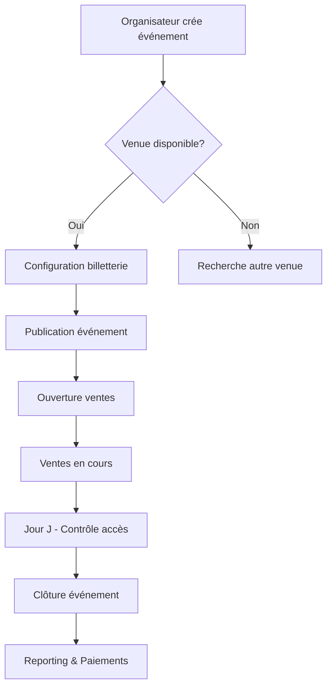
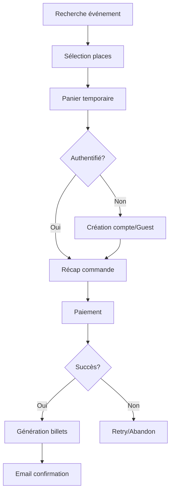
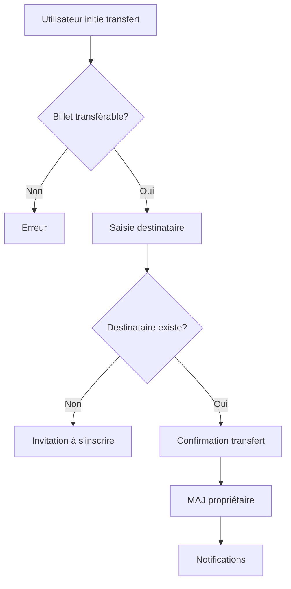
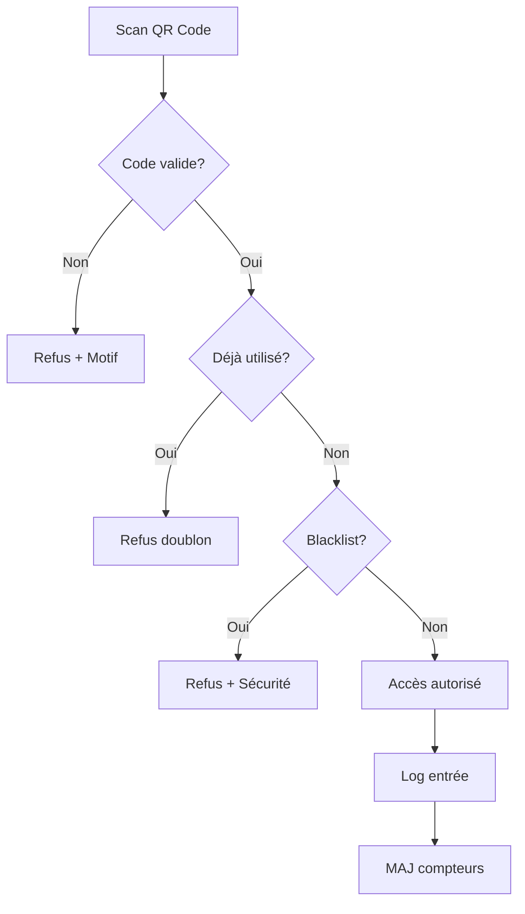
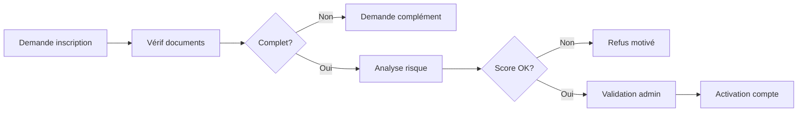
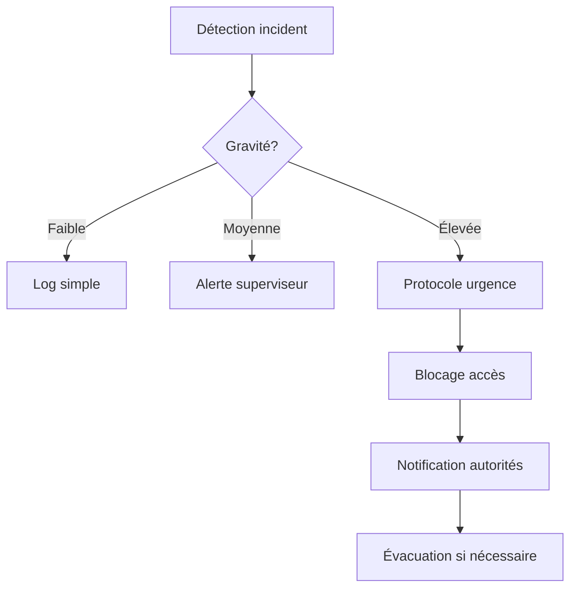

# Mapping Processus Métier - Flux de Données Entrix V2.1
## Correspondance entre Processus Business et Implémentation Technique

---

## 1. PROCESSUS MÉTIER PRINCIPAUX

### 🎯 P1: CYCLE DE VIE COMPLET D'UN ÉVÉNEMENT

#### Diagramme de flux


#### Mapping technique détaillé

| Étape Processus | Tables Impactées | Fonctions/Triggers | Vues Utilisées | API Endpoints |
|-----------------|------------------|-------------------|----------------|---------------|
| **1. Création événement** | | | | |
| - Saisie informations | `events` (INSERT) | `validate_event_business_rules()` | - | POST /events |
| - Sélection venue | `venues`, `venue_mappings` | - | `v_venue_details` | GET /venues/available |
| - Choix participants | `event_participants` (INSERT) | - | `v_event_participants_full` | POST /events/{id}/participants |
| **2. Configuration billetterie** | | | | |
| - Types de billets | `event_ticket_config` (INSERT) | `sync_event_config_organizer()` | - | POST /events/{id}/tickets |
| - Zones et tarifs | `zone_mapping_overrides` | - | - | PUT /events/{id}/zones |
| - Règles pricing | `pricing_rules` | `calculate_pricing()` | - | POST /pricing-rules |
| **3. Publication** | | | | |
| - Validation finale | `events` (UPDATE status) | `auto_manage_event_status()` | `v_event_details` | PUT /events/{id}/publish |
| - Ouverture ventes | `events` (UPDATE sales_start) | - | - | - |
| **4. Ventes** | | | | |
| - Commandes | `orders`, `order_items` | `calculate_order_totals()` | `v_order_details` | POST /orders |
| - Billets | `tickets` (INSERT) | `sync_ticket_organizer()` | `v_ticket_details` | - |
| - Droits d'accès | `access_rights` (INSERT) | `generate_access_codes()` | - | - |
| **5. Jour J** | | | | |
| - Contrôle accès | `access_control_log` | `validate_access_right()` | `v_access_control_stats` | POST /access/validate |
| - Monitoring | `event_stats` | - | `v_event_analytics` | GET /events/{id}/stats |
| **6. Post-événement** | | | | |
| - Commissions | `organizer_commissions` | `update_organizer_revenue()` | `v_commission_summary` | POST /commissions/calculate |
| - Reporting | - | `generate_event_report()` | `v_event_analytics` | GET /events/{id}/report |

---

### 💰 P2: PROCESSUS D'ACHAT CLIENT

#### Diagramme de flux


#### Mapping technique détaillé

| Étape Processus | Tables Impactées | Fonctions/Triggers | Vues Utilisées | Temps Limite |
|-----------------|------------------|-------------------|----------------|--------------|
| **1. Navigation** | | | | |
| - Liste événements | - | `get_upcoming_events()` | `v_event_details` | - |
| - Filtres recherche | - | - | `v_event_details` | - |
| **2. Sélection** | | | | |
| - Choix zone | `venue_zones` (SELECT) | - | - | - |
| - Vérif disponibilité | `tickets`, `seats` | - | - | Temps réel |
| - Réservation temp | `orders` (INSERT DRAFT) | - | - | 15 minutes |
| **3. Identification** | | | | |
| - Login/Register | `users`, `user_profiles` | - | `v_user_complete` | - |
| - Guest checkout | `orders` (UPDATE guest_*) | - | - | - |
| **4. Paiement** | | | | |
| - Calcul total | `order_items` | `calculate_order_totals()` | - | - |
| - Transaction | `payments` (INSERT) | `sync_payment_organizer()` | - | 5 minutes timeout |
| - Webhooks | `payment_webhooks` | - | - | Async |
| **5. Finalisation** | | | | |
| - Génération QR | `access_rights` | `generate_access_codes()` | - | Immédiat |
| - Confirmation | - | - | `v_ticket_details` | - |
| - Notifications | - | - | - | < 1 minute |

---

### 🔄 P3: PROCESSUS DE TRANSFERT DE BILLET

#### Diagramme de flux


#### Mapping technique détaillé

| Étape | Requêtes SQL | Validations | Logs/Audit |
|-------|-------------|-------------|------------|
| Vérification droits | SELECT FROM `tickets` WHERE transferable | `ticket_types.transferable = TRUE` | - |
| Recherche destinataire | SELECT FROM `users` WHERE email/phone | Email ou téléphone valide | - |
| Transfert effectif | UPDATE `tickets` SET user_id | `transfer_ticket()` | INSERT `access_transactions_log` |
| MAJ access rights | UPDATE `access_rights` SET user_id | Même transaction | INSERT `audit_logs` |
| Notifications | - | - | Email both parties |

---

### 🎫 P4: PROCESSUS CONTRÔLE D'ACCÈS ÉVÉNEMENT

#### Diagramme de flux


#### Mapping technique détaillé

| Étape | Tables Consultées | Temps Max | Actions Déclenchées |
|-------|------------------|-----------|-------------------|
| Lecture QR | `access_rights` | < 100ms | - |
| Validation | `events`, `blacklist` | < 500ms | `validate_access_right()` |
| Contrôle usage | `access_control_log` | < 200ms | Check previous scans |
| Autorisation | - | < 100ms | Signal vert/rouge |
| Enregistrement | `access_control_log` (INSERT) | Async | Update stats |
| Alertes | `security_events` | Async | Si patterns suspects |

---

## 2. PROCESSUS SUPPORT

### 📊 S1: GÉNÉRATION REPORTING MENSUEL ORGANISATEUR

#### Flux de données
```sql
-- Étape 1: Agrégation données événements
SELECT FROM events WHERE organizer_id = ? AND month = ?
  JOIN tickets ON event_id
  JOIN payments ON order_id
  
-- Étape 2: Calcul commissions
SELECT FROM organizer_commissions 
  WHERE month = ? AND status IN ('PENDING', 'CALCULATED')
  
-- Étape 3: Génération rapport
SELECT FROM v_organizer_performance
  JOIN v_commission_summary
  JOIN v_event_analytics
```

#### Séquencement

| Ordre | Opération | Tables Source | Résultat | Planification |
|-------|-----------|---------------|----------|---------------|
| 1 | Clôture période | `payments` | Freeze données mois | 1er du mois 00:00 |
| 2 | Calcul commissions | `orders`, `payments` | INSERT `organizer_commissions` | 1er du mois 02:00 |
| 3 | Validation auto | `organizer_commissions` | UPDATE status='APPROVED' | 1er du mois 04:00 |
| 4 | Génération PDF | Vues reporting | Fichiers stockés | 1er du mois 06:00 |
| 5 | Envoi rapports | - | Emails organisateurs | 1er du mois 08:00 |

---

### 🔐 S2: PROCESSUS VALIDATION ORGANISATEUR

#### Workflow validation


#### États et transitions

| État Actuel | Action | Conditions | Nouvel État | Tables MAJ |
|-------------|--------|------------|-------------|------------|
| `PENDING` | Soumettre docs | Documents requis | `PENDING` | `organizers.metadata` |
| `PENDING` | Valider | Admin + docs OK | `ACTIVE` | `organizers.status, validated_*` |
| `PENDING` | Rejeter | Docs incomplets | `REJECTED` | `organizers.status` |
| `ACTIVE` | Suspendre | Violation règles | `SUSPENDED` | `organizers.status` |
| `SUSPENDED` | Réactiver | Résolution problème | `ACTIVE` | `organizers.status` |

---

## 3. PROCESSUS EXCEPTIONNELS

### ⚠️ E1: GESTION INCIDENT SÉCURITÉ ÉVÉNEMENT

#### Escalade


#### Actions système

| Niveau | Détection | Actions Automatiques | Tables Impactées | Notifications |
|--------|-----------|---------------------|------------------|---------------|
| INFO | Tentatives multiples échec | Log uniquement | `access_control_log` | - |
| LOW | Pattern suspect | Marquage compte | `security_events` | Email superviseur |
| MEDIUM | Fraude détectée | Blocage temporaire | `blacklist` (temporaire) | SMS + Email manager |
| HIGH | Menace sécurité | Blocage immédiat | `blacklist`, `events` | Tous canaux + Police |
| CRITICAL | Danger imminent | Arrêt système accès | Toutes tables accès | Protocole crise complet |

---

### 💸 E2: PROCESSUS REMBOURSEMENT EXCEPTIONNEL

#### Critères décision
```javascript
if (event.status === 'CANCELLED') {
  // Remboursement automatique 100%
} else if (daysBefore < 7) {
  // Refus sauf force majeure
} else if (hasInsurance) {
  // Traitement assureur
} else {
  // Analyse cas par cas
}
```

#### Flux remboursement

| Étape | Vérifications | Tables Consultées | Actions | Délai Max |
|-------|--------------|-------------------|---------|-----------|
| Demande | Éligibilité | `tickets`, `events`, `refund_policies` | CREATE `refunds` | Immédiat |
| Validation | Justificatifs | `orders`, `payments` | UPDATE `refunds.status` | 48h |
| Exécution | Solde suffisant | `organizer_commissions` | UPDATE `payments`, `tickets` | 5-10j |
| Notification | - | - | Email confirmation | 1h après |

---

## 4. OPTIMISATIONS CROSS-PROCESS

### 🚀 Points de synchronisation critiques

| Point Sync | Processus Concernés | Impact Performance | Solution |
|------------|-------------------|-------------------|----------|
| Calcul places dispo | Achat + Transfert + Admin | Très élevé | Cache Redis + Lock optimiste |
| Validation paiement | Achat + Webhooks | Élevé | Queue asynchrone |
| Génération QR | Achat + Transfert | Moyen | Batch processing |
| Stats temps réel | Accès + Dashboard | Élevé | Vues matérialisées |
| Calcul commissions | Finance + Reporting | Moyen | Job nocturne |

### 📈 KPIs Process

| Processus | KPI Principal | Cible | Mesure Actuelle | Tables Source |
|-----------|--------------|-------|-----------------|---------------|
| Achat billet | Taux conversion | > 25% | Via Analytics | `orders`, `tickets` |
| Contrôle accès | Temps validation | < 1s | Logs | `access_control_log` |
| Paiement | Taux succès | > 95% | Temps réel | `payments` |
| Support client | Résolution J+1 | > 80% | CRM | `support_tickets` |
| Commission | Délai paiement | < 15j | Mensuel | `organizer_commissions` |

---

## 5. MATRICE RACI DES PROCESSUS

| Processus | Spectateur | Organisateur | Admin Entrix | Système |
|-----------|------------|--------------|--------------|---------|
| **Achat billet** | | | | |
| - Sélection | **R**esponsible | **C**onsulted | **I**nformed | **A**ccountable |
| - Paiement | **R** | **I** | **I** | **A** |
| - Livraison | **I** | **I** | **C** | **R**/**A** |
| **Création événement** | | | | |
| - Configuration | - | **R**/**A** | **C** | **I** |
| - Validation | - | **R** | **A** | **I** |
| - Publication | - | **R** | **C** | **A** |
| **Contrôle accès** | | | | |
| - Présentation | **R** | **I** | - | **A** |
| - Validation | **I** | **C** | - | **R**/**A** |
| **Reporting** | | | | |
| - Génération | - | **I** | **C** | **R**/**A** |
| - Validation | - | **R** | **A** | **I** |

---

Cette documentation établit une correspondance claire entre les processus métier et leur implémentation technique, facilitant la compréhension et la maintenance du système.