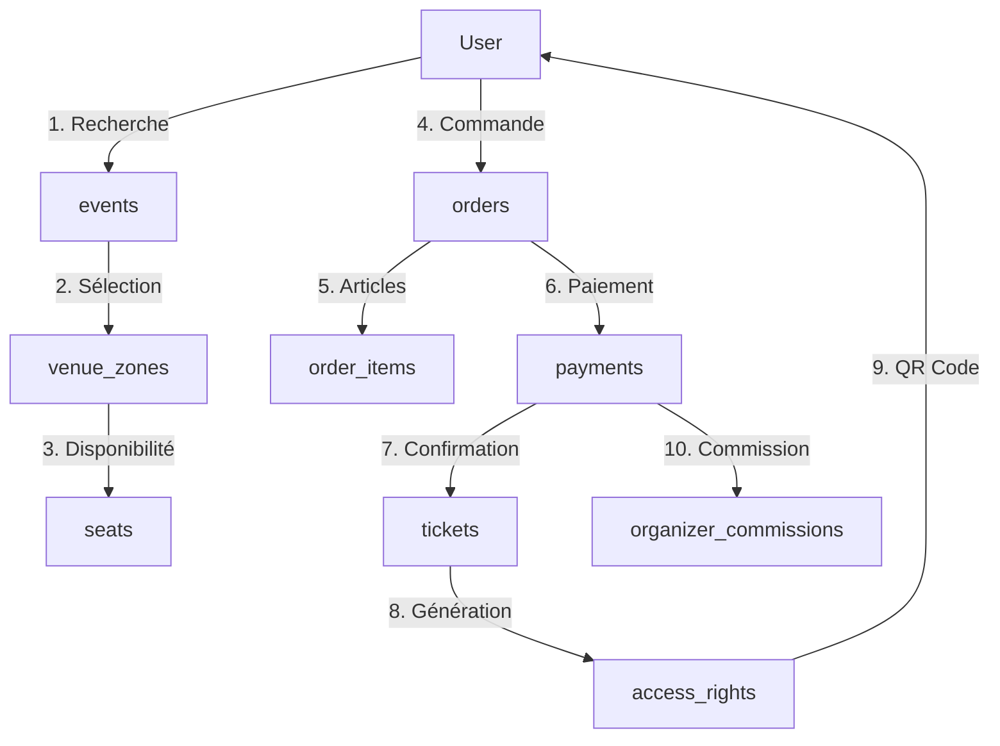
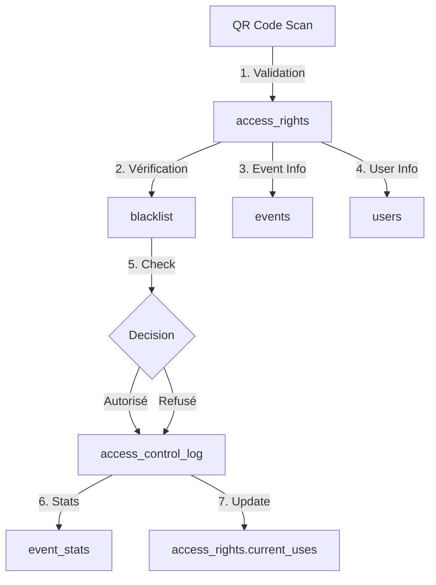
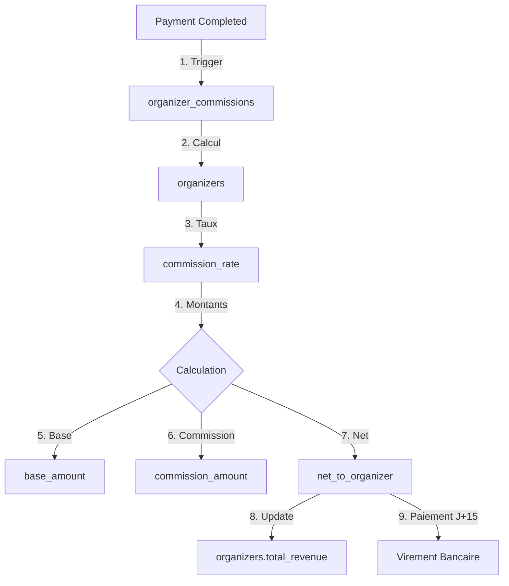
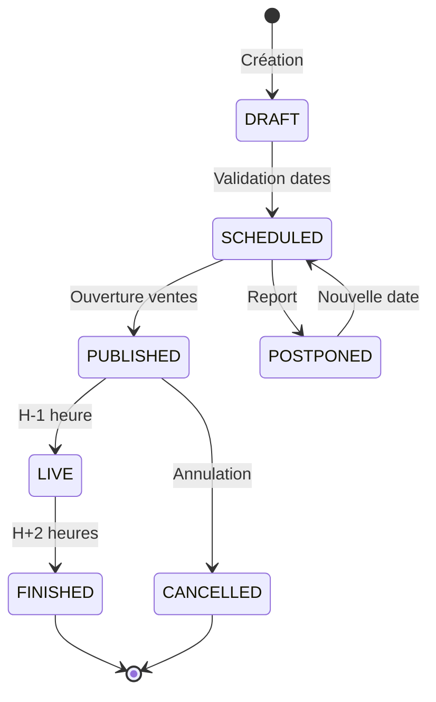
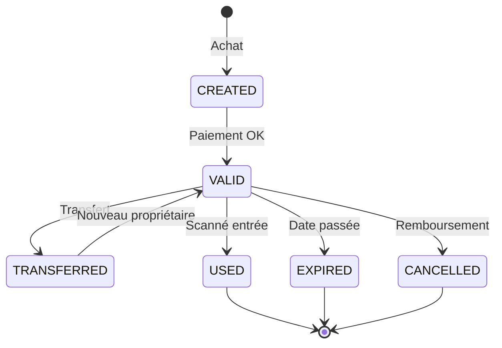
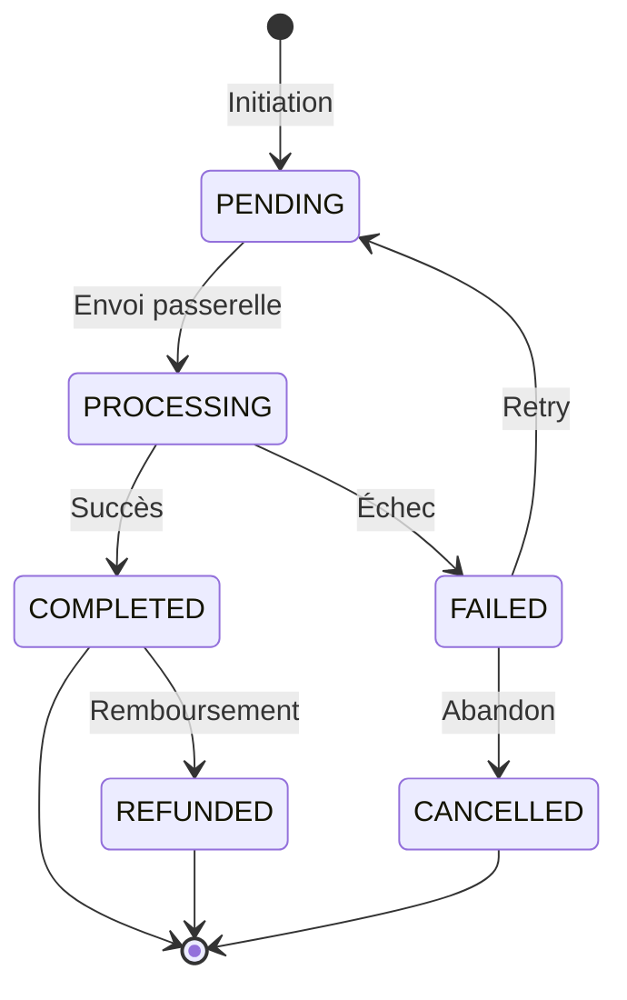
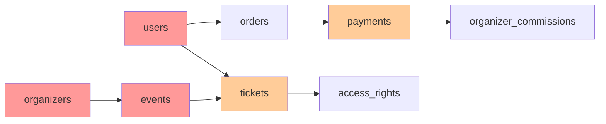

# Matrice CRUD et Diagrammes de Liaison - Entrix V2.1
## Analyse des Interactions Fonctionnalités ↔ Données

---

## 1. MATRICE CRUD GLOBALE

### Légende
- **C** : Create (Création)
- **R** : Read (Lecture)
- **U** : Update (Modification)
- **D** : Delete (Suppression)
- **-** : Aucune interaction
- **V** : Via vue uniquement
- **T** : Via trigger automatique

### 📊 Matrice Principale par Module Fonctionnel

| Tables / Fonctionnalités | Auth & Users | Organisateurs | Événements | Billetterie | Contrôle Accès | Paiements | Reporting |
|-------------------------|--------------|---------------|------------|-------------|----------------|-----------|-----------|
| **users** | CRUD | R | R | RU | R | R | R |
| **user_profiles** | CRUD | - | - | R | - | - | R |
| **user_roles** | CRU | R | - | - | - | - | R |
| **user_groups** | CRU | CRU | - | - | - | - | R |
| **organizers** | R | CRUD | R | R | R | R | R |
| **venue_organizer_relations** | - | CRUD | R | - | - | - | R |
| **events** | - | CRU | CRUD | R | R | R | R |
| **event_participants** | - | - | CRUD | R | R | - | R |
| **participants** | - | R | CRU | R | R | - | R |
| **venues** | - | RU | R | R | R | - | R |
| **venue_zones** | - | - | R | R | R | - | R |
| **tickets** | - | - | T | CRUD | RU | R | R |
| **access_rights** | - | - | T | CRU | RU | - | R |
| **orders** | - | - | - | CRU | - | RU | R |
| **payments** | - | - | - | T | - | CRU | R |
| **organizer_commissions** | - | T | - | - | - | CRU | R |
| **blacklist** | CRU | CRU | R | R | R | - | R |
| **audit_logs** | T | T | T | T | T | T | R |

---

## 2. DIAGRAMMES DE FLUX DE DONNÉES

### 🎫 Flux Achat de Billet



### 🚪 Flux Contrôle d'Accès



### 💰 Flux Commission Organisateur



---

## 3. MATRICE DÉTAILLÉE PAR RÔLE

### 👤 Utilisateur Standard (Spectateur)

| Table | Create | Read | Update | Delete | Conditions |
|-------|--------|------|--------|--------|------------|
| **users** | Self | Self | Self | - | Propres données uniquement |
| **user_profiles** | Self | Self | Self | - | Profil personnel |
| **tickets** | Via Order | Own | Transfer | - | Billets possédés |
| **orders** | Yes | Own | Status | - | Commandes personnelles |
| **access_rights** | - | Own | - | - | QR codes personnels |
| **subscriptions** | Via Order | Own | Settings | - | Abonnements actifs |

### 🏢 Administrateur Organisateur

| Table | Create | Read | Update | Delete | Conditions |
|-------|--------|------|--------|--------|------------|
| **organizers** | - | Own | Own | - | Organisation affiliée |
| **events** | Yes | Own Org | Yes | Soft | Événements organisateur |
| **event_participants** | Yes | All | Yes | Yes | Pour ses événements |
| **event_ticket_config** | Yes | Own | Yes | Yes | Configuration billetterie |
| **pricing_rules** | Yes | Own | Yes | Yes | Règles tarifaires |
| **organizer_commissions** | - | Own | - | - | Lecture seule finances |
| **blacklist** | Yes | Own+Global | - | - | Scope organisateur |

### 🏛️ Gestionnaire de Lieu

| Table | Create | Read | Update | Delete | Conditions |
|-------|--------|------|--------|--------|------------|
| **venues** | - | Managed | Yes | - | Lieux gérés uniquement |
| **venue_mappings** | Yes | Own | Yes | Soft | Configurations venue |
| **venue_zones** | Yes | Own | Yes | - | Zones des mappings |
| **venue_amenities** | Yes | Own | Yes | Yes | Services venue |
| **access_points** | Yes | Own | Yes | - | Points d'accès |
| **events** | - | At Venue | - | - | Événements du lieu |

### 🛡️ Super Administrateur

| Table | Create | Read | Update | Delete | Conditions |
|-------|--------|------|--------|--------|------------|
| **ALL TABLES** | Yes | Yes | Yes | Soft | Accès complet avec audit |
| **audit_logs** | Auto | Yes | - | - | Lecture seule |
| **security_policies** | Yes | Yes | Yes | Yes | Gestion sécurité |
| **payment_methods** | Yes | Yes | Yes | Soft | Config paiements |

---

## 4. INTERACTIONS COMPLEXES MULTI-TABLES

### 🔄 Cas d'Usage : Transfert de Billet

```sql
-- Tables impactées et ordre des opérations
1. CHECK tickets.transferable = TRUE
2. CHECK blacklist FOR new_user
3. BEGIN TRANSACTION
4. UPDATE tickets SET user_id = new_user
5. UPDATE access_rights SET user_id = new_user
6. INSERT access_transactions_log (transfer details)
7. INSERT audit_logs (action log)
8. COMMIT TRANSACTION
9. NOTIFY both users
```

### 📊 Cas d'Usage : Dashboard Organisateur

```sql
-- Lectures multiples pour vue consolidée
1. SELECT FROM v_organizer_performance
   JOIN events ON organizer_id
   JOIN tickets ON event_id
   JOIN payments ON order_id
   
2. SELECT FROM v_commission_summary
   WHERE month = current AND organizer_id = ?
   
3. SELECT FROM v_event_analytics
   WHERE organizer_id = ? AND period = ?
   
4. SELECT FROM venue_organizer_relations
   WHERE organizer_id = ? AND is_active
```

### 🎯 Cas d'Usage : Validation Événement

```sql
-- Vérifications en cascade avant publication
1. CHECK organizers.status = 'ACTIVE'
2. CHECK venue_availability(venue_id, dates)
3. CHECK event_participants.is_confirmed >= minimum
4. CHECK event_ticket_config EXISTS
5. CHECK pricing_rules VALID
6. UPDATE events SET status = 'PUBLISHED'
7. TRIGGER notifications to subscribers
```

---

## 5. DIAGRAMMES D'ÉTAT DES ENTITÉS

### 📅 États d'un Événement



### 🎫 États d'un Billet



### 💳 États d'un Paiement



---

## 6. MATRICE DES TRIGGERS AUTOMATIQUES

| Trigger | Table Source | Action | Tables Impactées | Description |
|---------|--------------|--------|------------------|-------------|
| **sync_subscription_organizer** | subscriptions | INSERT/UPDATE | subscriptions.organizer_id | Synchronise l'organisateur |
| **sync_ticket_organizer** | tickets | INSERT/UPDATE | tickets.organizer_id | Synchronise l'organisateur |
| **generate_access_codes** | access_rights | INSERT | access_rights.qr_code | Génère QR unique |
| **calculate_order_totals** | order_items | ALL | orders.totals | Recalcule montants |
| **update_organizer_stats** | events | ALL | organizers.stats | MAJ statistiques |
| **detect_suspicious_activity** | login_attempts | INSERT | security_events | Détecte anomalies |
| **audit_table_changes** | ALL CRITICAL | ALL | audit_logs | Trace modifications |
| **update_timestamp_column** | ALL | UPDATE | *.updated_at | MAJ timestamp |

---

## 7. ANALYSE D'IMPACT DES MODIFICATIONS

### 🔄 Modification Schema Impact Analysis

| Changement Type | Tables Directes | Vues Impactées | Triggers | API Endpoints | Risk Level |
|-----------------|-----------------|----------------|----------|---------------|------------|
| Ajout colonne `users` | 1 | 3 | 1 | 5+ | 🟢 Low |
| Modif enum `event_status` | 1 | 5 | 2 | 10+ | 🟡 Medium |
| Refactor `organizers` | 1 | 8 | 4 | 20+ | 🔴 High |
| Ajout table relation | 2+ | Variable | 1+ | 5+ | 🟡 Medium |
| Suppression colonne | 1 | All related | All | All | 🔴 Critical |

### 📊 Dépendances Critiques



---

## 8. OPTIMISATIONS CRUD

### 🚀 Patterns de Lecture Optimisés

| Pattern | Implementation | Bénéfice | Exemple |
|---------|---------------|----------|---------|
| **Eager Loading** | JOIN préventifs | -70% requêtes | Event + Venue + Organizer |
| **Lazy Loading** | Chargement différé | -50% données | Tickets pagination |
| **Batch Operations** | Bulk INSERT/UPDATE | -90% temps | Import billets |
| **Read Replicas** | Lecture sur slaves | -60% charge master | Reporting |
| **Materialized Views** | Pré-calcul | -95% temps calcul | Analytics |

### 📈 Index Stratégiques pour CRUD

| Opération | Index Recommandé | Amélioration | Cas d'Usage |
|-----------|------------------|--------------|-------------|
| **Recherche événements** | `(status, scheduled_start, visibility)` | 100x | Page accueil |
| **Validation QR** | `(qr_code) UNIQUE` | 1000x | Contrôle accès |
| **Dashboard user** | `(user_id, created_at DESC)` | 50x | Historique |
| **Commission calc** | `(organizer_id, status, created_at)` | 80x | Finance mensuelle |

---

## 9. SÉCURITÉ CRUD PAR POLITIQUE RLS

### 🔐 Politiques par Table

| Table | Policy Type | Condition | Appliqué à |
|-------|-------------|-----------|------------|
| **users** | Row Security | `id = current_user_id()` | ALL sauf admin |
| **organizers** | Row Security | `can_manage_organizer(id)` | ALL sauf public read |
| **events** | Row Security | `status = 'PUBLISHED' OR owner` | SELECT public, ALL owner |
| **tickets** | Row Security | `user_id = current_user()` | ALL utilisateur |
| **payments** | Row Security | `order.user_id = current_user()` | SELECT only |
| **blacklist** | Row Security | `is_admin() OR scope_owner` | Admins + scope owners |

---

## 10. MONITORING CRUD

### 📊 Métriques à Surveiller

| Métrique | Seuil Alerte | Action | Monitoring Tool |
|----------|--------------|--------|-----------------|
| **INSERT/sec on tickets** | >1000 | Scale horizontally | Prometheus |
| **UPDATE locks on events** | >5 sec | Investigate deadlock | pg_stat_activity |
| **DELETE on users** | ANY | Audit + Alert | Trigger + Slack |
| **SELECT time on reports** | >10 sec | Optimize/Cache | New Relic |
| **Transaction rollbacks** | >5% | Debug transactions | PostgreSQL logs |

### 🔍 Queries Problématiques Types

```sql
-- ❌ N+1 Problem
SELECT * FROM events;
-- Then for each: SELECT * FROM tickets WHERE event_id = ?

-- ✅ Solution
SELECT e.*, t.* FROM events e
LEFT JOIN tickets t ON e.id = t.event_id;

-- ❌ Missing Index
SELECT * FROM tickets WHERE user_id = ? AND created_at > ?;

-- ✅ Solution
CREATE INDEX idx_tickets_user_created ON tickets(user_id, created_at DESC);
```

---

Cette matrice CRUD complète établit une vision claire des interactions entre fonctionnalités et données, permettant d'identifier rapidement les impacts de changements et d'optimiser les performances.