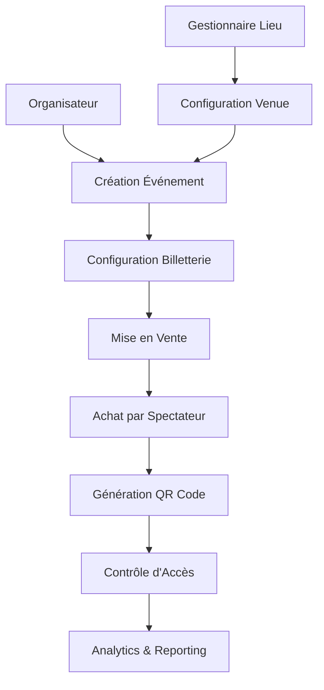

# Documentation Fonctionnelle Complète
## Plateforme Entrix - Gestion d'Événements et Billetterie

---

# 📚 Table des Matières

1. [Vue d'ensemble métier](#vue-densemble-métier)
2. [Gestion des utilisateurs](#gestion-des-utilisateurs)
3. [Gestion des lieux](#gestion-des-lieux)
4. [Gestion des événements](#gestion-des-événements)
5. [Système de billetterie](#système-de-billetterie)
6. [Contrôle d'accès](#contrôle-daccès)
7. [Paiements et facturation](#paiements-et-facturation)
8. [Reporting et analytics](#reporting-et-analytics)
9. [Administration](#administration)

---

# Vue d'ensemble métier

## 🎯 Objectif de la plateforme Entrix

Entrix est une plateforme complète de gestion d'événements et de billetterie conçue pour digitaliser et optimiser l'organisation d'événements en Tunisie et au Maghreb. Elle couvre tous les types d'événements : sportifs, culturels, artistiques, conférences et divertissement.

## 🏗️ Écosystème des acteurs

### **Acteurs principaux**

| Acteur | Rôle | Responsabilités | Exemples |
|--------|------|----------------|----------|
| **Super Administrateur** | Administration plateforme | Configuration globale, gestion des organisateurs, support technique | Équipe Entrix |
| **Organisateur** | Organisation d'événements | Création événements, gestion billetterie, suivi performances | Club Africain, Ennejma Ezzahra, JCC |
| **Gestionnaire de lieu** | Gestion des venues | Configuration lieux, disponibilités, tarification | CNSS (Stade Radès), Opéra de Tunis |
| **Participant** | Participation aux événements | Équipes, artistes, conférenciers | EST, Latifa, experts IT |
| **Spectateur/Abonné** | Consommation événements | Achat billets, abonnements, participation | Supporters, mélomanes, professionnels |
| **Personnel** | Opérations terrain | Contrôle d'accès, sécurité, support | Agents sécurité, billetterie |

### **Flux métier global**

## 📊 Processus métier principaux

### **1. Cycle de vie d'un événement**
1. **Planification** : Organisateur définit événement et reserve lieu
2. **Configuration** : Setup billetterie, zones, tarifs
3. **Commercialisation** : Mise en vente, communication
4. **Opérations** : Contrôle d'accès, gestion flux
5. **Clôture** : Reporting, paiements, analyses

### **2. Parcours spectateur**
1. **Découverte** : Navigation événements, recherche
2. **Achat** : Sélection places, paiement
3. **Préparation** : Réception billets, informations pratiques
4. **Événement** : Accès venue, expérience
5. **Post-événement** : Évaluation, fidélisation

### **3. Gestion financière**
1. **Encaissement** : Paiements spectateurs
2. **Commissions** : Calcul automatique
3. **Redistribution** : Paiement organisateurs
4. **Reporting** : Suivi performances financières

---

# Gestion des utilisateurs

## 👥 Types d'utilisateurs et rôles

### **Hiérarchie des rôles**

#### **Super Administrateur (Niveau 100)**
**Responsabilités :**
- Administration complète de la plateforme
- Gestion des organisateurs et gestionnaires de lieux
- Configuration globale des paramètres système
- Support technique de niveau 3
- Accès à tous les modules et données

**Fonctionnalités accessibles :**
- ✅ Création/modification/suppression de tous les comptes
- ✅ Configuration des méthodes de paiement
- ✅ Gestion des commissions plateforme
- ✅ Accès aux logs système et audit complet
- ✅ Configuration des politiques de sécurité
- ✅ Gestion des sauvegardes et maintenance
- ✅ Tableau de bord global multi-organisateurs

#### **Administrateur Organisateur (Niveau 80)**
**Responsabilités :**
- Administration complète de son organisation
- Gestion des événements et équipes
- Configuration de la billetterie
- Suivi des performances commerciales

**Fonctionnalités accessibles :**
- ✅ Gestion des événements de son organisation
- ✅ Configuration billetterie et tarification
- ✅ Gestion des participants et staff
- ✅ Accès aux rapports financiers
- ✅ Gestion de la communication événements
- ✅ Configuration des zones VIP
- ❌ Accès aux données autres organisateurs

#### **Staff Organisateur (Niveau 50)**
**Responsabilités :**
- Gestion opérationnelle des événements
- Support billetterie et client
- Suivi logistique

**Fonctionnalités accessibles :**
- ✅ Modification événements assignés
- ✅ Gestion billetterie (création, annulation)
- ✅ Support client niveau 1
- ✅ Consultation reporting limité
- ❌ Configuration financière
- ❌ Gestion utilisateurs

#### **Gestionnaire de Lieu (Niveau 60)**
**Responsabilités :**
- Configuration et gestion de son/ses lieux
- Calendrier et disponibilités
- Maintenance des équipements

**Fonctionnalités accessibles :**
- ✅ Configuration complète de ses venues
- ✅ Gestion du calendrier et disponibilités
- ✅ Validation des demandes de réservation
- ✅ Configuration des tarifs de location
- ✅ Reporting d'occupation
- ❌ Création d'événements
- ❌ Accès données autres lieux

#### **Personnel Terrain (Niveau 30)**
**Responsabilités :**
- Contrôle d'accès aux événements
- Sécurité et gestion des flux
- Support spectateurs

**Fonctionnalités accessibles :**
- ✅ Scanner QR codes et validation accès
- ✅ Consultation listes invités/VIP
- ✅ Gestion des incidents d'accès
- ✅ Communication avec superviseur
- ❌ Modification données événement
- ❌ Accès informations financières

#### **Spectateur/Utilisateur Standard (Niveau 0)**
**Responsabilités :**
- Achat de billets et abonnements
- Participation aux événements
- Gestion de son profil

**Fonctionnalités accessibles :**
- ✅ Navigation et recherche événements
- ✅ Achat billets et abonnements
- ✅ Gestion profil et préférences
- ✅ Historique achats et événements
- ✅ Transfert de billets (si autorisé)
- ✅ Évaluation événements
- ❌ Accès données autres utilisateurs

## 🔐 Processus d'inscription et authentification

### **Inscription Spectateur**

**Étapes :**
1. **Formulaire de base**
   - Email (obligatoire, unique)
   - Mot de passe (8+ caractères, complexité)
   - Prénom/Nom
   - Numéro de téléphone
   - Acceptation CGU et politique confidentialité

2. **Vérification identité**
   - Email de confirmation avec lien activation
   - SMS de vérification téléphone (optionnel)
   - Validation dans les 24h

3. **Profil étendu**
   - Date de naissance
   - Adresse postale
   - Préférences événements
   - Consentement marketing

**Règles métier :**
- Un email = un compte unique
- Âge minimum 13 ans (avec autorisation parentale)
- Vérification obligatoire avant premier achat
- Suspension automatique après 3 tentatives connexion échouées

### **Inscription Organisateur**

**Processus validé manuellement :**
1. **Demande d'accès**
   - Formulaire organisateur
   - Informations légales (RNIS, licence)
   - Documents justificatifs
   - Références et portfolio

2. **Validation administrative**
   - Vérification documents par équipe Entrix
   - Validation juridique et commerciale
   - Définition du profil de commission
   - Formation à la plateforme

3. **Activation compte**
   - Création compte administrateur
   - Configuration organisation
   - Paramétrage initial
   - Accès aux fonctionnalités

### **Authentification sécurisée**

**Méthodes supportées :**
- **Standard** : Email + mot de passe
- **Multi-facteurs (MFA)** : SMS, email, application authenticator
- **Social Login** : Facebook, Google (pour spectateurs)
- **SSO** : Pour organisations partenaires

**Politiques de sécurité :**
- Session automatique : 24h inactivity
- Limitation tentatives : 5 max par 15 minutes
- Détection localisation suspecte
- Notification connexions nouvelles

## 👤 Profils et préférences

### **Profil Spectateur**

**Informations personnelles :**
- Données démographiques (âge, genre, localisation)
- Préférences linguistiques (Arabe, Français, Anglais)
- Coordonnées de contact
- Contact d'urgence
- Photo de profil

**Préférences événements :**
- Types d'événements favoris
- Équipes/artistes suivis
- Zones préférées (tribune, virage, VIP)
- Budget moyen par événement
- Fréquence de participation

**Paramètres de notification :**
- Nouveaux événements favoris
- Promotions et offres spéciales
- Rappels événements achetés
- Actualités équipes suivies
- Alertes disponibilité places

**Gestion de la confidentialité :**
- Visibilité profil (public/privé)
- Partage données marketing
- Historique de navigation
- Consentement cookies

### **Profil Organisateur**

**Informations organisation :**
- Raison sociale et statut juridique
- RNIS et identifiants fiscaux
- Adresse siège social
- Contact commercial et technique
- Logo et éléments de marque

**Configuration commerciale :**
- Pourcentage commission négocié
- Méthodes de paiement acceptées
- Conditions générales de vente
- Politique d'annulation/remboursement
- Tarifs préférentiels partenaires

**Paramètres opérationnels :**
- Délais validation commandes
- Notifications équipe commerciale
- Intégrations CRM/ERP
- API et webhooks personnalisés

## 🏆 Système de fidélité

### **Programme supporters (Spectateurs)**

**Niveaux de fidélité :**

#### **Bronze (0-500 points)**
- 1 point = 1 TND dépensé
- 5% réduction merchandising
- Accès avant-premières billetterie

#### **Argent (501-2000 points)**
- 1.5 points = 1 TND dépensé
- 10% réduction billets et produits
- Invitations événements exclusifs
- Service client prioritaire

#### **Or (2001-5000 points)**
- 2 points = 1 TND dépensé
- 15% réduction + offres VIP
- Accès zones privilégiées
- Rencontres avec artistes/joueurs
- Parking gratuit

#### **Platine (5000+ points)**
- 3 points = 1 TND dépensé
- 20% réduction + services premium
- Invitations loges VIP
- Services concierge
- Cadeaux personnalisés

**Avantages transversaux :**
- Points échangeables entre événements
- Promotions cross-organisateurs
- Early bird access billets populaires
- Programme parrainage

### **Programme partenaires (Organisateurs)**

**Critères évaluation :**
- Volume événements/an
- Chiffre d'affaires généré
- Satisfaction spectateurs
- Respect délais paiement

**Avantages selon performance :**
- Réduction commissions plateforme
- Support technique prioritaire
- Outils marketing avancés
- Insights analytics exclusifs

---

# Gestion des lieux

## 🏢 Propriétaires et gestionnaires de lieux

### **Statuts des acteurs lieux**

#### **Propriétaire (Owner)**
**Définition :** Entité légale propriétaire du lieu
**Responsabilités :**
- Décisions stratégiques d'exploitation
- Validation investissements et travaux
- Négociation contrats long terme
- Définition politique tarifaire globale

**Exemples :**
- Ministère Jeunesse et Sports (Stades publics)
- Municipalités (Théâtres municipaux)
- Entreprises privées (Salles privées)
- Associations (Centres culturels)

#### **Gestionnaire (Manager)**
**Définition :** Entité opérationnelle du lieu au quotidien
**Responsabilités :**
- Gestion calendrier et réservations
- Maintenance et entretien
- Relations avec organisateurs
- Reporting d'activité

**Exemples :**
- CNSS (Gestion Stade Olympique)
- Sociétés de gestion événementielle
- Associations culturelles
- Équipes internes organisateurs

#### **Exploitant technique**
**Définition :** Prestataire services techniques spécialisés
**Responsabilités :**
- Installation équipements techniques
- Sonorisation et éclairage
- Sécurité et surveillance
- Services auxiliaires (catering, nettoyage)

### **Droits et permissions par statut**

| Fonctionnalité | Propriétaire | Gestionnaire | Exploitant |
|---------------|--------------|--------------|------------|
| Configuration venue | ✅ Complète | ✅ Limitée | ❌ |
| Gestion calendrier | ✅ | ✅ | 👁️ Consultation |
| Tarification | ✅ | ✅ Selon délégation | ❌ |
| Validation réservations | ✅ | ✅ | ❌ |
| Reporting financier | ✅ | ✅ | ❌ |
| Maintenance | ✅ Approbation | ✅ Exécution | ✅ Technique |

## 🏟️ Configuration des venues

### **Informations générales venue**

**Identification :**
- Nom officiel et noms d'usage
- Adresse complète avec géolocalisation
- Catégorie (Stade, Théâtre, Arena, Plein air, Centre congrès)
- Année de construction et rénovations
- Architecte et caractéristiques remarquables

**Capacités et dimensions :**
- Capacité maximale totale
- Capacité par configuration (sport, concert, conférence)
- Dimensions terrain/scène principal
- Surface totale et surfaces annexes
- Hauteur sous plafond/toit

**Équipements et infrastructures :**
- Équipements audiovisuels (écrans, sono, éclairage)
- Systèmes de sécurité (caméras, détection incendie)
- Climatisation et ventilation
- Connexions internet et télécommunications
- Équipements sportifs spécialisés

**Services disponibles :**
- Restauration (cuisines, bars, espaces traiteur)
- Parking (nombre places, tarification)
- Transports publics (proximité, accès)
- Accessibilité PMR (rampes, ascenseurs, places)
- Services VIP (salons, loges, espaces privés)

### **Configurations multiples**

#### **Exemple : Stade Olympique de Radès**

**Configuration Football (55,000 places)**
- Terrain 105x68m pelouse naturelle
- 4 tribunes principales
- 8 sections VIP
- Éclairage 1400 lux minimum
- Écrans géants 4 faces

**Configuration Concert (70,000 places)**
- Scène centrale terrain 60x40m
- Fosse debout 15,000 places
- Tribunes assises conservées
- Système son 360° 150kW
- Écrans LED périphériques

**Configuration Athlétisme (45,000 places)**
- Piste 400m certifiée IAAF
- Aires lancer et saut
- Chronométrage électronique
- Zones techniques athlètes
- Configuration tribunes adaptée

#### **Exemple : Théâtre de l'Opéra de Tunis**

**Configuration Opéra (1,200 places)**
- Scène italienne traditionnelle
- Fosse orchestre 80 musiciens
- 3 niveaux : parterre, balcon, galeries
- Acoustique naturelle optimisée
- Équipements lyrique spécialisés

**Configuration Concert (1,400 places)**
- Extension scène pour formations importantes
- Ajout places temporaires
- Sono d'appoint discrète
- Éclairage concert adapté
- Configuration piano/chambre

**Configuration Conférence (800 places)**
- Scène transformée en podium
- Équipements audiovisuels conférence
- Système traduction simultanée
- Éclairage salle de conférence
- Installation technique mobile

## 🗺️ Cartographie et zonage

### **Hiérarchie des zones**

#### **Niveau 0 - Zones principales**
**Définition :** Grandes divisions structurelles du lieu
**Exemples stade :**
- Tribune Principale (Officielle)
- Tribune Opposée 
- Virage Nord
- Virage Sud
- Zones techniques (Terrain, Vestiaires)

**Exemples théâtre :**
- Parterre
- Premier balcon
- Deuxième balcon
- Loges privées
- Scène

#### **Niveau 1 - Secteurs**
**Définition :** Subdivisions des zones principales
**Exemples :**
- Tribune Principale → Secteur A, B, C, D
- Virage Nord → Secteur Supporters, Secteur Famille
- Parterre → Orchestre, Côté cour, Côté jardin

#### **Niveau 2 - Blocs**
**Définition :** Groupes de rangées homogènes
**Exemples :**
- Secteur A → Bloc A1 (rangées 1-15), Bloc A2 (rangées 16-30)
- Qualité vue différenciée
- Services spécifiques (bar, toilettes à proximité)

#### **Niveau 3 - Places individuelles**
**Définition :** Places numérotées spécifiques
**Caractéristiques :**
- Numérotation unique (Rangée-Place)
- Coordonnées exactes
- Caractéristiques spéciales (PMR, vue limitée, VIP)

### **Types de zones selon usage**

#### **Zones assises numérotées**
**Caractéristiques :**
- Places fixes avec numéro unique
- Confort et services définis
- Tarification différenciée selon localisation
- Gestion nominative possible

**Exemples :**
- Tribunes stades
- Sièges théâtres
- Espaces conférence
- Loges VIP

#### **Zones debout (fosse)**
**Caractéristiques :**
- Capacité calculée en m²/personne
- Accès plus flexible
- Ambiance et interaction
- Sécurité renforcée

**Exemples :**
- Virages stades
- Fosse concerts
- Espaces festival
- Zones standing conférences

#### **Zones VIP et premium**
**Caractéristiques :**
- Services haut de gamme
- Accès privilégiés
- Espaces privatifs
- Prestations sur-mesure

**Services inclus :**
- Stationnement dédié
- Entrées séparées
- Espaces réception privés
- Service restauration premium
- Personnel dédié
- Cadeaux et souvenirs

#### **Zones techniques et sécurité**
**Accès restreint :**
- Personnel événement uniquement
- Badges sécurisés requis
- Zones vestiaires, régies, sécurité
- Espaces stockage et logistique

### **Adaptabilité multi-événements**

#### **Configurations sportives**
**Football :**
- Respect distances réglementaires terrain
- Séparation supporters visiteurs
- Zones échauffement et bancs
- Espaces media et arbitres

**Basketball :**
- Terrain central avec tribunes 4 côtés
- Proximité spectateurs pour ambiance
- Zones équipes et officiels
- Configuration éclairage adapté

#### **Configurations culturelles**
**Concerts :**
- Optimisation acoustique
- Gestion flux entrée/sortie
- Zones techniques artistes
- Merchandising et bars

**Spectacles :**
- Visibilité scène optimisée
- Ambiance intimiste ou grandiose
- Espaces entracte
- Garde-robe et services

#### **Configurations business**
**Conférences :**
- Disposition audience vers orateur
- Équipements audiovisuels intégrés
- Espaces networking
- Services traiteur professionnels

**Salons :**
- Espaces stands modulables
- Circulation flux visiteurs
- Zones démo et présentation
- Stockage exposants

## 🔧 Gestion des disponibilités

### **Calendrier global venue**

**Planning maître :**
- Vue annuelle avec événements confirmés
- Blocs de maintenance et entretien
- Périodes d'indisponibilité
- Créneaux libres pour réservation

**Gestion des conflits :**
- Priorités selon type événement
- Résolution automatique conflits mineurs
- Escalade manuelle pour arbitrages
- Historique des décisions

### **Processus de réservation**

#### **Demande préliminaire**
**Organisateur :**
1. Consultation disponibilités en ligne
2. Pré-réservation créneaux souhaités
3. Spécification besoins techniques
4. Estimation budgétaire automatique

#### **Validation gestionnaire**
**Gestionnaire lieu :**
1. Analyse faisabilité technique
2. Vérification conformité réglementaire
3. Proposition adaptations si nécessaire
4. Devis détaillé avec options

#### **Confirmation commerciale**
**Finalisation :**
1. Négociation conditions particulières
2. Signature contrat de location
3. Calendrier des paiements
4. Blocage définitif créneaux

### **Tarification location**

#### **Grille tarifaire de base**

**Par type d'événement :**
- **Sport professionnel :** Tarif plein
- **Sport amateur :** -30%
- **Cultural/Artistique :** Selon jauge
- **Corporate/Conférence :** +20%
- **Associatif :** -50%

**Par jour de semaine :**
- **Weekend/Jours fériés :** +25%
- **Semaine :** Tarif de base
- **Dimanche soir/Lundi :** -15%

**Par saison :**
- **Haute saison** (Oct-Mai) : +15%
- **Basse saison** (Juin-Sept) : Tarif de base

#### **Services additionnels**

**Forfaits techniques :**
- Sonorisation de base : 2,000 TND
- Éclairage événement : 1,500 TND
- Écrans géants : 3,000 TND
- Sécurité renforcée : 100 TND/agent/jour

**Services complémentaires :**
- Nettoyage post-événement : 0.5 TND/place
- Parking événement : 5 TND/place/jour
- Personnel technique : 50 TND/technicien/jour
- Assurance événement : 1% du CA prévisionnel

---

# Gestion des événements

## 🎪 Organisateurs d'événements

### **Types d'organisateurs**

#### **Clubs sportifs**
**Profils :**
- Clubs professionnels (CA, EST, CSS, ST, etc.)
- Clubs amateurs et régionaux
- Fédérations sportives nationales
- Ligues professionnelles

**Événements organisés :**
- Matchs de championnat
- Coupes nationales
- Rencontres internationales
- Événements jeunes/formation
- Stages et camps d'entraînement

**Spécificités métier :**
- Gestion calendrier sportif contraint
- Billetterie supporters fidèles
- Merchandising et partenariats
- Respect règlements fédéraux

**Distinction organisateur vs participant :**
- **Organisateur** : Club Africain organise le match CA vs EST
- **Participants** : Équipe CA et équipe EST participent au match
- Un club peut être à la fois organisateur (matches domicile) et participant (matches extérieur)

#### **Producteurs culturels**
**Profils :**
- Sociétés de production événementielle
- Promoteurs concerts et spectacles
- Institutions culturelles publiques
- Organisateurs festivals

**Événements organisés :**
- Concerts (variété, classique, traditionnelle)
- Spectacles (théâtre, danse, one-man-show)
- Festivals multiculturels
- Événements patrimoniaux

**Spécificités métier :**
- Gestion artistes et cachets
- Programmation culturelle cohérente
- Partenariats institutions
- Financement public/privé mixte

**Distinction organisateur vs participant :**
- **Organisateur** : Ennejma Ezzahra organise le Festival de Carthage
- **Participants** : Latifa, Sting, Orchestre Symphonique participent au festival
- Le producteur gère la logistique, les artistes assurent les performances

#### **Organisateurs corporate**
**Profils :**
- Entreprises événementiel BtoB
- Agences communication
- Associations professionnelles
- Centres de formation

**Événements organisés :**
- Conférences et séminaires
- Salons professionnels
- Conventions d'entreprise
- Formations et certifications

**Spécificités métier :**
- Ciblage audience professionnelle
- Services business premium
- ROI et lead generation
- Conformité normes sectorielles

**Distinction organisateur vs participant :**
- **Organisateur** : UTICA organise un séminaire économique
- **Participants** : Experts, consultants, speakers interviennent
- L'organisateur gère la logistique, les participants apportent le contenu

#### **Associations et ONG**
**Profils :**
- Associations culturelles
- ONG et organisations caritatives
- Collectifs citoyens
- Clubs et communautés

**Événements organisés :**
- Événements caritatifs
- Manifestations citoyennes
- Festivals communautaires
- Rassemblements associatifs

**Spécificités métier :**
- Budget serré et bénévolat
- Engagement citoyen et social
- Communication alternative
- Financement participatif

**Distinction organisateur vs participant :**
- **Organisateur** : Association caritative organise un gala
- **Participants** : Artistes bénévoles, personnalités participent
- L'association coordonne, les participants donnent de leur temps/talent

### **Processus d'accréditation organisateur**

#### **Dossier candidature**
**Documents requis :**
- Statuts légaux et RNIS
- Justificatifs d'activité (3 dernières années)
- Portfolio événements organisés
- Références clients et partenaires
- Assurances professionnelles
- Garanties financières

**Évaluation critères :**
- Expérience et expertise métier
- Solidité financière
- Réputation et recommandations
- Conformité réglementaire
- Capacité technique et humaine

#### **Validation et conventionnement**
**Comité validation :**
- Équipe Entrix (commercial, juridique, technique)
- Experts secteur concerné
- Représentants institutionnels si pertinent

**Convention organisateur :**
- Droits et obligations
- Commissions et conditions commerciales
- Standards qualité et service
- Politique annulation et litiges
- Formation et accompagnement

## 📅 Création et planification d'événements

### **Processus de création événement**

#### **Étape 1 : Informations générales**

**Identification événement :**
- Nom officiel et titre commercial
- Type/catégorie événement
- Description détaillée et programme
- Public cible et âge recommandé
- Langues de communication

**Planification temporelle :**
- Date et heures début/fin
- Durée totale et timing détaillé
- Programme/planning des séances
- Créneaux ouverture/fermeture venue
- Gestion des entractes et pauses

**Classification et tags :**
- Catégorie principale (Sport, Culture, Business, etc.)
- Sous-catégories spécialisées
- Mots-clés recherche et SEO
- Niveau d'audience (Local, National, International)
- Certification ou labels qualité

#### **Étape 2 : Venue et configuration**

**Sélection lieu :**
- Recherche venues disponibles par critères
- Comparaison capacités et services
- Vérification disponibilité créneaux
- Simulation coûts location
- Réservation temporaire (72h)

**Configuration retenue :**
- Choix mapping venue optimal
- Adaptation zones si nécessaire
- Services techniques requis
- Besoins spécifiques organisateur
- Validation contraintes sécurité

#### **Étape 3 : Participants et programmation**

**Gestion participants :**
- Invitations et confirmations
- Définition rôles et responsabilités
- Gestion cachets et contrats
- Planning arrivée/départ
- Besoins logistiques spécifiques

**Programme détaillé :**
- Timing précis de chaque segment
- Ordre de passage/programmation
- Gestion transitions et changements
- Contenus pour communication
- Informations spectateurs

### **Configuration événement avancée**

#### **Paramètres commerciaux**

**Politique tarifaire :**
- Grille prix par zone/catégorie
- Promotions et réductions
- Tarifs préférentiels (enfants, étudiants, groupes)
- Dynamic pricing selon demande
- Packages et offres combinées

**Conditions de vente :**
- Politique d'annulation/remboursement
- Transferts et échanges autorisés
- Restrictions d'âge ou autres
- Conditions d'accès spéciales
- Terms & conditions personnalisés

#### **Marketing et communication**

**Assets visuels :**
- Affiche officielle événement
- Images et vidéos promotionnelles
- Logo et charte graphique
- Photos participants/artistes
- Éléments merchandising

**Plan communication :**
- Calendrier publication contenus
- Canaux de communication prioritaires
- Partenariats media et influenceurs
- Campagnes publicitaires payantes
- Relations presse et RP

#### **Logistique et opérations**

**Gestion des accès :**
- Points d'entrée et contrôle
- Flux de circulation prévus
- Gestion des VIP et invités
- Protocole sécurité
- Plan d'évacuation d'urgence

**Services auxiliaires :**
- Restauration et points de vente
- Merchandising officiel
- Parking et transports
- Services médicaux
- Garde d'enfants si applicable

## 👥 Gestion des participants

### **Types de participants**

**Important :** Les participants sont les acteurs qui PARTICIPENT à l'événement (équipes, artistes, speakers), distincts des organisateurs qui ORGANISENT l'événement.

#### **Participants sportifs**
**Équipes et athlètes :**
- Effectifs professionnels complets
- Équipes réserves et jeunes
- Athlètes individuels
- Équipes nationales et sélections

**Staff technique :**
- Entraîneurs et adjoints
- Préparateurs physiques et médicaux
- Managers et dirigeants
- Arbitres et officiels

**Services support :**
- Journalistes et media accrédités
- Photographes officiels
- Commentateurs et consultants
- Personnel sécurité spécialisé

**Exemple concret :**
- **Organisateur** : Club Africain organise CA vs EST
- **Participants** : Équipe CA (domicile) + Équipe EST (extérieur) + arbitres

#### **Participants culturels**
**Artistes et créateurs :**
- Artistes principaux et vedettes
- Artistes secondaires et premières parties
- Musiciens et orchestres
- Techniciens artistiques (son, lumière, scène)

**Production :**
- Réalisateurs et metteurs en scène
- Producteurs artistiques (différents de l'organisateur événement)
- Régisseurs techniques
- Personnel logistique

**Exemple concret :**
- **Organisateur** : Ennejma Ezzahra organise le Festival de Carthage
- **Participants** : Latifa (tête d'affiche) + Orchestre symphonique + groupe ouverture

#### **Participants business**
**Intervenants :**
- Conférenciers et keynote speakers
- Experts et consultants
- Panels et tables rondes
- Modérateurs et animateurs

**Professionnels :**
- Participants inscrits aux conférences
- Exposants et sponsors
- Media spécialisés
- Personnel d'organisation

**Exemple concret :**
- **Organisateur** : UTICA organise séminaire économique
- **Participants** : Ministre économie + experts bancaires + consultants internationaux

### **Processus de gestion participants**

#### **Invitation et confirmation**

**Processus d'invitation :**
1. Définition besoins et profils recherchés
2. Recherche et sélection participants
3. Envoi invitations officielles
4. Négociation conditions participation
5. Signature contrats et accords
6. Confirmation définitive participation

**Gestion des confirmations :**
- Suivi responses et relances
- Mise à jour statuts en temps réel
- Gestion listes d'attente
- Participants de remplacement
- Communication changements programme

#### **Contractualisation**

**Types de contrats :**
- **Sportifs :** Règlements fédéraux, prime participation
- **Artistiques :** Cachets, droits d'auteur, techniques riders
- **Conférenciers :** Honoraires, frais déplacement, conditions intervention
- **Bénévoles :** Conventions, assurances, défraiements

**Clauses standards :**
- Conditions annulation/report
- Obligations promotion événement
- Droits image et communication
- Assurances et responsabilités
- Exclusivités et non-concurrence

#### **Logistique participants**

**Travel & Hospitality :**
- Réservations transport (vols, trains, transferts)
- Hébergement adapté (hôtels, centres formation)
- Restauration spécialisée (régimes, traditions)
- Services VIP et protocole
- Sécurité personnalisée

**Sur site événement :**
- Accueil et accreditation
- Vestiaires et espaces privés
- Catering et services techniques
- Transport interne venue
- Support technique et artistique

### **Relations entre participants**

#### **Types de relations**

**Relations sportives :**
- **Rivalités historiques :** CA vs EST, Real vs Barça
- **Derbys locaux :** Équipes même ville/région
- **Confrontations européennes :** Clubs qualifiés compétitions
- **Partenariats formation :** Échanges jeunes, stages

**Relations artistiques :**
- **Collaborations :** Duos, featuring, projets communs
- **Succession générations :** Maîtres et disciples
- **Écoles/mouvements :** Courants artistiques similaires
- **Complémentarités :** Genres musicaux associés

**Relations professionnelles :**
- **Partenariats business :** Clients/fournisseurs experts
- **Concurrence sectorielle :** Même marché/expertise
- **Écosystème :** Chaîne de valeur commune
- **Réseaux :** Associations professionnelles

**Note importante :** Ces relations concernent les participants entre eux, pas les organisateurs. L'organisateur exploite ces relations pour créer des événements attractifs.

#### **Impact sur programmation**

**Optimisation attractive :**
- Programmation rivalités pour maximiser audience
- Alternance temps forts/moments plus calmes
- Création d'événements around thématiques
- Exploitation relations media et storytelling

**Exemple concret :**
- **Organisateur** Club Africain programme CA vs EST (derby historique)
- **Participants** : Les deux équipes rivales augmentent l'attractivité
- **Résultat** : Billetterie sold-out et forte audience TV

**Gestion des conflits :**
- Séparation physique si tensions
- Plannings évitant croisements problématiques
- Sécurité renforcée si nécessaire
- Médiation et protocole diplomatic

## 📊 Programmation et calendrier

### **Gestion calendrier maître**

#### **Planification annuelle**

**Calendrier organisateur :**
- Vision stratégique saison/année
- Événements récurrents programmés
- Créneaux développement nouveaux événements
- Périodes de maintenance et repos
- Synchronisation calendriers sectoriels

**Contraintes externes :**
- Calendriers fédéraux et institutionnels
- Disponibilités venues partenaires
- Congés scolaires et vacances
- Événements concurrents majeurs
- Conditions météorologiques saisonnières

#### **Optimisation planning**

**Algorithmes de planification :**
- Maximisation occupation venues
- Évitement conflits d'audience
- Optimisation logistique participants
- Équilibrage charge de travail équipes
- Respect contraintes réglementaires

**Indicateurs performance :**
- Taux occupation calendrier
- Délais moyens préparation événements
- Satisfaction participants planification
- Rentabilité par créneaux temporels
- Respect timing et ponctualité

### **Types d'événements selon temporalité**

#### **Événements ponctuels**
**Caractéristiques :**
- Date unique sans récurrence
- Forte concentration marketing
- Logistics intensives courte période
- Impact audience ponctuel mais fort

**Exemples :**
- Concerts têtes d'affiche internationales
- Finales championnats
- Conférences exceptionnelles
- Événements anniversaires/commémoratifs

#### **Événements récurrents**
**Caractéristiques :**
- Planning régulier prévisible
- Audience fidèle et abonnés
- Amortissement coûts sur durée
- Montée en puissance progressive

**Exemples :**
- Championnats sportifs (matchs domicile)
- Saisons culturelles (théâtres, opéras)
- Séminaires mensuels/trimestriels
- Festivals annuels

#### **Événements saisonniers**
**Caractéristiques :**
- Concentration sur période spécifique
- Forte saisonnalité audience
- Optimisation météo et conditions
- Concurrence temporelle élevée

**Exemples :**
- Saison sportive (Sept-Mai)
- Festivals d'été (Juin-Septembre)
- Congrès professionnels (Oct-Avril)
- Événements religieux/traditionnels

### **Relations entre événements**

#### **Séries et tournois**
**Événements liés avec classement :**
- Championnats multi-journées
- Tournois à élimination
- Circuits professionnels
- Compétitions qualificatives

**Gestion spécifique :**
- Billetterie package complet/partiel
- Suivi performances participants
- Communication résultats temps réel
- Adaptation programme selon résultats

#### **Festivals et saisons**
**Événements thématiques groupés :**
- Festivals pluridisciplinaires
- Saisons artistiques
- Cycles de conférences
- Semaines thématiques

**Avantages organisationnels :**
- Mutualisation coûts logistiques
- Cross-promotion entre événements
- Fidélisation audience élargie
- Négociation renforcée partenaires

#### **Événements satellites**
**Événements annexes/préparatoires :**
- Conférences presse
- Événements networking
- Animations pré/post événement principal
- Sessions formation ou démonstration

**Intégration écosystème :**
- Billetterie commune ou séparée
- Communication coordonnée
- Logistique mutualisée
- Audience croisée

---

# Système de billetterie

## 🎫 Types de billets et abonnements

### **Billetterie individuelle**

#### **Billets standard**
**Billet unique événement :**
- Accès à un événement spécifique
- Place assignée ou zone définie
- Tarification selon catégorie zone
- Conditions standard organisateur

**Variantes tarifaires :**
- **Adulte** : Tarif plein (18-64 ans)
- **Enfant** : -50% (3-12 ans, gratuit -3 ans)
- **Étudiant** : -25% (sur présentation carte)
- **Senior** : -15% (65+ ans)
- **PMR** : Tarif adapté + accompagnateur gratuit

**Exemples tarification CA vs EST :**
- Tribune Principale : 60 TND adulte / 30 TND enfant
- Tribune Opposée : 45 TND adulte / 22 TND enfant  
- Virage Sud : 25 TND adulte / 12 TND enfant
- Loge VIP : 150 TND adulte / 75 TND enfant

#### **Billets premium**
**Services inclus :**
- Accès zones privilégiées
- Restauration et boissons
- Parking réservé
- Souvenirs officiels
- Meet & greet si applicable

**Catégories premium :**
- **VIP Standard** : +100% tarif base + services
- **VIP Premium** : +200% tarif base + services exclusifs
- **Hospitality** : Packages groupes avec prestations
- **Business** : Services corporate et networking

#### **Billets spéciaux**
**Conditions particulières :**
- **Invitation/Gratuit** : Invités organisateur, presse, partenaires
- **Staff** : Personnel événement et sécurité
- **Artiste/Player** : Allocation participants famille
- **Sponsor** : Quotas partenaires commerciaux

### **Abonnements et forfaits**

#### **Abonnements saison sportive**
**Abonnement complet saison :**
- Tous matchs domicile championnat
- Place attribuée fixe toute saison
- Tarif dégressif (économie 25-40%)
- Priorité playoffs et coupes
- Avantages commerciaux (boutique, parking)

**Exemple Club Africain 2025-2026 :**
- Tribune Principale : 450 TND (vs 600 TND individuel)
- Tribune Standard : 350 TND (vs 450 TND individuel)
- Virage Supporters : 200 TND (vs 275 TND individuel)
- Pack Famille (2 adultes + 2 enfants) : 600 TND

#### **Abonnements culturels**
**Saison théâtrale/musicale :**
- 8-12 spectacles programmés
- Choix catégorie places
- Flexibilité dates dans créneaux
- Accès répétitions générales
- Rencontres artistes privilégiées

**Pass festival :**
- Accès multiple événements festival
- Tarification progressive selon nombre
- Early bird et last minute
- Services camping/transport inclus

#### **Forfaits corporate**
**Packages entreprise :**
- Quotas billets négociés
- Facturation centralisée
- Gestion nominative collaborateurs
- Services business (networking, hospitality)
- Déductibilité fiscale optimisée

**Types forfaits :**
- **Platinum** : 50 événements/an, services complets
- **Gold** : 25 événements/an, services standards
- **Silver** : 10 événements/an, services basiques

### **Billetterie groupe**

#### **Groupes constitués**
**Associations, clubs, écoles :**
- 10+ personnes : -10%
- 25+ personnes : -15%
- 50+ personnes : -20%
- 100+ personnes : -25% + services

**Services groupes :**
- Billetterie dématérialisée globale
- Encadrement et accueil dédiés
- Espaces restauration réservés
- Animation/guide selon contexte
- Transport organisé si demande

#### **Billetterie scolaire**
**Partenariats éducation :**
- Tarifs très préférentiels (-60%)
- Contenus pédagogiques associés
- Créneaux matinée spécialisés
- Accompagnement enseignants gratuit
- Supports post-visite

**Billetterie solidaire :**
- Quotas associations caritatives
- Programmes d'accès culture/sport
- Financement participatif/mécénat
- Distribution via réseaux sociaux

## 💳 Processus d'achat

### **Parcours spectateur standard**

#### **Étape 1 : Découverte et sélection**

**Navigation événements :**
- Page d'accueil avec événements mis en avant
- Moteur de recherche multi-critères
- Filtres : date, lieu, catégorie, prix, disponibilité
- Suggestions personnalisées selon historique
- Calendrier organisateur avec tous événements

**Consultation événement :**
- Fiche détaillée avec toutes informations
- Galerie photos/vidéos
- Plan du lieu et zones disponibles
- Programme détaillé et participants
- Informations pratiques (accès, parking, services)

#### **Étape 2 : Sélection places et options**

**Choix zone et catégorie :**
- Plan interactif du lieu en temps réel
- Disponibilités par zone colorées
- Informations détaillées chaque zone
- Simulation vue depuis place (si disponible)
- Recommandations selon profil

**Sélection places spécifiques :**
- Plan détaillé zone choisie
- Places disponibles/occupées en temps réel
- Information sur chaque place (vue, services)
- Possibilité réservation temporaire (10 min)
- Optimisation places côte à côte

**Options et services :**
- Parking (réservation et paiement)
- Restauration (pré-commande menus)
- Merchandising (commande livrée sur place)
- Assurance annulation
- Services accessibilité

#### **Étape 3 : Identification et facturation**

**Authentification :**
- Connexion compte existant
- Création compte rapide
- Achat invité (avec email/téléphone)
- Login social (Facebook, Google)

**Informations facturation :**
- Données personnelles du porteur principal
- Coordonnées de livraison billets
- Noms des autres bénéficiaires si multiple
- Conditions particulières (anniversaire, handicap)

#### **Étape 4 : Paiement et confirmation**

**Méthodes de paiement :**
- Flouci (portefeuille mobile tunisien)
- Cartes bancaires internationales
- Virement bancaire (événements chers)
- Paiement fractionné (abonnements)
- Portefeuille virtuel Entrix

**Processus de paiement :**
- Récapitulatif commande final
- Application codes promo/réductions
- Calcul frais de service transparents
- Redirection sécurisée passerelle
- Confirmation temps réel

**Confirmation et livraison :**
- Email confirmation immédiat
- QR codes dans email et SMS
- Ajout automatique portefeuille mobile
- Facture téléchargeable PDF
- Instructions accès événement

### **Parcours abonnement**

#### **Souscription abonnement saison**

**Sélection formule :**
- Comparatif formules disponibles
- Simulation économies vs billets individuels
- Choix zone préférentielle
- Options services additionnels

**Personnalisation :**
- Désignation titulaire principal
- Ajout bénéficiaires secondaires
- Préférences matchs (horaires, adversaires)
- Services optionnels (parking, restauration)

**Conditions spécifiques :**
- Engagement durée (saison complète)
- Politique matchs reportés/annulés
- Possibilités transfert ponctuel
- Règles renouvellement automatique

### **Gestion post-achat**

#### **Espace client personnel**

**Mes billets :**
- Historique complet achats
- Billets à venir avec QR codes
- Statut des billets (valide, utilisé, transféré)
- Téléchargement/réimpression factures
- Partage social événements

**Gestion des transferts :**
- Transfert billets vers autres utilisateurs
- Revente sur marketplace intégrée (si autorisé)
- Échange dates/places selon conditions
- Annulation avec remboursement partiel

**Notifications et rappels :**
- Rappel événement J-7 et J-1
- Informations dernière minute (météo, circulation)
- Promotions événements similaires
- Invitations avant-premières

#### **Service client**

**Support multi-canal :**
- Chat en ligne pendant heures ouverture
- Email support avec réponse garantie 24h
- Téléphone pour urgences
- FAQ interactive et auto-résolution

**Résolution problèmes :**
- Billets perdus/non reçus
- Problèmes techniques paiement
- Demandes changement informations
- Réclamations qualité événement
- Litiges et médiations

## 🔄 Transferts et échanges

### **Politique de transferts**

#### **Conditions générales**

**Billets transférables :**
- Décision par organisateur événement
- Nombre maximum transferts par billet
- Délai limite avant événement
- Frais de traitement éventuels
- Traçabilité complète transferts

**Billets non-transférables :**
- Billets gratuits/invitations
- Tarifs très préférentiels (étudiant, solidaire)
- Événements haute sécurité
- Abonnements nominatifs stricts
- Billets sponsor/partenaire

#### **Process de transfert**

**Transfert direct :**
1. Sélection billet à transférer
2. Saisie email/téléphone destinataire
3. Confirmation par les deux parties
4. Transfert automatique QR code
5. Notification confirmations croisées

**Marketplace interne :**
1. Mise en vente billet sur plateforme
2. Définition prix revente (encadré)
3. Modération et validation
4. Achat par autre utilisateur
5. Commission transaction (5-10%)

### **Politique d'échanges**

#### **Échanges autorisés**

**Changement de date :**
- Entre événements similaires organisateur
- Sous réserve disponibilité
- Supplément si catégorie supérieure
- Avoir si catégorie inférieure

**Changement de zone :**
- Upgrade payant selon disponibilité
- Downgrade avec avoir partiel
- Respect contraintes organisateur
- Validation temps réel disponibilités

#### **Conditions particulières**

**Force majeure :**
- Événement annulé : remboursement intégral
- Événement reporté : report automatique ou remboursement
- Impossibilité médicale : remboursement 80%
- Cas individuels : étude au cas par cas

**Abonnements :**
- Échange ponctuel match (2 max/saison)
- Suspension temporaire (maladie, voyage)
- Transfert familial en cours saison
- Renouvellement prioritaire fidèles

## 💰 Politiques tarifaires

### **Structure tarifaire**

#### **Tarification par zone**

**Hiérarchie qualité/prix :**
- **Zone A (Premium)** : Meilleure vue, services inclus
- **Zone B (Standard)** : Vue correcte, confort standard  
- **Zone C (Populaire)** : Ambiance, tarif accessible
- **Zone VIP** : Services exclusifs haut de gamme

**Modulation tarifaire :**
- **Événement prestige** : +50% tarifs base
- **Événement standard** : Tarifs de référence
- **Événement promotion** : -25% encouragement audience

#### **Dynamic pricing**

**Facteurs d'ajustement automatique :**
- Taux de remplissage temps réel
- Délai restant avant événement
- Historique de demande similaires
- Météo et conditions externes
- Événements concurrents

**Règles d'encadrement :**
- Variation maximum ±40% prix initial
- Paliers progressifs pour éviter chocs
- Transparence sur mécanisme
- Possibilité alerte prix spectateur

### **Promotions et réductions**

#### **Codes promotionnels**

**Types de promotions :**
- **Early Bird** : -20% pour réservations 30j+ avant
- **Last Minute** : -30% pour vente J-7
- **Fidélité** : -15% pour clients récurrents
- **Parrainage** : -10% parrainé + 5% parrain
- **Groupe** : Dégressivité selon nombre

**Gestion campagnes :**
- Codes temporaires ou permanents
- Limitation usage (1 fois/client, quotas globaux)
- Conditions cumulabilité
- Suivi performance temps réel
- A/B testing sur audiences

#### **Partenariats tarifaires**

**Cartes de fidélité :**
- Carrefour : -10% sur sélection événements
- Carte Jeune : -20% pour -26 ans
- Carte Senior : -15% pour +60 ans
- Cartes bancaires premium : avantages exclusifs

**Employeurs partenaires :**
- Comités d'entreprise : tarifs négociés
- Secteur public : conditions préférentielles
- Associations : accès culture démocratisée
- Établissements enseignement : tarifs éducation

### **Packages et offres combinées**

#### **Packages expérience**

**Sport + Restauration :**
- Billet + repas pré-match : +25 TND
- Billet + brunch post-match : +35 TND
- Formule VIP complète : +100 TND
- Package famille 4 personnes : tarif dégressif

**Culture + Découverte :**
- Spectacle + visite coulisses : +15 TND
- Concert + rencontre artiste : +40 TND
- Festival + hébergement : packages weekend
- Masterclass + spectacle : formation/culture

#### **Offres multi-événements**

**Pass organisateur :**
- 5 événements au choix : -25%
- 10 événements au choix : -35%
- Abonnement annuel illimité : tarif forfaitaire
- Flexibilité dates et événements

**Cross-organisateurs :**
- Sport + Culture : découverte croisée
- Package famille diversifié
- Calendrier équilibré saison
- Fidelisation audience élargie

---

# Contrôle d'accès

## 🔍 Validation d'entrée

### **Technologies de contrôle**

#### **QR Codes sécurisés**
**Caractéristiques techniques :**
- Code unique par billet avec cryptage
- Intégration données événement, spectateur, place
- Protection anti-contrefaçon multi-niveaux
- Lisibilité dégradée (écran cassé, impression floue)
- Codes temporaires pour transferts sécurisés

**Éléments de sécurité :**
- Horodatage création et validation
- Géolocalisation lieu d'utilisation
- Limitation tentatives scan (3 max)
- Détection duplicatas et codes invalides
- Watermark numérique organisateur

#### **Systèmes de lecture**
**Équipements :**
- Scanners fixes aux entrées principales
- Scanners mobiles pour staff terrain
- Application mobile agents sécurité
- Bornes automatiques zones publiques
- Systèmes backup en cas panne réseau

**Interface validation :**
- Écran couleur confirmation accès
- Signalisation sonore et visuelle
- Affichage informations spectateur
- Instructions langue multiple
- Gestion files d'attente fluidifiée

### **Processus de validation**

#### **Contrôle standard**

**Étapes validation :**
1. **Présentation QR** : Écran mobile ou impression
2. **Scan code** : Lecture automatique en <1 seconde
3. **Vérification temps réel** : Contrôle base données
4. **Validation identité** : Vérification nom si requis
5. **Autorisation accès** : Ouverture passage + comptage

**Informations affichées agent :**
- Statut validation (AUTORISÉ/REFUSÉ)
- Nom porteur et accompagnants
- Zone d'accès autorisée
- Place attribuée si numérotée
- Instructions spéciales (PMR, VIP)

#### **Contrôles renforcés**

**Événements haute sécurité :**
- Vérification identité obligatoire
- Fouille et détection métaux
- Contrôle sacs et objets interdits
- Photographie spectateurs
- Bracelets sécurisés inviolables

**Zones VIP :**
- Double contrôle (entrée générale + VIP)
- Liste invités dédiée
- Accompagnement personnalisé
- Accès services privilégiés
- Traçabilité mouvements zone

### **Gestion des incidents de validation**

#### **Codes invalides ou problématiques**

**QR code non reconnu :**
1. Vérification visuelle code
2. Tentative manuelle saisie code
3. Consultation base arrière exceptionnelle
4. Escalade superviseur sécurité
5. Solution alternative ou refus motivé

**Billet déjà utilisé :**
1. Vérification horodatage première utilisation
2. Contrôle géolocalisation scan précédent
3. Investigation fraude potentielle
4. Blocage temporaire en attente analyse
5. Décision superviseur selon contexte

#### **Conflits et litiges**

**Place déjà occupée :**
1. Vérification billets respectifs
2. Consultation système attribution
3. Recherche places alternatives
4. Compensation upgrade si erreur organisateur
5. Médiation amiable ou remboursement

**Spectateur sans billet valide :**
1. Vérification achat dans système
2. Contrôle modes paiement et confirmations
3. Possibilité rachat sur place si disponible
4. Orientation billetterie organisateur
5. Refus accès avec explication courtoise

## 🚶 Gestion des flux

### **Planification flux spectateurs**

#### **Analyse prédictive affluence**

**Modélisation arrivées :**
- Répartition temporelle selon type événement
- Impact météo et transports sur timing
- Influence horaire début sur concentration
- Différenciation comportement selon zones
- Algorithmes apprentissage historiques

**Optimisation points d'entrée :**
- Répartition capacité selon flux attendus
- Signalétique orientation dynamique
- Ouverture progressive/adaptation temps réel
- Zones d'attente avec animation/services
- Communication préventive spectateurs

#### **Organisation physique**

**Entrées différenciées :**
- **Entrée A** : Tribune principale et VIP
- **Entrée B** : Tribune opposée et familles
- **Entrée C** : Virages et supporters
- **Entrée VIP** : Dédiée services premium
- **Entrée PMR** : Accès adapté handicap

**Zones de contrôle :**
- Pre-check sécurité en amont
- Contrôle billets multi-files
- Fouille sécuritaire si nécessaire
- Orientation finale vers zones
- Gestion overflow et urgences

### **Monitoring temps réel**

#### **Tableau de bord opérationnel**

**Indicateurs instantanés :**
- Nombre spectateurs entrés/total attendu
- Temps d'attente moyen par entrée
- Taux d'occupation temps réel par zone
- Incidents de sécurité et résolutions
- Performance équipes contrôle

**Alertes automatiques :**
- Dépassement temps attente critique (>10 min)
- Détection goulots étranglement
- Problèmes techniques équipements
- Incidents sécurité nécessitant escalade
- Conditions météo impactant opérations

#### **Adaptations dynamiques**

**Réallocation ressources :**
- Redéploiement agents selon affluence
- Ouverture entrées supplémentaires
- Modification circuits circulation
- Renforcement signalétique temporaire
- Communication organisateur/spectateurs

**Gestion situations exceptionnelles :**
- Évacuation partielle ou totale
- Suspension temporaire entrées
- Activation protocoles d'urgence
- Coordination services secours
- Communication crise transparente

### **Fluidité interne venue**

#### **Circulation inter-zones**

**Autorisations de mouvement :**
- Respect zonage billets achetés
- Contrôles passage entre secteurs
- Upgrade temporaire si disponibilité
- Gestion sorties/retours autorisés
- Traçabilité mouvements VIP/press

**Optimisation déplacements :**
- Signalétique claire et multilingue
- Personal d'orientation aux points clés
- Application mobile plan interactif
- Services d'information spectateurs
- Gestion files toilettes/restauration

#### **Sorties et évacuation**

**Sorties planifiées :**
- Ouverture progressive fins événement
- Guidance éviter concentration
- Information transports publics
- Services récupération objets perdus
- Feedback satisfaction post-événement

**Sorties d'urgence :**
- Protocoles évacuation par zone
- Personnel formé gestion panic
- Système sonore et visuel d'urgence
- Coordination pompiers/police/SAMU
- Plans évacuation affichés et connus

## 🛡️ Sécurité et prévention fraude

### **Mesures anti-fraude**

#### **Protection technologique**

**Sécurisation QR codes :**
- Cryptage asymétrique codes
- Clés de validation rotationnelles
- Détection tentatives déchiffrement
- Blacklist codes compromis
- Audit trail accès base validation

**Détection anomalies :**
- Intelligence artificielle patterns fraude
- Corrélation géolocalisation/timing suspects
- Analyse comportementale utilisateurs
- Détection revente illégale massive
- Monitoring réseaux sociaux contrefaçons

#### **Validation humaine renforcée**

**Contrôles aléatoires :**
- Vérification identité échantillon spectateurs
- Contrôle cohérence billet/porteur
- Inspection visuelle qualité impressions
- Questions de vérification événement
- Photographie incidents suspects

**Formation équipes sécurité :**
- Reconnaissance tentatives fraude courantes
- Techniques de désamorçage conflits
- Procédures escalade incidents
- Coordination forces de l'ordre
- Gestion spectateurs en difficulté

### **Gestion des interdictions**

#### **Blacklist et exclusions**

**Types d'interdictions :**
- **Temporaire** : 1-6 mois selon gravité
- **Saisonnière** : Saison complète organisateur
- **Définitive** : Exclusion permanente plateforme
- **Partielle** : Restrictions certains types événements
- **Conditionnelle** : Levée sous conditions spécifiques

**Motifs d'exclusion :**
- Fraude avérée billets ou paiements
- Comportement violent ou dangereux
- Revente illégale systématique
- Non-respect règlements stade/salle
- Atteinte image organisateur/participants

#### **Processus d'exclusion**

**Signalement incident :**
1. Rapport détaillé témoin/agent sécurité
2. Collecte preuves (photos, vidéos, témoignages)
3. Identification formelle contrevenant
4. Évaluation gravité selon grille critères
5. Décision proportionnée et motivée

**Notification et recours :**
1. Information exclusion par email/courrier
2. Explication motifs et durée
3. Possibilité recours gracieux (30 jours)
4. Médiation organisateur si souhaité
5. Révision périodique exclusions longues

### **Partenariats sécuritaires**

#### **Coordination institutionnelle**

**Forces de l'ordre :**
- Protocoles d'intervention prédéfinis
- Échange informations individus signalés
- Présence préventive événements sensibles
- Formation conjointe gestion foules
- Debriefing systématique post-incidents

**Services de secours :**
- Dispositifs médicaux proportionnés
- Plans d'intervention d'urgence
- Matériel secours spécialisé
- Personnel qualifié sur site
- Coordination hôpitaux référents

#### **Réseaux professionnels**

**Partage informations sécurité :**
- Base commune individus exclus
- Alertes tentatives fraude nouvelles
- Retours expérience incidents
- Bonnes pratiques prévention
- Formations croisées équipes

**Collaboration organisateurs :**
- Standards sécurité harmonisés
- Mutualisation coûts certains dispositifs
- Échange personnel formé
- Coordination calendaire événements
- Solidarité face crises sectorielles

---

# Paiements et facturation

## 💳 Méthodes de paiement

### **Portefeuilles mobiles tunisiens**

#### **Flouci - Solution principale**
**Avantages spectateurs :**
- Paiement instantané sans sortir plateforme
- Sécurité renforcée sans données bancaires
- Interface familière utilisateurs tunisiens
- Promotions exclusives partenariat
- Support client local en arabe/français

**Processus paiement :**
1. Sélection Flouci sur page paiement
2. Redirection app Flouci ou interface web
3. Authentification PIN/biométrique
4. Confirmation montant et commerçant
5. Retour automatique avec confirmation

**Conditions commerciales :**
- Frais : 2.5% du montant transaction
- Délai crédit : J+1 ouvrables
- Montant minimum : 1 TND
- Montant maximum : 1,000 TND/transaction
- Remboursements : Processus dédié 5-10 jours

#### **Solutions alternatives**
**D17 (Poste Tunisienne) :**
- Cible moins digitalisée
- Réseau physique complémentaire
- Frais compétitifs pour gros montants
- Processus plus traditionnel

**Paiement mobile opérateurs :**
- Facturation sur abonnement mobile
- Plafonds réduits sécurité
- Simplicité utilisateur maximale
- Couverture géographique totale

### **Cartes bancaires internationales**

#### **Cartes acceptées**
**Visa/Mastercard :**
- Émises banques tunisiennes et internationales
- 3D Secure obligatoire sécurité
- Multi-devises avec change automatique
- Gestion refus et fraudes

**Cartes locales :**
- Cartes prépayées jeunes
- Cartes entreprises défraiement
- Cartes gouvernementales institutions
- Conditions négociées selon volume

#### **Sécurisation transactions**
**Protection anti-fraude :**
- Vérification code CVV systématique
- Géolocalisation cohérence achats
- Patterns comportementaux suspects
- Limitation tentatives échouées
- Blocage temporaire préventif

**Conformité réglementaire :**
- PCI DSS niveau 1 certification
- Chiffrement bout en bout données
- Tokenisation cartes récurrentes
- Audit sécurité trimestriel
- Assurance cyber-risques

### **Solutions complémentaires**

#### **Virement bancaire**
**Usage ciblé :**
- Gros montants (abonnements premium)
- Paiements corporate institutionnels
- Organisateurs prudents nouveaux clients
- Backup si autres méthodes indisponibles

**Processus :**
1. Génération RIB temporaire dédié
2. Communication références virement
3. Délai paiement 48-72h maximum
4. Rapprochement automatique
5. Confirmation et livraison billets

#### **Paiement fractionné**
**Abonnements saison :**
- 3x sans frais pour montants >150 TND
- Prélèvements automatiques mensuels
- Gestion incidents paiement
- Suspension/reprise selon situation
- Négociation cas difficiles

#### **Portefeuille virtuel Entrix**
**Fonctionnalités :**
- Crédits suite remboursements
- Solde cadeaux et promotions
- Virements entre utilisateurs
- Historique transactions
- Conversion devises automatique

## 🧾 Processus transactionnels

### **Cycle de vie transaction**

#### **Initiation paiement**
**Étapes système :**
1. **Calcul final** : Prix + options + frais - promotions
2. **Création session** : Token sécurisé unique 15 min
3. **Réservation temporaire** : Blocage places sélectionnées
4. **Redirection paiement** : Interface méthode choisie
5. **Attente confirmation** : Monitoring timeout/abandon

**Gestion timeouts :**
- Session 15 minutes maximum
- Alertes 10 min et 2 min restantes
- Libération automatique places
- Possibilité extension 5 min unique
- Sauvegarde panier pour relance ultérieure

#### **Confirmation et livraison**
**Paiement validé :**
1. **Webhook réception** : Confirmation passerelle instantanée
2. **Vérifications sécurité** : Cohérence montant/références
3. **Génération billets** : QR codes et documents PDF
4. **Envoi notifications** : Email/SMS avec pièces jointes
5. **Mise à jour stocks** : Décompte places disponibles

**Paiement échoué :**
1. **Analyse motif** : Technique, fraude, ou fonds insuffisants
2. **Notification client** : Explication claire problème
3. **Proposition solutions** : Autre méthode ou aide
4. **Libération réservation** : Places remises en vente
5. **Relance commerciale** : Offres personnalisées J+1

### **Gestion des erreurs et incidents**

#### **Types d'incidents**

**Incidents techniques :**
- Panne passerelle paiement
- Problème réseau/connectivité
- Bug application ou site
- Surcharge système forte affluence
- Maintenance planifiée ou urgente

**Solutions backup :**
- Basculement passerelles alternatives
- Mode dégradé paiement manuel
- Communication transparente délais
- Compensation geste commercial
- Support renforcé résolution

#### **Fraudes et tentatives malveillantes**

**Détection temps réel :**
- Algorithmes machine learning
- Corrélations comportementales
- Géolocalisation incohérente
- Patterns d'achat suspects
- Signalements communauté

**Actions préventives :**
- Blocage temporaire compte/IP
- Vérification identité renforcée
- Limitation montants première commande
- Contact téléphonique confirmation
- Coordination banques/police si nécessaire

### **Reconciliation et reporting**

#### **Rapprochement quotidien**
**Contrôles automatiques :**
- Cohérence transactions/encaissements
- Vérification commissions prélevées
- Détection écarts et anomalies
- Reporting différentiel organisateurs
- Archivage pièces justificatives

**Processus manuel :**
- Analyse écarts significatifs
- Investigation transactions douteuses
- Correction erreurs identifiées
- Validation comptable quotidienne
- Escalade problèmes persistants

#### **Reporting multi-niveaux**
**Organisateurs :**
- Dashboard temps réel ventes
- Ventilation par méthode paiement
- Analyse performance promotion
- Prévisions encaissements
- Export comptable personnalisé

**Plateforme Entrix :**
- Consolidation multi-organisateurs
- Analyse tendances marché
- Performance par segment
- Indicateurs fraude/qualité
- Reporting réglementaire automatique

## 💰 Remboursements

### **Politique de remboursement**

#### **Conditions générales**

**Événement annulé :**
- Remboursement intégral automatique
- Frais de service remboursés également
- Délai maximum 10 jours ouvrables
- Méthode paiement identique achat
- Compensation additionnelle si préjudice

**Événement reporté :**
- Report automatique nouvelle date
- Option remboursement si indisponibilité
- Conservation avantages tarifaires
- Information 48h minimum avant
- Geste commercial si délai court

#### **Remboursements à l'initiative client**

**Conditions organisateur :**
- Délai limite remboursement (J-7 à J-30)
- Frais rétention 10-20% selon délai
- Motifs acceptés (maladie, force majeure)
- Justificatifs requis selon montant
- Nombre maximum annulations/client/an

**Assurance annulation :**
- Option 5% prix billet
- Couverture motifs étendus
- Remboursement intégral si validé
- Gestion par assureur partenaire
- Délai traitement 15 jours maximum

### **Processus de remboursement**

#### **Demande client**
**Interface utilisateur :**
1. Accès espace client section "Mes billets"
2. Sélection billets concernés
3. Choix motif dans liste prédéfinie
4. Upload justificatifs si requis
5. Confirmation demande avec conditions

**Traitement automatique :**
- Vérification conditions éligibilité
- Calcul montant remboursable
- Génération demande système
- Notification confirmation/refus
- Initiation processus paiement

#### **Remboursements exceptionnels**
**Analyse cas par cas :**
- Situations force majeure individuelle
- Problèmes techniques imputables plateforme
- Erreurs organisateur/lieu
- Gestes commerciaux fidélisation
- Médiation litiges complexes

**Circuit de validation :**
1. Escalade service client niveau 2
2. Analyse contexte et historique client
3. Évaluation impact économique
4. Décision manager avec justification
5. Communication transparente client

### **Gestion des litiges**

#### **Réclamations qualité**
**Motifs fréquents :**
- Qualité événement en deçà attendu
- Problèmes technique son/éclairage
- Sécurité insuffisante ou incidents
- Services non conformes promesses
- Conditions accueil dégradées

**Processus résolution :**
1. Collecte témoignages et preuves
2. Investigation interne organisateur
3. Médiation amiable prioritaire
4. Compensation proportionnée préjudice
5. Amélioration continue processus

#### **Recours et arbitrage**
**Médiation Entrix :**
- Service gratuit pour utilisateurs
- Médiateur indépendant qualifié
- Délai maximum 30 jours résolution
- Recommandations non-contraignantes
- Accompagnement mise en œuvre

**Escalade juridique :**
- Information droits consommateur
- Orientation organismes compétents
- Conservation preuves et échanges
- Support technique expertise
- Respect décisions justice

## 📊 Commissions organisateurs

### **Structure commission**

#### **Taux de commission standard**

**Grille par type organisateur :**
- **Clubs sportifs amateurs** : 8%
- **Clubs sportifs professionnels** : 12%
- **Producteurs culturels** : 15%
- **Organisateurs corporate** : 18%
- **Associations** : 5%

**Modulation selon volume :**
- Volume mensuel <10K TND : Taux plein
- Volume 10-50K TND : -1 point
- Volume 50-100K TND : -2 points
- Volume >100K TND : -3 points
- Négociation individuelle gros comptes

#### **Frais additionnels**
**Services inclus commission :**
- Plateforme billetterie complète
- Système paiement et encaissement
- Support client multicanal
- Reporting et analytics
- Contrôle accès QR codes

**Services facturés séparément :**
- Intégration systèmes externes : 500 TND/mois
- Formation équipes avancée : 200 TND/jour
- Support événementiel dédié : 100 TND/jour
- Customisation interface : Sur devis
- Marketing digital complémentaire : 15% budget

### **Calcul et facturation**

#### **Base de calcul commission**
**Montant facturable :**
- Prix billet TTC payé par spectateur
- Options services additionnels
- Frais livraison/traitement
- Assurances optionnelles
- Exclu : taxes éventuelles organisateur

**Déductions autorisées :**
- Remboursements effectués
- Annulations avant événement
- Frais bancaires exceptionnels
- Corrections erreurs techniques
- Gestes commerciaux validés

#### **Facturation périodique**
**Cycle mensuel standard :**
- Clôture 28 de chaque mois
- Calcul commissions J+2
- Émission facture J+5
- Paiement organisateur J+15
- Pénalités retard 1.5%/mois

**Ajustements et régularisations :**
- Corrections erreurs mois précédent
- Intégration bonus/malus performance
- Ajustement taux négociés nouveaux
- Provision litiges en cours
- Compensation avoirs/reports

### **Répartition et paiement**

#### **Ventilation des revenus**
**Exemple vente billet 50 TND :**
- Organisateur : 44 TND (88%)
- Commission Entrix : 6 TND (12%)
- Frais paiement : 1.25 TND (2.5%)
- Spectateur paye : 51.25 TND total

**Transparence financière :**
- Détail commission sur chaque vente
- Dashboard temps réel organisateur
- Export comptable automatique
- Audit externe annuel si demandé
- Certification commissaire aux comptes

#### **Modalités paiement organisateurs**
**Virement automatique :**
- RIB vérifié et certifié
- Paiement masse sécurisé
- Libellé détaillé références
- Confirmation SMS/Email
- Relance automatique incidents

**Conditions spéciales :**
- Paiement comptant nouveaux organisateurs
- Accompte avancé gros événements
- Étalement paiement selon négociation
- Garanties bancaires si requis
- Conditions préférentielles fidèles

### **Contrôle et optimisation**

#### **Audit des performances**
**KPIs organisateur :**
- Taux conversion visiteurs/acheteurs
- Panier moyen par transaction
- Satisfaction client post-événement
- Ponctualité règlement commissions
- Qualité collaboration plateforme

**Bonus/Malus performance :**
- Bonus qualité : -0.5 point commission
- Malus réclamations : +0.5 point commission
- Bonus volume : Ristourne fin année
- Malus incidents : Pénalités temporaires
- Programme fidélité long terme

#### **Négociation et évolution**
**Révision annuelle conditions :**
- Bilan performance économique
- Évolution volume et mix événements
- Comparaison marché et concurrence
- Nouveaux services/investissements
- Objectifs croissance partagée

**Critères renégociation :**
- Ancienneté partenariat >2 ans
- Volume minimum garanti
- Exclusivité géographique/sectorielle
- Co-investissement marketing
- Innovation collaborative plateforme

---

# Reporting et analytics

## 📊 Tableaux de bord organisateurs

### **Dashboard commercial temps réel**

#### **Métriques de vente instantanées**
**Ventes du jour :**
- Billets vendus par heure glissante
- Chiffre d'affaires cumulé
- Comparaison même jour semaine précédente
- Projection fin de journée selon tendance
- Alertes objectifs quotidiens

**Performance événements :**
- Taux de remplissage par événement
- Évolution ventes depuis ouverture
- Répartition par zone tarifaire
- Canaux d'acquisition dominants
- Pics et creux de demande

#### **Indicateurs clés (KPIs)**
**Efficacité commerciale :**
- Taux de conversion visiteurs/acheteurs : 15-25%
- Panier moyen par transaction : 45-120 TND
- Temps moyen finalisation achat : <8 minutes
- Taux d'abandon panier : <40%
- Part mobile vs desktop : 70%/30%

**Satisfaction client :**
- Note satisfaction post-achat : /10
- Taux de recommandation NPS : >50
- Réclamations pour 100 billets : <2
- Temps de réponse support : <2h
- Résolution premier contact : >80%

### **Analyses prédictives**

#### **Prévisions de vente**
**Modèles algorithmiques :**
- Historique événements similaires
- Tendances saisonnières secteur
- Impact météo sur fréquentation
- Calendrier concurrence locale
- Effet promotions et communication

**Scénarios prospectifs :**
- Vente continue rythme actuel
- Accélération campagne marketing
- Impact prix promotionnels
- Événement météo dégradée
- Concurrent majeur même période

#### **Optimisation tarifaire**
**Dynamic pricing :**
- Recommandations ajustement prix
- Zones sous/sur-performantes
- Moments optimaux promotions
- Seuils psychologiques prix
- Élasticité demande par segment

**ROI marketing :**
- Performance par canal acquisition
- Coût acquisition client (CAC)
- Lifetime value spectateurs fidèles
- Budget optimal répartition
- Messages/créatifs plus performants

### **Reporting événement**

#### **Suivi pré-événement**
**Évolution commerciale :**
- Courbe ventes depuis ouverture
- Accélérations/ralentissements
- Impact actions marketing
- Comparaison objectifs initiaux
- Ajustements stratégie temps réel

**Logistique et organisation :**
- Confirmations participants
- État préparation venue
- Équipes mobilisées
- Services complémentaires
- Checklist validation finale

#### **Reporting post-événement**
**Bilan commercial :**
- Chiffres définitifs fréquentation
- Répartition géographique spectateurs
- Mix tarifaire et revenus
- Performance promotions
- Analyse satisfaction participants

**Enseignements opérationnels :**
- Incidents et résolutions
- Temps d'attente moyens
- Utilisation services sur site
- Feedback équipes terrain
- Recommandations amélioration

## 🏟️ Tableaux de bord gestionnaires de lieux

### **Occupation et rentabilité**

#### **Utilisation des espaces**
**Taux d'occupation :**
- Calendrier occupé/disponible
- Répartition par type événement
- Évolution mensuelle/annuelle
- Comparaison venues similaires
- Identification créneaux sous-exploités

**Rentabilité par espace :**
- Revenus par m² utilisable
- Coût d'exploitation par événement
- Marge contribution nette
- ROI investissements aménagement
- Amortissement équipements

#### **Performance commerciale**
**Tarification et négociation :**
- Prix moyen location par type
- Évolution pouvoir négociation
- Taux acceptation devis
- Durée moyenne cycle vente
- Fidélisation organisateurs

**Services additionnels :**
- Revenus annexes (parking, restauration)
- Utilisation équipements techniques
- Prestations personnalisées
- Partenariats fournisseurs
- Marge services vs location base

### **Maintenance et exploitation**

#### **Gestion technique**
**État des équipements :**
- Planning maintenance préventive
- Incidents techniques et résolutions
- Taux disponibilité critique
- Coûts maintenance par poste
- Investissements programmés

**Qualité prestation :**
- Évaluations organisateurs
- Conformité standards sécurité
- Certifications et audits
- Délais intervention dépannage
- Satisfaction services techniques

#### **Optimisation opérationnelle**
**Efficacité équipes :**
- Productivité personnel régie
- Formation et compétences
- Polyvalence et flexibilité
- Coûts main d'œuvre variables
- Externalisation vs interne

**Partenariats stratégiques :**
- Organisateurs récurrents
- Fournisseurs privilégiés
- Collectivités territoriales
- Institutions sectorielles
- Réseaux professionnels

## 📈 Indicateurs clés de performance

### **Métriques financières**

#### **Revenus et croissance**
**Volume d'affaires :**
- Chiffre d'affaires mensuel/annuel
- Croissance par rapport N-1
- Part de marché estimée
- Revenus par utilisateur actif
- Évolution mix produits/services

**Profitabilité :**
- Marge brute après commissions
- Coûts d'acquisition client
- Lifetime value moyenne
- Point mort nouveaux organisateurs
- EBITDA consolidé plateforme

#### **Efficacité opérationnelle**
**Productivité :**
- Transactions par employé
- Coût de traitement commande
- Automatisation vs manuel
- Temps résolution incidents
- Scalabilité infrastructure

**Qualité service :**
- Disponibilité plateforme : >99.5%
- Temps de réponse : <2 secondes
- Taux d'erreur transactions : <0.1%
- Satisfaction client : >8/10
- Taux de résolution premier niveau : >85%

### **Métriques d'usage**

#### **Engagement utilisateurs**
**Spectateurs :**
- Utilisateurs actifs mensuels
- Fréquence d'achat moyenne
- Taux de rétention cohortes
- Sessions par utilisateur
- Temps passé sur plateforme

**Organisateurs :**
- Événements créés par mois
- Taux d'adoption nouvelles fonctionnalités
- Support technique sollicité
- Satisfaction formation/accompagnement
- Recommandation plateforme

#### **Performance technique**
**Stabilité système :**
- Uptime infrastructure
- Gestion pics de charge
- Incidents de sécurité
- Temps de récupération
- Conformité GDPR/réglementaire

**Innovation produit :**
- Déploiement nouvelles fonctionnalités
- Adoption par utilisateurs
- Feedback et améliorations
- Roadmap vs planning
- Veille concurrentielle

### **Analyses sectorielles**

#### **Benchmarking marché**
**Position concurrentielle :**
- Part de marché par segment
- Différenciation offre
- Avantages compétitifs
- Menaces et opportunités
- Évolution écosystème

**Tendances et innovations :**
- Technologies émergentes
- Nouveaux usages consommateurs
- Réglementations évolutives
- Partenariats stratégiques
- Internationalisation potentielle

#### **Impact économique**
**Secteur événementiel :**
- Contribution PIB culturel/sportif
- Emplois directs/indirects
- Attraction touristique
- Rayonnement international
- Développement régional

**Écosystème digital :**
- Digitalisation secteur traditionnel
- Nouveaux métiers créés
- Formation compétences
- Innovation collaborative
- Développement startup

---

# Administration

## ⚙️ Configuration système

### **Paramètres généraux plateforme**

#### **Configuration métier**
**Types d'événements supportés :**
- Sport : Football, Basketball, Handball, Tennis, etc.
- Culture : Concerts, Théâtre, Festivals, Expositions
- Business : Conférences, Salons, Séminaires, Formations
- Communautaire : Événements associatifs, Caritatifs
- Religieux : Célébrations, Pèlerinages, Cérémonies

**Paramètres géographiques :**
- Pays d'opération : Tunisie (extension Maghreb)
- Devises supportées : TND (principale), EUR, USD
- Langues interface : Arabe, Français, Anglais
- Fuseaux horaires : Africa/Tunis par défaut
- Localisation services : Adaptée contexte tunisien

#### **Règles métier globales**
**Contraintes temporelles :**
- Délai minimum création événement : 48h
- Durée session réservation : 15 minutes
- Expiration billets non payés : 24h
- Délai annulation gratuite : Variable organisateur
- Conservation données : 7 ans conformité

**Limites techniques :**
- Taille maximum fichiers : 10 MB
- Concurrent users supportés : 50,000
- Transactions simultanées : 10,000/minute
- Stockage média par organisateur : 1 GB
- API calls/hour : 10,000 par clé

### **Gestion des configurations**

#### **Templates et modèles**
**Modèles d'événements :**
- Templates pré-configurés par secteur
- Zones et tarification suggestions
- Planning type selon durée
- Checklist préparation automatique
- Workflow validation personnalisable

**Templates communication :**
- Emails transactionnels multilingues
- SMS notifications standards
- Modèles factures/billets
- Communiqués presse types
- Supports marketing personnalisables

#### **Workflow et processus**
**Circuits de validation :**
- Création organisateur : Validation manuelle
- Nouvel événement : Auto si organisateur validé
- Modification prix : Seuil supervision si >20%
- Remboursement : Auto <100 TND, manuel sinon
- Incidents sécurité : Escalade automatique

**Automatisations :**
- Génération billets post-paiement
- Envoi rappels pré-événement
- Calcul commissions mensuelles
- Archivage données anciennes
- Reporting périodique automatique

### **Intégrations et APIs**

#### **Systèmes externes**
**Passerelles paiement :**
- Flouci : API REST + Webhooks
- Banques : Connexions sécurisées
- Portefeuilles internationaux : PayPal, etc.
- Crypto-monnaies : En étude prospective
- Paiement fractionné : Partenaires spécialisés

**Services tiers :**
- SMS : Fournisseurs locaux Tunisie
- Email : SendGrid, Mailgun backup
- Géolocalisation : Google Maps API
- Météo : Services spécialisés
- Traduction : Google Translate API

#### **APIs publiques Entrix**
**API organisateurs :**
- Gestion événements CRUD
- Consultation ventes temps réel
- Export données personnalisées
- Intégration CRM/ERP organisateur
- Webhooks notifications importantes

**API partenaires :**
- Affiliés billetterie
- Comparateurs prix
- Agrégateurs événements
- Médias et influenceurs
- Distributeurs spécialisés

## 🔐 Gestion des droits

### **Architecture des permissions**

#### **Modèle RBAC (Role-Based Access Control)**
**Hiérarchie des rôles :**
1. **Super Admin** : Contrôle total plateforme
2. **Admin Organisateur** : Gestion organisation complète
3. **Manager Lieu** : Administration venue
4. **Staff Organisateur** : Opérations événements
5. **Agent Terrain** : Contrôle accès limité
6. **Utilisateur** : Achat et consultation

**Granularité permissions :**
- Ressources : Users, Events, Venues, Orders, etc.
- Actions : Create, Read, Update, Delete, Execute
- Conditions : Own, Assigned, Public, All
- Contexte : Time, Location, Event-specific
- Délégation : Temporary, Conditional, Inherited

#### **Gestion dynamique**
**Permissions contextuelles :**
- Manager lieu : Droits sur SES venues uniquement
- Staff organisateur : Accès événements ASSIGNÉS
- Agent terrain : Contrôle accès événement EN COURS
- Spectateur : Données personnelles et achats PROPRES
- Auditeur : Lecture seule périmètre DÉFINI

**Héritage et délégation :**
- Admin organisateur délègue à staff
- Manager lieu peut nommer adjoints
- Super admin délégation temporaire
- Groupes avec permissions partagées
- Révocation automatique fin mandat

### **Audit et traçabilité**

#### **Logs d'accès et actions**
**Événements tracés :**
- Connexions/déconnexions utilisateurs
- Tentatives accès non autorisées
- Modifications données critiques
- Actions administratives importantes
- Consultations données sensibles

**Métadonnées capturées :**
- Timestamp précis action
- Utilisateur et rôle actif
- Adresse IP et géolocalisation
- Navigateur et OS
- Action tentée et résultat

#### **Monitoring sécurité**
**Alertes automatiques :**
- Tentatives intrusion répétées
- Escalade privilèges non autorisée
- Accès depuis localisation inhabituelle
- Volumes d'actions anormaux
- Patterns d'usage suspects

**Analyses comportementales :**
- Profils d'usage normaux utilisateurs
- Détection anomalies statistiques
- Corrélations inter-utilisateurs
- Apprentissage automatique patterns
- Score de risque dynamique

### **Conformité réglementaire**

#### **GDPR et protection données**
**Droits utilisateurs :**
- Accès données personnelles stockées
- Rectification informations erronées
- Effacement (droit à l'oubli)
- Portabilité vers autres plateformes
- Opposition traitement marketing

**Obligations plateforme :**
- Consentement explicite collecte
- Information transparente usage
- Minimisation données collectées
- Sécurisation stockage/transmission
- Notification violations dans 72h

#### **Réglementation tunisienne**
**Loi protection données personnelles :**
- Instance Nationale Protection Données
- Déclaration traitements obligatoire
- DPO désigné et formé
- Audits conformité réguliers
- Sanctions administratives évitées

**Réglementation événementielle :**
- Licences organisateurs vérifiées
- Normes sécurité venues respectées
- Assurances responsabilité civile
- Taxation conforme législation
- Reporting autorités compétentes

## 🛠️ Maintenance

### **Maintenance préventive**

#### **Infrastructure technique**
**Serveurs et hébergement :**
- Monitoring performances 24/7
- Sauvegardes automatiques quotidiennes
- Mise à jour sécurité mensuelles
- Tests charge avant événements majeurs
- Plan de reprise d'activité testé

**Base de données :**
- Optimisation requêtes fréquentes
- Indexation adaptée volumes
- Archivage données anciennes
- Purge logs dépassés
- Réplication multi-sites

#### **Applications et fonctionnalités**
**Évolutions logicielles :**
- Roadmap produit trimestrielle
- Tests utilisateurs nouvelles fonctionnalités
- Déploiements progressifs (A/B testing)
- Rollback automatique si problème
- Formation utilisateurs changements

**Maintenance corrective :**
- Hotline technique 24h événements
- Intervention <30 min incidents critiques
- Communication transparente pannes
- Post-mortem incidents majeurs
- Amélioration continue processus

### **Support utilisateurs**

#### **Niveaux de support**
**Niveau 1 - Support client :**
- Chat en ligne heures ouverture
- Email support réponse <24h
- FAQ interactive auto-service
- Tutoriels vidéo par fonctionnalité
- Base de connaissances complète

**Niveau 2 - Support technique :**
- Escalade problèmes complexes
- Analyse logs et diagnostics
- Résolution bugs applicatifs
- Configuration comptes organisateurs
- Formation utilisateurs avancée

**Niveau 3 - Expertise développement :**
- Développements spécifiques
- Intégrations techniques complexes
- Architecture et performance
- Sécurité et conformité
- Innovation et R&D

#### **Formation et accompagnement**
**Programmes organisateurs :**
- Formation initiale 2 jours
- Modules spécialisés par métier
- Certification utilisateurs avancés
- Webinaires mensuels nouveautés
- Documentation technique complète

**Support gestionnaires lieux :**
- Accompagnement configuration venue
- Optimisation paramètres occupation
- Formation équipes terrain
- Bonnes pratiques sectorielles
- Réseau utilisateurs pairs

### **Évolution et roadmap**

#### **Innovation continue**
**Veille technologique :**
- Technologies émergentes événementiel
- Solutions concurrentes benchmark
- Retours utilisateurs priorisés
- Partenariats technologiques
- Recherche et développement

**Développement produit :**
- Cycles courts itératifs (2 semaines)
- Implication utilisateurs conception
- Tests usabilité systématiques
- Métriques adoption nouvelles fonctions
- Amélioration continue UX/UI

#### **Scalabilité et internationalisation**
**Croissance technique :**
- Architecture microservices
- Infrastructure cloud élastique
- CDN global distribution
- Caching intelligent
- Performance monitoring

**Expansion géographique :**
- Adaptation réglementations locales
- Localisation langues/cultures
- Partenariats paiement régionaux
- Conformité fiscale multi-pays
- Support clients localisé

---

# 🎯 Conclusion

## Synthèse fonctionnelle

La plateforme Entrix constitue un écosystème complet de gestion d'événements adapté au marché tunisien et maghrébin. Elle couvre l'intégralité de la chaîne de valeur événementielle, depuis la planification jusqu'au reporting post-événement.

## Points forts de la solution

### **Universalité et flexibilité**
- Support tous types d'événements (sport, culture, business)
- Adaptation multi-organisateurs avec besoins spécifiques
- Configuration venues flexible et évolutive
- Système tarifaire sophistiqué et personnalisable

### **Expérience utilisateur optimisée**
- Parcours d'achat fluide et sécurisé
- Intégration Flouci native pour marché local
- Interface multilingue (Arabe, Français, Anglais)
- Applications mobile et web responsive

### **Sécurité et fiabilité**
- Contrôle d'accès QR codes temps réel
- Détection fraude et protection anti-contrefaçon
- Audit complet des actions critiques
- Conformité GDPR et réglementation tunisienne

### **Analytics et pilotage**
- Dashboards temps réel multi-niveaux
- Prédictions et recommandations IA
- Reporting financier automatisé
- KPIs sectoriels et benchmarks

## Avantages concurrentiels

### **Spécialisation marché tunisien**
- Intégration native Flouci et écosystème local
- Compréhension culture événementielle régionale
- Partenariats institutionnels stratégiques
- Support client local bilingue

### **Innovation technologique**
- Validation QR <1 seconde
- Système dynamic pricing intelligent
- Architecture scalable 100k+ utilisateurs simultanés
- APIs ouvertes et intégrations facilitées

### **Accompagnement métier**
- Formation et certification organisateurs
- Consulting optimisation événements
- Benchmarks et bonnes pratiques sectorielles
- Réseau professionnel et networking

## Roadmap et perspectives

### **Phase 1 : Fondations (Mois 1-6)**
- Déploiement core plateforme
- Onboarding premiers organisateurs
- Intégration Flouci et paiements
- Formation équipes support

### **Phase 2 : Croissance (Mois 7-12)**
- Extension géographique Tunisie
- Partenariats institutionnels majeurs
- Développement fonctionnalités avancées
- Optimisation performance et UX

### **Phase 3 : Leadership (Mois 13-24)**
- Expansion Maghreb (Maroc, Algérie)
- Innovation IA et prédictif
- Marketplace services événementiels
- IPO ou levée institutionnelle

Entrix ambitionne de devenir la référence incontournable de la billetterie et gestion d'événements en Afrique du Nord, en combinant excellence technologique et expertise métier locale.