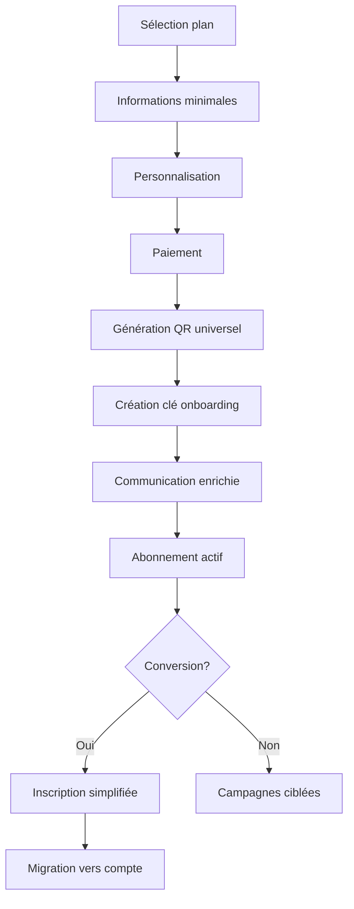
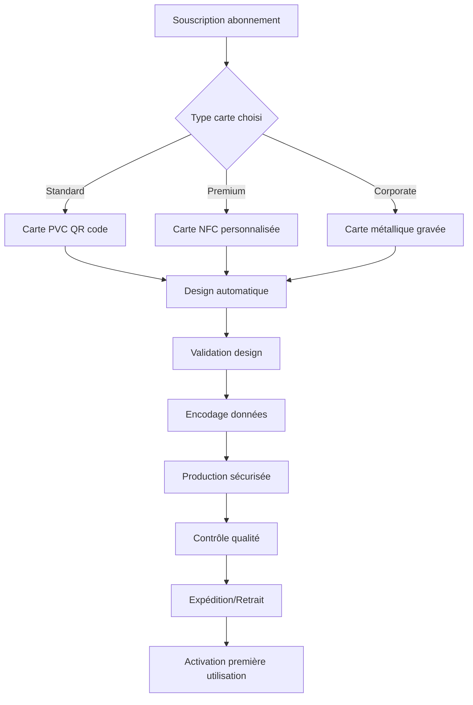
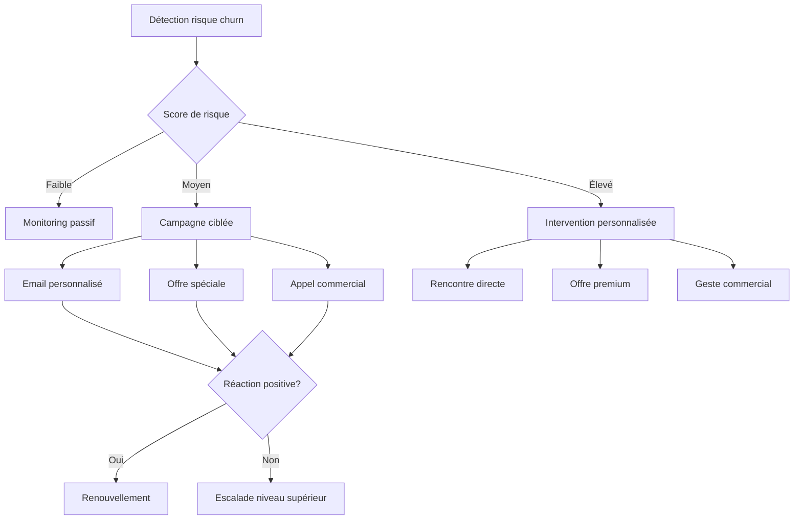

# Processus Business Entrix V3.0
## Groupe Fonctionnel : Système d'abonnements flexibles

---

## 📋 Vue d'ensemble

Ce groupe fonctionnel révolutionne la gestion des abonnements avec un **système ultra-flexible** supportant les **abonnements anonymes**, les **plans multi-événements intelligents**, et les **QR codes universels**. Il constitue l'innovation commerciale majeure d'Entrix V3.0 pour fidéliser et maximiser la valeur client.

### **Innovations V3.0**
- **🎪 Abonnements sans compte** : Souscription anonyme avec onboarding intelligent
- **🎫 QR codes universels** : Un code pour accéder à tous les événements du plan
- **📅 Plans dynamiques** : Configuration flexible par organisateur
- **💳 Cartes physiques** : Support cartes d'abonnement tangibles
- **🔄 Renouvellement intelligent** : Automatisation avec optimisation tarifaire

---

## 🎪 Types d'abonnements supportés

### **Abonnements sportifs**

**🏆 Cartes de supporters**
- **Pass saison complète** : Tous les matchs à domicile
- **Pack derby** : Uniquement les grands matchs (CA vs EST, etc.)
- **Abonnement famille** : Tarifs dégressifs + zone famille
- **Corporate box** : Loges entreprises avec services

**⚽ Configuration type Club Africain** :
```json
{
  "plan_config": {
    "name": "Carte Supporter CA Saison 2025",
    "type": "SEASON_PASS",
    "organizer_id": "club_africain",
    "duration_type": "SEASONAL",
    "duration_value": 12, // mois
    
    "pricing": {
      "base_price": 350.00,
      "early_bird_price": 280.00,
      "early_bird_until": "2024-12-31",
      "renewal_price": 315.00,
      "family_discount": 25, // %
      "student_discount": 40 // %
    },
    
    "events_included": {
      "home_matches": "all",
      "away_matches": "none",
      "cup_matches": "home_only",
      "friendly_matches": "excluded"
    },
    
    "zones_access": {
      "tribune_est": {"included": true, "premium_seats": false},
      "tribune_presidentielle": {"included": false, "upgrade_cost": 50.00},
      "virage_nord": {"included": true, "priority_booking": true}
    },
    
    "benefits": {
      "merchandising_discount": 15,
      "parking_included": true,
      "early_booking": "48_hours",
      "member_events": true,
      "stadium_tours": true
    }
  }
}
```

### **Abonnements culturels**

**🎭 Pass festivals et spectacles**
- **Abonnement théâtre** : Saison complète lieu culturel
- **Festival pass** : Accès multi-festivals dans l'année
- **Pass étudiant culture** : Tarifs préférentiels jeunes
- **Mécénat culturel** : Abonnement avec avantages exclusifs

**🎵 Configuration Festival International de Carthage** :
```json
{
  "festival_pass_config": {
    "name": "Pass Festival Carthage 2025",
    "type": "FESTIVAL_UNLIMITED",
    "organizer_id": "festival_carthage",
    
    "event_selection": {
      "all_concerts": true,
      "theater_shows": true,
      "dance_performances": true,
      "masterclasses": "priority_booking",
      "vip_events": false
    },
    
    "tier_system": {
      "silver": {
        "price": 150.00,
        "events_limit": 8,
        "zones": ["standard", "balcon"]
      },
      "gold": {
        "price": 250.00,
        "events_limit": "unlimited",
        "zones": ["all_zones"],
        "vip_privileges": true
      },
      "platinum": {
        "price": 500.00,
        "events_limit": "unlimited",
        "zones": ["all_zones"],
        "meet_and_greet": true,
        "backstage_access": true
      }
    }
  }
}
```

### **Abonnements business**

**🏢 Forfaits corporate**
- **Pass conférences annuel** : Tous événements business
- **Abonnement networking** : Événements + afterwork exclusifs
- **Formation continue** : Séminaires et workshops
- **Membership premium** : Accès espaces coworking + événements

---

## 🔄 Processus de souscription

### **Souscription anonyme avec onboarding**



### **Étape 1 : Sélection et configuration**

**Interface de souscription intelligente** :
```json
{
  "subscription_flow": {
    "plan_selection": {
      "comparison_table": "Fonctionnalités côte à côte",
      "price_calculator": "Simulation économies vs billets unitaires",
      "testimonials": "Avis abonnés existants",
      "faq_contextual": "Questions fréquentes par plan"
    },
    
    "customization": {
      "zone_preference": "Choix zone principale",
      "companion_options": "Ajout accompagnateurs",
      "payment_schedule": "Mensuel/trimestriel/annuel",
      "auto_renewal": "Reconduction automatique",
      "communication_prefs": "Fréquence notifications"
    },
    
    "anonymous_info": {
      "required": ["name", "email", "phone"],
      "optional": ["birthday", "preferences", "dietary_restrictions"],
      "marketing_consent": "Opt-in explicite",
      "privacy_notice": "Transparent et accessible"
    }
  }
}
```

### **Étape 2 : Génération QR universel et onboarding**

**Création d'un QR code multi-événements** :
```sql
-- Génération abonnement avec QR universel
CREATE OR REPLACE FUNCTION create_anonymous_subscription(
    p_plan_id UUID,
    p_guest_name VARCHAR(255),
    p_guest_email VARCHAR(255),
    p_guest_phone VARCHAR(20),
    p_payment_amount DECIMAL,
    p_customization JSONB DEFAULT '{}'::jsonb
) RETURNS TABLE(
    subscription_id UUID,
    universal_qr_code VARCHAR(255),
    onboarding_key VARCHAR(50),
    access_rights_created INTEGER
) AS $$
DECLARE
    v_subscription_id UUID;
    v_qr_code VARCHAR(255);
    v_onboarding_key VARCHAR(50);
    v_plan RECORD;
    v_access_rights_count INTEGER := 0;
    v_event RECORD;
BEGIN
    -- Récupération plan
    SELECT * INTO v_plan
    FROM subscription_plans sp
    WHERE sp.id = p_plan_id AND sp.is_active = TRUE;
    
    IF NOT FOUND THEN
        RAISE EXCEPTION 'Plan d''abonnement non trouvé ou inactif';
    END IF;
    
    -- Génération identifiants uniques
    v_subscription_id := gen_random_uuid();
    v_qr_code := 'SUB_' || TO_CHAR(NOW(), 'YYYYMM') || '_' || 
                 upper(encode(gen_random_bytes(12), 'hex'));
    v_onboarding_key := 'ONB_SUB_' || TO_CHAR(NOW(), 'YYYYMM') || '_' || 
                       upper(encode(gen_random_bytes(8), 'hex'));
    
    -- Création abonnement anonyme
    INSERT INTO subscriptions (
        id, plan_id, user_id, guest_name, guest_email, guest_phone,
        qr_code, status, customization_settings,
        metadata, created_at
    ) VALUES (
        v_subscription_id, p_plan_id, NULL, -- user_id NULL = anonyme
        p_guest_name, p_guest_email, p_guest_phone,
        v_qr_code, 'ACTIVE', p_customization,
        generate_subscription_onboarding_metadata(
            v_onboarding_key, p_payment_amount, v_plan.category
        ),
        NOW()
    );
    
    -- Création droit d'accès universel principal
    INSERT INTO access_rights (
        qr_code, subscription_id, subscription_plan_id,
        organizer_id, access_type, status,
        valid_from, valid_until, max_uses,
        benefits, metadata
    ) VALUES (
        v_qr_code, v_subscription_id, p_plan_id,
        v_plan.organizer_id, 'SUBSCRIPTION', 'ACTIVE',
        v_plan.valid_from, v_plan.valid_until, 999999, -- Usage "illimité"
        v_plan.benefits,
        jsonb_build_object(
            'subscription_type', v_plan.type,
            'universal_access', true,
            'plan_name', v_plan.name
        )
    );
    
    v_access_rights_count := v_access_rights_count + 1;
    
    -- Création droits d'accès pour événements spécifiques inclus
    FOR v_event IN 
        SELECT e.* 
        FROM subscription_plan_events spe
        JOIN events e ON spe.event_id = e.id
        WHERE spe.subscription_plan_id = p_plan_id
          AND spe.is_included = TRUE
          AND e.scheduled_start > NOW()
    LOOP
        INSERT INTO access_rights (
            qr_code, subscription_id, event_id,
            organizer_id, access_type, status,
            valid_from, valid_until, max_uses
        ) VALUES (
            v_qr_code, v_subscription_id, v_event.id,
            v_plan.organizer_id, 'SUBSCRIPTION', 'ACTIVE',
            GREATEST(NOW(), v_event.scheduled_start - INTERVAL '2 hours'),
            v_event.scheduled_end + INTERVAL '1 hour',
            1 -- Une entrée par événement
        );
        
        v_access_rights_count := v_access_rights_count + 1;
    END LOOP;
    
    RETURN QUERY SELECT 
        v_subscription_id, v_qr_code, v_onboarding_key, v_access_rights_count;
END;
$$ LANGUAGE plpgsql;
```

### **Étape 3 : Communication onboarding premium**

**Email de bienvenue enrichi** :
```html
<!DOCTYPE html>
<html>
<head>
    <meta charset="UTF-8">
    <title>🎪 Bienvenue dans la famille des abonnés !</title>
</head>
<body>
    <div style="max-width: 600px; margin: 0 auto; font-family: Arial, sans-serif;">
        <!-- Header premium -->
        <div style="background: linear-gradient(135deg, #667eea 0%, #764ba2 100%); padding: 30px; text-align: center;">
            <h1 style="color: white; margin: 0; font-size: 28px;">🎪 Bienvenue Ahmed !</h1>
            <p style="color: white; margin: 10px 0 0 0; font-size: 18px;">
                Votre Pass Festival Carthage 2025 est activé
            </p>
        </div>
        
        <!-- QR Code universel -->
        <div style="background: #f8f9fa; padding: 25px; text-align: center;">
            <h2 style="margin: 0 0 15px 0; color: #333;">Votre code d'accès universel</h2>
            <div style="background: white; padding: 20px; border-radius: 10px; display: inline-block;">
                
                <br>
                <strong style="color: #667eea; font-size: 16px;">SUB_202502_ABC123DEF456</strong>
            </div>
            <p style="margin: 15px 0 0 0; color: #666; font-size: 14px;">
                ⚡ <strong>Un seul code pour TOUS vos événements !</strong>
            </p>
        </div>
        
        <!-- Avantages exclusifs -->
        <div style="padding: 25px; background: white;">
            <h3 style="color: #333; margin: 0 0 20px 0;">🎁 Vos avantages exclusifs</h3>
            <div style="display: grid; gap: 15px;">
                <div style="background: #e8f4f8; padding: 15px; border-radius: 8px; border-left: 4px solid #17a2b8;">
                    <strong>🎭 Accès illimité</strong><br>
                    <span style="color: #666;">Tous les spectacles du festival (15+ événements)</span>
                </div>
                <div style="background: #fff3cd; padding: 15px; border-radius: 8px; border-left: 4px solid #ffc107;">
                    <strong>⭐ Réservations prioritaires</strong><br>
                    <span style="color: #666;">48h avant ouverture au public</span>
                </div>
                <div style="background: #d1ecf1; padding: 15px; border-radius: 8px; border-left: 4px solid #bee5eb;">
                    <strong>🍽️ Restauration VIP</strong><br>
                    <span style="color: #666;">20% de réduction + accès lounge</span>
                </div>
            </div>
        </div>
        
        <!-- Call-to-action onboarding -->
        <div style="background: linear-gradient(45deg, #ff6b6b, #feca57); padding: 25px; margin: 20px 0;">
            <h3 style="color: white; margin: 0 0 15px 0; text-align: center;">
                🚀 Maximisez votre expérience !
            </h3>
            <p style="color: white; margin: 0 0 20px 0; text-align: center;">
                Créez votre compte en 30 secondes et débloquez :
            </p>
            <ul style="color: white; margin: 0 0 20px 0;">
                <li>✅ <strong>Calendrier personnalisé</strong> des événements</li>
                <li>✅ <strong>Notifications rappels</strong> avant chaque spectacle</li>
                <li>✅ <strong>Historique et photos</strong> de tous vos événements</li>
                <li>✅ <strong>Invitations exclusives</strong> aux répétitions</li>
                <li>✅ <strong>Rencontres artistes</strong> en backstage</li>
            </ul>
            
            <div style="text-align: center;">
                <a href="https://entrix.tn/onboard/ONB_SUB_202502_XYZ789" 
                   style="background: white; color: #ff6b6b; padding: 15px 40px; 
                          text-decoration: none; border-radius: 25px; display: inline-block;
                          font-weight: bold; font-size: 16px;">
                    🎭 ACTIVER MON ESPACE MEMBRE
                </a>
            </div>
            
            <p style="color: white; font-size: 12px; text-align: center; margin: 15px 0 0 0;">
                Code d'activation: ONB_SUB_202502_XYZ789 | Valable jusqu'au 31 Dec 2025
            </p>
        </div>
        
        <!-- Programme des événements -->
        <div style="padding: 25px; background: #f8f9fa;">
            <h3 style="margin: 0 0 20px 0; color: #333;">📅 Vos prochains événements</h3>
            <div style="space-y: 10px;">
                <div style="background: white; padding: 15px; border-radius: 8px; margin-bottom: 10px;">
                    <strong style="color: #667eea;">15 Mars 2025 - 20h30</strong><br>
                    <span style="color: #333;">Concert Latifa - Amphithéâtre</span><br>
                    <small style="color: #666;">Votre QR code donne accès automatiquement</small>
                </div>
                <div style="background: white; padding: 15px; border-radius: 8px; margin-bottom: 10px;">
                    <strong style="color: #667eea;">22 Mars 2025 - 19h00</strong><br>
                    <span style="color: #333;">Théâtre - Les Femmes Savantes</span><br>
                    <small style="color: #666;">Réservation de siège requise</small>
                </div>
            </div>
            
            <div style="text-align: center; margin-top: 20px;">
                <a href="https://entrix.tn/festival-carthage-programme" 
                   style="color: #667eea; text-decoration: none; font-weight: bold;">
                    📅 Voir le programme complet →
                </a>
            </div>
        </div>
        
        <!-- Instructions pratiques -->
        <div style="padding: 25px; background: white;">
            <h3 style="margin: 0 0 15px 0; color: #333;">💡 Comment utiliser votre abonnement</h3>
            <ol style="color: #666; line-height: 1.6;">
                <li><strong>Présentez votre QR code</strong> à l'entrée de chaque événement</li>
                <li><strong>Réservez vos places</strong> pour les spectacles à places numérotées</li>
                <li><strong>Arrivez 30 min avant</strong> pour profiter des services VIP</li>
                <li><strong>Téléchargez l'app Entrix</strong> pour gérer votre abonnement</li>
            </ol>
        </div>
        
        <!-- Footer -->
        <div style="background: #333; color: white; padding: 20px; text-align: center;">
            <p style="margin: 0;">Questions ? WhatsApp : +216 70 123 456 | Email : vip@entrix.tn</p>
            <p style="margin: 10px 0 0 0; font-size: 12px; color: #999;">
                Festival International de Carthage 2025 | Entrix Platform
            </p>
        </div>
    </div>
</body>
</html>
```

---

## 📱 Gestion des abonnements actifs

### **Interface abonné (sans compte)**

**Portail anonyme personnalisé** :
```json
{
  "anonymous_portal": {
    "access_method": "QR code + email ou phone",
    "features": {
      "my_subscription": {
        "plan_details": "Nom, durée, événements inclus",
        "qr_code_display": "Code toujours accessible",
        "usage_history": "Événements fréquentés",
        "benefits_status": "Avantages utilisés/restants"
      },
      "events_calendar": {
        "upcoming_events": "Prochains événements inclus",
        "booking_required": "Événements nécessitant réservation",
        "recommendations": "Suggestions basées sur préférences",
        "add_to_calendar": "Export vers calendrier personnel"
      },
      "quick_actions": {
        "book_seats": "Réservation places numérotées",
        "invite_friends": "Partage événements (avec commission)",
        "contact_support": "Chat ou téléphone",
        "upgrade_account": "Création compte avec incentives"
      }
    }
  }
}
```

### **Réservations prioritaires pour abonnés**

**Système de fenêtres de réservation** :
```sql
-- Gestion réservations prioritaires abonnés
CREATE OR REPLACE FUNCTION create_priority_booking(
    p_subscription_id UUID,
    p_event_id UUID,
    p_zone_id VARCHAR(255),
    p_seat_ids UUID[] DEFAULT NULL,
    p_quantity INTEGER DEFAULT 1
) RETURNS TABLE(
    booking_id UUID,
    seats_reserved UUID[],
    expires_at TIMESTAMPTZ,
    total_additional_cost DECIMAL
) AS $$
DECLARE
    v_subscription RECORD;
    v_plan_event RECORD;
    v_booking_id UUID;
    v_additional_cost DECIMAL := 0;
    v_seat_ids UUID[];
BEGIN
    -- Vérification abonnement et droits
    SELECT s.*, sp.name as plan_name INTO v_subscription
    FROM subscriptions s
    JOIN subscription_plans sp ON s.plan_id = sp.id
    WHERE s.id = p_subscription_id 
      AND s.status = 'ACTIVE';
    
    IF NOT FOUND THEN
        RAISE EXCEPTION 'Abonnement non trouvé ou inactif';
    END IF;
    
    -- Vérification inclusion événement dans plan
    SELECT * INTO v_plan_event
    FROM subscription_plan_events spe
    WHERE spe.subscription_plan_id = v_subscription.plan_id
      AND spe.event_id = p_event_id
      AND spe.is_included = TRUE;
    
    IF NOT FOUND THEN
        RAISE EXCEPTION 'Événement non inclus dans le plan d''abonnement';
    END IF;
    
    -- Vérification fenêtre de réservation prioritaire
    IF v_plan_event.booking_window_start IS NOT NULL 
       AND NOW() < v_plan_event.booking_window_start THEN
        RAISE EXCEPTION 'Fenêtre de réservation pas encore ouverte';
    END IF;
    
    -- Calcul coût additionnel si applicable
    IF v_plan_event.additional_cost > 0 THEN
        v_additional_cost := v_plan_event.additional_cost * p_quantity;
    END IF;
    
    -- Attribution des sièges
    IF p_seat_ids IS NOT NULL THEN
        -- Sièges spécifiés
        v_seat_ids := p_seat_ids;
    ELSE
        -- Attribution automatique des meilleurs sièges disponibles
        SELECT array_agg(s.id) INTO v_seat_ids
        FROM seats s
        WHERE s.zone_id = p_zone_id
          AND s.status = 'AVAILABLE'
          AND NOT EXISTS (
              SELECT 1 FROM seat_reservations sr
              WHERE sr.seat_ids @> ARRAY[s.id]
                AND sr.expires_at > NOW()
          )
        ORDER BY s.quality_score DESC, s.row_number ASC, s.seat_number ASC
        LIMIT p_quantity;
        
        IF array_length(v_seat_ids, 1) < p_quantity THEN
            RAISE EXCEPTION 'Pas assez de sièges disponibles dans cette zone';
        END IF;
    END IF;
    
    -- Création réservation prioritaire
    v_booking_id := gen_random_uuid();
    
    INSERT INTO priority_bookings (
        id, subscription_id, event_id, zone_id,
        seat_ids, quantity, additional_cost,
        expires_at, status, created_at
    ) VALUES (
        v_booking_id, p_subscription_id, p_event_id, p_zone_id,
        v_seat_ids, p_quantity, v_additional_cost,
        NOW() + INTERVAL '2 hours', -- 2h pour confirmer
        'PENDING_CONFIRMATION', NOW()
    );
    
    -- Blocage temporaire des sièges
    INSERT INTO seat_reservations (
        booking_id, event_id, zone_id, seat_ids,
        expires_at, reservation_type
    ) VALUES (
        v_booking_id, p_event_id, p_zone_id, v_seat_ids,
        NOW() + INTERVAL '2 hours', 'PRIORITY_BOOKING'
    );
    
    RETURN QUERY SELECT 
        v_booking_id, v_seat_ids, 
        NOW() + INTERVAL '2 hours', v_additional_cost;
END;
$$ LANGUAGE plpgsql;
```

---

## 💳 Cartes physiques d'abonnement

### **Types de cartes produites**

**🎯 Technologies supportées** :
- **Cartes magnétiques** : Bande magnétique avec données
- **Cartes à puce contact** : Chip EMV sécurisé
- **Cartes NFC** : Sans contact 13.56 MHz
- **Cartes hybrides** : NFC + QR code imprimé

### **Processus de production**

**Workflow création carte physique** :


**Données encodées sur puce NFC** :
```json
{
  "nfc_card_data": {
    "header": {
      "card_type": "ENTRIX_SUBSCRIPTION",
      "version": "3.0",
      "encryption": "AES256"
    },
    "subscription_info": {
      "subscription_id": "sub_123456789",
      "plan_code": "CA_SEASON_2025",
      "holder_name": "AHMED BEN SALAH",
      "card_number": "CA25 0001 2345 6789",
      "issue_date": "2025-01-15",
      "expiry_date": "2025-12-31"
    },
    "access_rights": {
      "venues": ["stade_rades", "stade_menzah", "centre_entrainement"],
      "zones": {
        "tribune_est": {"access": true, "priority": "high"},
        "tribune_presidentielle": {"access": false, "upgrade_available": true},
        "vip_lounge": {"access": true, "companion_allowed": 1}
      },
      "events_remaining": 15,
      "special_access": ["vip_parking", "fast_track", "member_store"]
    },
    "security": {
      "pin_required": false,
      "biometric_enrolled": false,
      "tamper_detection": true,
      "last_used": "2025-01-20T15:30:00Z"
    }
  }
}
```

### **Personnalisation cartes premium**

**Options de personnalisation** :
- **Photo du porteur** : Impression haute définition
- **Design club/événement** : Couleurs et logos officiels
- **Finitions spéciales** : Dorure, relief, hologramme
- **Numérotation** : Série limitée ou numéro de membre
- **QR code visible** : Fallback si NFC défaillant

**Template design Club Africain** :
```css
/* Design carte supporter CA */
.card-design {
    width: 85.6mm;
    height: 53.98mm;
    background: linear-gradient(135deg, #C41E3A 0%, #FFD700 100%);
    border-radius: 8px;
    position: relative;
    overflow: hidden;
}

.card-header {
    background: rgba(0,0,0,0.8);
    color: white;
    padding: 8px;
    font-size: 12px;
    font-weight: bold;
    text-align: center;
}

.logo-club {
    position: absolute;
    top: 20px;
    left: 15px;
    width: 40px;
    height: 40px;
    opacity: 0.9;
}

.holder-info {
    position: absolute;
    bottom: 25px;
    left: 15px;
    color: white;
    font-size: 11px;
}

.card-number {
    position: absolute;
    bottom: 8px;
    left: 15px;
    color: white;
    font-size: 10px;
    font-family: monospace;
}

.qr-code {
    position: absolute;
    top: 15px;
    right: 15px;
    width: 35px;
    height: 35px;
    background: white;
    padding: 2px;
    border-radius: 4px;
}

.validity {
    position: absolute;
    bottom: 8px;
    right: 15px;
    color: white;
    font-size: 9px;
}
```

---

## 🔄 Renouvellement et fidélisation

### **Renouvellement automatique intelligent**

**Système de reconduction optimisée** :
```sql
-- Processus de renouvellement automatique
CREATE OR REPLACE FUNCTION process_auto_renewal(
    p_subscription_id UUID,
    p_renewal_date DATE DEFAULT NULL
) RETURNS TABLE(
    success BOOLEAN,
    new_subscription_id UUID,
    renewal_price DECIMAL,
    loyalty_bonus JSONB,
    error_message TEXT
) AS $$
DECLARE
    v_subscription RECORD;
    v_plan RECORD;
    v_loyalty_years INTEGER;
    v_renewal_price DECIMAL;
    v_new_subscription_id UUID;
    v_loyalty_bonus JSONB;
    v_payment_method RECORD;
BEGIN
    -- Récupération abonnement actuel
    SELECT s.*, sp.* INTO v_subscription, v_plan
    FROM subscriptions s
    JOIN subscription_plans sp ON s.plan_id = sp.id
    WHERE s.id = p_subscription_id
      AND s.status = 'ACTIVE';
    
    IF NOT FOUND THEN
        RETURN QUERY SELECT FALSE, NULL::UUID, 0::DECIMAL, 
                           NULL::JSONB, 'Abonnement non trouvé';
        RETURN;
    END IF;
    
    -- Calcul ancienneté et bonus fidélité
    SELECT COUNT(*) INTO v_loyalty_years
    FROM subscriptions
    WHERE (user_id = v_subscription.user_id OR 
           (user_id IS NULL AND guest_email = v_subscription.guest_email))
      AND plan_id = v_subscription.plan_id
      AND status IN ('COMPLETED', 'ACTIVE');
    
    -- Calcul prix de renouvellement avec bonus fidélité
    v_renewal_price := COALESCE(v_plan.renewal_price, v_plan.price);
    
    -- Bonus fidélité progressif
    CASE 
        WHEN v_loyalty_years >= 5 THEN
            v_renewal_price := v_renewal_price * 0.80; -- 20% de remise
            v_loyalty_bonus := jsonb_build_object(
                'type', 'LOYALTY_DISCOUNT',
                'years', v_loyalty_years,
                'discount_percent', 20,
                'bonus_gifts', ARRAY['vip_parking_year', 'member_merchandise']
            );
        WHEN v_loyalty_years >= 3 THEN
            v_renewal_price := v_renewal_price * 0.85; -- 15% de remise
            v_loyalty_bonus := jsonb_build_object(
                'type', 'LOYALTY_DISCOUNT',
                'years', v_loyalty_years,
                'discount_percent', 15,
                'bonus_gifts', ARRAY['priority_customer_service']
            );
        WHEN v_loyalty_years >= 2 THEN
            v_renewal_price := v_renewal_price * 0.90; -- 10% de remise
            v_loyalty_bonus := jsonb_build_object(
                'type', 'LOYALTY_DISCOUNT',
                'years', v_loyalty_years,
                'discount_percent', 10
            );
        ELSE
            v_loyalty_bonus := jsonb_build_object(
                'type', 'WELCOME_BACK',
                'message', 'Merci de renouveler votre confiance'
            );
    END CASE;
    
    -- Vérification méthode de paiement enregistrée
    SELECT * INTO v_payment_method
    FROM saved_payment_methods spm
    WHERE spm.subscription_id = p_subscription_id
      AND spm.is_active = TRUE
      AND spm.auto_renewal_enabled = TRUE;
    
    IF NOT FOUND THEN
        -- Pas de paiement automatique configuré - demander action utilisateur
        PERFORM send_renewal_notification(
            p_subscription_id, 
            v_renewal_price, 
            'PAYMENT_METHOD_REQUIRED'
        );
        
        RETURN QUERY SELECT FALSE, NULL::UUID, v_renewal_price,
                           v_loyalty_bonus, 'Méthode de paiement requise';
        RETURN;
    END IF;
    
    -- Traitement paiement automatique
    BEGIN
        -- Tentative de paiement
        PERFORM process_auto_payment(
            v_payment_method.id,
            v_renewal_price,
            'Renouvellement abonnement ' || v_plan.name
        );
        
        -- Création nouvel abonnement
        v_new_subscription_id := gen_random_uuid();
        
        INSERT INTO subscriptions (
            id, plan_id, user_id, guest_name, guest_email, guest_phone,
            qr_code, status, predecessor_subscription_id,
            loyalty_years, renewal_discount_applied,
            metadata, created_at
        ) VALUES (
            v_new_subscription_id, v_subscription.plan_id,
            v_subscription.user_id, v_subscription.guest_name,
            v_subscription.guest_email, v_subscription.guest_phone,
            generate_new_qr_code(), 'ACTIVE', p_subscription_id,
            v_loyalty_years, 
            CASE WHEN v_loyalty_years >= 2 THEN 
                (100 - (v_renewal_price / v_plan.price * 100))::INTEGER 
            ELSE 0 END,
            jsonb_build_object(
                'renewal_date', COALESCE(p_renewal_date, CURRENT_DATE),
                'loyalty_bonus', v_loyalty_bonus,
                'auto_renewed', true
            ),
            NOW()
        );
        
        -- Mise à jour ancien abonnement
        UPDATE subscriptions 
        SET status = 'COMPLETED',
            successor_subscription_id = v_new_subscription_id,
            completed_at = NOW()
        WHERE id = p_subscription_id;
        
        -- Notification renouvellement réussi
        PERFORM send_renewal_success_notification(
            v_new_subscription_id,
            v_loyalty_bonus
        );
        
        RETURN QUERY SELECT TRUE, v_new_subscription_id, v_renewal_price,
                           v_loyalty_bonus, 'Renouvellement réussi'::TEXT;
                           
    EXCEPTION WHEN OTHERS THEN
        -- Échec paiement - notification utilisateur
        PERFORM send_renewal_payment_failed_notification(
            p_subscription_id,
            SQLERRM
        );
        
        RETURN QUERY SELECT FALSE, NULL::UUID, v_renewal_price,
                           v_loyalty_bonus, 'Échec paiement: ' || SQLERRM;
    END;
END;
$$ LANGUAGE plpgsql;
```

### **Campagnes de rétention**

**Workflow anti-churn intelligent** :


**Algorithme de détection churn** :
```sql
-- Scoring risque d'abandon abonné
CREATE OR REPLACE VIEW subscription_churn_risk AS
WITH subscription_metrics AS (
    SELECT 
        s.id,
        s.plan_id,
        s.user_id,
        s.guest_email,
        
        -- Métriques d'usage
        COUNT(acl.id) as total_uses_current_period,
        COUNT(acl.id) FILTER (WHERE acl.created_at > NOW() - INTERVAL '30 days') as uses_last_30_days,
        COUNT(acl.id) FILTER (WHERE acl.created_at > NOW() - INTERVAL '7 days') as uses_last_7_days,
        
        -- Engagement digital
        COALESCE(
            (SELECT COUNT(*) FROM user_app_sessions 
             WHERE user_id = s.user_id AND created_at > NOW() - INTERVAL '30 days'), 0
        ) as app_sessions_last_30_days,
        
        -- Données comportementales
        (s.metadata->>'engagement_score')::DECIMAL as engagement_score,
        date_part('days', s.valid_until - NOW()) as days_until_expiry,
        
        -- Historique service client
        COUNT(st.id) as support_tickets_count,
        COUNT(st.id) FILTER (WHERE st.satisfaction_rating <= 2) as negative_feedback_count
        
    FROM subscriptions s
    LEFT JOIN access_control_log acl ON s.qr_code = acl.qr_code
    LEFT JOIN support_tickets st ON (s.user_id = st.user_id OR s.guest_email = st.guest_email)
    WHERE s.status = 'ACTIVE'
      AND s.valid_until > NOW()
    GROUP BY s.id, s.plan_id, s.user_id, s.guest_email, s.metadata, s.valid_until
)
SELECT 
    *,
    -- Calcul score de risque (0-100, 100 = risque maximum)
    (
        -- Facteur usage faible
        CASE 
            WHEN uses_last_30_days = 0 THEN 30
            WHEN uses_last_30_days <= total_uses_current_period * 0.2 THEN 20
            ELSE 0
        END +
        
        -- Facteur engagement app faible
        CASE 
            WHEN app_sessions_last_30_days = 0 THEN 15
            WHEN app_sessions_last_30_days <= 2 THEN 10
            ELSE 0
        END +
        
        -- Facteur proche expiration sans renouvellement
        CASE 
            WHEN days_until_expiry <= 7 THEN 25
            WHEN days_until_expiry <= 30 THEN 15
            ELSE 0
        END +
        
        -- Facteur support client négatif
        CASE 
            WHEN negative_feedback_count > 0 THEN 20
            WHEN support_tickets_count > 3 THEN 10
            ELSE 0
        END +
        
        -- Facteur engagement score faible
        CASE 
            WHEN engagement_score < 30 THEN 10
            WHEN engagement_score < 50 THEN 5
            ELSE 0
        END
    ) as churn_risk_score,
    
    -- Classification risque
    CASE 
        WHEN (uses_last_30_days = 0 AND days_until_expiry <= 30) OR
             (negative_feedback_count > 0 AND days_until_expiry <= 30) THEN 'HIGH'
        WHEN uses_last_30_days <= total_uses_current_period * 0.3 OR
             days_until_expiry <= 30 THEN 'MEDIUM'
        ELSE 'LOW'
    END as churn_risk_level

FROM subscription_metrics;
```

---

## 📊 Analytics abonnements

### **KPIs performance abonnements**

**Métriques clés suivies** :
```sql
-- Dashboard performance abonnements
CREATE OR REPLACE VIEW subscription_performance_dashboard AS
SELECT 
    -- Métriques globales
    COUNT(*) as total_active_subscriptions,
    COUNT(*) FILTER (WHERE user_id IS NULL) as anonymous_subscriptions,
    COUNT(*) FILTER (WHERE user_id IS NOT NULL) as registered_subscriptions,
    
    -- Revenus
    SUM(price_paid) as total_revenue_current_period,
    AVG(price_paid) as average_subscription_value,
    
    -- Conversion et rétention
    COUNT(*) FILTER (WHERE metadata->>'auto_renewed' = 'true') as auto_renewals,
    COUNT(*) FILTER (WHERE loyalty_years >= 2) as loyal_subscribers,
    
    -- Engagement
    AVG((metadata->>'engagement_score')::DECIMAL) as avg_engagement_score,
    COUNT(*) FILTER (WHERE 
        (SELECT COUNT(*) FROM access_control_log acl 
         WHERE acl.qr_code = s.qr_code 
           AND acl.created_at > NOW() - INTERVAL '30 days') > 0
    ) as active_users_last_30_days,
    
    -- Performance par plan
    (SELECT json_agg(json_build_object(
        'plan_name', sp.name,
        'subscribers_count', COUNT(s.*),
        'revenue', SUM(s.price_paid),
        'renewal_rate', 
            COUNT(*) FILTER (WHERE s.metadata->>'auto_renewed' = 'true')::DECIMAL / 
            NULLIF(COUNT(*), 0) * 100
    ))
     FROM subscriptions s2
     JOIN subscription_plans sp ON s2.plan_id = sp.id
     WHERE s2.status = 'ACTIVE'
     GROUP BY sp.id, sp.name) as performance_by_plan,
     
    -- Churn analysis
    COUNT(*) FILTER (WHERE 
        (SELECT churn_risk_level FROM subscription_churn_risk scr 
         WHERE scr.id = s.id) = 'HIGH'
    ) as high_churn_risk_count

FROM subscriptions s
WHERE s.status = 'ACTIVE';
```

---

Cette documentation couvre l'ensemble du système d'abonnements flexibles d'Entrix V3.0, depuis la souscription anonyme jusqu'aux mécanismes avancés de fidélisation, en passant par les cartes physiques et le renouvellement intelligent.