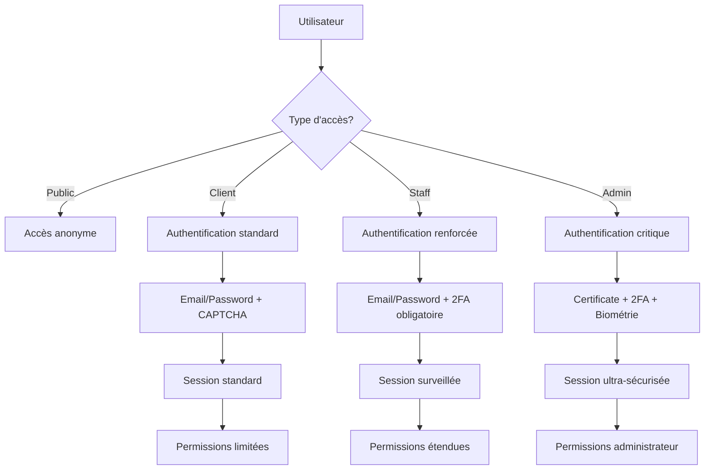

# Processus Business Entrix V3.0
## Groupe Fonctionnel : Administration et Sécurité

---

## 📋 Vue d'ensemble

Ce groupe fonctionnel constitue le **pilier sécuritaire et administratif** d'Entrix V3.0, assurant la **protection maximale**, la **gouvernance stricte** et la **conformité réglementaire** de toutes les opérations de la plateforme. Il implémente une **architecture de sécurité de classe entreprise** avec **défense en profondeur** et **résilience avancée**.

### **Innovations V3.0**
- **🛡️ Zero Trust Architecture** : Vérification continue de tous les accès
- **🤖 IA de détection menaces** : Machine learning pour cybersécurité proactive
- **🔐 Chiffrement quantique-resistant** : Cryptographie future-proof
- **📊 SIEM intégré** : Corrélation d'événements temps réel
- **🌍 Conformité globale** : GDPR, CCPA, SOX, PCI DSS Level 1

### **Architecture sécuritaire**
- **Périmètre renforcé** : WAF, DDoS protection, VPN d'accès
- **Identité centralisée** : SSO, MFA, gestion privilèges
- **Données protégées** : Chiffrement bout-en-bout, HSM
- **Monitoring continu** : SIEM, SOAR, threat intelligence
- **Réponse incidents** : Playbooks automatisés, forensics

---

## 🔐 Gestion des identités et accès (IAM)

### **Architecture d'authentification multicouche**



### **Processus d'authentification adaptative**

**Algorithme de scoring de risque** :
```sql
-- Calcul score de risque authentification
CREATE OR REPLACE FUNCTION calculate_auth_risk_score(
    p_user_id UUID,
    p_ip_address INET,
    p_user_agent TEXT,
    p_device_fingerprint TEXT
) RETURNS INTEGER AS $$
DECLARE
    v_risk_score INTEGER := 0;
    v_user_profile RECORD;
    v_geo_info RECORD;
    v_device_info RECORD;
BEGIN
    -- Profil utilisateur de référence
    SELECT 
        usual_ip_range,
        usual_user_agents,
        usual_login_hours,
        last_login_at,
        failed_attempts_24h,
        account_status
    INTO v_user_profile
    FROM user_security_profiles 
    WHERE user_id = p_user_id;
    
    -- Analyse géolocalisation
    SELECT country, city, is_proxy, is_tor 
    INTO v_geo_info
    FROM ip_geolocation_cache 
    WHERE ip_address = p_ip_address;
    
    -- Analyse device fingerprint
    SELECT device_type, browser, os, is_mobile, risk_level
    INTO v_device_info
    FROM device_fingerprints 
    WHERE fingerprint_hash = MD5(p_device_fingerprint);
    
    -- Facteurs de risque additifs
    
    -- IP inhabituelle (+30 points)
    IF NOT (p_ip_address <<= ANY(v_user_profile.usual_ip_range)) THEN
        v_risk_score := v_risk_score + 30;
    END IF;
    
    -- Géolocalisation suspecte (+40 points)
    IF v_geo_info.is_proxy OR v_geo_info.is_tor THEN
        v_risk_score := v_risk_score + 40;
    END IF;
    
    -- User-Agent inhabituel (+20 points)
    IF p_user_agent NOT LIKE ANY(v_user_profile.usual_user_agents) THEN
        v_risk_score := v_risk_score + 20;
    END IF;
    
    -- Heure inhabituelle (+15 points)
    IF EXTRACT(hour FROM NOW()) NOT BETWEEN 
       (v_user_profile.usual_login_hours).start_hour AND 
       (v_user_profile.usual_login_hours).end_hour THEN
        v_risk_score := v_risk_score + 15;
    END IF;
    
    -- Tentatives échouées récentes (+25 points par tentative)
    v_risk_score := v_risk_score + (v_user_profile.failed_attempts_24h * 25);
    
    -- Device nouveau ou suspect (+35 points)
    IF v_device_info.fingerprint_hash IS NULL OR v_device_info.risk_level = 'HIGH' THEN
        v_risk_score := v_risk_score + 35;
    END IF;
    
    -- Vitesse de connexion anormale (brute force)
    IF (SELECT COUNT(*) FROM auth_attempts 
        WHERE ip_address = p_ip_address 
          AND created_at > NOW() - INTERVAL '5 minutes') > 10 THEN
        v_risk_score := v_risk_score + 50;
    END IF;
    
    -- Log du calcul pour audit
    INSERT INTO auth_risk_calculations (
        user_id, ip_address, risk_score, risk_factors,
        calculated_at
    ) VALUES (
        p_user_id, p_ip_address, v_risk_score,
        jsonb_build_object(
            'ip_unusual', NOT (p_ip_address <<= ANY(v_user_profile.usual_ip_range)),
            'geo_suspicious', (v_geo_info.is_proxy OR v_geo_info.is_tor),
            'useragent_unusual', p_user_agent NOT LIKE ANY(v_user_profile.usual_user_agents),
            'time_unusual', EXTRACT(hour FROM NOW()) NOT BETWEEN 
                (v_user_profile.usual_login_hours).start_hour AND 
                (v_user_profile.usual_login_hours).end_hour,
            'failed_attempts', v_user_profile.failed_attempts_24h,
            'device_new', v_device_info.fingerprint_hash IS NULL
        ),
        NOW()
    );
    
    RETURN LEAST(v_risk_score, 100); -- Cap à 100
END;
$$ LANGUAGE plpgsql;
```

### **Authentification multifacteur (MFA) adaptative**

**Workflow MFA intelligent** :
```sql
-- Déclenchement MFA adaptatif selon contexte
CREATE OR REPLACE FUNCTION require_mfa_check(
    p_user_id UUID,
    p_risk_score INTEGER,
    p_action_type VARCHAR(50),
    p_resource_sensitivity VARCHAR(20)
) RETURNS JSONB AS $$
DECLARE
    v_mfa_required BOOLEAN := FALSE;
    v_mfa_methods TEXT[];
    v_explanation TEXT;
BEGIN
    -- Règles MFA selon score de risque
    IF p_risk_score >= 60 THEN
        v_mfa_required := TRUE;
        v_explanation := 'Score de risque élevé (' || p_risk_score || ')';
    END IF;
    
    -- MFA obligatoire pour actions sensibles
    IF p_action_type IN ('ADMIN_ACCESS', 'PAYMENT_PROCESSING', 'DATA_EXPORT', 'USER_IMPERSONATION') THEN
        v_mfa_required := TRUE;
        v_explanation := 'Action sensible nécessitant confirmation';
    END IF;
    
    -- MFA selon sensibilité ressource
    IF p_resource_sensitivity IN ('CONFIDENTIAL', 'RESTRICTED') THEN
        v_mfa_required := TRUE;
        v_explanation := 'Ressource classifiée';
    END IF;
    
    -- Sélection méthodes MFA disponibles
    SELECT array_agg(method_type ORDER BY preference_order)
    INTO v_mfa_methods
    FROM user_mfa_methods
    WHERE user_id = p_user_id 
      AND is_active = TRUE
      AND is_verified = TRUE;
    
    -- Méthodes par défaut si aucune configurée
    IF array_length(v_mfa_methods, 1) IS NULL THEN
        v_mfa_methods := ARRAY['SMS_OTP'];
    END IF;
    
    -- Adaptation méthodes selon urgence
    IF p_risk_score >= 80 THEN
        -- Risque critique : forcer méthodes les plus sûres
        v_mfa_methods := array_intersect(v_mfa_methods, 
                                       ARRAY['TOTP_APP', 'HARDWARE_TOKEN', 'BIOMETRIC']);
        IF array_length(v_mfa_methods, 1) IS NULL THEN
            v_mfa_methods := ARRAY['TOTP_APP']; -- Fallback sécurisé
        END IF;
    END IF;
    
    RETURN jsonb_build_object(
        'mfa_required', v_mfa_required,
        'available_methods', v_mfa_methods,
        'explanation', v_explanation,
        'max_attempts', 3,
        'timeout_minutes', 10,
        'backup_codes_allowed', p_risk_score < 70
    );
END;
$$ LANGUAGE plpgsql;
```

---

## 🛡️ Protection périmétrrique avancée

### **Web Application Firewall (WAF) intelligent**

**Règles de protection adaptatives** :
```yaml
# Configuration WAF Entrix V3.0
waf_rules:
  # Protection OWASP Top 10
  sql_injection:
    enabled: true
    sensitivity: high
    block_threshold: 85
    patterns:
      - "(?i)(union|select|insert|delete|update|drop|create|alter|exec|execute)"
      - "(?i)(script|javascript|vbscript|onload|onerror)"
    custom_patterns:
      - "(?i)(information_schema|sys\\.tables|pg_catalog)"
  
  xss_protection:
    enabled: true
    sensitivity: high
    block_threshold: 80
    content_types: ["text/html", "application/json"]
    
  rate_limiting:
    # Différentiel selon endpoints
    endpoints:
      "/api/auth/login":
        window: "1 minute"
        max_requests: 5
        action: "block_ip_15min"
      
      "/api/orders/create":
        window: "1 minute"
        max_requests: 10
        action: "throttle"
      
      "/api/events/search":
        window: "1 minute"
        max_requests: 60
        action: "throttle"
    
    # Protection brute force globale
    global_limits:
      per_ip:
        window: "1 hour" 
        max_requests: 1000
        action: "captcha_challenge"
      
      per_user_agent:
        window: "1 minute"
        max_requests: 100
        action: "temporary_block"

  # Détection bot malveillant
  bot_protection:
    javascript_challenge: true
    behavioral_analysis: true
    machine_learning_scoring: true
    
    whitelist_user_agents:
      - "GoogleBot"
      - "BingBot"
      - "EntrixMobileApp/*"
    
    blacklist_patterns:
      - "python-requests"
      - "curl"
      - "wget"
      - "masscan"

  # Protection DDoS Layer 7
  ddos_protection:
    threshold_rps: 10000  # Requests per second
    mitigation_modes:
      - "javascript_challenge"
      - "captcha_challenge"
      - "rate_limit_aggressive"
      - "temporary_block"
    
    geographic_filtering:
      enabled: true
      allowed_countries: ["TN", "MA", "DZ", "FR", "IT"]
      suspicious_countries: ["CN", "RU", "KP"]
```

### **Détection d'intrusion et réponse automatique**

**SIEM (Security Information Event Management)** :
```sql
-- Corrélation d'événements sécurité temps réel
CREATE OR REPLACE FUNCTION correlate_security_events()
RETURNS VOID AS $$
DECLARE
    v_suspicious_pattern RECORD;
BEGIN
    -- Pattern 1: Escalade de privilèges suspecte
    FOR v_suspicious_pattern IN
        SELECT 
            user_id,
            COUNT(*) as privilege_escalation_attempts,
            array_agg(DISTINCT attempted_resource) as target_resources,
            MIN(created_at) as first_attempt,
            MAX(created_at) as last_attempt
        FROM auth_logs
        WHERE created_at > NOW() - INTERVAL '30 minutes'
          AND action = 'ACCESS_DENIED'
          AND error_code = 'INSUFFICIENT_PRIVILEGES'
        GROUP BY user_id
        HAVING COUNT(*) >= 5 -- 5+ tentatives en 30 min
    LOOP
        INSERT INTO security_incidents (
            incident_type, severity, user_id, description,
            evidence, automated_response, created_at
        ) VALUES (
            'PRIVILEGE_ESCALATION', 'HIGH', v_suspicious_pattern.user_id,
            'Tentatives répétées d''escalade privilèges: ' || 
            v_suspicious_pattern.privilege_escalation_attempts || ' en 30 minutes',
            jsonb_build_object(
                'target_resources', v_suspicious_pattern.target_resources,
                'time_span', v_suspicious_pattern.last_attempt - v_suspicious_pattern.first_attempt,
                'pattern_confidence', 0.85
            ),
            'ACCOUNT_TEMPORARY_SUSPENSION',
            NOW()
        );
        
        -- Suspension temporaire automatique
        UPDATE users 
        SET status = 'SUSPENDED_AUTO',
            suspension_reason = 'Activité suspecte détectée',
            suspended_until = NOW() + INTERVAL '2 hours'
        WHERE id = v_suspicious_pattern.user_id;
    END LOOP;
    
    -- Pattern 2: Attaque par déni de service applicatif
    IF (SELECT COUNT(DISTINCT ip_address) 
        FROM request_logs 
        WHERE created_at > NOW() - INTERVAL '5 minutes'
          AND response_status >= 500) > 100 THEN
        
        INSERT INTO security_incidents (
            incident_type, severity, description,
            automated_response, created_at
        ) VALUES (
            'APPLICATION_DDOS', 'CRITICAL',
            'Plus de 100 IPs causent des erreurs serveur en 5 minutes',
            'ENABLE_AGGRESSIVE_RATE_LIMITING',
            NOW()
        );
        
        -- Activation protection DDoS agressive
        UPDATE system_config 
        SET config_value = 'true' 
        WHERE config_key = 'ddos_protection_aggressive';
    END IF;
    
    -- Pattern 3: Exfiltration de données suspecte
    FOR v_suspicious_pattern IN
        SELECT 
            user_id,
            COUNT(*) as download_count,
            SUM(file_size) as total_downloaded_bytes,
            COUNT(DISTINCT file_type) as file_types_accessed
        FROM media_access_log mal
        JOIN media_files mf ON mal.media_id = mf.id
        WHERE mal.created_at > NOW() - INTERVAL '1 hour'
          AND mal.action = 'DOWNLOAD'
        GROUP BY user_id
        HAVING COUNT(*) > 100 -- Plus de 100 téléchargements/heure
           OR SUM(file_size) > 1000000000 -- Plus d'1GB téléchargé
    LOOP
        INSERT INTO security_incidents (
            incident_type, severity, user_id, description,
            evidence, automated_response
        ) VALUES (
            'DATA_EXFILTRATION', 'HIGH', v_suspicious_pattern.user_id,
            'Téléchargement massif détecté',
            jsonb_build_object(
                'download_count', v_suspicious_pattern.download_count,
                'total_gb', ROUND(v_suspicious_pattern.total_downloaded_bytes::DECIMAL / 1000000000, 2),
                'file_types', v_suspicious_pattern.file_types_accessed
            ),
            'RESTRICT_DOWNLOAD_PERMISSIONS'
        );
    END LOOP;
END;
$$ LANGUAGE plpgsql;

-- Exécution corrélation toutes les 5 minutes
SELECT cron.schedule('security-correlation', '*/5 * * * *', 
                     'SELECT correlate_security_events();');
```

---

## 🔒 Chiffrement et protection données

### **Architecture de chiffrement en couches**

**Chiffrement données au repos** :
```sql
-- Chiffrement transparent des données sensibles
CREATE EXTENSION IF NOT EXISTS pgcrypto;

-- Fonction chiffrement avec rotation clés
CREATE OR REPLACE FUNCTION encrypt_sensitive_data(
    p_plaintext TEXT,
    p_context VARCHAR(50) DEFAULT 'general'
) RETURNS TEXT AS $$
DECLARE
    v_key_id VARCHAR(50);
    v_encryption_key TEXT;
BEGIN
    -- Sélection clé selon contexte et rotation
    SELECT key_id, encryption_key 
    INTO v_key_id, v_encryption_key
    FROM encryption_keys 
    WHERE context = p_context 
      AND is_active = TRUE 
      AND valid_until > NOW()
    ORDER BY created_at DESC 
    LIMIT 1;
    
    -- Chiffrement avec métadonnées
    RETURN v_key_id || '::' || 
           encode(pgp_sym_encrypt(p_plaintext, v_encryption_key), 'base64');
END;
$$ LANGUAGE plpgsql;

-- Fonction déchiffrement
CREATE OR REPLACE FUNCTION decrypt_sensitive_data(
    p_encrypted_data TEXT
) RETURNS TEXT AS $$
DECLARE
    v_key_id VARCHAR(50);
    v_encrypted_content TEXT;
    v_encryption_key TEXT;
BEGIN
    -- Extraction métadonnées
    v_key_id := split_part(p_encrypted_data, '::', 1);
    v_encrypted_content := split_part(p_encrypted_data, '::', 2);
    
    -- Récupération clé
    SELECT encryption_key 
    INTO v_encryption_key
    FROM encryption_keys 
    WHERE key_id = v_key_id;
    
    IF v_encryption_key IS NULL THEN
        RAISE EXCEPTION 'Clé de chiffrement introuvable: %', v_key_id;
    END IF;
    
    -- Déchiffrement
    RETURN pgp_sym_decrypt(decode(v_encrypted_content, 'base64'), v_encryption_key);
END;
$$ LANGUAGE plpgsql;

-- Application automatique aux colonnes sensibles
CREATE TRIGGER encrypt_user_phone 
BEFORE INSERT OR UPDATE ON users
FOR EACH ROW EXECUTE FUNCTION encrypt_sensitive_columns();
```

### **Protection avancée des paiements (PCI DSS)**

**Tokenisation cartes bancaires** :
```sql
-- Système tokenisation PCI DSS Level 1
CREATE OR REPLACE FUNCTION tokenize_payment_card(
    p_card_number VARCHAR(20),
    p_user_id UUID,
    p_card_type VARCHAR(20)
) RETURNS JSONB AS $$
DECLARE
    v_token VARCHAR(32);
    v_masked_number VARCHAR(20);
    v_vault_id VARCHAR(50);
BEGIN
    -- Validation format carte
    IF NOT validate_card_number(p_card_number) THEN
        RAISE EXCEPTION 'Numéro de carte invalide';
    END IF;
    
    -- Génération token unique
    v_token := encode(gen_random_bytes(16), 'hex');
    
    -- Masquage numéro (garde premiers/derniers chiffres)
    v_masked_number := substring(p_card_number, 1, 4) || 
                      repeat('*', length(p_card_number) - 8) ||
                      substring(p_card_number, -4);
    
    -- Stockage sécurisé dans vault externe (HSM)
    v_vault_id := store_in_secure_vault(p_card_number, v_token);
    
    -- Enregistrement token (sans données sensibles)
    INSERT INTO payment_tokens (
        token, user_id, card_type, masked_number,
        vault_reference, created_at, expires_at
    ) VALUES (
        v_token, p_user_id, p_card_type, v_masked_number,
        v_vault_id, NOW(), NOW() + INTERVAL '3 years'
    );
    
    -- Log opération pour audit PCI
    INSERT INTO pci_audit_log (
        operation, user_id, token_created, 
        compliance_status, created_at
    ) VALUES (
        'TOKENIZE_CARD', p_user_id, v_token,
        'COMPLIANT', NOW()
    );
    
    RETURN jsonb_build_object(
        'token', v_token,
        'masked_number', v_masked_number,
        'card_type', p_card_type,
        'expires_at', NOW() + INTERVAL '3 years'
    );
END;
$$ LANGUAGE plpgsql;
```

---

## 👮 Contrôle d'accès et gouvernance

### **Modèle RBAC (Role-Based Access Control) granulaire**

**Hiérarchie des rôles et permissions** :
```sql
-- Système RBAC hiérarchique avec héritage
CREATE TABLE role_hierarchy (
    parent_role VARCHAR(50),
    child_role VARCHAR(50),
    inheritance_type VARCHAR(20) DEFAULT 'FULL', -- FULL, PARTIAL, CONDITIONAL
    conditions JSONB,
    created_at TIMESTAMPTZ DEFAULT NOW(),
    PRIMARY KEY (parent_role, child_role)
);

-- Permissions granulaires par ressource
CREATE TABLE resource_permissions (
    role_name VARCHAR(50),
    resource_type VARCHAR(50), -- EVENT, VENUE, ORDER, USER, etc.
    resource_id VARCHAR(100),  -- Spécifique ou wildcard
    permission_type VARCHAR(20), -- READ, WRITE, DELETE, ADMIN
    context_conditions JSONB, -- Conditions contextuelles
    granted_by UUID,
    granted_at TIMESTAMPTZ DEFAULT NOW(),
    expires_at TIMESTAMPTZ,
    is_active BOOLEAN DEFAULT TRUE
);

-- Calcul permissions effectives avec héritage
CREATE OR REPLACE FUNCTION get_effective_permissions(
    p_user_id UUID,
    p_resource_type VARCHAR(50),
    p_resource_id VARCHAR(100),
    p_context JSONB DEFAULT '{}'::JSONB
) RETURNS TEXT[] AS $$
DECLARE
    v_user_roles TEXT[];
    v_permissions TEXT[] := '{}';
    v_role TEXT;
    v_permission RECORD;
BEGIN
    -- Récupération rôles utilisateur
    SELECT array_agg(role_name) INTO v_user_roles
    FROM user_roles ur
    WHERE ur.user_id = p_user_id 
      AND ur.is_active = TRUE
      AND (ur.expires_at IS NULL OR ur.expires_at > NOW());
    
    -- Ajout rôles hérités
    WITH RECURSIVE role_inheritance AS (
        SELECT role_name as inherited_role FROM user_roles WHERE user_id = p_user_id
        UNION
        SELECT rh.parent_role 
        FROM role_hierarchy rh
        JOIN role_inheritance ri ON ri.inherited_role = rh.child_role
    )
    SELECT array_agg(DISTINCT inherited_role) INTO v_user_roles
    FROM role_inheritance;
    
    -- Évaluation permissions pour chaque rôle
    FOREACH v_role IN ARRAY v_user_roles
    LOOP
        FOR v_permission IN
            SELECT permission_type, context_conditions
            FROM resource_permissions
            WHERE role_name = v_role
              AND resource_type = p_resource_type
              AND (resource_id = p_resource_id OR resource_id = '*')
              AND is_active = TRUE
              AND (expires_at IS NULL OR expires_at > NOW())
        LOOP
            -- Vérification conditions contextuelles
            IF v_permission.context_conditions IS NULL OR
               evaluate_permission_conditions(v_permission.context_conditions, p_context) THEN
                v_permissions := array_append(v_permissions, v_permission.permission_type);
            END IF;
        END LOOP;
    END LOOP;
    
    RETURN array_remove(array_unique(v_permissions), NULL);
END;
$$ LANGUAGE plpgsql;
```

### **Audit et traçabilité complète**

**Journal d'audit exhaustif** :
```sql
-- Déclencheur audit automatique pour tables sensibles
CREATE OR REPLACE FUNCTION audit_sensitive_operations()
RETURNS TRIGGER AS $$
DECLARE
    v_old_values JSONB;
    v_new_values JSONB;
    v_changed_fields TEXT[];
BEGIN
    -- Capture valeurs avant/après
    IF TG_OP = 'DELETE' THEN
        v_old_values := to_jsonb(OLD);
        v_new_values := NULL;
    ELSIF TG_OP = 'INSERT' THEN
        v_old_values := NULL;
        v_new_values := to_jsonb(NEW);
    ELSE -- UPDATE
        v_old_values := to_jsonb(OLD);
        v_new_values := to_jsonb(NEW);
        
        -- Identification champs modifiés
        SELECT array_agg(key) INTO v_changed_fields
        FROM jsonb_each(v_old_values) 
        WHERE key NOT IN (SELECT key FROM jsonb_each(v_new_values) 
                         WHERE jsonb_each.value = jsonb_each.value);
    END IF;
    
    -- Enregistrement audit avec contexte enrichi
    INSERT INTO comprehensive_audit_log (
        table_name, record_id, operation,
        old_values, new_values, changed_fields,
        user_id, session_id, ip_address, user_agent,
        business_context, security_classification,
        compliance_flags, created_at
    ) VALUES (
        TG_TABLE_NAME,
        COALESCE(NEW.id, OLD.id),
        TG_OP,
        v_old_values,
        v_new_values,
        v_changed_fields,
        current_setting('app.current_user_id', true)::UUID,
        current_setting('app.session_id', true),
        current_setting('app.client_ip', true)::INET,
        current_setting('app.user_agent', true),
        current_setting('app.business_context', true)::JSONB,
        classify_data_sensitivity(TG_TABLE_NAME, v_new_values),
        extract_compliance_flags(TG_TABLE_NAME, TG_OP),
        NOW()
    );
    
    RETURN COALESCE(NEW, OLD);
END;
$$ LANGUAGE plpgsql;

-- Application aux tables critiques
CREATE TRIGGER audit_users AFTER INSERT OR UPDATE OR DELETE ON users
    FOR EACH ROW EXECUTE FUNCTION audit_sensitive_operations();

CREATE TRIGGER audit_orders AFTER INSERT OR UPDATE OR DELETE ON orders
    FOR EACH ROW EXECUTE FUNCTION audit_sensitive_operations();

CREATE TRIGGER audit_access_rights AFTER INSERT OR UPDATE OR DELETE ON access_rights
    FOR EACH ROW EXECUTE FUNCTION audit_sensitive_operations();
```

---

## 🚨 Réponse aux incidents et continuité

### **Playbooks automatisés de réponse**

**SOAR (Security Orchestration Automated Response)** :
```yaml
# Configuration playbooks sécurité
incident_response_playbooks:
  
  data_breach_suspected:
    trigger_conditions:
      - "Accès anormal aux données clients"
      - "Export massif de données"
      - "Élévation privilèges non autorisée"
    
    automated_actions:
      immediate:
        - isolate_affected_systems
        - revoke_suspicious_sessions
        - enable_enhanced_logging
        - notify_security_team
      
      within_15_minutes:
        - assess_data_exposure_scope
        - document_incident_timeline
        - preserve_forensic_evidence
        - contact_dpo_if_gdpr_relevant
      
      within_1_hour:
        - notify_management
        - assess_regulatory_notification_requirements
        - prepare_external_communication
        - implement_containment_measures
    
    escalation_criteria:
      - "Plus de 1000 utilisateurs impactés"
      - "Données de paiement compromises"
      - "Exposition publique confirmée"
  
  account_compromise:
    trigger_conditions:
      - "Connexions simultanées géographiquement impossibles"
      - "Changement mot de passe + email simultané"
      - "Activité post-heures inhabituelles"
    
    automated_actions:
      immediate:
        - force_password_reset
        - invalidate_all_sessions
        - require_mfa_reset
        - block_suspicious_ips
      
      investigation:
        - correlate_access_patterns
        - analyze_affected_resources
        - check_lateral_movement
        - preserve_logs_evidence

  ddos_attack:
    trigger_conditions:
      - "RPS > 50,000 sustained 5+ minutes"
      - "404 errors > 80% traffic"
      - "Response time > 10 seconds"
    
    automated_actions:
      immediate:
        - enable_ddos_protection_mode
        - activate_cdn_caching_aggressive
        - implement_geographic_blocking
        - scale_infrastructure_horizontal
      
      sustained_response:
        - analyze_attack_vectors
        - update_waf_rules_dynamic
        - coordinate_upstream_filtering
        - document_attack_characteristics
```

### **Plan de continuité d'activité (BCP)**

**Stratégie disaster recovery** :
```sql
-- Évaluation état système et déclenchement recovery
CREATE OR REPLACE FUNCTION evaluate_disaster_recovery_trigger()
RETURNS JSONB AS $$
DECLARE
    v_system_health RECORD;
    v_recovery_plan JSONB;
BEGIN
    -- Évaluation santé système multi-dimensionnelle
    WITH health_metrics AS (
        SELECT 
            -- Disponibilité infrastructure
            (SELECT CASE WHEN COUNT(*) >= 2 THEN 100 ELSE 0 END
             FROM system_nodes WHERE status = 'HEALTHY') as infrastructure_health,
            
            -- Performance base données
            (SELECT CASE WHEN avg_response_time < 100 THEN 100
                        WHEN avg_response_time < 500 THEN 75
                        WHEN avg_response_time < 1000 THEN 50
                        ELSE 0 END
             FROM db_performance_metrics 
             WHERE timestamp > NOW() - INTERVAL '5 minutes') as database_health,
            
            -- Santé applications
            (SELECT CASE WHEN error_rate < 0.01 THEN 100
                        WHEN error_rate < 0.05 THEN 75  
                        WHEN error_rate < 0.1 THEN 50
                        ELSE 0 END
             FROM application_metrics
             WHERE timestamp > NOW() - INTERVAL '5 minutes') as application_health,
            
            -- Connectivité externe
            (SELECT CASE WHEN COUNT(*) = COUNT(*) FILTER (WHERE status = 'UP') THEN 100
                        ELSE 50 END
             FROM external_service_checks
             WHERE checked_at > NOW() - INTERVAL '2 minutes') as external_health
    )
    SELECT * INTO v_system_health FROM health_metrics;
    
    -- Calcul score santé global
    v_system_health.overall_health := (
        v_system_health.infrastructure_health * 0.3 +
        v_system_health.database_health * 0.3 +
        v_system_health.application_health * 0.3 +
        v_system_health.external_health * 0.1
    );
    
    -- Déclenchement plans selon seuils
    IF v_system_health.overall_health < 25 THEN
        -- Catastrophe: Recovery site activation
        v_recovery_plan := jsonb_build_object(
            'plan_level', 'DISASTER_RECOVERY',
            'actions', ARRAY[
                'Activate backup datacenter',
                'Redirect DNS to recovery site',
                'Restore from latest backup',
                'Notify all stakeholders',
                'Enable incident communication center'
            ],
            'rto_target_hours', 4,
            'rpo_target_minutes', 15,
            'estimated_completion', NOW() + INTERVAL '4 hours'
        );
        
        -- Déclenchement automatique
        INSERT INTO disaster_recovery_activations (
            trigger_reason, system_health_score, plan_activated,
            activated_at, expected_completion
        ) VALUES (
            'Overall system health critical: ' || v_system_health.overall_health || '%',
            v_system_health.overall_health,
            'DISASTER_RECOVERY',
            NOW(),
            NOW() + INTERVAL '4 hours'
        );
        
    ELSIF v_system_health.overall_health < 50 THEN
        -- Dégradation: Mode maintenance
        v_recovery_plan := jsonb_build_object(
            'plan_level', 'MAINTENANCE_MODE',
            'actions', ARRAY[
                'Enable maintenance page',
                'Scale infrastructure resources',
                'Restart unhealthy services',
                'Clear application caches',
                'Monitor recovery progress'
            ],
            'rto_target_minutes', 30,
            'estimated_completion', NOW() + INTERVAL '30 minutes'
        );
        
    ELSE
        -- Système stable
        v_recovery_plan := jsonb_build_object(
            'plan_level', 'MONITORING_ONLY',
            'system_status', 'HEALTHY'
        );
    END IF;
    
    RETURN jsonb_build_object(
        'timestamp', NOW(),
        'health_metrics', to_jsonb(v_system_health),
        'recovery_plan', v_recovery_plan
    );
END;
$$ LANGUAGE plpgsql;

-- Évaluation continue toutes les 2 minutes
SELECT cron.schedule('disaster-recovery-evaluation', '*/2 * * * *',
                     'SELECT evaluate_disaster_recovery_trigger();');
```

---

## 📊 Conformité réglementaire

### **GDPR (Règlement Général Protection Données)**

**Processus Right to be Forgotten** :
```sql
-- Anonymisation complète utilisateur (GDPR Article 17)
CREATE OR REPLACE FUNCTION execute_user_right_to_be_forgotten(
    p_user_id UUID,
    p_request_justification TEXT
) RETURNS JSONB AS $$
DECLARE
    v_anonymization_log JSONB;
    v_affected_tables TEXT[];
    v_table_name TEXT;
    v_affected_count INTEGER := 0;
BEGIN
    -- Validation préalable
    IF NOT user_eligible_for_deletion(p_user_id) THEN
        RAISE EXCEPTION 'Utilisateur non éligible pour suppression selon obligations légales';
    END IF;
    
    -- Log début processus
    INSERT INTO gdpr_deletion_requests (
        user_id, request_justification, status, started_at
    ) VALUES (
        p_user_id, p_request_justification, 'IN_PROGRESS', NOW()
    );
    
    -- Tables contenant données personnelles
    v_affected_tables := ARRAY[
        'users', 'user_profiles', 'user_preferences', 'orders', 
        'tickets', 'subscriptions', 'audit_logs', 'user_sessions',
        'marketing_consents', 'support_conversations', 'payment_tokens'
    ];
    
    -- Anonymisation par table
    FOREACH v_table_name IN ARRAY v_affected_tables
    LOOP
        CASE v_table_name
            WHEN 'users' THEN
                UPDATE users SET
                    email = 'deleted_' || encode(gen_random_bytes(8), 'hex') || '@anonymized.local',
                    first_name = 'Deleted',
                    last_name = 'User',
                    phone = NULL,
                    date_of_birth = NULL,
                    avatar_url = NULL,
                    address_line1 = NULL,
                    address_line2 = NULL,
                    city = NULL,
                    postal_code = NULL,
                    is_anonymized = TRUE,
                    anonymized_at = NOW()
                WHERE id = p_user_id;
                
            WHEN 'orders' THEN
                UPDATE orders SET
                    guest_email = 'anonymized@deleted.local',
                    guest_phone = NULL,
                    guest_name = 'Deleted User',
                    billing_name = 'Deleted User',
                    billing_address = '[Anonymized]',
                    billing_city = '[Anonymized]'
                WHERE user_id = p_user_id;
                
            WHEN 'audit_logs' THEN
                -- Conservation logs pour compliance mais anonymisation identité
                UPDATE audit_logs SET
                    old_values = anonymize_json_fields(old_values, ARRAY['email', 'phone', 'name']),
                    new_values = anonymize_json_fields(new_values, ARRAY['email', 'phone', 'name'])
                WHERE user_id = p_user_id;
                
            -- Autres tables...
        END CASE;
        
        GET DIAGNOSTICS v_affected_count = ROW_COUNT;
        v_anonymization_log := jsonb_set(
            COALESCE(v_anonymization_log, '{}'),
            ARRAY[v_table_name],
            to_jsonb(v_affected_count)
        );
    END LOOP;
    
    -- Finalisation
    UPDATE gdpr_deletion_requests SET
        status = 'COMPLETED',
        completed_at = NOW(),
        anonymization_log = v_anonymization_log
    WHERE user_id = p_user_id AND status = 'IN_PROGRESS';
    
    RETURN jsonb_build_object(
        'status', 'SUCCESS',
        'user_id', p_user_id,
        'anonymized_at', NOW(),
        'affected_records', v_anonymization_log,
        'retention_note', 'Données conservées selon obligations légales sont anonymisées'
    );
END;
$$ LANGUAGE plpgsql;
```

---

Cette documentation couvre l'ensemble de l'infrastructure de sécurité et d'administration d'Entrix V3.0, assurant la protection maximale, la conformité réglementaire et la résilience opérationnelle de toute la plateforme.