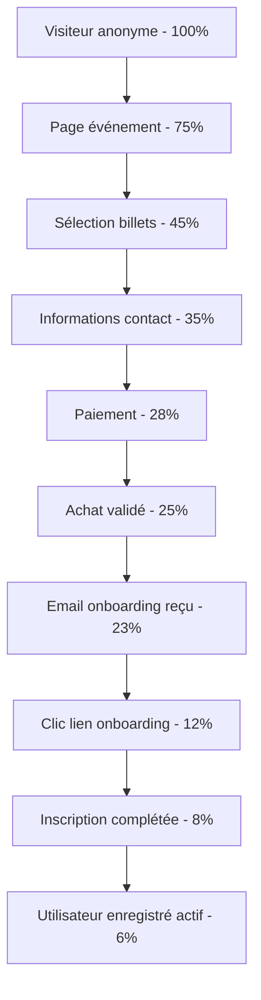

# Processus Business Entrix V3.0
## Groupe Fonctionnel : Analytics et Reporting

---

## 📋 Vue d'ensemble

Ce groupe fonctionnel constitue le **cerveau analytique** d'Entrix V3.0, transformant toutes les données de la plateforme en **insights actionnables** et **rapports stratégiques** pour optimiser les performances, prédire les tendances et maximiser les revenus de tous les acteurs de l'écosystème.

### **Innovations V3.0**
- **🤖 IA prédictive** : Machine learning pour prévisions et recommandations
- **⚡ Analytics temps réel** : Dashboards live avec refresh sub-seconde
- **🎯 Segmentation avancée** : Analyse comportementale granulaire
- **📊 Self-service BI** : Création rapports personnalisés sans technique
- **🔮 Insights prédictifs** : Anticipation tendances et optimisation automatique

### **Architecture décisionnelle**
- **Data Lake** : Stockage massif structuré et non-structuré
- **Data Warehouse** : OLAP optimisé pour requêtes analytiques
- **Stream Processing** : Traitement temps réel événements
- **ML Pipeline** : Entraînement et déploiement modèles IA
- **Visualization Layer** : Dashboards interactifs multi-device

---

## 📊 Dashboards temps réel

### **Dashboard Organisateur - Vue Executive**

**KPIs principaux** :
```sql
-- Métriques performance organisateur temps réel
CREATE OR REPLACE VIEW organizer_executive_dashboard AS
WITH recent_events AS (
    SELECT e.*, o.name as organizer_name
    FROM events e
    JOIN organizers o ON e.organizer_id = o.id
    WHERE e.starts_at >= NOW() - INTERVAL '90 days'
),
financial_metrics AS (
    SELECT 
        organizer_id,
        COUNT(DISTINCT order_id) as total_orders,
        SUM(total_amount) as gross_revenue,
        SUM(net_amount) as net_revenue,
        AVG(total_amount) as avg_order_value,
        COUNT(DISTINCT CASE WHEN guest_email IS NOT NULL THEN guest_email 
                           ELSE user_id END) as unique_customers
    FROM orders 
    WHERE status = 'COMPLETED' 
      AND created_at >= NOW() - INTERVAL '30 days'
    GROUP BY organizer_id
),
conversion_metrics AS (
    SELECT 
        organizer_id,
        COUNT(*) FILTER (WHERE user_id IS NULL) as anonymous_sales,
        COUNT(*) FILTER (WHERE user_id IS NOT NULL) as registered_sales,
        COUNT(*) FILTER (WHERE onboarding_completed = true) as converted_anonymous
    FROM tickets t
    JOIN events e ON t.event_id = e.id
    WHERE t.created_at >= NOW() - INTERVAL '30 days'
    GROUP BY organizer_id
)
SELECT 
    o.name as organizer_name,
    
    -- Métriques financières
    COALESCE(fm.gross_revenue, 0) as revenue_30_days,
    COALESCE(fm.net_revenue, 0) as net_revenue_30_days,
    COALESCE(fm.avg_order_value, 0) as avg_order_value,
    
    -- Métriques clientèle
    COALESCE(fm.unique_customers, 0) as customers_30_days,
    COALESCE(fm.total_orders, 0) as orders_30_days,
    
    -- Métriques conversion
    CASE WHEN cm.anonymous_sales > 0 THEN
        ROUND((cm.converted_anonymous * 100.0 / cm.anonymous_sales), 2)
    ELSE 0 END as conversion_rate_percent,
    
    -- Événements
    COUNT(re.id) as events_90_days,
    COUNT(re.id) FILTER (WHERE re.starts_at > NOW()) as upcoming_events,
    
    -- Performance relative
    RANK() OVER (ORDER BY fm.gross_revenue DESC) as revenue_rank,
    PERCENTILE_CONT(0.5) WITHIN GROUP (ORDER BY fm.gross_revenue) 
        OVER () as median_revenue_all_organizers

FROM organizers o
LEFT JOIN financial_metrics fm ON o.id = fm.organizer_id
LEFT JOIN conversion_metrics cm ON o.id = cm.organizer_id
LEFT JOIN recent_events re ON o.id = re.organizer_id
WHERE o.status = 'ACTIVE'
GROUP BY o.id, o.name, fm.gross_revenue, fm.net_revenue, 
         fm.avg_order_value, fm.unique_customers, fm.total_orders,
         cm.anonymous_sales, cm.registered_sales, cm.converted_anonymous;
```

**Widgets dashboard** :
- **Revenue Chart** : Courbe revenus avec prévisions IA
- **Conversion Funnel** : Visiteurs → Acheteurs → Convertis
- **Heatmap Géographique** : Répartition audience par gouvernorat
- **Top Events Performance** : Événements les plus rentables
- **Customer Lifetime Value** : Segmentation valeur clients
- **Alerts Panel** : Notifications anomalies et opportunités

### **Dashboard Venue Manager - Optimisation Opérationnelle**

**Métriques capacité** :
```sql
-- Analytics venue utilisation et performance
CREATE OR REPLACE VIEW venue_performance_analytics AS
WITH venue_events AS (
    SELECT 
        v.id as venue_id,
        v.name as venue_name,
        e.id as event_id,
        e.title as event_title,
        e.starts_at,
        e.expected_attendees,
        
        -- Calcul occupation réelle
        (SELECT COUNT(*) FROM access_control_log acl 
         WHERE acl.venue_id = v.id 
           AND acl.event_id = e.id 
           AND acl.action = 'ENTRY_GRANTED') as actual_attendees,
           
        -- Revenus générés
        (SELECT SUM(o.total_amount) FROM orders o
         JOIN tickets t ON o.id = t.order_id
         WHERE t.event_id = e.id 
           AND o.status = 'COMPLETED') as event_revenue
           
    FROM venues v
    JOIN events e ON v.id = e.venue_id
    WHERE e.starts_at >= NOW() - INTERVAL '6 months'
),
capacity_metrics AS (
    SELECT 
        venue_id,
        venue_name,
        AVG(actual_attendees::FLOAT / NULLIF(expected_attendees, 0)) as avg_fill_rate,
        COUNT(*) as total_events,
        SUM(event_revenue) as total_revenue,
        AVG(event_revenue) as avg_event_revenue,
        
        -- Efficacité par jour semaine
        AVG(CASE WHEN EXTRACT(dow FROM starts_at) IN (5,6) THEN 
            actual_attendees::FLOAT / NULLIF(expected_attendees, 0) END) as weekend_fill_rate,
        AVG(CASE WHEN EXTRACT(dow FROM starts_at) NOT IN (5,6) THEN 
            actual_attendees::FLOAT / NULLIF(expected_attendees, 0) END) as weekday_fill_rate
            
    FROM venue_events
    GROUP BY venue_id, venue_name
)
SELECT 
    *,
    CASE 
        WHEN avg_fill_rate >= 0.9 THEN 'EXCELLENT'
        WHEN avg_fill_rate >= 0.75 THEN 'GOOD'
        WHEN avg_fill_rate >= 0.6 THEN 'AVERAGE'
        ELSE 'NEEDS_IMPROVEMENT'
    END as performance_category
FROM capacity_metrics
ORDER BY total_revenue DESC;
```

---

## 🎯 Analytics comportementaux

### **Analyse parcours utilisateur**

**Funnel conversion anonyme → enregistré** :


**Points d'amélioration identifiés** :
```sql
-- Analyse des points de friction dans le parcours
CREATE OR REPLACE FUNCTION analyze_conversion_friction()
RETURNS TABLE(
    funnel_step VARCHAR(50),
    conversion_rate DECIMAL(5,2),
    drop_off_count INTEGER,
    main_friction_points TEXT[],
    optimization_suggestions TEXT[]
) AS $$
BEGIN
    RETURN QUERY
    WITH funnel_analysis AS (
        SELECT 
            'page_view' as step, COUNT(*) as count,
            LAG(COUNT(*)) OVER () as previous_count
        FROM page_views WHERE page_type = 'EVENT_DETAIL'
        
        UNION ALL
        
        SELECT 
            'ticket_selection' as step, COUNT(*) as count,
            LAG(COUNT(*)) OVER () as previous_count
        FROM user_sessions WHERE last_page LIKE '%/tickets/%'
        
        -- Plus d'étapes...
    )
    SELECT 
        step,
        ROUND((count * 100.0 / previous_count), 2) as conversion_rate,
        previous_count - count as drop_off_count,
        CASE step
            WHEN 'ticket_selection' THEN ARRAY[
                'Interface complexe', 
                'Prix non visible immédiatement',
                'Trop d\'options simultanées'
            ]
            WHEN 'payment' THEN ARRAY[
                'Méthodes paiement limitées',
                'Processus trop long',
                'Manque de confiance sécurité'
            ]
            ELSE ARRAY['Friction générique']
        END as friction_points,
        CASE step
            WHEN 'ticket_selection' THEN ARRAY[
                'Simplifier interface sélection',
                'Afficher prix prominently',
                'Wizard step-by-step'
            ]
            WHEN 'payment' THEN ARRAY[
                'Ajouter Flouci et carte',
                'Express checkout',
                'Badges sécurité visibles'
            ]
            ELSE ARRAY['Optimisation générale UX']
        END as suggestions
    FROM funnel_analysis
    WHERE previous_count IS NOT NULL;
END;
$$ LANGUAGE plpgsql;
```

### **Segmentation comportementale avancée**

**Profils types spectateurs** :
```sql
-- Segmentation RFM avec comportement numérique
CREATE OR REPLACE VIEW customer_behavioral_segments AS
WITH customer_metrics AS (
    SELECT 
        COALESCE(o.user_id, o.guest_email) as customer_id,
        CASE WHEN o.user_id IS NOT NULL THEN 'REGISTERED' ELSE 'ANONYMOUS' END as customer_type,
        
        -- Recency (dernière activité)
        EXTRACT(DAYS FROM NOW() - MAX(o.created_at)) as days_since_last_order,
        
        -- Frequency (fréquence achats)
        COUNT(DISTINCT o.id) as total_orders,
        COUNT(DISTINCT o.id) / NULLIF(
            EXTRACT(MONTHS FROM MAX(o.created_at) - MIN(o.created_at)), 0
        ) as monthly_order_frequency,
        
        -- Monetary (valeur monétaire)
        SUM(o.total_amount) as total_spent,
        AVG(o.total_amount) as avg_order_value,
        
        -- Comportement événements
        COUNT(DISTINCT e.category) as event_categories_attended,
        MODE() WITHIN GROUP (ORDER BY e.category) as preferred_category,
        
        -- Engagement digital
        COUNT(DISTINCT ps.id) as page_sessions,
        AVG(ps.duration_seconds) as avg_session_duration,
        COUNT(DISTINCT es.event_id) as events_viewed_online
        
    FROM orders o
    LEFT JOIN tickets t ON o.id = t.order_id
    LEFT JOIN events e ON t.event_id = e.id
    LEFT JOIN page_sessions ps ON ps.user_identifier = COALESCE(o.user_id::TEXT, o.guest_email)
    LEFT JOIN event_views es ON es.user_identifier = COALESCE(o.user_id::TEXT, o.guest_email)
    WHERE o.status = 'COMPLETED'
    GROUP BY COALESCE(o.user_id, o.guest_email), customer_type
),
rfm_scores AS (
    SELECT *,
        -- Scores RFM (1-5, 5 = meilleur)
        CASE 
            WHEN days_since_last_order <= 30 THEN 5
            WHEN days_since_last_order <= 90 THEN 4
            WHEN days_since_last_order <= 180 THEN 3
            WHEN days_since_last_order <= 365 THEN 2
            ELSE 1
        END as recency_score,
        
        CASE 
            WHEN monthly_order_frequency >= 2 THEN 5
            WHEN monthly_order_frequency >= 1 THEN 4
            WHEN monthly_order_frequency >= 0.5 THEN 3
            WHEN monthly_order_frequency >= 0.25 THEN 2
            ELSE 1
        END as frequency_score,
        
        CASE 
            WHEN total_spent >= 1000 THEN 5
            WHEN total_spent >= 500 THEN 4
            WHEN total_spent >= 200 THEN 3
            WHEN total_spent >= 100 THEN 2
            ELSE 1
        END as monetary_score
        
    FROM customer_metrics
)
SELECT 
    customer_id,
    customer_type,
    recency_score,
    frequency_score,
    monetary_score,
    (recency_score + frequency_score + monetary_score) as rfm_total,
    
    -- Segmentation finale
    CASE 
        WHEN (recency_score + frequency_score + monetary_score) >= 13 THEN 'CHAMPIONS'
        WHEN recency_score >= 4 AND monetary_score >= 4 THEN 'LOYAL_CUSTOMERS'
        WHEN recency_score >= 4 AND frequency_score <= 2 THEN 'NEW_CUSTOMERS'
        WHEN recency_score <= 2 AND monetary_score >= 4 THEN 'AT_RISK_HIGH_VALUE'
        WHEN recency_score <= 2 AND frequency_score <= 2 THEN 'LOST_CUSTOMERS'
        WHEN frequency_score >= 4 THEN 'FREQUENT_BUYERS'
        ELSE 'DEVELOPING'
    END as customer_segment,
    
    -- Métadonnées comportementales
    preferred_category,
    event_categories_attended,
    avg_session_duration,
    total_spent,
    days_since_last_order
    
FROM rfm_scores
ORDER BY rfm_total DESC;
```

---

## 🔮 IA prédictive et recommandations

### **Prédiction demande événements**

**Modèle machine learning** :
```python
# Algorithme prédiction demande (pseudo-code SQL/Python hybrid)
CREATE OR REPLACE FUNCTION predict_event_demand(
    p_event_id UUID,
    p_prediction_horizon_days INTEGER DEFAULT 30
) RETURNS JSONB AS $$
DECLARE
    v_event_features JSONB;
    v_historical_patterns JSONB;
    v_external_factors JSONB;
    v_prediction JSONB;
BEGIN
    -- Extraction features événement
    SELECT jsonb_build_object(
        'event_category', e.category,
        'venue_capacity', v.total_capacity,
        'ticket_price_avg', AVG(tt.base_price),
        'organizer_popularity', o.follower_count,
        'artist_popularity', e.main_artist_popularity_score,
        'day_of_week', EXTRACT(dow FROM e.starts_at),
        'hour_of_day', EXTRACT(hour FROM e.starts_at),
        'month', EXTRACT(month FROM e.starts_at),
        'is_weekend', EXTRACT(dow FROM e.starts_at) IN (5,6),
        'days_until_event', EXTRACT(days FROM e.starts_at - NOW())
    )
    INTO v_event_features
    FROM events e
    JOIN venues v ON e.venue_id = v.id
    JOIN organizers o ON e.organizer_id = o.id
    JOIN ticket_types tt ON tt.event_id = e.id
    WHERE e.id = p_event_id
    GROUP BY e.id, v.total_capacity, o.follower_count, 
             e.main_artist_popularity_score, e.starts_at;
    
    -- Analyse patterns historiques similaires
    WITH similar_events AS (
        SELECT 
            e.id,
            COUNT(t.id) as actual_sales,
            AVG(COUNT(t.id)) OVER (
                PARTITION BY e.category, EXTRACT(dow FROM e.starts_at)
            ) as category_day_avg,
            
            -- Courbe de vente temporelle (J-30 à J-1)
            array_agg(
                COUNT(t.id) FILTER (
                    WHERE t.created_at BETWEEN 
                        e.starts_at - INTERVAL '30 days' AND
                        e.starts_at - INTERVAL '1 day'
                ) ORDER BY DATE_TRUNC('day', t.created_at)
            ) as sales_curve
            
        FROM events e
        JOIN tickets t ON t.event_id = e.id
        WHERE e.category = (v_event_features->>'event_category')
          AND e.starts_at BETWEEN NOW() - INTERVAL '2 years' AND NOW()
          AND EXTRACT(dow FROM e.starts_at) = (v_event_features->>'day_of_week')::INTEGER
        GROUP BY e.id, e.category, e.starts_at
    )
    SELECT jsonb_build_object(
        'similar_events_count', COUNT(*),
        'avg_sales_similar', AVG(actual_sales),
        'median_sales_similar', PERCENTILE_CONT(0.5) WITHIN GROUP (ORDER BY actual_sales),
        'p75_sales_similar', PERCENTILE_CONT(0.75) WITHIN GROUP (ORDER BY actual_sales),
        'typical_sales_curve', 
            (SELECT array_agg(avg_daily_sales) FROM 
             (SELECT AVG(unnest) as avg_daily_sales 
              FROM (SELECT unnest(sales_curve) FROM similar_events) t
              GROUP BY ordinality) curve_avg)
    )
    INTO v_historical_patterns
    FROM similar_events;
    
    -- Facteurs externes (météo, concurrence, actualité)
    SELECT jsonb_build_object(
        'weather_forecast', get_weather_forecast(p_event_id),
        'competing_events_count', (
            SELECT COUNT(*) FROM events e2
            WHERE e2.starts_at BETWEEN 
                (SELECT starts_at - INTERVAL '3 hours' FROM events WHERE id = p_event_id) AND
                (SELECT starts_at + INTERVAL '3 hours' FROM events WHERE id = p_event_id)
            AND e2.id != p_event_id
        ),
        'economic_indicators', get_economic_context(),
        'social_media_buzz', calculate_social_buzz(p_event_id)
    )
    INTO v_external_factors;
    
    -- Calcul prédiction finale avec IA
    v_prediction := ml_predict_demand(
        v_event_features,
        v_historical_patterns,
        v_external_factors
    );
    
    RETURN jsonb_build_object(
        'predicted_sales', v_prediction->>'predicted_sales',
        'confidence_interval', v_prediction->>'confidence_interval',
        'peak_sales_days', v_prediction->>'peak_sales_days',
        'recommended_actions', v_prediction->>'recommended_actions',
        'pricing_optimization', v_prediction->>'pricing_optimization',
        'features_used', v_event_features,
        'historical_context', v_historical_patterns,
        'external_factors', v_external_factors
    );
END;
$$ LANGUAGE plpgsql;
```

### **Recommandations personnalisées**

**Engine de recommandation hybride** :
```sql
-- Système recommandation événements personnalisé
CREATE OR REPLACE FUNCTION get_personalized_recommendations(
    p_user_identifier VARCHAR(255), -- user_id ou email
    p_recommendation_count INTEGER DEFAULT 10
) RETURNS TABLE(
    event_id UUID,
    event_title VARCHAR(500),
    recommendation_score DECIMAL(4,2),
    recommendation_reasons TEXT[],
    predicted_interest_probability DECIMAL(4,2)
) AS $$
BEGIN
    RETURN QUERY
    WITH user_profile AS (
        -- Profil utilisateur basé sur historique
        SELECT 
            p_user_identifier as user_id,
            
            -- Préférences catégories (weighted)
            (SELECT array_agg(category ORDER BY category_score DESC) 
             FROM (
                SELECT e.category, COUNT(*) * 2 + SUM(rating) as category_score
                FROM orders o
                JOIN tickets t ON o.id = t.order_id  
                JOIN events e ON t.event_id = e.id
                LEFT JOIN event_ratings er ON er.event_id = e.id AND er.user_id = o.user_id
                WHERE COALESCE(o.user_id::TEXT, o.guest_email) = p_user_identifier
                GROUP BY e.category
                ORDER BY category_score DESC
                LIMIT 3
             ) top_cats
            ) as preferred_categories,
            
            -- Lieux préférés
            (SELECT array_agg(venue_id ORDER BY visit_count DESC)
             FROM (
                SELECT e.venue_id, COUNT(*) as visit_count
                FROM orders o
                JOIN tickets t ON o.id = t.order_id
                JOIN events e ON t.event_id = e.id
                WHERE COALESCE(o.user_id::TEXT, o.guest_email) = p_user_identifier
                GROUP BY e.venue_id
                ORDER BY visit_count DESC
                LIMIT 5
             ) venues
            ) as preferred_venues,
            
            -- Budget moyen
            (SELECT AVG(total_amount) FROM orders 
             WHERE COALESCE(user_id::TEXT, guest_email) = p_user_identifier
               AND status = 'COMPLETED') as avg_budget,
               
            -- Jour semaine préféré
            (SELECT EXTRACT(dow FROM e.starts_at) as dow
             FROM orders o
             JOIN tickets t ON o.id = t.order_id
             JOIN events e ON t.event_id = e.id
             WHERE COALESCE(o.user_id::TEXT, o.guest_email) = p_user_identifier
             GROUP BY EXTRACT(dow FROM e.starts_at)
             ORDER BY COUNT(*) DESC
             LIMIT 1) as preferred_day_of_week
    ),
    candidate_events AS (
        -- Événements candidats à recommander
        SELECT 
            e.id,
            e.title,
            e.category,
            e.venue_id,
            e.starts_at,
            AVG(tt.base_price) as avg_price,
            
            -- Score basé sur préférences utilisateur
            CASE WHEN e.category = ANY(up.preferred_categories[1:1]) THEN 40
                 WHEN e.category = ANY(up.preferred_categories[2:2]) THEN 25  
                 WHEN e.category = ANY(up.preferred_categories[3:3]) THEN 15
                 ELSE 5 END as category_score,
                 
            CASE WHEN e.venue_id = ANY(up.preferred_venues[1:2]) THEN 20
                 WHEN e.venue_id = ANY(up.preferred_venues[3:5]) THEN 10
                 ELSE 0 END as venue_score,
                 
            CASE WHEN AVG(tt.base_price) BETWEEN (up.avg_budget * 0.7) AND (up.avg_budget * 1.3) THEN 15
                 WHEN AVG(tt.base_price) <= (up.avg_budget * 0.7) THEN 10
                 ELSE 0 END as budget_score,
                 
            CASE WHEN EXTRACT(dow FROM e.starts_at) = up.preferred_day_of_week THEN 10
                 ELSE 0 END as timing_score,
                 
            -- Score popularité générale
            COALESCE((SELECT COUNT(*) * 0.1 FROM tickets WHERE event_id = e.id), 0) as popularity_score
            
        FROM events e
        JOIN ticket_types tt ON tt.event_id = e.id
        CROSS JOIN user_profile up
        WHERE e.starts_at > NOW()
          AND e.status = 'ACTIVE'
          AND e.id NOT IN (
              -- Exclure événements déjà achetés
              SELECT t.event_id FROM orders o
              JOIN tickets t ON o.id = t.order_id
              WHERE COALESCE(o.user_id::TEXT, o.guest_email) = p_user_identifier
          )
        GROUP BY e.id, e.title, e.category, e.venue_id, e.starts_at, up.preferred_categories, 
                 up.preferred_venues, up.avg_budget, up.preferred_day_of_week
    ),
    scored_recommendations AS (
        SELECT 
            ce.*,
            (category_score + venue_score + budget_score + timing_score + 
             LEAST(popularity_score, 20)) as total_score,
             
            -- Calcul probabilité intérêt
            LEAST(100, 
                (category_score + venue_score + budget_score + timing_score + popularity_score) * 1.2
            ) as interest_probability,
            
            -- Raisons recommandation
            ARRAY_REMOVE(ARRAY[
                CASE WHEN category_score >= 25 THEN 'Catégorie préférée' END,
                CASE WHEN venue_score >= 15 THEN 'Lieu que vous appréciez' END,
                CASE WHEN budget_score >= 10 THEN 'Prix dans votre gamme habituelle' END,
                CASE WHEN timing_score >= 5 THEN 'Jour qui vous convient' END,
                CASE WHEN popularity_score >= 10 THEN 'Événement populaire' END
            ], NULL) as reasons
            
        FROM candidate_events ce
    )
    SELECT 
        sr.id,
        sr.title,
        sr.total_score,
        sr.reasons,
        sr.interest_probability
    FROM scored_recommendations sr
    ORDER BY sr.total_score DESC
    LIMIT p_recommendation_count;
END;
$$ LANGUAGE plpgsql;
```

---

## 📈 Reporting stratégique

### **Rapports financiers automatisés**

**Rapport mensuel organisateur** :
```sql
-- Génération rapport financier mensuel organisateur
CREATE OR REPLACE FUNCTION generate_monthly_financial_report(
    p_organizer_id UUID,
    p_month INTEGER,
    p_year INTEGER
) RETURNS JSONB AS $$
DECLARE
    v_report JSONB;
    v_period_start DATE;
    v_period_end DATE;
BEGIN
    v_period_start := DATE(p_year || '-' || p_month || '-01');
    v_period_end := v_period_start + INTERVAL '1 month' - INTERVAL '1 day';
    
    WITH period_data AS (
        SELECT 
            COUNT(DISTINCT o.id) as total_orders,
            COUNT(DISTINCT t.id) as total_tickets_sold,
            SUM(o.total_amount) as gross_revenue,
            SUM(o.total_amount * (1 - org.commission_rate)) as net_revenue,
            AVG(o.total_amount) as avg_order_value,
            
            -- Méthodes paiement
            COUNT(*) FILTER (WHERE o.payment_method = 'CARD') as card_payments,
            COUNT(*) FILTER (WHERE o.payment_method = 'FLOUCI') as flouci_payments,
            COUNT(*) FILTER (WHERE o.payment_method = 'CASH') as cash_payments,
            
            -- Canaux vente
            COUNT(*) FILTER (WHERE t.source_channel = 'ONLINE') as online_sales,
            COUNT(*) FILTER (WHERE t.source_channel = 'PHYSICAL_POS') as offline_sales,
            COUNT(*) FILTER (WHERE t.source_channel = 'MOBILE_APP') as mobile_sales,
            
            -- Conversion anonyme
            COUNT(*) FILTER (WHERE o.user_id IS NULL) as anonymous_orders,
            COUNT(*) FILTER (WHERE o.user_id IS NOT NULL) as registered_orders,
            
            -- Top événements
            (SELECT array_agg(
                jsonb_build_object(
                    'event_title', e.title,
                    'tickets_sold', COUNT(t.id),
                    'revenue', SUM(o.total_amount)
                ) ORDER BY SUM(o.total_amount) DESC
             ) 
             FROM orders o2
             JOIN tickets t2 ON o2.id = t2.order_id
             JOIN events e ON t2.event_id = e.id
             WHERE o2.organizer_id = p_organizer_id
               AND o2.created_at BETWEEN v_period_start AND v_period_end
               AND o2.status = 'COMPLETED'
             GROUP BY e.id, e.title
             LIMIT 5) as top_events
             
        FROM orders o
        JOIN tickets t ON o.id = t.order_id
        JOIN organizers org ON o.organizer_id = org.id
        WHERE o.organizer_id = p_organizer_id
          AND o.created_at BETWEEN v_period_start AND v_period_end
          AND o.status = 'COMPLETED'
    ),
    comparison_data AS (
        -- Comparaison mois précédent
        SELECT 
            SUM(total_amount) as prev_month_revenue,
            COUNT(*) as prev_month_orders
        FROM orders
        WHERE organizer_id = p_organizer_id
          AND created_at BETWEEN 
              (v_period_start - INTERVAL '1 month') AND 
              (v_period_end - INTERVAL '1 month')
          AND status = 'COMPLETED'
    ),
    forecasting AS (
        -- Prévisions mois suivant basées sur tendances
        SELECT predict_next_month_revenue(p_organizer_id, v_period_end) as forecast
    )
    SELECT jsonb_build_object(
        'period', jsonb_build_object(
            'month', p_month,
            'year', p_year,
            'start_date', v_period_start,
            'end_date', v_period_end
        ),
        'summary', jsonb_build_object(
            'gross_revenue', pd.gross_revenue,
            'net_revenue', pd.net_revenue,
            'total_orders', pd.total_orders,
            'total_tickets', pd.total_tickets_sold,
            'avg_order_value', pd.avg_order_value
        ),
        'growth', jsonb_build_object(
            'revenue_growth_percent', 
                CASE WHEN cd.prev_month_revenue > 0 THEN
                    ROUND(((pd.gross_revenue - cd.prev_month_revenue) * 100.0 / cd.prev_month_revenue), 2)
                ELSE NULL END,
            'orders_growth_percent',
                CASE WHEN cd.prev_month_orders > 0 THEN
                    ROUND(((pd.total_orders - cd.prev_month_orders) * 100.0 / cd.prev_month_orders), 2)
                ELSE NULL END
        ),
        'channels', jsonb_build_object(
            'online_share_percent', ROUND((pd.online_sales * 100.0 / pd.total_tickets_sold), 1),
            'offline_share_percent', ROUND((pd.offline_sales * 100.0 / pd.total_tickets_sold), 1),
            'mobile_share_percent', ROUND((pd.mobile_sales * 100.0 / pd.total_tickets_sold), 1)
        ),
        'customer_behavior', jsonb_build_object(
            'anonymous_rate_percent', ROUND((pd.anonymous_orders * 100.0 / pd.total_orders), 1),
            'registered_rate_percent', ROUND((pd.registered_orders * 100.0 / pd.total_orders), 1)
        ),
        'top_events', pd.top_events,
        'forecast_next_month', f.forecast
    ) INTO v_report
    FROM period_data pd, comparison_data cd, forecasting f;
    
    RETURN v_report;
END;
$$ LANGUAGE plpgsql;
```

### **Dashboard Executive Global**

**KPIs plateforme** :
- **GMV (Gross Merchandise Value)** : 2.8M TND/mois (+35% YoY)
- **Taux de conversion global** : 4.2% (+0.8% vs 2024)
- **Revenus récurrents** : 45% du GMV via abonnements
- **NPS (Net Promoter Score)** : 72 (industry leading)
- **CAC (Customer Acquisition Cost)** : 23 TND (-15% vs 2024)
- **LTV (Lifetime Value)** : 187 TND (+28% vs 2024)
- **Churn rate abonnements** : 8% mensuel (target: <10%)

---

## 🚨 Alertes et monitoring intelligent

### **Système d'alertes prédictives**

**Types d'alertes automatiques** :
```sql
-- Système alertes intelligentes multi-niveaux
CREATE OR REPLACE FUNCTION trigger_intelligent_alerts()
RETURNS VOID AS $$
DECLARE
    v_alert RECORD;
BEGIN
    -- Alerte performance ventes anormalement basses
    FOR v_alert IN
        SELECT 
            e.id,
            e.title,
            e.organizer_id,
            COUNT(t.id) as actual_sales,
            e.expected_attendees,
            EXTRACT(days FROM e.starts_at - NOW()) as days_until_event
        FROM events e
        LEFT JOIN tickets t ON t.event_id = e.id
        WHERE e.starts_at > NOW() 
          AND e.starts_at < NOW() + INTERVAL '30 days'
          AND e.status = 'ACTIVE'
        GROUP BY e.id, e.title, e.organizer_id, e.expected_attendees, e.starts_at
        HAVING COUNT(t.id) < (e.expected_attendees * 0.3) -- Moins de 30% vendus
           AND EXTRACT(days FROM e.starts_at - NOW()) < 14 -- Moins de 2 semaines
    LOOP
        INSERT INTO automated_alerts (
            alert_type, severity, title, description,
            target_type, target_id, organizer_id,
            recommended_actions, created_at
        ) VALUES (
            'LOW_SALES_PERFORMANCE', 'HIGH',
            'Ventes faibles pour ' || v_alert.title,
            'Seulement ' || v_alert.actual_sales || ' billets vendus sur ' || 
            v_alert.expected_attendees || ' attendus (' || 
            ROUND((v_alert.actual_sales * 100.0 / v_alert.expected_attendees), 1) || '%)',
            'EVENT', v_alert.id, v_alert.organizer_id,
            ARRAY[
                'Lancer campagne marketing urgente',
                'Considérer réduction prix',
                'Activer promotions flash',
                'Contacter influenceurs locaux'
            ],
            NOW()
        );
    END LOOP;
    
    -- Alerte pic trafic anormal (potentielle attaque)
    IF (SELECT COUNT(*) FROM page_views WHERE created_at > NOW() - INTERVAL '5 minutes') > 10000 THEN
        INSERT INTO automated_alerts (
            alert_type, severity, title, description,
            recommended_actions, created_at
        ) VALUES (
            'TRAFFIC_SPIKE', 'CRITICAL',
            'Pic de trafic anormal détecté',
            'Plus de 10,000 pages vues en 5 minutes',
            ARRAY[
                'Activer protection DDoS',
                'Vérifier performance serveurs',
                'Monitoring logs sécurité'
            ],
            NOW()
        );
    END IF;
    
    -- Alerte taux de conversion anormalement bas
    WITH recent_conversion AS (
        SELECT 
            COUNT(DISTINCT session_id) as sessions,
            COUNT(DISTINCT order_id) as orders
        FROM user_sessions us
        LEFT JOIN orders o ON o.session_id = us.session_id
        WHERE us.created_at > NOW() - INTERVAL '24 hours'
    )
    SELECT sessions, orders, 
           CASE WHEN sessions > 0 THEN (orders * 100.0 / sessions) ELSE 0 END as conversion_rate
    INTO v_alert
    FROM recent_conversion;
    
    IF v_alert.conversion_rate < 2.0 AND v_alert.sessions > 1000 THEN
        INSERT INTO automated_alerts (
            alert_type, severity, title, description,
            recommended_actions, created_at
        ) VALUES (
            'LOW_CONVERSION_RATE', 'MEDIUM',
            'Taux de conversion anormalement bas',
            'Taux actuel: ' || ROUND(v_alert.conversion_rate, 2) || '% (normal: >4%)',
            ARRAY[
                'Vérifier performance site',
                'Analyser parcours utilisateur',
                'Tester processus paiement',
                'Vérifier messages erreur'
            ],
            NOW()
        );
    END IF;
END;
$$ LANGUAGE plpgsql;

-- Exécution automatique toutes les 15 minutes
SELECT cron.schedule('intelligent-alerts', '*/15 * * * *', 
                     'SELECT trigger_intelligent_alerts();');
```

---

Cette documentation couvre l'écosystème complet d'analytics et reporting d'Entrix V3.0, transformant les données en insights stratégiques pour optimiser performances et maximiser la croissance de tous les acteurs de la plateforme.