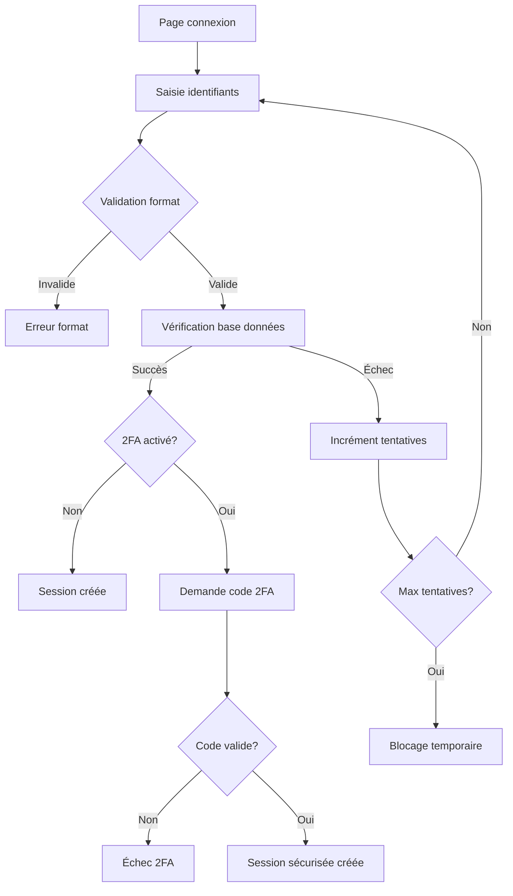
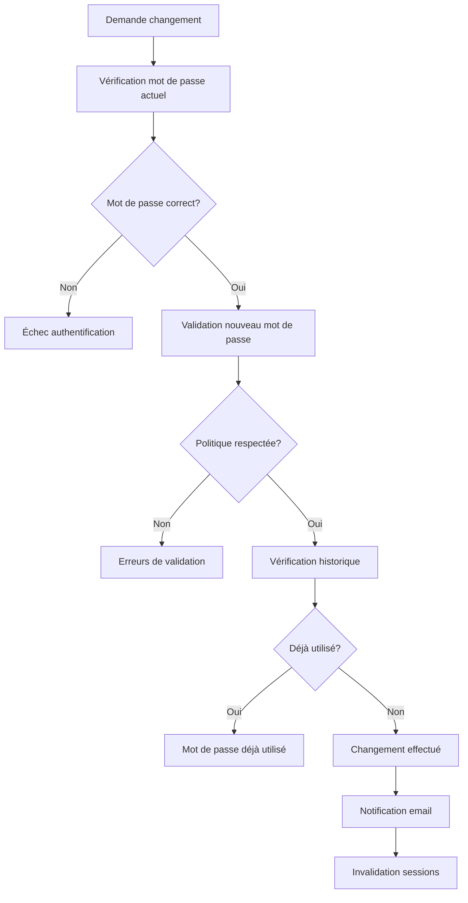
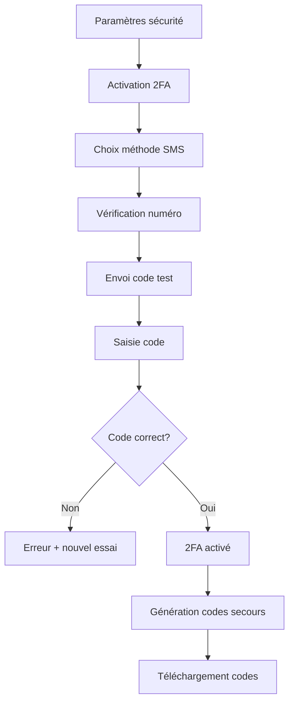
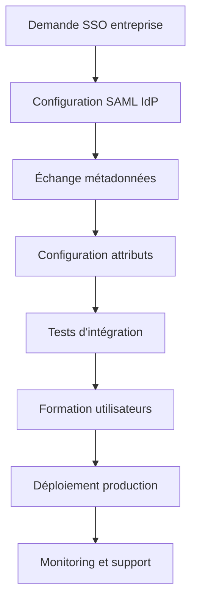

# Processus Business Entrix V3.0
## Groupe Fonctionnel : Authentification et sécurité

---

## 📋 Vue d'ensemble

Ce groupe fonctionnel couvre l'écosystème complet d'authentification et de sécurité d'Entrix V3.0, incluant les **méthodes d'authentification avancées**, la **gestion des sessions sécurisées**, et les **protocoles de sécurité** adaptés au contexte tunisien et maghrébin.

### **Caractéristiques V3.0**
- **🔐 Multi-facteur natif** : 2FA obligatoire pour organisateurs
- **📱 Biométrie mobile** : Touch/Face ID pour applications
- **🌍 Détection géographique** : Sécurité basée sur localisation
- **🤖 IA anti-fraude** : Détection comportements suspects
- **⚡ SSO entreprise** : Intégration SAML/OAuth pour corporates

---

## 🔐 Authentification standard

### **Processus de connexion classique**



### **Validation des identifiants**

**Formats acceptés** :
- **Email** : Format standard RFC 5322
- **Téléphone** : Format tunisien (+216XXXXXXXX) ou international
- **Nom d'utilisateur** : Alphanumérique, 3-30 caractères

**Processus de vérification** :
```sql
-- Authentification sécurisée avec limitation tentatives
CREATE OR REPLACE FUNCTION authenticate_user(
    p_login VARCHAR(255),
    p_password VARCHAR(255),
    p_ip_address INET,
    p_user_agent TEXT
) RETURNS TABLE(
    success BOOLEAN,
    user_id UUID,
    session_token VARCHAR(255),
    requires_2fa BOOLEAN,
    error_message TEXT,
    attempts_remaining INTEGER
) AS $$
DECLARE
    v_user RECORD;
    v_attempts INTEGER;
    v_session_id UUID;
BEGIN
    -- Vérifier tentatives récentes depuis cette IP
    SELECT COUNT(*) INTO v_attempts
    FROM failed_login_attempts
    WHERE ip_address = p_ip_address
      AND created_at > NOW() - INTERVAL '15 minutes';
    
    -- Blocage si trop de tentatives
    IF v_attempts >= 5 THEN
        RETURN QUERY SELECT 
            FALSE, NULL::UUID, NULL::VARCHAR, FALSE, 
            'Trop de tentatives. Réessayez dans 15 minutes.', 0;
        RETURN;
    END IF;
    
    -- Recherche utilisateur (email ou téléphone)
    SELECT u.*, up.two_factor_enabled INTO v_user
    FROM users u
    LEFT JOIN user_profiles up ON u.id = up.user_id
    WHERE (u.email = p_login OR u.phone = p_login)
      AND u.is_active = TRUE;
    
    -- Vérification mot de passe
    IF NOT FOUND OR NOT crypt(p_password, v_user.password_hash) = v_user.password_hash THEN
        -- Log tentative échouée
        INSERT INTO failed_login_attempts (
            ip_address, login_attempt, user_agent, created_at
        ) VALUES (p_ip_address, p_login, p_user_agent, NOW());
        
        RETURN QUERY SELECT 
            FALSE, NULL::UUID, NULL::VARCHAR, FALSE,
            'Identifiants incorrects.', 5 - v_attempts - 1;
        RETURN;
    END IF;
    
    -- Succès : Créer session
    v_session_id := gen_random_uuid();
    
    INSERT INTO user_sessions (
        id, user_id, ip_address, user_agent, 
        expires_at, is_2fa_verified
    ) VALUES (
        v_session_id, v_user.id, p_ip_address, p_user_agent,
        NOW() + INTERVAL '24 hours',
        NOT COALESCE(v_user.two_factor_enabled, FALSE)
    );
    
    -- Log connexion réussie
    INSERT INTO login_history (
        user_id, ip_address, user_agent, login_at
    ) VALUES (v_user.id, p_ip_address, p_user_agent, NOW());
    
    RETURN QUERY SELECT 
        TRUE, v_user.id, v_session_id::VARCHAR, 
        COALESCE(v_user.two_factor_enabled, FALSE),
        'Connexion réussie.'::TEXT, 5;
END;
$$ LANGUAGE plpgsql;
```

### **Gestion des mots de passe**

**Politique de mots de passe** :
- **Longueur minimum** : 8 caractères
- **Complexité** : 1 majuscule + 1 minuscule + 1 chiffre + 1 caractère spécial
- **Blacklist** : Mots de passe courants interdits
- **Historique** : 5 derniers mots de passe interdits
- **Expiration** : 90 jours pour organisateurs, optionnel utilisateurs

**Processus de changement** :


---

## 🔒 Authentification à deux facteurs (2FA)

### **Méthodes 2FA supportées**

**1. SMS OTP (One-Time Password)**
- **Usage** : Méthode principale en Tunisie
- **Format** : Code 6 chiffres
- **Validité** : 10 minutes
- **Providers** : Opérateurs locaux (Ooredoo, Orange, Tunisie Télécom)

**2. Email OTP**
- **Usage** : Fallback si SMS indisponible
- **Format** : Code 6 chiffres + lien direct
- **Validité** : 15 minutes
- **Template** : Multilingue selon préférence utilisateur

**3. Authentificateur Apps**
- **Apps supportées** : Google Authenticator, Authy, Microsoft Authenticator
- **Algorithme** : TOTP (Time-based OTP) RFC 6238
- **Validité** : 30 secondes par code
- **Backup** : QR code de configuration

**4. Codes de récupération**
- **Quantité** : 10 codes à usage unique
- **Format** : 8 caractères alphanumériques
- **Usage** : Urgence si autres méthodes indisponibles
- **Régénération** : Possible avec mot de passe + email

### **Processus d'activation 2FA**

**Workflow activation SMS** :


**Configuration TOTP** :
```sql
-- Génération secret TOTP pour utilisateur
CREATE OR REPLACE FUNCTION setup_totp_2fa(
    p_user_id UUID
) RETURNS TABLE(
    secret_key VARCHAR(32),
    qr_code_url TEXT,
    backup_codes TEXT[]
) AS $$
DECLARE
    v_secret VARCHAR(32);
    v_backup_codes TEXT[];
    v_qr_url TEXT;
BEGIN
    -- Génération secret Base32 (32 caractères)
    v_secret := upper(encode(gen_random_bytes(20), 'base32'));
    
    -- Génération 10 codes de secours
    v_backup_codes := ARRAY(
        SELECT upper(encode(gen_random_bytes(4), 'hex'))
        FROM generate_series(1, 10)
    );
    
    -- URL QR Code pour apps authenticator
    v_qr_url := 'otpauth://totp/Entrix:' || 
                (SELECT email FROM users WHERE id = p_user_id) ||
                '?secret=' || v_secret ||
                '&issuer=Entrix';
    
    -- Sauvegarde configuration
    INSERT INTO user_2fa_config (
        user_id, method, secret_key, backup_codes, 
        is_active, created_at
    ) VALUES (
        p_user_id, 'TOTP', v_secret, v_backup_codes,
        FALSE, NOW() -- Activé après vérification
    );
    
    RETURN QUERY SELECT v_secret, v_qr_url, v_backup_codes;
END;
$$ LANGUAGE plpgsql;
```

### **Validation 2FA lors de la connexion**

**Processus de vérification** :
```sql
-- Validation code 2FA
CREATE OR REPLACE FUNCTION verify_2fa_code(
    p_session_id UUID,
    p_code VARCHAR(10),
    p_method VARCHAR(20) DEFAULT 'SMS'
) RETURNS TABLE(
    success BOOLEAN,
    error_message TEXT
) AS $$
DECLARE
    v_session RECORD;
    v_expected_code VARCHAR(10);
    v_attempts INTEGER;
BEGIN
    -- Récupération session
    SELECT * INTO v_session
    FROM user_sessions us
    JOIN users u ON us.user_id = u.id
    WHERE us.id = p_session_id
      AND us.expires_at > NOW()
      AND NOT us.is_2fa_verified;
    
    IF NOT FOUND THEN
        RETURN QUERY SELECT FALSE, 'Session invalide ou expirée.';
        RETURN;
    END IF;
    
    -- Vérification tentatives récentes
    SELECT COUNT(*) INTO v_attempts
    FROM failed_2fa_attempts
    WHERE session_id = p_session_id
      AND created_at > NOW() - INTERVAL '10 minutes';
    
    IF v_attempts >= 3 THEN
        -- Invalider session après 3 échecs
        DELETE FROM user_sessions WHERE id = p_session_id;
        RETURN QUERY SELECT FALSE, 'Trop de tentatives. Reconnectez-vous.';
        RETURN;
    END IF;
    
    -- Validation selon méthode
    IF p_method = 'SMS' OR p_method = 'EMAIL' THEN
        SELECT token INTO v_expected_code
        FROM mfa_tokens
        WHERE user_id = v_session.user_id
          AND method = p_method
          AND expires_at > NOW()
          AND used_at IS NULL
        ORDER BY created_at DESC
        LIMIT 1;
        
        IF v_expected_code = p_code THEN
            -- Marquer code comme utilisé
            UPDATE mfa_tokens 
            SET used_at = NOW()
            WHERE user_id = v_session.user_id 
              AND token = p_code;
        END IF;
        
    ELSIF p_method = 'TOTP' THEN
        -- Validation TOTP (implémentation algorithme TOTP)
        SELECT validate_totp_code(v_session.user_id, p_code) INTO v_expected_code;
    END IF;
    
    -- Résultat validation
    IF v_expected_code = p_code OR (p_method = 'TOTP' AND v_expected_code = 'VALID') THEN
        -- Succès : Marquer session comme complètement authentifiée
        UPDATE user_sessions 
        SET is_2fa_verified = TRUE
        WHERE id = p_session_id;
        
        RETURN QUERY SELECT TRUE, 'Authentification complète.';
    ELSE
        -- Échec : Log tentative
        INSERT INTO failed_2fa_attempts (
            session_id, attempted_code, method, created_at
        ) VALUES (p_session_id, p_code, p_method, NOW());
        
        RETURN QUERY SELECT FALSE, 'Code incorrect.';
    END IF;
END;
$$ LANGUAGE plpgsql;
```

---

## 📱 Authentification biométrique

### **Technologies supportées**

**iOS (Touch ID / Face ID)** :
```javascript
// Implémentation authentification biométrique iOS
async function authenticateWithBiometrics() {
    try {
        const result = await TouchID.authenticate(
            'Authentifiez-vous pour accéder à Entrix',
            {
                title: 'Authentification biométrique',
                subtitle: 'Utilisez votre empreinte ou Face ID',
                description: 'Accès sécurisé à votre compte Entrix',
                fallbackLabel: 'Utiliser le mot de passe',
                cancelLabel: 'Annuler',
                passcodeFallback: true
            }
        );
        
        if (result.success) {
            // Récupération token stocké localement
            const encryptedToken = await SecureStore.getItemAsync('user_token');
            const token = await decrypt(encryptedToken);
            
            // Validation côté serveur
            return await validateBiometricSession(token);
        }
    } catch (error) {
        console.error('Erreur authentification biométrique:', error);
        return { success: false, error: error.message };
    }
}
```

**Android (Fingerprint / Face Unlock)** :
```javascript
// Implémentation authentification biométrique Android
async function authenticateWithAndroidBiometrics() {
    const biometricType = await BiometricType.available();
    
    if (biometricType !== BiometricType.NONE) {
        try {
            const result = await BiometricAuth.authenticate({
                title: 'Authentification Entrix',
                subtitle: 'Confirmez votre identité',
                description: 'Utilisez votre empreinte digitale ou reconnaissance faciale',
                negativeButtonText: 'Annuler',
                biometricType: biometricType
            });
            
            if (result.success) {
                return await processSecureLogin(result.signature);
            }
        } catch (error) {
            return handleBiometricError(error);
        }
    }
    
    // Fallback vers PIN/Pattern
    return await authenticateWithPin();
}
```

### **Stockage sécurisé des credentials**

**Chiffrement local** :
```javascript
// Stockage sécurisé des tokens d'authentification
class SecureCredentialManager {
    static async storeUserCredentials(userId, token, biometricKey) {
        try {
            // Chiffrement du token avec clé biométrique
            const encryptedToken = await CryptoJS.AES.encrypt(
                token, 
                biometricKey
            ).toString();
            
            // Stockage dans Keychain/Keystore
            await SecureStore.setItemAsync(
                `entrix_token_${userId}`,
                encryptedToken,
                {
                    requireAuthentication: true,
                    authenticationPrompt: 'Authentifiez-vous pour accéder à Entrix',
                    authenticationMode: 'biometric'
                }
            );
            
            return { success: true };
        } catch (error) {
            console.error('Erreur stockage credentials:', error);
            return { success: false, error: error.message };
        }
    }
    
    static async retrieveCredentials(userId) {
        try {
            const encryptedToken = await SecureStore.getItemAsync(
                `entrix_token_${userId}`
            );
            
            if (!encryptedToken) {
                throw new Error('Aucun token stocké');
            }
            
            // Le déchiffrement nécessite l'authentification biométrique
            return { success: true, needsBiometric: true };
        } catch (error) {
            return { success: false, error: error.message };
        }
    }
}
```

---

## 🌍 Authentification sociale (OAuth)

### **Providers supportés**

**Google OAuth 2.0** :
```javascript
// Configuration Google Sign-In
const googleConfig = {
    clientId: 'GOOGLE_CLIENT_ID_TUNISIA',
    redirectUri: 'https://entrix.tn/auth/google/callback',
    scopes: ['openid', 'profile', 'email'],
    additionalParameters: {
        locale: 'fr_TN', // Français Tunisie par défaut
        prompt: 'select_account'
    }
};

async function authenticateWithGoogle() {
    try {
        const result = await Google.signIn(googleConfig);
        
        if (result.type === 'success') {
            // Validation côté serveur
            const response = await fetch('/api/auth/google', {
                method: 'POST',
                headers: { 'Content-Type': 'application/json' },
                body: JSON.stringify({
                    accessToken: result.accessToken,
                    idToken: result.idToken
                })
            });
            
            return await response.json();
        }
    } catch (error) {
        console.error('Erreur Google Auth:', error);
        return { success: false, error: error.message };
    }
}
```

**Facebook Login** :
```javascript
// Configuration Facebook Login
const facebookConfig = {
    appId: 'FACEBOOK_APP_ID',
    permissions: ['public_profile', 'email'],
    locale: 'fr_FR' // Français car pas de fr_TN
};

async function authenticateWithFacebook() {
    try {
        await Facebook.initializeAsync(facebookConfig);
        
        const result = await Facebook.logInWithReadPermissionsAsync({
            permissions: facebookConfig.permissions
        });
        
        if (result.type === 'success') {
            // Récupération profil utilisateur
            const response = await fetch(
                `https://graph.facebook.com/me?access_token=${result.token}&fields=id,name,email,picture.type(large)`
            );
            
            const profile = await response.json();
            
            // Création/connexion compte Entrix
            return await processOAuthLogin('facebook', profile, result.token);
        }
    } catch (error) {
        console.error('Erreur Facebook Auth:', error);
        return { success: false, error: error.message };
    }
}
```

### **Processus de connexion OAuth**

**Workflow côté serveur** :
```sql
-- Traitement connexion OAuth
CREATE OR REPLACE FUNCTION process_oauth_login(
    p_provider VARCHAR(50),
    p_provider_id VARCHAR(100),
    p_email VARCHAR(255),
    p_name VARCHAR(255),
    p_profile_picture TEXT DEFAULT NULL
) RETURNS TABLE(
    success BOOLEAN,
    user_id UUID,
    is_new_user BOOLEAN,
    session_token VARCHAR(255)
) AS $$
DECLARE
    v_user_id UUID;
    v_existing_user RECORD;
    v_session_id UUID;
BEGIN
    -- Recherche utilisateur existant par provider
    SELECT u.id, u.email INTO v_existing_user
    FROM users u
    JOIN oauth_accounts oa ON u.id = oa.user_id
    WHERE oa.provider = p_provider 
      AND oa.provider_user_id = p_provider_id;
    
    IF FOUND THEN
        -- Utilisateur existant via OAuth
        v_user_id := v_existing_user.id;
        
        -- Mise à jour dernière connexion
        UPDATE oauth_accounts 
        SET last_login_at = NOW()
        WHERE provider = p_provider 
          AND provider_user_id = p_provider_id;
          
        RETURN QUERY SELECT TRUE, v_user_id, FALSE, 
                           create_user_session(v_user_id, '127.0.0.1', 'OAuth');
        RETURN;
    END IF;
    
    -- Recherche par email si pas trouvé par provider
    SELECT id INTO v_user_id
    FROM users
    WHERE email = p_email AND is_active = TRUE;
    
    IF FOUND THEN
        -- Utilisateur existant, liaison OAuth
        INSERT INTO oauth_accounts (
            user_id, provider, provider_user_id, 
            email, created_at
        ) VALUES (
            v_user_id, p_provider, p_provider_id,
            p_email, NOW()
        );
        
        RETURN QUERY SELECT TRUE, v_user_id, FALSE,
                           create_user_session(v_user_id, '127.0.0.1', 'OAuth');
        RETURN;
    END IF;
    
    -- Nouvel utilisateur
    INSERT INTO users (
        email, first_name, last_name, 
        is_active, email_verified_at
    ) VALUES (
        p_email,
        split_part(p_name, ' ', 1),
        split_part(p_name, ' ', 2),
        TRUE, -- Email déjà vérifié par provider
        NOW()
    ) RETURNING id INTO v_user_id;
    
    -- Création compte OAuth
    INSERT INTO oauth_accounts (
        user_id, provider, provider_user_id,
        email, profile_picture_url, created_at
    ) VALUES (
        v_user_id, p_provider, p_provider_id,
        p_email, p_profile_picture, NOW()
    );
    
    -- Profil utilisateur par défaut
    INSERT INTO user_profiles (user_id) VALUES (v_user_id);
    
    RETURN QUERY SELECT TRUE, v_user_id, TRUE,
                       create_user_session(v_user_id, '127.0.0.1', 'OAuth');
END;
$$ LANGUAGE plpgsql;
```

---

## 🏢 SSO Entreprise

### **Protocoles supportés**

**SAML 2.0** :
- **Providers** : Active Directory, Azure AD, Google Workspace
- **Cas d'usage** : Grandes entreprises et administrations tunisiennes
- **Avantages** : Intégration transparente, gestion centralisée

**OpenID Connect** :
- **Providers** : Okta, Auth0, Keycloak
- **Cas d'usage** : PME modernisées
- **Avantages** : Standard moderne, facile à implémenter

### **Configuration SAML pour entreprise**

**Workflow d'intégration** :


**Configuration côté Entrix** :
```xml
<!-- Métadonnées SAML Entrix -->
<md:EntityDescriptor 
    entityID="https://entrix.tn"
    xmlns:md="urn:oasis:names:tc:SAML:2.0:metadata">
    
    <md:SPSSODescriptor 
        AuthnRequestsSigned="true"
        WantAssertionsSigned="true"
        protocolSupportEnumeration="urn:oasis:names:tc:SAML:2.0:protocol">
        
        <md:AssertionConsumerService
            Binding="urn:oasis:names:tc:SAML:2.0:bindings:HTTP-POST"
            Location="https://entrix.tn/auth/saml/acs"
            index="0" isDefault="true"/>
            
        <md:AttributeConsumingService index="0">
            <md:ServiceName xml:lang="fr">Entrix SSO</md:ServiceName>
            <md:RequestedAttribute 
                Name="http://schemas.xmlsoap.org/ws/2005/05/identity/claims/emailaddress"
                isRequired="true"/>
            <md:RequestedAttribute
                Name="http://schemas.xmlsoap.org/ws/2005/05/identity/claims/givenname"
                isRequired="true"/>
            <md:RequestedAttribute
                Name="http://schemas.xmlsoap.org/ws/2005/05/identity/claims/surname"
                isRequired="true"/>
        </md:AttributeConsumingService>
    </md:SPSSODescriptor>
</md:EntityDescriptor>
```

---

## 🛡️ Sécurité avancée

### **Détection d'anomalies**

**Algorithmes de détection** :
```sql
-- Détection connexions suspectes
CREATE OR REPLACE FUNCTION detect_suspicious_login(
    p_user_id UUID,
    p_ip_address INET,
    p_user_agent TEXT,
    p_location JSONB DEFAULT NULL
) RETURNS TABLE(
    is_suspicious BOOLEAN,
    risk_score INTEGER,
    reasons TEXT[]
) AS $$
DECLARE
    v_recent_locations JSONB[];
    v_recent_devices TEXT[];
    v_risk_score INTEGER := 0;
    v_reasons TEXT[] := ARRAY[]::TEXT[];
BEGIN
    -- Analyse géographique
    SELECT array_agg(DISTINCT location) INTO v_recent_locations
    FROM login_history
    WHERE user_id = p_user_id
      AND login_at > NOW() - INTERVAL '30 days'
      AND location IS NOT NULL;
    
    -- Nouvelle localisation géographique
    IF p_location IS NOT NULL AND 
       NOT p_location = ANY(v_recent_locations) THEN
        v_risk_score := v_risk_score + 30;
        v_reasons := array_append(v_reasons, 'Nouvelle localisation géographique');
    END IF;
    
    -- Analyse des appareils
    SELECT array_agg(DISTINCT user_agent) INTO v_recent_devices
    FROM login_history
    WHERE user_id = p_user_id
      AND login_at > NOW() - INTERVAL '7 days';
    
    -- Nouvel appareil/navigateur
    IF NOT p_user_agent = ANY(v_recent_devices) THEN
        v_risk_score := v_risk_score + 20;
        v_reasons := array_append(v_reasons, 'Nouvel appareil ou navigateur');
    END IF;
    
    -- Horaire inhabituel
    IF EXTRACT(HOUR FROM NOW()) NOT BETWEEN 6 AND 23 THEN
        v_risk_score := v_risk_score + 15;
        v_reasons := array_append(v_reasons, 'Horaire de connexion inhabituel');
    END IF;
    
    -- IP suspicieuse (VPN/Proxy/Tor)
    IF is_suspicious_ip(p_ip_address) THEN
        v_risk_score := v_risk_score + 40;
        v_reasons := array_append(v_reasons, 'Adresse IP suspecte (VPN/Proxy)');
    END IF;
    
    RETURN QUERY SELECT 
        v_risk_score >= 50,
        v_risk_score,
        v_reasons;
END;
$$ LANGUAGE plpgsql;
```

### **Actions sécuritaires automatiques**

**Réponses aux menaces** :
```sql
-- Actions automatiques selon niveau de risque
CREATE OR REPLACE FUNCTION handle_security_risk(
    p_user_id UUID,
    p_risk_score INTEGER,
    p_ip_address INET,
    p_session_id UUID DEFAULT NULL
) RETURNS VOID AS $$
BEGIN
    -- Risque faible (20-40) : Log seulement
    IF p_risk_score BETWEEN 20 AND 40 THEN
        INSERT INTO security_alerts (
            user_id, alert_type, severity, details
        ) VALUES (
            p_user_id, 'UNUSUAL_ACTIVITY', 'LOW',
            jsonb_build_object('risk_score', p_risk_score, 'ip', p_ip_address)
        );
    
    -- Risque moyen (40-70) : 2FA obligatoire
    ELSIF p_risk_score BETWEEN 40 AND 70 THEN
        -- Forcer 2FA même si pas activé
        UPDATE user_sessions 
        SET requires_additional_auth = TRUE,
            is_2fa_verified = FALSE
        WHERE id = p_session_id;
        
        -- Notification email
        PERFORM send_security_notification(
            p_user_id, 
            'UNUSUAL_LOGIN_DETECTED',
            jsonb_build_object('ip', p_ip_address, 'timestamp', NOW())
        );
    
    -- Risque élevé (70+) : Blocage session
    ELSIF p_risk_score >= 70 THEN
        -- Invalider toutes les sessions
        DELETE FROM user_sessions WHERE user_id = p_user_id;
        
        -- Blocage temporaire compte
        UPDATE users 
        SET is_temporarily_locked = TRUE,
            locked_until = NOW() + INTERVAL '1 hour'
        WHERE id = p_user_id;
        
        -- Alerte critique
        INSERT INTO security_incidents (
            user_id, incident_type, severity, 
            ip_address, auto_action_taken
        ) VALUES (
            p_user_id, 'HIGH_RISK_LOGIN', 'CRITICAL',
            p_ip_address, 'ACCOUNT_LOCKED'
        );
        
        -- Notification immédiate par email et SMS
        PERFORM send_critical_security_alert(p_user_id);
    END IF;
END;
$$ LANGUAGE plpgsql;
```

### **Monitoring et alertes**

**Dashboard sécurité temps réel** :
```sql
-- Vue consolidée sécurité
CREATE OR REPLACE VIEW security_dashboard AS
SELECT 
    -- Tentatives échouées dernières 24h
    (SELECT COUNT(*) 
     FROM failed_login_attempts 
     WHERE created_at > NOW() - INTERVAL '24 hours') as failed_logins_24h,
    
    -- Comptes verrouillés
    (SELECT COUNT(*) 
     FROM users 
     WHERE is_temporarily_locked = TRUE) as locked_accounts,
    
    -- Incidents critiques non résolus
    (SELECT COUNT(*) 
     FROM security_incidents 
     WHERE severity = 'CRITICAL' 
       AND resolved_at IS NULL) as critical_incidents,
    
    -- Connexions suspectes actives
    (SELECT COUNT(DISTINCT us.user_id)
     FROM user_sessions us
     JOIN security_alerts sa ON us.user_id = sa.user_id
     WHERE us.expires_at > NOW()
       AND sa.created_at > NOW() - INTERVAL '1 hour') as suspicious_active_sessions,
    
    -- Top IPs suspectes
    (SELECT json_agg(json_build_object(
        'ip', ip_address,
        'attempts', attempt_count
     ))
     FROM (
         SELECT ip_address, COUNT(*) as attempt_count
         FROM failed_login_attempts
         WHERE created_at > NOW() - INTERVAL '24 hours'
         GROUP BY ip_address
         ORDER BY COUNT(*) DESC
         LIMIT 10
     ) top_ips) as top_suspicious_ips;
```

---

Cette documentation couvre l'ensemble des processus d'authentification et de sécurité d'Entrix V3.0, depuis l'authentification basique jusqu'aux systèmes avancés de détection d'anomalies et de réponse automatique aux menaces.