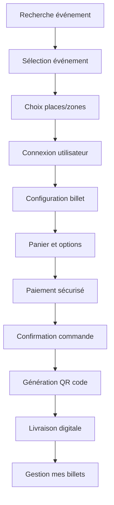
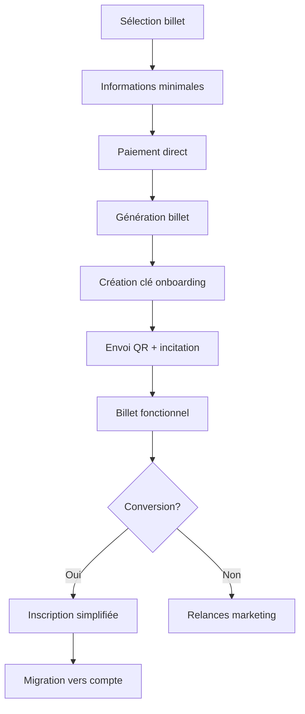
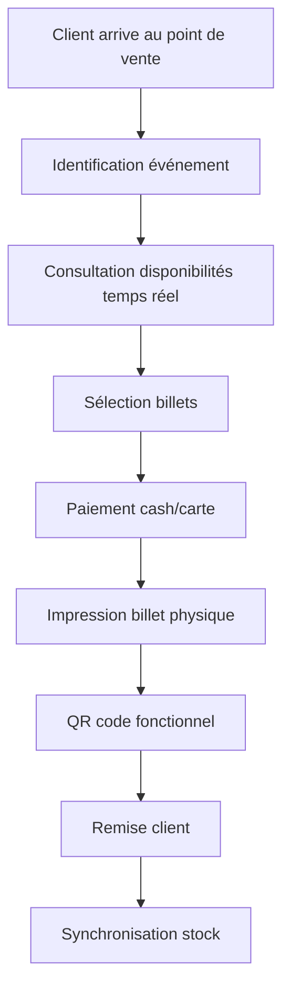
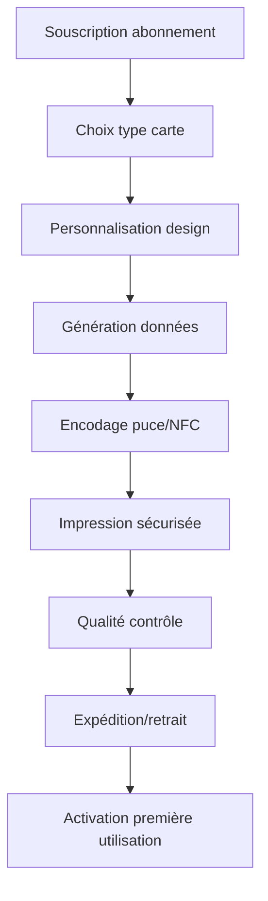
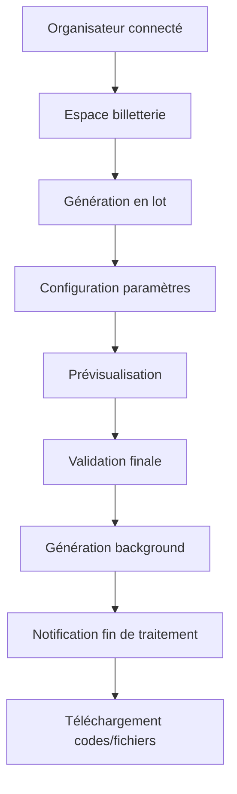

# Processus Business Entrix V3.0
## Groupe Fonctionnel : Système de billetterie avancé

---

## 📋 Vue d'ensemble

Ce groupe fonctionnel couvre l'écosystème complet de billetterie d'Entrix V3.0, incluant les **innovations révolutionnaires de billetterie anonyme**, le **système d'onboarding intelligent**, et la **génération de masse** pour organisateurs. Il constitue le cœur commercial de la plateforme.

### **Innovations V3.0**
- **🎫 Billetterie sans friction** : Achat immédiat sans création de compte
- **🔐 Onboarding intelligent** : Clés secrètes dans métadonnées pour conversion
- **🏪 Vente offline** : Support boutiques physiques et revendeurs
- **📦 Génération de masse** : Création en lot pour organisateurs
- **💳 Cartes physiques** : Support cartes à puce et NFC

---

## 🎟️ Processus d'achat de billets classique

### **Parcours utilisateur enregistré**



### **Étape 1 : Recherche et sélection**

**Critères de recherche avancés** :
```json
{
  "search_criteria": {
    "text_query": "Club Africain",
    "event_type": ["SPORTS_MATCH", "CONCERT"],
    "date_range": {
      "start": "2025-02-01",
      "end": "2025-04-30"
    },
    "location": {
      "city": "Tunis",
      "radius_km": 50
    },
    "price_range": {
      "min": 10.00,
      "max": 100.00,
      "currency": "TND"
    },
    "categories": ["FOOTBALL", "MUSIC"],
    "availability": "available_only"
  },
  "user_preferences": {
    "favorite_teams": ["Club Africain", "EST"],
    "preferred_venues": ["Stade Radès", "Stade El Menzah"],
    "notification_events": true
  }
}
```

**Algorithme de recommandation personnalisée** :
```sql
-- Recommandations personnalisées pour utilisateur connecté
CREATE OR REPLACE FUNCTION get_personalized_recommendations(
    p_user_id UUID,
    p_limit INTEGER DEFAULT 10
) RETURNS TABLE(
    event_id UUID,
    event_name TEXT,
    event_date TIMESTAMPTZ,
    venue_name TEXT,
    min_price DECIMAL,
    recommendation_score DECIMAL,
    recommendation_reason TEXT
) AS $$
BEGIN
    RETURN QUERY
    WITH user_prefs AS (
        SELECT 
            up.preferences->'favorite_teams' as fav_teams,
            up.preferences->'event_categories' as fav_categories,
            up.preferences->'preferred_venues' as fav_venues
        FROM user_profiles up
        WHERE up.user_id = p_user_id
    ),
    user_history AS (
        SELECT 
            array_agg(DISTINCT e.category) as attended_categories,
            array_agg(DISTINCT e.venue_id) as attended_venues,
            avg(t.price_paid) as avg_spending
        FROM tickets t
        JOIN events e ON t.event_id = e.id
        WHERE t.user_id = p_user_id
    ),
    event_scores AS (
        SELECT 
            e.id,
            e.name,
            e.scheduled_start,
            v.name as venue,
            (SELECT MIN(base_price) FROM ticket_types WHERE event_id = e.id) as min_price,
            
            -- Score basé sur préférences
            CASE 
                WHEN EXISTS (
                    SELECT 1 FROM event_participants ep 
                    JOIN participants p ON ep.participant_id = p.id
                    WHERE ep.event_id = e.id 
                      AND p.code = ANY(SELECT jsonb_array_elements_text(up.fav_teams))
                ) THEN 50
                ELSE 0
            END +
            CASE 
                WHEN e.category = ANY(SELECT jsonb_array_elements_text(up.fav_categories))
                THEN 30 ELSE 0
            END +
            CASE 
                WHEN e.venue_id = ANY(SELECT jsonb_array_elements_text(up.fav_venues))
                THEN 20 ELSE 0
            END +
            -- Score basé sur historique
            CASE 
                WHEN e.category = ANY(uh.attended_categories) THEN 25 ELSE 0
            END as score,
            
            -- Raison de recommandation
            CASE 
                WHEN EXISTS (
                    SELECT 1 FROM event_participants ep 
                    JOIN participants p ON ep.participant_id = p.id
                    WHERE ep.event_id = e.id 
                      AND p.code = ANY(SELECT jsonb_array_elements_text(up.fav_teams))
                ) THEN 'Votre équipe favorite joue'
                WHEN e.category = ANY(SELECT jsonb_array_elements_text(up.fav_categories))
                THEN 'Catégorie que vous aimez'
                ELSE 'Populaire dans votre région'
            END as reason
            
        FROM events e
        JOIN venues v ON e.venue_id = v.id
        CROSS JOIN user_prefs up
        CROSS JOIN user_history uh
        WHERE e.status = 'PUBLISHED'
          AND e.scheduled_start > NOW()
          AND e.scheduled_start < NOW() + INTERVAL '90 days'
          -- Pas déjà acheté
          AND NOT EXISTS (
              SELECT 1 FROM tickets t 
              WHERE t.event_id = e.id AND t.user_id = p_user_id
          )
    )
    SELECT 
        es.id, es.name, es.scheduled_start, es.venue,
        es.min_price, es.score, es.reason
    FROM event_scores es
    WHERE es.score > 0
    ORDER BY es.score DESC, es.scheduled_start ASC
    LIMIT p_limit;
END;
$$ LANGUAGE plpgsql;
```

### **Étape 2 : Configuration et sélection places**

**Interface de sélection places** :
- **Plan interactif** : Vue 2D/3D du lieu avec zones colorées
- **Filtre par prix** : Gammes tarifaires avec disponibilités
- **Qualité vue** : Indicateurs visuels (excellent, bon, obstrué)
- **Services inclus** : Parking, restauration, accès VIP
- **Accessibilité** : Places PMR et besoins spéciaux

**Logique de réservation temporaire** :
```sql
-- Réservation temporaire places (15 minutes)
CREATE OR REPLACE FUNCTION reserve_seats_temporarily(
    p_user_id UUID,
    p_event_id UUID,
    p_zone_id VARCHAR(255),
    p_seat_ids UUID[] DEFAULT NULL,
    p_ticket_type_id UUID,
    p_quantity INTEGER DEFAULT 1
) RETURNS TABLE(
    success BOOLEAN,
    reservation_id UUID,
    expires_at TIMESTAMPTZ,
    total_price DECIMAL,
    error_message TEXT
) AS $$
DECLARE
    v_reservation_id UUID;
    v_ticket_type RECORD;
    v_available_count INTEGER;
    v_total_price DECIMAL;
BEGIN
    -- Vérification type de billet et disponibilité
    SELECT * INTO v_ticket_type
    FROM ticket_types tt
    JOIN event_ticket_config etc ON tt.id = etc.ticket_type_id
    WHERE tt.id = p_ticket_type_id
      AND etc.event_id = p_event_id
      AND etc.zone_id = p_zone_id
      AND etc.is_active = TRUE;
    
    IF NOT FOUND THEN
        RETURN QUERY SELECT FALSE, NULL::UUID, NULL::TIMESTAMPTZ, 
                           0::DECIMAL, 'Type de billet non disponible';
        RETURN;
    END IF;
    
    -- Vérification disponibilité quantité
    SELECT 
        etc.quantity_available - COALESCE(
            (SELECT COUNT(*) FROM tickets t 
             WHERE t.event_id = p_event_id 
               AND t.ticket_type_id = p_ticket_type_id
               AND t.zone_id = p_zone_id
               AND t.status IN ('VALID', 'USED')), 0
        ) - COALESCE(
            (SELECT COUNT(*) FROM seat_reservations sr
             WHERE sr.event_id = p_event_id
               AND sr.zone_id = p_zone_id
               AND sr.expires_at > NOW()), 0
        ) INTO v_available_count
    FROM event_ticket_config etc
    WHERE etc.event_id = p_event_id
      AND etc.ticket_type_id = p_ticket_type_id
      AND etc.zone_id = p_zone_id;
    
    IF v_available_count < p_quantity THEN
        RETURN QUERY SELECT FALSE, NULL::UUID, NULL::TIMESTAMPTZ,
                           0::DECIMAL, 
                           'Seulement ' || v_available_count || ' places disponibles';
        RETURN;
    END IF;
    
    -- Calcul prix total
    v_total_price := v_ticket_type.base_price * p_quantity;
    
    -- Création réservation temporaire
    v_reservation_id := gen_random_uuid();
    
    INSERT INTO seat_reservations (
        id, user_id, event_id, zone_id, ticket_type_id,
        seat_ids, quantity, total_price, expires_at
    ) VALUES (
        v_reservation_id, p_user_id, p_event_id, p_zone_id, p_ticket_type_id,
        p_seat_ids, p_quantity, v_total_price,
        NOW() + INTERVAL '15 minutes'
    );
    
    RETURN QUERY SELECT TRUE, v_reservation_id, 
                       NOW() + INTERVAL '15 minutes',
                       v_total_price, 'Réservation confirmée'::TEXT;
END;
$$ LANGUAGE plpgsql;
```

---

## 🆔 Innovation : Billetterie anonyme

### **Processus d'achat sans compte**



### **Étape 1 : Collecte d'informations minimales**

**Formulaire simplifié achat anonyme** :
```json
{
  "guest_info": {
    "guest_email": "ahmed.anonyme@gmail.com",
    "guest_phone": "+21697654321",
    "guest_name": "Ahmed Anonyme",
    "marketing_consent": false
  },
  "billing_info": {
    "same_as_guest": true,
    "billing_name": "Ahmed Anonyme",
    "billing_city": "Tunis"
  },
  "event_selection": {
    "event_id": "evt_ca_vs_est_2025",
    "ticket_type_id": "std_tribune_est",
    "quantity": 2,
    "zone_id": "tribune_est_bloc_b"
  }
}
```

**Validations allégées** :
- Email : Format valide uniquement (pas de vérification existence)
- Téléphone : Format correct pour SMS de livraison
- Nom : Minimum 2 caractères pour personnalisation
- Pas de création de mot de passe requis

### **Étape 2 : Génération clé d'onboarding intelligente**

**Création automatique de clé secrète** :
```sql
-- Génération clé onboarding pour billet anonyme
CREATE OR REPLACE FUNCTION generate_onboarding_key(
    p_event_id UUID,
    p_guest_email VARCHAR(255),
    p_ticket_value DECIMAL,
    p_event_category VARCHAR(50)
) RETURNS JSONB AS $$
DECLARE
    v_secret_key VARCHAR(50);
    v_incentive_type VARCHAR(30);
    v_incentive_value DECIMAL;
    v_campaign_id VARCHAR(50);
    v_description TEXT;
BEGIN
    -- Génération clé unique
    v_secret_key := 'ONB_' || TO_CHAR(NOW(), 'YYYY_MM') || '_' || 
                    upper(encode(gen_random_bytes(6), 'hex'));
    
    -- Définition incentive selon catégorie événement et valeur billet
    CASE p_event_category
        WHEN 'SPORTS' THEN
            v_incentive_type := 'BONUS_POINTS';
            v_incentive_value := GREATEST(50, p_ticket_value * 0.1);
            v_description := v_incentive_value || ' points fidélité + accès boutique supporters';
            v_campaign_id := 'sports_onboarding_2025';
            
        WHEN 'MUSIC' THEN
            v_incentive_type := 'EARLY_ACCESS';
            v_incentive_value := 24; -- heures d'avance
            v_description := 'Accès prioritaire 24h avant ventes publiques';
            v_campaign_id := 'music_onboarding_2025';
            
        WHEN 'CULTURE' THEN
            v_incentive_type := 'DISCOUNT_PERCENT';
            v_incentive_value := 20;
            v_description := '20% de réduction sur votre prochain achat culturel';
            v_campaign_id := 'culture_onboarding_2025';
            
        ELSE
            v_incentive_type := 'WELCOME_CREDIT';
            v_incentive_value := 10;
            v_description := '10 TND de crédit cadeau sur votre compte';
            v_campaign_id := 'general_onboarding_2025';
    END CASE;
    
    -- Retour métadonnées complètes
    RETURN jsonb_build_object(
        'onboarding', jsonb_build_object(
            'secret_key', v_secret_key,
            'campaign_id', v_campaign_id,
            'incentive_type', v_incentive_type,
            'incentive_value', v_incentive_value,
            'description', v_description,
            'expires_at', NOW() + INTERVAL '6 months',
            'used', false,
            'created_at', NOW()
        ),
        'guest_profile', jsonb_build_object(
            'first_purchase_category', p_event_category,
            'first_purchase_value', p_ticket_value,
            'preferred_language', 'fr',
            'timezone', 'Africa/Tunis'
        )
    );
END;
$$ LANGUAGE plpgsql;
```

### **Étape 3 : Communication onboarding enrichie**

**Email de confirmation avec incitation** :
```html
<!DOCTYPE html>
<html>
<head>
    <meta charset="UTF-8">
    <title>🎫 Vos billets Club Africain vs EST + Surprise exclusive !</title>
</head>
<body style="font-family: Arial, sans-serif;">
    <div style="max-width: 600px; margin: 0 auto;">
        <!-- Header -->
        <div style="background: linear-gradient(45deg, #FF6B6B, #4ECDC4); padding: 20px; text-align: center;">
            <h1 style="color: white; margin: 0;">🎫 Vos billets sont prêts, Ahmed !</h1>
        </div>
        
        <!-- Contenu principal -->
        <div style="padding: 20px; background: #f9f9f9;">
            <h2>Club Africain vs EST - 15 Mars 2025</h2>
            <p>Votre achat est confirmé ! Présentez simplement le QR code ci-dessous le jour J.</p>
            
            <!-- QR Code -->
            <div style="text-align: center; margin: 20px 0;">
                
                <br><small>Code billet: TKT_12345_ABCD</small>
            </div>
            
            <!-- Incentive -->
            <div style="background: #FFD93D; padding: 15px; border-radius: 10px; margin: 20px 0;">
                <h3 style="margin: 0; color: #333;">🎁 OFFRE EXCLUSIVE POUR VOUS</h3>
                <p style="margin: 5px 0;">En créant votre compte Entrix (30 secondes), recevez :</p>
                <ul style="margin: 10px 0;">
                    <li>✅ <strong>75 points fidélité</strong> (= 7.5 TND de crédit)</li>
                    <li>✅ <strong>Accès boutique supporters</strong> en exclusivité</li>
                    <li>✅ <strong>Notifications matchs CA</strong> avant tout le monde</li>
                    <li>✅ <strong>Gestion simplifiée</strong> de tous vos billets</li>
                </ul>
                
                <div style="text-align: center; margin: 15px 0;">
                    <a href="https://entrix.tn/onboard/ONB_2025_02_A1B2C3" 
                       style="background: #FF4757; color: white; padding: 15px 30px; 
                              text-decoration: none; border-radius: 5px; display: inline-block;">
                        🚀 CRÉER MON COMPTE - 30 SECONDES
                    </a>
                </div>
                
                <p style="font-size: 12px; color: #666; text-align: center;">
                    Code: ONB_2025_02_A1B2C3 | Valable jusqu'au 15 Août 2025
                </p>
            </div>
            
            <!-- Infos pratiques -->
            <div style="background: white; padding: 15px; border-radius: 5px;">
                <h4>ℹ️ Informations pratiques</h4>
                <p><strong>📍 Lieu :</strong> Stade Radès, Tunis<br>
                   <strong>🕐 Heure :</strong> 15h00 (portes ouvertes 13h30)<br>
                   <strong>🎫 Zone :</strong> Tribune Est - Bloc B<br>
                   <strong>🚗 Parking :</strong> Gratuit (arrivée conseillée 14h)</p>
            </div>
        </div>
        
        <!-- Footer -->
        <div style="background: #333; color: white; padding: 15px; text-align: center;">
            <p>Questions ? Contactez-nous : support@entrix.tn | +216 70 123 456</p>
        </div>
    </div>
</body>
</html>
```

**SMS de rappel ciblé** :
```
🎫 Ahmed, votre billet CA vs EST est prêt !
QR code: https://entrix.tn/t/ABC123

🎁 BONUS: 75 pts fidélité en créant votre compte:
https://entrix.tn/onboard/ONB_2025_02_A1B2C3

Bon match ! ⚽
```

---

## 🏪 Processus de vente offline

### **Vente en boutiques physiques**

**Types de points de vente** :
- **Boutiques officielles clubs** : Stade, centres commerciaux
- **Bureaux de tabac** : Réseau national étendu
- **Magasins partenaires** : Carrefour, Monoprix, etc.
- **Guichets venues** : Billetteries sur site événements

### **Workflow vente offline**



### **Système de points de vente (POS)**

**Interface caissier simplifiée** :
```json
{
  "pos_interface": {
    "search_events": {
      "quick_filters": ["Ce weekend", "Cette semaine", "Ce mois"],
      "popular_events": ["CA vs EST", "Concert Latifa", "Festival Carthage"],
      "search_bar": "Recherche rapide par nom/date"
    },
    "ticket_selection": {
      "zones_visual": "Plan simplifié avec prix",
      "quantity_selector": "Sélecteur rapide 1-10",
      "customer_info": {
        "name": "Nom pour impression",
        "phone": "Optionnel pour SMS",
        "email": "Optionnel pour envoi"
      }
    },
    "payment": {
      "methods": ["CASH", "CARD", "FLOUCI"],
      "change_calculation": "Automatique",
      "receipt_options": ["Imprimé", "SMS", "Email"]
    }
  }
}
```

**Gestion stock temps réel** :
```sql
-- Synchronisation stock POS avec central
CREATE OR REPLACE FUNCTION sync_pos_sale(
    p_pos_id VARCHAR(50),
    p_event_id UUID,
    p_ticket_type_id UUID,
    p_quantity INTEGER,
    p_customer_name VARCHAR(255),
    p_customer_phone VARCHAR(20) DEFAULT NULL,
    p_payment_method VARCHAR(20),
    p_total_amount DECIMAL
) RETURNS TABLE(
    success BOOLEAN,
    ticket_numbers TEXT[],
    qr_codes TEXT[],
    error_message TEXT
) AS $$
DECLARE
    v_available INTEGER;
    v_ticket_ids UUID[];
    v_ticket_numbers TEXT[];
    v_qr_codes TEXT[];
    v_i INTEGER;
BEGIN
    -- Vérification stock disponible avec verrou
    SELECT 
        etc.quantity_available - COALESCE((
            SELECT COUNT(*) FROM tickets 
            WHERE event_id = p_event_id 
              AND ticket_type_id = p_ticket_type_id 
              AND status IN ('VALID', 'USED')
        ), 0) INTO v_available
    FROM event_ticket_config etc
    WHERE etc.event_id = p_event_id 
      AND etc.ticket_type_id = p_ticket_type_id
    FOR UPDATE;
    
    IF v_available < p_quantity THEN
        RETURN QUERY SELECT FALSE, NULL::TEXT[], NULL::TEXT[],
                           'Stock insuffisant: ' || v_available || ' disponibles';
        RETURN;
    END IF;
    
    -- Création billets
    v_ticket_ids := ARRAY[]::UUID[];
    v_ticket_numbers := ARRAY[]::TEXT[];
    v_qr_codes := ARRAY[]::TEXT[];
    
    FOR v_i IN 1..p_quantity LOOP
        DECLARE
            v_ticket_id UUID;
            v_ticket_number VARCHAR(50);
            v_qr_code VARCHAR(255);
        BEGIN
            v_ticket_id := gen_random_uuid();
            v_ticket_number := 'POS_' || TO_CHAR(NOW(), 'YYYYMMDD') || '_' || 
                              LPAD(nextval('ticket_number_seq')::text, 6, '0');
            v_qr_code := 'QR_' || upper(encode(gen_random_bytes(16), 'hex'));
            
            INSERT INTO tickets (
                id, event_id, ticket_type_id, ticket_number,
                qr_code, user_id, guest_name, guest_phone,
                status, source_channel, pos_id,
                price_paid, currency, issued_at
            ) VALUES (
                v_ticket_id, p_event_id, p_ticket_type_id, v_ticket_number,
                v_qr_code, NULL, p_customer_name, p_customer_phone,
                'VALID', 'PHYSICAL_POS', p_pos_id,
                p_total_amount / p_quantity, 'TND', NOW()
            );
            
            v_ticket_ids := array_append(v_ticket_ids, v_ticket_id);
            v_ticket_numbers := array_append(v_ticket_numbers, v_ticket_number);
            v_qr_codes := array_append(v_qr_codes, v_qr_code);
        END;
    END LOOP;
    
    -- Enregistrement transaction POS
    INSERT INTO pos_transactions (
        pos_id, event_id, ticket_ids, customer_name,
        payment_method, total_amount, transaction_at
    ) VALUES (
        p_pos_id, p_event_id, v_ticket_ids, p_customer_name,
        p_payment_method, p_total_amount, NOW()
    );
    
    RETURN QUERY SELECT TRUE, v_ticket_numbers, v_qr_codes, 'Vente réussie'::TEXT;
END;
$$ LANGUAGE plpgsql;
```

### **Cartes physiques d'abonnement**

**Types de cartes supportées** :
- **Cartes magnétiques** : Technologie traditionnelle
- **Cartes à puce** : Sécurité renforcée
- **Cartes NFC** : Scan sans contact rapide
- **Cartes hybrides** : QR code + puce/NFC

**Processus émission carte physique** :


**Données encodées sur carte** :
```json
{
  "card_data": {
    "subscription_id": "SUB_CA_2025_123456",
    "holder_name": "AHMED BEN SALAH",
    "card_number": "5999 0001 2345 6789",
    "valid_from": "2025-01-01",
    "valid_until": "2025-12-31",
    "access_rights": {
      "venues": ["stade_rades", "stade_menzah"],
      "zones": ["tribune_presidentielle", "tribune_est"],
      "events_included": "all_ca_home_matches",
      "special_access": ["vip_parking", "fast_track_entry"]
    },
    "security": {
      "encryption_key": "AES256_ENCRYPTED",
      "pin_required": false,
      "biometric_enrolled": false
    }
  }
}
```

---

## 📦 Génération de masse pour organisateurs

### **Interface organisateur génération en lot**

**Cas d'usage typiques** :
- **Billets gratuits** : Invitations partenaires, sponsors, médias
- **Billets corporate** : Entreprises clientes en nombre
- **Promotions spéciales** : Campagnes marketing ciblées
- **Ventes B2B** : Revendeurs et affiliés

### **Workflow génération masse**



**Interface de configuration** :
```json
{
  "bulk_generation_config": {
    "event_id": "evt_concert_latifa_2025",
    "ticket_type_id": "vip_hospitality",
    "quantity": 500,
    "generation_mode": "ANONYMOUS_WITH_ONBOARDING",
    
    "recipient_data": {
      "source": "CSV_UPLOAD", // ou MANUAL ou API_IMPORT
      "file_path": "/uploads/invites_vip.csv",
      "required_fields": ["name", "email", "company", "role"],
      "optional_fields": ["phone", "dietary_restrictions"]
    },
    
    "onboarding_config": {
      "campaign_id": "vip_latifa_concert_2025",
      "incentive_type": "EXCLUSIVE_CONTENT",
      "incentive_description": "Accès backstage virtuel + rencontre VIP",
      "custom_message": "Vous êtes invité(e) par {organizer_name} au concert exceptionnel..."
    },
    
    "delivery_options": {
      "email_template": "vip_invitation_latifa",
      "send_immediately": false,
      "scheduled_send": "2025-02-15T09:00:00Z",
      "include_calendar_invite": true,
      "pdf_attachment": true
    },
    
    "security_settings": {
      "transferable": false,
      "max_uses": 1,
      "valid_from": "2025-03-10T18:00:00Z",
      "valid_until": "2025-03-10T23:59:59Z"
    }
  }
}
```

### **Processus de génération en arrière-plan**

**Job asynchrone de génération** :
```sql
-- Fonction génération en masse avec gestion d'erreurs
CREATE OR REPLACE FUNCTION generate_bulk_tickets(
    p_job_id UUID,
    p_organizer_id UUID,
    p_config JSONB
) RETURNS VOID AS $$
DECLARE
    v_recipient RECORD;
    v_ticket_id UUID;
    v_qr_code VARCHAR(255);
    v_success_count INTEGER := 0;
    v_error_count INTEGER := 0;
    v_errors TEXT[] := ARRAY[]::TEXT[];
BEGIN
    -- Mise à jour statut job
    UPDATE bulk_generation_jobs 
    SET status = 'PROCESSING', started_at = NOW()
    WHERE id = p_job_id;
    
    -- Parcours des destinataires
    FOR v_recipient IN 
        SELECT * FROM bulk_recipients WHERE job_id = p_job_id
    LOOP
        BEGIN
            -- Génération QR code unique
            v_qr_code := 'BULK_' || TO_CHAR(NOW(), 'YYYYMMDD') || '_' || 
                        upper(encode(gen_random_bytes(12), 'hex'));
            
            -- Création billet
            INSERT INTO tickets (
                id, event_id, ticket_type_id, qr_code,
                user_id, guest_name, guest_email, guest_phone,
                organizer_id, status, source_channel,
                metadata, issued_at
            ) VALUES (
                gen_random_uuid(),
                (p_config->>'event_id')::UUID,
                (p_config->>'ticket_type_id')::UUID,
                v_qr_code,
                NULL, -- Anonyme par défaut
                v_recipient.name,
                v_recipient.email,
                v_recipient.phone,
                p_organizer_id,
                'VALID',
                'BULK_GENERATION',
                jsonb_build_object(
                    'bulk_job_id', p_job_id,
                    'recipient_data', row_to_json(v_recipient),
                    'onboarding', generate_onboarding_metadata(p_config)
                ),
                NOW()
            ) RETURNING id INTO v_ticket_id;
            
            -- Création droit d'accès
            INSERT INTO access_rights (
                qr_code, ticket_id, organizer_id, access_type,
                valid_from, valid_until, max_uses
            ) VALUES (
                v_qr_code, v_ticket_id, p_organizer_id, 'TICKET',
                (p_config->'security_settings'->>'valid_from')::TIMESTAMPTZ,
                (p_config->'security_settings'->>'valid_until')::TIMESTAMPTZ,
                (p_config->'security_settings'->>'max_uses')::INTEGER
            );
            
            v_success_count := v_success_count + 1;
            
        EXCEPTION WHEN OTHERS THEN
            v_error_count := v_error_count + 1;
            v_errors := array_append(v_errors, 
                'Erreur pour ' || v_recipient.email || ': ' || SQLERRM);
        END;
        
        -- Mise à jour progression toutes les 100 générations
        IF (v_success_count + v_error_count) % 100 = 0 THEN
            UPDATE bulk_generation_jobs 
            SET progress_count = v_success_count + v_error_count
            WHERE id = p_job_id;
        END IF;
    END LOOP;
    
    -- Finalisation job
    UPDATE bulk_generation_jobs 
    SET 
        status = CASE WHEN v_error_count = 0 THEN 'COMPLETED' ELSE 'COMPLETED_WITH_ERRORS' END,
        completed_at = NOW(),
        success_count = v_success_count,
        error_count = v_error_count,
        error_details = v_errors
    WHERE id = p_job_id;
    
    -- Notification organisateur
    PERFORM notify_bulk_generation_complete(p_organizer_id, p_job_id);
    
END;
$$ LANGUAGE plpgsql;
```

### **Gestion des livrables**

**Export des billets générés** :
- **Fichier CSV** : Liste complète avec QR codes
- **PDF groupé** : Billets imprimables par lot
- **Archive ZIP** : PDFs individuels par destinataire
- **API endpoints** : Accès programmatique pour intégrations

**Template email personnalisé organisateur** :
```html
Subject: 🎭 Votre invitation exclusive - Concert Latifa | Invitation par {organizer_name}

Cher/Chère {recipient_name},

{organizer_name} a le plaisir de vous inviter au concert exceptionnel de Latifa.

📅 Date : 10 Mars 2025 à 20h00
📍 Lieu : Théâtre de Carthage
🎫 Zone : VIP Hospitalité (comprend cocktail + rencontre)

Votre billet personnel :
[QR CODE]

🎁 BONUS EXCLUSIF :
En tant qu'invité(e) VIP, créez votre compte Entrix pour accéder :
✅ Contenu backstage exclusif du concert
✅ Vidéo rencontre privée avec Latifa
✅ Photos haute qualité de la soirée
✅ Invitations futures en avant-première

👆 [ACCÉDER AU CONTENU EXCLUSIF - CODE: {onboarding_key}]

Au plaisir de vous accueillir,
L'équipe {organizer_name}
```

---

## 📊 Analytics et optimisation billetterie

### **Métriques de performance V3.0**

**KPIs acquisition** :
```sql
-- Dashboard performance billetterie anonyme vs classique
CREATE OR REPLACE VIEW billetterie_performance_dashboard AS
SELECT 
    -- Ventes globales
    COUNT(*) as total_tickets_sold,
    SUM(price_paid) as total_revenue,
    
    -- Répartition anonyme vs enregistré
    COUNT(*) FILTER (WHERE user_id IS NULL) as anonymous_sales,
    COUNT(*) FILTER (WHERE user_id IS NOT NULL) as registered_sales,
    
    ROUND(COUNT(*) FILTER (WHERE user_id IS NULL)::DECIMAL / COUNT(*) * 100, 2) as anonymous_percentage,
    
    -- Performance onboarding
    COUNT(*) FILTER (WHERE metadata->>'onboarding' IS NOT NULL) as onboarding_enabled,
    COUNT(*) FILTER (WHERE metadata->'onboarding'->>'used' = 'true') as onboarding_converted,
    
    -- Calcul taux conversion
    ROUND(
        COUNT(*) FILTER (WHERE metadata->'onboarding'->>'used' = 'true')::DECIMAL /
        COUNT(*) FILTER (WHERE metadata->>'onboarding' IS NOT NULL) * 100, 2
    ) as onboarding_conversion_rate,
    
    -- Revenus moyens
    ROUND(AVG(price_paid), 2) as avg_ticket_price,
    ROUND(AVG(price_paid) FILTER (WHERE user_id IS NULL), 2) as avg_anonymous_price,
    ROUND(AVG(price_paid) FILTER (WHERE user_id IS NOT NULL), 2) as avg_registered_price,
    
    -- Performance par canal
    COUNT(*) FILTER (WHERE source_channel = 'DIRECT') as direct_sales,
    COUNT(*) FILTER (WHERE source_channel = 'MOBILE_APP') as mobile_sales,
    COUNT(*) FILTER (WHERE source_channel = 'PHYSICAL_POS') as offline_sales,
    COUNT(*) FILTER (WHERE source_channel = 'BULK_GENERATION') as bulk_sales

FROM tickets 
WHERE created_at >= CURRENT_DATE - INTERVAL '30 days'
  AND status IN ('VALID', 'USED');
```

**Segmentation comportementale** :
```sql
-- Analyse comportementale utilisateurs anonymes
WITH anonymous_behavior AS (
    SELECT 
        guest_email,
        guest_name,
        COUNT(*) as total_purchases,
        SUM(price_paid) as total_spent,
        AVG(price_paid) as avg_purchase,
        array_agg(DISTINCT e.category) as categories_purchased,
        MIN(t.created_at) as first_purchase,
        MAX(t.created_at) as last_purchase,
        
        -- Analyse onboarding
        COUNT(*) FILTER (WHERE metadata->>'onboarding' IS NOT NULL) as onboarding_opportunities,
        COUNT(*) FILTER (WHERE metadata->'onboarding'->>'used' = 'true') as onboarding_conversions
        
    FROM tickets t
    JOIN events e ON t.event_id = e.id
    WHERE t.user_id IS NULL
      AND t.guest_email IS NOT NULL
    GROUP BY guest_email, guest_name
)
SELECT 
    -- Segmentation par valeur
    CASE 
        WHEN total_spent >= 200 THEN 'HIGH_VALUE'
        WHEN total_spent >= 100 THEN 'MEDIUM_VALUE'
        WHEN total_spent >= 50 THEN 'LOW_VALUE'
        ELSE 'OCCASIONAL'
    END as value_segment,
    
    -- Segmentation par fréquence
    CASE 
        WHEN total_purchases >= 5 THEN 'FREQUENT'
        WHEN total_purchases >= 3 THEN 'REGULAR'
        WHEN total_purchases >= 2 THEN 'REPEAT'
        ELSE 'ONE_TIME'
    END as frequency_segment,
    
    -- Potentiel conversion
    CASE 
        WHEN onboarding_conversions > 0 THEN 'CONVERTED'
        WHEN onboarding_opportunities > 0 THEN 'PENDING_CONVERSION'
        ELSE 'NO_ONBOARDING_SENT'
    END as conversion_status,
    
    COUNT(*) as users_count,
    AVG(total_spent) as avg_spent_per_segment,
    AVG(total_purchases) as avg_purchases_per_segment
    
FROM anonymous_behavior
GROUP BY value_segment, frequency_segment, conversion_status
ORDER BY value_segment DESC, frequency_segment DESC;
```

---

Cette documentation couvre l'ensemble du système de billetterie avancé d'Entrix V3.0, des processus classiques aux innovations révolutionnaires d'anonymat et de génération de masse, permettant une flexibilité maximale pour tous les types d'organisateurs et d'événements.