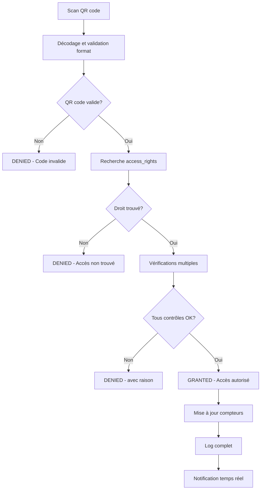
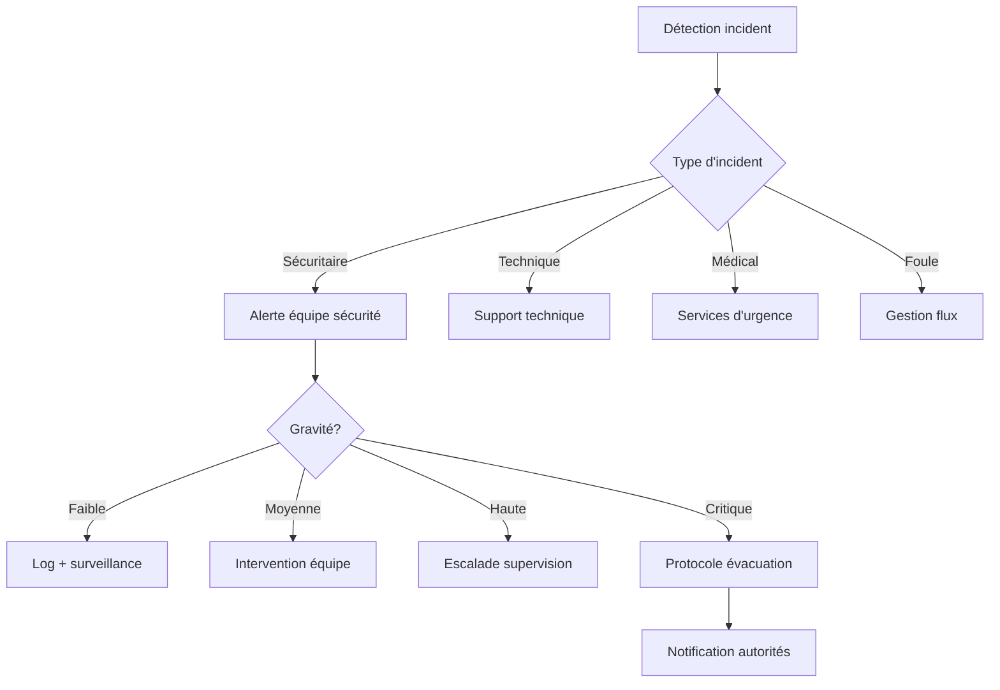

# Processus Business Entrix V3.0
## Groupe Fonctionnel : Contrôle d'accès unifié

---

## 📋 Vue d'ensemble

Ce groupe fonctionnel constitue le **cœur opérationnel** d'Entrix V3.0 avec son **système de contrôle d'accès unifié** qui centralise TOUS les types d'accès : billets, abonnements, staff, VIP, et **accès anonymes**. Il assure la **validation temps réel**, la **traçabilité complète** et la **gestion des flux** lors des événements.

### **Architecture centrale V3.0**
- **🎯 Table pivot universelle** : `access_rights` centralise tous les droits d'accès
- **📱 QR codes universels** : Un seul système pour tous types d'accès
- **🔓 Support anonyme natif** : Validation sans utilisateur associé
- **⚡ Performance temps réel** : Validation sub-seconde massive
- **📊 Analytics avancés** : Monitoring flux et sécurité en continu

---

## 🚪 Processus de contrôle d'accès temps réel

### **Workflow de validation universel**



### **Étape 1 : Scan et décodage QR**

**Technologies de scan supportées** :
- **Scanners dédiés** : Honeywell, Zebra, Symbol
- **Applications mobiles** : iOS/Android avec caméra
- **Terminaux fixes** : Bornes d'accès autonomes
- **Lecteurs NFC** : Pour cartes physiques d'abonnement

**Validation format QR code** :
```sql
-- Fonction validation et décodage QR code
CREATE OR REPLACE FUNCTION decode_and_validate_qr(
    p_qr_code VARCHAR(255),
    p_venue_id VARCHAR(255),
    p_entry_point VARCHAR(100)
) RETURNS TABLE(
    is_valid BOOLEAN,
    access_right_id UUID,
    access_type VARCHAR(50),
    error_code VARCHAR(20),
    error_message TEXT
) AS $$
DECLARE
    v_access_right RECORD;
BEGIN
    -- Validation format de base
    IF p_qr_code IS NULL OR LENGTH(p_qr_code) < 10 THEN
        RETURN QUERY SELECT FALSE, NULL::UUID, NULL::VARCHAR, 
                           'INVALID_FORMAT', 'Format QR code invalide';
        RETURN;
    END IF;
    
    -- Recherche droit d'accès
    SELECT * INTO v_access_right
    FROM access_rights ar
    WHERE ar.qr_code = p_qr_code;
    
    IF NOT FOUND THEN
        RETURN QUERY SELECT FALSE, NULL::UUID, NULL::VARCHAR,
                           'NOT_FOUND', 'QR code non reconnu';
        RETURN;
    END IF;
    
    -- Validation venue si spécifiée
    IF v_access_right.venue_id IS NOT NULL 
       AND v_access_right.venue_id != p_venue_id THEN
        RETURN QUERY SELECT FALSE, v_access_right.id, v_access_right.access_type,
                           'WRONG_VENUE', 'QR code non valide pour ce lieu';
        RETURN;
    END IF;
    
    RETURN QUERY SELECT TRUE, v_access_right.id, v_access_right.access_type,
                       'VALID', 'QR code valide';
END;
$$ LANGUAGE plpgsql;
```

### **Étape 2 : Vérifications de sécurité complètes**

**Contrôles automatiques exhaustifs** :
```sql
-- Fonction complète de validation accès
CREATE OR REPLACE FUNCTION validate_access_comprehensive(
    p_qr_code VARCHAR(255),
    p_venue_id VARCHAR(255),
    p_entry_point VARCHAR(100),
    p_scan_timestamp TIMESTAMPTZ DEFAULT NOW(),
    p_agent_id UUID DEFAULT NULL
) RETURNS TABLE(
    result VARCHAR(20),
    access_granted BOOLEAN,
    user_display_name TEXT,
    access_type VARCHAR(50),
    remaining_uses INTEGER,
    special_instructions TEXT[],
    alert_level VARCHAR(10),
    denial_reason TEXT
) AS $$
DECLARE
    v_access RECORD;
    v_current_time TIMESTAMPTZ := p_scan_timestamp;
    v_alerts TEXT[] := ARRAY[]::TEXT[];
    v_instructions TEXT[] := ARRAY[]::TEXT[];
    v_denial_reason TEXT := NULL;
BEGIN
    -- Récupération droit d'accès avec données liées
    SELECT 
        ar.*,
        COALESCE(u.first_name || ' ' || u.last_name, ar.guest_name, 'Utilisateur anonyme') as display_name,
        e.name as event_name,
        e.scheduled_start,
        v.name as venue_name
    INTO v_access
    FROM access_rights ar
    LEFT JOIN users u ON ar.user_id = u.id
    LEFT JOIN events e ON ar.event_id = e.id
    LEFT JOIN venues v ON ar.venue_id = v.id
    WHERE ar.qr_code = p_qr_code;
    
    IF NOT FOUND THEN
        RETURN QUERY SELECT 'DENIED'::VARCHAR, FALSE, 'Inconnu'::TEXT, 
                           NULL::VARCHAR, 0, ARRAY[]::TEXT[], 'HIGH'::VARCHAR,
                           'QR code non reconnu dans le système';
        RETURN;
    END IF;
    
    -- 1. Vérification statut
    IF v_access.status != 'ACTIVE' THEN
        v_denial_reason := CASE v_access.status
            WHEN 'PENDING' THEN 'Accès non encore activé'
            WHEN 'SUSPENDED' THEN 'Accès temporairement suspendu'
            WHEN 'REVOKED' THEN 'Accès révoqué définitivement'
            WHEN 'EXPIRED' THEN 'Accès expiré'
            WHEN 'USED' THEN 'Accès déjà entièrement utilisé'
            ELSE 'Statut accès invalide: ' || v_access.status
        END;
        
        RETURN QUERY SELECT 'DENIED'::VARCHAR, FALSE, v_access.display_name,
                           v_access.access_type, 0, ARRAY[]::TEXT[], 'MEDIUM'::VARCHAR,
                           v_denial_reason;
        RETURN;
    END IF;
    
    -- 2. Vérification période de validité
    IF v_current_time < v_access.valid_from THEN
        v_denial_reason := 'Accès pas encore valide. Valide à partir du ' || 
                          to_char(v_access.valid_from, 'DD/MM/YYYY HH24:MI');
        
        RETURN QUERY SELECT 'DENIED'::VARCHAR, FALSE, v_access.display_name,
                           v_access.access_type, v_access.max_uses - v_access.current_uses,
                           ARRAY[]::TEXT[], 'LOW'::VARCHAR, v_denial_reason;
        RETURN;
    END IF;
    
    IF v_current_time > v_access.valid_until THEN
        v_denial_reason := 'Accès expiré depuis le ' || 
                          to_char(v_access.valid_until, 'DD/MM/YYYY HH24:MI');
        
        RETURN QUERY SELECT 'DENIED'::VARCHAR, FALSE, v_access.display_name,
                           v_access.access_type, 0, ARRAY[]::TEXT[], 'MEDIUM'::VARCHAR,
                           v_denial_reason;
        RETURN;
    END IF;
    
    -- 3. Vérification nombre d'utilisations
    IF v_access.current_uses >= v_access.max_uses THEN
        v_denial_reason := 'Nombre maximum d''utilisations atteint (' || 
                          v_access.max_uses || ')';
        
        RETURN QUERY SELECT 'DENIED'::VARCHAR, FALSE, v_access.display_name,
                           v_access.access_type, 0, ARRAY[]::TEXT[], 'MEDIUM'::VARCHAR,
                           v_denial_reason;
        RETURN;
    END IF;
    
    -- 4. Vérification venue/zone si spécifiées
    IF v_access.venue_id IS NOT NULL AND v_access.venue_id != p_venue_id THEN
        v_denial_reason := 'Accès non autorisé pour ce lieu. Valide pour: ' || 
                          v_access.venue_name;
        
        RETURN QUERY SELECT 'DENIED'::VARCHAR, FALSE, v_access.display_name,
                           v_access.access_type, v_access.max_uses - v_access.current_uses,
                           ARRAY[]::TEXT[], 'HIGH'::VARCHAR, v_denial_reason;
        RETURN;
    END IF;
    
    -- 5. Vérifications spéciales selon type d'accès
    IF v_access.access_type = 'TICKET' AND v_access.event_id IS NOT NULL THEN
        -- Vérification horaires événement
        IF v_access.scheduled_start IS NOT NULL THEN
            IF v_current_time > v_access.scheduled_start + INTERVAL '3 hours' THEN
                v_alerts := array_append(v_alerts, 'LATE_ARRIVAL');
                v_instructions := array_append(v_instructions, 
                    'Arrivée tardive - Vérifier si événement toujours en cours');
            ELSIF v_current_time < v_access.scheduled_start - INTERVAL '2 hours' THEN
                v_alerts := array_append(v_alerts, 'EARLY_ARRIVAL');
                v_instructions := array_append(v_instructions, 
                    'Arrivée très anticipée - Événement commence à ' || 
                    to_char(v_access.scheduled_start, 'HH24:MI'));
            END IF;
        END IF;
    END IF;
    
    -- 6. Détection tentatives répétées suspectes
    IF EXISTS (
        SELECT 1 FROM access_control_log acl
        WHERE acl.access_right_id = v_access.id
          AND acl.created_at > NOW() - INTERVAL '5 minutes'
          AND acl.result = 'DENIED'
        HAVING COUNT(*) >= 3
    ) THEN
        v_alerts := array_append(v_alerts, 'MULTIPLE_FAILED_ATTEMPTS');
        v_instructions := array_append(v_instructions, 
            'Attention: multiples tentatives échouées récentes');
    END IF;
    
    -- 7. Vérification restrictions spéciales
    IF v_access.restrictions IS NOT NULL THEN
        -- Exemple: vérification âge, dress code, etc.
        IF v_access.restrictions ? 'age_restrictions' THEN
            v_instructions := array_append(v_instructions, 
                'Vérifier âge: ' || (v_access.restrictions->'age_restrictions'->>'minimum_age'));
        END IF;
        
        IF v_access.restrictions ? 'id_verification' 
           AND (v_access.restrictions->'entry_conditions'->>'id_verification')::BOOLEAN THEN
            v_instructions := array_append(v_instructions, 
                'Vérification identité obligatoire');
        END IF;
    END IF;
    
    -- SUCCÈS : Tous les contrôles passés
    RETURN QUERY SELECT 
        'GRANTED'::VARCHAR, TRUE, v_access.display_name, v_access.access_type,
        v_access.max_uses - v_access.current_uses - 1, -- -1 car va être utilisé
        v_instructions,
        CASE WHEN array_length(v_alerts, 1) > 0 THEN 'MEDIUM' ELSE 'LOW' END::VARCHAR,
        NULL::TEXT;
END;
$$ LANGUAGE plpgsql;
```

### **Étape 3 : Mise à jour et logging**

**Traitement post-validation** :
```sql
-- Fonction complète de traitement accès accordé
CREATE OR REPLACE FUNCTION process_granted_access(
    p_access_right_id UUID,
    p_venue_id VARCHAR(255),
    p_entry_point VARCHAR(100),
    p_agent_id UUID DEFAULT NULL,
    p_scan_metadata JSONB DEFAULT NULL
) RETURNS TABLE(
    success BOOLEAN,
    new_usage_count INTEGER,
    access_log_id UUID
) AS $$
DECLARE
    v_access_log_id UUID;
    v_new_count INTEGER;
BEGIN
    -- Incrémenter compteur d'utilisation
    UPDATE access_rights 
    SET 
        current_uses = current_uses + 1,
        last_used_at = NOW(),
        updated_at = NOW()
    WHERE id = p_access_right_id
    RETURNING current_uses INTO v_new_count;
    
    -- Créer log d'accès détaillé
    v_access_log_id := gen_random_uuid();
    
    INSERT INTO access_control_log (
        id, access_right_id, venue_id, entry_point,
        result, control_type, agent_id,
        scan_metadata, created_at
    ) VALUES (
        v_access_log_id, p_access_right_id, p_venue_id, p_entry_point,
        'GRANTED', 'ENTRY', p_agent_id,
        COALESCE(p_scan_metadata, '{}'::jsonb), NOW()
    );
    
    -- Mise à jour statistiques temps réel
    INSERT INTO real_time_venue_stats (
        venue_id, entry_point, timestamp, entries_count
    ) VALUES (
        p_venue_id, p_entry_point, 
        date_trunc('minute', NOW()), 1
    ) ON CONFLICT (venue_id, entry_point, timestamp)
    DO UPDATE SET entries_count = real_time_venue_stats.entries_count + 1;
    
    RETURN QUERY SELECT TRUE, v_new_count, v_access_log_id;
END;
$$ LANGUAGE plpgsql;
```

---

## 📱 Interface agents de contrôle

### **Application mobile agents**

**Fonctionnalités principales** :
- **Scan QR rapide** : Caméra avec autofocus et validation temps réel
- **Mode offline** : Cache local pour situations réseau dégradé  
- **Interface tactile** : Optimisée pour utilisation gants/conditions difficiles
- **Alerts visuelles** : Codes couleurs et vibrations selon résultat
- **Reporting incidents** : Signalement direct situations problématiques

**Interface de scan** :
```json
{
  "scan_interface": {
    "camera_overlay": {
      "scan_zone": "Zone centrale mise en évidence",
      "status_indicator": "Vert/Rouge selon résultat",
      "torch_button": "Éclairage LED automatique",
      "manual_entry": "Saisie code manuelle si nécessaire"
    },
    "result_display": {
      "granted": {
        "color": "#4CAF50",
        "vibration": "200ms",
        "sound": "beep_success.wav",
        "display_time": "3 seconds"
      },
      "denied": {
        "color": "#F44336", 
        "vibration": "500ms x2",
        "sound": "beep_error.wav",
        "display_time": "5 seconds"
      }
    },
    "user_info_display": {
      "name": "Nom complet ou 'Anonyme'",
      "ticket_type": "Type billet/abonnement",
      "remaining_uses": "Utilisations restantes",
      "special_notes": "Instructions spéciales"
    }
  }
}
```

### **Mode offline et synchronisation**

**Fonctionnement hors ligne** :
```javascript
// Système de cache local pour mode offline
class OfflineAccessControl {
    constructor() {
        this.cache = new Map();
        this.pendingLogs = [];
        this.isOnline = navigator.onLine;
        this.initOfflineHandling();
    }
    
    async validateAccessOffline(qrCode, venueId, entryPoint) {
        try {
            // Vérification cache local
            const cachedAccess = this.cache.get(qrCode);
            
            if (cachedAccess) {
                // Validation basique offline
                const now = new Date();
                const validFrom = new Date(cachedAccess.valid_from);
                const validUntil = new Date(cachedAccess.valid_until);
                
                if (now < validFrom || now > validUntil) {
                    return { result: 'DENIED', reason: 'Hors période validité' };
                }
                
                if (cachedAccess.current_uses >= cachedAccess.max_uses) {
                    return { result: 'DENIED', reason: 'Utilisations épuisées' };
                }
                
                // Mise à jour cache local
                cachedAccess.current_uses += 1;
                cachedAccess.last_used_at = now.toISOString();
                
                // Log en attente de synchronisation
                this.pendingLogs.push({
                    qr_code: qrCode,
                    venue_id: venueId,
                    entry_point: entryPoint,
                    result: 'GRANTED',
                    timestamp: now.toISOString(),
                    sync_status: 'PENDING'
                });
                
                return { 
                    result: 'GRANTED', 
                    user_name: cachedAccess.display_name,
                    remaining_uses: cachedAccess.max_uses - cachedAccess.current_uses,
                    offline_mode: true
                };
            } else {
                // QR non en cache - refus par sécurité
                return { 
                    result: 'DENIED', 
                    reason: 'QR code non reconnu (mode offline)' 
                };
            }
        } catch (error) {
            console.error('Erreur validation offline:', error);
            return { result: 'ERROR', reason: 'Erreur système' };
        }
    }
    
    async syncWhenOnline() {
        if (!this.isOnline || this.pendingLogs.length === 0) return;
        
        try {
            const response = await fetch('/api/access-control/sync-offline', {
                method: 'POST',
                headers: { 'Content-Type': 'application/json' },
                body: JSON.stringify({
                    logs: this.pendingLogs,
                    cache_updates: Array.from(this.cache.entries())
                })
            });
            
            if (response.ok) {
                this.pendingLogs = [];
                console.log('Synchronisation offline réussie');
            }
        } catch (error) {
            console.error('Erreur synchronisation:', error);
        }
    }
}
```

---

## 🏟️ Gestion des points d'accès

### **Configuration points d'entrée**

**Types de points d'accès** :
- **MAIN_ENTRANCE** : Entrées principales grand public
- **VIP_ENTRANCE** : Entrées dédiées VIP et hospitalité
- **STAFF_ENTRANCE** : Personnel et prestataires
- **EMERGENCY_EXIT** : Sorties de secours (monitoring)
- **ZONE_TRANSITION** : Passages inter-zones

**Configuration point d'accès** :
```json
{
  "access_point_config": {
    "venue_id": "stade_rades",
    "code": "GATE_A_MAIN",
    "name": "Porte A - Entrée Principale",
    "type": "MAIN_ENTRANCE",
    "location": {
      "gps": {"lat": 36.7450, "lng": 10.2749},
      "description": "Face parking principal",
      "access_instructions": "Suivre signalétique bleue"
    },
    "capacity": {
      "theoretical_per_hour": 3000,
      "lanes_count": 6,
      "peak_capacity": 4500
    },
    "zones_served": [
      "tribune_presidentielle",
      "tribune_est", 
      "zone_vip_hospitality"
    ],
    "equipment": {
      "scanners": ["scanner_pro_x5_001", "scanner_pro_x5_002"],
      "security": ["metal_detector_001", "xray_scanner_001"],
      "communication": ["radio_base_001", "emergency_phone"]
    },
    "staffing": {
      "required_agents": 8,
      "supervisor_required": true,
      "security_guards": 4,
      "technical_support": 1
    },
    "schedule": {
      "opens_before_event": "03:00:00",
      "closes_after_event": "01:00:00",
      "emergency_always_monitored": true
    }
  }
}
```

### **Gestion des flux et congestion**

**Détection automatique de congestion** :
```sql
-- Système d'alerte congestion temps réel
CREATE OR REPLACE FUNCTION monitor_entry_congestion(
    p_venue_id VARCHAR(255)
) RETURNS TABLE(
    entry_point VARCHAR(100),
    current_rate_per_minute DECIMAL,
    theoretical_capacity DECIMAL,
    congestion_level VARCHAR(20),
    suggested_action TEXT,
    estimated_wait_time_minutes INTEGER
) AS $$
BEGIN
    RETURN QUERY
    WITH current_flows AS (
        SELECT 
            acl.entry_point,
            COUNT(*) FILTER (WHERE acl.created_at > NOW() - INTERVAL '5 minutes') / 5.0 as current_rate,
            ap.metadata->>'capacity_per_hour'::DECIMAL / 60.0 as theoretical_rate,
            ap.metadata->>'lanes_count'::INTEGER as lanes
        FROM access_control_log acl
        JOIN access_points ap ON acl.entry_point = ap.code
        WHERE acl.venue_id = p_venue_id
          AND acl.result = 'GRANTED'
          AND acl.created_at > NOW() - INTERVAL '10 minutes'
        GROUP BY acl.entry_point, ap.metadata
    )
    SELECT 
        cf.entry_point,
        cf.current_rate,
        cf.theoretical_rate,
        CASE 
            WHEN cf.current_rate > cf.theoretical_rate * 1.2 THEN 'CRITICAL'
            WHEN cf.current_rate > cf.theoretical_rate * 1.0 THEN 'HIGH'
            WHEN cf.current_rate > cf.theoretical_rate * 0.8 THEN 'MODERATE'
            ELSE 'LOW'
        END as congestion,
        CASE 
            WHEN cf.current_rate > cf.theoretical_rate * 1.2 THEN 
                'URGENT: Ouvrir entrées supplémentaires, rediriger flux'
            WHEN cf.current_rate > cf.theoretical_rate * 1.0 THEN 
                'Surveiller de près, préparer mesures d''urgence'
            WHEN cf.current_rate > cf.theoretical_rate * 0.8 THEN 
                'Flux soutenu, rester vigilant'
            ELSE 'Flux normal'
        END as action,
        CASE 
            WHEN cf.current_rate > cf.theoretical_rate THEN 
                GREATEST(1, ((cf.current_rate - cf.theoretical_rate) / cf.theoretical_rate * 10)::INTEGER)
            ELSE 0
        END as wait_time
    FROM current_flows cf;
END;
$$ LANGUAGE plpgsql;
```

**Redirection intelligente des flux** :
```sql
-- Suggestions redirection dynamique
CREATE OR REPLACE FUNCTION suggest_flow_redirection(
    p_venue_id VARCHAR(255),
    p_target_zones VARCHAR(255)[]
) RETURNS TABLE(
    recommended_entry VARCHAR(100),
    current_wait_time INTEGER,
    distance_meters INTEGER,
    capacity_available DECIMAL
) AS $$
BEGIN
    RETURN QUERY
    WITH zone_access AS (
        SELECT 
            ap.code,
            ap.name,
            ap.metadata->>'capacity_per_hour'::DECIMAL / 60.0 as max_rate,
            COUNT(acl.id) FILTER (WHERE acl.created_at > NOW() - INTERVAL '5 minutes') / 5.0 as current_rate,
            ap.zones_served
        FROM access_points ap
        LEFT JOIN access_control_log acl ON ap.code = acl.entry_point 
            AND acl.venue_id = p_venue_id
            AND acl.result = 'GRANTED'
        WHERE ap.venue_id = p_venue_id
          AND ap.is_active = TRUE
          AND ap.zones_served && p_target_zones -- Intersection arrays
        GROUP BY ap.code, ap.name, ap.metadata, ap.zones_served
    )
    SELECT 
        za.code,
        CASE 
            WHEN za.current_rate > za.max_rate THEN 
                ((za.current_rate - za.max_rate) / za.max_rate * 10)::INTEGER
            ELSE 0
        END as wait_time,
        100 as distance, -- À calculer avec coordonnées GPS réelles
        GREATEST(0, za.max_rate - za.current_rate) as available_capacity
    FROM zone_access za
    WHERE za.max_rate > za.current_rate
    ORDER BY available_capacity DESC, wait_time ASC;
END;
$$ LANGUAGE plpgsql;
```

---

## 🚨 Gestion des incidents et sécurité

### **Types d'incidents supportés**

**Classification des incidents** :
- **SECURITY_BREACH** : Tentative d'accès non autorisé
- **TECHNICAL_FAILURE** : Défaillance équipement/réseau
- **MEDICAL_EMERGENCY** : Urgence médicale à l'entrée
- **CROWD_ISSUE** : Problème de foule/bousculade
- **FIRE_ALARM** : Alerte incendie/évacuation
- **SUSPICIOUS_BEHAVIOR** : Comportement suspect détecté

### **Workflow de gestion d'incident**



**Processus automatique de réponse** :
```sql
-- Système de réponse automatique aux incidents
CREATE OR REPLACE FUNCTION handle_security_incident(
    p_incident_type VARCHAR(50),
    p_severity VARCHAR(20),
    p_venue_id VARCHAR(255),
    p_entry_point VARCHAR(100),
    p_description TEXT,
    p_agent_id UUID
) RETURNS TABLE(
    incident_id UUID,
    auto_actions_taken TEXT[],
    notifications_sent TEXT[],
    escalation_level VARCHAR(20)
) AS $$
DECLARE
    v_incident_id UUID;
    v_actions TEXT[] := ARRAY[]::TEXT[];
    v_notifications TEXT[] := ARRAY[]::TEXT[];
    v_escalation VARCHAR(20);
BEGIN
    -- Création incident
    v_incident_id := gen_random_uuid();
    
    INSERT INTO security_incidents (
        id, incident_type, severity, venue_id, entry_point,
        description, reported_by, created_at, status
    ) VALUES (
        v_incident_id, p_incident_type, p_severity, p_venue_id, p_entry_point,
        p_description, p_agent_id, NOW(), 'ACTIVE'
    );
    
    -- Actions automatiques selon type et gravité
    IF p_incident_type = 'SECURITY_BREACH' THEN
        IF p_severity IN ('HIGH', 'CRITICAL') THEN
            -- Blocage temporaire du point d'accès
            UPDATE access_points 
            SET is_temporarily_disabled = TRUE,
                disabled_reason = 'Incident sécurité en cours'
            WHERE venue_id = p_venue_id AND code = p_entry_point;
            
            v_actions := array_append(v_actions, 'Point d''accès temporairement fermé');
            
            -- Alerte équipes sécurité
            PERFORM send_security_alert(
                'IMMEDIATE_RESPONSE_REQUIRED',
                'Incident sécurité niveau ' || p_severity || ' à ' || p_entry_point,
                p_venue_id
            );
            
            v_notifications := array_append(v_notifications, 'Équipe sécurité alertée');
            v_escalation := 'HIGH';
        END IF;
        
    ELSIF p_incident_type = 'TECHNICAL_FAILURE' THEN
        -- Basculement vers mode manuel
        UPDATE access_points 
        SET manual_mode_only = TRUE,
            manual_mode_reason = 'Défaillance technique: ' || p_description
        WHERE venue_id = p_venue_id AND code = p_entry_point;
        
        v_actions := array_append(v_actions, 'Basculement en mode manuel');
        
        -- Alerte support technique
        PERFORM notify_technical_support(v_incident_id, p_description);
        v_notifications := array_append(v_notifications, 'Support technique notifié');
        v_escalation := 'MEDIUM';
        
    ELSIF p_incident_type = 'MEDICAL_EMERGENCY' THEN
        -- Alerte services médicaux
        PERFORM call_medical_services(p_venue_id, p_entry_point, p_description);
        v_notifications := array_append(v_notifications, 'Services médicaux appelés');
        
        -- Dégagement de la zone
        v_actions := array_append(v_actions, 'Zone dégagée pour intervention médicale');
        v_escalation := 'HIGH';
        
    ELSIF p_incident_type = 'CROWD_ISSUE' THEN
        -- Redirection des flux
        PERFORM activate_crowd_management_protocol(p_venue_id, p_entry_point);
        v_actions := array_append(v_actions, 'Protocole gestion de foule activé');
        
        -- Renfort agents
        PERFORM request_additional_staff(p_venue_id, p_entry_point, 'CROWD_CONTROL');
        v_notifications := array_append(v_notifications, 'Renfort agents demandé');
        v_escalation := 'MEDIUM';
    END IF;
    
    -- Log des actions automatiques
    UPDATE security_incidents 
    SET auto_actions = array_to_json(v_actions)::jsonb,
        notifications_sent = array_to_json(v_notifications)::jsonb,
        escalation_level = v_escalation
    WHERE id = v_incident_id;
    
    RETURN QUERY SELECT v_incident_id, v_actions, v_notifications, v_escalation;
END;
$$ LANGUAGE plpgsql;
```

### **Protocoles d'évacuation**

**Niveaux d'évacuation** :
- **NIVEAU 1** : Évacuation préventive zone spécifique
- **NIVEAU 2** : Évacuation partielle (secteurs affectés)
- **NIVEAU 3** : Évacuation générale complète
- **NIVEAU 4** : Évacuation d'urgence avec services de secours

**Processus d'évacuation automatisé** :
```sql
-- Déclenchement protocole évacuation
CREATE OR REPLACE FUNCTION initiate_evacuation_protocol(
    p_venue_id VARCHAR(255),
    p_evacuation_level INTEGER,
    p_affected_zones VARCHAR(255)[] DEFAULT NULL,
    p_reason TEXT DEFAULT 'Non spécifié'
) RETURNS TABLE(
    evacuation_id UUID,
    estimated_duration INTERVAL,
    exit_routes_activated INTEGER,
    personnel_mobilized INTEGER
) AS $$
DECLARE
    v_evacuation_id UUID;
    v_exit_routes INTEGER;
    v_personnel INTEGER;
    v_duration INTERVAL;
BEGIN
    v_evacuation_id := gen_random_uuid();
    
    -- Création ordre d'évacuation
    INSERT INTO evacuation_orders (
        id, venue_id, evacuation_level, affected_zones,
        reason, initiated_at, status
    ) VALUES (
        v_evacuation_id, p_venue_id, p_evacuation_level, p_affected_zones,
        p_reason, NOW(), 'ACTIVE'
    );
    
    -- Configuration selon niveau
    CASE p_evacuation_level
        WHEN 1 THEN -- Évacuation préventive zone
            v_duration := INTERVAL '15 minutes';
            SELECT COUNT(*) INTO v_exit_routes 
            FROM access_points 
            WHERE venue_id = p_venue_id 
              AND type IN ('EMERGENCY_EXIT', 'MAIN_ENTRANCE')
              AND zones_served && p_affected_zones;
            v_personnel := 5;
            
        WHEN 2 THEN -- Évacuation partielle
            v_duration := INTERVAL '30 minutes';
            SELECT COUNT(*) INTO v_exit_routes 
            FROM access_points 
            WHERE venue_id = p_venue_id 
              AND type IN ('EMERGENCY_EXIT', 'MAIN_ENTRANCE');
            v_personnel := 15;
            
        WHEN 3 THEN -- Évacuation générale
            v_duration := INTERVAL '45 minutes';
            SELECT COUNT(*) INTO v_exit_routes 
            FROM access_points 
            WHERE venue_id = p_venue_id;
            v_personnel := 30;
            
        WHEN 4 THEN -- Évacuation urgence
            v_duration := INTERVAL '20 minutes';
            SELECT COUNT(*) INTO v_exit_routes 
            FROM access_points 
            WHERE venue_id = p_venue_id;
            v_personnel := 50;
            
            -- Notification services d'urgence
            PERFORM notify_emergency_services(
                p_venue_id, 
                'Évacuation d''urgence en cours', 
                p_reason
            );
    END CASE;
    
    -- Activation des sorties d'urgence
    UPDATE access_points 
    SET evacuation_mode = TRUE,
        entry_disabled = TRUE,
        exit_only = TRUE
    WHERE venue_id = p_venue_id;
    
    -- Mobilisation personnel
    PERFORM mobilize_evacuation_staff(p_venue_id, v_personnel);
    
    RETURN QUERY SELECT v_evacuation_id, v_duration, v_exit_routes, v_personnel;
END;
$$ LANGUAGE plpgsql;
```

---

## 📊 Monitoring et analytics temps réel

### **Dashboard opérationnel**

**Métriques temps réel affichées** :
- **Flux d'entrée** : Entrées/minute par point d'accès
- **Taux de refus** : % et raisons principales
- **Temps d'attente** : Estimation par entrée
- **Capacité occupation** : % remplissage par zone
- **Incidents actifs** : Nombre et niveaux de gravité

**Vue consolidée performance** :
```sql
-- Dashboard temps réel contrôle d'accès
CREATE OR REPLACE VIEW real_time_access_dashboard AS
WITH venue_stats AS (
    SELECT 
        acl.venue_id,
        COUNT(*) as total_controls_today,
        COUNT(*) FILTER (WHERE acl.result = 'GRANTED') as successful_entries,
        COUNT(*) FILTER (WHERE acl.result = 'DENIED') as denied_entries,
        COUNT(*) FILTER (WHERE acl.created_at > NOW() - INTERVAL '1 hour') as controls_last_hour,
        COUNT(*) FILTER (WHERE acl.created_at > NOW() - INTERVAL '5 minutes') as controls_last_5min,
        
        -- Calcul taux de succès
        ROUND(
            COUNT(*) FILTER (WHERE acl.result = 'GRANTED')::DECIMAL / 
            NULLIF(COUNT(*), 0) * 100, 2
        ) as success_rate_percent,
        
        -- Top 3 des raisons de refus
        (SELECT array_agg(denial_reason ORDER BY count DESC)
         FROM (
             SELECT denial_reason, COUNT(*) as count
             FROM access_control_log
             WHERE venue_id = acl.venue_id 
               AND result = 'DENIED' 
               AND created_at > CURRENT_DATE
             GROUP BY denial_reason
             ORDER BY COUNT(*) DESC
             LIMIT 3
         ) top_denials) as top_denial_reasons
         
    FROM access_control_log acl
    WHERE acl.created_at > CURRENT_DATE
    GROUP BY acl.venue_id
)
SELECT 
    vs.*,
    v.name as venue_name,
    
    -- Calcul flux moyen
    ROUND(vs.controls_last_5min / 5.0, 1) as avg_controls_per_minute,
    
    -- Incidents actifs
    (SELECT COUNT(*) 
     FROM security_incidents si 
     WHERE si.venue_id = vs.venue_id 
       AND si.status = 'ACTIVE') as active_incidents,
    
    -- Personnel en service
    (SELECT COUNT(DISTINCT agent_id)
     FROM access_control_log
     WHERE venue_id = vs.venue_id
       AND created_at > NOW() - INTERVAL '1 hour'
       AND agent_id IS NOT NULL) as active_agents,
    
    -- Performance par point d'accès
    (SELECT json_agg(json_build_object(
        'entry_point', entry_point,
        'controls_5min', COUNT(*) FILTER (WHERE created_at > NOW() - INTERVAL '5 minutes'),
        'success_rate', ROUND(
            COUNT(*) FILTER (WHERE result = 'GRANTED')::DECIMAL / 
            NULLIF(COUNT(*), 0) * 100, 1
        )
    ))
     FROM access_control_log
     WHERE venue_id = vs.venue_id 
       AND created_at > NOW() - INTERVAL '1 hour'
     GROUP BY entry_point) as entry_points_performance

FROM venue_stats vs
JOIN venues v ON vs.venue_id = v.id;
```

### **Alertes automatiques intelligentes**

**Système d'alertes multicritères** :
```sql
-- Moteur d'alertes intelligent
CREATE OR REPLACE FUNCTION check_access_control_alerts()
RETURNS TABLE(
    alert_type VARCHAR(50),
    severity VARCHAR(20),
    venue_id VARCHAR(255),
    message TEXT,
    recommended_action TEXT
) AS $$
BEGIN
    -- Alerte: Taux de refus anormalement élevé
    RETURN QUERY
    SELECT 
        'HIGH_DENIAL_RATE'::VARCHAR,
        'HIGH'::VARCHAR,
        acl.venue_id,
        'Taux de refus: ' || ROUND(
            COUNT(*) FILTER (WHERE result = 'DENIED')::DECIMAL / 
            COUNT(*) * 100, 1
        ) || '% (normal: <5%)',
        'Vérifier problèmes techniques ou incidents sécurité'
    FROM access_control_log acl
    WHERE acl.created_at > NOW() - INTERVAL '15 minutes'
    GROUP BY acl.venue_id
    HAVING COUNT(*) FILTER (WHERE result = 'DENIED')::DECIMAL / COUNT(*) > 0.15;
    
    -- Alerte: Flux anormalement faible
    RETURN QUERY
    SELECT 
        'LOW_ENTRY_FLOW'::VARCHAR,
        'MEDIUM'::VARCHAR,
        e.venue_id,
        'Flux d''entrée: ' || COUNT(acl.*) || ' entrées en 10 min (attendu: >' || 
        (e.max_capacity * 0.1)::INTEGER || ')',
        'Vérifier ouverture points d''accès et communication événement'
    FROM events e
    LEFT JOIN access_control_log acl ON e.venue_id = acl.venue_id
        AND acl.created_at > NOW() - INTERVAL '10 minutes'
        AND acl.result = 'GRANTED'
    WHERE e.scheduled_start BETWEEN NOW() - INTERVAL '1 hour' AND NOW() + INTERVAL '2 hours'
      AND e.status = 'PUBLISHED'
    GROUP BY e.id, e.venue_id, e.max_capacity
    HAVING COUNT(acl.*) < e.max_capacity * 0.01; -- Moins de 1% en 10 min
    
    -- Alerte: Tentatives répétées sur même QR
    RETURN QUERY
    SELECT 
        'REPEATED_FRAUD_ATTEMPTS'::VARCHAR,
        'HIGH'::VARCHAR,
        acl.venue_id,
        'QR code ' || ar.qr_code || ' scanné ' || COUNT(*) || ' fois sans succès',
        'Investigation fraude potentielle - bloquer QR code'
    FROM access_control_log acl
    JOIN access_rights ar ON acl.access_right_id = ar.id
    WHERE acl.created_at > NOW() - INTERVAL '30 minutes'
      AND acl.result = 'DENIED'
    GROUP BY acl.venue_id, ar.qr_code
    HAVING COUNT(*) >= 5;
    
END;
$$ LANGUAGE plpgsql;
```

---

Cette documentation couvre l'ensemble du système de contrôle d'accès unifié d'Entrix V3.0, depuis la validation temps réel jusqu'à la gestion d'incidents complexes, en passant par l'interface agents et le monitoring avancé.