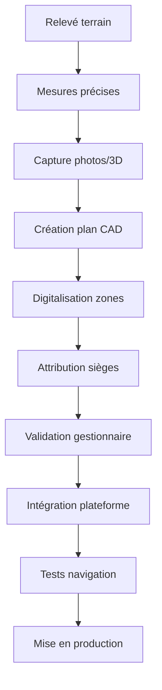

# Processus Business Entrix V3.0
## Groupe Fonctionnel : Gestion des lieux et cartographie

---

## 📋 Vue d'ensemble

Ce groupe fonctionnel gère l'écosystème complet des **lieux d'événements** sur Entrix V3.0, incluant la **cartographie détaillée**, la **gestion des capacités**, l'**optimisation des layouts** et les **services intégrés**. Il constitue la base physique de tous les événements organisés sur la plateforme.

### **Caractéristiques V3.0**
- **🗺️ Cartographie précise** : Plans 2D/3D avec granularité siège par siège
- **📱 Navigation interactive** : Réalité augmentée et guidage temps réel
- **⚙️ Configuration dynamique** : Adaptation layouts selon événements
- **📊 Analytics d'occupation** : Optimisation capacités et revenus
- **🔧 Maintenance prédictive** : Suivi équipements et infrastructures

---

## 🏟️ Types de lieux gérés

### **Lieux sportifs**

**🏈 Stades de football**
- **Stade Radès** : 60,000 places, 4 tribunes principales
- **Stade El Menzah** : 45,000 places, configuration modulaire  
- **Stade Chaker Sfax** : 35,000 places, zones VIP développées
- **Stade de Sousse** : 25,000 places, rénovation récente

**Caractéristiques spécifiques** :
```json
{
  "stadium_config": {
    "stade_rades": {
      "total_capacity": 60000,
      "zones": {
        "tribune_presidentielle": {
          "capacity": 8000,
          "type": "SEATED",
          "category": "PREMIUM",
          "services": ["vip_lounge", "premium_catering", "vip_parking"]
        },
        "tribune_est": {
          "capacity": 15000,
          "type": "SEATED", 
          "category": "STANDARD",
          "sectors": ["A", "B", "C", "D"]
        },
        "virage_nord": {
          "capacity": 12000,
          "type": "STANDING",
          "category": "SUPPORTERS",
          "atmosphere": "HIGH_ENERGY"
        },
        "virage_sud": {
          "capacity": 12000,
          "type": "STANDING", 
          "category": "SUPPORTERS",
          "visiting_team": true
        },
        "tribune_ouest": {
          "capacity": 13000,
          "type": "MIXED",
          "category": "STANDARD",
          "media_zone": true
        }
      },
      "facilities": {
        "parking": {"capacity": 5000, "vip_spots": 500},
        "restaurants": 8,
        "toilets": 120,
        "medical_posts": 6,
        "security_posts": 20,
        "wi_fi_coverage": "100%"
      }
    }
  }
}
```

### **Lieux culturels**

**🎭 Théâtres et opéras**
- **Théâtre National Tunisien** : 1,200 places, acoustique premium
- **Opéra de Tunis** : 1,800 places, architecture moderne  
- **Théâtre de l'Étoile du Nord** : 600 places, intimiste
- **Centre Culturel International** : Multi-salles modulaires

**🎵 Salles de concert**
- **Palais des Congrès** : 2,500 places, équipement haute technologie
- **Salle Ibn Rachiq** : 800 places, acoustique classique
- **Amphithéâtre de Carthage** : 7,500 places, spectacles en plein air
- **Centre Culturel Abou el Kacem Chebbi** : 1,200 places

### **Lieux événementiels**

**🏢 Centres de conférences**
- **Palais des Congrès de Tunis** : 15 salles modulaires
- **Hôtel Four Seasons** : Espaces corporate premium
- **Centre International de Carthage** : Événements institutionnels
- **Laico Tunis Hotel** : Salles business et galas

**🏛️ Espaces patrimoniaux**
- **Sidi Bou Saïd** : Événements culturels authentiques
- **Musée du Bardo** : Soirées privées et vernissages
- **Villa Sebastian** : Événements de prestige
- **Palais Ennejma Ezzahra** : Concerts et spectacles traditionnels

---

## 🗺️ Processus de cartographie détaillée

### **Mapping et digitalisation**

**Workflow de création plan numérique** :


### **Étape 1 : Relevé et mesures terrain**

**Équipement de mesure** :
- **Scanner laser 3D** : Précision millimétrique pour structures complexes
- **Drones de cartographie** : Vue aérienne et angles difficiles d'accès
- **Télémètres laser** : Mesures distances et hauteurs
- **Appareils photo 360°** : Captures immersives pour VR/AR
- **GPS différentiel** : Géolocalisation précise

**Données collectées** :
```json
{
  "mapping_data": {
    "venue_id": "stade_rades",
    "survey_date": "2025-01-15",
    "coordinates": {
      "center": {"lat": 36.7450, "lng": 10.2749},
      "boundaries": {
        "north": {"lat": 36.7465, "lng": 10.2755},
        "south": {"lat": 36.7435, "lng": 10.2743},
        "east": {"lat": 36.7452, "lng": 10.2770},
        "west": {"lat": 36.7448, "lng": 10.2728}
      }
    },
    "elevations": {
      "field_level": 4.2,
      "tribune_levels": [8.5, 12.3, 16.1, 19.8],
      "vip_level": 15.6,
      "press_box": 22.4
    },
    "access_points": [
      {
        "name": "Entrée Principale",
        "coordinates": {"lat": 36.7440, "lng": 10.2750},
        "width": 8.5,
        "capacity_per_hour": 3000
      }
    ]
  }
}
```

### **Étape 2 : Création du plan numérique**

**Outils de modélisation** :
- **AutoCAD** : Plans techniques précis 2D/3D
- **SketchUp Pro** : Modélisation 3D intuitive
- **Blender** : Rendu photoréaliste et animations
- **Unity 3D** : Expériences interactives et AR/VR

**Structure du modèle 3D** :
```json
{
  "3d_model_structure": {
    "geometry": {
      "vertices": "Coordonnées 3D de tous les points",
      "faces": "Surfaces et textures",
      "materials": "Propriétés visuelles et physiques"
    },
    "zones": {
      "tribune_est": {
        "mesh_file": "tribune_est.obj",
        "texture_file": "tribune_est_4k.jpg",
        "collision_mesh": "tribune_est_collision.obj",
        "seat_positions": "array_of_coordinates"
      }
    },
    "interactive_elements": {
      "entry_points": "Portes et contrôles d'accès",
      "amenities": "Toilettes, concessions, services",
      "emergency_exits": "Sorties de secours",
      "waypoints": "Points de navigation"
    },
    "lighting": {
      "ambient": "Éclairage général",
      "spot_lights": "Éclairage scène/terrain",
      "emergency": "Éclairage sécurité"
    }
  }
}
```

---

## 💺 Gestion granulaire des sièges

### **Attribution et numérotation**

**Système de numérotation universel** :
```json
{
  "seat_numbering_system": {
    "format": "ZONE-BLOC-RANGEE-SIEGE",
    "examples": {
      "tribune_est": "EST-A-12-045",
      "tribune_presidentielle": "PRES-VIP-03-012",
      "virage_nord": "NORD-GENERAL-001"
    },
    "categories": {
      "numbered_seats": "Sièges individuels fixes",
      "bench_seating": "Gradins avec places approximatives", 
      "standing_areas": "Zones debout avec capacité max",
      "wheelchair_accessible": "Places PMR avec accompagnateur"
    }
  }
}
```

### **Configuration par événement**

**Adaptation dynamique layout** :
```sql
-- Fonction configuration sièges pour événement spécifique
CREATE OR REPLACE FUNCTION configure_venue_for_event(
    p_venue_id VARCHAR(255),
    p_event_id UUID,
    p_layout_config JSONB
) RETURNS TABLE(
    total_configured_capacity INTEGER,
    zones_configured INTEGER,
    special_configurations TEXT[]
) AS $$
DECLARE
    v_total_capacity INTEGER := 0;
    v_zones_count INTEGER := 0;
    v_config_item JSONB;
    v_special_configs TEXT[] := ARRAY[]::TEXT[];
BEGIN
    -- Suppression configurations précédentes pour cet événement
    DELETE FROM event_venue_configurations 
    WHERE event_id = p_event_id AND venue_id = p_venue_id;
    
    -- Application nouvelles configurations
    FOR v_config_item IN SELECT * FROM jsonb_array_elements(p_layout_config->'zone_configs')
    LOOP
        -- Configuration zone spécifique
        INSERT INTO event_venue_configurations (
            event_id, venue_id, zone_id,
            layout_type, capacity_override, 
            pricing_category, special_requirements,
            created_at
        ) VALUES (
            p_event_id, p_venue_id, 
            v_config_item->>'zone_id',
            v_config_item->>'layout_type',
            (v_config_item->>'capacity')::INTEGER,
            v_config_item->>'pricing_category',
            v_config_item->'special_requirements',
            NOW()
        );
        
        v_total_capacity := v_total_capacity + (v_config_item->>'capacity')::INTEGER;
        v_zones_count := v_zones_count + 1;
        
        -- Détection configurations spéciales
        IF v_config_item->>'layout_type' != 'STANDARD' THEN
            v_special_configs := array_append(v_special_configs,
                (v_config_item->>'zone_id') || ': ' || (v_config_item->>'layout_type'));
        END IF;
        
        -- Configuration sièges si layout assis
        IF v_config_item->>'layout_type' IN ('SEATED', 'MIXED') THEN
            PERFORM configure_seats_for_zone(
                p_venue_id,
                v_config_item->>'zone_id',
                p_event_id,
                v_config_item->'seating_plan'
            );
        END IF;
    END LOOP;
    
    -- Configurations spéciales transversales
    IF p_layout_config ? 'vip_configurations' THEN
        v_special_configs := array_append(v_special_configs, 'Configuration VIP activée');
        
        PERFORM setup_vip_areas(
            p_venue_id, p_event_id, 
            p_layout_config->'vip_configurations'
        );
    END IF;
    
    IF p_layout_config ? 'accessibility_enhanced' THEN
        v_special_configs := array_append(v_special_configs, 'Accessibilité renforcée');
        
        PERFORM enhance_accessibility_features(p_venue_id, p_event_id);
    END IF;
    
    -- Mise à jour capacité totale événement
    UPDATE events 
    SET venue_configured_capacity = v_total_capacity,
        venue_configuration_completed = TRUE
    WHERE id = p_event_id;
    
    RETURN QUERY SELECT v_total_capacity, v_zones_count, v_special_configs;
END;
$$ LANGUAGE plpgsql;
```

### **Optimisation automatique des layouts**

**Algorithme d'optimisation revenus** :
```sql
-- Optimisation automatique configuration zones
CREATE OR REPLACE FUNCTION optimize_venue_layout_for_revenue(
    p_venue_id VARCHAR(255),
    p_event_type VARCHAR(50),
    p_expected_demand INTEGER,
    p_target_revenue DECIMAL(10,2)
) RETURNS TABLE(
    optimized_layout JSONB,
    projected_revenue DECIMAL(10,2),
    capacity_utilization DECIMAL(5,2),
    recommendations TEXT[]
) AS $$
DECLARE
    v_venue_zones RECORD;
    v_optimized_layout JSONB := '{"zones": []}'::jsonb;
    v_total_revenue DECIMAL(10,2) := 0;
    v_total_capacity INTEGER := 0;
    v_recommendations TEXT[] := ARRAY[]::TEXT[];
BEGIN
    -- Analyse historique performance par zone
    FOR v_venue_zones IN
        SELECT 
            vz.id as zone_id,
            vz.name,
            vz.capacity_total,
            vz.category,
            
            -- Performance historique
            AVG(
                CASE WHEN e.type = p_event_type THEN
                    (SELECT COUNT(*) FROM tickets t 
                     WHERE t.event_id = e.id AND t.zone_id = vz.id)::DECIMAL / 
                    vz.capacity_total
                ELSE NULL END
            ) as avg_fill_rate,
            
            AVG(
                CASE WHEN e.type = p_event_type THEN
                    (SELECT AVG(price_paid) FROM tickets t 
                     WHERE t.event_id = e.id AND t.zone_id = vz.id)
                ELSE NULL END
            ) as avg_price
            
        FROM venue_zones vz
        LEFT JOIN events e ON e.venue_id = p_venue_id
        WHERE vz.venue_id = p_venue_id
        GROUP BY vz.id, vz.name, vz.capacity_total, vz.category
    LOOP
        DECLARE
            v_zone_config JSONB;
            v_optimal_capacity INTEGER;
            v_optimal_price DECIMAL(8,2);
            v_zone_revenue DECIMAL(10,2);
        BEGIN
            -- Calcul capacité optimale selon demande
            v_optimal_capacity := CASE
                WHEN v_venue_zones.avg_fill_rate > 0.95 THEN 
                    -- Zone très demandée : capacité max
                    v_venue_zones.capacity_total
                WHEN v_venue_zones.avg_fill_rate > 0.80 THEN
                    -- Bonne demande : léger ajustement
                    ROUND(v_venue_zones.capacity_total * 0.95)
                WHEN v_venue_zones.avg_fill_rate > 0.60 THEN
                    -- Demande moyenne : optimisation prix
                    ROUND(v_venue_zones.capacity_total * 0.85)
                ELSE
                    -- Faible demande : réduction capacité ou conversion usage
                    ROUND(v_venue_zones.capacity_total * 0.70)
            END;
            
            -- Calcul prix optimal
            v_optimal_price := CASE
                WHEN v_venue_zones.category = 'PREMIUM' THEN
                    COALESCE(v_venue_zones.avg_price * 1.1, 150.0)
                WHEN v_venue_zones.category = 'STANDARD' THEN
                    COALESCE(v_venue_zones.avg_price * 1.05, 80.0)
                ELSE
                    COALESCE(v_venue_zones.avg_price, 45.0)
            END;
            
            v_zone_revenue := v_optimal_capacity * v_optimal_price * 
                             COALESCE(v_venue_zones.avg_fill_rate, 0.75);
            
            -- Construction configuration zone
            v_zone_config := jsonb_build_object(
                'zone_id', v_venue_zones.zone_id,
                'zone_name', v_venue_zones.name,
                'capacity', v_optimal_capacity,
                'base_price', v_optimal_price,
                'projected_fill_rate', COALESCE(v_venue_zones.avg_fill_rate, 0.75),
                'projected_revenue', v_zone_revenue
            );
            
            -- Ajout recommandations spécifiques
            IF v_venue_zones.avg_fill_rate < 0.50 THEN
                v_recommendations := array_append(v_recommendations,
                    'Zone ' || v_venue_zones.name || ': Considérer conversion usage ou tarifs attractifs');
            ELSIF v_venue_zones.avg_fill_rate > 0.95 THEN
                v_recommendations := array_append(v_recommendations,
                    'Zone ' || v_venue_zones.name || ': Potentiel d''augmentation tarifaire');
            END IF;
            
            -- Ajout à layout optimisé
            v_optimized_layout := jsonb_set(
                v_optimized_layout,
                '{zones}',
                (v_optimized_layout->'zones') || v_zone_config
            );
            
            v_total_revenue := v_total_revenue + v_zone_revenue;
            v_total_capacity := v_total_capacity + v_optimal_capacity;
        END;
    END LOOP;
    
    -- Recommandations globales
    IF v_total_revenue < p_target_revenue * 0.90 THEN
        v_recommendations := array_append(v_recommendations,
            'Objectif revenus difficile à atteindre - Considérer marketing renforcé');
    ELSIF v_total_revenue > p_target_revenue * 1.20 THEN
        v_recommendations := array_append(v_recommendations,
            'Potentiel revenus élevé - Opportunité d''optimiser l''expérience client');
    END IF;
    
    RETURN QUERY SELECT 
        v_optimized_layout,
        v_total_revenue,
        CASE WHEN v_total_capacity > 0 THEN
            (p_expected_demand::DECIMAL / v_total_capacity * 100)
        ELSE 0 END,
        v_recommendations;
END;
$$ LANGUAGE plpgsql;
```

---

## 📱 Navigation et expérience visiteur

### **Application mobile de navigation**

**Fonctionnalités de guidage** :
```json
{
  "navigation_features": {
    "indoor_mapping": {
      "gps_accuracy": "Sub-meter precision with beacon assistance",
      "real_time_positioning": "Update every 2 seconds",
      "offline_maps": "Full venue maps cached locally",
      "accessibility_routes": "PMR-optimized pathways"
    },
    
    "augmented_reality": {
      "ar_wayfinding": "Visual overlays showing directions",
      "seat_finder": "AR highlighting of purchased seats",
      "amenity_locator": "Restrooms, concessions, exits in AR view",
      "social_features": "Find friends' locations within venue"
    },
    
    "interactive_services": {
      "queue_management": "Real-time wait times for concessions",
      "mobile_ordering": "Order food/drinks to your seat",
      "event_companion": "Live stats, replays, multi-angle views",
      "emergency_assistance": "One-tap emergency services contact"
    }
  }
}
```

**Système de beacons et positionnement** :
```javascript
// Service de positionnement indoor
class VenueNavigationService {
    constructor(venueId) {
        this.venueId = venueId;
        this.beacons = new Map();
        this.currentPosition = null;
        this.navigationActive = false;
    }
    
    async initializeNavigation() {
        try {
            // Chargement de la carte du lieu
            this.venueMap = await this.loadVenueMap(this.venueId);
            
            // Initialisation des beacons BLE
            await this.scanForBeacons();
            
            // Demande permissions localisation
            const permission = await navigator.geolocation.getCurrentPosition;
            
            if (permission) {
                this.startPositionTracking();
                this.navigationActive = true;
                return { success: true };
            }
        } catch (error) {
            console.error('Erreur initialisation navigation:', error);
            return { success: false, error: error.message };
        }
    }
    
    async scanForBeacons() {
        if ('bluetooth' in navigator) {
            try {
                const device = await navigator.bluetooth.requestDevice({
                    filters: [{ services: ['venue_beacon_service'] }],
                    optionalServices: ['position_service']
                });
                
                const server = await device.gatt.connect();
                const service = await server.getPrimaryService('venue_beacon_service');
                
                // Écoute des signaux beacon
                const characteristic = await service.getCharacteristic('position_data');
                characteristic.addEventListener('characteristicvaluechanged', 
                    this.handleBeaconData.bind(this));
                    
                await characteristic.startNotifications();
            } catch (error) {
                console.warn('Bluetooth non disponible, fallback GPS seul');
            }
        }
    }
    
    handleBeaconData(event) {
        const data = new TextDecoder().decode(event.target.value);
        const beaconInfo = JSON.parse(data);
        
        this.beacons.set(beaconInfo.id, {
            ...beaconInfo,
            timestamp: Date.now(),
            signalStrength: event.target.value.getInt8(0)
        });
        
        // Triangulation position
        this.calculatePosition();
    }
    
    calculatePosition() {
        const activeBeacons = Array.from(this.beacons.values())
            .filter(beacon => Date.now() - beacon.timestamp < 5000) // 5 sec max
            .sort((a, b) => b.signalStrength - a.signalStrength)
            .slice(0, 3); // Top 3 signaux
        
        if (activeBeacons.length >= 3) {
            // Algorithme de triangulation
            const position = this.triangulatPosition(activeBeacons);
            this.updateCurrentPosition(position);
        }
    }
    
    async navigateToSeat(seatId) {
        try {
            const seatPosition = await this.getSeatPosition(seatId);
            if (!seatPosition) {
                throw new Error('Siège non trouvé');
            }
            
            const route = await this.calculateRoute(
                this.currentPosition, 
                seatPosition,
                { accessibility: this.userNeedsAccessibility }
            );
            
            return {
                success: true,
                route: route,
                estimatedWalkTime: route.duration,
                instructions: route.steps
            };
        } catch (error) {
            return { success: false, error: error.message };
        }
    }
    
    async findNearestAmenity(amenityType) {
        // amenityType: 'restroom', 'concession', 'exit', 'first_aid'
        const amenities = this.venueMap.amenities.filter(a => a.type === amenityType);
        
        let nearest = null;
        let shortestDistance = Infinity;
        
        for (const amenity of amenities) {
            const distance = this.calculateDistance(this.currentPosition, amenity.position);
            if (distance < shortestDistance) {
                shortestDistance = distance;
                nearest = amenity;
            }
        }
        
        if (nearest) {
            const route = await this.calculateRoute(this.currentPosition, nearest.position);
            return {
                amenity: nearest,
                distance: shortestDistance,
                walkTime: route.duration,
                route: route
            };
        }
        
        return null;
    }
}
```

### **Réalité augmentée et visualisation 3D**

**Implémentation AR pour navigation** :
```javascript
// Service de réalité augmentée
class ARNavigationService {
    constructor(navigationService) {
        this.navigation = navigationService;
        this.arSession = null;
        this.arObjects = new Map();
    }
    
    async startARSession() {
        if ('xr' in navigator) {
            try {
                this.arSession = await navigator.xr.requestSession('immersive-ar', {
                    requiredFeatures: ['local', 'hit-test', 'plane-detection']
                });
                
                await this.setupARScene();
                this.arSession.requestAnimationFrame(this.onARFrame.bind(this));
                
                return { success: true };
            } catch (error) {
                console.error('AR non supporté:', error);
                return { success: false, fallback: 'map_view' };
            }
        }
    }
    
    async showDirectionsOverlay(targetPosition) {
        if (!this.arSession) return;
        
        try {
            // Création des waypoints AR
            const route = await this.navigation.calculateRoute(
                this.navigation.currentPosition, 
                targetPosition
            );
            
            for (let i = 0; i < route.steps.length; i++) {
                const step = route.steps[i];
                const waypoint = this.createARWaypoint(step, i);
                this.arObjects.set(`waypoint_${i}`, waypoint);
            }
            
            // Affichage de la destination
            const destination = this.createARDestination(targetPosition);
            this.arObjects.set('destination', destination);
            
        } catch (error) {
            console.error('Erreur création overlay AR:', error);
        }
    }
    
    createARWaypoint(step, index) {
        return {
            type: 'waypoint',
            position: step.position,
            content: {
                icon: this.getDirectionIcon(step.direction),
                text: step.instruction,
                distance: step.distance,
                index: index + 1
            },
            animation: 'pulse',
            visibility: 'always'
        };
    }
    
    async showSeatHighlight(seatId) {
        const seatPosition = await this.navigation.getSeatPosition(seatId);
        
        const highlight = {
            type: 'seat_highlight',
            position: seatPosition,
            content: {
                seatNumber: seatId,
                glowColor: '#00ff00',
                pulseEffect: true
            },
            duration: 10000 // 10 secondes
        };
        
        this.arObjects.set(`seat_${seatId}`, highlight);
    }
    
    onARFrame(timestamp, frame) {
        // Mise à jour position objets AR
        this.updateARObjects(frame);
        
        // Rendu des éléments AR
        this.renderARElements(frame);
        
        // Demande de la prochaine frame
        this.arSession.requestAnimationFrame(this.onARFrame.bind(this));
    }
}
```

---

## ⚙️ Gestion des services et équipements

### **Inventaire équipements**

**Catalogage exhaustif** :
```json
{
  "equipment_inventory": {
    "audio_visual": {
      "sound_systems": [
        {
          "id": "sound_sys_main_001",
          "type": "Line Array System",
          "brand": "L-Acoustics KARA",
          "power": "200kW",
          "coverage": "360° / 60m radius",
          "status": "operational",
          "last_maintenance": "2025-01-10",
          "next_maintenance": "2025-04-10"
        }
      ],
      "lighting": [
        {
          "id": "led_panels_001", 
          "type": "LED Display Panels",
          "resolution": "4K Ultra HD",
          "size": "100m² total display area",
          "status": "operational"
        }
      ],
      "projection": [
        {
          "id": "projector_main_001",
          "type": "Laser Projector",
          "lumens": 30000,
          "resolution": "4K",
          "status": "operational"
        }
      ]
    },
    
    "security_systems": {
      "cameras": [
        {
          "id": "cam_entrance_001",
          "type": "PTZ Security Camera",
          "resolution": "4K",
          "night_vision": true,
          "ai_analytics": ["face_detection", "crowd_counting"],
          "coverage_zone": "main_entrance"
        }
      ],
      "access_control": [
        {
          "id": "gate_scanner_001",
          "type": "QR/NFC Scanner",
          "throughput": "15 scans/minute",
          "offline_capability": true,
          "location": "entrance_gate_A"
        }
      ]
    },
    
    "comfort_amenities": {
      "restrooms": [
        {
          "id": "restroom_block_a",
          "capacity": {"men": 20, "women": 20, "accessible": 4},
          "equipment": ["auto_faucets", "hand_dryers", "baby_changing"],
          "maintenance_schedule": "every_2_hours"
        }
      ],
      "concessions": [
        {
          "id": "concession_stand_001",
          "type": "Food & Beverage",
          "capacity": "500 customers/hour",
          "payment_methods": ["cash", "card", "flouci", "mobile"],
          "specialties": ["traditional_tunisian", "fast_food", "beverages"]
        }
      ]
    }
  }
}
```

### **Maintenance préventive intelligente**

**Système de maintenance prédictive** :
```sql
-- Planification maintenance préventive
CREATE OR REPLACE FUNCTION schedule_predictive_maintenance()
RETURNS TABLE(
    equipment_id VARCHAR(255),
    maintenance_type VARCHAR(50),
    urgency_level VARCHAR(20),
    scheduled_date DATE,
    estimated_cost DECIMAL(10,2),
    impact_on_events TEXT[]
) AS $$
DECLARE
    v_equipment RECORD;
    v_maintenance_score INTEGER;
    v_next_events TEXT[];
BEGIN
    FOR v_equipment IN
        SELECT 
            eq.*,
            -- Calcul score maintenance basé sur usage et âge
            (
                EXTRACT(DAYS FROM NOW() - eq.last_maintenance) * 2 +
                COALESCE(eq.usage_hours_since_maintenance, 0) / 10 +
                CASE eq.criticality 
                    WHEN 'CRITICAL' THEN 50
                    WHEN 'HIGH' THEN 30
                    WHEN 'MEDIUM' THEN 20
                    ELSE 10
                END +
                CASE eq.status
                    WHEN 'WARNING' THEN 40
                    WHEN 'DEGRADED' THEN 60
                    ELSE 0
                END
            )::INTEGER as maintenance_score
        FROM venue_equipment eq
        WHERE eq.is_active = TRUE
    LOOP
        -- Détermination urgence et type maintenance
        CASE 
            WHEN v_equipment.maintenance_score >= 100 THEN
                -- Maintenance urgente
                RETURN QUERY SELECT 
                    v_equipment.id,
                    'EMERGENCY_REPAIR'::VARCHAR,
                    'CRITICAL'::VARCHAR,
                    CURRENT_DATE + 1,
                    v_equipment.replacement_cost * 0.15,
                    get_impacted_events(v_equipment.venue_id, CURRENT_DATE + 7);
                    
            WHEN v_equipment.maintenance_score >= 80 THEN
                -- Maintenance planifiée prioritaire
                RETURN QUERY SELECT 
                    v_equipment.id,
                    'PREVENTIVE_PRIORITY'::VARCHAR,
                    'HIGH'::VARCHAR,
                    find_optimal_maintenance_date(v_equipment.venue_id, 7),
                    v_equipment.replacement_cost * 0.08,
                    get_impacted_events(v_equipment.venue_id, CURRENT_DATE + 14);
                    
            WHEN v_equipment.maintenance_score >= 60 THEN
                -- Maintenance préventive standard
                RETURN QUERY SELECT 
                    v_equipment.id,
                    'PREVENTIVE_STANDARD'::VARCHAR,
                    'MEDIUM'::VARCHAR,
                    find_optimal_maintenance_date(v_equipment.venue_id, 21),
                    v_equipment.replacement_cost * 0.05,
                    get_impacted_events(v_equipment.venue_id, CURRENT_DATE + 30);
                    
            WHEN v_equipment.maintenance_score >= 40 THEN
                -- Maintenance de routine
                RETURN QUERY SELECT 
                    v_equipment.id,
                    'ROUTINE_CHECK'::VARCHAR,
                    'LOW'::VARCHAR,
                    find_optimal_maintenance_date(v_equipment.venue_id, 60),
                    v_equipment.replacement_cost * 0.02,
                    ARRAY[]::TEXT[];
        END CASE;
    END LOOP;
END;
$$ LANGUAGE plpgsql;

-- Fonction recherche date optimale maintenance
CREATE OR REPLACE FUNCTION find_optimal_maintenance_date(
    p_venue_id VARCHAR(255),
    p_days_ahead INTEGER
) RETURNS DATE AS $$
DECLARE
    v_candidate_date DATE;
    v_event_count INTEGER;
    v_optimal_date DATE := CURRENT_DATE + p_days_ahead;
    v_min_events INTEGER := 999;
BEGIN
    -- Recherche de la date avec le moins d'événements
    FOR v_candidate_date IN 
        SELECT generate_series(
            CURRENT_DATE + 1, 
            CURRENT_DATE + p_days_ahead + 14, 
            '1 day'::interval
        )::DATE
    LOOP
        SELECT COUNT(*) INTO v_event_count
        FROM events e
        WHERE e.venue_id = p_venue_id
          AND DATE(e.scheduled_start) = v_candidate_date;
        
        IF v_event_count < v_min_events THEN
            v_min_events := v_event_count;
            v_optimal_date := v_candidate_date;
        END IF;
        
        -- Date parfaite trouvée (aucun événement)
        IF v_event_count = 0 THEN
            EXIT;
        END IF;
    END LOOP;
    
    RETURN v_optimal_date;
END;
$$ LANGUAGE plpgsql;
```

---

## 📊 Analytics et optimisation

### **Métriques d'utilisation espaces**

**Dashboard occupation temps réel** :
```sql
-- Vue analytics occupation lieux
CREATE OR REPLACE VIEW venue_utilization_analytics AS
WITH daily_usage AS (
    SELECT 
        v.id as venue_id,
        v.name as venue_name,
        DATE(e.scheduled_start) as event_date,
        COUNT(e.id) as events_count,
        SUM(e.max_capacity) as total_capacity_used,
        AVG(
            (SELECT COUNT(*) FROM tickets t WHERE t.event_id = e.id)::DECIMAL / 
            NULLIF(e.max_capacity, 0)
        ) as avg_fill_rate,
        SUM(
            (SELECT SUM(price_paid) FROM tickets t WHERE t.event_id = e.id)
        ) as daily_revenue
    FROM venues v
    LEFT JOIN events e ON v.id = e.venue_id
    WHERE e.scheduled_start >= CURRENT_DATE - INTERVAL '90 days'
    GROUP BY v.id, v.name, DATE(e.scheduled_start)
),
zone_performance AS (
    SELECT 
        vz.venue_id,
        vz.id as zone_id,
        vz.name as zone_name,
        COUNT(t.id) as tickets_sold_90d,
        AVG(t.price_paid) as avg_ticket_price,
        ROUND(
            COUNT(t.id)::DECIMAL / 
            (vz.capacity_total * 
             (SELECT COUNT(DISTINCT DATE(e.scheduled_start)) 
              FROM events e 
              WHERE e.venue_id = vz.venue_id 
                AND e.scheduled_start >= CURRENT_DATE - INTERVAL '90 days')
            ) * 100, 2
        ) as utilization_rate_percent
    FROM venue_zones vz
    LEFT JOIN tickets t ON vz.id = t.zone_id
    LEFT JOIN events e ON t.event_id = e.id
    WHERE e.scheduled_start >= CURRENT_DATE - INTERVAL '90 days'
    GROUP BY vz.venue_id, vz.id, vz.name, vz.capacity_total
)
SELECT 
    du.venue_id,
    du.venue_name,
    
    -- Métriques utilisation
    ROUND(AVG(du.avg_fill_rate) * 100, 1) as avg_fill_rate_percent,
    SUM(du.events_count) as total_events_90d,
    ROUND(AVG(du.events_count), 1) as avg_events_per_day,
    
    -- Métriques financières
    SUM(du.daily_revenue) as total_revenue_90d,
    ROUND(AVG(du.daily_revenue), 2) as avg_daily_revenue,
    
    -- Performance par zone
    (SELECT json_agg(json_build_object(
        'zone_name', zp.zone_name,
        'utilization_rate', zp.utilization_rate_percent,
        'avg_price', zp.avg_ticket_price,
        'tickets_sold', zp.tickets_sold_90d
    ) ORDER BY zp.utilization_rate_percent DESC)
     FROM zone_performance zp
     WHERE zp.venue_id = du.venue_id) as zones_performance,
    
    -- Recommandations
    CASE 
        WHEN AVG(du.avg_fill_rate) > 0.90 THEN 
            'EXCELLENT: Très forte demande, considérer extension capacité'
        WHEN AVG(du.avg_fill_rate) > 0.75 THEN 
            'BON: Bonne utilisation, optimiser pricing'
        WHEN AVG(du.avg_fill_rate) > 0.50 THEN 
            'MOYEN: Potentiel amélioration marketing/tarifs'
        ELSE 
            'FAIBLE: Revoir stratégie commerciale et positionnement'
    END as performance_assessment

FROM daily_usage du
WHERE du.event_date IS NOT NULL
GROUP BY du.venue_id, du.venue_name;
```

### **Optimisation énergétique**

**Gestion intelligente consommation** :
```javascript
// Système de gestion énergétique intelligent
class VenueEnergyManagementSystem {
    constructor(venueId) {
        this.venueId = venueId;
        this.sensors = new Map();
        this.consumptionBaseline = null;
        this.optimizationRules = [];
    }
    
    async initializeEnergyMonitoring() {
        // Connexion aux capteurs IoT
        await this.connectToEnergyMeters();
        await this.connectToEnvironmentalSensors();
        
        // Chargement baseline consommation
        this.consumptionBaseline = await this.loadHistoricalBaseline();
        
        // Chargement règles d'optimisation
        this.optimizationRules = await this.loadOptimizationRules();
        
        // Démarrage monitoring temps réel
        this.startRealTimeMonitoring();
    }
    
    async optimizeForEvent(eventId, expectedAttendance, weatherForecast) {
        try {
            const optimization = {
                lighting: await this.optimizeLighting(expectedAttendance, weatherForecast),
                hvac: await this.optimizeHVAC(expectedAttendance, weatherForecast),
                audio_visual: await this.optimizeAVSystems(eventId),
                security: await this.optimizeSecuritySystems(expectedAttendance)
            };
            
            // Application des optimisations
            await this.applyOptimizationSettings(optimization);
            
            // Calcul économies estimées
            const savings = await this.calculateProjectedSavings(optimization);
            
            return {
                success: true,
                optimization: optimization,
                projectedSavings: savings,
                environmentalImpact: this.calculateCarbonReduction(savings)
            };
        } catch (error) {
            console.error('Erreur optimisation énergétique:', error);
            return { success: false, error: error.message };
        }
    }
    
    async optimizeLighting(attendance, weather) {
        const zones = await this.getVenueZones();
        const lightingPlan = {};
        
        for (const zone of zones) {
            const occupancyRatio = attendance / zone.capacity;
            
            lightingPlan[zone.id] = {
                intensity: Math.max(0.3, Math.min(1.0, occupancyRatio * 1.2)),
                schedule: {
                    preEvent: weather.cloudy ? 0.8 : 0.6,
                    duringEvent: 1.0,
                    postEvent: 0.4
                },
                adaptiveControl: true,
                motionSensors: zone.type === 'concourse' || zone.type === 'amenities'
            };
        }
        
        return lightingPlan;
    }
    
    async optimizeHVAC(attendance, weather) {
        const baseTemp = 22; // Celsius
        const crowdHeatFactor = attendance * 0.8; // Watts per person
        
        return {
            targetTemperature: baseTemp - (crowdHeatFactor / 1000),
            preConditioningHours: weather.temperature > 30 ? 3 : 1,
            ventilationRate: Math.max(6, attendance / 100), // L/s per person
            zoneControl: {
                occupied: 'full_climate_control',
                vacant: 'minimal_maintenance',
                transition: 'adaptive_ramping'
            }
        };
    }
    
    generateEnergyReport(period = '30_days') {
        return {
            consumption: this.getConsumptionData(period),
            savings: this.getSavingsData(period),
            efficiency: this.getEfficiencyMetrics(period),
            recommendations: this.generateEfficiencyRecommendations(),
            carbonFootprint: this.calculateCarbonFootprint(period)
        };
    }
}
```

---

Cette documentation couvre l'ensemble de la gestion des lieux et de la cartographie sur Entrix V3.0, depuis la digitalisation précise jusqu'aux systèmes d'optimisation intelligents, en passant par la navigation AR et la maintenance prédictive.