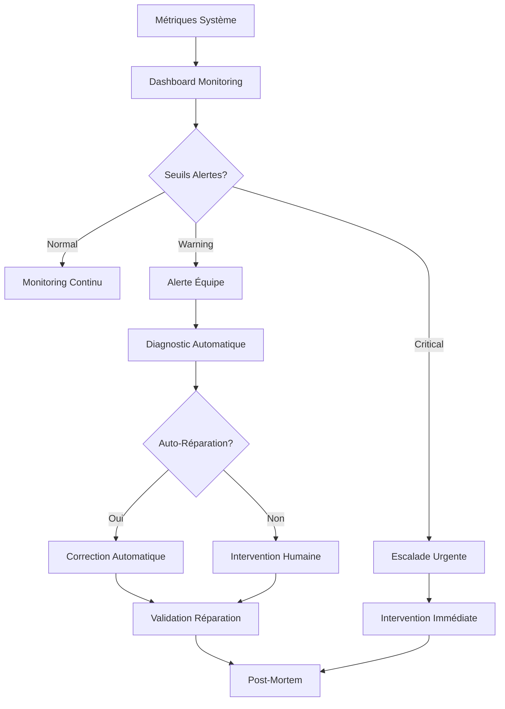
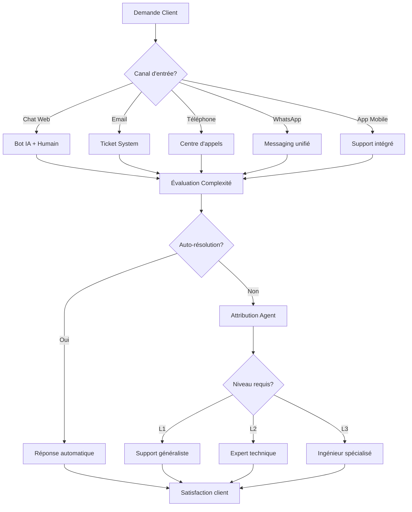

# Processus Business Entrix V3.0
## Groupe Fonctionnel : Maintenance et Support

---

## 📋 Vue d'ensemble

Ce groupe fonctionnel assure l'**excellence opérationnelle** d'Entrix V3.0 avec une **maintenance proactive**, un **support client multicanal de qualité** et une **disponibilité maximale** de la plateforme. Il garantit une **expérience utilisateur continue** et une **résolution rapide** de tous les incidents.

### **Innovations V3.0**
- **🤖 Support IA hybride** : Chatbot intelligent + agents humains experts
- **⚡ Maintenance prédictive** : Machine learning pour anticipation pannes
- **📱 Support omnicanal** : Web, mobile, phone, WhatsApp, email unifié
- **🔧 Auto-réparation** : Systèmes auto-diagnostiques et correctifs automatiques
- **📊 SLA intelligents** : Contrats de service adaptatifs selon criticité

### **Architecture support**
- **Niveau 1** : Support automatisé et FAQ intelligente
- **Niveau 2** : Agents support généralistes multicanaux
- **Niveau 3** : Experts techniques spécialisés par domaine
- **Niveau 4** : Ingénieurs R&D pour cas complexes
- **Escalade urgente** : On-call 24/7 pour incidents critiques

---

## 🛠️ Maintenance proactive et monitoring

### **Surveillance système temps réel**



**Système de monitoring unifié** :
```sql
-- Surveillance santé système avec seuils adaptatifs
CREATE OR REPLACE FUNCTION monitor_system_health()
RETURNS JSONB AS $$
DECLARE
    v_health_report JSONB;
    v_alerts JSONB[] := '{}';
    v_metrics RECORD;
BEGIN
    -- Collecte métriques système
    WITH system_metrics AS (
        SELECT 
            -- Performance base de données
            (SELECT AVG(response_time_ms) FROM db_queries 
             WHERE timestamp > NOW() - INTERVAL '5 minutes') as db_avg_response,
            (SELECT COUNT(*) FROM pg_stat_activity 
             WHERE state = 'active') as db_active_connections,
            (SELECT pg_size_pretty(pg_database_size(current_database()))) as db_size,
            
            -- Performance application
            (SELECT AVG(response_time_ms) FROM api_requests 
             WHERE timestamp > NOW() - INTERVAL '5 minutes') as api_avg_response,
            (SELECT COUNT(*) * 100.0 / COUNT(*) FROM api_requests 
             WHERE timestamp > NOW() - INTERVAL '5 minutes' 
               AND status_code >= 500) as api_error_rate,
            
            -- Métriques infrastructure
            (SELECT AVG(cpu_usage_percent) FROM server_metrics 
             WHERE timestamp > NOW() - INTERVAL '5 minutes') as avg_cpu_usage,
            (SELECT AVG(memory_usage_percent) FROM server_metrics 
             WHERE timestamp > NOW() - INTERVAL '5 minutes') as avg_memory_usage,
            (SELECT AVG(disk_usage_percent) FROM server_metrics 
             WHERE timestamp > NOW() - INTERVAL '5 minutes') as avg_disk_usage,
            
            -- Métriques métier
            (SELECT COUNT(*) FROM orders 
             WHERE created_at > NOW() - INTERVAL '1 hour') as orders_last_hour,
            (SELECT COUNT(*) FROM access_control_log 
             WHERE created_at > NOW() - INTERVAL '1 hour' 
               AND action = 'ENTRY_GRANTED') as access_last_hour,
            
            -- Santé externe
            (SELECT COUNT(*) FROM external_service_health 
             WHERE status = 'UP' AND checked_at > NOW() - INTERVAL '2 minutes') as external_services_up,
            (SELECT COUNT(*) FROM external_service_health 
             WHERE checked_at > NOW() - INTERVAL '2 minutes') as external_services_total
    )
    SELECT * INTO v_metrics FROM system_metrics;
    
    -- Évaluation seuils et génération alertes
    
    -- Base de données
    IF v_metrics.db_avg_response > 1000 THEN
        v_alerts := array_append(v_alerts, jsonb_build_object(
            'type', 'DATABASE_SLOW',
            'severity', CASE WHEN v_metrics.db_avg_response > 5000 THEN 'CRITICAL' ELSE 'WARNING' END,
            'metric', 'db_response_time',
            'value', v_metrics.db_avg_response,
            'threshold', 1000,
            'description', 'Temps de réponse base de données élevé'
        ));
    END IF;
    
    IF v_metrics.db_active_connections > 80 THEN
        v_alerts := array_append(v_alerts, jsonb_build_object(
            'type', 'DATABASE_CONNECTIONS',
            'severity', CASE WHEN v_metrics.db_active_connections > 95 THEN 'CRITICAL' ELSE 'WARNING' END,
            'metric', 'active_connections',
            'value', v_metrics.db_active_connections,
            'threshold', 80,
            'description', 'Nombre de connexions base élevé'
        ));
    END IF;
    
    -- API Performance
    IF v_metrics.api_avg_response > 2000 THEN
        v_alerts := array_append(v_alerts, jsonb_build_object(
            'type', 'API_SLOW',
            'severity', CASE WHEN v_metrics.api_avg_response > 10000 THEN 'CRITICAL' ELSE 'WARNING' END,
            'metric', 'api_response_time',
            'value', v_metrics.api_avg_response,
            'threshold', 2000,
            'description', 'APIs lentes détectées'
        ));
    END IF;
    
    IF v_metrics.api_error_rate > 1.0 THEN
        v_alerts := array_append(v_alerts, jsonb_build_object(
            'type', 'API_ERRORS',
            'severity', CASE WHEN v_metrics.api_error_rate > 5.0 THEN 'CRITICAL' ELSE 'WARNING' END,
            'metric', 'error_rate_percent',
            'value', v_metrics.api_error_rate,
            'threshold', 1.0,
            'description', 'Taux d\'erreur API élevé'
        ));
    END IF;
    
    -- Infrastructure
    IF v_metrics.avg_cpu_usage > 80 THEN
        v_alerts := array_append(v_alerts, jsonb_build_object(
            'type', 'HIGH_CPU',
            'severity', 'WARNING',
            'metric', 'cpu_usage_percent',
            'value', v_metrics.avg_cpu_usage,
            'threshold', 80,
            'description', 'Utilisation CPU élevée'
        ));
    END IF;
    
    IF v_metrics.avg_memory_usage > 85 THEN
        v_alerts := array_append(v_alerts, jsonb_build_object(
            'type', 'HIGH_MEMORY',
            'severity', CASE WHEN v_metrics.avg_memory_usage > 95 THEN 'CRITICAL' ELSE 'WARNING' END,
            'metric', 'memory_usage_percent',
            'value', v_metrics.avg_memory_usage,
            'threshold', 85,
            'description', 'Utilisation mémoire élevée'
        ));
    END IF;
    
    -- Services externes
    IF v_metrics.external_services_up < v_metrics.external_services_total THEN
        v_alerts := array_append(v_alerts, jsonb_build_object(
            'type', 'EXTERNAL_SERVICE_DOWN',
            'severity', 'WARNING',
            'metric', 'services_down',
            'value', v_metrics.external_services_total - v_metrics.external_services_up,
            'threshold', 0,
            'description', 'Services externes indisponibles'
        ));
    END IF;
    
    -- Compilation rapport
    v_health_report := jsonb_build_object(
        'timestamp', NOW(),
        'overall_status', CASE 
            WHEN array_length(v_alerts, 1) = 0 THEN 'HEALTHY'
            WHEN EXISTS(SELECT 1 FROM unnest(v_alerts) alert 
                       WHERE alert->>'severity' = 'CRITICAL') THEN 'CRITICAL'
            ELSE 'WARNING'
        END,
        'metrics', to_jsonb(v_metrics),
        'alerts', v_alerts,
        'alert_count', array_length(v_alerts, 1)
    );
    
    -- Sauvegarde rapport
    INSERT INTO system_health_reports (
        timestamp, status, metrics, alerts, alert_count
    ) VALUES (
        NOW(), 
        v_health_report->>'overall_status',
        v_health_report->'metrics',
        v_health_report->'alerts',
        COALESCE(array_length(v_alerts, 1), 0)
    );
    
    RETURN v_health_report;
END;
$$ LANGUAGE plpgsql;

-- Exécution monitoring toutes les 2 minutes
SELECT cron.schedule('system-health-monitoring', '*/2 * * * *',
                     'SELECT monitor_system_health();');
```

### **Maintenance prédictive avec IA**

**Algorithme prédiction pannes** :
```sql
-- Prédiction pannes basée sur patterns historiques
CREATE OR REPLACE FUNCTION predict_system_failures()
RETURNS TABLE(
    component VARCHAR(50),
    failure_probability DECIMAL(4,2),
    predicted_failure_date TIMESTAMPTZ,
    recommended_actions TEXT[],
    confidence_score DECIMAL(4,2)
) AS $$
DECLARE
    v_component RECORD;
BEGIN
    -- Analyse tendances par composant système
    FOR v_component IN
        SELECT 
            component_name,
            AVG(cpu_usage) as avg_cpu,
            AVG(memory_usage) as avg_memory,
            AVG(error_rate) as avg_errors,
            COUNT(*) FILTER (WHERE alert_triggered = true) as alert_frequency,
            
            -- Tendances (régression linéaire simplifiée)
            regr_slope(cpu_usage, EXTRACT(epoch FROM timestamp)) as cpu_trend,
            regr_slope(memory_usage, EXTRACT(epoch FROM timestamp)) as memory_trend,
            regr_slope(error_rate, EXTRACT(epoch FROM timestamp)) as error_trend
            
        FROM component_metrics 
        WHERE timestamp > NOW() - INTERVAL '30 days'
        GROUP BY component_name
    LOOP
        DECLARE
            v_failure_score DECIMAL := 0;
            v_prediction_date TIMESTAMPTZ;
            v_actions TEXT[] := '{}';
            v_confidence DECIMAL := 0;
        BEGIN
            -- Calcul probabilité panne
            
            -- Utilisation CPU excessive croissante
            IF v_component.avg_cpu > 70 AND v_component.cpu_trend > 0 THEN
                v_failure_score := v_failure_score + 25;
                v_actions := array_append(v_actions, 'Optimiser processus CPU');
            END IF;
            
            -- Mémoire critique
            IF v_component.avg_memory > 80 AND v_component.memory_trend > 0 THEN
                v_failure_score := v_failure_score + 30;
                v_actions := array_append(v_actions, 'Augmenter RAM ou optimiser mémoire');
            END IF;
            
            -- Taux erreur croissant
            IF v_component.avg_errors > 2 AND v_component.error_trend > 0 THEN
                v_failure_score := v_failure_score + 35;
                v_actions := array_append(v_actions, 'Investiguer causes erreurs');
            END IF;
            
            -- Fréquence alertes élevée
            IF v_component.alert_frequency > 10 THEN
                v_failure_score := v_failure_score + 20;
                v_actions := array_append(v_actions, 'Maintenance préventive recommandée');
            END IF;
            
            -- Prédiction temporelle basée sur tendances
            IF v_failure_score > 50 THEN
                -- Estimation date critique basée sur vitesse dégradation
                v_prediction_date := NOW() + INTERVAL '1 day' * 
                    GREATEST(1, (100 - v_failure_score) / GREATEST(1, 
                        v_component.cpu_trend + v_component.memory_trend + v_component.error_trend));
                        
                v_confidence := LEAST(95, v_failure_score + 20);
            ELSE
                v_prediction_date := NULL;
                v_confidence := v_failure_score;
            END IF;
            
            -- Retour résultats si risque significatif
            IF v_failure_score > 25 THEN
                RETURN QUERY SELECT 
                    v_component.component_name,
                    v_failure_score,
                    v_prediction_date,
                    v_actions,
                    v_confidence;
            END IF;
        END;
    END LOOP;
END;
$$ LANGUAGE plpgsql;
```

---

## 🎧 Support client multicanal

### **Architecture support omnicanal**

**Workflow support unifié** :


### **Chatbot IA conversationnel avancé**

**Engine de compréhension naturelle** :
```sql
-- Système traitement requêtes support avec IA
CREATE OR REPLACE FUNCTION process_support_request(
    p_user_message TEXT,
    p_user_id UUID DEFAULT NULL,
    p_conversation_context JSONB DEFAULT '{}'::JSONB,
    p_channel VARCHAR(20) DEFAULT 'WEB_CHAT'
) RETURNS JSONB AS $$
DECLARE
    v_intent_analysis JSONB;
    v_response JSONB;
    v_confidence DECIMAL;
    v_suggested_actions TEXT[];
    v_escalation_needed BOOLEAN := FALSE;
BEGIN
    -- Analyse intention avec NLP
    v_intent_analysis := analyze_user_intent(p_user_message);
    v_confidence := (v_intent_analysis->>'confidence')::DECIMAL;
    
    -- Classification intention principale
    CASE v_intent_analysis->>'primary_intent'
        WHEN 'BILLING_QUESTION' THEN
            IF p_user_id IS NOT NULL THEN
                -- Récupération info billing spécifique
                v_response := jsonb_build_object(
                    'type', 'BILLING_INFO',
                    'data', get_user_billing_summary(p_user_id),
                    'quick_replies', ARRAY[
                        'Voir mes factures',
                        'Contester un paiement', 
                        'Modifier moyen paiement'
                    ]
                );
            ELSE
                v_response := jsonb_build_object(
                    'type', 'AUTH_REQUIRED',
                    'message', 'Pour consulter vos informations de facturation, veuillez vous connecter.'
                );
            END IF;
            
        WHEN 'TICKET_ISSUE' THEN
            -- Analyse sous-catégorie
            IF v_intent_analysis->'entities'->>'ticket_problem' = 'NOT_RECEIVED' THEN
                v_response := jsonb_build_object(
                    'type', 'TICKET_TROUBLESHOOTING',
                    'steps', ARRAY[
                        'Vérifiez vos emails (y compris spam)',
                        'Vérifiez votre numéro de téléphone',
                        'Consultez votre compte Entrix'
                    ],
                    'escalation_option', 'Problème non résolu'
                );
            ELSIF v_intent_analysis->'entities'->>'ticket_problem' = 'CANT_DOWNLOAD' THEN
                v_response := jsonb_build_object(
                    'type', 'TECHNICAL_HELP',
                    'solutions', get_download_troubleshooting_steps(),
                    'video_tutorial', 'https://help.entrix.tn/download-tickets'
                );
            END IF;
            
        WHEN 'EVENT_INFORMATION' THEN
            DECLARE
                v_event_name TEXT := v_intent_analysis->'entities'->>'event_name';
                v_event_info JSONB;
            BEGIN
                -- Recherche événement mentionné
                SELECT to_jsonb(e.*) INTO v_event_info
                FROM events e 
                WHERE similarity(e.title, v_event_name) > 0.6
                ORDER BY similarity(e.title, v_event_name) DESC
                LIMIT 1;
                
                IF v_event_info IS NOT NULL THEN
                    v_response := jsonb_build_object(
                        'type', 'EVENT_INFO',
                        'event', v_event_info,
                        'quick_actions', ARRAY[
                            'Acheter billets',
                            'Voir programme',
                            'Itinéraire venue'
                        ]
                    );
                ELSE
                    v_response := jsonb_build_object(
                        'type', 'EVENT_SEARCH',
                        'message', 'Je n\'ai pas trouvé cet événement. Voulez-vous rechercher ?',
                        'search_suggestion', v_event_name
                    );
                END IF;
            END;
            
        WHEN 'REFUND_REQUEST' THEN
            -- Vérification éligibilité remboursement
            IF p_user_id IS NOT NULL THEN
                v_response := check_refund_eligibility(p_user_id, v_intent_analysis->'entities');
                v_escalation_needed := (v_response->>'requires_manual_review')::BOOLEAN;
            ELSE
                v_escalation_needed := TRUE;
                v_response := jsonb_build_object(
                    'type', 'ESCALATION_REQUIRED',
                    'reason', 'Demande remboursement nécessite identification'
                );
            END IF;
            
        WHEN 'GENERAL_COMPLAINT' THEN
            v_escalation_needed := TRUE;
            v_response := jsonb_build_object(
                'type', 'ESCALATION_REQUIRED',
                'reason', 'Réclamation nécessite attention humaine'
            );
            
        ELSE
            -- Intention non reconnue ou ambiguë
            IF v_confidence < 0.7 THEN
                v_response := jsonb_build_object(
                    'type', 'CLARIFICATION_NEEDED',
                    'message', 'Pouvez-vous reformuler votre demande ?',
                    'suggestions', ARRAY[
                        'Problème avec un billet',
                        'Question sur un événement',
                        'Problème de paiement',
                        'Parler à un agent'
                    ]
                );
            ELSE
                v_escalation_needed := TRUE;
            END IF;
    END CASE;
    
    -- Actions suggérées selon contexte
    v_suggested_actions := ARRAY[]::TEXT[];
    
    IF p_user_id IS NULL AND NOT v_escalation_needed THEN
        v_suggested_actions := array_append(v_suggested_actions, 'Se connecter pour aide personnalisée');
    END IF;
    
    IF v_escalation_needed THEN
        v_suggested_actions := array_append(v_suggested_actions, 'Parler à un agent humain');
    END IF;
    
    -- Enregistrement conversation
    INSERT INTO support_conversations (
        user_id, channel, user_message, bot_response,
        intent_detected, confidence_score, escalated,
        created_at
    ) VALUES (
        p_user_id, p_channel, p_user_message, v_response,
        v_intent_analysis->>'primary_intent', v_confidence, v_escalation_needed,
        NOW()
    );
    
    RETURN jsonb_build_object(
        'response', v_response,
        'confidence', v_confidence,
        'escalation_needed', v_escalation_needed,
        'suggested_actions', v_suggested_actions,
        'conversation_id', lastval() -- ID conversation créée
    );
END;
$$ LANGUAGE plpgsql;
```

### **Système de tickets et escalade intelligente**

**Gestion tickets multi-niveaux** :
```sql
-- Attribution automatique tickets selon expertise requise
CREATE OR REPLACE FUNCTION assign_support_ticket(
    p_ticket_id UUID
) RETURNS JSONB AS $$
DECLARE
    v_ticket RECORD;
    v_assigned_agent UUID;
    v_priority VARCHAR(20);
    v_estimated_resolution_time INTERVAL;
    v_assignment_reason TEXT;
BEGIN
    -- Récupération détails ticket
    SELECT 
        t.*,
        u.subscription_tier,
        u.total_orders_count,
        u.last_order_amount
    INTO v_ticket
    FROM support_tickets t
    LEFT JOIN user_profiles u ON t.user_id = u.user_id
    WHERE t.id = p_ticket_id;
    
    -- Calcul priorité dynamique
    v_priority := calculate_ticket_priority(
        v_ticket.category,
        v_ticket.severity,
        v_ticket.subscription_tier,
        v_ticket.total_orders_count
    );
    
    -- Attribution selon catégorie et priorité
    CASE v_ticket.category
        WHEN 'TECHNICAL_ISSUE' THEN
            -- Agent avec expertise technique disponible
            SELECT agent_id INTO v_assigned_agent
            FROM support_agents sa
            WHERE sa.specialization = 'TECHNICAL'
              AND sa.status = 'AVAILABLE'
              AND sa.current_workload < sa.max_concurrent_tickets
            ORDER BY sa.expertise_score DESC, sa.current_workload ASC
            LIMIT 1;
            
            v_estimated_resolution_time := INTERVAL '2 hours';
            v_assignment_reason := 'Expertise technique requise';
            
        WHEN 'BILLING_DISPUTE' THEN
            -- Agent spécialisé finances
            SELECT agent_id INTO v_assigned_agent
            FROM support_agents sa
            WHERE sa.specialization IN ('BILLING', 'GENERAL')
              AND sa.status = 'AVAILABLE'
              AND sa.current_workload < sa.max_concurrent_tickets
            ORDER BY 
                CASE WHEN sa.specialization = 'BILLING' THEN 1 ELSE 2 END,
                sa.expertise_score DESC
            LIMIT 1;
            
            v_estimated_resolution_time := INTERVAL '24 hours';
            v_assignment_reason := 'Expertise financière requise';
            
        WHEN 'REFUND_REQUEST' THEN
            IF v_ticket.total_orders_count > 10 OR v_ticket.last_order_amount > 500 THEN
                -- Client VIP -> Agent senior
                SELECT agent_id INTO v_assigned_agent
                FROM support_agents sa
                WHERE sa.level = 'SENIOR'
                  AND sa.status = 'AVAILABLE'
                ORDER BY sa.current_workload ASC
                LIMIT 1;
                
                v_assignment_reason := 'Client VIP - Agent senior requis';
            ELSE
                -- Agent standard
                SELECT agent_id INTO v_assigned_agent
                FROM support_agents sa
                WHERE sa.level IN ('JUNIOR', 'STANDARD')
                  AND sa.specialization IN ('BILLING', 'GENERAL')
                  AND sa.status = 'AVAILABLE'
                ORDER BY sa.current_workload ASC
                LIMIT 1;
                
                v_assignment_reason := 'Demande standard';
            END IF;
            
            v_estimated_resolution_time := INTERVAL '48 hours';
            
        WHEN 'URGENT_EVENT_ISSUE' THEN
            -- Escalade immédiate niveau 2
            SELECT agent_id INTO v_assigned_agent
            FROM support_agents sa
            WHERE sa.level IN ('SENIOR', 'EXPERT')
              AND sa.status = 'AVAILABLE'
            ORDER BY sa.expertise_score DESC
            LIMIT 1;
            
            v_estimated_resolution_time := INTERVAL '1 hour';
            v_assignment_reason := 'Urgence événement';
            
        ELSE
            -- Agent généraliste disponible
            SELECT agent_id INTO v_assigned_agent
            FROM support_agents sa
            WHERE sa.specialization = 'GENERAL'
              AND sa.status = 'AVAILABLE'
              AND sa.current_workload < sa.max_concurrent_tickets
            ORDER BY sa.current_workload ASC
            LIMIT 1;
            
            v_estimated_resolution_time := INTERVAL '4 hours';
            v_assignment_reason := 'Attribution généraliste';
    END CASE;
    
    -- Si aucun agent disponible -> queue prioritaire
    IF v_assigned_agent IS NULL THEN
        UPDATE support_tickets 
        SET status = 'QUEUED',
            priority = v_priority,
            queued_at = NOW()
        WHERE id = p_ticket_id;
        
        RETURN jsonb_build_object(
            'assigned', false,
            'status', 'QUEUED',
            'priority', v_priority,
            'estimated_wait_time', '15 minutes'
        );
    END IF;
    
    -- Attribution effective
    UPDATE support_tickets 
    SET assigned_agent_id = v_assigned_agent,
        status = 'ASSIGNED',
        priority = v_priority,
        assigned_at = NOW(),
        estimated_resolution_at = NOW() + v_estimated_resolution_time
    WHERE id = p_ticket_id;
    
    -- Mise à jour charge agent
    UPDATE support_agents 
    SET current_workload = current_workload + 1
    WHERE agent_id = v_assigned_agent;
    
    -- Notification agent
    INSERT INTO agent_notifications (
        agent_id, ticket_id, notification_type, 
        message, created_at
    ) VALUES (
        v_assigned_agent, p_ticket_id, 'NEW_TICKET_ASSIGNED',
        'Nouveau ticket assigné: ' || v_ticket.subject, NOW()
    );
    
    RETURN jsonb_build_object(
        'assigned', true,
        'agent_id', v_assigned_agent,
        'priority', v_priority,
        'estimated_resolution', NOW() + v_estimated_resolution_time,
        'assignment_reason', v_assignment_reason
    );
END;
$$ LANGUAGE plpgsql;
```

---

## 📞 Centre d'appels et support téléphonique

### **Système de routage intelligent des appels**

**IVR (Interactive Voice Response) adaptatif** :
```yaml
# Configuration IVR Entrix Support
ivr_flow:
  welcome_message: 
    text: "Bienvenue chez Entrix. Pour vous diriger vers le bon service..."
    language_detection: auto
    timeout: 10
  
  main_menu:
    options:
      1: 
        label: "Problème avec un billet ou QR code"
        destination: "technical_support_queue"
        estimated_wait: "3 minutes"
      
      2:
        label: "Question sur un événement"
        destination: "event_information_bot"
        auto_resolution_rate: 85%
      
      3:
        label: "Facturation et remboursements"
        destination: "billing_specialist_queue"
        estimated_wait: "5 minutes"
      
      4:
        label: "Créer compte organisateur"
        destination: "sales_team"
        business_hours_only: true
      
      9:
        label: "Autre demande ou agent humain"
        destination: "general_support_queue"
    
    smart_routing:
      caller_id_recognition: true
      previous_interaction_context: true
      priority_customer_detection: true
      callback_option_if_wait_over: "8 minutes"

  queues:
    technical_support:
      agents: 5
      skills_required: ["technical_troubleshooting", "qr_codes"]
      priority_levels: ["urgent_event", "high", "normal"]
      max_wait_time: "15 minutes"
      
    billing_specialist:
      agents: 3
      skills_required: ["billing", "refunds", "financial"]
      escalation_to_manager_after: "10 minutes"
      
    general_support:
      agents: 8
      skills_required: ["general_customer_service"]
      overflow_to_callback: true
```

### **Outils agent et CRM intégré**

**Interface agent unifié** :
```sql
-- Dashboard agent avec contexte client complet
CREATE OR REPLACE VIEW agent_customer_360 AS
SELECT 
    u.id as user_id,
    u.first_name || ' ' || u.last_name as full_name,
    u.email,
    u.phone,
    
    -- Profil client
    up.total_orders_count,
    up.total_spent,
    up.avg_order_value,
    up.last_order_date,
    up.subscription_tier,
    up.loyalty_points,
    
    -- Événements récents
    (SELECT array_agg(
        jsonb_build_object(
            'event_title', e.title,
            'event_date', e.starts_at,
            'ticket_count', COUNT(t.id),
            'total_paid', SUM(o.total_amount)
        ) ORDER BY e.starts_at DESC
     ) 
     FROM tickets t
     JOIN events e ON t.event_id = e.id
     JOIN orders o ON t.order_id = o.id
     WHERE t.user_id = u.id
       AND e.starts_at > NOW() - INTERVAL '6 months'
     GROUP BY e.id, e.title, e.starts_at
     LIMIT 5) as recent_events,
    
    -- Historique support
    (SELECT array_agg(
        jsonb_build_object(
            'ticket_id', st.id,
            'subject', st.subject,
            'category', st.category,
            'status', st.status,
            'created_at', st.created_at,
            'resolved_at', st.resolved_at
        ) ORDER BY st.created_at DESC
     )
     FROM support_tickets st
     WHERE st.user_id = u.id
     LIMIT 10) as support_history,
    
    -- Préférences et notes
    up.communication_preferences,
    up.special_notes,
    
    -- Dernière activité
    (SELECT created_at FROM audit_logs 
     WHERE user_id = u.id 
     ORDER BY created_at DESC 
     LIMIT 1) as last_activity,
    
    -- Indicateurs satisfaction
    (SELECT AVG(rating) FROM support_feedback 
     WHERE user_id = u.id) as avg_satisfaction_rating,
    
    -- Signalements
    (SELECT COUNT(*) FROM user_flags 
     WHERE user_id = u.id 
       AND is_active = true) as active_flags
       
FROM users u
LEFT JOIN user_profiles up ON u.id = up.user_id
WHERE u.id = current_setting('app.current_customer_id')::UUID;
```

---

## 📊 SLA et métriques de qualité

### **Contrats de service adaptatifs**

**SLA intelligents par segment client** :
```sql
-- Calcul SLA dynamique selon profil client
CREATE OR REPLACE FUNCTION calculate_dynamic_sla(
    p_user_id UUID,
    p_ticket_category VARCHAR(50),
    p_severity VARCHAR(20)
) RETURNS JSONB AS $$
DECLARE
    v_user_profile RECORD;
    v_base_sla INTERVAL;
    v_multiplier DECIMAL := 1.0;
    v_sla_level VARCHAR(20);
BEGIN
    -- Profil utilisateur
    SELECT 
        subscription_tier,
        total_spent,
        total_orders_count,
        avg_satisfaction_rating
    INTO v_user_profile
    FROM user_profiles
    WHERE user_id = p_user_id;
    
    -- SLA de base selon catégorie
    v_base_sla := CASE p_ticket_category
        WHEN 'URGENT_EVENT_ISSUE' THEN INTERVAL '1 hour'
        WHEN 'TECHNICAL_ISSUE' THEN INTERVAL '4 hours'
        WHEN 'BILLING_DISPUTE' THEN INTERVAL '24 hours'
        WHEN 'REFUND_REQUEST' THEN INTERVAL '48 hours'
        WHEN 'GENERAL_INQUIRY' THEN INTERVAL '8 hours'
        ELSE INTERVAL '24 hours'
    END;
    
    -- Ajustement selon tier client
    CASE v_user_profile.subscription_tier
        WHEN 'VIP' THEN
            v_multiplier := 0.5; -- 50% plus rapide
            v_sla_level := 'PREMIUM';
        WHEN 'PREMIUM' THEN
            v_multiplier := 0.75; -- 25% plus rapide
            v_sla_level := 'ENHANCED';
        WHEN 'GOLD' THEN
            v_multiplier := 0.9; -- 10% plus rapide
            v_sla_level := 'PRIORITAIRE';
        ELSE
            v_multiplier := 1.0; -- Standard
            v_sla_level := 'STANDARD';
    END CASE;
    
    -- Ajustement selon historique
    IF v_user_profile.total_spent > 2000 THEN
        v_multiplier := v_multiplier * 0.9; -- Client high-value
    END IF;
    
    IF v_user_profile.avg_satisfaction_rating < 3.0 THEN
        v_multiplier := v_multiplier * 0.8; -- Client insatisfait prioritaire
    END IF;
    
    -- Urgence spéciale selon sévérité
    IF p_severity = 'CRITICAL' THEN
        v_multiplier := v_multiplier * 0.5;
    ELSIF p_severity = 'HIGH' THEN
        v_multiplier := v_multiplier * 0.75;
    END IF;
    
    RETURN jsonb_build_object(
        'sla_target', v_base_sla * v_multiplier,
        'sla_level', v_sla_level,
        'base_sla', v_base_sla,
        'adjustment_factor', v_multiplier,
        'justification', jsonb_build_object(
            'tier', v_user_profile.subscription_tier,
            'total_spent', v_user_profile.total_spent,
            'satisfaction', v_user_profile.avg_satisfaction_rating,
            'severity', p_severity
        )
    );
END;
$$ LANGUAGE plpgsql;
```

### **Métriques de performance support**

**KPIs temps réel** :
```sql
-- Dashboard métriques support temps réel
CREATE OR REPLACE VIEW support_performance_dashboard AS
WITH current_metrics AS (
    SELECT 
        -- Volume tickets
        COUNT(*) as total_tickets_today,
        COUNT(*) FILTER (WHERE status = 'OPEN') as open_tickets,
        COUNT(*) FILTER (WHERE status = 'ASSIGNED') as assigned_tickets,
        COUNT(*) FILTER (WHERE status = 'RESOLVED') as resolved_today,
        
        -- Temps de réponse
        AVG(EXTRACT(minutes FROM first_response_at - created_at)) 
            FILTER (WHERE first_response_at IS NOT NULL) as avg_first_response_minutes,
        
        -- Temps de résolution
        AVG(EXTRACT(hours FROM resolved_at - created_at)) 
            FILTER (WHERE resolved_at IS NOT NULL) as avg_resolution_hours,
        
        -- Respect SLA
        COUNT(*) FILTER (WHERE sla_met = true) * 100.0 / 
            NULLIF(COUNT(*) FILTER (WHERE resolved_at IS NOT NULL), 0) as sla_compliance_percent,
        
        -- Satisfaction client
        (SELECT AVG(rating) FROM support_feedback 
         WHERE created_at >= current_date) as avg_satisfaction_today,
        
        -- Escalations
        COUNT(*) FILTER (WHERE escalated = true) as escalations_today,
        
        -- Par canal
        COUNT(*) FILTER (WHERE channel = 'PHONE') as phone_tickets,
        COUNT(*) FILTER (WHERE channel = 'EMAIL') as email_tickets,
        COUNT(*) FILTER (WHERE channel = 'CHAT') as chat_tickets,
        COUNT(*) FILTER (WHERE channel = 'WHATSAPP') as whatsapp_tickets
        
    FROM support_tickets
    WHERE created_at >= current_date
),
agent_performance AS (
    SELECT 
        COUNT(DISTINCT sa.agent_id) as agents_active,
        AVG(sa.current_workload) as avg_agent_workload,
        SUM(sa.tickets_resolved_today) as total_resolved_by_agents,
        AVG(sa.avg_customer_rating) as avg_agent_rating
    FROM support_agents sa
    WHERE sa.status IN ('AVAILABLE', 'BUSY')
),
trends AS (
    SELECT 
        -- Comparaison hier
        (SELECT COUNT(*) FROM support_tickets 
         WHERE created_at BETWEEN current_date - INTERVAL '1 day' AND current_date) as tickets_yesterday,
        
        -- Même jour semaine dernière
        (SELECT COUNT(*) FROM support_tickets 
         WHERE created_at BETWEEN current_date - INTERVAL '7 days' AND current_date - INTERVAL '6 days') as tickets_last_week
)
SELECT 
    cm.*,
    ap.*,
    t.*,
    
    -- Calculs tendances
    CASE 
        WHEN t.tickets_yesterday > 0 THEN
            ROUND(((cm.total_tickets_today - t.tickets_yesterday) * 100.0 / t.tickets_yesterday), 1)
        ELSE NULL 
    END as trend_vs_yesterday_percent,
    
    CASE 
        WHEN t.tickets_last_week > 0 THEN
            ROUND(((cm.total_tickets_today - t.tickets_last_week) * 100.0 / t.tickets_last_week), 1)
        ELSE NULL 
    END as trend_vs_last_week_percent,
    
    -- Statut global
    CASE 
        WHEN cm.sla_compliance_percent >= 95 AND cm.avg_satisfaction_today >= 4.5 THEN 'EXCELLENT'
        WHEN cm.sla_compliance_percent >= 90 AND cm.avg_satisfaction_today >= 4.0 THEN 'GOOD'
        WHEN cm.sla_compliance_percent >= 80 AND cm.avg_satisfaction_today >= 3.5 THEN 'ACCEPTABLE'
        ELSE 'NEEDS_IMPROVEMENT'
    END as overall_performance_status
    
FROM current_metrics cm, agent_performance ap, trends t;
```

---

## 🔄 Processus d'amélioration continue

### **Analyse feedback et optimisation**

**Machine learning sur satisfaction client** :
```sql
-- Analyse prédictive satisfaction client
CREATE OR REPLACE FUNCTION predict_customer_satisfaction(
    p_ticket_id UUID
) RETURNS JSONB AS $$
DECLARE
    v_ticket_features JSONB;
    v_prediction JSONB;
    v_recommendations TEXT[];
BEGIN
    -- Extraction features ticket
    WITH ticket_analysis AS (
        SELECT 
            st.category,
            st.severity,
            st.channel,
            EXTRACT(hours FROM NOW() - st.created_at) as hours_open,
            EXTRACT(minutes FROM st.first_response_at - st.created_at) as response_time_minutes,
            sa.level as agent_level,
            sa.avg_customer_rating as agent_rating,
            up.subscription_tier,
            up.avg_satisfaction_rating as customer_historical_rating,
            
            -- Complexité estimée (nombre échanges)
            (SELECT COUNT(*) FROM ticket_messages 
             WHERE ticket_id = st.id) as message_count,
             
            -- Escalations précédentes
            (SELECT COUNT(*) FROM support_tickets st2
             WHERE st2.user_id = st.user_id 
               AND st2.escalated = true
               AND st2.created_at > NOW() - INTERVAL '90 days') as recent_escalations
               
        FROM support_tickets st
        LEFT JOIN support_agents sa ON st.assigned_agent_id = sa.agent_id
        LEFT JOIN user_profiles up ON st.user_id = up.user_id
        WHERE st.id = p_ticket_id
    )
    SELECT to_jsonb(ta.*) INTO v_ticket_features FROM ticket_analysis ta;
    
    -- Prédiction via modèle ML (simulé)
    v_prediction := ml_predict_satisfaction(v_ticket_features);
    
    -- Recommandations personnalisées
    v_recommendations := ARRAY[]::TEXT[];
    
    -- Temps réponse critique
    IF (v_ticket_features->>'response_time_minutes')::INTEGER > 60 THEN
        v_recommendations := array_append(v_recommendations, 
            'Temps de réponse élevé - risque satisfaction');
    END IF;
    
    -- Agent performance
    IF (v_ticket_features->>'agent_rating')::DECIMAL < 4.0 THEN
        v_recommendations := array_append(v_recommendations,
            'Considérer réassignation à agent mieux noté');
    END IF;
    
    -- Historique client
    IF (v_ticket_features->>'customer_historical_rating')::DECIMAL < 3.5 THEN
        v_recommendations := array_append(v_recommendations,
            'Client historiquement insatisfait - attention particulière');
    END IF;
    
    -- Complexité case
    IF (v_ticket_features->>'message_count')::INTEGER > 10 THEN
        v_recommendations := array_append(v_recommendations,
            'Case complexe - envisager escalade préventive');
    END IF;
    
    RETURN jsonb_build_object(
        'predicted_satisfaction', v_prediction->>'predicted_score',
        'confidence', v_prediction->>'confidence',
        'risk_factors', v_prediction->>'risk_factors',
        'recommendations', v_recommendations,
        'features_analyzed', v_ticket_features
    );
END;
$$ LANGUAGE plpgsql;
```

### **Optimisation continue des processus**

**Algorithme d'amélioration automatique** :
```sql
-- Identification automatique d'optimisations process
CREATE OR REPLACE FUNCTION identify_process_optimizations()
RETURNS TABLE(
    optimization_type VARCHAR(50),
    current_performance DECIMAL,
    target_performance DECIMAL,
    impact_score INTEGER,
    recommended_actions TEXT[],
    implementation_effort VARCHAR(20)
) AS $$
BEGIN
    RETURN QUERY
    
    -- Optimisation temps première réponse
    WITH response_time_analysis AS (
        SELECT 
            'FIRST_RESPONSE_TIME' as opt_type,
            AVG(EXTRACT(minutes FROM first_response_at - created_at)) as current_avg,
            PERCENTILE_CONT(0.25) WITHIN GROUP (
                ORDER BY EXTRACT(minutes FROM first_response_at - created_at)
            ) as target_p25
        FROM support_tickets
        WHERE first_response_at IS NOT NULL
          AND created_at > NOW() - INTERVAL '30 days'
    )
    SELECT 
        opt_type,
        current_avg,
        target_p25,
        CASE WHEN current_avg > target_p25 * 2 THEN 90 ELSE 60 END as impact,
        ARRAY[
            'Automatiser plus de réponses via chatbot',
            'Alertes proactives aux agents',
            'Templates réponses rapides'
        ],
        'MEDIUM'
    FROM response_time_analysis
    WHERE current_avg > target_p25 * 1.5
    
    UNION ALL
    
    -- Optimisation taux résolution première interaction
    WITH first_contact_resolution AS (
        SELECT 
            'FIRST_CONTACT_RESOLUTION' as opt_type,
            COUNT(*) FILTER (WHERE message_count = 1 AND status = 'RESOLVED') * 100.0 / 
                COUNT(*) as current_fcr,
            80.0 as target_fcr
        FROM (
            SELECT st.id, st.status,
                   COUNT(tm.id) as message_count
            FROM support_tickets st
            LEFT JOIN ticket_messages tm ON st.id = tm.ticket_id
            WHERE st.created_at > NOW() - INTERVAL '30 days'
            GROUP BY st.id, st.status
        ) ticket_stats
    )
    SELECT 
        opt_type,
        current_fcr,
        target_fcr,
        85 as impact,
        ARRAY[
            'Améliorer base connaissances chatbot',
            'Formation agents résolution rapide',
            'Outils diagnostiques automatiques'
        ],
        'HIGH'
    FROM first_contact_resolution
    WHERE current_fcr < target_fcr
    
    UNION ALL
    
    -- Optimisation charge agents
    WITH agent_workload AS (
        SELECT 
            'AGENT_WORKLOAD_DISTRIBUTION' as opt_type,
            STDDEV(current_workload) as current_stddev,
            2.0 as target_stddev
        FROM support_agents
        WHERE status IN ('AVAILABLE', 'BUSY')
    )
    SELECT 
        opt_type,
        current_stddev,
        target_stddev,
        70 as impact,
        ARRAY[
            'Algorithme distribution équitable',
            'Monitoring temps réel workload',
            'Auto-rééquilibrage tickets'
        ],
        'MEDIUM'
    FROM agent_workload
    WHERE current_stddev > target_stddev;
END;
$$ LANGUAGE plpgsql;
```

---

Cette documentation couvre l'ensemble de l'écosystème de maintenance et support d'Entrix V3.0, assurant une excellence opérationnelle continue, un support client de qualité supérieure et une amélioration constante des processus pour une satisfaction maximale de tous les utilisateurs.