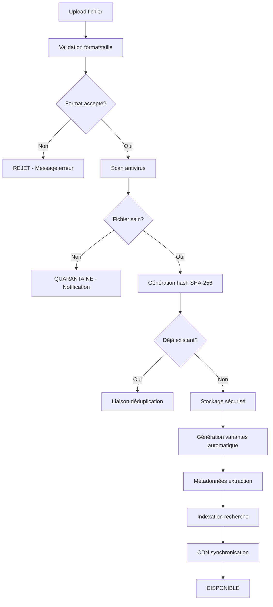
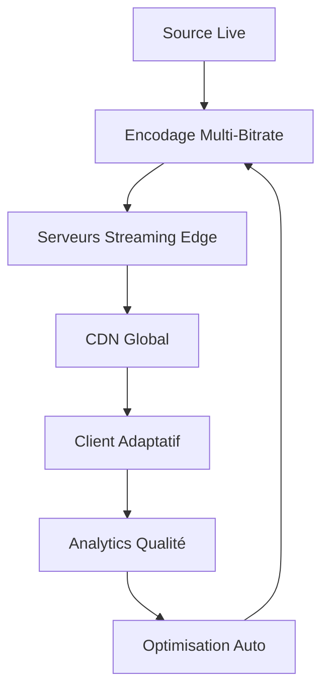
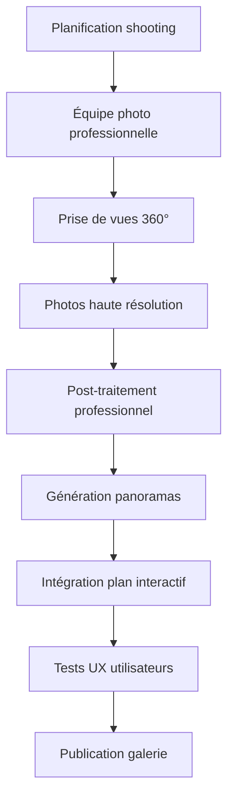

# Processus Business Entrix V3.0
## Groupe Fonctionnel : Médias et Fichiers

---

## 📋 Vue d'ensemble

Ce groupe fonctionnel gère l'**écosystème complet des ressources numériques** sur Entrix V3.0 : images, vidéos, documents, audio et autres fichiers multimédias. Il assure le **stockage intelligent**, la **diffusion optimisée**, la **sécurité avancée** et la **performance maximale** de tous les contenus de la plateforme.

### **Innovations V3.0**
- **🎯 IA d'optimisation** : Compression et redimensionnement automatique intelligent
- **🔐 Sécurité granulaire** : Permissions par fichier et watermarking automatique
- **📱 Delivery responsif** : Adaptation automatique selon appareil/connexion
- **🎬 Streaming intégré** : Diffusion live et VOD haute qualité
- **☁️ Multi-cloud hybrid** : Redondance et performance globale

---

## 📸 Processus de gestion des médias

### **Workflow d'upload et traitement**



### **Types de fichiers supportés**

**🖼️ Images** :
- **Formats** : JPEG, PNG, WebP, SVG, AVIF, HEIC
- **Limites** : 50MB, 8K max, ratio aspect 20:1 max
- **Optimisation** : Compression smart, progressive JPEG, WebP auto
- **Variantes** : 6 tailles (thumbnail → 4K), watermark optionnel

**🎥 Vidéos** :
- **Formats** : MP4, WebM, MOV, AVI (conversion automatique)
- **Limites** : 2GB, 4K/60fps max, codecs H.264/H.265/VP9
- **Optimisation** : Transcodage multi-bitrate, streaming adaptatif
- **Preview** : Thumbnail auto à 3s, preview GIF 5s

**🎵 Audio** :
- **Formats** : MP3, AAC, WAV, FLAC, OGG
- **Limites** : 500MB, 24bit/192kHz max
- **Optimisation** : Compression smart, normalisation volume
- **Traitement** : Analyse spectre, détection silence

**📄 Documents** :
- **Formats** : PDF, DOCX, XLSX, PPTX, TXT
- **Limites** : 100MB, 1000 pages max
- **Sécurité** : Scan macros, watermarking automatique
- **Preview** : Génération thumbnail première page

### **Processus d'optimisation automatique**

**Intelligence algorithmique** :
```sql
-- Optimisation automatique selon contexte d'usage
CREATE OR REPLACE FUNCTION auto_optimize_media(
    p_media_id UUID,
    p_usage_context VARCHAR(50),
    p_target_audience VARCHAR(30)
) RETURNS JSONB AS $$
DECLARE
    v_media_info RECORD;
    v_optimizations JSONB := '{}';
    v_quality_target INTEGER;
    v_size_target BIGINT;
BEGIN
    -- Récupération infos média
    SELECT file_type, file_size, dimensions, mime_type 
    INTO v_media_info
    FROM media_files WHERE id = p_media_id;
    
    -- Définition cibles selon contexte
    CASE p_usage_context
        WHEN 'SOCIAL_SHARE' THEN
            v_quality_target := 85;
            v_size_target := 2 * 1024 * 1024; -- 2MB max
        WHEN 'EMAIL_CAMPAIGN' THEN
            v_quality_target := 75;
            v_size_target := 500 * 1024; -- 500KB max
        WHEN 'MOBILE_APP' THEN
            v_quality_target := 80;
            v_size_target := 1 * 1024 * 1024; -- 1MB max
        WHEN 'PRINT_QUALITY' THEN
            v_quality_target := 95;
            v_size_target := 50 * 1024 * 1024; -- 50MB max
        ELSE
            v_quality_target := 90;
            v_size_target := 5 * 1024 * 1024; -- 5MB max
    END CASE;
    
    -- Optimisations selon type fichier
    IF v_media_info.file_type = 'IMAGE' THEN
        v_optimizations := jsonb_build_object(
            'compress_to_quality', v_quality_target,
            'target_size_bytes', v_size_target,
            'progressive_jpeg', true,
            'webp_fallback', true,
            'lazy_loading', true,
            'responsive_sizes', ARRAY[320, 640, 1024, 1920]
        );
    ELSIF v_media_info.file_type = 'VIDEO' THEN
        v_optimizations := jsonb_build_object(
            'target_bitrates', ARRAY[500, 1000, 2000, 4000], -- kbps
            'adaptive_streaming', true,
            'thumbnail_count', 10,
            'preview_clip_duration', 15
        );
    END IF;
    
    -- Lancement traitement asynchrone
    INSERT INTO media_processing_queue (
        media_id, optimization_params, priority, created_at
    ) VALUES (
        p_media_id, v_optimizations, 
        CASE WHEN p_usage_context = 'URGENT' THEN 1 ELSE 5 END,
        NOW()
    );
    
    RETURN v_optimizations;
END;
$$ LANGUAGE plpgsql;
```

---

## 🔐 Sécurité et contrôle d'accès

### **Système de permissions granulaires**

**Niveaux d'accès** :
- **PUBLIC** : Accessible à tous (logos, images marketing)
- **REGISTERED** : Utilisateurs connectés uniquement
- **PREMIUM** : Abonnés premium (contenu exclusif)
- **PRIVATE** : Propriétaire et invités uniquement
- **CONFIDENTIAL** : Accès sur approbation manuelle

**Contrôle contextuel** :
```json
{
  "access_control": {
    "permission_level": "REGISTERED",
    "geographic_restrictions": ["TN", "MA", "DZ"],
    "time_restrictions": {
      "available_from": "2025-01-01T00:00:00Z",
      "available_until": "2025-12-31T23:59:59Z"
    },
    "device_restrictions": {
      "allow_download": false,
      "allow_sharing": true,
      "max_concurrent_views": 3
    },
    "watermark_settings": {
      "enabled": true,
      "text": "© Entrix 2025 - {user_name}",
      "position": "bottom_right",
      "opacity": 0.7
    }
  }
}
```

### **Protection anti-piratage**

**Mesures préventives** :
- **DRM natif** : Protection contenus premium via Widevine/FairPlay
- **Watermarking invisible** : Traçage unique par utilisateur
- **Tokens d'accès** : URLs temporaires avec expiration
- **Rate limiting** : Limitation téléchargements par IP/utilisateur
- **Fingerprinting** : Détection copies illégales

**Détection anomalies** :
```sql
-- Détection téléchargement massif suspect
CREATE OR REPLACE FUNCTION detect_suspicious_downloads()
RETURNS TRIGGER AS $$
BEGIN
    -- Vérification patterns suspects
    IF (
        SELECT COUNT(*) FROM media_access_log 
        WHERE user_id = NEW.user_id 
          AND action = 'DOWNLOAD'
          AND created_at > NOW() - INTERVAL '1 hour'
    ) > 50 THEN
        -- Alerte sécurité
        INSERT INTO security_alerts (
            alert_type, severity, description, user_id, metadata
        ) VALUES (
            'MASS_DOWNLOAD', 'HIGH',
            'Téléchargement massif détecté', NEW.user_id,
            jsonb_build_object('download_count', 50, 'timeframe', '1 hour')
        );
        
        -- Blocage temporaire automatique
        UPDATE users SET status = 'SUSPENDED_AUTO' 
        WHERE id = NEW.user_id;
    END IF;
    
    RETURN NEW;
END;
$$ LANGUAGE plpgsql;

CREATE TRIGGER tr_detect_downloads 
AFTER INSERT ON media_access_log
FOR EACH ROW EXECUTE FUNCTION detect_suspicious_downloads();
```

---

## 🎬 Streaming et diffusion live

### **Architecture streaming temps réel**

**Infrastructure adaptative** :


**Qualités streaming** :
- **Mobile** : 480p @ 500kbps (3G/4G)
- **Standard** : 720p @ 1.5Mbps (WiFi/4G+)
- **HD** : 1080p @ 3Mbps (Fibre/5G)
- **Ultra HD** : 4K @ 8Mbps (Premium)

### **Processus diffusion événement live**

**Workflow organisateur** :
1. **Configuration stream** → Paramétrage qualité/audience
2. **Test technique** → Vérification équipement/connexion
3. **Programmation** → Planification et promotion
4. **Go Live** → Démarrage diffusion automatique
5. **Monitoring** → Surveillance qualité temps réel
6. **Interaction** → Chat/polls/Q&A intégrés
7. **Clôture** → Arrêt et génération replay
8. **Analytics** → Rapport audience et engagement

**Configuration technique** :
```json
{
  "stream_config": {
    "event_id": "evt_concert_latifa_2025",
    "stream_key": "live_LTF_2025_xY3Kp9",
    "rtmp_endpoint": "rtmp://live.entrix.tn/live",
    "backup_endpoint": "rtmp://backup.entrix.tn/live",
    
    "quality_profiles": [
      {"name": "source", "width": 1920, "height": 1080, "bitrate": 4000},
      {"name": "high", "width": 1280, "height": 720, "bitrate": 2000},
      {"name": "medium", "width": 854, "height": 480, "bitrate": 1000},
      {"name": "low", "width": 640, "height": 360, "bitrate": 500}
    ],
    
    "features": {
      "chat_enabled": true,
      "polls_enabled": true,
      "donations_enabled": false,
      "dvr_enabled": true,
      "auto_record": true
    },
    
    "access_control": {
      "require_ticket": true,
      "geographic_restriction": false,
      "max_concurrent_viewers": 10000
    }
  }
}
```

---

## 📊 Galeries et collections

### **Gestion galeries venues**

**Types de galeries par lieu** :
- **Photos architecture** : Extérieurs, façades, vues aériennes
- **Zones intérieures** : Tribunes, loges, espaces VIP
- **Vues spectateur** : Perspective depuis chaque zone
- **Installations** : Écrans, son, éclairage, vestiaires
- **Accessibilité** : Rampes, ascenseurs, places PMR

**Processus création galerie venue** :


### **Galeries événements**

**Photos automatiques** :
- **Capture temps réel** : Caméras événement connectées
- **Upload spectateurs** : Contributions participatives récompensées
- **Photos officielles** : Photographes accrédités
- **Réseaux sociaux** : Agrégation hashtags dédiés

**Modération intelligente** :
```sql
-- Modération automatique avec IA
CREATE OR REPLACE FUNCTION moderate_event_photo(
    p_media_id UUID,
    p_event_id UUID
) RETURNS JSONB AS $$
DECLARE
    v_ai_analysis JSONB;
    v_moderation_result JSONB;
BEGIN
    -- Analyse IA contenu
    v_ai_analysis := ai_content_analysis(p_media_id);
    
    -- Vérification critères acceptation
    v_moderation_result := jsonb_build_object(
        'approved', true,
        'confidence', 0.95,
        'flags', ARRAY[]::TEXT[],
        'review_required', false
    );
    
    -- Détection contenu inapproprié
    IF (v_ai_analysis->>'nudity_score')::FLOAT > 0.3 THEN
        v_moderation_result := jsonb_set(
            v_moderation_result, '{approved}', 'false'
        );
        v_moderation_result := jsonb_set(
            v_moderation_result, '{flags}', 
            (v_moderation_result->'flags') || '["NUDITY"]'
        );
    END IF;
    
    -- Détection violence
    IF (v_ai_analysis->>'violence_score')::FLOAT > 0.4 THEN
        v_moderation_result := jsonb_set(
            v_moderation_result, '{review_required}', 'true'
        );
    END IF;
    
    -- Application résultat
    UPDATE media_files 
    SET moderation_status = CASE 
        WHEN (v_moderation_result->>'approved')::BOOLEAN THEN 'APPROVED'
        WHEN (v_moderation_result->>'review_required')::BOOLEAN THEN 'PENDING_REVIEW'
        ELSE 'REJECTED'
    END,
    moderation_metadata = v_moderation_result
    WHERE id = p_media_id;
    
    RETURN v_moderation_result;
END;
$$ LANGUAGE plpgsql;
```

---

## 📱 Optimisation multi-device

### **Responsive delivery intelligent**

**Adaptation automatique** :
```javascript
// Algorithme sélection qualité automatique
function selectOptimalMediaVariant(deviceInfo, connectionInfo, mediaVariants) {
    const deviceScore = calculateDeviceScore(deviceInfo);
    const connectionScore = calculateConnectionScore(connectionInfo);
    const optimalScore = (deviceScore + connectionScore) / 2;
    
    // Mapping score → qualité
    const qualityMapping = [
        { minScore: 0.9, variant: 'ultra_hd' },
        { minScore: 0.7, variant: 'hd' },
        { minScore: 0.5, variant: 'standard' },
        { minScore: 0.3, variant: 'mobile' },
        { minScore: 0.0, variant: 'low' }
    ];
    
    const selectedQuality = qualityMapping.find(
        mapping => optimalScore >= mapping.minScore
    );
    
    return mediaVariants.find(
        variant => variant.quality === selectedQuality.variant
    );
}

function calculateDeviceScore(device) {
    let score = 0.5; // Base score
    
    // Screen resolution
    if (device.screenWidth >= 2560) score += 0.3;
    else if (device.screenWidth >= 1920) score += 0.2;
    else if (device.screenWidth >= 1280) score += 0.1;
    
    // Device type
    if (device.type === 'desktop') score += 0.2;
    else if (device.type === 'tablet') score += 0.1;
    
    return Math.min(score, 1.0);
}

function calculateConnectionScore(connection) {
    let score = 0.3; // Base score
    
    // Connection type
    if (connection.type === 'wifi') score += 0.3;
    else if (connection.type === '5g') score += 0.25;
    else if (connection.type === '4g') score += 0.15;
    
    // Bandwidth estimation
    if (connection.bandwidth >= 10) score += 0.4; // Mbps
    else if (connection.bandwidth >= 5) score += 0.3;
    else if (connection.bandwidth >= 2) score += 0.2;
    else if (connection.bandwidth >= 1) score += 0.1;
    
    return Math.min(score, 1.0);
}
```

### **Lazy loading et progressive enhancement**

**Stratégie de chargement** :
- **Above the fold** : Chargement immédiat priorité 1
- **Viewport proximity** : Pré-chargement 200px avant affichage
- **Background tasks** : Chargement différé hors viewport
- **Progressive JPEG** : Affichage incrémental qualité croissante
- **WebP detection** : Format optimal selon support navigateur

---

## 📈 Analytics et performance

### **KPIs médias**

**Métriques stockage** :
- **Volume total** : 2.5TB répartis (Images: 60%, Vidéos: 35%, Docs: 5%)
- **Croissance mensuelle** : +15% moyenne, pics événements +40%
- **Déduplication** : 23% d'économie stockage via hash matching
- **Compression** : 45% réduction taille moyenne sans perte qualité

**Métriques performance** :
- **Temps upload** : <30s pour 100MB (99.5% SLA)
- **CDN hit ratio** : 94% cache efficacy
- **Time to first byte** : <150ms global average
- **Optimisation auto** : 89% fichiers traités <5 minutes

**Métriques engagement** :
- **Taux consultation** : 78% médias vus dans 7 jours
- **Sharing viral** : 15% médias partagés sociaux
- **Interaction galleries** : 4.2 minutes temps moyen
- **Mobile vs Desktop** : 65% consultations mobile

### **Monitoring temps réel**

**Dashboard opérationnel** :
```sql
-- Vue monitoring médias temps réel
CREATE OR REPLACE VIEW media_monitoring_dashboard AS
SELECT 
    -- Métriques globales
    COUNT(*) as total_files,
    SUM(file_size) as total_storage_bytes,
    pg_size_pretty(SUM(file_size)) as total_storage_formatted,
    
    -- Répartition par type
    COUNT(*) FILTER (WHERE file_type = 'IMAGE') as image_count,
    COUNT(*) FILTER (WHERE file_type = 'VIDEO') as video_count,
    COUNT(*) FILTER (WHERE file_type = 'AUDIO') as audio_count,
    COUNT(*) FILTER (WHERE file_type = 'DOCUMENT') as document_count,
    
    -- Performance CDN
    AVG(CASE WHEN cdn_hit = true THEN 1 ELSE 0 END) as cdn_hit_ratio,
    AVG(response_time_ms) as avg_response_time,
    
    -- Statuts processing
    COUNT(*) FILTER (WHERE processing_status = 'PENDING') as pending_count,
    COUNT(*) FILTER (WHERE processing_status = 'PROCESSING') as processing_count,
    COUNT(*) FILTER (WHERE processing_status = 'FAILED') as failed_count,
    
    -- Activité dernières 24h
    COUNT(*) FILTER (WHERE created_at > NOW() - INTERVAL '24 hours') as uploads_24h,
    SUM(view_count) FILTER (WHERE last_accessed > NOW() - INTERVAL '24 hours') as views_24h,
    
    -- Top fichiers populaires
    (SELECT array_agg(display_name ORDER BY view_count DESC LIMIT 5)) as top_files
    
FROM media_files
WHERE is_active = true;
```

**Alertes automatiques** :
- **Stockage** : Alerte à 80% capacité
- **Performance** : Latence >500ms pendant 5 minutes
- **Échecs** : >5% taux erreur processing
- **Sécurité** : Tentative accès non autorisé
- **Quota** : Organisateur approche limite mensuelle

---

Cette documentation couvre l'ensemble des processus de gestion des médias et fichiers dans Entrix V3.0, assurant performance, sécurité et expérience utilisateur optimales pour tous les contenus multimédias de la plateforme.