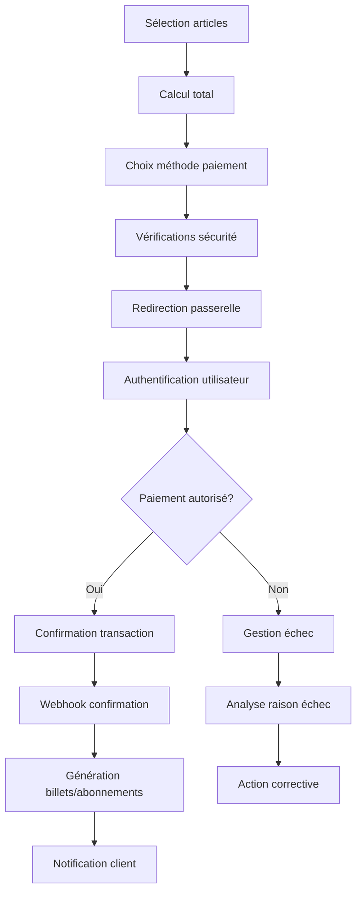
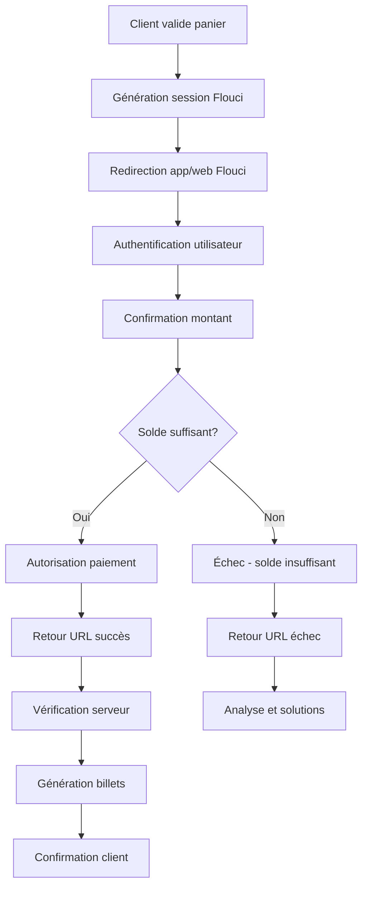

# Processus Business Entrix V3.0
## Groupe Fonctionnel : Paiements et facturation

---

## 📋 Vue d'ensemble

Ce groupe fonctionnel gère l'écosystème complet des transactions financières d'Entrix V3.0, incluant les **paiements anonymes**, les **méthodes locales tunisiennes**, la **facturation automatisée** et la **gestion des commissions**. Il assure la **sécurité maximale** et la **conformité réglementaire**.

### **Innovations V3.0**
- **💳 Paiements sans friction** : Transactions anonymes sécurisées
- **🇹🇳 Solutions locales** : Flouci, E-dinar, mobile money
- **🔄 Abonnements récurrents** : Prélèvements automatiques intelligents
- **📊 Analytics financiers** : Suivi performance temps réel
- **⚖️ Conformité totale** : RGPD, PCI-DSS, réglementation tunisienne

---

## 💳 Méthodes de paiement supportées

### **Paiements locaux tunisiens**

**🏦 Flouci (Poste Tunisienne)**
- **Part de marché** : Solution de paiement mobile leader en Tunisie
- **Public cible** : Utilisateurs smartphone avec comptes bancaires
- **Avantages** : Instantané, sécurisé, sans frais pour l'utilisateur
- **Limites** : 1,000 TND/transaction, 3,000 TND/jour

**Configuration Flouci** :
```json
{
  "flouci_config": {
    "api_endpoint": "https://developers.flouci.com/api/",
    "merchant_id": "ENTRIX_MERCHANT_ID",
    "api_key": "encrypted_api_key",
    "success_url": "https://entrix.tn/payment/success",
    "failure_url": "https://entrix.tn/payment/failed",
    "developer_tracking_id": "entrix_transaction_",
    
    "supported_features": {
      "instant_payment": true,
      "recurring_payments": true,
      "refunds": true,
      "payment_status_webhook": true
    },
    
    "transaction_limits": {
      "min_amount": 1.00,
      "max_amount": 1000.00,
      "daily_limit": 3000.00,
      "monthly_limit": 10000.00
    },
    
    "fees": {
      "customer_fee": 0.00,
      "merchant_fee_percent": 2.5,
      "fixed_fee": 0.00
    }
  }
}
```

**💰 E-dinar (Banque Centrale de Tunisie)**
- **Contexte** : Monnaie numérique officielle tunisienne
- **Usage** : Paiements gouvernementaux et institutionnels
- **Avantages** : Cours stable, régulation BCT
- **Intégration** : Via passerelles bancaires agréées

**📱 Mobile Money opérateurs**
- **Orange Money** : Portefeuille mobile Orange Tunisie
- **Ooredoo Money** : Solution Ooredoo Tunisie
- **Facturation mobile** : Prélèvement sur crédit téléphonique
- **Usage** : Micropaiements et populations non-bancarisées

### **Paiements internationaux**

**🌍 Cartes bancaires internationales**
- **Visa/Mastercard** : Cartes internationales 3D Secure
- **American Express** : Pour clientèle premium
- **Cartes locales** : Émises par banques tunisiennes
- **Cartes prépayées** : Solutions jeunes et contrôle budget

**💼 Portefeuilles digitaux**
- **PayPal** : Pour diaspora tunisienne
- **Apple Pay** : Utilisateurs iOS premium
- **Google Pay** : Android users internationaux
- **Samsung Pay** : Intégration NFC Samsung

### **Solutions spécialisées**

**🏢 Paiements B2B**
- **Virements SWIFT** : Transferts internationaux entreprises
- **Lettres de crédit** : Garanties commerciales
- **Financement participatif** : Crowdfunding événements
- **Crypto-monnaies** : Bitcoin, Ethereum (en étude)

---

## 🔄 Processus de paiement unifié

### **Workflow paiement standard**



### **Étape 1 : Initiation et calcul**

**Calcul du montant total** :
```sql
-- Fonction calcul total commande avec promotions
CREATE OR REPLACE FUNCTION calculate_order_total(
    p_items JSONB, -- [{type: 'ticket', id: 'uuid', quantity: 2, options: {...}}]
    p_promo_code VARCHAR(50) DEFAULT NULL,
    p_user_id UUID DEFAULT NULL,
    p_currency VARCHAR(3) DEFAULT 'TND'
) RETURNS TABLE(
    subtotal DECIMAL(12,2),
    discount_amount DECIMAL(12,2),
    taxes DECIMAL(12,2),
    fees DECIMAL(12,2),
    total DECIMAL(12,2),
    breakdown JSONB
) AS $$
DECLARE
    v_subtotal DECIMAL(12,2) := 0;
    v_discount DECIMAL(12,2) := 0;
    v_taxes DECIMAL(12,2) := 0;
    v_fees DECIMAL(12,2) := 0;
    v_total DECIMAL(12,2) := 0;
    v_breakdown JSONB := '[]'::jsonb;
    v_item JSONB;
    v_item_total DECIMAL(12,2);
    v_promo RECORD;
BEGIN
    -- Calcul subtotal par article
    FOR v_item IN SELECT * FROM jsonb_array_elements(p_items)
    LOOP
        IF v_item->>'type' = 'ticket' THEN
            SELECT 
                tt.base_price * (v_item->>'quantity')::INTEGER INTO v_item_total
            FROM ticket_types tt
            WHERE tt.id = (v_item->>'id')::UUID;
            
        ELSIF v_item->>'type' = 'subscription' THEN
            SELECT 
                sp.price * (v_item->>'quantity')::INTEGER INTO v_item_total
            FROM subscription_plans sp
            WHERE sp.id = (v_item->>'id')::UUID;
            
        ELSIF v_item->>'type' = 'merchandise' THEN
            SELECT 
                m.price * (v_item->>'quantity')::INTEGER INTO v_item_total
            FROM merchandise m
            WHERE m.id = (v_item->>'id')::UUID;
        END IF;
        
        v_subtotal := v_subtotal + v_item_total;
        
        -- Ajout au breakdown
        v_breakdown := v_breakdown || jsonb_build_object(
            'item', v_item,
            'unit_price', v_item_total / (v_item->>'quantity')::INTEGER,
            'total_price', v_item_total
        );
    END LOOP;
    
    -- Application code promo si fourni
    IF p_promo_code IS NOT NULL THEN
        SELECT * INTO v_promo
        FROM promotion_codes pc
        WHERE pc.code = p_promo_code
          AND pc.is_active = TRUE
          AND pc.valid_from <= NOW()
          AND pc.valid_until >= NOW()
          AND (pc.usage_limit IS NULL OR pc.current_usage < pc.usage_limit);
        
        IF FOUND THEN
            CASE v_promo.discount_type
                WHEN 'PERCENT' THEN
                    v_discount := v_subtotal * (v_promo.discount_value / 100);
                WHEN 'FIXED_AMOUNT' THEN
                    v_discount := LEAST(v_promo.discount_value, v_subtotal);
                WHEN 'FREE_SHIPPING' THEN
                    v_discount := 5.00; -- Frais de livraison standard
            END CASE;
            
            -- Limitation discount maximum
            IF v_promo.max_discount_amount IS NOT NULL THEN
                v_discount := LEAST(v_discount, v_promo.max_discount_amount);
            END IF;
        END IF;
    END IF;
    
    -- Calcul taxes (TVA 19% en Tunisie pour services numériques)
    v_taxes := (v_subtotal - v_discount) * 0.19;
    
    -- Frais de traitement selon méthode
    v_fees := CASE 
        WHEN v_subtotal > 100 THEN 0 -- Gratuit au-dessus de 100 TND
        ELSE 2.00 -- Frais fixes 2 TND
    END;
    
    v_total := v_subtotal - v_discount + v_taxes + v_fees;
    
    RETURN QUERY SELECT 
        v_subtotal, v_discount, v_taxes, v_fees, v_total, v_breakdown;
END;
$$ LANGUAGE plpgsql;
```

### **Étape 2 : Sélection méthode et sécurité**

**Interface de sélection paiement** :
```json
{
  "payment_interface": {
    "local_methods": {
      "flouci": {
        "display_name": "Flouci - Paiement mobile",
        "icon": "flouci_logo.png",
        "description": "Paiement instantané et sécurisé",
        "fees": "Gratuit pour vous",
        "processing_time": "Instantané",
        "limits": "Jusqu'à 1,000 TND/transaction"
      },
      "bank_card_tn": {
        "display_name": "Carte bancaire tunisienne", 
        "icon": "cards_tn.png",
        "description": "Visa, Mastercard émises en Tunisie",
        "fees": "Gratuit",
        "processing_time": "Instantané",
        "security": "3D Secure requis"
      },
      "mobile_money": {
        "display_name": "Mobile Money",
        "icon": "mobile_money.png", 
        "description": "Orange Money, Ooredoo Money",
        "fees": "Selon opérateur",
        "limits": "Micropaiements"
      }
    },
    
    "international_methods": {
      "paypal": {
        "display_name": "PayPal",
        "icon": "paypal_logo.png",
        "description": "Paiement international sécurisé",
        "fees": "3.4% + 0.35€",
        "currencies": ["USD", "EUR", "TND"]
      },
      "stripe": {
        "display_name": "Carte internationale",
        "icon": "cards_intl.png",
        "description": "Visa, Mastercard, Amex",
        "fees": "2.9% + 0.30€",
        "security": "PCI Level 1"
      }
    },
    
    "alternative_methods": {
      "bank_transfer": {
        "display_name": "Virement bancaire",
        "description": "Pour montants importants",
        "processing_time": "1-3 jours ouvrables",
        "min_amount": 200.00
      },
      "installments": {
        "display_name": "Paiement en plusieurs fois",
        "description": "3x sans frais à partir de 150 TND",
        "conditions": "Carte bancaire requise"
      }
    }
  }
}
```

### **Étape 3 : Traitement et validation**

**Processus de traitement sécurisé** :
```sql
-- Fonction traitement paiement avec gestion d'erreurs
CREATE OR REPLACE FUNCTION process_payment_transaction(
    p_order_id UUID,
    p_payment_method VARCHAR(50),
    p_amount DECIMAL(12,2),
    p_currency VARCHAR(3),
    p_customer_data JSONB,
    p_payment_data JSONB
) RETURNS TABLE(
    success BOOLEAN,
    transaction_id UUID,
    gateway_reference VARCHAR(255),
    status VARCHAR(50),
    error_code VARCHAR(20),
    error_message TEXT
) AS $$
DECLARE
    v_transaction_id UUID;
    v_gateway_response JSONB;
    v_order RECORD;
BEGIN
    -- Vérification commande
    SELECT * INTO v_order
    FROM orders o
    WHERE o.id = p_order_id 
      AND o.status = 'PENDING_PAYMENT'
      AND o.expires_at > NOW();
    
    IF NOT FOUND THEN
        RETURN QUERY SELECT FALSE, NULL::UUID, NULL::VARCHAR, 
                           'FAILED', 'ORDER_EXPIRED', 
                           'Commande expirée ou introuvable';
        RETURN;
    END IF;
    
    -- Création transaction
    v_transaction_id := gen_random_uuid();
    
    INSERT INTO payment_transactions (
        id, order_id, payment_method, amount, currency,
        status, customer_data, payment_data, created_at
    ) VALUES (
        v_transaction_id, p_order_id, p_payment_method, 
        p_amount, p_currency, 'PROCESSING',
        p_customer_data, p_payment_data, NOW()
    );
    
    -- Traitement selon méthode
    CASE p_payment_method
        WHEN 'FLOUCI' THEN
            v_gateway_response := process_flouci_payment(
                v_transaction_id, p_amount, p_customer_data, p_payment_data
            );
            
        WHEN 'STRIPE_CARD' THEN
            v_gateway_response := process_stripe_payment(
                v_transaction_id, p_amount, p_currency, p_payment_data
            );
            
        WHEN 'PAYPAL' THEN
            v_gateway_response := process_paypal_payment(
                v_transaction_id, p_amount, p_currency, p_payment_data
            );
            
        WHEN 'BANK_TRANSFER' THEN
            v_gateway_response := initiate_bank_transfer(
                v_transaction_id, p_amount, p_customer_data
            );
            
        ELSE
            RAISE EXCEPTION 'Méthode de paiement non supportée: %', p_payment_method;
    END CASE;
    
    -- Mise à jour transaction avec réponse gateway
    UPDATE payment_transactions 
    SET 
        gateway_transaction_id = v_gateway_response->>'transaction_id',
        gateway_response = v_gateway_response,
        status = v_gateway_response->>'status',
        processed_at = NOW()
    WHERE id = v_transaction_id;
    
    -- Gestion du résultat
    IF (v_gateway_response->>'success')::BOOLEAN THEN
        -- Succès
        UPDATE orders 
        SET status = 'PAYMENT_COMPLETED',
            paid_at = NOW()
        WHERE id = p_order_id;
        
        -- Déclencher génération billets/abonnements
        PERFORM generate_order_items(p_order_id);
        
        RETURN QUERY SELECT 
            TRUE, v_transaction_id, 
            v_gateway_response->>'transaction_id',
            v_gateway_response->>'status',
            NULL::VARCHAR, NULL::TEXT;
    ELSE
        -- Échec
        UPDATE orders 
        SET status = 'PAYMENT_FAILED',
            failure_reason = v_gateway_response->>'error_message'
        WHERE id = p_order_id;
        
        RETURN QUERY SELECT 
            FALSE, v_transaction_id,
            v_gateway_response->>'transaction_id',
            v_gateway_response->>'status',
            v_gateway_response->>'error_code',
            v_gateway_response->>'error_message';
    END IF;
    
EXCEPTION WHEN OTHERS THEN
    -- Erreur système
    UPDATE payment_transactions 
    SET status = 'ERROR',
        error_message = SQLERRM
    WHERE id = v_transaction_id;
    
    RETURN QUERY SELECT FALSE, v_transaction_id, NULL::VARCHAR,
                       'ERROR', 'SYSTEM_ERROR', SQLERRM;
END;
$$ LANGUAGE plpgsql;
```

---

## 🏦 Intégration Flouci (Solution principale)

### **Configuration et authentification**

**Setup API Flouci** :
```javascript
// Configuration client Flouci
class FlouciPaymentGateway {
    constructor(config) {
        this.apiUrl = config.apiUrl;
        this.appToken = config.appToken;
        this.appSecret = config.appSecret;
        this.successUrl = config.successUrl;
        this.failureUrl = config.failureUrl;
    }
    
    async generatePaymentSession(orderData) {
        try {
            const payload = {
                app_token: this.appToken,
                app_secret: this.appSecret,
                amount: orderData.amount * 1000, // Conversion TND -> millimes
                accept_card: "true",
                session_timeout_secs: 1200, // 20 minutes
                success_link: `${this.successUrl}?order_id=${orderData.orderId}`,
                fail_link: `${this.failureUrl}?order_id=${orderData.orderId}`,
                developer_tracking_id: `ENTRIX_${orderData.orderId}`
            };
            
            const response = await fetch(`${this.apiUrl}/generate_payment`, {
                method: 'POST',
                headers: {
                    'Content-Type': 'application/json'
                },
                body: JSON.stringify(payload)
            });
            
            const result = await response.json();
            
            if (result.success) {
                return {
                    success: true,
                    paymentId: result.result.payment_id,
                    paymentUrl: `https://developers.flouci.com/web_payment/${result.result.payment_id}`,
                    sessionId: result.result.session_id
                };
            } else {
                throw new Error(result.result || 'Erreur génération session Flouci');
            }
        } catch (error) {
            console.error('Erreur Flouci generatePaymentSession:', error);
            return {
                success: false,
                error: error.message
            };
        }
    }
    
    async verifyPayment(paymentId) {
        try {
            const payload = {
                app_token: this.appToken,
                app_secret: this.appSecret,
                payment_id: paymentId
            };
            
            const response = await fetch(`${this.apiUrl}/verify_payment`, {
                method: 'POST',
                headers: {
                    'Content-Type': 'application/json'
                },
                body: JSON.stringify(payload)
            });
            
            const result = await response.json();
            
            return {
                success: result.success,
                status: result.result?.status,
                amount: result.result?.amount,
                customerName: result.result?.customer_name,
                customerPhone: result.result?.customer_phone,
                transactionId: result.result?.transaction_id
            };
        } catch (error) {
            console.error('Erreur Flouci verifyPayment:', error);
            return {
                success: false,
                error: error.message
            };
        }
    }
}
```

### **Workflow paiement Flouci complet**



### **Gestion des webhooks Flouci**

**Réception notifications temps réel** :
```javascript
// Endpoint webhook Flouci
app.post('/api/webhooks/flouci', async (req, res) => {
    try {
        const signature = req.headers['x-flouci-signature'];
        const payload = req.body;
        
        // Vérification signature webhook
        if (!verifyFlouciSignature(payload, signature, process.env.FLOUCI_WEBHOOK_SECRET)) {
            return res.status(401).json({ error: 'Signature invalide' });
        }
        
        const { payment_id, status, amount, developer_tracking_id } = payload;
        const orderId = developer_tracking_id.replace('ENTRIX_', '');
        
        // Traitement selon statut
        switch (status) {
            case 'SUCCESS':
                await handlePaymentSuccess(orderId, payment_id, amount);
                break;
                
            case 'FAILED':
                await handlePaymentFailure(orderId, payload.failure_reason);
                break;
                
            case 'PENDING':
                await updatePaymentStatus(orderId, 'PENDING');
                break;
                
            default:
                console.warn('Statut Flouci non géré:', status);
        }
        
        res.status(200).json({ received: true });
    } catch (error) {
        console.error('Erreur webhook Flouci:', error);
        res.status(500).json({ error: 'Erreur traitement webhook' });
    }
});

async function handlePaymentSuccess(orderId, paymentId, amount) {
    try {
        // Vérification double sécurité
        const verification = await flouciGateway.verifyPayment(paymentId);
        
        if (verification.success && verification.status === 'SUCCESS') {
            // Mise à jour commande
            await updateOrderStatus(orderId, 'PAYMENT_COMPLETED', {
                flouci_payment_id: paymentId,
                flouci_transaction_id: verification.transactionId,
                verified_amount: verification.amount / 1000 // millimes -> TND
            });
            
            // Génération billets/abonnements
            await generateOrderItems(orderId);
            
            // Notification client
            await sendPaymentConfirmationEmail(orderId);
            
            console.log(`Paiement Flouci confirmé pour commande ${orderId}`);
        } else {
            throw new Error('Échec vérification paiement Flouci');
        }
    } catch (error) {
        console.error('Erreur handlePaymentSuccess:', error);
        await logPaymentError(orderId, error.message);
    }
}
```

---

## 💰 Gestion des abonnements récurrents

### **Prélèvements automatiques**

**Configuration récurrence** :
```sql
-- Table configuration abonnements récurrents
CREATE TABLE recurring_payment_configs (
    id UUID PRIMARY KEY DEFAULT gen_random_uuid(),
    subscription_id UUID NOT NULL REFERENCES subscriptions(id),
    payment_method_id UUID NOT NULL REFERENCES saved_payment_methods(id),
    amount DECIMAL(10,2) NOT NULL,
    currency VARCHAR(3) NOT NULL DEFAULT 'TND',
    frequency VARCHAR(20) NOT NULL, -- MONTHLY, QUARTERLY, YEARLY
    next_payment_date DATE NOT NULL,
    max_attempts INTEGER DEFAULT 3,
    current_failures INTEGER DEFAULT 0,
    is_active BOOLEAN DEFAULT TRUE,
    created_at TIMESTAMPTZ DEFAULT NOW(),
    updated_at TIMESTAMPTZ DEFAULT NOW()
);
```

**Processus de prélèvement automatique** :
```sql
-- Job quotidien de traitement récurrences
CREATE OR REPLACE FUNCTION process_recurring_payments()
RETURNS TABLE(
    processed_count INTEGER,
    success_count INTEGER,
    failure_count INTEGER,
    errors TEXT[]
) AS $$
DECLARE
    v_processed INTEGER := 0;
    v_success INTEGER := 0;
    v_failure INTEGER := 0;
    v_errors TEXT[] := ARRAY[]::TEXT[];
    v_recurring RECORD;
    v_result RECORD;
BEGIN
    -- Traitement des prélèvements dus aujourd'hui
    FOR v_recurring IN
        SELECT rpc.*, s.guest_name, s.guest_email, spm.gateway_data
        FROM recurring_payment_configs rpc
        JOIN subscriptions s ON rpc.subscription_id = s.id
        JOIN saved_payment_methods spm ON rpc.payment_method_id = spm.id
        WHERE rpc.next_payment_date <= CURRENT_DATE
          AND rpc.is_active = TRUE
          AND rpc.current_failures < rpc.max_attempts
    LOOP
        v_processed := v_processed + 1;
        
        BEGIN
            -- Tentative de prélèvement
            SELECT * INTO v_result
            FROM charge_saved_payment_method(
                v_recurring.payment_method_id,
                v_recurring.amount,
                v_recurring.currency,
                'Renouvellement abonnement ' || v_recurring.subscription_id
            );
            
            IF v_result.success THEN
                v_success := v_success + 1;
                
                -- Mise à jour prochaine échéance
                UPDATE recurring_payment_configs
                SET next_payment_date = CASE v_recurring.frequency
                    WHEN 'MONTHLY' THEN CURRENT_DATE + INTERVAL '1 month'
                    WHEN 'QUARTERLY' THEN CURRENT_DATE + INTERVAL '3 months'
                    WHEN 'YEARLY' THEN CURRENT_DATE + INTERVAL '1 year'
                END,
                current_failures = 0,
                updated_at = NOW()
                WHERE id = v_recurring.id;
                
                -- Notification succès
                PERFORM send_recurring_payment_success_notification(
                    v_recurring.subscription_id,
                    v_recurring.amount
                );
                
            ELSE
                v_failure := v_failure + 1;
                
                -- Incrément échecs
                UPDATE recurring_payment_configs
                SET current_failures = current_failures + 1,
                    updated_at = NOW()
                WHERE id = v_recurring.id;
                
                -- Désactivation si max tentatives atteint
                IF v_recurring.current_failures + 1 >= v_recurring.max_attempts THEN
                    UPDATE recurring_payment_configs
                    SET is_active = FALSE
                    WHERE id = v_recurring.id;
                    
                    -- Notification échec définitif
                    PERFORM send_recurring_payment_final_failure_notification(
                        v_recurring.subscription_id
                    );
                ELSE
                    -- Notification échec avec nouvelles tentatives
                    PERFORM send_recurring_payment_retry_notification(
                        v_recurring.subscription_id,
                        v_recurring.max_attempts - v_recurring.current_failures - 1
                    );
                END IF;
                
                v_errors := array_append(v_errors, 
                    'Échec ' || v_recurring.subscription_id || ': ' || v_result.error_message);
            END IF;
            
        EXCEPTION WHEN OTHERS THEN
            v_failure := v_failure + 1;
            v_errors := array_append(v_errors, 
                'Erreur système ' || v_recurring.subscription_id || ': ' || SQLERRM);
        END;
    END LOOP;
    
    -- Log résultats globaux
    INSERT INTO recurring_payment_logs (
        processed_date, processed_count, success_count, 
        failure_count, errors, created_at
    ) VALUES (
        CURRENT_DATE, v_processed, v_success, v_failure, v_errors, NOW()
    );
    
    RETURN QUERY SELECT v_processed, v_success, v_failure, v_errors;
END;
$$ LANGUAGE plpgsql;
```

---

## 🧾 Facturation automatisée

### **Génération factures conformes**

**Template facture tunisienne** :
```json
{
  "invoice_template": {
    "header": {
      "company_info": {
        "name": "ENTRIX SARL",
        "address": "Avenue Habib Bourguiba, Tunis 1001",
        "tax_id": "1234567/A/M/000",
        "registration": "B123456789",
        "phone": "+216 71 123 456",
        "email": "facturation@entrix.tn"
      },
      "logo": "entrix_logo_facture.png",
      "invoice_number": "FACT-2025-000123",
      "issue_date": "2025-02-15",
      "due_date": "2025-03-15"
    },
    
    "customer_info": {
      "type": "individual", // or "company"
      "name": "Ahmed Ben Salah",
      "address": "Rue de la République, Tunis",
      "tax_id": null, // Si particulier
      "email": "ahmed@email.com",
      "phone": "+216 98 123 456"
    },
    
    "line_items": [
      {
        "description": "Abonnement Club Africain Saison 2025",
        "quantity": 1,
        "unit_price": 350.00,
        "total_ht": 350.00,
        "tax_rate": 19.0,
        "tax_amount": 66.50,
        "total_ttc": 416.50
      }
    ],
    
    "totals": {
      "subtotal_ht": 350.00,
      "total_tax": 66.50,
      "total_ttc": 416.50,
      "currency": "TND"
    },
    
    "payment_info": {
      "method": "Flouci - Paiement mobile",
      "transaction_id": "FLC_240715_ABC123",
      "payment_date": "2025-02-15",
      "status": "PAID"
    },
    
    "footer": {
      "notes": "Merci pour votre confiance. Cette facture est générée automatiquement.",
      "legal_mentions": "TVA 19% - Assujetti à la TVA selon art. 1 du Code TVA",
      "bank_details": {
        "bank": "Banque Internationale Arabe de Tunisie",
        "rib": "08 151 0123456789 12"
      }
    }
  }
}
```

**Génération PDF automatique** :
```javascript
// Service génération factures PDF
class InvoiceGenerator {
    constructor() {
        this.puppeteer = require('puppeteer');
        this.handlebars = require('handlebars');
    }
    
    async generateInvoicePDF(invoiceData) {
        try {
            // Chargement template HTML
            const templateHtml = await fs.readFile('./templates/invoice_template.hbs', 'utf8');
            const template = this.handlebars.compile(templateHtml);
            
            // Génération HTML avec données
            const html = template(invoiceData);
            
            // Conversion PDF
            const browser = await this.puppeteer.launch();
            const page = await browser.newPage();
            
            await page.setContent(html, { waitUntil: 'networkidle0' });
            
            const pdfBuffer = await page.pdf({
                format: 'A4',
                margin: {
                    top: '20mm',
                    right: '15mm',
                    bottom: '20mm',
                    left: '15mm'
                },
                displayHeaderFooter: true,
                headerTemplate: '<div></div>',
                footerTemplate: `
                    <div style="font-size: 10px; width: 100%; text-align: center;">
                        Page <span class="pageNumber"></span> sur <span class="totalPages"></span>
                    </div>
                `
            });
            
            await browser.close();
            
            return {
                success: true,
                pdfBuffer: pdfBuffer,
                fileName: `facture_${invoiceData.invoice_number}.pdf`
            };
        } catch (error) {
            console.error('Erreur génération PDF facture:', error);
            return {
                success: false,
                error: error.message
            };
        }
    }
    
    async generateAndSendInvoice(orderId) {
        try {
            // Récupération données commande
            const orderData = await this.getOrderInvoiceData(orderId);
            
            // Génération PDF
            const pdfResult = await this.generateInvoicePDF(orderData);
            
            if (pdfResult.success) {
                // Sauvegarde PDF
                const fileName = `invoices/${pdfResult.fileName}`;
                await this.saveToStorage(fileName, pdfResult.pdfBuffer);
                
                // Envoi email avec facture
                await this.sendInvoiceEmail(orderData.customer_email, {
                    fileName: pdfResult.fileName,
                    pdfBuffer: pdfResult.pdfBuffer,
                    orderData: orderData
                });
                
                // Mise à jour commande
                await this.updateOrderInvoice(orderId, fileName);
                
                return { success: true, invoiceUrl: fileName };
            } else {
                throw new Error(pdfResult.error);
            }
        } catch (error) {
            console.error('Erreur generateAndSendInvoice:', error);
            return { success: false, error: error.message };
        }
    }
}
```

---

## 💸 Gestion des remboursements

### **Politique de remboursement**

**Conditions par type d'événement** :
```json
{
  "refund_policies": {
    "sports_events": {
      "cancellation_periods": [
        {
          "before_event": "72_hours",
          "refund_percentage": 100,
          "fees": 0
        },
        {
          "before_event": "24_hours", 
          "refund_percentage": 80,
          "fees": 5.00
        },
        {
          "before_event": "2_hours",
          "refund_percentage": 50,
          "fees": 10.00
        }
      ],
      "force_majeure": {
        "weather": {"refund_percentage": 100},
        "security": {"refund_percentage": 100},
        "player_injury": {"refund_percentage": 100}
      }
    },
    
    "concerts": {
      "cancellation_periods": [
        {
          "before_event": "7_days",
          "refund_percentage": 100,
          "fees": 0
        },
        {
          "before_event": "24_hours",
          "refund_percentage": 60,
          "fees": 10.00
        }
      ],
      "artist_cancellation": {"refund_percentage": 100}
    },
    
    "subscriptions": {
      "cooling_off_period": "14_days",
      "used_events_deduction": true,
      "pro_rata_calculation": true,
      "early_termination_fee": 25.00
    }
  }
}
```

### **Processus de remboursement automatisé**

```sql
-- Fonction calcul et traitement remboursement
CREATE OR REPLACE FUNCTION process_refund_request(
    p_order_id UUID,
    p_reason VARCHAR(100),
    p_requested_by UUID,
    p_force_majeure BOOLEAN DEFAULT FALSE
) RETURNS TABLE(
    refund_id UUID,
    eligible BOOLEAN,
    refund_amount DECIMAL(10,2),
    processing_fees DECIMAL(10,2),
    estimated_processing_days INTEGER,
    next_steps TEXT[]
) AS $$
DECLARE
    v_order RECORD;
    v_event RECORD;
    v_refund_id UUID;
    v_hours_before_event INTEGER;
    v_refund_percentage DECIMAL(3,2);
    v_base_amount DECIMAL(10,2);
    v_refund_amount DECIMAL(10,2);
    v_fees DECIMAL(10,2) := 0;
    v_next_steps TEXT[] := ARRAY[]::TEXT[];
BEGIN
    -- Récupération commande et événement
    SELECT o.*, e.scheduled_start, e.category INTO v_order, v_event
    FROM orders o
    LEFT JOIN order_items oi ON o.id = oi.order_id
    LEFT JOIN events e ON oi.event_id = e.id
    WHERE o.id = p_order_id;
    
    IF NOT FOUND THEN
        RETURN QUERY SELECT NULL::UUID, FALSE, 0::DECIMAL, 0::DECIMAL, 
                           0, ARRAY['Commande non trouvée']::TEXT[];
        RETURN;
    END IF;
    
    -- Calcul délai avant événement
    IF v_event.scheduled_start IS NOT NULL THEN
        v_hours_before_event := EXTRACT(EPOCH FROM (v_event.scheduled_start - NOW())) / 3600;
    ELSE
        v_hours_before_event := 999999; -- Pas d'événement spécifique (abonnement)
    END IF;
    
    v_base_amount := v_order.total_amount;
    
    -- Calcul éligibilité et pourcentage selon politique
    IF p_force_majeure THEN
        -- Cas de force majeure : remboursement intégral
        v_refund_percentage := 1.00;
        v_fees := 0;
        v_next_steps := array_append(v_next_steps, 'Remboursement prioritaire sous 3-5 jours');
        
    ELSIF v_event.category = 'SPORTS' THEN
        CASE 
            WHEN v_hours_before_event >= 72 THEN
                v_refund_percentage := 1.00;
                v_fees := 0;
            WHEN v_hours_before_event >= 24 THEN
                v_refund_percentage := 0.80;
                v_fees := 5.00;
            WHEN v_hours_before_event >= 2 THEN
                v_refund_percentage := 0.50;
                v_fees := 10.00;
            ELSE
                v_refund_percentage := 0;
                v_fees := 0;
        END CASE;
        
    ELSIF v_event.category IN ('MUSIC', 'CULTURE') THEN
        CASE 
            WHEN v_hours_before_event >= 168 THEN -- 7 jours
                v_refund_percentage := 1.00;
                v_fees := 0;
            WHEN v_hours_before_event >= 24 THEN
                v_refund_percentage := 0.60;
                v_fees := 10.00;
            ELSE
                v_refund_percentage := 0;
                v_fees := 0;
        END CASE;
    ELSE
        -- Politique par défaut
        v_refund_percentage := CASE 
            WHEN v_hours_before_event >= 48 THEN 0.90
            WHEN v_hours_before_event >= 24 THEN 0.50
            ELSE 0
        END;
        v_fees := CASE WHEN v_refund_percentage > 0 THEN 5.00 ELSE 0 END;
    END IF;
    
    v_refund_amount := (v_base_amount * v_refund_percentage) - v_fees;
    
    -- Création demande de remboursement si éligible
    IF v_refund_percentage > 0 THEN
        v_refund_id := gen_random_uuid();
        
        INSERT INTO refund_requests (
            id, order_id, requested_by, reason,
            original_amount, refund_percentage, processing_fees,
            refund_amount, status, created_at
        ) VALUES (
            v_refund_id, p_order_id, p_requested_by, p_reason,
            v_base_amount, v_refund_percentage, v_fees,
            v_refund_amount, 'PENDING_APPROVAL', NOW()
        );
        
        -- Définition prochaines étapes
        v_next_steps := array_append(v_next_steps, 'Validation automatique en cours');
        v_next_steps := array_append(v_next_steps, 'Remboursement sous 5-10 jours ouvrables');
        
        IF v_fees > 0 THEN
            v_next_steps := array_append(v_next_steps, 
                'Frais de traitement: ' || v_fees || ' TND');
        END IF;
        
        -- Auto-approbation si conditions standards
        IF NOT p_force_majeure AND v_refund_percentage IN (1.00, 0.80, 0.60, 0.50) THEN
            UPDATE refund_requests 
            SET status = 'APPROVED',
                approved_at = NOW(),
                approved_by = 'SYSTEM_AUTO'
            WHERE id = v_refund_id;
            
            -- Initier remboursement automatique
            PERFORM initiate_automatic_refund(v_refund_id);
        END IF;
    ELSE
        v_next_steps := array_append(v_next_steps, 'Remboursement non éligible selon nos conditions');
        v_next_steps := array_append(v_next_steps, 'Contactez le service client pour cas exceptionnels');
    END IF;
    
    RETURN QUERY SELECT 
        v_refund_id,
        v_refund_percentage > 0,
        v_refund_amount,
        v_fees,
        CASE 
            WHEN p_force_majeure THEN 3
            WHEN v_refund_percentage = 1.00 THEN 5
            ELSE 10
        END,
        v_next_steps;
END;
$$ LANGUAGE plpgsql;
```

---

## 📊 Analytics financiers

### **Dashboard financier temps réel**

**KPIs principaux** :
```sql
-- Vue consolidée performance financière
CREATE OR REPLACE VIEW financial_performance_dashboard AS
WITH daily_metrics AS (
    SELECT 
        DATE(pt.created_at) as transaction_date,
        COUNT(*) as total_transactions,
        COUNT(*) FILTER (WHERE pt.status = 'COMPLETED') as successful_transactions,
        SUM(pt.amount) FILTER (WHERE pt.status = 'COMPLETED') as daily_revenue,
        AVG(pt.amount) FILTER (WHERE pt.status = 'COMPLETED') as avg_transaction_value,
        
        -- Répartition par méthode
        COUNT(*) FILTER (WHERE pt.payment_method = 'FLOUCI') as flouci_transactions,
        COUNT(*) FILTER (WHERE pt.payment_method LIKE 'STRIPE%') as card_transactions,
        COUNT(*) FILTER (WHERE pt.payment_method = 'PAYPAL') as paypal_transactions,
        
        -- Métriques de succès
        ROUND(
            COUNT(*) FILTER (WHERE pt.status = 'COMPLETED')::DECIMAL / 
            NULLIF(COUNT(*), 0) * 100, 2
        ) as success_rate_percent
        
    FROM payment_transactions pt
    WHERE pt.created_at >= CURRENT_DATE - INTERVAL '30 days'
    GROUP BY DATE(pt.created_at)
),
monthly_trends AS (
    SELECT 
        DATE_TRUNC('month', pt.created_at) as month,
        SUM(pt.amount) FILTER (WHERE pt.status = 'COMPLETED') as monthly_revenue,
        COUNT(DISTINCT o.user_id) FILTER (WHERE o.user_id IS NOT NULL) as unique_customers,
        COUNT(*) FILTER (WHERE o.user_id IS NULL) as anonymous_purchases
    FROM payment_transactions pt
    JOIN orders o ON pt.order_id = o.id
    WHERE pt.created_at >= CURRENT_DATE - INTERVAL '12 months'
    GROUP BY DATE_TRUNC('month', pt.created_at)
)
SELECT 
    -- Métriques globales
    (SELECT SUM(daily_revenue) FROM daily_metrics WHERE transaction_date >= CURRENT_DATE - INTERVAL '30 days') as revenue_last_30_days,
    (SELECT AVG(success_rate_percent) FROM daily_metrics WHERE transaction_date >= CURRENT_DATE - INTERVAL '7 days') as avg_success_rate_7d,
    (SELECT AVG(avg_transaction_value) FROM daily_metrics WHERE transaction_date >= CURRENT_DATE - INTERVAL '30 days') as avg_transaction_30d,
    
    -- Top méthodes de paiement
    (SELECT json_agg(json_build_object(
        'method', payment_method,
        'count', COUNT(*),
        'revenue', SUM(amount),
        'success_rate', ROUND(
            COUNT(*) FILTER (WHERE status = 'COMPLETED')::DECIMAL / 
            COUNT(*) * 100, 1
        )
    ))
     FROM payment_transactions 
     WHERE created_at >= CURRENT_DATE - INTERVAL '30 days'
     GROUP BY payment_method
     ORDER BY SUM(amount) DESC) as payment_methods_performance,
    
    -- Évolution mensuelle
    (SELECT json_agg(json_build_object(
        'month', month,
        'revenue', monthly_revenue,
        'customers', unique_customers,
        'anonymous_sales', anonymous_purchases
    ) ORDER BY month)
     FROM monthly_trends) as monthly_evolution,
    
    -- Remboursements
    (SELECT COUNT(*) FROM refund_requests WHERE created_at >= CURRENT_DATE - INTERVAL '30 days') as refund_requests_30d,
    (SELECT SUM(refund_amount) FROM refund_requests WHERE status = 'COMPLETED' AND created_at >= CURRENT_DATE - INTERVAL '30 days') as refunds_amount_30d;
```

### **Détection de fraude**

**Algorithmes de détection** :
```sql
-- Système détection transactions suspectes
CREATE OR REPLACE FUNCTION detect_suspicious_transactions()
RETURNS TABLE(
    transaction_id UUID,
    risk_score INTEGER,
    risk_factors TEXT[],
    recommended_action VARCHAR(50)
) AS $$
BEGIN
    RETURN QUERY
    WITH transaction_analysis AS (
        SELECT 
            pt.id,
            pt.amount,
            pt.payment_method,
            pt.customer_data,
            o.user_id,
            o.guest_email,
            
            -- Facteurs de risque
            CASE WHEN pt.amount > 1000 THEN 20 ELSE 0 END as high_amount_risk,
            
            CASE WHEN (pt.customer_data->>'ip_country') != 'TN' THEN 25 ELSE 0 END as foreign_ip_risk,
            
            CASE WHEN EXISTS (
                SELECT 1 FROM payment_transactions pt2
                WHERE pt2.customer_data->>'ip_address' = pt.customer_data->>'ip_address'
                  AND pt2.status = 'FAILED'
                  AND pt2.created_at > NOW() - INTERVAL '24 hours'
                HAVING COUNT(*) >= 3
            ) THEN 30 ELSE 0 END as multiple_failures_risk,
            
            CASE WHEN pt.payment_method IN ('PAYPAL', 'STRIPE_CARD') 
                 AND (pt.customer_data->>'card_country') != 'TN' THEN 15 ELSE 0 END as foreign_card_risk,
            
            CASE WHEN o.user_id IS NULL 
                 AND pt.amount > 500 THEN 10 ELSE 0 END as high_anonymous_risk,
            
            CASE WHEN (pt.customer_data->>'velocity_check')::INTEGER > 5 THEN 20 ELSE 0 END as velocity_risk
            
        FROM payment_transactions pt
        JOIN orders o ON pt.order_id = o.id
        WHERE pt.created_at > NOW() - INTERVAL '24 hours'
          AND pt.status IN ('PROCESSING', 'PENDING')
    )
    SELECT 
        ta.id,
        (ta.high_amount_risk + ta.foreign_ip_risk + ta.multiple_failures_risk + 
         ta.foreign_card_risk + ta.high_anonymous_risk + ta.velocity_risk) as risk_score,
         
        ARRAY_REMOVE(ARRAY[
            CASE WHEN ta.high_amount_risk > 0 THEN 'Montant élevé' END,
            CASE WHEN ta.foreign_ip_risk > 0 THEN 'IP étrangère' END,
            CASE WHEN ta.multiple_failures_risk > 0 THEN 'Échecs multiples récents' END,
            CASE WHEN ta.foreign_card_risk > 0 THEN 'Carte étrangère' END,
            CASE WHEN ta.high_anonymous_risk > 0 THEN 'Achat anonyme élevé' END,
            CASE WHEN ta.velocity_risk > 0 THEN 'Vitesse transactions suspecte' END
        ], NULL) as risk_factors,
        
        CASE 
            WHEN (ta.high_amount_risk + ta.foreign_ip_risk + ta.multiple_failures_risk + 
                  ta.foreign_card_risk + ta.high_anonymous_risk + ta.velocity_risk) >= 60 
            THEN 'BLOCK_IMMEDIATELY'
            WHEN (ta.high_amount_risk + ta.foreign_ip_risk + ta.multiple_failures_risk + 
                  ta.foreign_card_risk + ta.high_anonymous_risk + ta.velocity_risk) >= 40 
            THEN 'MANUAL_REVIEW'
            WHEN (ta.high_amount_risk + ta.foreign_ip_risk + ta.multiple_failures_risk + 
                  ta.foreign_card_risk + ta.high_anonymous_risk + ta.velocity_risk) >= 20 
            THEN 'ENHANCED_VERIFICATION'
            ELSE 'MONITOR'
        END as recommended_action
        
    FROM transaction_analysis ta
    WHERE (ta.high_amount_risk + ta.foreign_ip_risk + ta.multiple_failures_risk + 
           ta.foreign_card_risk + ta.high_anonymous_risk + ta.velocity_risk) > 0
    ORDER BY risk_score DESC;
END;
$$ LANGUAGE plpgsql;
```

---

Cette documentation couvre l'ensemble de l'écosystème de paiements et facturation d'Entrix V3.0, depuis les méthodes locales tunisiennes jusqu'aux analytics avancés, en passant par la sécurité et la conformité réglementaire.