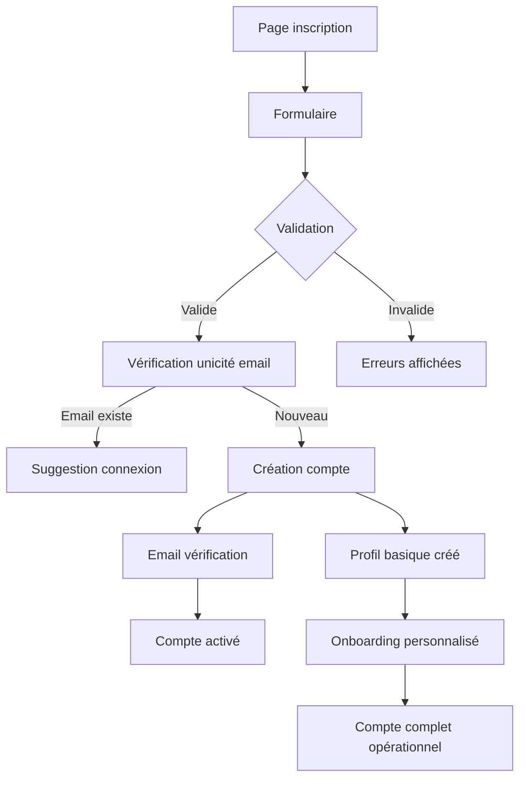
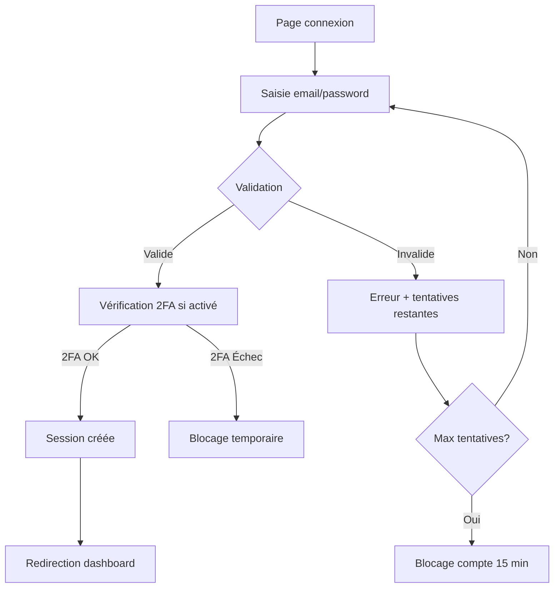
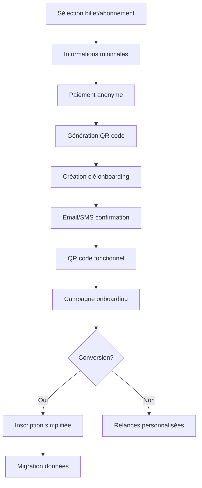
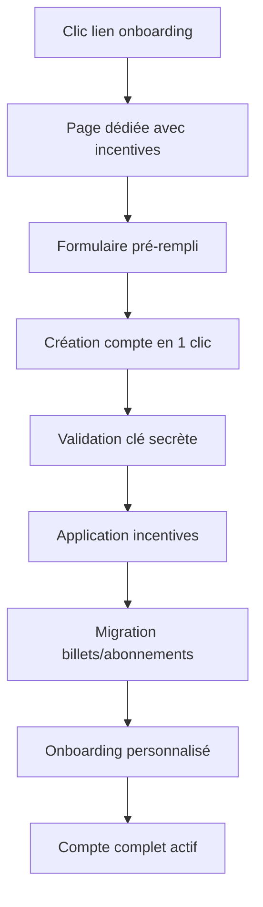
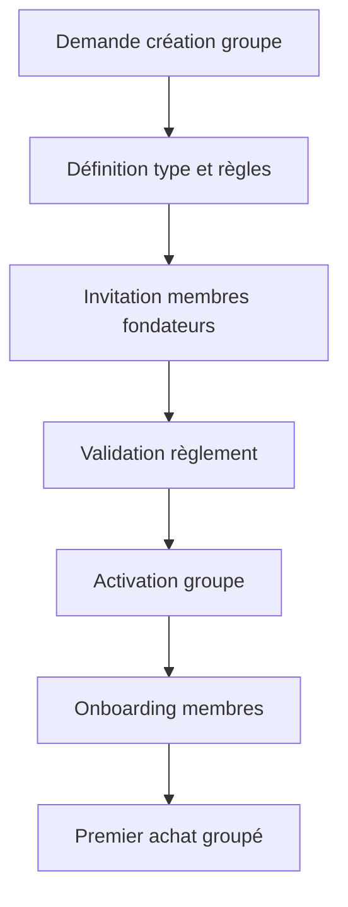

# Processus Business Entrix V3.0
## Groupe Fonctionnel : Gestion des utilisateurs/groupes et anonymat

---

## 📋 Vue d'ensemble

Ce groupe fonctionnel couvre l'écosystème complet de gestion des utilisateurs sur Entrix V3.0, incluant les **innovations majeures d'anonymat** et le **système d'onboarding intelligent**. Il gère la coexistence entre utilisateurs enregistrés et anonymes avec des mécanismes de conversion optimisés.

### **Innovations V3.0**
- **👤 Utilisateurs hybrides** : Enregistrés ET anonymes supportés
- **🔐 Onboarding intelligent** : Conversion via clés secrètes et incentives
- **🎫 Expérience sans friction** : Achat immédiat sans inscription obligatoire
- **📈 Analytics comportementaux** : Suivi performance conversion anonyme → enregistré

---

## 👤 Processus d'inscription utilisateur

### **Flux complet inscription classique**



### **Étape 1 : Collecte des données initiales**

**Interface utilisateur** : Formulaire d'inscription responsive
**URL** : `https://entrix.tn/signup`

**Données collectées avec validation** :
```json
{
  "email": "mohamed.supporter@gmail.com",
  "password": "ClubAfricain2025!",
  "password_confirm": "ClubAfricain2025!",
  "first_name": "Mohamed",
  "last_name": "Ben Salah", 
  "phone": "+21698765432",
  "date_of_birth": "1990-03-15",
  "gender": "M",
  "city": "Tunis",
  "marketing_consent": true,
  "terms_accepted": true,
  "referral_code": "CA_SUPPORTER_2025"
}
```

**Validations automatiques** :
- Email : Format valide + vérification unicité en temps réel
- Mot de passe : 8 caractères min, 1 majuscule, 1 chiffre, 1 caractère spécial
- Téléphone : Format tunisien (+216) ou international
- Date naissance : Âge minimum 13 ans, maximum 120 ans
- Nom/prénom : Caractères alphabétiques, accents autorisés

### **Étape 2 : Création compte et vérification**

**Transaction création compte** :
```sql
-- Création utilisateur avec statut PENDING_VERIFICATION
INSERT INTO users (
    id, email, password_hash, first_name, last_name, 
    phone, date_of_birth, gender, is_active, email_verified_at
) VALUES (
    gen_random_uuid(),
    'mohamed.supporter@gmail.com',
    '$2b$12$hash_securise_du_mot_de_passe',
    'Mohamed', 'Ben Salah',
    '+21698765432', '1990-03-15', 'M',
    FALSE, -- Inactif jusqu'à vérification email
    NULL
);

-- Génération token vérification email
INSERT INTO email_verification_tokens (
    user_id, token, expires_at
) VALUES (
    user_id_genere,
    encode(gen_random_bytes(32), 'hex'),
    NOW() + INTERVAL '24 hours'
);
```

**Email de vérification envoyé** :
- Lien de confirmation avec token unique
- Expiration 24h pour sécurité
- Possibilité de renvoyer le lien
- Template multilingue selon préférence

### **Étape 3 : Profil et onboarding**

**Création profil utilisateur automatique** :
```json
{
  "preferences": {
    "favorite_teams": [],
    "event_categories": [],
    "preferred_venues": [],
    "notification_frequency": "weekly"
  },
  "privacy_settings": {
    "profile_public": false,
    "show_attendance": true,
    "allow_transfers_from": "EVERYONE"
  },
  "communication": {
    "email_marketing": true,
    "sms_notifications": false,
    "push_notifications": true
  }
}
```

**Onboarding personnalisé** :
1. **Bienvenue** : Message personnalisé avec prénom
2. **Préférences** : Assistant choix équipes/artistes favoris
3. **Notifications** : Configuration canaux communication
4. **Premier achat** : Code promo bienvenue 10%
5. **Tour interface** : Présentation fonctionnalités clés

---

## 🔐 Processus de connexion et authentification

### **Authentification standard**

**Flux de connexion** :


**Vérifications sécurité** :
- Validation format email
- Vérification mot de passe hashé (bcrypt)
- Limitation tentatives : 5 max par 15 minutes
- Détection géolocalisation suspecte
- Log toutes les tentatives de connexion

### **Authentification à deux facteurs (2FA)**

**Types de 2FA supportés** :
1. **SMS OTP** : Code 6 chiffres par SMS
2. **Email OTP** : Code par email si SMS indisponible
3. **Authenticator App** : Google Authenticator, Authy
4. **Codes de secours** : 10 codes à usage unique

**Processus activation 2FA** :
```sql
-- Génération code SMS pour activation 2FA
INSERT INTO mfa_tokens (
    user_id, method, token_hash, expires_at, purpose
) VALUES (
    user_id,
    'SMS',
    encode(digest(code_6_chiffres, 'sha256'), 'hex'),
    NOW() + INTERVAL '10 minutes',
    '2FA_SETUP'
);
```

### **Gestion des sessions**

**Caractéristiques session** :
- Durée : 24h par défaut, 7 jours si "Se souvenir"
- Token JWT avec refresh automatique
- Révocation possible tous appareils
- Détection sessions concurrentes
- Géolocalisation et browser fingerprinting

---

## 🆔 Innovation : Système d'utilisateurs anonymes

### **Principe fondamental**

Les utilisateurs peuvent acheter billets et abonnements **sans créer de compte** tout en bénéficiant d'une **expérience complète** et de **mécanismes d'incitation** à l'inscription ultérieure.

### **Workflow achat anonyme complet**



### **Étape 1 : Collecte informations minimales**

**Données requises pour achat anonyme** :
```json
{
  "guest_email": "ahmed.nouveau@gmail.com",
  "guest_phone": "+21697123456",
  "guest_name": "Ahmed Amari",
  "event_id": "evt_12345",
  "ticket_type": "STANDARD",
  "quantity": 2,
  "marketing_consent": false
}
```

**Validations simplifiées** :
- Email : Format valide uniquement
- Téléphone : Format correct pour livraison SMS
- Nom : Au moins prénom pour personnalisation
- Consentement marketing : Optionnel

### **Étape 2 : Génération clé d'onboarding intelligente**

**Création clé secrète unique** :
```json
{
  "onboarding": {
    "secret_key": "ONB_2025_TKT_XY9Z23",
    "campaign_id": "concert_spring_2025",
    "incentive_type": "BONUS_POINTS",
    "incentive_value": 100,
    "description": "100 points bonus à l'inscription + accès ventes privées",
    "expires_at": "2025-06-30T23:59:59Z",
    "used": false,
    "contact_method": "email",
    "communication_sent": false
  }
}
```

**Types d'incentives par profil** :
- **Sport** : Points fidélité + merchandising exclusif
- **Musique** : Accès ventes privées + rencontres artistes
- **Business** : Networking premium + contenus exclusifs
- **Culture** : Réductions futures + invitations vernissages

### **Étape 3 : Communication onboarding**

**Email de confirmation enrichi** :
```html
Subject: 🎫 Vos billets pour [Nom Événement] + Surprises exclusives !

Bonjour Ahmed,

Vos billets sont prêts ! Scannez le QR code ci-joint le jour J.

🎁 OFFRE EXCLUSIVE POUR VOUS :
En créant votre compte Entrix (30 secondes), recevez :
✅ 100 points fidélité (= 10 TND de crédit)
✅ Accès ventes privées avant tout le monde
✅ Recommandations personnalisées
✅ Gestion simplifiée de tous vos billets

👆 [CRÉER MON COMPTE - CODE: ONB_2025_TKT_XY9Z23]

Sportement vôtre,
L'équipe Entrix
```

**SMS de rappel** :
```
🎫 Ahmed, vos billets CA vs EST sont prêts !
QR code: [lien]
🎁 Bonus: 100 pts fidélité en créant votre compte: [lien court]
```

---

## 🔄 Processus de conversion anonyme → enregistré

### **Page d'onboarding optimisée**

**Interface simplifiée** :
- URL : `https://entrix.tn/onboard/ONB_2025_TKT_XY9Z23`
- Données pré-remplies depuis achat anonyme
- Incentives mis en avant visuellement
- Processus en 3 étapes maximum

**Workflow conversion** :


### **Validation et migration des données**

**Vérification clé d'onboarding** :
```sql
-- Validation clé secrète et application incentives
UPDATE tickets 
SET 
    user_id = nouveau_user_id,
    metadata = jsonb_set(
        metadata, 
        '{onboarding,used}', 
        'true'::jsonb
    )
WHERE metadata->>'secret_key' = 'ONB_2025_TKT_XY9Z23'
  AND guest_email = 'ahmed.nouveau@gmail.com';

-- Application des incentives
INSERT INTO user_loyalty_points (
    user_id, points, source, description
) VALUES (
    nouveau_user_id,
    100,
    'ONBOARDING_BONUS',
    'Bonus inscription depuis billet anonyme'
);
```

### **Analytics de conversion**

**Métriques suivies** :
- **Taux de clics** : Email onboarding ouvert/envoyé
- **Taux de conversion** : Comptes créés/clés générées
- **Délai de conversion** : Temps moyen achat anonyme → inscription
- **Performance incentives** : Efficacité par type d'incitation
- **Rétention post-conversion** : Activité 30 jours après inscription

---

## 👥 Gestion des groupes d'utilisateurs

### **Types de groupes supportés**

**🏠 Groupes familiaux** :
- Achat groupé avec tarifs dégressifs
- Gestion des enfants et restrictions d'âge
- Partage des billets au sein de la famille
- Notifications coordonnées

**👔 Groupes corporatifs** :
- Achats d'entreprise avec facturation centralisée
- Gestion des invitations employés
- Reporting spécialisé pour comptabilité
- Intégration systèmes RH

**⚽ Groupes de supporters** :
- Organisation déplacements supporters
- Tarifs négociés avec clubs
- Communication interne groupe
- Fidélité collective récompensée

### **Processus de création de groupe**

**Workflow création** :


**Configuration groupe** :
```json
{
  "group_name": "Supporters CA Tunis",
  "type": "SUPPORTERS",
  "max_members": 50,
  "rules": {
    "min_purchase_per_member": 2,
    "voting_required_for": ["treasurer", "major_purchases"],
    "spending_limits": {
      "manager": 500.00,
      "member": 100.00
    }
  },
  "benefits": {
    "group_discount": 15,
    "priority_booking": true,
    "dedicated_support": true
  }
}
```

### **Gestion des rôles et permissions**

**Hiérarchie des rôles** :
- **OWNER** : Propriétaire (droits complets)
- **ADMIN** : Administrateur (gestion membres, achats)
- **MANAGER** : Gestionnaire (achats limités)
- **PURCHASER** : Acheteur autorisé
- **MEMBER** : Membre standard
- **OBSERVER** : Observateur (lecture seule)

**Processus d'invitation** :
```sql
-- Envoi invitation membre groupe
INSERT INTO group_invitations (
    group_id, inviter_id, invitee_email, 
    role_proposed, expires_at, invitation_token
) VALUES (
    group_id,
    user_admin_id,
    'nouveau.membre@email.com',
    'MEMBER',
    NOW() + INTERVAL '7 days',
    encode(gen_random_bytes(32), 'hex')
);
```

---

## 🔒 Processus d'authentification avancée

### **Authentification sociale**

**Providers supportés** :
- **Google** : Plus populaire en Tunisie
- **Facebook** : Large adoption
- **Apple** : Utilisateurs iOS
- **LinkedIn** : Événements business

**Workflow OAuth** :
```mermaid
graph TD
    A[Clic "Connexion Google"] --> B[Redirection Google]
    B --> C[Autorisation utilisateur]
    C --> D[Code retour Entrix]
    D --> E[Exchange token]
    E --> F[Récupération profil]
    F --> G{User existe?}
    G -->|Oui| H[Connexion directe]
    G -->|Non| I[Création compte automatique]
    I --> J[Onboarding simplifié]
```

### **Authentification biométrique mobile**

**Technologies supportées** :
- **Touch ID** / **Face ID** (iOS)
- **Fingerprint** / **Face Unlock** (Android)
- **PIN sécurisé** en fallback

**Implémentation** :
- Stockage local des credentials chiffrés
- Validation locale puis vérification serveur
- Révocation possible à distance
- Audit trail complet

### **Gestion des appareils de confiance**

**Enregistrement appareils** :
```json
{
  "device_id": "iPhone14_Safari_UUID",
  "device_name": "iPhone de Mohamed",
  "browser": "Safari 17.2",
  "os": "iOS 17.2.1",
  "location": "Tunis, Tunisia",
  "first_seen": "2025-01-15T10:30:00Z",
  "last_seen": "2025-01-20T14:22:00Z",
  "is_trusted": true
}
```

**Détection d'anomalies** :
- Connexion depuis nouveau pays/ville
- Changement d'appareil inhabituel
- Horaires de connexion atypiques
- Vitesse de déplacement impossible

---

## 📊 Analytics et métriques utilisateurs

### **KPIs d'acquisition**

**Métriques anonymes** :
- **Taux de création anonyme** : % achats sans compte / total achats
- **Sources d'acquisition** : Répartition par canal marketing
- **Conversion temporelle** : Délai moyen achat → première connexion
- **Performance incentives** : ROI par type d'incitation

**Métriques classiques** :
- **Inscriptions/jour** : Évolution temporelle et saisonnalité
- **Taux d'activation** : Email vérifié / inscriptions totales
- **Sources d'inscription** : Organique, social, référentiel, payant
- **Coût d'acquisition** : CAC par canal marketing

### **KPIs d'engagement**

**Activité utilisateurs** :
- **Sessions mensuelles** : Moyenne par utilisateur actif
- **Durée session** : Temps moyen par visite
- **Pages vues** : Profondeur navigation
- **Actions clés** : Recherches, favoris, partages

**Rétention utilisateurs** :
- **Rétention J+1, J+7, J+30** : Retour après première visite
- **Cohort analysis** : Performance par vague d'inscription
- **Churn rate** : Taux d'abandon mensuel
- **Réactivation** : Taux de retour utilisateurs dormants

### **Analytics comportementaux**

**Segmentation avancée** :
```sql
-- Analyse profils utilisateurs par comportement
WITH user_behavior AS (
    SELECT 
        u.id,
        CASE 
            WHEN COUNT(t.id) >= 10 THEN 'HEAVY_USER'
            WHEN COUNT(t.id) >= 3 THEN 'REGULAR_USER'
            WHEN COUNT(t.id) >= 1 THEN 'OCCASIONAL_USER'
            ELSE 'INACTIVE_USER'
        END as user_segment,
        AVG(t.price_paid) as avg_ticket_price,
        COUNT(DISTINCT e.category) as categories_diversity
    FROM users u
    LEFT JOIN tickets t ON u.id = t.user_id
    LEFT JOIN events e ON t.event_id = e.id
    GROUP BY u.id
)
SELECT 
    user_segment,
    COUNT(*) as users_count,
    AVG(avg_ticket_price) as segment_avg_price
FROM user_behavior
GROUP BY user_segment;
```

**Recommandations personnalisées** :
- **Algorithme collaboratif** : "Utilisateurs similaires ont aimé"
- **Filtrage par contenu** : Basé sur historique personnel
- **Facteurs temporels** : Saisonnalité et tendances
- **Géolocalisation** : Événements proximité géographique

---

## 🛡️ Sécurité et conformité

### **Protection des données personnelles**

**Conformité GDPR/CCPA** :
- **Consentement explicite** : Opt-in pour marketing
- **Minimisation** : Collecte données strictement nécessaires
- **Portabilité** : Export données format standard
- **Droit à l'oubli** : Suppression complète et anonymisation
- **Notification violations** : Processus d'alerte sous 72h

### **Sécurité des accès**

**Mesures préventives** :
- **Rate limiting** : 5 tentatives connexion / 15 minutes
- **Captcha intelligent** : Après 2 échecs de connexion
- **Détection bots** : Behavioral analysis et device fingerprinting
- **Blacklist IP** : Blocage automatique patterns suspects
- **Session hijacking** : Protection tokens et rotation

**Audit et monitoring** :
```sql
-- Log toutes les actions critiques utilisateurs
INSERT INTO audit_logs (
    user_id, action, resource_type, 
    ip_address, user_agent, metadata
) VALUES (
    user_id,
    'PASSWORD_CHANGED',
    'USER_ACCOUNT',
    request_ip,
    request_user_agent,
    jsonb_build_object(
        'old_password_hash_partial', old_hash[1:10],
        'security_question_verified', true,
        'method', '2FA_SMS'
    )
);
```

---

Cette documentation couvre l'ensemble des processus de gestion des utilisateurs dans Entrix V3.0, intégrant les innovations d'anonymat avec les fonctionnalités classiques pour une expérience utilisateur optimisée et une conversion maximisée.