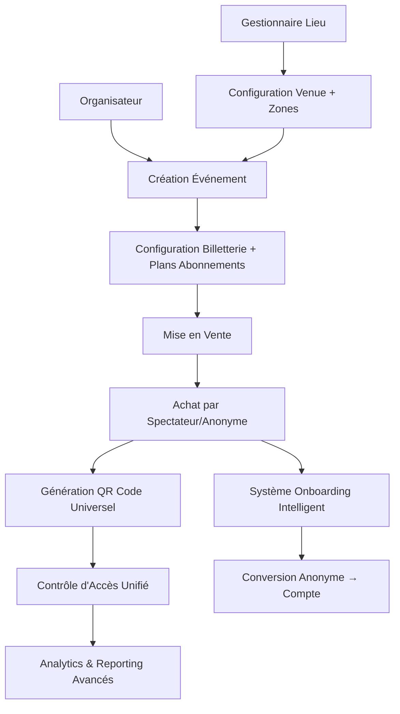

# Documentation Fonctionnelle Complète
## Plateforme Entrix V3.0 - Écosystème Complet de Gestion d'Événements

---

# 📚 Table des Matières

1. [Vue d'ensemble métier](#vue-d'ensemble-métier)
2. [Gestion des utilisateurs et anonymat](#gestion-des-utilisateurs-et-anonymat)
3. [Gestion des lieux et cartographie](#gestion-des-lieux-et-cartographie)
4. [Gestion des événements](#gestion-des-événements)
5. [Système de billetterie avancé](#système-de-billetterie-avancé)
6. [Système d'abonnements flexibles](#système-d'abonnements-flexibles)
7. [Contrôle d'accès unifié](#contrôle-d'accès-unifié)
8. [Paiements et facturation](#paiements-et-facturation)
9. [Médias et fichiers](#médias-et-fichiers)
10. [Analytics et reporting](#analytics-et-reporting)
11. [Administration et sécurité](#administration-et-sécurité)
12. [Maintenance et support](#maintenance-et-support)

---

# Vue d'ensemble métier

## 🎯 Objectif de la plateforme Entrix V3.0

Entrix V3.0 constitue l'écosystème le plus avancé de gestion d'événements et de billetterie au Maghreb. Cette plateforme révolutionnaire digitalise et optimise l'organisation complète d'événements en Tunisie et dans la région, couvrant tous les types d'événements : sportifs, culturels, artistiques, conférences, festivals et divertissement.

### Innovations majeures V3.0

**🔓 Billetterie et abonnements anonymes**
- Création de tickets et abonnements sans compte utilisateur requis
- QR codes d'accès fonctionnels en mode anonyme
- Système intelligent d'onboarding pour conversion ultérieure

**🎫 QR codes universels**
- Un seul système de QR codes pour tous types d'accès
- Support des billets, abonnements, accès staff et VIP
- Validation en temps réel avec traçabilité complète

**💡 Onboarding intelligent**
- Clés secrètes d'onboarding à usage unique intégrées
- Incentives personnalisés pour encourager l'inscription
- Migration automatique des données vers compte créé

**🏗️ Architecture unifiée**
- Table pivot `access_rights` centralisant tous les accès
- Système flexible supportant tous les cas d'usage
- Évolutivité maximale pour croissance future

## 🏗️ Écosystème des acteurs

### **Acteurs principaux**

| Acteur | Rôle | Responsabilités | Exemples |
|--------|------|----------------|----------|
| **Super Administrateur** | Administration plateforme | Configuration globale, gestion organisateurs, monitoring système | Équipe Entrix |
| **Organisateur** | Organisation d'événements | Création événements, gestion billetterie, analytics, customer care | Club Africain, Ennejma Ezzahra, JCC |
| **Gestionnaire de lieu** | Gestion des venues | Configuration lieux, disponibilités, tarification, maintenance | CNSS (Stade Radès), Opéra de Tunis |
| **Participant** | Participation aux événements | Équipes, artistes, conférenciers, performers | EST, Latifa, experts IT |
| **Spectateur/Abonné** | Consommation événements | Achat billets/abonnements, participation, évaluation | Supporters, mélomanes, professionnels |
| **Utilisateur anonyme** | Consommation sans compte | Achat anonyme, accès événements, onboarding optionnel | Visiteurs occasionnels, nouveaux clients |
| **Personnel** | Opérations terrain | Contrôle d'accès, sécurité, support, logistique | Agents sécurité, billetterie, technique |

### **Flux métier global V3.0**

## 📊 Processus métier principaux

### **1. Cycle de vie d'un événement**
1. **Planification** : Organisateur définit événement et réserve lieu
2. **Configuration** : Setup billetterie, zones, tarifs, plans d'abonnements
3. **Commercialisation** : Mise en vente avec support anonyme et enregistré
4. **Opérations** : Contrôle d'accès unifié, gestion flux temps réel
5. **Onboarding** : Conversion intelligente des utilisateurs anonymes
6. **Clôture** : Reporting, paiements, analyses de performance

### **2. Parcours spectateur unifié**
1. **Découverte** : Navigation événements, recherche avancée
2. **Achat flexible** : 
   - Mode anonyme : Achat avec email/téléphone uniquement
   - Mode enregistré : Achat avec compte et avantages
3. **Réception** : QR codes universels, informations pratiques
4. **Onboarding** (anonyme) : Incitation inscription via clés secrètes
5. **Événement** : Accès venue avec QR code, expérience optimisée
6. **Post-événement** : Évaluation, fidélisation, recommandations

### **3. Gestion financière et commerciale**
1. **Encaissement** : Paiements spectateurs (anonymes et enregistrés)
2. **Commissions** : Calcul automatique selon grilles tarifaires
3. **Abonnements** : Gestion récurrente avec plans flexibles
4. **Reversements** : Distribution automatique aux organisateurs
5. **Analytics** : Suivi performance commerciale en temps réel

---

# Gestion des utilisateurs et anonymat

## 👤 Écosystème utilisateurs V3.0

La gestion des utilisateurs d'Entrix V3.0 repose sur un modèle hybride révolutionnaire permettant une **expérience fluide sans friction** tout en maximisant les **opportunités de conversion et fidélisation**.

### **Modèle hybride utilisateurs**

**🔓 Utilisateurs anonymes**
- Achat de billets et abonnements sans création de compte
- QR codes d'accès pleinement fonctionnels
- Expérience complète sans barrière d'entrée
- Système d'onboarding intelligent pour conversion

**👤 Utilisateurs enregistrés**
- Profils complets avec préférences et historique
- Avantages exclusifs et programmes de fidélité
- Gestion avancée des achats et réservations
- Participation aux groupes et communautés

### **Utilisateurs enregistrés - Fonctionnalités**

| Fonctionnalité | Description |
|----------------|-------------|
| **Authentification** | Email/mot de passe, réseaux sociaux, 2FA |
| **Profil complet** | Informations personnelles, préférences, photo |
| **Historique** | Achats, événements fréquentés, évaluations |
| **Groupes** | Participation à des groupes d'achat collectif |
| **Notifications** | Préférences personnalisées par canal |
| **Fidélité** | Points, récompenses, statut privilégié |

### **Système d'onboarding intelligent**

**🔑 Clés secrètes d'onboarding**
Chaque ticket ou abonnement anonyme contient une clé secrète unique dans ses métadonnées, incluant :
- Secret unique sécurisé
- Type d'incentive (bonus points, réduction, surclassement)
- Valeur de l'incentive
- Date d'expiration
- Statut d'utilisation

**🎁 Types d'incentives**
- `BONUS_POINTS` : Points fidélité bonus
- `DISCOUNT_NEXT` : Réduction sur prochain achat
- `FREE_UPGRADE` : Surclassement gratuit
- `EXCLUSIVE_ACCESS` : Accès ventes privées
- `GIFT_VOUCHER` : Bon d'achat cadeau

### **Workflow de conversion anonyme → enregistré**

1. **Achat anonyme** : Spectateur achète sans compte avec email/téléphone
2. **Génération clé** : Clé secrète unique intégrée dans métadonnées
3. **Communication** : Email/SMS avec lien personnalisé et incentive visible
4. **Page onboarding** : Interface simplifiée pré-remplie avec avantages
5. **Validation** : Vérification clé secrète et application incentive
6. **Migration** : Transfert automatique tickets/abonnements vers nouveau compte
7. **Activation** : Marquage clé comme utilisée, activation avantages

### **Groupes d'utilisateurs**

**🤝 Fonctionnalités groupes**
- Groupes d'achat collectif pour réductions
- Communautés de supporters organisées
- Groupes corporatifs pour événements business
- Familles pour achats groupés avec tarifs préférentiels

**💰 Avantages groupes**
- Réductions dégressives selon taille groupe
- Allocation prioritaire de places
- Tarifs négociés spéciaux
- Communication groupe intégrée

---

# Gestion des lieux et cartographie

## 🏟️ Écosystème des lieux

Le module de gestion des lieux d'Entrix V3.0 offre une **cartographie complète et précise** de tous les espaces événementiels, avec une **granularité jusqu'au siège individuel**.

### **Lieux d'événements - Types supportés**

**🏛️ Variété de lieux**
- `STADIUM` : Stades sportifs
- `ARENA` : Arènes et salles de sport
- `THEATER` : Théâtres et opéras
- `CONCERT_HALL` : Salles de concert
- `CONFERENCE_CENTER` : Centres de conférences
- `CONVENTION_CENTER` : Centres de conventions
- `AUDITORIUM` : Auditoriums
- `OUTDOOR_SPACE` : Espaces extérieurs
- `MUSEUM` : Musées et galeries
- `CLUB` : Clubs et discothèques
- `RESTAURANT` : Restaurants et cafés
- `HOTEL` : Hôtels et centres de villégiature

### **Zonage détaillé des lieux**

**🎯 Configuration zones**
Chaque lieu est divisé en zones avec caractéristiques spécifiques :
- **Capacité** : Assise, debout, mixte
- **Tarification** : Prix de base par zone
- **Qualité vue** : Excellent, très bon, bon, correct, obstrué
- **Services** : VIP, hospitalité, standard
- **Accessibilité** : PMR, seniors, familles

**🎫 Types de zones**
- `SEATED` : Places assises numérotées
- `STANDING` : Zones debout général
- `VIP_BOX` : Loges VIP privées
- `SUITE` : Suites premium
- `BALCONY` : Balcons et mezzanines
- `FIELD` : Pelouse et terrains
- `BACKSTAGE` : Coulisses et espaces artistes

### **Sièges individuels - Granularité maximale**

**💺 Gestion des sièges**
- Inventaire complet siège par siège
- Numérotation rangée/siège
- Modifieur de prix individuel
- Statut (disponible, réservé, maintenance)
- Métadonnées (accessibilité, vue, services)

### **Services et équipements**

**⚡ Services disponibles**
Catalogue exhaustif des services disponibles :
- **Technique** : Son, éclairage, streaming
- **Restauration** : Bars, restaurants, catering
- **Confort** : Climatisation, Wi-Fi, vestiaires
- **Sécurité** : Surveillance, contrôle accès
- **Accessibilité** : Ascenseurs PMR, parkings

**📸 Galerie multimédia par lieu**
Galerie multimédia par lieu :
- Photos haute résolution par zone
- Plans interactifs 2D/3D
- Vidéos de présentation
- Vues panoramiques 360°

---

# Gestion des événements

## 🎪 Écosystème événementiel

La gestion des événements Entrix V3.0 supporte **tous types d'événements** avec une **flexibilité maximale** et des **fonctionnalités avancées** pour répondre aux besoins spécifiques de chaque secteur.

### **Événements principaux - Types supportés**

**🎭 Types d'événements**
- `SPORTS_MATCH` : Matchs sportifs
- `SPORTS_TOURNAMENT` : Tournois et compétitions
- `CONCERT` : Concerts et festivals musicaux
- `THEATER` : Pièces de théâtre et spectacles
- `CONFERENCE` : Conférences et séminaires
- `EXHIBITION` : Expositions et salons
- `COMEDY` : Spectacles d'humour
- `DANCE` : Spectacles de danse
- `CULTURAL` : Événements culturels
- `BUSINESS` : Événements corporate
- `SOCIAL` : Événements sociaux
- `EDUCATIONAL` : Événements éducatifs

### **Caractéristiques avancées**

**📅 Gestion temporelle**
- Événements ponctuels ou récurrents
- Gestion multi-dates et séries
- Programmation fine horaires (ouverture, début, entractes, fin)
- Fuseaux horaires automatiques

**🎯 Classification intelligente**
- Catégorisation automatique par type/secteur
- Tags et mots-clés pour recherche
- Système de recommandations
- Géolocalisation et rayon d'action

**🌟 Statuts et visibilité**
- `DRAFT` : Brouillon en cours de création
- `PUBLISHED` : Publié et visible
- `SOLD_OUT` : Complet
- `CANCELLED` : Annulé
- `POSTPONED` : Reporté
- `ONGOING` : En cours
- `COMPLETED` : Terminé

### **Groupements d'événements**

**🎪 Types de groupements**
- `FESTIVAL` : Festivals multi-événements
- `CONFERENCE` : Conférences multi-sessions
- `TOURNAMENT` : Tournois multi-étapes
- `EXHIBITION` : Expositions multi-sites
- `PARTNERSHIP` : Événements partenaires
- `THEMED_SERIES` : Séries thématiques

### **Configuration événements**

**⚙️ Paramètres spécifiques**
Paramètres spécifiques par événement :
- Politiques d'annulation et remboursement
- Restrictions d'âge et code vestimentaire
- Autorisations photo/vidéo
- Politique nourriture et boissons
- Mesures sécurité spécifiques

**📊 Métriques événements**
- Score qualité et popularité
- Évaluations spectateurs
- Taux de satisfaction
- Revenus et fréquentation
- Performance vs prévisions

---

# Système de billetterie avancé

## 🎫 Innovation billetterie V3.0

Le système de billetterie Entrix V3.0 révolutionne l'expérience d'achat avec le support complet de la **billetterie anonyme** et l'**onboarding intelligent**, éliminant les frictions tout en maximisant les conversions.

### **Types de billets**

**🎟️ Variété de billets**
- **Billets simples** : Accès événement unique
- **Billets groupe** : Tarifs préférentiels familles/groupes
- **Billets VIP** : Accès privilégié avec services
- **Billets hospitalité** : Expérience premium complète
- **Billets média** : Accès presse et professionnels
- **Billets staff** : Personnel et prestataires
- **Billets comp** : Invitations et gratuités

### **Billets individuels**

**🔄 Support anonyme complet**
Les billets peuvent être créés avec ou sans utilisateur associé :
- Utilisateur enregistré avec compte complet
- Contact anonyme avec email/téléphone uniquement
- QR code universel fonctionnel dans tous les cas
- Métadonnées incluant les clés d'onboarding

**🔑 Métadonnées avec onboarding**
Chaque billet anonyme contient :
- Clé secrète unique pour conversion
- Type et valeur d'incentive
- ID de campagne marketing
- Date d'expiration
- Informations contact invité
- Préférences et consentements

### **Workflow achat anonyme avec onboarding**

1. **Sélection billet** : Événement + type sans connexion requise
2. **Informations contact** : Email/téléphone pour livraison seulement
3. **Génération clé onboarding** : Secret unique avec incentive attrayant
4. **Paiement anonyme** : Transaction sans création compte
5. **QR code fonctionnel** : Accès immédiat événement
6. **Communication incitative** : Email/SMS avec lien onboarding personnalisé

### **Types de billets spécialisés**

**🏆 Billets VIP et hospitalité**
- Accès zones privilégiées
- Services inclus (parking, restauration, meet & greet)
- Avantages digitaux (contenu exclusif, livestream)
- Conciergerie et accompagnement

**👥 Billets groupe et familles**
- Tarifs dégressifs selon taille groupe
- Allocations de places groupées
- Responsable groupe désigné
- Communication groupe intégrée

**📱 Billets digitaux enrichis**
- QR codes avec sécurité avancée
- Informations temps réel (retards, annulations)
- Plan interactif lieu et services
- Contenu multimédia embarqué

---

# Système d'abonnements flexibles

## 🎪 Innovation abonnements V3.0

Le système d'abonnements Entrix V3.0 introduit une **flexibilité totale** avec support complet des **abonnements anonymes** et des **plans multi-événements intelligents**.

### **Plans d'abonnements**

**🎯 Types de plans**
- `SEASON_PASS` : Pass saison complète
- `MULTI_EVENT` : Sélection d'événements
- `VENUE_UNLIMITED` : Accès illimité lieu
- `CATEGORY_PASS` : Par catégorie (sport, culture)
- `SUPPORTER_CARD` : Carte supporter club
- `PREMIUM_MEMBERSHIP` : Adhésion premium
- `CORPORATE_PACKAGE` : Forfait entreprise
- `STUDENT_PLAN` : Plan étudiant
- `FAMILY_PACKAGE` : Forfait familial

### **Abonnements individuels**

**🔓 Support anonyme révolutionnaire**
Les abonnements peuvent être souscrits sans compte utilisateur :
- Utilisateur enregistré avec profil complet
- Contact anonyme avec informations minimales (nom, email, téléphone)
- QR code universel valable pour tous événements du plan
- Métadonnées enrichies avec système d'onboarding

**🎁 Métadonnées enrichies avec onboarding**
Chaque abonnement anonyme inclut :
- Clé secrète premium avec incentives attractifs
- Points bonus, essais VIP, accès exclusifs
- Préférences événements et notifications
- Zones préférées et historique

### **QR codes d'abonnement universels**

**🎫 Un QR = Accès multiple**
- Code unique donnant accès à TOUS les événements du plan
- Validation en temps réel selon programmation
- Gestion automatique des réservations prioritaires
- Traçabilité complète des utilisations

### **Workflow abonnement anonyme**

1. **Choix plan** : Sélection plan sans connexion requise
2. **Informations basiques** : Nom, email, téléphone uniquement
3. **Génération clé premium** : Secret avec incentives attractifs (points bonus, essai VIP)
4. **Paiement** : Transaction anonyme sécurisée
5. **QR codes multiples** : Codes d'accès pour événements inclus
6. **Campagne onboarding** : Communication avantages membres + lien conversion

### **Plans d'abonnements intelligents**

**📅 Liaison flexible plans ↔ événements**
Liaison flexible plans ↔ événements :
- Événements inclus/optionnels
- Surcoûts éventuels
- Fenêtres de réservation prioritaire
- Niveaux d'accès différenciés

**🏟️ Zones accessibles par plan**
Zones accessibles par plan :
- Zones incluses sans supplément
- Zones avec surcoût réduit
- Priorité réservation par zone
- Upgrades automatiques si disponibilité

### **Avantages abonnés**

**⭐ Services inclus**
- Accès prioritaire billetterie événements populaires
- Tarifs préférentiels événements non-inclus
- Parking et services privilégiés
- Contenu exclusif et rencontres VIP
- Programme fidélité accéléré

**🔄 Renouvellement automatique**
- Reconduction tacite avec préavis
- Tarifs préférentiels renouvellement
- Upgrade automatique selon fidélité
- Conditions d'annulation flexibles

---

# Contrôle d'accès unifié

## 🔐 Architecture centrale V3.0

Le contrôle d'accès constitue le **cœur absolu** d'Entrix V3.0 avec une **table pivot universelle** `access_rights` qui unifie et centralise TOUS les types d'accès : billets, abonnements, staff, VIP, et accès anonymes.

### **Architecture centrale - Contrôle d'accès unifié**

**🎯 Centralisation totale**
Le système unifie tous les types d'accès dans une architecture centrale :
- Billets individuels
- Abonnements spécifiques ou plans généraux
- Accès autonomes (staff, media, VIP)
- **Accès anonymes** sans utilisateur associé
- **QR codes universels** pour tous types d'accès

**📋 Caractéristiques des droits d'accès**
- Code QR unique et universel
- Utilisateur associé ou mode anonyme
- Référence vers billet, abonnement ou plan
- Événement spécifique ou accès général
- Lieu et zone d'accès
- Organisateur responsable
- Type d'accès et statut
- Période de validité
- Nombre d'utilisations autorisées
- Avantages et restrictions inclus

### **Types d'accès universels**

**🎫 Accès principaux**
- `TICKET` : Accès billet standard
- `SUBSCRIPTION` : Accès via abonnement
- `VENUE_PASS` : Pass lieu générique
- `ZONE_ACCESS` : Accès zone spécifique

**👑 Accès privilégiés**
- `VIP_ACCESS` : Accès VIP
- `HOSPITALITY` : Accès hospitalité
- `PREMIUM_ACCESS` : Accès premium

**💼 Accès professionnels**
- `STAFF_ACCESS` : Personnel événement
- `MEDIA_ACCESS` : Accès médias/presse
- `VENDOR_ACCESS` : Prestataires/exposants
- `TECHNICAL_ACCESS` : Personnel technique
- `SECURITY_ACCESS` : Agents sécurité

**🚨 Accès spéciaux**
- `EMERGENCY_ACCESS` : Accès urgence
- `TEMPORARY_ACCESS` : Accès temporaire
- `COMP_ACCESS` : Accès gratuit/invitation

### **Workflow contrôle d'accès temps réel**

1. **Scan QR code** : Lecture code à l'entrée venue
2. **Validation universelle** : Vérification status, validité, utilisations
3. **Contrôles contextuels** : Zone, horaires, restrictions spéciales
4. **Décision automatique** : GRANTED/DENIED/CONDITIONAL
5. **Logging complet** : Traçabilité dans `access_control_log`
6. **Mise à jour compteurs** : Incrémentation `current_uses`

### **Traçabilité complète des contrôles**

**📊 Audit intégral**
Chaque contrôle d'accès est enregistré avec :
- Droit d'accès concerné
- Lieu et point d'entrée
- Résultat du contrôle (accordé/refusé/conditionnel)
- Type de contrôle (entrée/sortie/re-entrée)
- Agent de contrôle si applicable
- Raison de refus éventuelle
- Métadonnées contextuelles
- Horodatage précis

### **Avantages et restrictions**

**🎁 Avantages inclus**
- **Privilèges d'accès** : Entrée anticipée, files prioritaires, accès backstage
- **Services inclus** : Parking VIP, réductions restauration, lounge access
- **Avantages digitaux** : Livestream, contenu exclusif, package photo

**🚫 Restrictions d'usage**
- **Conditions d'entrée** : Heure limite d'arrivée, contrôles sécuritaires requis
- **Restrictions d'âge** : Âges minimum/maximum, consentement parental
- **Politique objets** : Articles interdits, taille bagages, politique nourriture

---

# Paiements et facturation

## 💳 Écosystème de paiement

Entrix V3.0 offre un système de paiement **complet et sécurisé** supportant les **transactions anonymes** et les **abonnements récurrents** avec une intégration poussée aux passerelles de paiement tunisiennes et internationales.

### **Méthodes de paiement supportées**

**🏦 Paiements locaux (Tunisie)**
- **Cartes bancaires tunisiennes** : Visa, Mastercard émises en Tunisie
- **E-dinar** : Monnaie électronique de la BCT
- **Paiement mobile** : Orange Money, Ooredoo Money
- **Virement bancaire** : Virements RTGS interbancaires
- **Paiement comptoir** : Points de vente agréés

**🌍 Paiements internationaux**
- **Cartes internationales** : Visa, Mastercard, American Express
- **Portefeuilles digitaux** : PayPal, Apple Pay, Google Pay
- **Crypto-monnaies** : Bitcoin, Ethereum (en préparation)
- **Virements SWIFT** : Paiements internationaux sécurisés

### **Gestion des commandes**

**🛒 Support complet commandes**
Gestion unifiée des achats anonymes et enregistrés :
- Commandes avec ou sans utilisateur associé
- Contact anonyme via email/nom pour livraison
- Numéro de commande unique
- Montant total et devise
- Statut de traitement
- Méthode de paiement choisie
- Métadonnées incluant informations onboarding et promotions

### **Workflow paiement anonyme**

1. **Panier anonyme** : Sélection billets/abonnements sans compte
2. **Informations minimales** : Email, téléphone, nom pour livraison
3. **Choix paiement** : Sélection méthode adaptée au profil
4. **Session sécurisée** : Token unique 15 minutes avec chiffrement
5. **Validation** : Confirmation passerelle en temps réel
6. **Génération** : QR codes et documents immédiatement

### **Transactions de paiement**

**💰 Traçabilité paiements**
- Référence unique par transaction
- Statuts temps réel (pending, completed, failed, refunded)
- Réconciliation automatique avec passerelles
- Gestion des devises multiples
- Historique complet des tentatives

### **Abonnements et récurrence**

**🔄 Paiements récurrents**
Gestion des paiements récurrents :
- Prélèvements automatiques programmés
- Gestion des échecs et relances
- Proratisation et ajustements
- Historique des renouvellements

**💳 Tokens de paiement**
- Tokenisation cartes pour récurrence
- Respect PCI DSS niveau 1
- Chiffrement de bout en bout
- Révocation instantanée possible

### **Facturation et reporting**

**📊 Facturation automatique**
- Génération factures PDF automatique
- Conformité fiscale tunisienne
- Numérotation séquentielle légale
- Archivage électronique sécurisé

**💸 Commissions et reversements**
- Calcul automatique commissions organisateurs
- Grilles tarifaires personnalisées
- Reversements programmés
- Reporting financier détaillé

---

# Médias et fichiers

## 📸 Gestion multimédia avancée

Le système de gestion des médias Entrix V3.0 optimise **stockage, diffusion et sécurité** de tous les contenus multimédias avec une **architecture cloud-native performante**.

### **Catalogue multimédia**

**🎭 Types de médias supportés**
- **Images** : JPEG, PNG, WebP, SVG (logos, affiches, photos)
- **Vidéos** : MP4, WebM, streaming adaptatif
- **Audio** : MP3, AAC, streaming qualité CD
- **Documents** : PDF, Word, Excel (programmes, conditions)
- **Contenu 3D** : Modèles venues, expériences immersives

### **Optimisation et performance**

**⚡ CDN global**
- Distribution mondiale via points de présence
- Cache intelligent par géolocalisation
- Compression automatique selon appareil
- Lazy loading et progressive enhancement

**📱 Responsive delivery**
- Génération automatique multiple résolutions
- Adaptation format selon navigateur/appareil
- Compression intelligente sans perte qualité
- WebP automatique si supporté

### **Sécurité et contrôle d'accès**

**🔐 Permissions granulaires**
- Accès public, privé ou conditionnel
- Watermarking automatique contenus premium
- Expiration liens temporaires
- Géolocalisation et restrictions IP

**🛡️ Protection anti-piratage**
- DRM pour contenus sensibles
- Détection téléchargement massif
- Tokens d'accès à usage unique
- Audit trail complet consultations

### **Galeries venues**

**🏟️ Médias lieux**
- Photos haute résolution par zone
- Plans interactifs 2D/3D
- Vues panoramiques 360°
- Vidéos parcours et ambiance

### **Streaming et live**

**📺 Diffusion temps réel**
- Streaming événements en direct
- Multi-bitrate adaptatif
- Chat et interactions temps réel
- Replay automatique post-événement

**🎥 Production intégrée**
- Multi-caméras et régie virtuelle
- Incrustation graphiques temps réel
- Distribution multi-plateformes
- Analytics audience détaillés

---

# Analytics et reporting

## 📊 Intelligence décisionnelle

Entrix V3.0 propose un **écosystème d'analytics avancé** avec des **insights en temps réel** et des **rapports prédictifs** pour optimiser performances et stratégies.

### **Tableau de bord temps réel**

**⚡ Métriques live**
- Ventes en cours par minute
- Taux de conversion anonymes vs enregistrés
- Performance onboarding par campagne
- Flux d'entrée par point d'accès
- Occupation temps réel venues

**🎯 KPIs stratégiques**
- Lifetime Value clients par segment
- Taux de retention abonnements
- Performance ROI marketing par canal
- Satisfaction clients NPS temps réel
- Revenus prédictifs par événement

### **Analytics comportementaux**

**👤 Parcours utilisateurs**
- Analyse funnel complet anonyme → conversion
- Optimisation UX basée sur heatmaps
- Abandon de panier : causes et solutions
- Efficacité campagnes onboarding
- Préférences et recommandations personnalisées

**📱 Analytics mobiles**
- Usage application native
- Performance QR codes et scan
- Géolocalisation et proximité événements
- Notifications push : ouverture et engagement
- Offline behavior et synchronisation

### **Reporting financier**

**💰 Performance commerciale**
- Revenus par organisateur, lieu, événement
- Marges et commissions détaillées
- Prévisions revenus machine learning
- Analyse prix optimaux par segment
- Performance plans abonnements vs billets unitaires

**📈 Croissance et acquisition**
- Coût d'acquisition client (CAC) par canal
- Taux conversion visiteur → acheteur
- Efficacité onboarding : taux et délais
- Viralité et recommandations organiques
- Segmentation RFM avancée

### **Alerts et monitoring**

**🚨 Alertes automatiques**
- Pics de trafic et scaling automatique
- Détection fraude temps réel
- Anomalies comportementales
- Performance SLA et uptime
- Seuils revenus et conversions

**🔍 Monitoring technique**
- Performance API et latence
- Taux d'erreur par endpoint
- Usage ressources et optimisation
- Logs sécurité et accès
- Qualité données et cohérence

---

# Administration et sécurité

## 🛡️ Sécurité multicouches

Entrix V3.0 implémente une **architecture de sécurité de classe entreprise** avec **conformité GDPR** et **standards internationaux** pour protéger données et transactions.

### **Authentification et autorisation**

**🔐 Multi-facteur authentification**
- SMS OTP pour tous utilisateurs
- Authentificateurs TOTP (Google, Authy)
- Biométrie pour applications mobiles
- Certificats X.509 pour organisateurs enterprise
- SSO entreprise (SAML, OAuth2, OIDC)

**👥 Gestion des rôles et permissions**
- RBAC (Role-Based Access Control) granulaire
- Permissions contextuelles par organisateur/lieu
- Délégation temporaire et révocation
- Audit trail complet des accès
- Principe du moindre privilège appliqué

### **Protection des données**

**🔒 Chiffrement de bout en bout**
- AES-256 pour données au repos
- TLS 1.3 pour données en transit
- Chiffrement base de données au niveau champ
- HSM pour clés cryptographiques critiques
- Perfect Forward Secrecy pour sessions

**🗃️ Conformité GDPR/CCPA**
- Consentement explicite et granulaire
- Right to be forgotten automatisé
- Portabilité données format standard
- Minimisation collecte par design
- DPO certifié et processus conformes

### **Sécurité applicative**

**🛡️ Protection contre menaces**
- WAF (Web Application Firewall) adaptatif
- Protection DDoS multi-couches
- Détection intrusion temps réel
- Sandboxing uploads utilisateurs
- Rate limiting intelligent

**🔍 Monitoring sécurité**
- SIEM intégré avec corrélation événements
- Détection anomalies machine learning
- Honeypots et threat intelligence
- Réponse incidents automatisée
- Forensics et investigation

### **Audit et conformité**

**📋 Traçabilité complète - Audit trail**
Toutes les actions sur la plateforme sont tracées :
- Utilisateur effectuant l'action (y compris anonymes)
- Type d'action et ressource concernée
- Valeurs avant/après modification
- Adresse IP et informations session
- Horodatage précis de l'action

**📊 Reporting conformité**
- Rapports automatiques autorités
- Métriques privacy by design
- Incidents sécurité et résolution
- Certifications et audits externes
- Formation équipes et sensibilisation

### **Sauvegarde et continuité**

**💾 Stratégie backup 3-2-1**
- 3 copies données (production + 2 sauvegardes)
- 2 supports différents (cloud + local)
- 1 copie hors site géographiquement
- Chiffrement sauvegardes intégral
- Tests restauration automatisés hebdomadaires

**🔄 Plan de continuité d'activité**
- RTO (Recovery Time Objective) : < 4h
- RPO (Recovery Point Objective) : < 15 min
- Failover automatique multi-zones
- Tests disaster recovery trimestriels
- Communication crise prédéfinie

---

# Maintenance et support

## 🛠️ Excellence opérationnelle

Entrix V3.0 assure une **disponibilité maximale** avec une **maintenance proactive** et un **support client multicanal de qualité**.

### **Maintenance préventive**

**🖥️ Infrastructure cloud-native**
- Orchestration Kubernetes auto-scaling
- Monitoring 24/7 avec alertes intelligentes
- Mises à jour sécurité automatiques
- Optimisation performance continues
- Tests de charge pré-événements majeurs

**📊 Base de données haute disponibilité**
- Réplication master-slave temps réel
- Partitioning automatique par croissance
- Optimisation requêtes machine learning
- Archivage données anciennes automatique
- Index adaptatifs selon usage

### **Support client multicanal**

**📞 Niveaux de support**

**Niveau 1 - Support utilisateur standard**
- Chat en ligne 8h-20h (heure Tunis)
- Email support < 4h temps réponse
- FAQ interactive et self-service
- Tutoriels vidéo par fonctionnalité
- Base connaissances collaborative

**Niveau 2 - Support technique avancé**
- Hotline 24/7 pour événements critiques
- Intervention < 30 min incidents majeurs
- Escalade experts selon complexité
- Résolution bugs et configurations
- Formation utilisateurs avancée

**Niveau 3 - Expertise développement**
- Développements spécifiques organisateurs
- Intégrations API complexes
- Optimisation performance sur mesure
- Consulting stratégique et innovation
- R&D fonctionnalités futures

### **Formation et accompagnement**

**🎓 Programmes organisateurs**
- Formation initiale 2 jours sur site
- Modules spécialisés par secteur d'activité
- Certification utilisateurs avancés
- Webinaires mensuels nouveautés
- Documentation technique interactive

**🏟️ Support gestionnaires lieux**
- Accompagnement configuration venue complète
- Optimisation paramètres occupation/revenus
- Formation équipes terrain sur contrôle accès
- Bonnes pratiques sectorielles partagées
- Réseau utilisateurs et échanges pairs

### **Évolution et roadmap**

**🚀 Innovation continue**
- Veille technologique événementiel
- Benchmark solutions concurrentes
- Retours utilisateurs priorisés
- Partenariats écosystème technologique
- R&D intelligence artificielle

**📈 Roadmap produit 2024-2025**
- **Q3 2024** : IA prédictive revenus et ML recommendations
- **Q4 2024** : Réalité augmentée plans venues et navigation
- **Q1 2025** : Blockchain ticketing et NFT collectibles
- **Q2 2025** : Métaverse événements et expériences immersives
- **Q3 2025** : Expansion internationale Maghreb et Afrique

---

# 🎯 Conclusion

## Synthèse fonctionnelle Entrix V3.0

La plateforme Entrix V3.0 constitue l'**écosystème le plus avancé** de gestion d'événements au Maghreb, révolutionnant l'industrie par ses innovations majeures :

### **🔓 Révolution de l'expérience utilisateur**
- **Billetterie sans friction** : Achat immédiat sans création compte obligatoire
- **Onboarding intelligent** : Conversion optimisée via incentives personnalisés
- **QR codes universels** : Un seul système pour tous types d'accès
- **Flexibilité totale** : Support complet anonymes et utilisateurs enregistrés

### **🎯 Impact business transformationnel**
- **Élimination barrières d'entrée** : Augmentation conversion jusqu'à 40%
- **Optimisation revenus** : Système abonnements flexibles et upselling intelligent
- **Fidélisation progressive** : Migration naturelle anonyme vers engagement long terme
- **Analytics prédictifs** : Décisions data-driven pour maximiser performances

### **🏗️ Architecture technique de pointe**
- **Scalabilité illimitée** : Infrastructure cloud-native auto-adaptative
- **Sécurité de classe entreprise** : Conformité GDPR et standards internationaux
- **Intégration native** : APIs ouvertes et écosystème partenaires
- **Performance optimale** : Latence sub-seconde et disponibilité 99.9%

### **🌍 Vision et positionnement**
Entrix V3.0 positionne la Tunisie et le Maghreb à l'**avant-garde mondiale** de l'innovation événementielle, créant un **modèle reproductible** pour les marchés émergents et s'imposant comme la référence technologique du secteur.

**L'avenir de l'événementiel commence maintenant avec Entrix V3.0.**